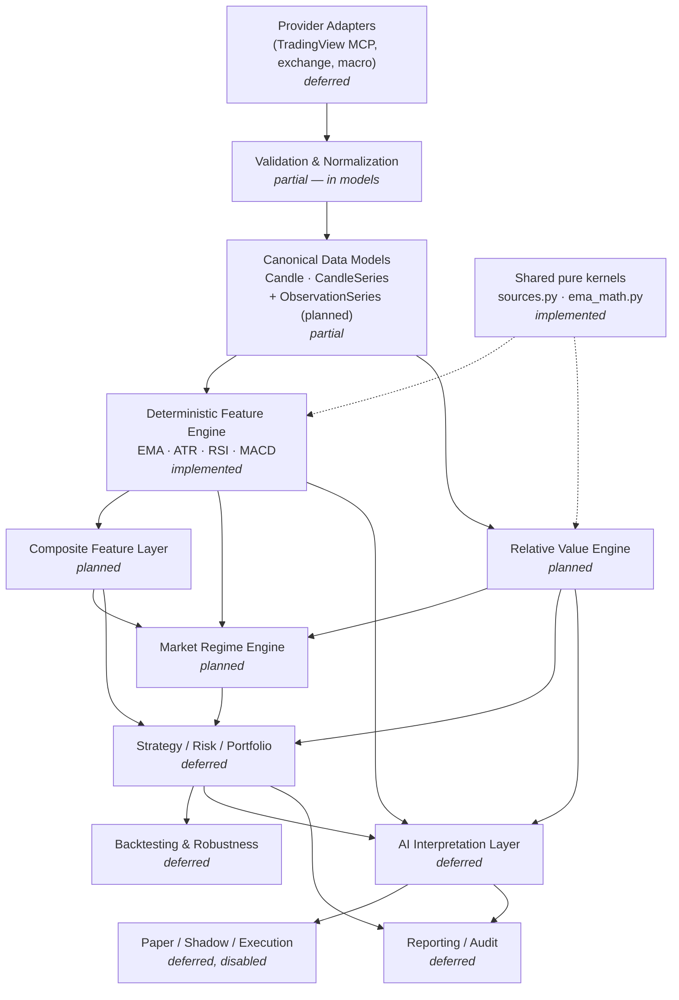

# Architecture and Roadmap V1

**Status:** Proposal (architecture and planning only — no production code changes)
**Date:** 2026-07-23
**Repository baseline:** `e0ba4c1b7bbc66c7fa814119ee45654cf603cff4` (MACD milestone), 147 passing tests
**Supersedes:** nothing. Complements [PROJECT_SPECIFICATION_V1.md](../PROJECT_SPECIFICATION_V1.md),
[PROJECT_VISION_ADDENDUM_V1.md](../PROJECT_VISION_ADDENDUM_V1.md) and
[CURRENT_SYSTEM_AUDIT_V1.md](CURRENT_SYSTEM_AUDIT_V1.md), none of which are modified by this document.

> **Naming/location note.** The task suggested `docs/architecture/FMITS_ARCHITECTURE_AND_ROADMAP_V1.md`.
> This repository's established convention is a **flat `docs/` directory** (no subdirectories) with
> `UPPERCASE_SNAKE_V1.md` for authoritative documents (`CURRENT_SYSTEM_AUDIT_V1.md`) and lowercase for
> informal notes (`SETUP.md`, `analysis-notes.md`). `PROJECT_SPECIFICATION_V1.md` §21 also names
> `ARCHITECTURE.md` as a recommended core document and mandates version suffixes rather than silent
> overwrites. This document therefore follows the existing convention. The `FMITS_` prefix is dropped as
> redundant inside the project's own repository.

---

# 1. Purpose and scope

## What this document governs

- The **target module boundaries** for the system as it grows beyond the current indicator library.
- The **permitted dependency direction** between layers.
- The **specification of the future Relative Value Engine (RVE)** as a deterministic analytical module.
- A **near-term, small-milestone roadmap** with acceptance criteria.
- **Key architectural decisions** and the reasoning behind them.

## What this document deliberately does not govern

- It does **not** change, rename, move, or delete any existing code. Nothing in `src/` was modified.
- It does **not** authorize implementation. Every module below carries an explicit status; most are
  `planned` or `deferred`.
- It does **not** define trading strategies, entry/exit rules, thresholds, or signals.
- It does **not** define live execution. Execution remains out of scope by project principle.
- It does **not** replace `PROJECT_SPECIFICATION_V1.md` (vision/principles) or
  `CURRENT_SYSTEM_AUDIT_V1.md` (historical audit of the pre-code repository state).
- It does **not** prescribe exact class names or file layouts for unimplemented modules; those are
  decided at implementation time, guided by the boundaries here.

---

# 2. Current repository state

Everything in this section was verified by direct inspection of the working tree at the baseline commit.

## 2.1 Package/module map

```
src/fmis/
├── __init__.py                         # package metadata only (__version__)
├── data/
│   ├── __init__.py                     # re-exports Candle, CandleSeries
│   └── models.py                       # Candle, CandleSeries (frozen, validated)
└── features/
    ├── __init__.py                     # public surface + scope-boundary doc
    ├── types.py                        # FeatureValue, FeatureCategory, regime enums,
    │                                   #   FeatureResult, FeatureContext, FeatureSet,
    │                                   #   Feature (Protocol), BaseFeature (ABC)
    ├── registry.py                     # FeatureRegistry (name -> Feature)
    ├── feature_engine/
    │   ├── __init__.py
    │   └── engine.py                   # FeatureEngine.compute + _resolve_order
    ├── indicators/                     # Tier 1: raw TA primitives (IMPLEMENTED)
    │   ├── __init__.py                 # exports EMA, ATR, RSI, MACD
    │   ├── sources.py                  # VALID_SOURCES (shared OHLC vocabulary)
    │   ├── ema_math.py                 # ema_series() — shared EMA math
    │   ├── ema.py                      # ExponentialMovingAverage
    │   ├── atr.py                      # AverageTrueRange (Wilder)
    │   ├── rsi.py                      # RelativeStrengthIndex (Wilder)
    │   └── macd.py                     # MovingAverageConvergenceDivergence
    ├── trend/                          # Tier 2 placeholder — docstring + TODO only
    ├── momentum/                       # Tier 2 placeholder
    ├── volatility/                     # Tier 2 placeholder
    ├── volume/                         # Tier 2 placeholder
    ├── market_structure/               # Tier 2 placeholder
    ├── support_resistance/             # Tier 2 placeholder
    └── pattern_detection/              # Tier 2 placeholder
```

The seven Tier-2 packages contain a module docstring, a planned-features `TODO` list and
`__all__: list[str] = []`. **No calculation code exists in them.**

Outside `src/`:

```
tests/                 8 test modules, 147 tests, + tests/fixtures/btcusdt_4h.json (20 closed 4H candles)
docs/                  SETUP.md, analysis-notes.md, CURRENT_SYSTEM_AUDIT_V1.md, this document
prompts/               swing-trading-analyzer-v3.md (AI prototype, not wired to Python)
scripts/               tradingview-launcher.sh (launches TradingView Desktop with CDP port)
config/                mcp.json.example (redacted MCP config template)
pyproject.toml         package + pytest config; zero runtime dependencies; pytest as only dev dep
.python-version        3.12 ; uv.lock pins the environment
```

## 2.2 Current internal dependency graph (verified)

```
fmis.data.models                    (no internal imports — leaf)
        ↑
fmis.features.types                 (imports fmis.data)
        ↑                    ↖
fmis.features.registry        fmis.features.indicators.*   (import types, + ema_math, sources)
        ↑                    ↗
fmis.features.feature_engine.engine (imports fmis.data, registry, types)

fmis.features.indicators.sources    (no internal imports — leaf)
fmis.features.indicators.ema_math   (no internal imports — leaf)
```

This is already a clean, acyclic, one-way graph. **No module imports "upward".** There are no
provider-specific, AI, strategy, or execution imports anywhere.

## 2.3 Current data flow

```
CandleSeries (validated, ordered)
    │  FeatureEngine.compute(series, names, sources=...)
    ▼
series.closed()                       ← closed-candle enforcement (engine level)
    │
    ├─ _resolve_order(requested)      ← topological sort; rejects unknown features and cycles
    ▼
for each Feature in order:
    FeatureContext(primary=closed_series, computed=<results so far>, sources=<aux>)
        → Feature.compute(context) → FeatureResult
    ▼
FeatureSet(symbol, timeframe, as_of=<last closed candle timestamp>, features={name: FeatureResult})
```

## 2.4 Current Feature lifecycle

1. **Construction** — a feature instance is one fixed parameter set (e.g. `EMA(20, "close")`).
   Parameters are validated in `__init__` (positive int, `bool` rejected, source in `VALID_SOURCES`).
   The instance derives a **stable deterministic name** (`ema_20`, `rsi_close_14`, `macd_close_12_26_9`).
2. **Registration** — added to a `FeatureRegistry`; duplicate names raise.
3. **Resolution** — the engine expands `dependencies` into a deterministic topological order.
4. **Computation** — `compute(context)` reads `context.primary.closed()` (defensively idempotent),
   returns exactly one `FeatureResult`.
5. **Result** — immutable: `FeatureResult` is a frozen dataclass and its `metadata` is wrapped in a
   defensively-copied `MappingProxyType`.
6. **Assembly** — results are collected into a `FeatureSet` stamped with the last closed candle time.

## 2.5 Current deterministic indicators (implemented)

| Indicator | Parameters | Convention | Warm-up (closed candles) | Value shape |
|---|---|---|---|---|
| EMA | `period`, `source` | SMA seed, `k = 2/(period+1)` | `period` | scalar `float` |
| ATR | `period` (default 14) | Wilder; TR needs prior close | `period + 1` | scalar `float` |
| RSI | `period` (14), `source` | Wilder; explicit 100/0/50 zero policy | `period + 1` | scalar `float` |
| MACD | `fast`/`slow`/`signal` (12/26/9), `source` | shared `ema_series`; SMA seed | `slow + signal − 1` (34) | immutable mapping `{macd_line, signal_line, histogram}` |

All four: closed candles only; pure arithmetic (deterministic); no third-party TA library; explicit
insufficient-data state (`value=None` plus metadata); provenance string in metadata.

## 2.6 Test baseline

**147 passed** across 8 modules: `test_data_models.py` (40), `test_ema.py` (27), `test_macd.py` (24),
`test_rsi.py` (22), `test_atr.py` (15), `test_features_architecture.py` (12), `test_ema_math.py` (5),
`test_smoke.py` (2). Expected values are hand-calculated or derived from independent references
(arithmetic mean, exact fractions), never by calling the production implementation.

## 2.7 TradingView MCP role

TradingView MCP is used **only** through Claude Code: `scripts/tradingview-launcher.sh` opens a CDP
debug port, a third-party MCP server (installed outside this repository) attaches to it, and the v3
prompt drives the analysis. **There is currently zero coupling between TradingView MCP and `src/`** —
no TradingView types, no adapter code, no imports. That is presently an architectural *strength*: no
provider type has leaked into the domain model. It is also a *gap*: no automated path exists from
TradingView data into the Feature Engine.

## 2.8 Architectural strengths

- Clean acyclic dependency graph; the domain layer (`fmis.data`) imports nothing internal.
- Strong immutability discipline (frozen dataclasses, `MappingProxyType` metadata, tuple candle storage).
- Closed-candle rule enforced at two levels (engine and each feature) — idempotent, no repainting.
- Explicit, documented warm-up and insufficient-data semantics on every indicator.
- Registry-based discovery: the engine never imports a concrete feature (open/closed).
- Shared kernels (`sources.py`, `ema_math.py`) prevent divergent re-implementations.
- Provenance and parameters recorded in every result's metadata.
- Zero runtime dependencies; reproducible environment (`.python-version` + `uv.lock`).
- Scope boundary is explicitly documented and test-enforced (`FeatureCategory` is technical-only).

## 2.9 Current limitations

1. **Single-series by construction.** `FeatureContext.primary` is one `CandleSeries`;
   `FeatureSet` identity is `(symbol, timeframe, as_of)`. Nothing in the current abstraction can
   express a *relationship between two instruments* as a first-class result.
2. **No non-OHLCV time-series model.** Macro series (M2, DXY, real yields) are not OHLC candles;
   there is no canonical model for a plain observation series.
3. **No alignment machinery.** No timestamp intersection, calendar handling, or vintage/revision logic.
4. **No data ingestion.** Nothing populates a `CandleSeries` from any provider; tests build them by hand
   or from `tests/fixtures/btcusdt_4h.json`.
5. **No persistence.** No analysis is recorded, so nothing is measurable over time.
6. **Tier-2 packages are empty.** Trend/momentum/volatility/etc. exist as documented placeholders only.
7. **No multi-timeframe composition.** A `FeatureSet` is single-timeframe by design; nothing composes
   1W/1D/4H yet.
8. **No entry point.** The package is a library; there is no CLI, service, or runner.

---

# 3. Architectural principles

These extend, and do not replace, `PROJECT_SPECIFICATION_V1.md` §3–§4.

1. **Deterministic computation vs AI interpretation.** If a value can be computed objectively, code
   computes it. AI interprets structured facts, conflicts, scenarios, and uncertainty — it never
   produces the facts themselves.
2. **Immutability where practical.** Domain objects and results are frozen; mappings exposed to callers
   are read-only and defensively copied. Established precedent: `Candle`, `CandleSeries`,
   `FeatureResult`, `FeatureSet`, MACD's structured value.
3. **Closed-candle calculations.** Only completed bars feed reproducible outputs. Enforced redundantly
   (engine + feature), idempotently.
4. **Explicit warm-up requirements.** Every calculation derives and documents its minimum observation
   count; below it, an explicit insufficient-data state is returned — never a guessed number.
5. **Reproducibility.** Same inputs and parameters always yield the same outputs. Pure arithmetic; no
   wall-clock, no randomness, no ambient state.
6. **Testability.** Expected values are hand-calculated or from independent references; never generated
   by the implementation under test. Exact arithmetic (fractions) preferred for verification.
7. **Version-controlled strategies.** Strategy definitions, pair/basket definitions, and thresholds are
   versioned artifacts, not scattered literals.
8. **Provider/adapter isolation.** External services are replaceable adapters. Provider types never
   become canonical domain models.
9. **Data provenance.** Every result records what produced it, with which parameters, over how many
   observations, and any data-quality caveats.
10. **Uncertainty representation.** Insufficient data, staleness, alignment loss, and instability are
    represented explicitly in output — not silently smoothed away.
11. **No hidden signal generation inside low-level features.** An indicator returns a number or a small
    structured fact. It never returns "bullish", a score, or a trade.
12. **No premature execution automation.** Execution stays a distant, isolated, disabled-by-default layer.
13. **Avoid double-counting correlated evidence.** Grouping by evidence category exists precisely so that
    correlated indicators are not summed as if independent.
14. **Alignment is separate from mathematics.** How series are made comparable is a distinct, explicitly
    policied concern from what is computed on them.

---

# 4. Proposed high-level architecture

Status legend: **implemented** · **partial** · **planned** · **deferred**.
Most modules below are `planned` or `deferred`. Listing a module here is *not* authorization to build it.

### 4.1 Data Sources / Provider Adapters — `deferred`
- **Responsibility:** fetch raw data from one external provider (TradingView MCP, exchange REST, macro
  source) and convert it into canonical models.
- **Inputs:** provider-specific requests/credentials. **Outputs:** canonical `CandleSeries` / observation series.
- **Belongs here:** transport, pagination, retries, rate limits, provider quirks, unit conversion, provider→canonical mapping.
- **Must not belong here:** indicator math, interpretation, strategy, caching policy that changes semantics.
- **Dependencies:** canonical models only (never the reverse).

### 4.2 Data Validation and Normalization — `partial`
- **Responsibility:** enforce invariants and normalize into canonical form. Today this lives inside the
  domain models themselves (`Candle`/`CandleSeries` validate on construction).
- **Inputs:** raw provider output. **Outputs:** validated canonical objects, or explicit errors.
- **Belongs here:** field validation, ordering, timezone normalization, dedupe, closed/forming marking.
- **Must not belong here:** silent repair of bad data, forward-filling without an explicit policy.

### 4.3 Canonical Market Data Models — `partial`
- **Implemented:** `Candle`, `CandleSeries` (frozen, validated, strictly increasing timestamps, `closed()`).
- **Planned extension:** a non-OHLC **observation series** model for macro/index/derived series, plus an
  **aligned multi-series** container. See §10 Milestone I.
- **Must not belong here:** provider types, indicator math, alignment policy execution.

### 4.4 Deterministic Feature Engine — `implemented`
- **Responsibility:** compute single-instrument, single-timeframe deterministic features and assemble a
  `FeatureSet`. Orchestration only; math lives in features.
- **Inputs:** `CandleSeries`, requested feature names, optional auxiliary technical sources.
- **Outputs:** `FeatureSet` of immutable `FeatureResult`s.
- **Must not belong here:** cross-asset relationships, strategy conditions, AI, execution.

### 4.5 Composite Feature Layer — `planned` (structure exists, empty)
- **Responsibility:** combine deterministic facts **for one instrument/context** into higher-level
  states (trend state, momentum state, volatility state…), exposing components separately.
- **Inputs:** `FeatureResult`s via `FeatureContext.computed`. **Outputs:** `FeatureResult`s in Tier-2 categories.
- **Must not belong here:** trade signals, thresholds framed as decisions, cross-asset logic.

### 4.6 Relative Value Engine — `planned` (specified in §7)
- **Responsibility:** deterministic measurement of relationships **between two or more series**.
- **Inputs:** aligned multi-series + relationship definition. **Outputs:** structured relationship metrics + data-quality report.
- **Must not belong here:** LONG/SHORT/BUY/SELL, confidence scores, causal claims, strategy.

### 4.7 Market Regime Engine — `planned` (see §9)
- **Responsibility:** explicit, testable classification of market state from deterministic evidence.
- **Inputs:** feature sets, composite features, relative-value metrics. **Outputs:** regime labels with evidence and uncertainty.
- **Must not belong here:** trade selection, position sizing.

### 4.8 Strategy Research / Strategy Engine — `deferred`
- **Responsibility:** explicit, versioned rule sets that map evidence to candidate setups, including
  WAIT / NO TRADE as first-class outcomes.
- **Must not belong here:** indicator math, data alignment, execution.

### 4.9 Backtesting and Robustness Engine — `deferred`
- **Responsibility:** replay strategies over historical data with fees, slippage, and explicit
  look-ahead guards; robustness across assets/periods/regimes.
- **Must not belong here:** live data access, execution, strategy definitions themselves.

### 4.10 Risk Engine — `deferred`
- **Responsibility:** deterministic position sizing, invalidation distance, R:R, exposure limits.
- **Must not belong here:** directional opinion, entry selection.

### 4.11 Portfolio and Exposure Engine — `deferred`
- **Responsibility:** aggregate exposure, correlation clustering, concentration, drawdown.
- **Depends on:** Relative Value Engine (correlation), Risk Engine.

### 4.12 Macro Intelligence — `deferred`
- **Responsibility:** ingest and normalize macro series with **vintage/revision awareness**.
- **Must not belong here:** narrative interpretation (that is AI), relationship math (that is RVE).

### 4.13 News / Event Intelligence — `deferred`
### 4.14 On-chain Intelligence — `deferred`
### 4.15 Derivatives Intelligence — `deferred`
- Each is a separate engine with its own adapters and deterministic metrics. Explicitly **outside** the
  technical Feature Engine's scope (its `FeatureCategory` is technical-only and test-enforced).

### 4.16 AI Interpretation Layer — `deferred`
- **Responsibility:** interpret structured deterministic evidence — conflicts, scenarios, uncertainty,
  the strongest opposing case. Consumes facts; never computes them.
- **Inputs:** feature sets, relative-value outputs, regime evidence, risk numbers.
- **Outputs:** narrative interpretation, scenario framing, explicit uncertainty. Non-deterministic by
  nature, therefore never stored as a `FeatureResult`.
- **Must not belong here:** arithmetic that code can do; silent overrides of deterministic facts.

### 4.17 Paper Trading / Shadow Mode — `deferred`
### 4.18 Execution Adapter Layer — `deferred` (disabled by default; not a near-term priority)
### 4.19 Reporting / Audit / Observability — `deferred`
- **Responsibility:** durable record of inputs, features, decisions, and outcomes; the foundation for
  measuring whether the system actually helps.

---

# 5. Dependency direction

## 5.1 Permitted flow

```
providers / adapters
        ↓
canonical data models
        ↓
deterministic computations (Feature Engine, Relative Value Engine)
        ↓
composite and contextual engines (Composite Features, Market Regime)
        ↓
strategy research / risk / portfolio
        ↓
AI interpretation
        ↓
paper / shadow / execution adapters
```

**The chain above is data flow, not import direction.** The two run in *opposite* directions at the
adapter boundary, so the import rule is stated separately and explicitly:

- **`fmis.data` (canonical models) is the kernel: it imports nothing internal.** Verified in the live
  repository — `fmis/data/models.py` has no internal imports.
- **Provider adapters import the canonical models they construct.** Their dependency arrow points
  *against* the data-flow arrow. Canonical models must never import providers.
- **Every analytical layer imports the canonical models and the deterministic layers earlier in the data
  flow, and never a layer that comes later.** Verified: `fmis.features.types` and
  `feature_engine/engine.py` import `fmis.data`; nothing imports strategy, AI, or execution.
- **Shared, dependency-free kernels** (`sources.py`, `ema_math.py`, and any future pure math helper) may
  be imported by anything, because they import nothing.

In one sentence: *dependencies always point toward the deterministic core; nothing depends on a later
stage of the pipeline.*

## 5.2 Explicitly forbidden

- Canonical domain models importing provider-specific code.
- Deterministic feature/RVE code importing AI code.
- Strategy logic embedded inside indicators (an indicator never emits a signal).
- Execution code coupled to analytical calculations.
- TradingView-specific types becoming canonical domain models.
- Any upward import (e.g. `fmis.data` importing `fmis.features`).
- Cross-imports between sibling indicators (precedent: `sources.py` was extracted precisely to remove
  an RSI→EMA private import).

## 5.3 Diagram

Arrows show **data flow**. For import/dependency direction see the rule in §5.1 — at the adapter
boundary the dependency arrow runs opposite to the data-flow arrow shown here.



---

# 6. Deterministic Feature Engine evolution

**No change is proposed now.** The current abstraction is sound for what it does. This section records
what it can and cannot carry, so future extension is a deliberate decision rather than a drift.

| Capability | Supported today? | Assessment |
|---|---|---|
| **Scalar features** | Yes | EMA/ATR/RSI return `float`. Fully supported. |
| **Structured features** | Yes | `FeatureValue` already permits `Mapping`; MACD returns an immutable 3-key mapping. No contract change was needed. |
| **Composite features** | Yes, by design | `FeatureContext.computed` + `dependencies` + topological ordering already allow a feature to consume other features. Tier-2 packages are the intended home. |
| **Multi-series features** (same instrument, e.g. higher timeframe) | Partially | `FeatureContext.sources` is documented as an extension slot for *auxiliary technical inputs* such as "a higher-timeframe candle series or a reference instrument". Workable, but `FeatureSet`'s single `(symbol, timeframe)` identity still describes only the primary instrument. |
| **Cross-asset features** | **No** | This is the hard boundary. `FeatureContext.primary` is one `CandleSeries`, and `FeatureSet(symbol, timeframe, as_of)` cannot name a *relationship*. Expressing "BTC vs Global M2" as a `FeatureResult` inside a BTC `FeatureSet` misrepresents it as a property of BTC alone. |

**Conclusion:** what can remain unchanged is everything currently implemented. What *may* need extension
later — and only when a concrete need arrives — is (a) a richer identity for multi-timeframe composition,
and (b) typed convenience accessors on `FeatureSet` (already marked `TODO` in `types.py`). Cross-asset
work should **not** be forced into this abstraction; see §7 and Decision D1.

## 6.1 Vocabulary (used consistently in this document)

| Term | Definition | Example | Layer |
|---|---|---|---|
| **Indicator** | Raw deterministic primitive over one series | EMA(20), ATR(14) | Feature Engine, Tier 1 |
| **Derived feature** | Deterministic transform of an indicator/price | distance to EMA, MACD histogram slope | Feature Engine, Tier 1/2 |
| **Composite feature** | Grouped deterministic state for **one** instrument, components exposed | "trend state" from EMA stack + structure | Composite Layer (Tier 2) |
| **Relative value metric** | Deterministic relationship between **two or more** series | ETH/BTC ratio z-score, 90d rolling correlation | Relative Value Engine |
| **Market-state feature** | Explicit classification of environment | volatility expansion, correlation regime | Market Regime Engine |
| **Strategy condition** | Versioned rule referencing features/metrics | "weekly regime is bearish AND …" | Strategy Engine |
| **Trading signal** | Actionable output including WAIT / NO TRADE | LONG candidate, NO TRADE | Strategy Engine only |

**Rule:** an indicator never produces a strategy condition, and no layer below Strategy ever produces a
trading signal.

---

# 7. Relative Value Engine specification

## 7.1 Scope

**The RVE is** a deterministic analytical module that measures objective relationships between two or
more instruments, benchmarks, macro series, sectors, or baskets — producing reproducible, auditable
numbers with explicit data-quality metadata.

**The RVE is not** a signal generator. It must **not** output `LONG`, `SHORT`, `BUY`, `SELL`,
confidence scores, "bullish"/"bearish" labels, or trade recommendations. It reports *what the
relationship measures*, never *what to do about it*.

**Justification for a separate module** (grounded in the repository, not preference):
1. `FeatureContext.primary` is a single `CandleSeries` — the Feature abstraction is single-instrument by construction.
2. `FeatureSet` identity is `(symbol, timeframe, as_of)`; a relationship has **no single symbol**.
3. Forcing RVE in would require either abusing `FeatureContext.sources` (whose docstring explicitly
   forbids it becoming a universal container) or weakening `FeatureSet`'s identity contract — both
   degrade a contract that currently holds cleanly across 147 tests.
4. RVE needs **alignment machinery** (calendars, frequencies, vintages) that has no place in, and no
   analogue within, the single-series candle pipeline.

It should nonetheless **reuse the Feature Engine's proven patterns**: frozen results, immutable
metadata mappings, explicit warm-up and insufficient-data states, deterministic naming, provenance,
and exact-arithmetic testing.

## 7.2 Inputs

- Two or more time series to be related (primary + one or more references).
- Price series (from `CandleSeries`, reduced to a chosen source) and/or plain observation series.
- Macroeconomic series (M2, CPI, real yields) — typically low-frequency and **revised**.
- Index/benchmark series (SPX, SOX, DXY) and basket definitions with weights.
- Metadata: units, currency, frequency, scale, whether the series is a level/rate/index.
- Timestamps, timezone, and the relevant trading calendar per series.
- An explicit **relationship definition** (see §7.7) and an explicit **alignment policy** (see §7.3).

## 7.3 Data alignment requirements

Alignment is a **separate concern from mathematics** and must be explicit, policied, and reported.
No silent forward-filling. Ever.

| Concern | Required handling |
|---|---|
| Timestamp intersection | Default v1 policy: **strict intersection** — compute only on timestamps present in all series. Simple, look-ahead-safe, no invented data. |
| Missing observations | Counted and reported (`missing_count`); never silently interpolated. |
| Forward filling | Only under an explicit, named policy (e.g. `ffill_with_max_staleness(n)`), with staleness reported per observation. Deferred beyond v1. |
| Market holidays | Equities/FX close, crypto does not. Intersection naturally drops non-overlapping days; the count of dropped observations is reported as `alignment_loss`. |
| Crypto 24/7 vs equities | Handled by intersection or by explicit resampling to a common frequency — never by assuming continuity. |
| Daily vs weekly vs monthly | Mixed frequency requires an explicit downsample-to-coarsest or as-of-join policy. Never upsample by invention. |
| Release date vs observation date | Macro series carry **both**. Any as-of computation must use the *release* (knowledge) date, not the observation date. |
| Look-ahead bias | Structurally prevented: a value may only enter a computation at a timestamp at which it was **knowable**. Tested explicitly. |
| Timezone normalization | All timestamps timezone-aware and normalized to UTC — the `Candle` contract already mandates timezone-aware timestamps. |
| Stale macro values | Staleness (age of the most recent observation) is reported, not hidden. |
| Revised macro data | Vintage handling: prefer point-in-time (as-first-published) series where available; if only revised series exist, **record that fact in provenance** and treat backtests using them as optimistic. |

## 7.4 Deterministic calculations

Staged so each version is small, testable, and independently valuable.

### RVE v1 (proposed first implementation scope)

| Calculation | Conceptual formula | Data | Warm-up | Output | Limitations / interpretation traps |
|---|---|---|---|---|---|
| Normalized indexed performance | `100 · P_t / P_base` per series | 2 aligned series | 1 obs (base) | 2 index series | Entirely dependent on base date; a different base tells a different story. Not a valid comparison across different start regimes. |
| Simple ratio | `R_t = A_t / B_t` | 2 aligned | 1 | scalar/series | Units matter; ratio of differently-scaled series is meaningless in level terms. Undefined/unstable as `B → 0`. |
| Log ratio | `ln(A_t / B_t)` | 2 aligned, strictly positive | 1 | scalar/series | Symmetric and additive over time (preferable for spreads); undefined for non-positive values. |
| Relative return | `(A_T/A_0) − (B_T/B_0)` over window | 2 aligned | window | scalar | Window choice dominates the answer; not risk-adjusted. |
| Rolling relative return | relative return over rolling window | 2 aligned | window | series | Overlapping windows are autocorrelated — do not treat successive values as independent. |
| Relative trend | slope/direction of the ratio (e.g. EMA of ratio) | 2 aligned | EMA warm-up | scalar/series | A rising ratio does not mean A is rising — B may be falling faster. |
| Relative momentum | rate of change of the ratio | 2 aligned | window+1 | scalar | Sensitive to endpoint noise. |
| Rolling correlation | Pearson corr of **returns** over window | 2 aligned | window+1 | series | Correlation of *levels* is spurious (trending series correlate trivially) — always use returns. Unstable; regime-dependent. |
| Rolling volatility comparison | `σ_A / σ_B` of returns | 2 aligned | window+1 | series | Sensitive to window and to outliers; annualization requires an explicit convention. |
| Z-score of ratio/spread | `(x_t − μ_window) / σ_window` | 1 derived series | window | scalar/series | **Assumes mean reversion that may not exist.** A z-score of a trending ratio will sit at extremes for long periods. Not a signal. |

### RVE v2+ (later, explicitly not now)

beta and rolling beta; lead-lag scanning; cross-correlation; spread analysis; residual analysis;
cointegration; basket-relative strength; ranking; percentile position; regime-dependent relationships;
divergence detection.

Each requires far stronger statistical caveats (multiple-testing risk in lead-lag scanning; cointegration
requiring stationarity tests and being notoriously unstable out-of-sample) and should only follow after v1
is proven and tested.

## 7.5 Relationship definitions

| Type | Meaning | Caution |
|---|---|---|
| **Ratio relationship** | `A/B` level or log ratio | Descriptive only; scale-dependent |
| **Return correlation** | co-movement of returns | Symmetric, non-causal, unstable |
| **Beta relationship** | sensitivity of A's returns to B's | Depends on window and regime; not fixed |
| **Spread relationship** | difference (often of logs or normalized levels) | Requires comparable units |
| **Benchmark-relative performance** | A vs its benchmark/basket | Benchmark choice changes conclusions |
| **Statistical relationship** | any measured association | Association ≠ mechanism |
| **Causal hypothesis** | a claimed mechanism | **Never produced by the RVE** — it belongs to human/AI interpretation and must be labelled a hypothesis |

Explicit statements required by this specification:

- **Correlation does not imply causation.**
- **BTC/M2 must not be treated as a stable causal law.** It is one measured relationship among many,
  regime-dependent, sensitive to the M2 definition, frequency, and vintage.
- **Lead-lag relationships may be unstable and regime-dependent**, and are highly vulnerable to
  multiple-testing bias when scanned across many lags.

## 7.6 Output model

A structured, immutable, deterministic result. The schema below is a **starting proposal**, not a lock-in;
implementation should follow the repository's established patterns (frozen dataclass +
`MappingProxyType` mapping, mirroring `FeatureResult`).

```json
{
  "relationship_id": "BTC_GLOBAL_M2",
  "primary_series": "BTCUSD.close.1D",
  "reference_series": "GLOBAL_M2.level.1M",
  "alignment_policy": "strict_intersection@1M",
  "as_of": "2026-07-20T00:00:00+00:00",
  "observations": 180,
  "metrics": {
    "log_ratio": -0.4213,
    "relative_return_90": 0.1187,
    "rolling_correlation_90": 0.42,
    "z_score_180": 1.83
  },
  "data_quality": {
    "staleness": "P21D",
    "missing_count": 0,
    "alignment_loss": 42,
    "vintage": "revised"
  },
  "provenance": {
    "module": "fmis.relative_value...",
    "parameters": { "windows": [90, 180] }
  }
}
```

Design requirements regardless of final schema: results are immutable; every metric is accompanied by
its window; data quality is first-class (not optional); provenance names the module and parameters; and
an insufficient-data state is explicit rather than a silent `null` metric.

## 7.7 Pair and basket definitions

- **Declarative configuration** — relationships defined as data, not code, so they can be reviewed,
  diffed, and versioned. Format decided at implementation time (see Decision D7); TOML/JSON both fit a
  zero-dependency project (`tomllib` is stdlib in 3.12).
- **Immutable domain objects** — a `RelationshipDefinition` frozen object mirroring the `Candle` pattern.
- **Versioned definitions** — a definition change creates a new version; historical outputs remain
  interpretable.
- **Explicit transformation** — the definition states whether the ratio uses raw prices, log, or
  normalized index, rather than leaving it implicit.
- **Explicit base/quote semantics** — `ETH/BTC` must unambiguously declare which is numerator.
- **Explicit weighting for baskets** — weights, rebalancing rule, and whether weights are fixed or
  drifting must all be stated.

## 7.8 Testing strategy

Following the precedent already established (147 tests, hand-derived expectations):

- **Exact arithmetic tests** using `fractions.Fraction` for verification of ratios, returns, and z-scores.
- **Hand-calculated examples** with tiny windows (3–5 observations) where every step is checkable.
- **Alignment boundary tests** — exactly-enough vs one-short observations, mirroring the existing
  warm-up boundary tests (ATR `period+1`, MACD `slow+signal−1 = 34`).
- **Missing-data tests** — gaps produce reported counts, never silent interpolation.
- **No-look-ahead tests** — a value released after timestamp *t* must not influence the result at *t*.
  This is the single most important test class in the RVE.
- **Mixed-calendar tests** — crypto (7-day) vs equity (5-day) series; verify dropped observations are
  counted, not silently absorbed.
- **Deterministic ordering** — repeated runs produce identical output including key order.
- **Regression tests** — locked known-answer outputs for a small committed fixture set.
- **Realistic synthetic data + known-answer datasets** — e.g. two series with a constructed exact
  correlation, so the expected value is known analytically.
- **Property-based tests later** (e.g. `ratio(A,B) == 1/ratio(B,A)`), deferred until v1 is stable, and
  only if a dependency is justified.

---

# 8. Composite Feature Layer

**Difference from the RVE — the essential distinction:**

| | Composite Feature Layer | Relative Value Engine |
|---|---|---|
| Scope | **One** instrument / analytical context | **Two or more** series |
| Question | "What is this instrument's trend state?" | "How does A relate to B?" |
| Home | Inside the Feature Engine (Tier-2 packages) | Separate module |
| Output identity | Fits `FeatureSet(symbol, timeframe)` | Has no single symbol |

Composite features **combine deterministic facts for one instrument**, **do not generate trades**,
**avoid double-counting correlated evidence**, and **expose evidence components separately** so a
consumer can see *why* a state was assigned and weigh diversity rather than count.

Potential future domains (already scaffolded as empty packages): trend state, momentum state,
volatility state, volume/liquidity state, market structure state.

**Anti-pattern, explicitly rejected:** `RSI > 50 = bullish`. A composite feature must not reduce a
contextual question to a single threshold on a single correlated indicator. Where thresholds are
unavoidable they must be (a) parameters, not literals, (b) versioned, (c) accompanied by the underlying
components, and (d) never labelled with a direction at this layer.

---

# 9. Market Regime Engine

**Role:** produce an explicit, testable classification of the market environment that higher layers
(strategy, risk, AI) can condition on — replacing the implicit, prompt-embedded regime judgment that the
v3 analyzer performs today.

**Dependencies:** Feature Engine (per-instrument features), Composite Feature Layer (states), Relative
Value Engine (correlation/relative strength, and cross-asset risk proxies), and later macro/derivatives
engines.

**Possible outputs:** trending / ranging · volatility expansion / contraction · risk-on / risk-off ·
liquidity expansion / contraction · correlation regime · crisis / stress regime.

**Why regime classification must be explicit, testable, and evidence-based:**

1. Regime is the highest-leverage assumption in the system — nearly every downstream rule is conditioned
   on it, so an unexamined regime call silently biases everything. The v2→v3 post-mortem in
   `docs/analysis-notes.md` documents exactly this failure: an asymmetric regime gate produced systematic
   LONG bias.
2. Regime boundaries are genuinely fuzzy. A hard label discards information; outputs should carry
   **evidence and uncertainty** (e.g. component evidence plus a graded/probabilistic strength) rather
   than a bare word.
3. Regimes are only meaningful if **measurable after the fact** — classification must be reproducible on
   historical data so its usefulness can be tested, not assumed.
4. Explicit code-level classification is diffable and versioned; a regime call buried in a prompt is not.

---

# 10. Near-term development roadmap

Small milestones, each one implementation/audit/commit cycle, following the established rhythm.

### Milestone H — Architecture documentation and boundaries *(this document)*
- **Objective:** record current architecture, define boundaries and dependency direction, specify the RVE.
- **Code scope:** none. Documentation only.
- **Tests:** none added; suite must remain at **147 passed**.
- **Non-goals:** any implementation, refactor, rename, or dependency change.
- **Risks:** documentation drifting from code — mitigated by grounding every claim in inspected files.
- **Acceptance:** document exists, contradicts nothing in the live repository, 147 tests still pass,
  `git diff --check` clean, no `src/` changes.

### Milestone I — Canonical observation series + alignment foundation ⭐ *recommended next*
- **Objective:** a canonical non-OHLC time-series model and one explicit alignment policy — the
  foundation every RVE calculation needs. **No relative-value mathematics.**
- **Code scope (two parts, respecting the model/service split):**
  1. **Canonical model — additive, inside the existing canonical layer `src/fmis/data/`** (new file plus
     one export line; no existing file's behaviour changes). Per §4.3 the observation series *is* a
     canonical market-data model, so it belongs in the one canonical kernel — a second parallel
     canonical package would fragment the domain. Contents: an immutable `ObservationSeries`
     (timestamped values + metadata: id, unit, frequency, timezone-aware and strictly increasing
     timestamps — mirroring `CandleSeries` invariants), and a helper deriving one from a
     `CandleSeries` + source.
  2. **Alignment service — a separate module** (e.g. `src/fmis/alignment/`), because alignment is a
     *policy/service*, not a model (Decision D4): `align_intersection(...)` implementing **strict
     timestamp intersection only**, plus an immutable `AlignmentReport` (observations retained,
     `alignment_loss`, `missing_count`, staleness).
- **Tests:** construction/validation invariants; exact intersection cases; empty/disjoint series;
  duplicate/decreasing timestamp rejection; mixed-calendar (7-day vs 5-day) loss counting; timezone
  normalization; deterministic ordering; a no-look-ahead boundary test.
- **Non-goals:** forward-fill, as-of joins, vintages, resampling, ratios, correlation, providers,
  persistence; **any modification to existing `Candle`/`CandleSeries` behaviour or to `fmis.features`**
  (the only edit to an existing file is an additive export).
- **Risks:** over-generalizing the model before real data sources exist — mitigated by supporting
  exactly the two shapes needed (price-derived and plain observations) and one policy.
- **Acceptance:** the alignment module imports only `fmis.data` (never `fmis.features`); the existing
  147 tests still pass unchanged; hand-verified alignment examples; no forward-filling anywhere.

### Milestone J — RVE v1a: indexed performance and ratio
- **Objective:** first deterministic relationship metrics on aligned series.
- **Code scope:** `RelationshipDefinition` (frozen, explicit base/quote and transform), plus
  normalized indexed performance, simple ratio, log ratio; structured immutable output with data-quality block.
- **Tests:** exact-fraction hand calculations; base-date sensitivity; non-positive input rejection for
  log ratio; insufficient-data state; determinism.
- **Non-goals:** correlation, z-score, beta, baskets, configuration files.
- **Risks:** premature schema lock-in — mitigate by keeping the output object small and versioned.
- **Acceptance:** metrics verified by exact arithmetic; alignment reused unchanged from Milestone I.

### Milestone K — RVE v1b: relative returns and rolling correlation
- **Objective:** window-based relationship metrics.
- **Code scope:** relative return, rolling relative return, rolling correlation **of returns**, rolling
  volatility ratio; explicit window warm-up.
- **Tests:** known-answer synthetic datasets (constructed exact correlation); window boundary
  (exactly-enough vs one-short); overlapping-window caveat documented; determinism.
- **Non-goals:** beta, lead-lag, cointegration, interpretation.
- **Risks:** correlation-of-levels mistake — prevented by computing on returns only, and testing that.
- **Acceptance:** hand/analytically verified values; warm-up boundaries tested both sides.

### Milestone L — RVE v1c: z-score and relative momentum
- **Objective:** normalized positioning of a ratio/spread.
- **Code scope:** rolling mean/σ, z-score of ratio or spread, relative momentum.
- **Tests:** exact arithmetic; σ = 0 edge case (explicit policy, no division by zero); window boundaries.
- **Non-goals:** any mean-reversion claim; any threshold like "z > 2 = extreme".
- **Risks:** z-score being read as a signal — mitigated by documentation and by outputting no labels.
- **Acceptance:** metrics + explicit documented limitations; zero directional vocabulary in the module.

### Milestone M — Composite Feature foundation
- **Objective:** first Tier-2 composite in an existing empty package (likely `trend/`), exposing
  components separately and avoiding double-counting.
- **Code scope:** one composite feature using `dependencies` + `FeatureContext.computed`.
- **Tests:** component exposure, dependency ordering through the engine, no-signal assertion.
- **Non-goals:** thresholds framed as decisions, direction labels, multi-timeframe.
- **Acceptance:** engine computes it from its dependencies with no engine change.

### Milestone N — Market Regime foundation
- **Objective:** first explicit, testable regime classification with evidence and uncertainty.
- **Code scope:** a regime module consuming feature sets/composites (+ RVE where relevant).
- **Tests:** deterministic classification on fixtures; evidence components asserted; boundary cases.
- **Non-goals:** strategy conditioning, trade selection.
- **Acceptance:** regime output carries evidence and uncertainty, not a bare label.

**Ordering rationale:** alignment (I) precedes all RVE math because it is the highest-risk area
(look-ahead bias, calendars, vintages) and because the mathematics is trivial to verify once alignment
is correct. Composite (M) and Regime (N) are placed after RVE v1 so the regime engine can condition on
cross-asset evidence from the start rather than being retrofitted.

---

# 11. Deferred roadmap

| Area | Why deferred |
|---|---|
| Macro providers | Needs vintage/revision handling and an adapter layer; alignment foundation must exist first. |
| Real-time news | Non-deterministic, hard to test, no measurable contribution yet; belongs to a separate engine. |
| On-chain | Separate engine + adapters; explicitly outside the technical Feature Engine's scope. |
| Derivatives | Same; also needs its own data quality and venue-specific semantics. |
| Persistence | Nothing yet produces output worth persisting; premature schemas are costly. Note: MACD's `MappingProxyType` value is not directly `json.dumps`-serializable (`dict(value)` works) — a known future consideration when serialization arrives. |
| APIs | No consumer exists; would freeze immature contracts. |
| Dashboards | Presentation before stable facts inverts the pipeline. |
| Paper trading | Requires strategies + backtesting first, per the mandated development order. |
| Execution | Explicitly not a near-term priority; capital preservation first. |
| ML | Requires large, clean, leak-free datasets and rigorous validation; deterministic baselines must come first (and must be beaten to justify ML). |
| Graph/network analysis | Attractive but premature; pairwise relationships are unproven so far. |
| Cointegration | Requires stationarity testing, is unstable out-of-sample, and is easy to misuse. Belongs to RVE v2+. |
| Causal inference | Very easy to get wrong; the system must first be disciplined about *not* claiming causality. |
| ETF flows · insider & politician trading · China intelligence · startup & IPO intelligence | Named as Core Modules in [PROJECT_VISION_ADDENDUM_V1.md](../PROJECT_VISION_ADDENDUM_V1.md). Architecturally each is a **separate intelligence engine** attaching at the same layer as macro/on-chain/derivatives (§4.12–§4.15): its own adapters, its own deterministic metrics, feeding the aggregation/AI layer. Deferred for the same reasons — no adapters, no alignment foundation, no persistence yet. Explicitly **not** part of the technical Feature Engine, whose `FeatureCategory` is technical-only and test-enforced. |
| Daily Brief Generator · Opportunity Scanner | Also named in the vision addendum. These are **consumer/reporting surfaces** (§4.19) sitting above every engine, not engines themselves. They can only be built once there are stable deterministic facts to report and rank; building them earlier would invert the pipeline (presentation before facts). |

---

# 12. Key architectural decisions

| # | Decision | Recommendation | Alternatives considered | Trade-offs | Status |
|---|---|---|---|---|---|
| D1 | RVE as a separate module vs Feature Engine extension | **Separate module** | Extend `FeatureContext`/`FeatureSet`; abuse `sources` | Slight duplication of result/metadata patterns vs preserving a clean single-instrument contract that 147 tests rely on. `FeatureSet` cannot name a relationship. | **Accepted proposal** |
| D2 | Pairwise engine vs general multi-series engine | **Pairwise-first, multi-series-capable model** | Immediate N-series generality | Pairwise covers every listed use case (ETH/BTC, BTC/M2, stock/sector); a general model is easy to grow into if the aligned-series container accepts N series from the start. | **Accepted proposal** |
| D3 | Ratio on raw prices vs normalized/log transforms | **Support all three, transform declared explicitly in the relationship definition** | Pick one canonical form | More surface area, but raw ratios are meaningless across scales and log ratios are undefined for non-positive series — no single choice is universally correct. | **Accepted proposal** |
| D4 | Alignment policy ownership | **Separate alignment module; RVE math consumes aligned series only** | Alignment inside each calculation | Extra indirection, but keeps math pure/testable and makes policy explicit and reusable. Mirrors the existing `ema_math` (pure math) vs feature (validation/IO) split. | **Accepted proposal** |
| D5 | Macro-data vintage handling | **Model release date separately from observation date; prefer point-in-time; record vintage in provenance** | Ignore revisions | Point-in-time data is harder to source; ignoring it silently inflates backtests. Recording the limitation is the honest minimum. | **Accepted proposal** |
| D6 | Structured outputs | **Frozen result object + immutable mapping, mirroring `FeatureResult`; data quality first-class** | Plain dicts; DataFrames | Slightly more code than dicts; avoids a heavy dependency and preserves the project's immutability discipline. | **Accepted proposal** |
| D7 | Configuration format for relationships | **Declarative, stdlib-only (TOML via `tomllib`, or JSON)** | Python literals; YAML (needs a dependency) | Keeps zero runtime dependencies; TOML is already the project's config idiom (`pyproject.toml`). Final choice at implementation time. | **Unresolved (leaning TOML)** |
| D8 | Do RVE calculations reuse the existing `Feature` abstraction? | **No — reuse the *patterns*, not the class** | Implement RVE metrics as `Feature`s | Loses engine orchestration for RVE (acceptable: RVE needs its own alignment-aware orchestration); gains contract integrity. | **Accepted proposal** |
| D9 | Do composite features belong inside or above `FeatureEngine`? | **Inside** — as Tier-2 packages using `dependencies` + `computed` | A separate composite engine above the Feature Engine | The engine already supports feature-on-feature dependencies with topological ordering; a second engine would duplicate it. Single-instrument scope fits `FeatureSet` exactly. | **Accepted proposal** |
| D10 | Where do cross-asset *interpretations* live? | **AI Interpretation Layer only** | Let RVE emit labels | RVE stays fact-only, which keeps it testable and prevents hidden signal generation. | **Accepted proposal** |
| D11 | Multi-timeframe composition | **Above the Feature Engine; compose multiple `FeatureSet`s** | Broaden `FeatureSet` to hold many timeframes | Keeps each `FeatureSet` unambiguous; defers the harder identity question until a real consumer exists. | **Deferred** |

---

# 13. Open questions

Genuine unresolved items only — everything else has a recommendation above.

1. **Configuration format (D7).** TOML (stdlib `tomllib`, read-only) vs JSON (read/write, stdlib). Decide
   when the first relationship definition is actually written.
2. **Return convention for RVE.** Simple vs log returns as the default for correlation/volatility
   comparisons. Log returns are additive and better-behaved; simple returns are more intuitive. Needs one
   documented default plus an explicit override.
3. **Annualization convention.** Whether volatility comparisons annualize, and with which day count
   (crypto 365 vs equity 252) — matters for any cross-asset volatility ratio.
4. **Where price→series reduction lives.** The `ObservationSeries` *model* is placed in `fmis.data`
   (§4.3, Milestone I). What remains open is whether the `CandleSeries → ObservationSeries` *conversion
   helper* sits beside the model in `fmis.data` or in the alignment/adapter layer. Leaning: beside the
   model, since it is a pure domain transform requiring no policy.
5. **Mixed-frequency default.** Whether the default policy for daily-vs-monthly is downsample-to-coarsest
   or as-of join on release date. Both are defensible; must be decided before macro relationships.
6. **Minimum-observation policy for statistical metrics.** Beyond the mathematical warm-up, what is the
   minimum sample below which correlation/z-score results should be flagged as unreliable?
7. **Whether a property-based testing dependency is justified** later, given the project's zero-dependency
   stance.
8. **Serialization strategy** when persistence eventually arrives (relates to the `MappingProxyType` note
   in §11).

---

# 14. Recommended immediate next milestone

**Milestone I — Canonical observation series + strict-intersection alignment foundation.**

- **Why this and not RVE v1:** every relative-value calculation depends on correctly aligned series, and
  alignment is where the real risk lives (look-ahead bias, mixed calendars, staleness, vintages). The
  mathematics of a ratio is trivial to verify *once alignment is correct*; verifying it on top of
  unspecified alignment would bake in exactly the bias this project is built to avoid.
- **Why it is small enough for one cycle:** one new self-contained module, one alignment policy
  (strict intersection), no mathematics, no providers, no persistence, and **no changes to
  `fmis.data` or `fmis.features`** — so the existing 147 tests are untouched by construction.
- **Deliverable:** immutable `ObservationSeries` + `CandleSeries`-derivation helper +
  `align_intersection` + immutable `AlignmentReport`, with hand-verified tests including a
  no-look-ahead case and a crypto-vs-equity calendar case.
- **Acceptance:** new module imports nothing from `fmis.features`; full suite green; alignment loss and
  staleness reported rather than hidden; no forward-filling anywhere.

Forward-fill/as-of policies, vintages, and resampling are explicitly **out of scope** for Milestone I and
belong to a later, separate cycle.
