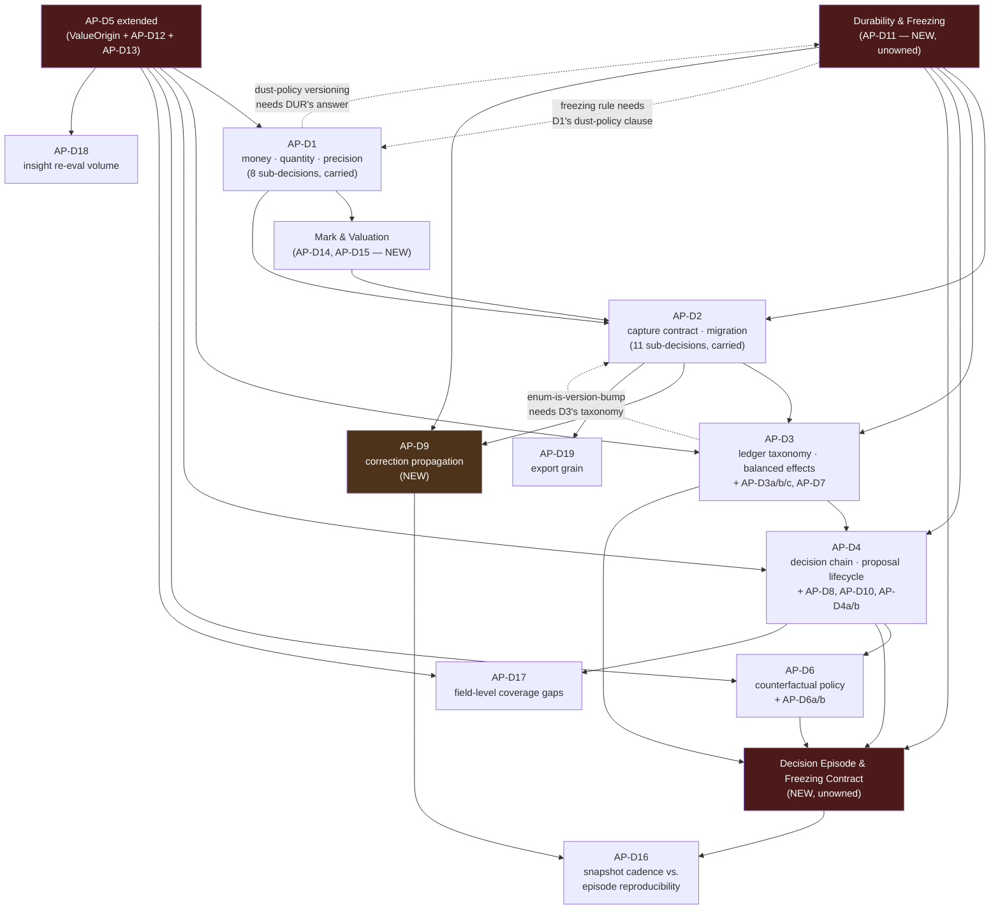

# AP — ADR Discovery: hidden decisions remaining before ADR writing

**Milestone:** AQ (ADR Phase 1)
**Status:** **Discovery only. Nothing here is decided, nothing here is an ADR, nothing here is a
recommendation between options.** This document names decisions and their consequences; it does not
choose between alternatives.
**Date:** 2026-08-06
**Method:** The architecture was re-read from first principles — `TRADING_DOMAIN_ARCHITECTURE_V1.md`
v1.2 in full, cross-checked against ADR-0027, ADR-0026, ADR-0016, ADR-0005, ADR-0013, ADR-0019 and the
package-layout rules in `AP` §27 — treating every prior conclusion as re-openable. `AP_D1_D2_INVESTIGATION.md`
and its hostile review already did this work exhaustively for AP-D1 and AP-D2 (19 sub-decisions between
them, plus 5 critical corrections from the review). Their findings are **carried forward and
summarized, not re-derived** — this document's contribution is everywhere the two prior documents did
not look: AP-D3 through AP-D6, and the parts of the architecture that no one of the six named ADRs
claims at all.
**Reads:** [`TRADING_DOMAIN_ARCHITECTURE_V1.md`](TRADING_DOMAIN_ARCHITECTURE_V1.md) v1.2 ·
[`AP_D1_D2_INVESTIGATION.md`](AP_D1_D2_INVESTIGATION.md) ·
[`../reviews/AP_D1_D2_INVESTIGATION_REVIEW.md`](../reviews/AP_D1_D2_INVESTIGATION_REVIEW.md) ·
[ADR-0027](../adr/ADR-0027-memory-and-decision-archive-persistence-schema.md) ·
[ADR-0026](../adr/ADR-0026-decision-context-boundary.md) ·
[ADR-0016](../adr/ADR-0016-structural-sequence-state-history-foundation.md) ·
[ADR-0005](../adr/ADR-0005-ingestion-boundary-strictness.md) · the repository at `75a4f40`

---

## Table of contents

- [0. What this document is, and is not](#0-what-this-document-is-and-is-not)
- [1. Executive summary](#1-executive-summary)
- [2. Decision map](#2-decision-map)
- [3. Decision groups, in detail](#3-decision-groups-in-detail)
- [4. Dependency graph](#4-dependency-graph)
- [5. Circular dependencies found](#5-circular-dependencies-found)
- [6. ADR ownership proposal](#6-adr-ownership-proposal)
- [7. ADR writing order](#7-adr-writing-order)
- [8. Hidden risks](#8-hidden-risks)
- [9. Questions still unanswered](#9-questions-still-unanswered)

---

## 0. What this document is, and is not

**In scope.** Every independent architectural decision still open in `AP` v1.2, named and separated
from whatever ADR or one-line item it currently hides inside. For each: why it is separate, what breaks
if it stays hidden, which group it belongs to, its severity, and a proposed owning ADR.

**Out of scope, deliberately.** No option is chosen. No ADR is written. No backlog or changelog line is
touched. No code, no implementation, no file layout beyond what `AP` already describes. Where a prior
document (the investigation or its review) already fully explored a decision, this document **names it,
states its status, and moves on** — repeating that analysis would not add anything AP-D1/AP-D2 do not
already have in far greater depth.

**The finding this document exists to state.** `AP` §31.1 names six ADRs (AP-D1 through AP-D6) as "the
decisions requiring an ADR before implementation." Reading the other 28 sections against that list shows
the six do not cover the architecture they gate. Three things are true simultaneously:

1. **AP-D1 and AP-D2 are each a bundle**, as the investigation already showed (8 and 11 sub-decisions).
2. **AP-D3 through AP-D6 are unopened bundles of the same kind** — named in one line each, never
   decomposed the way AP-D1/AP-D2 were.
3. **A layer of decision sits below all six and is claimed by none of them**: the four durability
   classes and the freezing policy (`AP` §24.3, §25) that every other object's guarantee is stated in
   terms of. Nothing in `AP` §31.1 owns them, yet AP-D2's migration guarantee, AP-D3's ledger identity,
   and AP-D4's Decision Episode all silently assume they already hold.

---

## 1. Executive summary

**32 independent decisions are named below** across nine groups. 19 were already found and are
summarized from the investigation/review (carried forward, not re-derived). **13 are new** — found by
extending the same first-principles method to AP-D3 through AP-D6 and to the parts of `AP` no ADR
claims.

**The single most consequential finding.** `AP` §24.3 ("four durability classes") and §25 ("the
freezing policy") are treated throughout the document as settled, load-bearing law — every object's row
in §6.1's catalogue and §25.2's classification table depends on them. **No ADR in §31.1 owns them.**
AP-D2 is the closest fit, but AP-D2's stated scope is narrower ("capture contract and migration
guarantee," `AP` §5.7 items 1–4) than the four-class taxonomy the whole domain is built on. Writing
AP-D2 without first settling this leaves the migration guarantee resting on an unratified assumption.

**The second finding.** Two objects treated as fully specified in `AP` have **no owning ADR at all**:
**Decision Episode** (§17 — the unit of learning, built in step 5, denormalized, policy-version
sensitive) and **event identity scope** (§11.5 — which fields make two Trades "the same event," already
shown broken three ways by the hostile review's C1, and assigned to no ADR by `AP` §31.1).

**The third finding — two genuine circular dependencies**, neither found by the hostile review because
its scope was AP-D1/AP-D2 only:

- AP-D1's dust-policy versioning clause and the (currently unowned) durability/freezing rule need each
  other's output before either can be finalized (§5 below, Cycle 1).
- AP-D2's "enum extension is a version bump" clause and AP-D3's ledger-event taxonomy need each other's
  output before either can state its rule precisely (§5 below, Cycle 2).

**What this changes about the sequencing `AP` §32 states.** Step 0 currently reads "ADRs AP-D1 and
AP-D2 (days, not months)." That estimate holds for AP-D1/AP-D2 as scoped. It does not hold once the
durability/freezing gap and the event-identity-scope gap are accounted for, because both sit
**underneath** AP-D1 and AP-D2, not beside them — §7 below proposes where they belong in the writing
order.

---

## 2. Decision map

Legend: **Carried** = already found and fully explored by the investigation/review, summarized here.
**New** = found by this pass. Severity is independent of how the decision was found.

| ID | Decision | Group | Status | Severity | Closest existing owner |
|---|---|---|---|---|---|
| AP-D1a–h | Representation, canonical form, crossing rule, precision validation, stored-quotient prohibition, rounding ownership, adapter text capture, dust source (investigation §1.4 Q1–Q8) | Financial precision | Carried | Mixed, Q2/Q3/Q5 Critical | AP-D1 |
| AP-D2a–k | Migration mechanism, byte-rewrite guarantee, version namespaces, absence semantics, enum-is-version-bump, writer/reader field asymmetry, forward-compat, canonical-encoder freeze, full-dump-vs-export split, verification depth, golden-corpus mechanics (investigation §2.4 Q1–Q11) | Identity & migration | Carried | Mixed, Q2/Q5/Q8 Critical | AP-D2 |
| — | Four review corrections: quotient rule must exclude asserted/frozen quotients (C2); capability 1 must be restated as byte reproduction (C3); byte-identical goldens are incompatible with upcasting (C4); mixed Decimal/float `==` disables `TOUCH` (C5) | Financial precision / Identity | Carried, resolved as wording repairs | Critical (C2, C3, C4), High (C5) | AP-D1 / AP-D2 |
| **AP-D7** | **Ledger event identity scope** — which fields constitute `event_id`; `recorded_at`/`source`/`asserted_by`/`capture_schema_version` currently break idempotency three ways (review C1) | Identity | New (elevated from review C1, unscheduled by `AP` §31.1) | **Critical** | None named — closest is AP-D3 |
| **AP-D8** | **Position identity stability under fold-policy version change** — a dust-threshold or classification-version bump can retroactively redraw a position's flat-crossing boundary, invalidating every frozen `Decision Episode.position_ref` computed under the old fold | Identity / Durability | New | **Critical** | None — depends on AP-D1 and an unowned durability rule |
| **AP-D9** | **Correction propagation to frozen downstream artifacts** — a `Correction` to a Trade after a Decision Episode, Snapshot, AI Context Package, AI Review or issued tax report has already frozen a fact derived from it leaves those artifacts silently disagreeing with the corrected ledger | Identity / Durability | New (S6 in the review named the tax instance only; this generalizes it) | **Critical** | None |
| **AP-D10** | **Proposal identity semantics under re-run** — `proposal_id` includes `created_at` (`AP` §8.2), so "idempotent re-submission" (AP-D2's model, built for Trades) may not mean anything useful for a re-run deterministic scan producing the same setup twice | Identity | New | Medium | AP-D4 |
| **AP-D11** | **Durability classification & freezing-policy ownership** — `AP` §24.3's four classes and §25's freezing rule govern every object in the domain and are assumed settled everywhere; no ADR in §31.1 claims them | Governing policy | New | **Critical** | None |
| **AP-D12** | **Generic versioned-vocabulary primitive vs. per-subsystem reinvention** — closed tag vocabularies (§20.2), `PersonalInsight.versions`' three independent version axes (§21.3), classification mappings (§15.7) and tax rule sets (§22.3) each restate "retire-not-redefine, versioned, read-time-applied" independently | Governing policy | New | Medium | AP-D5 (extend) |
| **AP-D13** | **Canonical "absent/indeterminate-with-reason" shape** — `INDETERMINATE(reason)` (§15.5), `ABSENT(reason)` (`ValueOrigin`, §5.2), `NotApplicable(reason)` (§17.3) are three independently-typed instances of one idea, with no shared shape stated | Governing policy | New | Medium-High | AP-D5 (extend) |
| **AP-D3a** | **Adjustment event shape and position-fold continuity** — a rebase/split changes quantity with no trade behind it; whether `average_entry` rescales in place or the position looks like a close+reopen is undecided | Ledger taxonomy | New | High | AP-D3 |
| **AP-D3b** | **Fee-in-non-primary-asset handling, uniform across event kinds** — §11.2/§22.2 state the rule for a Trade fee in a third asset; a Transfer's network fee (§11.7) can equally be in a non-transferred asset (gas on an ERC-20 move) and the rule is not restated there | Ledger taxonomy | New | Medium | AP-D3 |
| **AP-D3c** | **Single interpreter of an economic event** — `fmis.ledger.balance_effects()` is the one function Finding 3 says must be the sole source of "what happened"; whether `fmis.tax` derives its own reading from it or reimplements the interpretation independently is unstated | Ledger taxonomy / Tax | New | High | AP-D3 |
| **AP-D14** | **Mark selection and staleness policy** — unrealized P&L (§12.3), snapshot valuation (§14) and portfolio constraint checks (§15) all require "a mark source and time"; no ADR states which source, what staleness is acceptable, or who owns the choice | Financial precision / Portfolio | New | High | None — new, small ADR |
| **AP-D15** | **Reward/airdrop acquisition-value provenance** — §11.7 requires "an acquisition value at receipt"; whether it is `ASSERTED` by the owner or `MEASURED` from a feed at that instant is unstated, and §22.2 item 9 already calls this value unrecoverable if missed | Financial precision / Tax | New (reinforces §22.2 item 9's own urgency) | Medium | AP-D14 |
| **AP-D6a** | **Horizon cap value and scope** — §8.5's observation window is bounded by "the horizon cap," a term used but never defined as global, per-book, or per-strategy | Counterfactual | New | Medium | AP-D6 |
| **AP-D6b** | **`AMBIGUOUS_BAR` treatment in cohort statistics** — §8.5 correctly refuses to resolve an ambiguous bar to a side, but §20.3's cohort math never states whether ambiguous outcomes are excluded, bucketed separately, or folded into `InsufficientSample` | Counterfactual | New | Medium | AP-D6 |
| **AP-D4a** | **Lifecycle-event evaluation cadence and intrabar-order equivalence** — `MEASURED` lifecycle events (`ENTRY_TRIGGERED`, `INVALIDATION_REACHED`, `EXPIRED_UNTRIGGERED`) are computed by a re-scan of closed candles at an unstated cadence; a coarse cadence can make two events that occurred hours apart appear in the same evaluation batch, recreating ADR-0021's intrabar-order problem one layer up | Proposal lifecycle | New | High | AP-D4 |
| **AP-D4b** | **Ordering/completeness proof for the proposal lifecycle stream** — the ledger's own gap here is N10 (review); the proposal lifecycle stream (§8.4) is a second append-only log with the identical gap, unexamined by either prior document | Proposal lifecycle | New (parallel to carried N10) | Medium | AP-D4 |
| **AP-D16** | **Snapshot storage-cadence vs. Decision-Episode portfolio reproducibility** — §14.4 stores full composition less often than the metric row; a frozen `PortfolioConstraintCheck` (§17.4) can reference a `snapshot_id` whose full composition was never persisted, making "what did the portfolio actually hold at that decision" unanswerable later | Portfolio / Episode | New | Medium | None — Portfolio/Snapshot has no owning ADR |
| **AP-D17** | **Field-level `introduced_at` / coverage-gap semantics** — §20.2 gives tag *terms* `introduced_at` so a cohort reports a coverage gap instead of a false zero; no equivalent exists for a *schema field* added in a later capture version, and the review's own long-horizon table names this as the sharpest unaddressed AI-learning failure | Learning layer | New (generalizes a gap the review named but did not scope to an owner) | Medium | AP-D2 (Q4) extended into the performance layer |
| **AP-D18** | **`PersonalInsight` re-evaluation volume / anti-spam policy** — `next_evaluation_trigger` fires on, among other things, "a new model generation re-reading the same evidence" (§21.5); nothing bounds how many provisional insights a single model upgrade can produce for the owner to adjudicate | Learning layer / Memory | New | Low-Medium | None — Personal Memory has no owning ADR (deferred, §21.7) |
| **AP-D19** | **Export grain principle** — §23.2 mixes "one row per fold" (Position log), "one row per event" (Trade log) and "one row per version" (Insights) with no stated rule for which grain an export type gets | Export | New | Low | None — Export has no owning ADR |

**19 carried, 13 new, 32 total.** Ranking and grouping continue below; §3 gives each new item the same
depth of reasoning the investigation gave AP-D1/AP-D2's sub-decisions.

---

## 3. Decision groups, in detail

### 3.1 Group: Identity (AP-D7, AP-D8, AP-D9, AP-D10 — new; plus carried AP-D1's Q2 and AP-D2's Q2/Q8)

**Why this is one group and not scattered under AP-D1/AP-D2/AP-D3/AP-D4.** Every decision here answers
the same question — *what makes two things the same thing, and what happens when the answer changes
underneath something that already trusted it* — asked of a different object each time. Answering it once
for Trades (AP-D7) does not answer it for Positions (AP-D8), Proposals (AP-D10), or for what happens when
an identity's inputs are later corrected (AP-D9).

**AP-D7 — Ledger event identity scope.** `AP` §11.5 states `event_id` is "derived from the canonical
digest of the authoritative fields" and that re-submission "produces the identical `event_id`." §11.2's
authoritative field list includes `recorded_at`, `source`, `asserted_by` and `capture_schema_version` —
none of which is a property of the economic event itself. The hostile review's C1 demonstrated, against
the repository's own `canonical_dumps`, that the same fill recorded twice with a different `recorded_at`,
a different `source` (`MANUAL` vs `EXCHANGE_API`), or across a `capture_schema_version` bump produces
**three different digests** — meaning the exchange-sync path `AP` §32 step 4 already plans will
double-count every manually-entered fill the day it ships. **Why separate.** AP-D1 decides how an amount
is written; AP-D2 decides how a record evolves; **nothing decides which fields constitute economic
identity**, and `AP` §11.5 already assumes an answer without naming an owner. **What breaks if hidden
inside AP-D2:** AP-D2's migration guarantee is about schema evolution, not about which fields belong in
a digest — folding this question into AP-D2 would make the ADR responsible for a decision its own stated
scope does not cover, and the decision would keep being silently assumed rather than made.

**AP-D8 — Position identity stability under fold-policy version change.** `AP` §12.2 defines Position
identity as flat-crossing within `(market, book)`, using the dust threshold (§5.3) to decide when net
exposure is "zero." The dust threshold is explicitly "a named, versioned policy" (§5.3, restated as
AP-D1's Q8). **The consequence nobody traces:** if the dust threshold's version changes, a sequence of
trades that used to net to zero under the old threshold may not net to zero under the new one — or vice
versa — which **redraws where one position ends and the next begins**. A `Decision Episode` (§17) frozen
under the old fold holds a `position_ref` pointing at a position boundary the live fold no longer agrees
with. §24.3's own CI test — "delete every rebuildable projection, recompute, assert identical" — cannot
catch this, because it recomputes *both* sides under the *current* policy (this is exactly the gap the
hostile review's S2 names, one level more specific: S2 is about the fold disagreeing with a frozen
artifact in general; AP-D8 is about the fold's disagreement corrupting the very **identity** a frozen
artifact refers to, not just its values). **Why separate from AP-D1's dust decision:** AP-D1 decides
*what the dust threshold is and how it is versioned*; AP-D8 decides *what happens to identity references
that were computed under a version that has since changed* — a durability/freezing question, not a
money-representation question. **What breaks if hidden inside AP-D1 or AP-D4:** AP-D1 has no reason to
discuss Decision Episode's referential integrity; AP-D4 (decision-chain boundary) defines Position as an
object but is not scoped to policy-version drift. Neither ADR's stated boundary covers this, so it would
keep being invisible until a real threshold change corrupts real episode references, discovered only in
production.

**AP-D9 — Correction propagation to frozen downstream artifacts.** `AP` §5.1: corrections never edit,
they supersede by reference. `AP` §25: a value is frozen "at the moment it was read" if it depends on
anything that will not be identical in three years. **The gap between the two:** a Decision Episode's
"System context," "Market context" and "Portfolio context" (§17.4) are frozen **at decision time**, built
from the ledger and portfolio state as they stood then. If a `Trade` that fed into that state is
*corrected* after the episode was frozen, the correction is recorded (§5.1) but nothing in `AP`
propagates a notice to the episode, the `AIContextPackage` (§18) that was built from the same state, the
`AIReview` (§19) that read that package, or an already-issued tax report (§25.2: tax events are
"recomputable... given the same rule set version," but an *issued report* is itself archived and static).
The hostile review's **S6** found the sharpest instance of this — a correction under average-cost basis
silently changes an already-filed tax year — but scoped it to tax alone. **Why this is one decision and
not five separate ones per artifact type:** every frozen artifact in `AP` §25.2 has the identical
exposure, because every one of them is "frozen... never recomputed" by the same rule; the question "what
does a correction owe to something that already froze a fact it later invalidates" has exactly one honest
answer regardless of which artifact type is asking. **What breaks if hidden inside AP-D2:** AP-D2's
migration guarantee is about schema shape surviving time, not about corrections propagating through
frozen consumers — a real but entirely different failure mode that shares no mechanism with schema
versioning.

**AP-D10 — Proposal identity semantics under re-run.** `AP` §8.2 lists `proposal_id` as "content-derived"
and separately lists `created_at` as part of a proposal's identity fields. Unlike a Trade — where
"content-derived, re-submission is idempotent" is the entire point (§11.5) — a Proposal that includes its
own creation timestamp in its identity can, by construction, never collide on re-run: every invocation of
the deterministic policy is automatically a "new" proposal even if the market state and evidence are
byte-identical to five minutes ago. **Why this matters and is separate from AP-D7:** AP-D7 is about a
Trade's identity being *too broad* (it should exclude non-economic fields and currently doesn't); AP-D10
is the mirror case — a Proposal's identity may be *correctly* broad (creation time legitimately matters
for a suggestion's shelf life) but the design borrows the word "content-derived" from the Trade case
without stating whether idempotent-duplicate handling (ADR-0027 §6) is even meant to apply here, or
whether every re-run is intentionally a distinct, trackable event. **What breaks if left unstated:** a
scheduled re-run after a crash (a routine failure mode named in `AP` §29 nowhere) could silently flood the
`author=DETERMINISTIC_POLICY` cohort with duplicate-looking proposals, corrupting `AP` §20.5's
stale-proposal and acceptance-rate metrics for exactly the author whose output is easiest to over-count.

---

### 3.2 Group: Governing policy (AP-D11, AP-D12, AP-D13 — new)

**Why this is one group.** Each decision here is a *rule about rules* — a mechanism the rest of the
architecture assumes exists in exactly one shared form, but which `AP` never states as a single
contract. Each is cheap to name now and expensive to discover as three divergent implementations later.

**AP-D11 — Durability classification & freezing-policy ownership.** This is the document's headline
finding (§1 above). `AP` §24.3 defines four durability classes; §25 defines when a value freezes and why;
§25.2 classifies roughly twenty distinct values against that rule. Every one of AP-D2 (migration
guarantee), AP-D3 (Position as "rebuildable projection"), AP-D4 (Decision Episode as "captured artifact"),
and the freezing table itself, is stated as if §24.3/§25 were already ratified. **No ADR in `AP` §31.1
claims them.** AP-D2's stated scope (§5.7 items 1–4) is about the *capture contract* specifically —
additive fields, forward-only readers, a golden corpus, a full dump — which is a proper subset of what
§24.3/§25 govern. **Why separate from AP-D2:** AP-D2 as scoped could be fully written and accepted
without ever stating whether a "rebuildable projection" is guaranteed identical across a *policy* version
change (AP-D8 is a direct instance of this gap) or whether a "captured artifact," once frozen, has any
obligation toward a later correction to its own inputs (AP-D9 is a direct instance of this gap too).
**What breaks if this stays unowned:** every other ADR that says "this is a captured artifact, frozen
forever" is citing a rule nobody accepted, and the CI test the design leans on hardest (§24.3's
delete-and-recompute test) is validated against a definition of "rebuildable" that was never itself
examined for the version-drift case the review's S2 already found a hole in.

**AP-D12 — Generic versioned-vocabulary primitive vs. per-subsystem reinvention.** Four independent
places in `AP` implement the identical pattern — "a closed or open list, versioned, extended by
retire-and-add rather than redefinition, applied at read time so history never silently changes meaning"
— with no shared type: closed tag vocabularies (§20.2: Setup, Mistake, Emotion, Exit reason, Rejection
reason), `PersonalInsight.versions` (§21.3: three separate axes — `policy_version`, `taxonomy_version`,
`calculation_version` — on one record), classification mappings (§15.7: sector/theme/narrative, "a
versioned mapping applied at read time"), and tax rule sets (§22.3: `rule_set_version + effective
period`). This is the identical shape N9 in the review already flagged **once**, for the archive's
envelope/payload/capture-schema triad — this finding is that the same defect recurs **three more times**,
outside the archive layer entirely, in domain code the review never looked at because its scope was
AP-D1/AP-D2. **Why separate:** each instance is currently free to invent its own versioning mechanics
(what "retire" means operationally, what a version bump requires, how a reader reports "this term didn't
exist yet"), and a repository that already has the discipline for this exactly once (ADR-0016's `@property`
projections, ADR-0026's "delegates its rule to the layer that already declared it") is the wrong
repository to let it drift into four independent implementations. **What breaks if hidden inside AP-D5:**
AP-D5 as named is "provenance vocabulary ownership" — `ValueOrigin` specifically. A generic versioned-list
primitive is a different, reusable piece of infrastructure that four *other* packages need; scoping it
inside AP-D5 without renaming AP-D5's stated boundary would silently expand what that ADR is understood
to cover.

**AP-D13 — Canonical "absent/indeterminate-with-reason" shape.** `AP` independently invents this idea
three times with three different names and (implicitly) three different payload shapes:
`INDETERMINATE(reason)` on a `PortfolioConstraintCheck` result (§15.5), `ABSENT` with "a stated reason" as
a `ValueOrigin` (§5.2), and `NotApplicable(reason)` as an `EpisodeOutcome` variant (§17.3). Each is
correct in isolation and each is the same idea: *a value could not be produced, and the reason is itself
data*. **Why separate from AP-D12:** AP-D12 is about versioned *lists*; this is about a single reusable
*result shape* that could be one generic type (`Absent[T](reason: str)` or equivalent) used everywhere a
value might not exist, rather than three ad hoc unions. **What breaks if never named as one decision:**
any future tooling that wants to render "here is what's missing and why" uniformly across a proposal, a
snapshot, and an episode — which `AP` §14.3 and §15.5 both individually insist on doing well — has to
special-case three shapes instead of pattern-matching one, and a fourth subsystem built later will
invent a fourth shape rather than reusing an established one, because none was ever established as
canonical.

---

### 3.3 Group: Ledger taxonomy (AP-D3a, AP-D3b, AP-D3c — new, under AP-D3's existing but undecomposed scope)

**Why this is one group.** AP-D3's one-line scope in `AP` §31.1 is "ledger event taxonomy and the
**derived** balanced-effect contract." Like AP-D1 and AP-D2 before decomposition, this line hides several
independent questions about the six event kinds §11.7 already names.

**AP-D3a — Adjustment event shape and position-fold continuity.** `AP` §11.7 lists `Adjustment` (split,
rebase, rename, delisting, forced liquidation) as "the only event the owner did not cause," with "≥ 1"
balance effects and no further shape. A rebase changes a held quantity with **no trade behind it** — the
one balance-changing event kind that is not an exchange of assets. Whether the position fold treats a
rebase as an in-place rescale (average entry divides by the same factor the quantity multiplies by,
position identity and `opened_at` untouched) or as an implicit close-and-reopen (a new position, breaking
duration and every duration-keyed learning metric in §20.3) is undecided. The hostile review's M4 flagged
this as a numeric-representation risk for Option B (integer minor units); this is the same event kind's
**position-fold** consequence, independent of which AP-D1 option is chosen. **Why separate:** this is not
a money-representation question (AP-D1) or an identity-digest question (AP-D7) — it is specifically about
what a rebase does to the **fold algorithm** that produces Position, which is AP-D3's own stated territory
(the "derived balanced-effect contract"). **What breaks if left unstated:** the first real corporate
action (and crypto rebases, e.g. algorithmic-stablecoin rebasing tokens, are not rare) either silently
fragments a position's history or silently rescales it with no test enforcing which.

**AP-D3b — Fee-in-non-primary-asset handling, uniform across event kinds.** `AP` §11.2 and §22.2 item 5
state the rule precisely for a **Trade** fee paid in a third asset (BNB while trading BTC/USDT): it "is
itself a disposal" needing its own FX rate. `AP` §11.7 lists a Transfer's balance effects as "2 (+ network
fee)" — and a network fee for an on-chain transfer is very often paid in a *different* asset than the one
being moved (ETH gas to move an ERC-20 token). Nothing restates the third-asset-disposal rule for this
case. **Why separate:** this is not a new rule to invent — it is a question of whether one already-stated
rule (§22.2 item 5) applies uniformly across every event kind that can carry a fee, or whether each event
kind's fee handling needs its own restatement, which is exactly the kind of duplication ADR-0013 §6 and
ADR-0014 §6 (cited approvingly elsewhere in this codebase) already refuse. **What breaks if left
unstated:** a Transfer's gas fee either silently fails to register as a disposal (understating taxable
events) or the tax engine has to guess at a rule that was only ever written down for one of the two
places it applies.

**AP-D3c — Single interpreter of an economic event.** `AP` §11.4 states `balance_effects(event)` as "a
pure function... exactly one representation of the fact," and Finding 3 names this the balanced-effect
discipline the whole ledger exists to protect. §22.1 states tax "reads the ledger" and is otherwise
isolated by import direction. **What is never stated:** whether `fmis.tax` builds its own tax events by
calling `balance_effects()` and layering jurisdiction rules on top of its output, or independently
re-derives "what happened" from the raw event fields under its own interpretation. If the latter, the
repository now has **two implementations of what a Trade means** — one for performance, one for tax —
which is precisely the failure mode §11.4's own stated rule ("if two fields could ever disagree about the
same fact, one of them is not a field") exists to prevent, recurring at the level of a *function* rather
than a *field*. **Why separate from AP-D1/AP-D1's fee rules:** this is an ownership-of-interpretation
question, not a numeric-representation question — it could be entirely correct under any AP-D1 option and
still have two divergent implementations of "what this trade did." **What breaks if left unstated:** a
future bug in either `fmis.positions`' or `fmis.tax`'s independent reading of a Trade with an unusual fee
structure (crypto-to-crypto plus a third-asset fee — `AP` §1.3.4's "hardest single field") produces two
different accounts of the same trade with no test positioned to catch the divergence, because nothing
declares which one is authoritative.

---

### 3.4 Group: Financial precision — mark & valuation (AP-D14, AP-D15 — new, adjacent to AP-D1)

**AP-D14 — Mark selection and staleness policy.** `AP` §12.3 requires unrealized P&L to have "a mark
source and time." §14.3 requires a Snapshot to store "the marks and rates it used" and never recompute
from live data. §15.3 requires portfolio constraint checks to read snapshot marks. **What none of these
sections states:** which price feed is the mark source, what "stale" means (a threshold, in what units),
what happens when the mark source disagrees across venues for the same asset, or which layer owns that
choice. This is not AP-D1's question — AP-D1 decides *how an amount is represented once it exists*; this
decides *which number gets treated as truth for a value the system did not observe directly*. **Why this
needs its own (small) ADR rather than folding into AP-D1 or AP-D3:** AP-D1 is already an eight-clause
ADR: appending a data-sourcing policy to a numeric-representation ADR mixes two different kinds of
decision (a type system decision and a data-provider decision) under one acceptance vote, which makes
either one harder to revisit independently later. **What breaks if left unstated:** every unrealized P&L
figure, every Snapshot valuation, and every portfolio constraint check's headroom number silently depends
on an unstated, presumably ad hoc choice made at implementation time rather than an architectural one —
exactly the "decision discovered instead of designed" pattern this whole discovery exercise exists to
prevent.

**AP-D15 — Reward/airdrop acquisition-value provenance.** `AP` §11.7 requires a `Reward` event to carry
"an acquisition value at receipt," and §22.2 item 9 independently states this value is "uncomputable
retroactively" and therefore urgent. Neither section states whether this value is `ASSERTED` (the owner
types it, as with a Trade fill) or `MEASURED` (the system reads a price feed at the block/receipt
timestamp). **Why this is a distinct decision from AP-D14, not a duplicate:** AP-D14 is about *ongoing*
mark selection for valuation (unrealized P&L, snapshots — read continuously, never frozen as a source of
truth); this is about a *one-time* capture at a specific, irreproducible instant that becomes part of the
permanent record the moment it is written, which is a capture-contract-shaped decision (AP-D2's
territory) resting on AP-D14's answer to "which feed, if any." **What breaks if left unstated:** the exact
failure §22.2 item 9 already calls out as unrecoverable — a reward received without its acquisition value
captured has no path to a correct tax basis, ever, and the design's own text already flags the field as
urgent without stating how it gets filled in.

---

### 3.5 Group: Counterfactual evaluator (AP-D6a, AP-D6b — new, under AP-D6's existing but undecomposed scope)

**AP-D6a — Horizon cap value and scope.** `AP` §8.5 defines the observation window as ending at the
earliest of three boundaries, one of which is "the horizon cap." The term is used as though already
defined; it is not — not its value, and not whether it is a single global constant or varies by book
(`SWING` vs long-term `INVESTING`, per §5.5) or by strategy. **Why separate from AP-D6's other clauses:**
the fill-assumption-stamped-at-creation rule and the `AMBIGUOUS_BAR` refusal-to-guess rule (both already
well specified in `AP`) are policy *mechanisms*; the horizon cap is a policy *parameter* with direct
behavioral consequences — too short, and long-horizon setups are systematically misclassified
`UNRESOLVED_AT_HORIZON` before they could plausibly resolve; too long, and short-horizon setups accumulate
noise. **What breaks if left unstated:** `AP` §20.5's rejection-quality and post-loss-rejection-bias
metrics — both explicitly named as high-value — are computed over `HypotheticalOutcome`s whose horizon
boundary is silently arbitrary, undermining the statistical claims those metrics are built to support.

**AP-D6b — `AMBIGUOUS_BAR` treatment in cohort statistics.** `AP` §8.5 correctly refuses to resolve an
ambiguous bar to either side — a genuinely good decision the investigation and review both endorse
without qualification. §20.3's cohort statistics (win rate, expectancy, profit factor) never state
whether an `AMBIGUOUS_BAR` path classification is excluded from those aggregates, counted as a fractional
or neutral outcome, or triggers `InsufficientSample` the way a too-small cohort does. **Why separate from
AP-D6a:** this is a downstream-consumer question (the performance layer, §20), not an evaluator-behavior
question — AP-D6 could be fully and correctly specified for the evaluator itself while leaving this open.
**What breaks if left unstated:** silently excluding ambiguous outcomes from win-rate math (the most
likely default if nobody decides otherwise) systematically removes exactly the cases where the market
moved fastest and hardest — a bias in the statistic in a direction nobody chose.

---

### 3.6 Group: Proposal lifecycle (AP-D4a, AP-D4b — new, under AP-D4's existing but undecomposed scope)

**AP-D4a — Lifecycle-event evaluation cadence and intrabar-order equivalence.** `AP` §8.4's `MEASURED`
lifecycle kinds (`ENTRY_TRIGGERED`, `INVALIDATION_REACHED`, `EXPIRED_UNTRIGGERED`) are computed by
re-scanning closed candles against outstanding proposals — but at what cadence is never stated (once per
`AP` §3's "morning command"? Continuously? Per candle close?). **Why this is a real hazard and not a
triviality:** ADR-0021 already refused to guess intrabar order for a two-sided break bar precisely
because two things can happen within one candle in an order the architecture cannot know. A coarse
evaluation cadence recreates the identical problem one layer up: if the entry condition triggers and the
invalidation is then reached before the next evaluation runs, the system may record `INVALIDATION_REACHED`
having never recorded `ENTRY_TRIGGERED` — or worse, record both from a single scan in an order that does
not reflect what actually happened, corrupting the `EXECUTED_WHILE_INVALID` classification §8.4 calls out
by name as valuable. **Why separate from AP-D6:** AP-D6 governs the *counterfactual evaluator*'s
comparison logic (which level crossed first, for a proposal that was never executed); this governs the
*lifecycle recorder*'s scan cadence for proposals that are still live — a scheduling/operational decision,
not a comparison-logic one, though both ultimately rest on the same `fmis.level_crossing` engine.
**What breaks if left unstated:** the exact bias-detection metrics `AP` §20.5 is proudest of
(`EXECUTED_WHILE_INVALID` rate, invalidation-first accuracy) are computed over a lifecycle stream whose
ordering fidelity was never architecturally guaranteed.

**AP-D4b — Ordering/completeness proof for the proposal lifecycle stream.** The carried finding N10
(review) states the ledger has no ordering or completeness proof — a reordered or silently deleted middle
event is undetectable by digest alone. `AP` §8.4 defines a **second** append-only event stream (proposal
lifecycle events) with the structurally identical property, and neither the investigation nor the review
examined it, because their scope was the ledger specifically. **Why separate from N10 rather than the
same decision:** the two streams have different authors (ledger events are exclusively owner/venue
asserted or market-measured; proposal lifecycle events additionally include system actions like
`WITHDRAWN_BY_AUTHOR`) and different consequences if compromised (a missing ledger event misstates money;
a missing lifecycle event misstates whether the owner was ever shown a setup, which is the raw material
for every "did AI help" statistic §8.6 lists). Whatever verification-depth decision AP-D2 makes for the
ledger (digest-only vs. + fold check vs. + hash chain, per the carried Q10) needs a stated answer — same
or different — for this second stream too. **What breaks if left unstated:** the product's own stated
thesis-testing mechanism (§4 Finding 5: "the proposals rejected, ignored and expired are the highest-value
data in the system") rests on a stream with no integrity guarantee beyond per-record digests, silently.

---

### 3.7 Group: Portfolio, Snapshot, Episode (AP-D16 — new; plus the AP-D11 durability gap already covering Episode's freezing contract)

**AP-D16 — Snapshot storage-cadence vs. Decision-Episode portfolio reproducibility.** `AP` §14.4 states
composition (full per-asset/per-position detail) is stored less often than the narrow metric row — daily
metrics, full composition only "on change, on position events, and at a lower scheduled cadence." §17.4
requires a Decision Episode's "Portfolio context" to freeze "the constraint check and its binding
constraints" at decision time, and a `PortfolioConstraintCheck` (§15.5) carries a `snapshot_id`. **The gap:**
if the constraint check's referenced snapshot happens to be one of the metric-only snapshots (the common
case, by §14.4's own stated cadence), a reviewer years later asking "what did the portfolio actually hold
when this decision was made" — precisely the question §14.1 says Snapshot exists to answer — cannot get a
composition-level answer, only the aggregate metrics. **Why separate from AP-D11:** AP-D11 is about who
governs the general freezing rule; this is a specific, concrete instance where two individually-reasonable
policies (cheap metric-only snapshots most of the time; freeze full portfolio context at every decision)
collide, and nobody has traced the collision. **What breaks if left unstated:** this is the same class N13
and N14 (carried) already named — "trivial today, impossible retroactively." The fix, if one is needed
(forcing a full-composition snapshot at every decision moment, not just position events), is a one-line
addition to §14.4's trigger list; not deciding it now forecloses the option permanently the moment the
first metric-only snapshot is the one a proposal's constraint check references.

---

### 3.8 Group: Learning layer & memory (AP-D17, AP-D18 — new)

**AP-D17 — Field-level `introduced_at` / coverage-gap semantics.** `AP` §20.2 gives closed-vocabulary
*terms* an `introduced_at` timestamp specifically so a cohort analysis spanning that term's introduction
reports a coverage gap rather than a misleading zero. The review's own long-horizon table names the
missing generalization directly: **no equivalent exists for a schema field** added in a later
`capture_schema_version`. A cohort dimension introduced in v3 yields *absent*, not zero, for pre-v3
episodes — but nothing in `AP` states that the performance layer (§20) must render that distinction
rather than silently averaging absent-as-zero into a statistic. **Why this is a distinct, ADR-worthy
decision and not simply "part of AP-D2's Q4":** AP-D2's Q4 (carried) is about what an *absent field* reads
as at the **archive/decode** layer (`ABSENT(reason)` already exists in the vocabulary, per the
investigation's own recommendation). AP-D17 is about what the **performance/cohort layer** is obligated to
*do* with that absence when computing a statistic — a consumer-side obligation AP-D2 does not reach,
because AP-D2's stated scope ends at "the record can be read," not at "every consumer that aggregates the
record handles a field's absence honestly." **What breaks if left unstated:** the review already names
the consequence precisely — "every bias metric silently degrades across a version boundary," with
`InsufficientSample`'s `n`-based guard (§20.7) blind to it because `n` (episode count) stays large even
though *coverage of this specific field* is small.

**AP-D18 — `PersonalInsight` re-evaluation volume / anti-spam policy.** `AP` §21.5's
`next_evaluation_trigger` fires on five conditions, one of which is "a new model generation re-reading the
same evidence" producing "a new `PROVISIONAL` insight linked to the one it disputes" that "the owner
adjudicates" (§21.5). §29's R14 names the *opposite* risk (a confirmed insight ossifying into dogma) and
gives it a mitigation; the proliferation risk — every model upgrade potentially re-litigating every
existing confirmed insight, each requiring the owner's individual adjudication — has no stated bound.
**Why separate from R14:** R14 is about a lesson becoming too sticky; this is about the confirmation
workflow becoming too busy to use, which is exactly the adoption-friction failure mode §29's R2 already
treats as critical everywhere else in the document (§11.3's three-input happy path exists entirely to
defend against it) but which is not connected to Personal Memory's design at all. **What breaks if left
unstated:** a product whose R2 mitigation is taken seriously everywhere except the one place a Claude
model upgrade could flood the owner with re-evaluation requests, undermining the same adoption discipline
the rest of the document is careful about.

---

### 3.9 Group: Export (AP-D19 — new)

**AP-D19 — Export grain principle.** `AP` §23.2's export table mixes three different grains with no
stated rule for which a given export type gets: **fold grain** (Position log — one row per rebuilt
position), **event grain** (Trade log — one row per ledger event), and **version grain** (Insights — one
row **per `PersonalInsight` version**, i.e., the full supersession history, not just the current state).
**Why this is worth naming as its own small decision:** the Insights export choosing version-grain is
notable and probably correct (it makes `CONTRADICTED`/`SUPERSEDED` insight history visible outside the
system, matching §21.5's stated value in keeping a contradicted insight "readable with the evidence that
contradicted it") — but nothing states *why* Insights gets version grain while, say, Proposal Lifecycle
Events (also an append-only stream with real supersession-like structure) gets a single "lifecycle" column
on the Proposal log's fold-grain row instead of its own event-grain export. **What breaks if left
unstated:** the export suite (§23) is the one artifact `AP` §4 Finding 1 explicitly plans as a possible
escape hatch (later split by the investigation's Q9 into a lossless full dump plus a lossy export suite);
an unprincipled per-type grain choice means every future export type's grain gets decided ad hoc rather
than by a stated rule, and a future full-history export (of proposals, of plan amendments) may or may not
happen depending on who builds it rather than on an architectural default.

---

## 4. Dependency graph

Solid edges are ordinary "must be decided first" dependencies. Dotted edges are the two circular pairs
detailed in §5 — each needs the other's output to state its own rule precisely, which a simple ordering
cannot resolve without one of the two accepting a forward reference to a not-yet-written ADR's
constraint.

---

## 5. Circular dependencies found

**Neither of these was found by the hostile review**, whose §7 explicitly states "no circular dependency
... found" — accurately, because its scope was AP-D1 and AP-D2 only. Both appear once AP-D3 and the
unowned durability layer enter the picture.

### Cycle 1 — AP-D1's dust-policy versioning ⇄ the (unowned) durability/freezing rule

`AP` §5.3 states the dust threshold is "a named, versioned policy" — that clause belongs to AP-D1. But
**whether a version bump to that policy is allowed to retroactively change which trades belong to which
position** (AP-D8, §3.1 above) is a durability/freezing question — it is about whether a "rebuildable
projection" (Position, per §24.3) is actually safe to treat as a stable identity source across a policy
version, which is precisely what the unowned durability ADR (AP-D11) would need to state. **The circle:**
AP-D1 cannot finalize its dust-policy-versioning clause responsibly without knowing whether the durability
ADR treats position identity as something a dust-policy bump may disturb; the durability ADR cannot state
its general rule about rebuildable-projection stability without a concrete case to test it against, and
the dust threshold is the sharpest one in the document. **How this differs from an ordinary dependency:**
an ordinary dependency (like AP-D1 → AP-D2 on canonical form) has one ADR wholly upstream of the other.
Here, each ADR's own text needs to reference a specific clause the other ADR has not yet written — AP-D1's
dust clause needs to say "...and a version bump [does/does not] retroactively affect position identity,
per [durability ADR] §N," while the durability ADR's general rule needs "...for example, [AP-D1]'s
dust-threshold version, which is bound as follows." Breaking the cycle requires one of the two to write a
provisional, explicitly-flagged forward reference — not a sequencing fix, a wording one.

### Cycle 2 — AP-D2's "enum extension is a version bump" clause ⇄ AP-D3's ledger-event taxonomy

The carried finding N5 (review's C2.3.7, restated in the investigation's Q5) establishes that adding a new
ledger event kind or proposal lifecycle kind is a version bump under any honest reading of §5.7 rule 1 —
that clause is AP-D2's. But **what the closed set of kinds actually is, and how it is expected to grow**
(a new `Adjustment` sub-type? a new lifecycle kind beyond the already-anticipated `UNTRADEABLE_ASSESSED`?)
is AP-D3's stated territory ("ledger event taxonomy"). **The circle:** AP-D2 cannot state its
enum-version-bump rule precisely without AP-D3 having already enumerated what counts as an "enum" in this
domain (event kinds? lifecycle kinds? both, with different rules?) and what growth pattern is anticipated;
AP-D3 cannot finalize its taxonomy without knowing AP-D2's mechanics for how a new kind gets added
safely later (does the taxonomy need to reserve a numbering scheme, a namespace, an explicit "future kind"
placeholder the way `UNTRADEABLE_ASSESSED` already is one?). **Evidence this is already latent in `AP`
itself:** §8.4 writes `UNTRADEABLE_ASSESSED` directly into the lifecycle kind table today, marked `ABSENT`
— which is AP-D3 already making an AP-D2-shaped decision (how to represent "this kind exists in the
vocabulary but has no live instances yet") without either ADR having stated the rule that decision is an
instance of. **Breaking the cycle** requires deciding which ADR states the enum-growth *mechanism*
generically (most naturally AP-D2, since it already owns "additive, forward-only") while AP-D3 supplies
only the *concrete vocabulary* — but that division is itself a decision neither ADR's current one-line
scope makes for the writer.

---

## 6. ADR ownership proposal

| Decision(s) | Proposed owner | Reasoning |
|---|---|---|
| AP-D11 (durability classes, freezing policy) | **New ADR** — no existing candidate fits; AP-D2 is closest but narrower by its own stated scope | Prerequisite to AP-D2, AP-D3, AP-D4, and Decision Episode; must exist before any of them cites §24.3/§25 as settled |
| AP-D12, AP-D13 (versioned-vocabulary primitive; canonical absent-with-reason shape) | **AP-D5, with its stated scope widened** from "provenance vocabulary ownership" to "provenance and shared-primitive ownership" | AP-D5 already owns `ValueOrigin`/`ABSENT`; both new items are natural, small extensions of the same kernel package rather than standalone ADRs |
| AP-D1a–h (carried) | AP-D1, unchanged | Already fully scoped and explored |
| AP-D14, AP-D15 (mark selection/staleness; reward acquisition-value provenance) | **New, small ADR** — not AP-D1 | Mixing a numeric-representation ADR with a data-sourcing-policy ADR under one acceptance vote makes each harder to revisit independently; AP-D15 is downstream of AP-D14's answer |
| AP-D2a–k (carried), plus review repairs C2/C3/C4 | AP-D2, unchanged in scope but written **after** AP-D11 and AP-D14 exist | AP-D2's migration guarantee needs AP-D11's durability rule settled first, and needs AP-D1/AP-D14's byte shape settled first (existing sequencing, unchanged) |
| AP-D7 (event identity scope) | **AP-D3**, with its stated scope explicitly widened to include it | The review already names AP-D3 "the closest owner"; the taxonomy ADR is the natural place to also state which fields of *each* event kind are economic-identity-bearing versus provenance-only |
| AP-D3a, AP-D3b, AP-D3c | AP-D3, unchanged | Directly within "ledger event taxonomy and the derived balanced-effect contract" as already scoped |
| AP-D8 (position identity stability), AP-D10 (proposal identity semantics) | **AP-D4**, with its stated scope explicitly widened | AP-D4 already owns Position and Proposal as two of its five decision-chain objects; identity stability for both belongs beside their shape, not in a separate ADR |
| AP-D4a, AP-D4b (lifecycle evaluation cadence; lifecycle stream ordering proof) | AP-D4, unchanged | Directly within "the proposal's append-only lifecycle stream" as already scoped |
| AP-D6a, AP-D6b | AP-D6, unchanged | Directly within "counterfactual evaluation policy" as already scoped |
| AP-D9 (correction propagation to frozen artifacts) | **AP-D11** (durability ADR), as a required clause, not a standalone ADR | It is a direct consequence of what "frozen, never recomputed" (§25) obligates when an input changes later — the same ADR that defines freezing should define what a correction owes a frozen consumer |
| Decision Episode's own shape, `EpisodeOutcome` tagged union, §17.4's freezing table as a concrete instance of §25 | **New ADR** ("Episode & Freezing Contract"), separate from AP-D4 | Episode is denormalized, policy-version-sensitive, and referenced by nearly every later group (§18, §19, §20, §21); AP-D4's stated scope is the five decision-chain objects (Proposal/Plan/Order/Trade/Position), which does not include Episode by `AP`'s own §7 definition |
| AP-D16 (snapshot cadence vs. episode reproducibility) | Episode & Freezing Contract ADR (above), as a clause, cross-referencing whichever ADR eventually governs Portfolio/Snapshot (currently none — deferred with §13/§14, not blocking step 1) | Sits exactly at the seam between the two; belongs wherever Episode's portfolio-context freezing clause is written |
| AP-D17 (field-level coverage-gap semantics) | **AP-D2**, as an explicit clause extending Q4's absence semantics into the performance/cohort layer | Q4 already establishes `ABSENT(reason)` at the archive layer; this is the natural, minimal extension rather than a new ADR |
| AP-D18 (insight re-evaluation volume) | Deferred with Personal Memory itself (§21.7 — "no place in the first vertical slice") | Not blocking; revisit when Personal Memory's implementation ADR is written (step 8) |
| AP-D19 (export grain principle) | Deferred with the export suite (§23 — step 10) | Not blocking; the full-dump/export-suite split (carried Q9) already gives it a natural companion decision when that ADR is written |

---

## 7. ADR writing order

**Not implementation order — the order in which each ADR's own text can be written without citing a
rule that does not exist yet**, resolving the two cycles in §5 by choosing which side each writes first
and which side accepts a stated forward reference.

| # | ADR | Why it goes here |
|---|---|---|
| **1** | **Durability & Freezing** (new — AP-D11 + AP-D9) | Everything else cites "captured artifact," "rebuildable projection," "frozen at decision time" as settled law. Writing it first, even in a minimal form, means AP-D2 onward can cite it instead of assuming it. Its clause on correction-propagation (AP-D9) and its general rule on policy-version stability (needed by Cycle 1) can both be stated provisionally here, with an explicit forward reference to AP-D1's dust-policy clause to be reconciled when AP-D1 is written next |
| **2** | **AP-D5, extended** (ValueOrigin + AP-D12 generic versioned-vocabulary + AP-D13 canonical absent-shape) | Nearly every other ADR's records reference `ValueOrigin`/`ABSENT`; the versioned-vocabulary and absent-shape primitives are small, self-contained, and used by AP-D1 (dust policy), AP-D2 (capture schema), AP-D3 (event kinds), AP-D4 (lifecycle kinds), and the learning layer — writing it early avoids four independent inventions of the same idea before the later ADRs need it |
| **3** | **AP-D1** (money, quantity, precision — 8 sub-decisions, carried) | As the investigation already established: determines the bytes everything downstream digests. Its dust-policy-versioning clause references Durability's rule from #1, resolving Cycle 1 by having AP-D1 cite the already-written (if provisional) durability answer rather than the reverse |
| **4** | **Mark & Valuation** (new — AP-D14 + AP-D15) | Depends on AP-D1's exactness/crossing-rule clauses; small and self-contained; needed before AP-D2 because a Reward's acquisition-value capture (AP-D15) is itself a capture-contract field |
| **5** | **AP-D2** (capture contract, migration guarantee — 11 sub-decisions, carried, plus the four review repairs and the AP-D17 coverage-gap clause) | Needs AP-D1's bytes (existing sequencing) and Durability's rule for what "never rewritten" actually covers (new sequencing this document adds) |
| **6** | **AP-D3** (ledger taxonomy, balanced effects — extended with AP-D7 event-identity-scope, AP-D3a adjustment/rebase, AP-D3b fee uniformity, AP-D3c single-interpreter-of-an-event) | Needs AP-D1 (money shape), AP-D2 (migration mechanics for Cycle 2's enum-growth question), and Durability (what a rebuildable Position projection is allowed to assume). Its own taxonomy then lets AP-D2's enum-version-bump clause (written at #5) be revisited with a concrete vocabulary if Cycle 2 exposed a real conflict — flagged as a point to re-check, not re-litigate |
| **7** | **AP-D4** (decision-chain boundary, proposal lifecycle — extended with AP-D8 position-identity-stability, AP-D10 proposal-identity-semantics, AP-D4a lifecycle-cadence, AP-D4b lifecycle-ordering-proof) | Needs AP-D3 (Trade/ledger shape) and Durability (Position's stability guarantee, resolving the concrete instance of Cycle 1) |
| **8** | **AP-D6** (counterfactual evaluation policy — extended with AP-D6a horizon cap, AP-D6b ambiguous-bar cohort treatment) | Needs AP-D4 (lifecycle kinds it evaluates against) and AP-D1 (the crossing-rule instance C5 makes load-bearing here specifically) |
| **9** | **Episode & Freezing Contract** (new — Decision Episode's shape, `EpisodeOutcome` union, AP-D16 snapshot-cadence clause) | Needs Durability (#1), AP-D3 (#6), AP-D4 (#7) and AP-D6 (#8) all settled, since Episode denormalizes facts from all four |

**Everything else named in this document (AP-D17's cohort-layer clause is folded into #5; AP-D18 and
AP-D19) is deferred with the milestone that already defers the object it belongs to** — Personal Memory
(§21.7, step 8) and the export suite (§23, step 10) respectively — and does not block step 1. This
matches `AP` §32's own build-sequence discipline: name the decision now (this document does), write the
ADR when its milestone arrives.

---

## 8. Hidden risks

Risks this pass surfaced that are not captured by any risk register in `AP` §29 or the investigation's
Part 5, because both were scoped narrower than this pass.

| # | Risk | Severity | Where |
|---|---|---|---|
| **H1** | **A durability/freezing ADR does not exist, and every other ADR's text currently cites §24.3/§25 as though it does** — writing AP-D2 through AP-D6 in the order `AP` §32 implies (D1, D2 first) without first ratifying the durability layer means each of them silently inherits an unaccepted assumption | **Critical** | §2 (AP-D11), §3.2 |
| **H2** | **A dust-threshold policy version bump can silently redraw position boundaries under frozen Decision Episodes**, and the CI test the design relies on hardest (§24.3) is structurally blind to exactly this failure (confirmed, not merely suspected — this is what the review's S2 already showed for the general case; AP-D8 shows the identity-specific instance) | **Critical** | §3.1 (AP-D8) |
| **H3** | **A Correction to a Trade after a Decision Episode, Context Package, AI Review, or issued tax report has frozen a fact derived from it has no defined consequence anywhere in `AP`** — the review's S6 found the tax instance; this generalizes to every frozen-artifact type in §25.2's table | **Critical** | §3.1 (AP-D9) |
| **H4** | **Two independent implementations of "what a trade means" may already be architecturally invited** — `fmis.positions` and `fmis.tax` both read the ledger, and nothing states whether `fmis.tax` is required to derive its reading from `balance_effects()` or may reinterpret raw fields independently | **High** | §3.3 (AP-D3c) |
| **H5** | **The proposal lifecycle stream — the product's own stated highest-value dataset (`AP` §4 Finding 5) — has no ordering or completeness guarantee**, the identical gap the ledger has (N10, carried), independently and un-noticed because no prior document examined this second stream | **Medium-High** | §3.6 (AP-D4b) |
| **H6** | **A rebase or split event can silently fragment or silently mis-rescale position history**, with no test positioned to catch either, the moment the first real corporate-action event is recorded | **High** | §3.3 (AP-D3a) |
| **H7** | **Unrealized P&L, snapshot valuation and portfolio constraint headroom all depend on an unstated mark-selection policy** — every number these produce is currently only as trustworthy as an implementation-time choice nobody reviewed architecturally | **High** | §3.4 (AP-D14) |
| **H8** | **An intrabar-order problem the repository already solved once (ADR-0021) recurs one layer up, unrecognized**, in the proposal lifecycle recorder's evaluation cadence — the exact bias metrics `AP` §20.5 is proudest of are computed over a stream whose event ordering has no stated guarantee | **High** | §3.6 (AP-D4a) |
| **H9** | **Every model-generation upgrade can, by design, re-open every previously confirmed `PersonalInsight` for owner adjudication**, with no stated bound — the one place in the document where R2's adoption-friction discipline is not applied to a design that clearly needs it | **Medium** | §3.8 (AP-D18) |
| **H10** | **A snapshot referenced by a frozen `PortfolioConstraintCheck` may only ever have had its metric row stored, not its full composition** — a reproducibility promise §14.1 makes ("the only place historical portfolio state exists") that a cost-saving cadence choice elsewhere in the same section can quietly break | **Medium** | §3.7 (AP-D16) |

---

## 9. Questions still unanswered

Genuinely open after this pass — not decided, not resolvable by more reading, and not mistaken for
having been considered and dismissed.

| Question | Why it is still open |
|---|---|
| **Whether the durability/freezing ADR (AP-D11) should be one ADR or is itself a bundle** | This document treats §24.3 + §25 as one coherent governing layer because `AP` presents them that way, but the same "one line hides several decisions" pattern that applied to AP-D1/AP-D2/AP-D3–D6 may apply here too. A dedicated investigation pass on AP-D11 specifically, with the same rigor the investigation gave AP-D1/AP-D2, has not been done |
| **Whether Cycle 1 and Cycle 2 (§5) are resolved by sequencing (as §7 proposes) or require an explicit joint decision record** | This document proposes breaking each cycle by having one ADR cite a provisional forward reference to the other. Whether that is sound ADR practice for this repository, or whether a cycle this real needs the two ADRs drafted and reconciled together rather than sequentially, is a process question this document cannot answer from architecture alone |
| **How many of the 13 new decisions are load-bearing enough to change the shape of the first vertical slice (`AP` §32 step 1), versus safely deferrable alongside their object's own milestone** | §6 and §7 above propose an answer (AP-D11, AP-D5-extended, AP-D7, AP-D8, AP-D9 block step 1's building blocks; AP-D16–AP-D19 do not), but this is this document's own judgment, offered as a shape for the owner to weigh — exactly the kind of call the investigation's Part 4 labeled a recommendation rather than a decision, and this document inherits that same caution |
| **Whether AP-D3c's "single interpreter of an economic event" question has already been answered informally in code that has not yet been written** — i.e., whether the intended implementation was always "tax calls `balance_effects()`" and this is a documentation gap rather than a live architectural fork | Nothing in `AP` states it either way; the owner may already have an intent here that simply never made it into the text |
| **Whether the owner's actual anticipated event volume includes rebases/rebasing tokens or algorithmic stablecoins at all** (bearing on AP-D3a's real-world urgency) | Same class of question as the investigation's own Appendix B — depends on the owner's actual asset set, not on architecture |

---

**End of discovery. No option was chosen. No ADR was written. No backlog or changelog line was touched.
32 decisions are named; the owner has decided none of them.**
