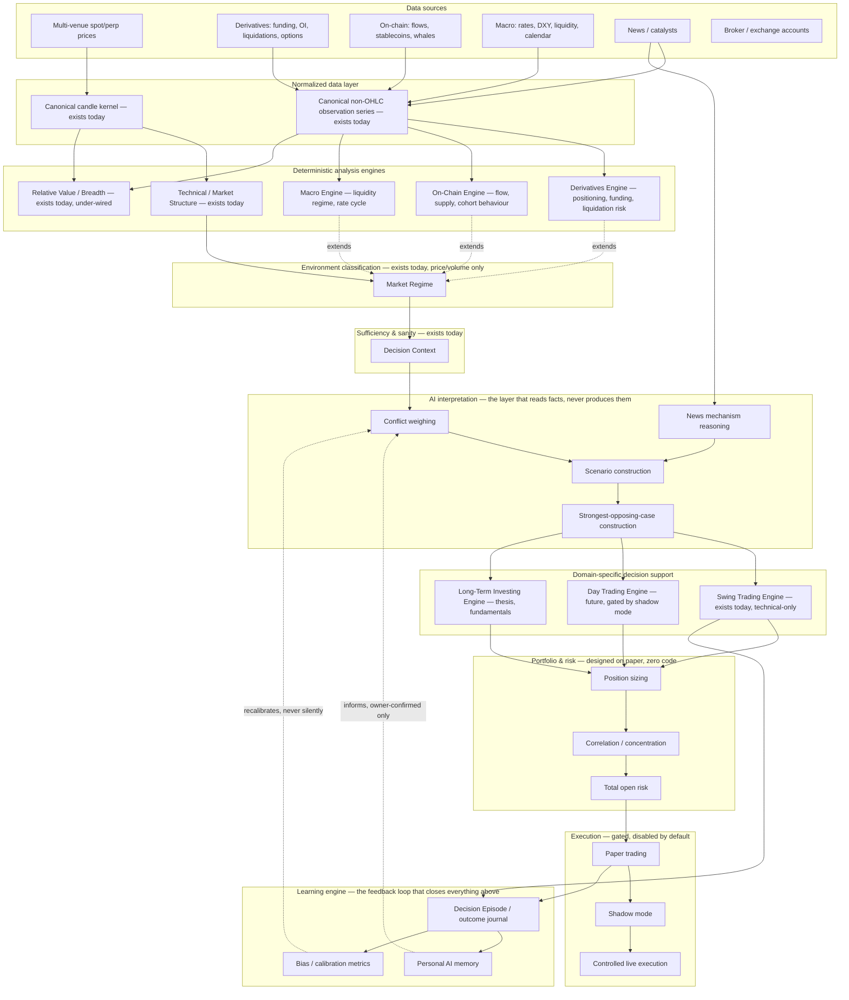

# FMITS Information Edge Research V1

**Status:** Research only. No implementation, no roadmap, no milestone, no ADR, no backlog or changelog
edit, no commit. This document does not praise FMITS and does not condemn it — it asks one question and
answers it as honestly as the live repository allows.
**Date:** 2026-08-08
**Author role:** Lead quantitative researcher pass, adversarial to the product's own self-image.
**Repository state read:** `main`, working tree, commit `2000ba2` (Milestone AV, committed not pushed).
**Method:** Full re-read of the live deterministic pipeline (`src/fmis/`), every architecture and
repository-map document, the two vision documents (`PROJECT_SPECIFICATION_V1.md`,
`PROJECT_VISION_ADDENDUM_V1.md`), the product backlog's epic table, and the four most recent research/
design documents the team itself produced (`AP_ADR_DISCOVERY.md`, `AP_D1_D2_INVESTIGATION.md`,
`EVIDENCE_FAMILY_INDEPENDENCE_RESEARCH_V1.md`, `ADR_IMPLEMENTATION_GATE.md`) — not re-derived from
scratch where those documents already measured something precisely.

**The question this document exists to answer:** not "what does FMITS do" — *what does FMITS still not
know, that an experienced discretionary crypto swing trader already knows before risking capital?*

---

## Table of contents

- [Part 1 — The complete information flow](#part-1--the-complete-information-flow)
- [Part 2 — A professional trader's critique](#part-2--a-professional-traders-critique)
- [Part 3 — Tiered classification](#part-3--tiered-classification)
- [Part 4 — Expected information edge, as ranges](#part-4--expected-information-edge-as-ranges)
- [Part 5 — Five years ahead: a conceptual capability map](#part-5--five-years-ahead-a-conceptual-capability-map)
- [Part 6 — Red team: how to destroy FMITS](#part-6--red-team-how-to-destroy-fmits)
- [Part 7 — The one sequencing question](#part-7--the-one-sequencing-question)

---

## Part 1 — The complete information flow

Binance candles in, a Swing Setup report out. Thirteen stages. Every stage is deterministic; the last
one is the only place a direction is allowed to exist at all
([ADR-0028](../adr/ADR-0028-directional-interpretation-boundary.md)).

```
Binance spot REST klines
        │  (public, unauthenticated, one venue, spot only)
        ▼
fmis.providers.binance        — transport + shape mapping
        │
        ▼
fmis.ingest.candles            — shape validation, canonical decode
        │
        ▼
fmis.data (Candle/CandleSeries)— the kernel: closed candles only, exact UTC timestamps
        │
        ▼
fmis.market_structure           — swing pivots (fixed left/right bar window)
        │
        ▼
fmis.structural_trend           — SUSTAINED_HIGHER/LOWER/NEUTRAL/INDETERMINATE (unconditional persistence)
        │
        ▼
fmis.level_crossing → fmis.structure_break → fmis.change_of_character
        │                                     (close-only breaks; wicks are "rejections," never signal)
        ▼
fmis.features (indicators)      — EMA/RSI/MACD/ATR/relative volume — single-instrument, technical-only
        │
        ▼
fmis.relative_value             — pairwise return/vol/correlation between two already-aligned series
        │
        ▼
fmis.pipeline (analyze_symbol,  — one/many timeframes composed, no cross-timeframe synthesis
  multi_timeframe)
        │
        ▼
fmis.decision_support           — classifies TREND/MOMENTUM observations only (2 of 10 evidence families populated)
        │
        ▼
fmis.market_regime              — structure/volatility/participation, price-and-volume-derived only
        │
        ▼
fmis.decision_context           — sufficiency gate: SUFFICIENT/LIMITED/INSUFFICIENT (data depth, not market)
        │
        ▼
fmis.swing_setup                — the one directional layer: 3-family tally + regime gate → WAIT/CANDIDATE/CONFIRMED
        │
        ▼
fmis.workspace / fmis.daily / fmis.archive / scan / backtest
        │
        ▼
   Swing Setup report — SIDE, real stop/target levels, computed R:R, probability = NOT_CALIBRATED
```

### Stage-by-stage: inputs, outputs, assumptions, what is discarded, uncertainty, irreversibility

**1. Binance spot REST klines** (`fmis.providers.binance`)
- **In:** symbol, interval, limit. **Out:** raw OHLCV JSON rows, one venue, spot market only.
- **Assumption:** one venue's spot order book is a sufficient proxy for "the market" in an asset class
  where perpetual futures routinely carry more volume and more informed flow than spot, and where
  liquidity is fragmented across a dozen venues with materially different depth and even different
  prices during stress.
- **Discarded, permanently, at this first bar:** every other venue's price and depth; the entire
  derivatives market (funding, OI, liquidations, basis); the order book itself (depth, spread); the
  trade tape (aggressor side, size distribution).
- **Irreversible decision:** single-venue, spot-only, public-REST-only. Nothing downstream can recover
  what this boundary never captured — this is not a later-stage filter, it is the top of the funnel.

**2. Ingestion → canonical `Candle`/`CandleSeries`** (`fmis.ingest`, `fmis.data`)
- **In:** raw kline shape. **Out:** validated, immutable OHLCV bars with strictly increasing UTC
  timestamps. **Assumption:** an OHLCV bar is a sufficient unit of "what happened" for structural
  analysis.
- **Discarded:** intrabar path — which of a bar's high/low happened first is explicitly, permanently
  unrepresentable by design (the repository's own stated position, inherited through every layer above
  it: ADR-0021, the AP-D4a/D6b findings below). This is a genuine, honest limitation, not an oversight —
  but it is still information a tape-reading trader has and FMITS structurally cannot.
- **Irreversible decision:** closed-candles-only. No forming-bar signal is ever used, anywhere, by
  design (repainting is a worse failure mode than the resulting lag) — but the lag is real: up to one
  full bar's worth of staleness, which is up to **one week** on the weekly context view.

**3. Market structure — swing detection** (`fmis.market_structure`)
- **In:** closed candle series. **Out:** `SwingPoint`s from a fixed left/right bar comparison window.
- **Assumption:** one fixed pivot granularity is the correct lens at every point in a series' history.
- **Discarded:** every other pivot scale. A discretionary trader visually re-scales what counts as "a
  swing" depending on context (a 2-bar fractal on a ranging day, a 20-bar swing during a trend); this
  layer has exactly one window, set once, per call.
- **No uncertainty** — this stage is exact arithmetic, not interpretation.

**4. Structural trend** (`fmis.structural_trend`)
- **In:** the swing-state history. **Out:** `SUSTAINED_HIGHER`/`SUSTAINED_LOWER`/`NEUTRAL`/
  `INDETERMINATE`, from a fixed policy: two consecutive same-direction shifts, no opposing one between
  them.
- **Assumption baked into the number, stated by the team itself:** persistence is unconditional — a
  trend that stopped making sense 500 candles ago still reads `SUSTAINED` if nothing opposing has
  happened since. This is documented, not hidden, but it means the single headline structural fact the
  whole downstream chain depends on has no decay and no strength gradient.

**5. Level crossing → structure break → change of character**
- **In:** structural levels + candle closes. **Out:** BOS/CHoCH facts, close-only.
- **Assumption:** only a close beyond a level counts as structure breaking; a wick that reaches beyond
  and closes back inside is a "rejection," full stop.
- **Discarded:** exactly the information many discretionary and algorithmic traders weight most heavily
  in crypto specifically — a stop-hunt/liquidity-sweep wick, which is frequently the *more* informative
  event (deliberate liquidity engineering ahead of the real move) than the eventual close-break.

**6. Feature engine** (`fmis.features`)
- **In:** one series. **Out:** EMA/RSI/MACD/ATR/relative-volume `FeatureValue`s. Single-instrument,
  technical-only by test-enforced contract.
- **Discarded by category, permanently at this layer's own boundary:** anything non-technical (macro,
  on-chain, derivatives, sentiment) is structurally forbidden here, by design, forever — a real
  boundary, not a gap that will fill itself as milestones proceed.

**7. Relative Value Engine** (`fmis.relative_value`)
- **In:** two already-aligned `ObservationSeries`. **Out:** period return, relative return, realized
  vol, vol ratio, Pearson correlation. Unannualized, no rolling windows, no beta.
- **Assumption:** whatever benchmark the caller supplies is the relevant one. In practice, the product
  surface almost never supplies a macro benchmark (DXY, SPX, gold) — only ever another crypto symbol.
  The engine is capable of cross-asset correlation; the product has never wired it to a non-crypto
  series.

**8. Decision support / evidence classification** (`fmis.decision_support`)
- **Out:** an `EvidenceReport` organized by the ten-family taxonomy (`fmis.evidence.EvidenceFamily`:
  TREND, MOMENTUM, VOLUME, VOLATILITY, MARKET_STRUCTURE, RELATIVE_STRENGTH, LIQUIDITY, MACRO, NEWS,
  SENTIMENT). **Only two of ten are populated with an actual descriptor**
  (`price_vs_ema_fast`/`_slow`, `ema_fast_vs_ema_slow` under TREND; `rsi_zone`, `macd_vs_signal`,
  `macd_histogram` under MOMENTUM). VOLUME and VOLATILITY are measured but never classified into
  evidence. LIQUIDITY, MACRO, NEWS and SENTIMENT are **empty by name in the source code today** — not
  planned-and-pending, literally zero lines.

**9. Market regime** (`fmis.market_regime`)
- **In:** structural trend + a slow ATR baseline. **Out:** structure/volatility/participation, three
  independent dimensions, never collapsed into one label.
- **Assumption:** an asset's regime is fully describable from its own price and volume history. No
  cross-asset regime input exists — the system cannot represent "crypto is in a risk-off macro regime
  because real yields are rising," only "this symbol's own structure is ranging."

**10. Decision context** (`fmis.decision_context`)
- The one genuinely unusual strength in this pipeline: a sufficiency gate that asks whether *enough
  trustworthy data* exists to continue, independent of whether the evidence agrees. `SUFFICIENT` /
  `LIMITED` / `INSUFFICIENT`. This measures data depth, never market quality — it cannot detect "the
  market itself is currently unreadable" (e.g., a liquidation cascade), only "this instrument has too
  few candles."

**11. Swing Setup Engine** (`fmis.swing_setup`) — the one directional layer
- **In:** three role views (CONTEXT/SETUP/EXECUTION). **Out:** WAIT/CANDIDATE/CONFIRMED + SIDE, real
  detected stop/target levels (never fabricated), computed R:R, probability always `NOT_CALIBRATED`.
- **The policy:** at least two of three "independent" evidence families must agree, zero opposing:
  CONTEXT-role structural trend, SETUP-role structural trend, SETUP-role evidence dominant alignment.
- **This is the single most consequential finding this document inherits from the team's own recent
  research** (`EVIDENCE_FAMILY_INDEPENDENCE_RESEARCH_V1.md`, Milestone AW, measured on 21,680 real
  observations): the three families are **not** independent. Chance-corrected agreement (κ) is 0.02
  between CTX and SETUP trend, 0.10 between CTX and evidence alignment, but **0.41 between SETUP trend
  and evidence alignment** — real, substantial redundancy. Worse, CTX participated in **100% of the 578
  directional results in the dataset, with no exception**, and this was traced to source as an
  *architectural necessity*, not a coincidence: the regime gate's `TRENDING` classification and the CTX
  evidence vote are both built from the identical underlying value
  (`context_view.structure.trend`). The "3 independent confirmations" the design markets to itself is,
  measured, closer to 1.3–2 genuinely independent axes. This is discussed further in Parts 2 and 4.

**12–13. Workspace / daily / archive / scan / backtest**
Composition only — no new computation. The backtest harness (Milestone AV) is the first honest look at
what this policy would have produced historically: **47.4% target-first vs. 52.6% stop-first** on 151
evaluable outcomes, close to a coin flip; **no fees, slippage, spread, execution delay, or position
sizing modelled**; R:R distribution's tail is "genuinely pathological" (p90 = 20.0, max = 41,282) —
measured and reported by the team itself, not softened.

**The single sentence this pipeline earns:** FMITS today answers, with real rigor, *"what did price do,
structurally, on one venue, at candle-close resolution, and does that pattern repeat two or three ways
using inputs that turn out to share one architectural root?"* — and answers nothing else.

---

## Part 2 — A professional trader's critique

Playing the role strictly: **not** modifying FMITS, only naming what is missing, why it matters, how
much edge it plausibly contributes, whether it is deterministic, and where in the pipeline it belongs.

| Missing component | Why it matters to a crypto swing trader | Edge contribution (rough) | Deterministic? | Belongs |
|---|---|---|---|
| **Funding rate / open interest** | The single most crypto-specific risk factor. Extreme positive funding + rising OI on a rising price is a materially different setup than the identical price action with neutral funding — the former is fuel for a violent unwind. FMITS's structural trend cannot distinguish the two today. | High | Yes — both are published numbers, not interpretation | Before Swing Setup (context), inside it (gate/veto) |
| **Liquidations (heatmap / recent cascade)** | Distinguishes an organic structure break from a forced, leverage-driven wick that will likely mean-revert. FMITS's close-only break rule already discards wick information (Part 1, stage 5); liquidation data is the one thing that could partially recover it. | High | Yes, as raw feed; interpretation of "cascade vs. noise" needs a stated threshold | Inside Swing Setup, as a veto/context flag |
| **BTC dominance / BTC-beta** | Most alt setups are not idiosyncratic — they are BTC beta with noise. A trader always asks "is this the coin, or is this just BTC." FMITS's RVE can compute this (pairwise correlation exists) but the product has never wired a BTC benchmark into the swing workflow. | High | Yes | Before Swing Setup (context, regime) |
| **Macro liquidity regime (DXY, real yields, a global-liquidity proxy)** | Crypto is arguably the highest-beta macro-liquidity asset that exists. A multi-week swing trend is more often a macro liquidity story than an idiosyncratic one. Zero macro input exists anywhere in the live pipeline. | High | Partially — the raw series (DXY, yields) are deterministic; regime classification from them needs a stated policy | Before Swing Setup (context) |
| **Orderbook depth / spread / liquidity** | A computed stop/target is meaningless if the level cannot actually be filled near the stated price. The backtest's own pathological R:R tail (p90=20) is partly a symptom of no liquidity filter existing anywhere. | High | Yes, from a book snapshot | Inside Swing Setup (a feasibility check on stop/target) |
| **Portfolio-level risk / correlation / position sizing** | The vision's own stated #1 principle is capital preservation, and the 2% rule is written down — but **zero code implements it**. A "CONFIRMED" setup today says nothing about whether taking it is safe given everything else already held. | Critical (not optional) | Fully deterministic once positions are known | After Swing Setup, before any capital decision |
| **Backtest realism (fees, slippage, execution delay)** | The one existing backtest explicitly ignores all four. A near-coin-flip win rate before costs is very likely a losing system after them — this is not a refinement, it changes the sign of the conclusion. | High | Yes | After Swing Setup (measurement layer) |
| **Volatility regime beyond realized ATR (implied vol / DVOL)** | Realized vol is backward-looking; a trader also prices what the market currently expects (e.g., ahead of a known catalyst). FMITS's volatility dimension is ATR-ratio only. | Medium | Yes, where an options-implied series exists (BTC/ETH have one; most alts do not) | Before Swing Setup (regime) |
| **Volume profile / auction structure (VPOC, value area)** | Refines "where is the level that matters" beyond a fixed-window swing pivot — the market's own record of where volume actually transacted, not just where price touched. | Medium | Yes | Inside/before Swing Setup (structure refinement) |
| **Exchange netflow / stablecoin supply** | A leading indicator of supply pressure a price-only system cannot see by construction — coins moving to exchanges ahead of a sell-off, or stablecoin supply expanding ahead of buy-side capacity. | Medium | Yes, from public on-chain data | Before Swing Setup (context) |
| **Sentiment (funding-derived, Fear & Greed, social)** | Genuinely contrarian at extremes; genuinely noisy in the middle. Lower ceiling than the items above because it is the weakest-quality signal class even for professional desks, but a real zero today. | Low–Medium | Partially — funding-derived sentiment is deterministic; social/NLP sentiment is not | Before Swing Setup (context, low weight) |
| **News/catalyst mechanism analysis** | The vision document explicitly wants "what happened → through what mechanism → which assets → did the market actually react" reasoning, not headline summarization. This is squarely an AI-interpretation task over structured facts (an economic calendar, an unlock schedule) — which does not exist as structured data yet either. | Medium | The calendar/schedule is deterministic; the mechanism reasoning is not | Before Swing Setup (context); the reasoning itself is AI, after the facts exist |
| **Session/time-of-day behavior** | Crypto trades 24/7 but liquidity is not uniform — weekend gaps and thin-session moves behave differently from London/NY-session moves. FMITS treats every candle identically regardless of session. | Low–Medium | Yes | Inside features (context annotation) |
| **Rotation / market breadth (% of alts above key MAs, total-market-cap-ex-BTC trend)** | Tells a trader whether "the market" or "this coin" is moving — the single most common discretionary framing question, and one FMITS structurally cannot answer with one-symbol-at-a-time analysis. | Medium | Yes, computable from the same OHLCV the system already fetches, across the watchlist | Before Swing Setup (context) |
| **ETF flows (spot BTC/ETH)** | A real, publicly reported, high-signal flow series specific to the current market structure (2024+ spot ETF regime) that did not exist when much of the trading literature FMITS's principles were drawn from was written. | Medium | Yes | Before Swing Setup (context) |
| **Options positioning (put/call skew, dealer gamma)** | Genuinely informs where price is likely to pin or accelerate near expiries — a real professional-desk input, available today only for BTC/ETH and a handful of majors. | Low–Medium (narrow asset coverage caps its value) | Partially | Before Swing Setup (context) |
| **Post-trade outcome learning (the Decision Episode)** | Fully designed on paper (`TRADING_DOMAIN_ARCHITECTURE_V1.md`) and **zero code exists**. Without it FMITS can never learn from its own realized accuracy — every improvement is argued from first principles, never measured against lived outcomes. | High, compounding over time | Yes, as a recording/measurement layer | After Swing Setup (learning loop) |

**What is *not* missing, stated for balance.** Price-structure primitives (swings, BOS, CHoCH, trend),
technical momentum, and — uniquely for a personal system — an honest sufficiency gate and a measured
(not assumed) understanding of how independent its own directional evidence actually is. These are
genuine strengths and Part 4 credits them.

---

## Part 3 — Tiered classification

Forced to prioritize: **10 Tier A maximum, 15 Tier B maximum**, everything else Tier C.

### Tier A — absolutely necessary before risking real money on this specific product

1. **Portfolio/position sizing and correlation-aware risk engine.** The gap between the vision's own
   stated #1 principle (capital preservation, 2% max risk) and zero implemented code is the single
   largest integrity gap in the whole system, independent of any market-information question.
2. **Backtest realism — fees, slippage, execution delay.** Without this, no probability the system will
   ever produce is trustworthy; the near-coin-flip result already measured could be a real loser once
   costs apply, and nobody knows yet.
3. **Fix — or at minimum honestly re-state — the evidence-family independence claim.** Not new data:
   the AW research already exists and already proved the "3 independent families" collapse toward one
   architectural axis. Shipping more directional confidence on top of an unexamined redundancy compounds
   a known defect.
4. **Funding rate + open interest** for traded symbols. Cheapest genuinely new signal with the highest
   crypto-specific payoff; public data, no adapter complexity beyond a second REST client.
5. **BTC dominance / BTC-beta regime.** Uses an engine that already exists (RVE); the product has simply
   never wired a BTC benchmark into the swing workflow. Nearly free, high value.
6. **Liquidation/leverage-flush awareness.** Directly recovers part of the intrabar information the
   close-only break rule deliberately discards (Part 1, stage 5) — the single sharpest known blind spot
   in the deterministic structural chain as it applies to crypto specifically.
7. **Orderbook depth / spread / basic fill feasibility check.** Directly targets the measured pathological
   R:R tail (p90 = 20, max = 41,282) with a concrete, bounded fix.
8. **Macro liquidity regime (DXY / real yields / a liquidity proxy), even as one coarse flag.** Crypto's
   dominant multi-week driver is frequently macro, not idiosyncratic; the system currently cannot see it
   at all.
9. **Volatility regime beyond realized ATR (implied vol for BTC/ETH at minimum).** Realized-only vol is
   backward-looking exactly where a trader most wants a forward view — ahead of a known event.
10. **Exchange netflow / stablecoin-supply signal.** A genuine leading indicator a price-only system
    structurally cannot derive from its own inputs, and one of very few on-chain metrics cheap enough to
    source reliably today.

### Tier B — strong improvement

1. Volume profile / VPOC / value area (auction market theory over the fixed-window swing pivots).
2. Adaptive, multi-scale pivot detection (today's window is one fixed constant).
3. Sentiment index (funding-derived + Fear & Greed composite; contrarian-extremes use only).
4. Options skew / put-call ratio for BTC/ETH.
5. Correlation to traditional risk assets (SPX, Nasdaq, gold, DXY) — the RVE already supports this; it
   needs product wiring, not new engineering.
6. Session/time-of-day liquidity structure (Asia/London/NY, weekend gap risk).
7. Economic calendar as a structured context flag (FOMC/CPI/NFP dates — not interpretation).
8. Token-specific catalyst/unlock calendar for the traded symbol.
9. Structured news/catalyst mechanism analysis (the vision's own "event → mechanism → asset → reaction"
   chain, over already-structured facts).
10. Market breadth / altcoin-season index (percentage of the watchlist above key MAs).
11. ETF flow series (spot BTC/ETH).
12. Post-trade outcome journal / Decision Episode (designed on paper, zero code — the learning loop the
    whole system otherwise lacks).
13. Cross-venue price/liquidity aggregation (beyond single-venue Binance spot).
14. Whale/large-holder wallet behavior tracking.
15. Drawdown and correlation clustering across currently open positions.

### Tier C — nice to have

Full options-surface/dealer-gamma modeling beyond BTC/ETH; insider and politician trading trackers;
dedicated China/HKEX intelligence; IPO/new-ETF/M&A calendar; full geopolitical event-chain modeling;
AI-generated narrative scenario writing; a visual dashboard; multi-broker execution abstraction; a tax
engine; personal AI memory / versioned insight adjudication; general-ledger accounting beyond the
trading domain; automated day-trading / bounded autonomy (explicitly out of scope per the vision's own
staged development path).

---

## Part 4 — Expected information edge, as ranges

Not profitability — **information edge**: how much of what an experienced crypto swing trader actually
looks at before entering a trade does FMITS currently represent, in any form. Ranges only, deliberately
imprecise where precision would be invented.

| Category | Estimated representation today |
|---|---|
| Price action / candle structure | 85–95% |
| Market structure (swings, BOS, CHoCH, trend) | 75–85% — thorough and rigorously tested, capped by one fixed pivot granularity and the close-only break rule |
| Technical momentum (RSI/MACD/EMA) | 70–85% |
| Multi-timeframe context (no synthesis, by design) | 60–75% |
| Volume (relative volume only — no delta, no profile, no CVD) | 15–25% |
| Volatility (realized ATR only — no implied, no cross-asset regime) | 20–30% |
| Relative value / correlation (engine exists; wired to crypto-crypto pairs only in the product) | 10–20% |
| Regime classification (price/volume-derived only; no macro or cross-asset regime input) | 30–40% |
| **True directional-signal independence** (measured, not assumed — per the AW research) | **10–20%** — materially lower than the "3 independent families" framing implies |
| Derivatives (funding, OI, liquidations, basis, options) | **0%** |
| On-chain (exchange flows, stablecoin supply, whale behavior) | **0%** |
| Macro (rates, DXY, liquidity, calendar, geopolitics) | **0–2%** — named as a backlog epic, zero shipped code |
| News / catalyst intelligence | **0%** |
| Sentiment | **0%** |
| Orderbook / liquidity / microstructure | **0%** |
| BTC dominance / market breadth / rotation | **0%** |
| ETF / stablecoin flows | **0%** |
| Portfolio & position-sizing risk management | **0–5%** — a stated principle in the vision document, unimplemented in code |
| Probability calibration | **0%** — explicitly, permanently `NOT_CALIBRATED` until a real backtest exists |
| Backtest realism (fees, slippage, execution) | **0%** — explicitly not modelled, stated on the report itself |
| Post-trade learning / outcome journal | **0%** — designed on paper (`AP`), zero code |

**Reading this table honestly.** The top four rows are genuinely strong and rigorously built — this is
not a weak technical-analysis engine. But a discretionary swing trader's actual information diet is not
dominated by those four rows; derivatives positioning, macro liquidity, and portfolio risk routinely
decide whether an otherwise-identical price pattern is tradeable at all. FMITS is at or near zero on
every one of those. The system today is a **very well-built partial view of one input class** — price
and its own derived structure — represented with unusual rigor, sitting inside a much larger picture
that is almost entirely dark.

---

## Part 5 — Five years ahead: a conceptual capability map

Conceptual only. No code, no ADRs, no package names beyond what already exists. Arrows are "depends on
and is gated by," not an implementation order.



**Reading the dependencies that matter most.** The learning engine (bottom) is drawn feeding back into
AI interpretation, never into the deterministic engines — the repository's own deterministic-first
principle should hold five years out exactly as it holds today: a learned bias correction is itself a
fact for the AI layer to weigh, never a silent rewrite of a computed number. Portfolio & risk sits
between decision support and execution for every domain (swing, day, investing) rather than being
duplicated per-domain — a single risk ledger the whole system shares, which is exactly the shape the
`AP` design already proposes on paper. Macro, on-chain and derivatives all extend the regime layer
rather than bypassing it into the directional decision directly — regime is meant to stay "the
environment, never a direction" ([ADR-0025](../adr/ADR-0025-market-regime-engine-v1.md)) even after
every new data source lands.

---

## Part 6 — Red team: how to destroy FMITS

The premise: unlimited budget, hired specifically to beat this system. Brutally honest, both ways.

**What the competitor builds, and why it wins on raw information.**

A well-funded team does not build a deterministic, mutation-tested, ADR-governed pipeline with a
sufficiency gate and an honest `NOT_CALIBRATED` flag. That discipline is expensive in calendar time and
buys correctness, not speed or coverage — the opposite trade a fast-money shop makes. They build:

- **Real-time, multi-venue order flow and derivatives fusion** — funding, OI, liquidation heatmaps and
  options-dealer gamma across every major venue, refreshed in seconds, not once per candle close.
  FMITS's closed-candles-only discipline (a deliberate, defensible choice against repainting) is, from
  this competitor's chair, simply latency they do not pay — up to a week of it, on the weekly context
  view.
- **A macro liquidity model** (Fed net liquidity, DXY, real yields, global M2 proxies) driving the
  regime classification directly, where FMITS's regime today is entirely price-and-volume-derived and
  cannot see the dominant multi-week driver of crypto trend at all.
- **Portfolio-level, correlation-aware, continuously re-optimized capital allocation** — instant Kelly-
  or risk-parity-style sizing across dozens of correlated positions, where FMITS has zero lines of
  position-sizing code today despite naming it a core principle.
- **A live feedback loop trained on thousands of realized trades**, recalibrating constantly against
  actual P&L — where FMITS has one exploratory, fee-free, slippage-free backtest measuring a near-coin-
  flip result on 151 outcomes, and no Decision Episode / outcome journal in code at all.
- **Cross-asset, cross-venue liquidity awareness**, so every stop and target is checked against real
  fillable depth before it is ever shown — where FMITS's own backtest already exposes a pathological R:R
  tail (p90 = 20, max = 41,282) with nothing filtering it.

Given all of the above, this competitor reacts faster, sees a wider information surface, sizes capital
correctly, and learns from its own outcomes. On every axis Part 4 scores near zero, they would start
ahead — decisively.

**What the competitor would *not* bother building, and why that is FMITS's one real asset.**

An unlimited-budget adversary optimizing to win, not to be correct, has no incentive to build:
byte-identical-restoration mutation testing; a sufficiency gate that refuses to answer when data is
thin; a directional layer that can only ever report `WAIT` or `NO TRADE`, never a fabricated entry; an
evidence-independence audit that voluntarily discovers its own redundancy and reports it rather than
hiding it (`EVIDENCE_FAMILY_INDEPENDENCE_RESEARCH_V1.md` is exactly this — a system finding and
publishing its own weakness, unprompted). Fast-money systems overfit on purpose, because overfitting
that works this quarter pays this quarter; a system this disciplined is structurally incapable of that
shortcut. **This is a real, load-bearing difference, but it is not itself an edge** — discipline without
information is just a well-tested description of an incomplete picture. The honest verdict: FMITS's
rigor makes it a *trustworthy* foundation to add real information to; it does not, by itself, make it a
*competitive* one against an adversary with the missing 80% of Part 4's table already built.

---

## Part 7 — The one sequencing question

*"If we spend the next six months building features, which sequence is most likely to maximize real
trading edge?"* — not coding efficiency, not architectural elegance.

Ranked by information-edge-per-unit-of-effort, using what Part 3's Tier A already established:

1. **Re-examine and honestly re-state the evidence-family independence finding before adding anything
   else.** This is not new data — the measurement already exists (Milestone AW). Shipping more
   confidence on top of a known, measured redundancy compounds a defect rather than adding edge. Free,
   in the sense that no new data source is required — it is a policy question about data already held.
2. **Funding rate + open interest.** Cheapest genuinely new external signal (public REST, no orderbook
   complexity), highest crypto-specific payoff of anything on the missing list, and directly informs the
   single risk factor (leverage/squeeze) most likely to invalidate an otherwise-correct structural read.
3. **BTC dominance / BTC-beta regime.** The engine already exists (RVE); this is wiring, not new
   engineering, and it closes the single most common discretionary framing gap ("is this the coin, or is
   this just BTC").
4. **A minimal portfolio/position-sizing risk layer**, even a simple max-open-risk and correlation
   check across whatever the owner is actually holding. Every setup found by items 1–3 is worthless if
   there is no answer to "how much, and what does this do to total risk" — and this is the single
   largest gap between the vision's stated principles and shipped code.
5. **Backtest realism — fees, slippage, execution delay.** Before adding more signals on top of the
   existing policy, the one number that says whether the current policy works at all (47.4/52.6, near a
   coin flip) needs to be measured honestly, with costs, or every subsequent improvement is being tuned
   against a fantasy fill.
6. **A basic liquidity/orderbook feasibility check** on computed stop/target levels — directly and
   cheaply targets the already-measured pathological R:R tail.
7. **A coarse macro liquidity flag** (DXY direction, real-yield direction) as context, not
   interpretation — cheap to source, high payoff given how macro-beta-dominated multi-week crypto trends
   typically are.
8. **Liquidation/leverage-flush detection** as a veto or context flag — recovers part of the intrabar
   information the close-only break rule deliberately discards, specifically for the crypto-native
   failure mode (a stop-hunt wick that later reverses).
9. **Volatility regime beyond realized ATR** (implied vol, where it exists — BTC/ETH only) — refines the
   regime layer with a forward-looking input to complement the existing backward-looking one.
10. **Exchange netflow / stablecoin-supply signal** — the highest-complexity item of the ten in six
    months' terms (a real on-chain adapter), placed last within this window not because it lacks edge but
    because it is the most expensive of the top ten to source reliably.

**The sequencing principle underneath this list, stated once:** fix what is already claimed before
claiming more (#1), add the cheapest genuinely new crypto-specific risk signals before anything exotic
(#2–3), close the capital-preservation gap before any of this is tradeable in practice regardless of
signal quality (#4), and only then trust — because only then measure honestly — whether the policy this
whole pipeline exists to produce actually works (#5), before spending the remaining budget on
diminishing-but-real signal additions (#6–10). Everything past item 10 on Part 3's Tier A/B lists is real
edge, genuinely, but arrives after the six-month window this question was scoped to.
