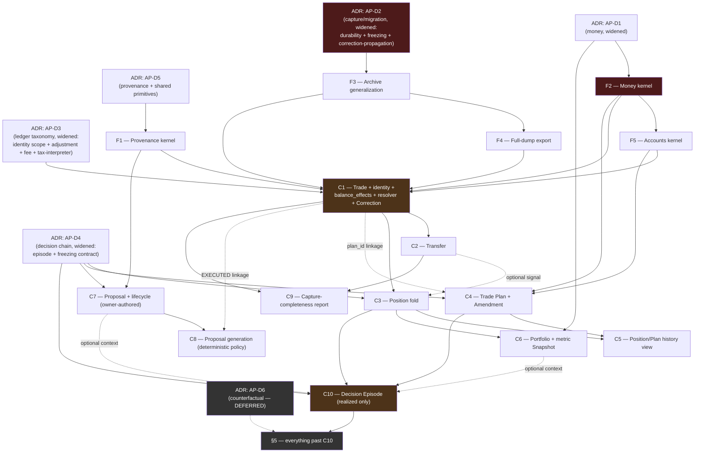

# Implementation Roadmap v1 — from first code to a working trading domain

**Milestone:** AQ (Implementation Phase 1)
**Status:** **Executable plan. Not architecture, not an ADR, not a decision.** Every slice below reuses
decisions already named in `AP` and its ADRs. No new architecture is proposed and no new ADR is
invented — where a real gap exists (found by `AP_ADR_DISCOVERY.md`), it is folded into the nearest
existing AP-D1…AP-D6 ADR as a widened clause, never a new ADR ID.
**Date:** 2026-08-06
**Reads:** [`TRADING_DOMAIN_ARCHITECTURE_V1.md`](TRADING_DOMAIN_ARCHITECTURE_V1.md) v1.2 ·
[`AP_D1_D2_INVESTIGATION.md`](AP_D1_D2_INVESTIGATION.md) ·
[`../reviews/AP_D1_D2_INVESTIGATION_REVIEW.md`](../reviews/AP_D1_D2_INVESTIGATION_REVIEW.md) ·
[`AP_ADR_DISCOVERY.md`](AP_ADR_DISCOVERY.md) · [`../../FMITS_PRODUCT_BACKLOG.md`](../../FMITS_PRODUCT_BACKLOG.md)
§6, §10 · ADR-0027, ADR-0026, ADR-0016, ADR-0005 · the repository at `75a4f40` (`src/fmis`, 108 files,
22 packages; `src/fmis/archive` measured directly for this document)

---

## 0. What this is, and is not

**In scope.** The smallest sequence of independently valuable implementation slices that carries the
repository from its current state — architecture designed, zero domain code written, `RecordType` a
closed two-member enum — to a first working version of manual trade recording, portfolio, position
tracking, swing trade history, AI proposal history, Swedish tax capture, and the learning engine. For
every slice: what gets built, why it is next, what it touches, what must already be accepted, what
proves it works, what becomes visible, what gets easier afterward, what debt it knowingly defers, and
four estimates.

**Out of scope, deliberately.** No architecture redesign — every slice below implements something `AP`
already specified. No new ADR — every real decision gap this document relies on was already named in
`AP_ADR_DISCOVERY.md` and is folded here into whichever of AP-D1…AP-D6 is the closest existing owner,
exactly as that document's §6 proposed. No code. No commits. No backlog edits — this is a plan for the
owner to sequence into `FMITS_PRODUCT_BACKLOG.md` §5/§6, not an edit to it.

**Grain.** Each slice is sized to match the repository's own established milestone grain — one ADR
clause (if any) at most, one design decision proven in code, one package or one clean extension to an
existing package, a full test pass including the guard-test and mutation-testing discipline every prior
milestone in `FMITS_PRODUCT_BACKLOG.md` §8 already carries, and a stated answer to *"what can the owner
do after this that was impossible before."* Where a candidate slice failed that last test — where
splitting it further would produce a piece with **no** owner-visible value — it was not split further,
and §3/§4 say so explicitly at the point that judgment call was made.

---

## 1. How to read this

- **F1…F5** are the **foundation phase**: kernel packages and infrastructure with no user-visible
  capability of their own, exactly the role `AE` and `AJ` already played in this repository's history.
- **C1…C10** are the **capability phase**: each ships a CLI-reachable capability, never an unreachable
  island — the lesson `AK`'s own retrospective already names (*"made the third stranded island
  reachable"*).
- Every slice's **"ADRs that must already exist"** cites AP-D1 through AP-D6 only, by their existing
  names, noting where its scope must be read as **widened** per `AP_ADR_DISCOVERY.md` §6 (summarized in
  §2 below, not re-argued).
- **C10 (Decision Episode, realized-R only) is this roadmap's finish line** — the point at which all
  seven capabilities the owner asked for have a first working version. Everything past it is named in
  §5 as deliberately deferred, not designed here.

---

## 2. The ADR track (compressed — full reasoning lives in `AP_ADR_DISCOVERY.md`)

Five ADR-acceptance events gate this roadmap. None is re-argued here; each row states only what must be
**true** before the slices that cite it can start, and which real gap (found by the discovery pass) is
folded into that ADR's scope rather than spawning a new one.

| Order | ADR | Scope as accepted | Gap folded in (no new ADR) |
|---|---|---|---|
| **1** | **AP-D5** | `ValueOrigin`, `Assertion` (`AP` §5.2) | + one generic versioned-vocabulary primitive · + one canonical `Absent[T](reason)` shape, reused everywhere `INDETERMINATE`/`ABSENT`/`NotApplicable` currently reinvent the same idea |
| **2** | **AP-D1** | Money, quantity, currency types — all 8 sub-decisions the investigation named, Option C stated as achievable, Option A's `Decimal` as the computation type, canonical form fixed, crossing rule named, dust versioned (investigation §4.1) | + mark-selection and staleness policy for unrealized P&L / snapshot valuation (a data-sourcing clause, not a representation clause, but small enough to ride with AP-D1 rather than become its own ADR) |
| **3** | **AP-D2** | Capture contract + migration guarantee, Option A with Option C as the named escalation, canonical encoder frozen, byte-identical goldens replaced with digest-verification goldens per the review's C4 (investigation §4.2) | + explicit ratification of `AP` §24.3's four durability classes and §25's freezing policy as the general contract the capture/migration guarantee rests on (`AP_ADR_DISCOVERY.md` AP-D11) · + correction-propagation rule: what a `Correction` owes a frozen downstream artifact (AP-D9) |
| **4** | **AP-D3** | Ledger event taxonomy, `balance_effects()` as the one derived, pure interpreter of an event | + event-identity digest scope, excluding `recorded_at`/`source`/`asserted_by`/`capture_schema_version` from `event_id`, following ADR-0027 §3's own `archived_at` precedent (AP-D7 — the review's C1, otherwise unowned) · + Adjustment/rebase position-fold continuity rule (AP-D3a) · + fee-in-non-primary-asset rule stated once, applied to every event kind that can carry one (AP-D3b) · + `fmis.tax` is a consumer of `balance_effects()`, never an independent interpreter (AP-D3c) |
| **5** | **AP-D4** | The five-object decision chain, the proposal's append-only lifecycle stream (`AP` §7, §8.3–§8.4) | + Position-identity stability is bound to AP-D2's durability rule, not left implicit (AP-D8) · + Decision Episode's shape and `EpisodeOutcome` union are ratified here as the concrete instance of AP-D2's freezing policy (the discovery pass's "Episode & Freezing Contract" finding, folded in rather than spawned) |

**AP-D6** (counterfactual evaluation policy) is **not** on this list. Nothing in F1–F5 or C1–C10 needs
it: every slice through C10 scores only **executed** outcomes (`RMultiple`, real fills, real closes).
AP-D6 is required the moment a `HypotheticalOutcome` is computed for a rejected or expired proposal —
named in §5 as the first deferred item, exactly where `AP` §31.1 already places it ("needed before
step 5, not step 1").

---

## 3. Foundation phase

### F1 — Provenance kernel (`fmis.provenance`)

| # | Answer |
|---|---|
| **1. What exactly** | `ValueOrigin` enum (`MEASURED`/`POLICY_DERIVED`/`ASSERTED`/`INTERPRETED`/`ABSENT`), `Assertion` record, one generic `Absent[T](reason: str)` shape, and one generic versioned-vocabulary primitive (`VersionedTerm` — `name`, `introduced_at`, `retired_at`, no redefinition). Imports nothing, mirrors `fmis.data`'s own bootstrapping. |
| **2. Why next** | Every later package cites `ValueOrigin`/`ABSENT`. Building it once, first, and generically stops four independent subsystems (tags, `PersonalInsight.versions`, classification mappings, tax rule sets) from each reinventing "versioned, retire-not-redefine" and stops three independent reinventions of "value could not be produced, and the reason is data" (`AP_ADR_DISCOVERY.md` AP-D12/AP-D13). |
| **3. Modules touched** | New: `src/fmis/provenance/`. Nothing existing is touched. |
| **4. ADRs required** | AP-D5 (as widened in §2). |
| **5. Deterministic tests** | Construction/validation unit tests for each `ValueOrigin` member and `Assertion`; `Absent[T]` round-trips through equality and repr; `VersionedTerm` rejects redefinition of a retired name (guard test); an AST guard asserting `fmis.provenance` imports nothing from `fmis` (the same pattern `fmis.data` and `fmis.decision_context` already enforce). |
| **6. User-visible capability** | None. Matches `AE`'s own precedent — "not directly user-visible... the last primitive [the next milestone] needed." |
| **7. What gets easier after** | Every subsequent package (money, ledger, proposal, plan, episode) can cite one shared vocabulary instead of inventing its own `Optional`/sentinel/reason-string convention per field. |
| **8. Debt postponed** | The evidence-threshold policy for promoting a `PersonalInsight` (`AP` §21.4) is explicitly not designed here — `VersionedTerm` only supplies the mechanism, not any subsystem's specific vocabulary. |
| **9. Implementation complexity** | Low. A handful of small, self-contained types. |
| **10. Review complexity** | Medium — small in size, but every field decision here is load-bearing for everything downstream; worth the same scrutiny AP-D5 itself received. |
| **11. Regression risk** | None — net-new package, zero existing importers. |
| **12. Owner value** | None directly; unlocks everything else. |

**Can this be smaller?** Considered splitting `ValueOrigin`, `Absent[T]`, and `VersionedTerm` into three
micro-slices. Rejected: each is a handful of lines, none is independently useful without the others
(the first domain record that needs `ABSENT` also needs a reason shape and a term to name), and three
separate review/merge cycles for one cohesive kernel package would be pure process overhead with no
owner-visible milestone between them.

---

### F2 — Money kernel (`fmis.money`)

| # | Answer |
|---|---|
| **1. What exactly** | `Asset`, `Money(amount: Decimal, asset: Asset)`, `Quantity(amount: Decimal, asset: Asset)`, `FxRate`, the dust policy (named, versioned), the canonical decimal-text codec (fixed-point, no exponent, stated trailing-zero rule), the one named `float → Decimal` crossing rule, and the "no stored quotient" construction guard. All eight AP-D1 sub-decisions, resolved together (investigation §1.4, §4.1). |
| **2. Why next** | Every ledger, plan, proposal and portfolio field that touches an amount depends on this type existing and its canonical form being fixed — and fixed **before** anything is archived, because the canonical form determines the digest that determines every later identity (investigation §1.3.9, N1). Shipping money in pieces was evaluated and rejected: see below. |
| **3. Modules touched** | New: `src/fmis/money/`. Nothing existing is touched — `fmis.data`'s `float` OHLCV contract is explicitly untouched (`AP` §5.3, §5.6). |
| **4. ADRs required** | AP-D1 (as widened in §2 — includes the mark-selection/staleness clause, needed by F2's callers later, not by F2 itself). |
| **5. Deterministic tests** | Canonical-form round-trip (`decode(encode(x)) == x`, byte-identical) for a matrix of representative amounts including `"0.10"` vs `"0.1"` (must canonicalize to the same bytes — this is the exact corruption class N1 names); the crossing rule against measured `float` inputs including the `59020.13` case the investigation measured; a construction guard rejecting any code path that stores a computed quotient as a field (mirrors ADR-0016 §4's existing "no derived count" guard, applied to money); dust-threshold application at the boundary case; an AST guard asserting `fmis.money` imports nothing from `fmis`, matching `fmis.data`'s own guard. Mutation target: same near-100 % kill rate as every prior milestone (`FMITS_PRODUCT_BACKLOG.md` §8 pattern). |
| **6. User-visible capability** | None yet. |
| **7. What gets easier after** | Every domain object with a money or quantity field (Trade, Plan, Position, Portfolio, Snapshot, Tax) is now typing against a fixed, tested contract instead of a `float` placeholder that would need retrofitting. |
| **8. Debt postponed** | The per-asset venue-precision registry (tick size, step size) is explicitly **not** built — `AP` §27 excludes a registry with lifecycle management, and the investigation's Q4 resolution (record, don't validate) is adopted, deferring instrument-precision validation to whenever the owner reports a real mistyped-quantity incident. Reward/airdrop acquisition-value provenance (mark-selection's sharpest instance) is postponed to the slice that builds the `Reward` event kind (§5, deferred). |
| **9. Implementation complexity** | Medium — the type itself is small; the canonical-form and crossing-rule correctness is the real work, and it must be right the first time. |
| **10. Review complexity** | **High** — this is the one slice in the entire roadmap where a wrong call is not cheaply reversible once real trades exist (changing the canonical form after the first Trade is archived invalidates every digest computed so far). Warrants the same hostile-review discipline `AP_D1_D2_INVESTIGATION_REVIEW.md` already gave the design. |
| **11. Regression risk** | None — net-new, zero existing importers, `fmis.data` untouched. |
| **12. Owner value** | None directly; the single highest-leverage slice in the foundation phase. |

**Can this be smaller?** Considered shipping the `Decimal` type first and the canonical form / crossing
rule / dust policy as follow-up slices. **Rejected, explicitly, on N1's evidence**: a Trade recorded
under an undecided canonical form has an undefined `event_id` the moment the form is later fixed —
every amount typed in the gap would need re-digesting, silently changing identities that other records
may already reference. The eight sub-decisions are independently *nameable* (the investigation split
them for exactly that reason) but not independently *shippable* without reintroducing the corruption
class the investigation flagged Critical.

---

### F3 — Archive generalization (extend `fmis.archive` to N record types)

| # | Answer |
|---|---|
| **1. What exactly** | `RecordType` becomes an open, registered enum instead of the current two-member closed one (`WORKSPACE`, `DAILY_RUN`, measured directly in `src/fmis/archive/envelope.py`). `ArchiveStore.archive_workspace`/`archive_daily_run` — currently two bespoke methods (`src/fmis/archive/storage.py`) — are re-expressed as thin callers of one generic `archive_record(record_type, payload, subject, analysis_as_of, codec)`, with a per-type codec registered once. `load()` dispatches on the stored `record_type` instead of returning a hardcoded `Workspace | DailyRun` union. |
| **2. Why next** | Every domain object from C1 onward needs to be archived, and the archive today can archive exactly two things, both L7 presentation models. Building this once, generically, before the first domain object exists avoids writing the identical "one more `archive_<type>` method" seven more times (Trade, Plan, Proposal, Position... no — Position/Portfolio are rebuildable, not archived directly, but Trade, Plan, Proposal, Snapshot, Episode all are). |
| **3. Modules touched** | `src/fmis/archive/envelope.py`, `src/fmis/archive/storage.py`, `src/fmis/archive/codec.py` (dispatch, not the two existing codec functions themselves), `src/fmis/archive/manifest.py` (record-type-specific summary field becomes per-type, not a two-way `if`). `fmis.workspace`/`fmis.daily` codecs are **not rewritten** — they become the first two registrations against the new generic mechanism. |
| **4. ADRs required** | AP-D2 (as widened in §2 — this slice is where the durability-class/freezing-policy ratification and the digest-scope precedent actually get exercised in code for the first time, on record types that already exist). |
| **5. Deterministic tests** | **Characterization tests first**: capture `fmits swing --archive` / `fmits daily --archive` output (rendered text and archived bytes) *before* the refactor, assert byte-identical output *after* — this is the regression gate, not a new-feature test. Then: registering a third, synthetic record type and archiving/loading/verifying it exercises the generic path independent of `Workspace`/`DailyRun`. `archive verify`, `archive list`, duplicate-detection and conflict-detection (ADR-0027 §6) re-run against the synthetic type to prove the generalization didn't narrow to "works for two hardcoded types by coincidence." |
| **6. User-visible capability** | None new — but every existing command (`fmits swing --archive`, `fmits daily --archive`, `fmits archive list/show/verify`) must continue to behave identically, byte-for-byte. |
| **7. What gets easier after** | Every capability-phase slice that archives a new record type (C1's Trade, C4's Plan, C7's Proposal, C10's Episode) adds one codec registration, not one storage-layer patch. |
| **8. Debt postponed** | Manifest partitioning (`AP` §24.4's measured 5 MB / 200 ms trigger) is untouched — the generalization changes *what* can be archived, not *how many* records the flat manifest scales to. |
| **9. Implementation complexity** | Medium — mechanical, but touches code with real production traffic (`AO`'s existing commands) rather than being purely additive. |
| **10. Review complexity** | Medium-High — the risk is subtle regression in already-shipped behavior, which is harder to review than new code because "it looks unchanged" is not the same as "it is unchanged." |
| **11. Regression risk** | **Medium** — this is the one foundation slice that touches code every current product command depends on. Mitigated by the characterization-test-first discipline in row 5. |
| **12. Owner value** | None directly; `fmits swing --archive` continues to work exactly as before. |

**Can this be smaller?** Considered doing this generalization lazily — hardcode a third `archive_trade`
method when C1 needs it, generalize only once a fourth type makes the duplication undeniable. Rejected:
the digest/envelope/manifest logic is exactly the code the durability and migration guarantee (AP-D2)
depends on being uniform across record types; writing it correctly once, under review, before real
irreplaceable records exist is cheaper than writing it three times and reconciling three slightly
different implementations under the migration guarantee later.

---

### F4 — Full-dump export mechanism

| # | Answer |
|---|---|
| **1. What exactly** | A generic, byte-faithful concatenation of every archived record plus the manifest, using the investigation's Q9 resolution: this is the **full dump** (the escape hatch), kept structurally and namewise distinct from the **export suite** (§23.2's lossy, Excel-shaped projections, which are not built in this roadmap — see §5). Works over whatever `RecordType`s F3 has registered at the time it runs; adds none of its own. |
| **2. Why next** | `AP` §5.7 item 4 and §24.5 are explicit: *"a full-dump export exists before the first real record is written."* This is a hard precondition on C1, not a nice-to-have — it is the literal reading of the migration guarantee's fourth clause, and building it against F3's generic mechanism (rather than against Trade specifically) means it never needs revisiting as new record types are added. |
| **3. Modules touched** | New: a small `fmis.archive` extension (or thin sibling module) walking the manifest and re-emitting every record's stored bytes plus its digest. No domain package exists yet for it to read — it depends only on F3. |
| **4. ADRs required** | AP-D2 (as widened — this is literally one of AP-D2's four named clauses). |
| **5. Deterministic tests** | Dump-then-restore round-trip: every record in a synthetic archive is recoverable byte-identically from the dump alone, with no dependency on the original archive root; a corrupted archive (one flipped byte in one record) is caught by the dump's own digest check, not silently included; running the dump against zero records produces a valid, empty, well-formed artifact (the "before the first real record" case this slice exists to satisfy). |
| **6. User-visible capability** | `fmits archive dump` — a working escape hatch, usable today even though it currently dumps nothing but `Workspace`/`DailyRun` records. |
| **7. What gets easier after** | C1 can ship immediately after this without violating §5.7 item 4; no capability-phase slice needs to remember to "also update the full dump" because the mechanism is already generic. |
| **8. Debt postponed** | The lossy export suite (§23.2 — trade log, position log, proposal log, tax working papers, etc.) is explicitly **not** this. It is deferred to its own future slice, per the investigation's own two-artifact resolution (Q9). |
| **9. Implementation complexity** | Low — it is a read-only walk over F3's already-generalized storage. |
| **10. Review complexity** | Low-Medium. |
| **11. Regression risk** | Low — additive, read-only, no existing command's behavior changes. |
| **12. Owner value** | Small but real and immediate: a working backup/escape-hatch mechanism exists before the owner has anything irreplaceable to lose. |

**Can this be smaller?** Not usefully — it is already a thin, single-purpose read-side mechanism. The
temptation would be to defer it past C1 "since there's nothing important to dump yet," but that is
exactly the ordering `AP` §5.7 item 4 forbids, and the cost of building it now (small, since F3 already
generalized the storage layer) is much lower than the cost of retrofitting it once real trades exist and
proving retroactively that nothing was lost in the gap.

---

### F5 — Account/Market/Book identifiers (`fmis.accounts`)

| # | Answer |
|---|---|
| **1. What exactly** | `Account`, `Venue`, `Custody`, `Book` (`INVESTING`/`SWING`/`DAY`/`PAPER`), `Market` (base asset, quote asset, venue, mode) — identifiers with attributes only, explicitly **not** a registry with lifecycle management (`AP` §27's own constraint, carried forward unchanged). |
| **2. Why next** | Every ledger event needs to name a market, account and book (`AP` §11.2); this is the last small kernel piece before the first domain object. |
| **3. Modules touched** | New: `src/fmis/accounts/`, importing `fmis.money` (for `Asset`) per `AP` §27's stated layout. |
| **4. ADRs required** | None beyond AP-D1 (already accepted by F2) — `AP` §27 already settles that this stays minimal reference data, not an open decision. |
| **5. Deterministic tests** | Construction/validation for each type; a `Market`'s base/quote pair round-trips through the money kernel's `Asset` type; `Book` membership is exhaustive over the four named values with no silent fifth default. |
| **6. User-visible capability** | None. |
| **7. What gets easier after** | C1's Trade can name `market`/`account`/`book` against a typed, tested contract instead of bare strings. |
| **8. Debt postponed** | The instrument-precision registry (tick size, step size) stays explicitly out of scope, same reasoning as F2's Q4 resolution. |
| **9. Implementation complexity** | Low. |
| **10. Review complexity** | Low. |
| **11. Regression risk** | None — net new. |
| **12. Owner value** | None directly. |

**Can this be smaller?** Could be merged into C1 (build these types only when Trade needs them). Kept
separate because `Account`/`Market`/`Book` are also needed by Position (C3) and Portfolio (C6)
independently of Trade, and a shared, reviewed-once kernel is cheaper than three slightly different
inline definitions.

---

## 4. Capability phase

### C1 — Trade ledger event, identity, `balance_effects()`, resolver, Correction

*Delivers: **manual trade recording** · **Swedish tax capture** (fields present from day one, per `AP`
§22.2 — completeness is verified later, in C9).*

| # | Answer |
|---|---|
| **1. What exactly** | The `Trade` ledger event (`AP` §11.2's authoritative field list, in full, including `fx_rate_to_tax_currency`/`fx_source` and `capture_schema_version` from the start), `balance_effects(event)` as a pure function (base in, quote out, fee out, signs reversed for a sell — `AP` §11.4), content-derived `event_id` excluding the non-economic fields the review's C1 flagged (`recorded_at`, `source`, `asserted_by`, `capture_schema_version` — AP-D3's widened scope), the one-enforced-read-path resolver (`AP` §5.1), and the `Correction` event kind (supersede-by-reference, never edit). CLI: `fmits trade record` (the owner's three-input happy path — quantity, price, fee, per `AP` §11.3), `fmits trade correct`, `fmits trade list`. |
| **2. Why next** | This is the smallest object that proves the entire chain end to end — money (F2), identity (AP-D3), archival (F3), the migration guarantee's forward-reader discipline, and the resolver's supersession contract — on the simplest possible domain object, before any of Plan/Proposal/Position/Portfolio's added complexity is layered on. It is also literally the owner's named first target capability. |
| **3. Modules touched** | New: `src/fmis/ledger/` (events, `balance_effects`, resolver, corrections). Registers a codec with F3's generalized archive. Reads `fmis.money`, `fmis.accounts`, `fmis.provenance`. |
| **4. ADRs required** | AP-D1, AP-D2, AP-D3 (all as widened in §2), AP-D5. |
| **5. Deterministic tests** | Idempotent re-submission of a byte-identical Trade produces the identical `event_id` (ADR-0027 §6 duplicate handling, reused); re-submission with a **different** `recorded_at`/`source`/`capture_schema_version` but identical economic fields **also** produces the identical `event_id` — this is the exact regression test for the review's C1 finding, and it must be red before AP-D3's widened scope is implemented and green after; `balance_effects()` produces exactly three signed movements for a Trade, mirrored correctly for buy vs sell, with the fee folded when denominated in base or quote and treated as a fourth movement when in a third asset (`AP` §1.3.4); a Correction supersedes without mutating the original file (byte-for-byte, verified against the archive's own digest) and the resolver returns the corrected value while the original stays independently readable (`AP` §5.1); a guard test asserts no module outside the resolver reads a ledger file directly (mirrors the existing "no direct archive file access" test pattern already in this repository for `fmis.archive`); a golden-file fixture for Trade `CAPTURE_SCHEMA_VERSION` 1 is committed now, establishing the forward-reader discipline before it is ever exercised for real. |
| **6. User-visible capability** | *"I can record a fill with three inputs, correct a mistake without losing the original, and every trade carries what Swedish tax will eventually need."* — the first genuinely new thing the owner can do since `AO`. |
| **7. What gets easier after** | Position (C3) has a real ledger to fold over; Transfer and every other event kind (deferred, §5) reuse the identical `balance_effects`/identity/resolver/Correction machinery rather than inventing it per kind. |
| **8. Debt postponed** | Venue-precision validation (record, don't validate — F2's Q4 resolution, applied here); the adapter's original-text capture beside the parsed value (cheap, real, and explicitly deferred to whenever `AP` §32 step 4's exchange sync is scheduled — not blocking manual entry); `Reward`/`Transfer`/`Adjustment`/`StandaloneFee` event kinds (§5). |
| **9. Implementation complexity** | **High** — the single most demanding slice in the capability phase: financial correctness, identity correctness, and the resolver's supersession contract all have to be right simultaneously. |
| **10. Review complexity** | **High** — this is where the AP-D1/AP-D2/AP-D3 decisions first meet real code; every sub-decision the investigation and its review found needs a corresponding test, not just a corresponding sentence in an ADR. |
| **11. Regression risk** | Low to the rest of the product (`fmits swing`/`fmits daily` do not read the ledger) — contained to the new `fmis.ledger` package and F3's already-hardened generic archive path. |
| **12. Owner value** | **High** — this is the first of the seven target capabilities to land, and it unblocks two more (position tracking, tax capture) almost immediately. |

**Can this be smaller?** Two splits were considered and rejected, both worth stating precisely:

- *Split construction/validation from persistence.* Rejected — a Trade type with no durable storage
  provides zero product value (it cannot survive a process restart), and this repository's own rule
  ("no milestone without product value") forbids shipping that as a milestone on its own.
- *Split Correction out into its own follow-up slice, ship Trade with a naive resolver first.* This is
  the one place a genuinely smaller alternative exists and was not chosen for a stated reason rather
  than an oversight: a resolver that does not apply supersession is not the resolver `AP` §5.1
  describes, and building the naive version first means either shipping a component that has to be
  materially rewritten (not extended) once Correction lands, or shipping direct-file access as a
  stopgap that then has to be retrofitted away from existing call sites — harder than not creating them.
  The recommended path bundles them; an owner who wants the smaller, riskier slice can split here
  knowingly.

---

### C2 — Transfer ledger event

*Contributes to: **Swedish tax capture** completeness (deposits/withdrawals must not be mistaken for
disposals or gains).*

| # | Answer |
|---|---|
| **1. What exactly** | The `Transfer` event kind — same asset moved between accounts, not a disposal, changes custody/venue risk (`AP` §11.7), including the fiat-deposit/withdrawal case that makes time-weighted return computable later. CLI: `fmits transfer record`. |
| **2. Why next** | Without it, the owner's first deposit into the system looks like an unexplained balance increase once Position/Portfolio exist — cheap to add now, before that confusion is possible, and it reuses C1's identity/resolver/Correction machinery unchanged. |
| **3. Modules touched** | `src/fmis/ledger/` (new event kind + its `balance_effects()` branch), same archive registration pattern as C1. |
| **4. ADRs required** | Same as C1 — no new ADR content, this is AP-D3's taxonomy being filled in one kind at a time. |
| **5. Deterministic tests** | `balance_effects()` for a Transfer returns exactly two movements (source out, destination in) plus an optional network-fee movement, uniform with the fee-in-non-primary-asset rule AP-D3's widened scope states once and applies here (`AP_ADR_DISCOVERY.md` AP-D3b) — this is the first real exercise of that rule, so it is a genuine regression test, not a restatement; a Transfer is asserted to never appear in a disposal-classification query. |
| **6. User-visible capability** | *"I can record moving funds onto or between venues without it corrupting my trade history."* |
| **7. What gets easier after** | Portfolio (C6) can compute deposits/withdrawals-since-last-snapshot (`AP` §14.2's required "Flows" field) without a placeholder. |
| **8. Debt postponed** | Reward and Adjustment event kinds remain deferred (§5). |
| **9. Implementation complexity** | Low — smallest possible extension of C1's already-proven pattern. |
| **10. Review complexity** | Low. |
| **11. Regression risk** | Low. |
| **12. Owner value** | Medium — real, but smaller than C1; mainly a correctness safeguard for what C6 needs later. |

**Can this be smaller?** No — it is already the smallest event kind after Trade, and it is not
independently splittable (a "deposit-only" vs "withdrawal-only" split would be the same code twice).

---

### C3 — Position fold (`fmis.positions`)

*Delivers: **position tracking**.*

| # | Answer |
|---|---|
| **1. What exactly** | The pure fold from ledger events to `Position` (`AP` §12): flat-crossing identity within `(market, book)` using F2's dust threshold, `average_entry` (WAC, never stored as a lone quotient — the `(total_cost, total_quantity)` pair is held, per the investigation's §1.3.5 finding), `realized_pnl` (path-dependent fold), `net_quantity`, `opened_at`/`closed_at`, reconciliation state (`UNRECONCILED` only — `AP` §12.5, the other two states arrive with exchange sync, out of scope here). CLI: `fmits positions` (open and closed, per market/book). |
| **2. Why next** | Direct, hard dependency on C1 (and benefits from C2 existing so a Transfer never accidentally reads as a position-opening trade). Nothing about Plan, Proposal, or Portfolio is required — Position is a pure function of the ledger alone. |
| **3. Modules touched** | New: `src/fmis/positions/`, importing `fmis.ledger` (via the resolver only, per `AP` §27 rule 8), `fmis.money`. Not archived directly — it is a rebuildable projection (`AP` §24.3), so no F3 registration. |
| **4. ADRs required** | AP-D3 (ledger it folds over), AP-D4 (as widened — Position is one of the five decision-chain objects and this is where its identity-stability clause, AP-D8, is first load-bearing: the fold must be provably identical every time it runs against an unchanged ledger, which is exactly `AP` §24.3's CI test). |
| **5. Deterministic tests** | The `AP` §24.3 CI test itself: delete the projection, recompute from the ledger, assert byte-identical result — implemented here for the first time, not just described; a three-buys-three-sells sequence closes to exactly zero net quantity (the representation-dust case the investigation measured, now proven against real `Decimal` arithmetic rather than asserted); a direction flip (a fill carrying exposure through zero) splits into two positions at the correct instant (`AP` §12.2); WAC is verified against a hand-computed multi-lot DCA sequence; a Correction to an underlying Trade is folded correctly (exercises C1's Correction path from the consumer side for the first time). |
| **6. User-visible capability** | *"I can see what I'm holding and how each position has done, computed from my recorded trades, not typed separately."* |
| **7. What gets easier after** | Portfolio (C6) has real positions to value; Decision Episode (C10) has a real close event to trigger on. |
| **8. Debt postponed** | `RECONCILED`/`DISPUTED` reconciliation states (arrive with exchange sync, `AP` §32 step 4 — not this roadmap); `EXPLICIT_KEY` position grouping (`AP` §12.2, deferred with a stated trigger the design already names — no consumer has reported the case yet). |
| **9. Implementation complexity** | Medium — the fold logic itself is a well-specified pure function; the main work is proving it against the CI-test discipline rigorously enough that AP-D8's identity-stability concern is actually addressed, not merely asserted. |
| **10. Review complexity** | Medium-High — this is the slice where a subtle fold bug (an off-by-one in flat-crossing, a WAC rounding order mistake) would silently misstate P&L, so the review should specifically probe the dust-threshold boundary and the direction-flip case. |
| **11. Regression risk** | Low — reads the ledger through the one enforced path, writes nothing. |
| **12. Owner value** | **High** — second of seven target capabilities. |

**Can this be smaller?** Considered shipping `average_entry`/`realized_pnl` in a follow-up slice after a
bare open/closed/net-quantity view. Rejected: a position view without P&L answers "what am I holding"
but not "how is it doing," which is the more valuable half of the question and costs little extra once
the fold exists — splitting here would produce a first slice with real but noticeably thinner value for
no real risk reduction (the P&L fold uses the identical inputs as the quantity fold).

---

### C4 — Trade Plan and PlanAmendment

*Contributes to: **swing trade history**.*

| # | Answer |
|---|---|
| **1. What exactly** | `TradePlan` (`AP` §9.2 — `initial_invalidation` as the one field that must never change, `intended_size` in risk terms, `strategy_id`+`strategy_version` pinned at commit) and `PlanAmendment` as append-only events with a required reason from the closed vocabulary (`AP` §9.3). CLI: `fmits plan create`, `fmits plan amend`. `Trade.plan_id` (already an optional field since C1) is exercised for the first time. |
| **2. Why next** | Independent of Proposal (an unproposed plan is equally valid, `AP` §9.1) and of Portfolio; its only hard dependency is the money/accounts kernel plus C1's Trade existing so `plan_id` linkage is meaningful. Ships now, ahead of Proposal, so the owner can start planning trades before the (larger) Proposal/lifecycle machinery lands. |
| **3. Modules touched** | New: `src/fmis/plan/`. Registers a codec with F3. Reads `fmis.money`, `fmis.accounts`, `fmis.provenance`. |
| **4. ADRs required** | AP-D4 (Plan is one of the five decision-chain objects). |
| **5. Deterministic tests** | `initial_invalidation` is provably immutable by construction — no code path can alter it after creation, only supersede via amendment (mirrors ADR-0016 §4's projection-not-field discipline, applied to a single field this time); an amendment without a reason from the closed vocabulary is rejected at construction, not at render time; the "effective plan is the fold of its amendments" claim is tested directly, the same fold-not-edit pattern as C1's ledger. |
| **6. User-visible capability** | *"I can commit to a plan before I execute, and if I widen a stop under pressure later, that is recorded as what it is, not silently edited away."* |
| **7. What gets easier after** | C5 (history view) has plan-vs-outcome columns to show; C10 (Episode) has `initial_invalidation` to compute R-multiple against. |
| **8. Debt postponed** | Plan-adherence scoring (entry inside zone, size within tolerance, targets taken as planned — `AP` §20.5) is not computed here, only the raw data it will need is captured. |
| **9. Implementation complexity** | Low-Medium — smaller than C1, reuses its identity/archival patterns. |
| **10. Review complexity** | Medium — the "never edit, only amend" discipline needs the same scrutiny C1's Correction got, for the same reason. |
| **11. Regression risk** | Low. |
| **12. Owner value** | Medium — real on its own, and the first half of what makes C5 meaningful. |

**Can this be smaller?** No further useful split — `TradePlan` without `PlanAmendment` would let the
first stop-widening go unrecorded, which is precisely the failure `AP` §9.3 calls "the most reliable
predictor of an outsized loss" and the whole reason this object exists as events rather than a mutable
record.

---

### C5 — Position/Plan history view

*Delivers: **swing trade history**.*

| # | Answer |
|---|---|
| **1. What exactly** | A read-side composition, no new domain object: one row per position (open or closed), joined against its plan (if any) and its trades, showing intended vs actual (entry zone vs fills, `initial_invalidation` vs distance held, intended size vs actual). CLI: `fmits history` (or an extension of `fmits positions` with a `--plan` flag — a naming choice, not an architecture one). |
| **2. Why next** | Both of its inputs (C3, C4) already exist; this is the slice that turns two independently useful objects into the specific capability the owner asked for by name. Nothing about it is new machinery — it is a composition, deliberately kept that way rather than becoming a new captured-artifact type (that would be premature; `AP` §23.2's "Position log, one row per position, with plan and outcome columns" already describes this exact shape as an eventual export, not a new domain type). |
| **3. Modules touched** | A thin read/render module, likely alongside `fmis.positions` or as a small composition-root addition — no new package. |
| **4. ADRs required** | None beyond what C3/C4 already required — this slice makes no new domain decision. |
| **5. Deterministic tests** | Golden-output tests against a fixture ledger with a mix of planned/unplanned, open/closed positions; a position with no plan renders with an explicit `ABSENT`-with-reason (F1's shared shape) rather than a blank column, per `AP` §7's "the absence is itself a measured datum" rule for the unplanned-trade case. |
| **6. User-visible capability** | *"I can see my swing trade history — what I planned, what I did, and how it went — as one view."* |
| **7. What gets easier after** | This is the shape the future export-suite's "Position log" (§23.2) generalizes from; building the view first and the durable export later is lower-risk than the reverse. |
| **8. Debt postponed** | Plan-adherence scoring as a computed metric (vs. just showing the raw comparison) — same debt C4 already named. |
| **9. Implementation complexity** | Low. |
| **10. Review complexity** | Low — no new financial-correctness surface, purely presentational composition over already-tested folds. |
| **11. Regression risk** | Low. |
| **12. Owner value** | **High** — this is where "position tracking" and "planning discipline" become a legible history rather than two separate lookups the owner has to reconcile mentally. |

**Can this be smaller?** No — it is already the smallest possible unit that gives this specific
capability a name and a command, rather than leaving it as an implicit "well, you could join C3 and C4
yourself" gap.

---

### C6 — Portfolio config + metric-row Snapshot

*Delivers: **portfolio**.*

| # | Answer |
|---|---|
| **1. What exactly** | `Portfolio` as config events (`portfolio_id`, `name`, `base_currency`, `scope`, `limits` — `AP` §13, folded as-of like every other event stream, per §13.3), and a **metric-row-only** `PortfolioSnapshot` (`AP` §14.4's cheaper cadence): total value, cash, invested capital, realized/unrealized P&L, per-asset weights — **not** the full per-holding composition (deferred, see debt row). Mark source for unrealized P&L and valuation: the last available closed-candle close from `fmis.providers`/`fmis.data` (already built, already fetched for every other command) — this is F2's mark-selection clause's first concrete answer, deterministic and stated rather than implicit. CLI: `fmits portfolio show`, `fmits portfolio configure`. |
| **2. Why next** | Hard dependency on C3 (Position) for the "Positions" section of a snapshot (`AP` §14.2); no dependency on Plan, Proposal, or Episode. |
| **3. Modules touched** | New: `src/fmis/portfolio/`. Registers a codec with F3 for the Snapshot (a captured artifact, per `AP` §24.3); config events live in the same ledger mechanism C1 established. Reads `fmis.positions`, `fmis.money`, `fmis.data`/`fmis.providers` (the trading domain reading the market half for the first time in practice, per `AP` §5.6). |
| **4. ADRs required** | AP-D1 (as widened — the mark-selection clause is exercised here for the first time), AP-D2 (as widened — Snapshot as a captured artifact, frozen with the marks it used, per §14.3), AP-D3 (reads Position, which reads the ledger), AP-D4. |
| **5. Deterministic tests** | §14.3's rule directly: a Snapshot never recomputes from live data — re-running `fmits portfolio show` after the underlying mark has changed does not alter a previously stored Snapshot's values, only produces a new one; a missing mark for a held asset renders as `ABSENT`-with-reason (F1's shape), never a zero (`AP` §14.3's explicit "a zero makes the total look plausible and survives for years" warning, tested directly); `scope`'s "a pair belongs to at most one portfolio" constraint is enforced at configuration time. |
| **6. User-visible capability** | *"I can see what my portfolio is worth right now, and that figure is anchored to marks I can trace, not silently recomputed later."* |
| **7. What gets easier after** | Decision Episode's "Portfolio context" (`AP` §17.4) has a real Snapshot to (optionally) reference. |
| **8. Debt postponed** | **Full per-holding composition storage** (`AP` §14.2's fuller shape) — explicitly deferred past this slice, which is itself the concrete case `AP_ADR_DISCOVERY.md` AP-D16 named: if a later Episode's constraint check ever needs to reference *this* Snapshot for full composition detail, it will only have the metric row. Flagged here, not silently accepted — the fix, if the owner wants it now rather than later, is to widen C6 to also persist full composition at every snapshot rather than only on the cheaper cadence; this roadmap recommends starting cheap and revisiting once Episode (C10) is live and the gap is either real or not. Also postponed: liquidity tier, correlated-cluster exposure, Portfolio Intelligence / constraint checks (`AP` §15 — explicitly `ABSENT`-with-reason until its own later milestone, matching `AP` §32 step 6). |
| **9. Implementation complexity** | Medium — the mark-selection integration with `fmis.data`/`fmis.providers` is the first time the trading domain reads the market half in practice, so it is worth treating as real integration work, not a formality. |
| **10. Review complexity** | Medium — mainly around the "never recompute a frozen snapshot" guarantee (§14.3), which is easy to get subtly wrong (e.g., caching a mark reference instead of the mark value itself). |
| **11. Regression risk** | Low-Medium — the read from `fmis.data`/`fmis.providers` is new traffic through an existing, well-tested boundary; low risk of touching existing command output. |
| **12. Owner value** | **High** — third of seven target capabilities, and the first time the owner sees the market half and the owner half of the product in one place. |

**Can this be smaller?** Yes, and the split is already made explicit in row 1: full composition storage
is deferred to a follow-up refinement rather than bundled here, specifically because the metric row
alone already answers "what is my portfolio worth" — the owner's most immediate portfolio question —
without needing the heavier per-holding storage discipline. This is the roadmap's clearest example of
choosing the smaller slice deliberately and naming the debt it creates (AP-D16) rather than discovering
it later.

---

### C7 — Proposal + append-only lifecycle stream (owner-authored)

*Delivers: **AI proposal history**, first version — manually logged, not yet auto-generated.*

| # | Answer |
|---|---|
| **1. What exactly** | `OpportunityProposal` (`AP` §8.2) and `ProposalLifecycleEvent` (§8.4) as an append-only stream, with `author = OWNER` only in this slice — the owner manually logs a setup they are considering, then the system tracks its lifecycle. `MEASURED` lifecycle kinds (`ENTRY_TRIGGERED`, `INVALIDATION_REACHED`, `EXPIRED_UNTRIGGERED`, `EXPIRED_UNDECIDED`) are computed by an **on-demand** scan against `fmis.level_crossing` (already built), run as part of `fmits daily`/`fmits proposal review` — no background scheduler (`D-05` stays explicitly out of scope, matching the backlog's own existing deferral). CLI: `fmits proposal create`, `fmits proposal decide` (accept/reject with a reason tag), `fmits proposal list`. |
| **2. Why next** | Deliberately built against the simplest possible proposal *author* first — no dependency on Trade, Position, or Portfolio at all (a Proposal's `market`/`book` are self-contained identifiers) — so the storage and lifecycle-fold machinery is proven against manual input before C8 wires it to the much larger existing L0–L7 analysis engines. This is the roadmap's other explicit example of de-risking by splitting *who authors the input* from *how the storage works*. |
| **3. Modules touched** | New: `src/fmis/proposal/`. Registers a codec with F3. Reads `fmis.money`, `fmis.accounts`, `fmis.provenance`, and (read-only) `fmis.level_crossing` for the `MEASURED` scan. `Trade.proposal_id`/`plan_id` linkage (already optional fields) is exercised when a proposal is accepted and later executed. |
| **4. ADRs required** | AP-D4 (as widened — the proposal-identity-under-rerun clause, AP-D10, and the lifecycle-evaluation-cadence clause, AP-D4a, are both first exercised here), AP-D5. |
| **5. Deterministic tests** | The three-authors-three-truth-conditions split (`AP` §8.3) is tested directly: an owner decision, a `MEASURED` lifecycle fact, and (later, not this slice) a system action are provably distinct event kinds with distinct correctability rules; `EXPIRED_UNDECIDED` fires exactly when `valid_until` passes with no `OWNER_DECIDED` recorded, and is provably silent about whether the owner looked (`AP` §8.4's own stated honesty constraint, tested as a negative — the event carries no such claim); a re-run of the on-demand scan against an unchanged ledger and unchanged candle history is idempotent (no duplicate lifecycle events); `AP_ADR_DISCOVERY.md`'s AP-D10 concern is tested directly — two manually-logged proposals with identical content but different `created_at` do not collide, and the test states explicitly that this is intended, not a gap. |
| **6. User-visible capability** | *"I can log a setup I'm considering, decide on it, and watch what happens to the ones I didn't take — did they trigger, invalidate, or just expire?"* |
| **7. What gets easier after** | C8 wires automatic proposal generation into the identical storage/lifecycle machinery this slice already proved; C10's `HypotheticalOutcome` scoring (deferred to AP-D6, §5) has a real corpus of rejected/expired proposals to eventually score. |
| **8. Debt postponed** | `DETERMINISTIC_POLICY`- and `MODEL`-authored proposals (C8 and far beyond, respectively); `PortfolioConstraintCheck` linkage (`AP` §15.5 — `ABSENT`-with-reason, matching `AP` §32 step 6's own deferral); `HypotheticalOutcome` scoring for anything not executed (needs AP-D6, §5). |
| **9. Implementation complexity** | Medium — the lifecycle fold is conceptually similar to C1's Correction/resolver pattern but with more event kinds; the `fmis.level_crossing` integration for `MEASURED` events is new wiring, not new engine logic. |
| **10. Review complexity** | Medium-High — `AP_ADR_DISCOVERY.md`'s AP-D4a finding (evaluation-cadence / intrabar-order equivalence, echoing ADR-0021) is exactly the kind of subtle correctness issue that needs a specific, named review pass, not just general scrutiny. |
| **11. Regression risk** | Low — new package, read-only use of `fmis.level_crossing`. |
| **12. Owner value** | **High** — fifth of seven target capabilities, and the one Finding 5 in `AP` calls the highest-value data in the whole system (what was proposed and rejected, not only what was executed). |

**Can this be smaller?** Already split from C8 for exactly this reason — see row 2. A further split
(ship `OpportunityProposal` with no lifecycle stream first) was considered and rejected: a proposal with
no lifecycle tracking cannot answer the one question the object exists to answer (*"was it any good,
whether or not it was taken"*), so it would ship the object with no route to its own stated purpose.

---

### C8 — Deterministic-policy-authored proposal generation

*Delivers: **AI proposal history**, second version — the "FMITS proposed three setups this morning" case.*

| # | Answer |
|---|---|
| **1. What exactly** | Wires `author = DETERMINISTIC_POLICY` proposal generation into `fmits daily`/`fmits swing`, reusing the already-built regime/structure/level/evidence engines (L0–L7) — no new analysis logic, only a composition-root step that reads their existing output and constructs a Proposal (`AP` §3 steps 1–2: "produces them from regime, structure, levels and evidence — deterministically first, AI narrative later"). `LONG` and `SHORT` are both assessed, `NO_TRADE` is a valid output, `directional_assessment` keeps both cases separate (`AP` §8.2). |
| **2. Why next** | Depends on C7's storage/lifecycle machinery already being proven, and on nothing else new — it is a composition-root wiring exercise over existing engines and C7's already-tested object. Building it after C7 rather than as part of C7 means a bug in "how a proposal is generated" cannot be confused with a bug in "how a proposal's lifecycle is tracked," because the second was already isolated and proven first. |
| **3. Modules touched** | `src/fmis/pipeline/` (or wherever `fmits daily`/`fmits swing` composition already lives) gains a proposal-generation step; `src/fmis/proposal/` gains nothing new structurally — this slice is pure composition. |
| **4. ADRs required** | Same as C7 — no new decision. |
| **5. Deterministic tests** | Given a fixed candle fixture, proposal generation is fully reproducible (same regime/structure/evidence input → byte-identical proposal, mirroring every other deterministic engine's existing test discipline in this repository); `NO_TRADE` is producible and is not silently dropped; the counterfactual-assumption-version field (`AP` §8.2) is stamped as an opaque value at creation, proving the forward-compatibility hook `AP` §31.1 already promises ("step 1 captures the assumption version... so the policy can be decided later without a migration") actually exists in the record, even though nothing reads it yet. |
| **6. User-visible capability** | *"FMITS proposed three setups this morning; I can act on one, and every part of that decision is recorded — including the two I passed on."* — the exact sentence `FMITS_PRODUCT_BACKLOG.md` §6 item 2 already promises. |
| **7. What gets easier after** | The owner no longer has to manually log a setup to get lifecycle tracking — the loop the whole architecture exists for (analysis → proposal → decision → execution → record) closes for the first time without manual proposal entry. |
| **8. Debt postponed** | `MODEL`-authored proposals (needs L8, far beyond this roadmap); calibrated probability (`AP` §20.6, needs a resolved-episode cohort that does not exist yet). |
| **9. Implementation complexity** | Low-Medium — genuinely composition, not new domain logic. |
| **10. Review complexity** | Medium — mainly reproducibility and the "no direction is expressed or implied beyond what the evidence supports" discipline this repository already enforces elsewhere (`AK`'s own review pattern). |
| **11. Regression risk** | Low-Medium — adds a step to `fmits daily`/`fmits swing`'s existing composition root; must not change either command's existing output when the new step is not invoked. |
| **12. Owner value** | **High** — this is the moment "AI proposal history" genuinely means what the owner meant by the phrase, even though no LLM call is involved anywhere in this slice (`AP`'s own "deterministically first, AI narrative later" — narrative is still L8, still far beyond this roadmap). |

**Can this be smaller?** Already the product of splitting C7/C8 apart. A further split (generate `LONG`
and `SHORT` assessment in two passes) was considered and rejected — `AP` §8.2 requires both be assessed
together as one object's two halves, and splitting them would recreate exactly the single-sided-bias
risk `AP` §8.2's design explicitly exists to prevent.

---

### C9 — Capture-completeness report

*Verifies: **Swedish tax capture**, completeness half.*

| # | Answer |
|---|---|
| **1. What exactly** | A read-only report over the ledger (`AP` §22.5's "completeness report" pulled forward from the tax-engine milestone — this slice builds only the report, not the engine) naming every event missing a required `AP` §22.2 capture field (a fee asset present but no acquisition value on a Reward — not yet possible, since Reward isn't built; a Trade with `fx_rate_to_tax_currency` absent when the quote currency differs from SEK — possible today). CLI: `fmits tax completeness`. |
| **2. Why next** | Only meaningful once a real corpus of C1/C2 events exists to check — placed here rather than earlier so it has something to say, and placed before C10 rather than after because tax-capture gaps are unrecoverable (`AP` §22.2 items 9–10) and worth surfacing before the owner has accumulated months of gaps unknowingly. |
| **3. Modules touched** | A small, standalone read module over `fmis.ledger` — no new domain object, no archival. |
| **4. ADRs required** | AP-D3 (the capture contract it checks against). |
| **5. Deterministic tests** | A ledger fixture with a deliberately incomplete Trade (missing FX rate) is reported, named, with a reason — never silently skipped (`AP` §22.5's own stated ethic, "a tax report that silently skips what it did not understand is worse than none," tested directly here even though the *report* being built is the completeness check, not yet a tax report proper). |
| **6. User-visible capability** | *"I can check, at any time, whether my recorded trades have everything Swedish tax will eventually need — before I've recorded thousands of them."* |
| **7. What gets easier after** | Whenever the tax engine itself is eventually built (`AP` §32 step 9, far beyond this roadmap), it inherits a corpus already known to be complete or known to have named gaps, rather than discovering gaps for the first time at filing. |
| **8. Debt postponed** | The tax engine itself (jurisdiction rule set, lots, basis, the report shape — `AP` §22.3) is explicitly not built here; this is capture-completeness only, exactly the distinction `AP` §22.1 already draws between what must not wait (capture) and what can (the engine). |
| **9. Implementation complexity** | Low. |
| **10. Review complexity** | Low. |
| **11. Regression risk** | None — read-only, additive. |
| **12. Owner value** | Medium — real reassurance value, low implementation cost. |

**Can this be smaller?** No — it is already a single, narrow, read-only report.

---

### C10 — Decision Episode (realized outcomes only)

*Delivers: **learning engine**, first version.*

| # | Answer |
|---|---|
| **1. What exactly** | `DecisionEpisode` (`AP` §17) triggered **only** by `POSITION_CLOSED` (a position closing, via C3's fold) and `OWN_IDEA_EXECUTED` where applicable, producing an `RMultiple` outcome (`AP` §17.3) against the plan's `initial_invalidation` (C4). System/market/portfolio context sections are captured at a **minimal, honest level** — populated where cheap and unambiguous (the decision timestamp, the plan reference, the executed fills, MAE/MFE computed at close per §25.3's explicit rule) and marked `ABSENT`-with-reason (F1's shape) where the input does not yet exist (regime-per-role snapshot, Portfolio constraint check — both legitimately absent since neither this roadmap nor `AP` §32 requires them until later milestones). CLI: `fmits episodes list`, `fmits episodes show`. A trivial cohort view (count, average R, `InsufficientSample` below a stated minimum `n` — `AP` §20.3's guard, implemented from day one even with `n = 1`, so the discipline exists before it is load-bearing) is included; full cohort statistics (§20.3's full dimension/statistic matrix) are not. |
| **2. Why next** | The last of the seven target capabilities, and correctly last: Episode denormalizes facts from Position (C3), Plan (C4), and optionally Portfolio (C6) and Proposal (C7/C8) — building it only after all four exist and are proven means the freezing-contract logic (AP-D4's widened scope) has real, tested inputs to freeze rather than placeholders. |
| **3. Modules touched** | New: `src/fmis/episode/`. Registers a codec with F3 (a captured artifact, per `AP` §24.3). Reads `fmis.positions`, `fmis.plan`, optionally `fmis.portfolio` and `fmis.proposal`, `fmis.provenance`. |
| **4. ADRs required** | AP-D4 (as widened — this is the concrete implementation of the Episode/Freezing-Contract finding), AP-D2 (as widened — Episode is where §25's freezing policy is exercised for real for the first time), AP-D1, AP-D3. |
| **5. Deterministic tests** | An Episode is provably frozen — recomputing the fold twice from an unchanged Position/Plan produces byte-identical Episode content, and a later change to the underlying policy (e.g., F2's dust threshold, hypothetically bumped) does **not** silently alter an already-frozen Episode (the direct regression test for `AP_ADR_DISCOVERY.md`'s AP-D8 finding, exercised here rather than only reasoned about); `RMultiple` computed from a hand-verified plan+trade sequence matches exactly; a position with no plan produces `NotApplicable(reason="no plan")` rather than a fabricated R (F1's `Absent[T]` shape, exercised on the outcome type this time); the cohort guard returns `InsufficientSample` at `n` below the stated minimum and a real statistic only above it — tested at both sides of that boundary; MAE/MFE is computed and frozen at close, never lazily, per §25.3's explicit rule (tested by asserting the value survives even when the underlying candle history is (simulated as) later unfetchable). |
| **6. User-visible capability** | *"When a position closes, its R-multiple and outcome are recorded permanently, against what I actually planned, and I can list them."* — the seed of every learning-layer capability `AP` §20 describes, without any of the AI/cohort machinery those later capabilities need. |
| **7. What gets easier after** | Cohort statistics, bias metrics (`AP` §20.5), AI Review (`AP` §19), and Personal Memory (`AP` §21) all read Episodes — this slice is the floor every one of them is built on, and none of them can start meaningfully before it exists. |
| **8. Debt postponed** | `HypotheticalOutcome` for rejected/expired/ignored proposals (needs AP-D6 — the counterfactual evaluation policy, not yet accepted, per §2); the full `AP` §20.3 cohort statistic/dimension matrix and every bias metric in §20.5; `PROPOSAL_REJECTED`/`IGNORED`/`EXPIRED`/`NO_TRADE`/`RISK_AVOIDED` episode kinds (all need AP-D6 or Portfolio Intelligence, neither built here); Journal linkage (`AP` §17.4's "Reflection" section — Journal itself was never on this roadmap's critical path, since it is not one of the owner's seven named target capabilities, and remains a clean, independent follow-on). |
| **9. Implementation complexity** | Medium-High — not because any single computation is hard, but because Episode is genuinely the most denormalized object in the domain, pulling from four other packages; get the freezing discipline wrong here and it is wrong in the one place `AP` §25.2 calls "never recomputed... regenerating it rewrites history." |
| **10. Review complexity** | High — this is the second slice (after F2/Money) that warrants hostile-review-grade scrutiny, specifically on the freezing guarantee, because a subtle bug here (an Episode that silently re-reads live data instead of its frozen inputs) is invisible until years later when the live data has moved. |
| **11. Regression risk** | Low — new package, reads through already-proven consumer paths (the resolver, the position fold), writes only new Episode records. |
| **12. Owner value** | **High** — the seventh and final target capability; also the point at which the product's core thesis ("AI improves my decisions over time," `AP` §4 Finding 5) has its first measurable data point, even before any AI is involved. |

**Can this be smaller?** Yes, and the split is already made explicit in row 1 and row 8: `HypotheticalOutcome`
scoring for non-executed proposals was deliberately cut out (it needs AP-D6, unaccepted) rather than
blocking this slice on an ADR the realized-outcome path does not need. A further split — ship Episode
with no cohort guard at all, add `InsufficientSample` later — was considered and rejected: the guard is
nearly free to include from the start (it is one comparison against a constant) and retrofitting it
after cohort statistics already exist risks the exact silent-degradation failure
`AP_ADR_DISCOVERY.md`'s AP-D17 finding names — better to establish the discipline on day one, at `n = 1`,
than to bolt it on once it is load-bearing.

---

## 5. Deliberately deferred — named, not designed

Everything below is real, already specified in `AP`, and correctly out of this roadmap's scope because
none of it is required for a first working version of the seven target capabilities. Listed so nothing
is silently forgotten, matching this repository's own "recorded, not quietly dropped" discipline.

| Deferred item | Needs | Natural next slice after C10 |
|---|---|---|
| `Reward`, `Adjustment`, `StandaloneFee` ledger event kinds | AP-D3 (already accepted) | Each is its own C1-sized slice, reusing the identical identity/resolver/Correction machinery; `Adjustment` specifically needs the AP-D3a position-fold-continuity rule exercised for real |
| AP-D6 (counterfactual evaluation policy) + `HypotheticalOutcome` for rejected/expired proposals | New ADR content (already scoped in `AP` §8.5, not invented here) | Unlocks the rest of §20.3's cohort matrix and the highest-value bias metrics (`AP` §20.5) that specifically depend on comparing executed vs. hypothetical outcomes |
| Full `AP` §20.3 cohort statistics / §20.5 bias metrics | C10, AP-D6 | The "learning engine, full version" — this roadmap only reaches "first working version" |
| `PortfolioConstraintCheck` / Portfolio Intelligence (`AP` §15) | C6, its own decision on strata/limits (already specified, not an open decision) | Matches `AP` §32 step 6 exactly |
| Journal (`AP` §16) | F1 only | Independent of every one of the seven target capabilities; can run in parallel with the capability phase at the owner's discretion |
| AI Context Package, AI Review, Personal Memory (`AP` §18, §19, §21) | An L8 layer that does not exist yet | Matches `AP` §32 steps 7–8 exactly; genuinely out of this roadmap's horizon |
| Tax engine proper (`AP` §22.3) | C9's completeness report, a jurisdiction rule set (a real decision, not an architecture gap) | Matches `AP` §32 step 9 |
| Export suite (§23.2's lossy projections) | F4 (the full dump is a different artifact, already built) | Matches `AP` §32 step 10 |
| Live order tracking, exchange sync, reconciliation states beyond `UNRECONCILED` | Its own stated trigger (`AP` §10.3) | Matches `AP` §32 step 4 |
| Full per-holding Snapshot composition (vs. C6's metric row) | C6 itself, revisited | The AP-D16 gap named explicitly in C6's row 8 |

---

## 6. Complete dependency graph

Solid edges are hard prerequisites. Dotted edges are soft — the target is genuinely useful without the
source but strictly better with it (e.g., C3 does not need C2 to function, but a Transfer existing
keeps deposit/withdrawal activity from being misread; C10's portfolio/proposal context is legitimately
`ABSENT`-with-reason if C6/C7 have not shipped yet, matching `AP`'s own "boundary, not blocker" pattern
for Portfolio Intelligence).

---

## 7. Optimal order to first working version of each target capability

| Target capability (owner's words) | First working version at | Hard prerequisite chain |
|---|---|---|
| **Manual trade recording** | **C1** | F1, F2, F3, F4, F5 |
| **Swedish tax capture** | **C1** (fields present) → verified complete at **C9** | C1's field list is §22.2 in full from day one; C9 is the completeness check, not new capture |
| **Position tracking** | **C3** | C1 |
| **Swing trade history** | **C5** | C3, C4 |
| **Portfolio** | **C6** | C3 |
| **AI proposal history** | **C7** (manual) → genuinely automatic at **C8** | F1 only for C7; C7 for C8 |
| **Learning engine** | **C10** | C3, C4; optionally C6, C7 |

**Reading order for implementation, start to finish:** F1, F2, F3, F4, F5, C1, C2, C3, C4, C5, C6, C7,
C8, C9, C10 — fifteen slices, five of them foundation-only. C2 and C5 could each be reordered slightly
later without breaking anything downstream (neither gates any of the other thirteen slices); every other
ordering constraint above is a hard dependency, not a preference.

---

## 8. Cross-cutting risk and debt ledger

Aggregated from every slice's rows 8 and 11 above, so the owner does not have to reconstruct it from
fifteen separate tables.

| Concern | First appears at | Status after this roadmap |
|---|---|---|
| Instrument-precision (tick/step) validation | F2 | Deliberately record-not-validate throughout; revisit only on a reported real incident |
| Adapter original-text capture beside parsed value | C1 | Deferred to exchange-sync milestone (`AP` §32 step 4) |
| Full per-holding Snapshot composition | C6 | Named gap (AP-D16), metric-row-only through C10; revisit once C10 shows whether Episode's portfolio context actually needs it |
| `HypotheticalOutcome` for non-executed proposals | C7/C10 | Blocked on AP-D6, not yet accepted — first item past this roadmap's horizon |
| Full cohort statistics / bias metrics | C10 | `InsufficientSample` guard exists from day one; the statistics it will guard do not exist yet |
| Reward/Adjustment/StandaloneFee event kinds | C1/C2 | Each is a same-shaped follow-on slice, not designed here |
| Portfolio Intelligence / constraint checks | C6/C7 | `ABSENT`-with-reason throughout, matching `AP` §32 step 6 exactly |
| Archive generalization's regression exposure to `fmits swing`/`fmits daily --archive` | F3 | Mitigated by characterization-tests-before-refactor; the one foundation slice with non-trivial regression risk |

---

## 9. What this roadmap deliberately does not decide

- **Which slices become which milestone letters.** That is the owner's call, per `FMITS_PRODUCT_BACKLOG.md`
  §11 rule 5 — this document proposes grouping (e.g., F1+F2+F3+F4+F5 as one letter, or five), not names.
- **Whether C6's full-composition-Snapshot gap (AP-D16) should be closed immediately or deferred.** Named
  as an explicit choice in C6's own row, not resolved here.
- **Exact CLI flag/verb spelling.** `fmits trade record` vs. `fmits ledger add-trade` and similar are
  illustrative, not specified — consistent with `AP` itself, which states file layouts and command
  shapes as "the shape of a contract... never proposing a file."
- **Whether AP-D6 should be written before or after C10 ships**, only that C10 does not need it and
  nothing before C10 needs it either — a genuine open sequencing choice for whoever plans past this
  roadmap's horizon.

---

**End of roadmap. Fifteen slices, five ADR-acceptance events (all folded into the six existing AP-D
names), zero new ADRs, zero code, zero commits, zero backlog edits. First working version of all seven
target capabilities lands at slice C10.**
