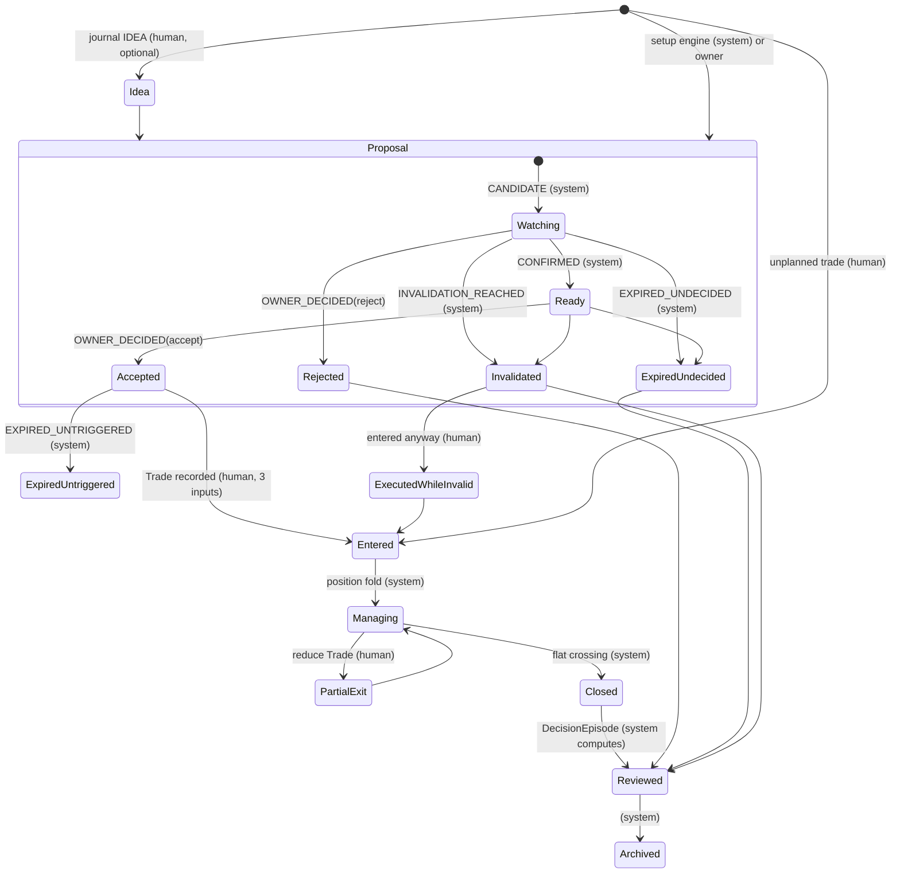
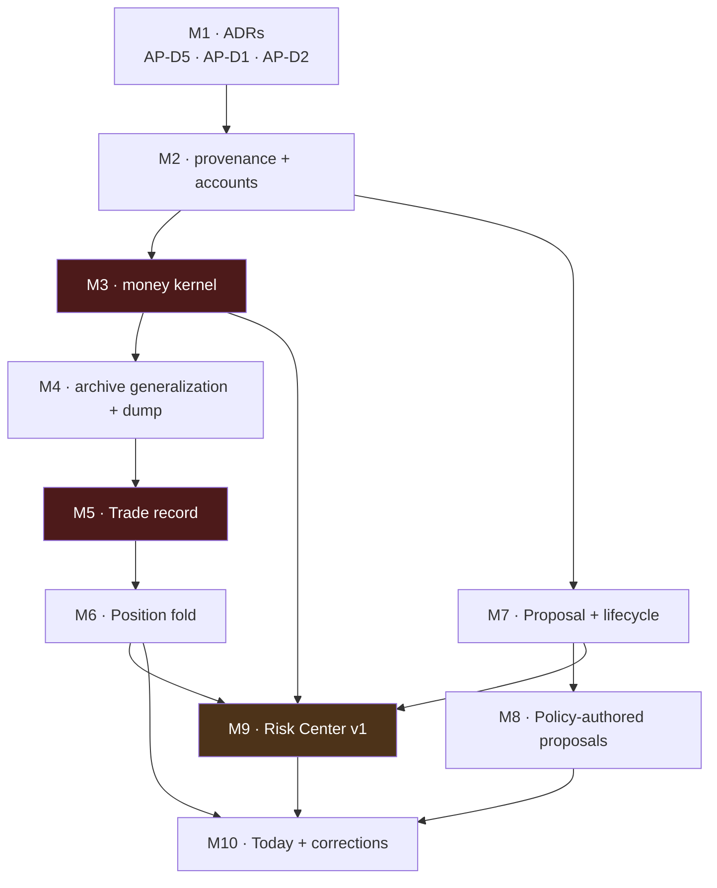

# Swing Trading MVP Blueprint & Product Specification V1

**Milestone:** BF *(this document's own label. The board is not edited and no milestone is sequenced
by this document.)*
**Status:** Product specification / design only. No production code, no tests, no ADR, no backlog
edit, no changelog entry, no `CURRENT_STATE` edit, no commit. This document is the only artifact.
**Date:** 2026-08-11
**Model:** Claude Opus 5
**Repository state read:** `main`, `HEAD` = `7ced9e2`, two commits ahead of `origin/main`
(`f9ddc54`); working tree clean apart from fourteen untracked research documents under `docs/design/`
and `docs/reviews/` (this document becomes the fifteenth).
**Type:** Product specification. Defines a product, a workflow, a boundary and an implementation
order. It produces no contract, binds no decision, and supersedes nothing.

**The one question this document answers:** *if the deterministic engine froze today and no new
market computation were ever added, what product must exist around it so that the owner could
genuinely use FMITS every day as his primary swing-trading workspace?*

---

## 0. Method, evidence rules, and how this relates to `BD` and `BE`

**Method.** Full read of `PROJECT_SPECIFICATION_V1.md`, `PROJECT_VISION_ADDENDUM_V1.md`,
`docs/AI_HANDOFF/START_HERE_FOR_AI.md` and `CURRENT_STATE.md`, `FMITS_PRODUCT_BACKLOG.md`,
`FMITS_PRODUCT_CHANGELOG.md`, the 28 ADR titles plus the ADRs load-bearing here (0003, 0007, 0008,
0011, 0019–0021, 0024–0028), reports 0001–0013 (0004 §12 and 0005 §3 in full), the research chain
`AW` (family independence) · `AX` (evidence calibration) · `AY` (edge segmentation) · `AZ` (failure
attribution) · `BA`/`BB` (confirmation freshness) · `BC` (research-harness correction),
`FMITS_INFORMATION_EDGE_RESEARCH.md`, `TRADING_DOMAIN_ARCHITECTURE_V1.md` (`AP`),
`IMPLEMENTATION_ROADMAP_V1.md` (`AQ`), `SWING_TRADING_READINESS_AUDIT_V1.md` (`BD`),
`TRADER_WORKSPACE_PRODUCT_ARCHITECTURE_V1.md` (`BE`), the live `src/fmis` tree and CLI, and
`prompts/swing-trading-analyzer-v3.md`.

**Three live executions were performed for this document** against real Binance data on 2026-08-11:
`fmits scan` (20 symbols), `fmits setup DOTUSDT`, `fmits swing DOTUSDT`. Output from those runs is
quoted directly and is the primary evidence for every claim about what the product does today.

**Evidence labels.** Every non-trivial claim carries one:

| Label | Meaning |
|---|---|
| **[E]** | Evidence from this repository, a cited document, or a live run performed for this document |
| **[I]** | Inference — a conclusion drawn from cited evidence, stated as such |
| **[O]** | Design opinion — a judgement with no repository evidence behind it |

Where evidence does not exist, the word used is **unknown**.

**Relationship to prior work, stated so the reader knows what is new.** `BD` measured *readiness*
and `BE` designed *a workspace*. This document does neither again. It is the layer above both: the
**product specification and MVP boundary** — what is in, what is deliberately out, who is
responsible for what, and the thirty-day order in which it lands. Where `BD` or `BE` already
established something, it is cited and adopted, never re-derived. Six things here are genuinely new:

1. A **risk layer split into HARD BLOCK / SOFT WARNING / INFORMATION ONLY** (Part 7), including a
   precise definition of what "block" can even mean in a system that executes nothing.
2. A **market-intelligence specification with refresh cadence, placement and priority** (Part 9) —
   the layer `BE` deliberately left undesigned.
3. An explicit **human / system / AI responsibility table with two "must never" lists** (Part 11).
4. A **thirty-day, ten-milestone implementation roadmap** with per-milestone complexity, review
   complexity, value and risk (Part 14), mapped onto `AQ`'s existing slices.
5. A **six-month failure post-mortem written in advance** (Part 15).
6. Two **fresh live findings** neither `BD` nor `BE` records — §1.5 and §3.11 below.

**What this document deliberately does not do.** It invents no threshold, no score, no probability
and no ranking policy the repository has not measured. It designs no page for data FMITS cannot
obtain. It does not claim any surface below is authorized to be built.

---

## Table of contents

- [Part 1 — Product philosophy](#part-1--product-philosophy)
- [Part 2 — The daily workflow](#part-2--the-daily-workflow)
- [Part 3 — The workspace, screen by screen](#part-3--the-workspace-screen-by-screen)
- [Part 4 — Information hierarchy](#part-4--information-hierarchy)
- [Part 5 — The swing trade lifecycle](#part-5--the-swing-trade-lifecycle)
- [Part 6 — Portfolio layer](#part-6--portfolio-layer)
- [Part 7 — Risk layer](#part-7--risk-layer)
- [Part 8 — Trade journal](#part-8--trade-journal)
- [Part 9 — Market intelligence](#part-9--market-intelligence)
- [Part 10 — Notifications](#part-10--notifications)
- [Part 11 — Human vs system vs AI](#part-11--human-vs-system-vs-ai)
- [Part 12 — The MVP boundary](#part-12--the-mvp-boundary)
- [Part 13 — Visual language](#part-13--visual-language)
- [Part 14 — Thirty-day implementation roadmap](#part-14--thirty-day-implementation-roadmap)
- [Part 15 — Failure analysis](#part-15--failure-analysis)
- [Part 16 — Red team](#part-16--red-team)

---

# Part 1 — Product philosophy

## 1.1 What FMITS is

**FMITS is a decision-support and decision-record system for one discretionary swing trader.** It
computes what can be computed from price, refuses what cannot be computed, and remembers what the
owner decided. **[O]**, on **[E]**: `START_HERE_FOR_AI.md` §1 states the pipeline as *"data →
deterministic calculations → structured features → AI interpretation → decision support"* and states
that FMITS is *"not a signal bot and not an automated trading system."*

Four sentences, each of which is a shipped property rather than an aspiration:

1. **It computes rather than estimates.** Every indicator, swing, level, break, change of character,
   regime dimension and risk/reward on a page is code output, not a model's reading of a chart.
   **[E]** The whole `src/fmis` structural chain, ADR-0012 through ADR-0025.
2. **It refuses more than it asserts.** A live run for this document returned **16 WAIT, 3
   CANDIDATE, 1 CONFIRMED, 0 ERROR** across the twenty-symbol watchlist, each WAIT with a specific
   stated reason. **[E]**
3. **It never fabricates a number.** Stop and target are already-detected `PriceLevel` objects
   reused by reference or explicitly absent; probability is permanently `NOT_CALIBRATED`; a live
   `fmits setup DOTUSDT` printed **nineteen limitations** verbatim. **[E]**, live run · `AR-1`,
   `AR-3`.
4. **It is designed to be checkable later.** Analyses are archivable with a content-derived,
   integrity-checked id (`fmits swing --archive`, `fmits archive verify`). **[E]** ADR-0027.

## 1.2 What FMITS is not

| FMITS is **not** | Because |
|---|---|
| A signal service | `WAIT` and `NO TRADE` are first-class successful outcomes; the modal answer is `WAIT` **[E]** spec §6, live run |
| A ranking engine | No validated ranking policy exists. `fmits daily` asserts exactly one `sorted()` call in the package to make ranking structurally hard **[E]** |
| A probability engine | `probability.status` is always `NOT_CALIBRATED`; no calibrated cohort exists **[E]** `AR-1` |
| An execution system | No order object, no fill, no broker boundary — deliberate, per the automation ladder **[E]** spec §11, `BD` §1.8 |
| A charting tool | TradingView stays open beside the terminal. Duplicating price charts badly is worse than not drawing them **[O]**, consistent with `BE` §11.2 |
| A market-wide intelligence platform | Derivatives, on-chain, macro, news, sentiment, order book, ETF flows are all at **0 %** representation today **[E]** `FMITS_INFORMATION_EDGE_RESEARCH.md` Part 4 |
| A replacement for the owner's judgement | It carries four of the parts of a trading decision and, today, none of the other four **[I]**, §1.4 |

## 1.3 Who the user is

**One person. The owner. A learning discretionary crypto swing trader who also builds the system.**
**[E]** `PROJECT_VISION_ADDENDUM_V1.md`: *"This project exists to transition from physical work
toward knowledge-based work"*; `prompts/swing-trading-analyzer-v3.md` line 4: *"I am learning — you
are the expert."*

Five consequences that shape every design decision below. **[I]**

| Property of the user | Design consequence |
|---|---|
| **Single user, single maintainer** | No multi-user, no auth, no server, no accounts. Local files, one binary |
| **Learning, not expert** | The product must state *why* it refuses, not just refuse. Every WAIT already carries a reason **[E]** |
| **Trades a handful of positions, not dozens** | Correlated concentration matters far more than portfolio optimization. Three positions can be one bet |
| **Builds the tool he uses** | Feature requests arrive from the same person who implements them — feature creep is the dominant delivery risk, not underdelivery (Part 12) |
| **Swedish tax resident, capture is irrecoverable** | FX rate and acquisition value must be captured at the moment of the transaction or lost forever **[E]** D-10 owner-confirmed, `AP` §22.2 |

## 1.4 What problem it actually solves

The honest statement, and it is smaller than the vision documents' framing. **[I]**, on `BD` §1.8 and
`BE` §1.8, both of which reach it independently:

> **The owner's workflow is completed by the owner, not by FMITS, at exactly the four points where
> money is decided: size, portfolio, cost and memory.**

| The eight parts of a swing decision | Who supplies it today | Evidence |
|---|---|---|
| 1. What is the market environment | **FMITS** | `fmits regime` — three dimensions, per role **[E]** |
| 2. What is the structure | **FMITS** | swings, levels, BOS, CHoCH, structural trend **[E]** |
| 3. Is there a directional thesis, and what opposes it | **FMITS** | ≥2 of 3 families agreeing, zero opposing **[E]** ADR-0028 |
| 4. Where is invalidation | **FMITS** | real detected level, or absent **[E]** `AR-3` |
| 5. **How much** | **The owner** | `AR-2`: *"No position size, portfolio risk or leverage is computed"* **[E]** |
| 6. **Against what already held** | **The owner** | `portfolio_section` → `Unavailable` **[E]** |
| 7. **At what cost** | **Nobody** | zero fee/spread/slippage code in `src/` — every `grep` hit is limitation text **[E]**, verified for this document |
| 8. **Did it work** | **Nobody** | no trade record, no outcome, no journal exists **[E]** `BD` P-1 |

**Rows 1–4 are strong and rigorously built. Rows 5–8 are the product.** Everything in this blueprint
exists to close rows 5–8, in that order, and nothing else first. **[I]**

## 1.5 Why it exists — and a fresh finding that sharpens the answer

The founding reason is recorded and specific: `docs/analysis-notes.md` records that the v2
TradingView prompt *"almost always produced LONG suggestions and rarely SHORT"* and traces six
structural causes — a trend gate counted twice, asymmetric branches, one-directional tooling, no
NO-TRADE outcome. **[E]** FMITS exists so that judgement lives in versioned, testable, diffable code
instead of a prompt. **[E]** `AI`'s own milestone record states exactly this.

**The fresh finding.** The two shipped surfaces disagree about whether FMITS produces a trade plan.
At the same instant on 2026-08-11, `fmits setup DOTUSDT` printed a direction (`SHORT`), a stop
(0.802), a target (0.748) and a risk/reward (2.60) — while `fmits swing DOTUSDT` printed, in its
`TRADE PLAN` block:

```
── TRADE PLAN ─────────────────────────────────────────────────────────── ⧗ ──
 Entry, invalidation, stop, target and risk/reward are not computed by this
   system.
```

**[E]**, both live runs, same session. `workspace/sections.py:743` still renders the trade-plan
section as `Unavailable` owned by "EP-13 (Strategy)" — written before Milestone `AR` shipped exactly
those four values. This is not a cosmetic defect: the workspace's `Unavailable` pattern is
load-bearing precisely because *"an omitted section is invisible, and an invisible gap reads as a gap
that does not exist"* **[E]** (`AK` design). A *stale* `Unavailable` inverts that guarantee — it
asserts an absence that is no longer true, on the page the owner is most likely to read end to end.
**[I]** It is the cheapest correctness fix named anywhere in this document and belongs in the first
milestone that touches a renderer (Part 14, M10).

---

# Part 2 — The daily workflow

## 2.1 The clock is set by candle closes, not by preference

FMITS analyses closed candles only, at 1w (context) / 1d (setup) / 4h (execution). **[E]**
`DEFAULT_TIMEFRAMES`. Binance 4h bars close at 00/04/08/12/16/20 UTC; the daily at 00:00 UTC; the
weekly opens Monday 00:00 UTC. In `Europe/Stockholm` (the display timezone `AP` §5.4 names **[E]**)
this produces three natural check-ins and one weekly reset, none chosen by a human. **[I]**, adopted
unchanged from `BE` §2.1.

**Measured live for this document**, `fmits swing DOTUSDT` at 2026-08-11:

```
 ROLE · TIMEFRAME  AS OF                      CLOSED/FETCHED  FORMING  WARM-UP
 context · 1w      2026-08-03T00:00:00+00:00  312/313         1        0
 setup · 1d        2026-08-10T00:00:00+00:00  499/500         1        0
 execution · 4h    2026-08-11T16:00:00+00:00  499/500         1        0
```

The context role — the gate that decides whether *any* direction may exist — was reading a bar
stamped **8 days and 16 hours** before the execution bar it was combined with. **[E]** `BD` R-11
records the same hazard measured at 13 days during Milestone `AG`. **This must appear on the same
page as the direction it gates.** **[O]**

## 2.2 Morning — 07:00 to 07:20

Target: **twenty minutes, one command, one page, and a written decision on every actionable item.**
**[O]** Longer and it stops happening daily; shorter and nothing gets recorded.

| Minute | Owner | System | Object created |
|---|---|---|---|
| 0:00 | Types `fmits` | Renders **Today** (Part 3.1) | — |
| 0:00–0:04 | Reads the top three lines and **stops if they say stop** | Health · capital · attention. Opportunities are *not* here | — |
| 0:04–0:08 | Acts on **open positions first** | Distance to stop in R · invalidation breached or not · age · plan adherence | — |
| 0:08–0:14 | Opens each proposal (`fmits proposal <id>`) | The candidate page (Part 3.4): thesis, opposing case, freshness triple, geometry vs distribution, portfolio impact | — |
| 0:14–0:17 | **Decides every one.** Accept · reject · defer, with a reason from a closed list | Appends `OWNER_DECIDED` | `ProposalLifecycleEvent` **[E]** `AP` §8.4 |
| 0:17–0:19 | Confirms a size for an accepted one | Computes size from risk %, stop distance and the **recorded** balance; refuses and names the binding limit if one binds | `PortfolioConstraintCheck` |
| 0:19–0:20 | Places the order manually; types back **three numbers** — fill price, quantity, fee | Captures under the full tax capture contract; folds the position | `Trade`, `Position` |

**Two rules keep this at twenty minutes.** **[O]**

1. **Every proposal gets a decision, including "no."** An undecided proposal becomes
   `EXPIRED_UNDECIDED`, which is itself a measured behaviour rather than a gap. **[E]** `AP` §8.4.
2. **Fill capture is three inputs, never a form.** *"Step 7 must be one confirmation, not a form."*
   **[E]** `AP` §11.3.

## 2.3 Midday — ~14:15, five minutes. Management only.

**No discovery.** **[O]** The reason is measured, not stylistic: the confirmation window is ten
execution bars ≈ 40 hours **[E]** (`CONFIRMATION_LOOKBACK_BARS = 10`, `policy.py:80`), so a setup
appearing at 14:15 will still be there tomorrow morning — and a decision taken between routines is a
decision taken without the day's page in front of the owner.

Three checks, nothing else: did an open position's structural invalidation fire on a closed 4h bar ·
did an accepted-but-unfilled plan's entry condition trigger · is a proposal expiring before tomorrow.
**A midday page that also lists new candidates trains the owner to trade at midday.** **[O]**

## 2.4 Evening — ~22:15, ten minutes. Review and write, never enter.

| Minutes | Activity |
|---|---|
| 0–3 | What changed today: lifecycle events fired, positions moved, outcomes realized |
| 3–8 | **Journal.** One `NOTE` per decision taken today, pre-filled with the day's own facts; the owner supplies title and body only (Part 8.3) |
| 8–10 | Tomorrow: expiries, review-due positions, owner-entered calendar events |

**The hindsight rule applies here and matters more than it looks.** An entry recorded after its
linked decision resolved is retained but flagged `RECOLLECTION` and excluded from cohort statistics
by default. **[E]** `AP` §16.5. Without it, *"I felt uneasy about that one,"* written after a loss,
enters the dataset as predictive signal.

## 2.5 Weekend

| Day | Activity | Object |
|---|---|---|
| **Saturday** | Weekly review: every position closed, every proposal that reached a terminal state, expectancy so far **with `n` displayed**, and the count of symbols the engine *could not read* separately from those it read and declined | `JournalEntry(kind=REVIEW, period=WEEK)` |
| **Sunday** | Watchlist and policy maintenance: add/remove symbols with a recorded reason; review risk limits. Nothing here changes an open position | Config events |
| **Mon 02:00 local** | The weekly bar closes; the context role advances. Every `sustained_higher`/`sustained_lower` context read the owner acted on all week refreshes at this instant and no other **[E]** | — |

**The weekend is where the silence risk is managed.** `BD` R-12: a quiet system is indistinguishable
from a quiet market. In this document's own live run, **12 of the 16 WAIT results were regime
readability reasons** (10 `indeterminate`, 2 `transitioning`), not market judgements. **[E]** A
weekly page reporting those two counts separately is the only mechanism that distinguishes them.
**[O]**

## 2.6 What is automatic, what is manual, what is a decision

| Automatic (system, deterministic) | Manual (owner) | A decision the owner must make |
|---|---|---|
| Fetch, compute, classify, assess | Type the fill (3 inputs) | Accept / reject / defer each proposal |
| Generate proposals with expiry | Type the balance when it changes | How much to risk, under the ceiling |
| Fire `ENTRY_TRIGGERED`, `INVALIDATION_REACHED`, `EXPIRED_*` on closed candles **[E]** `AP` §8.4 | Write the journal title and body | Whether to override a soft warning, and why |
| Fold positions from the ledger | Add/remove watchlist symbols with a reason | Whether to trade at all today |
| Compute size **once inputs exist**, and refuse when a limit binds | Enter calendar events (free text) | Which policy version to keep running |
| Archive everything | Correct a mistyped trade (never edit — supersede) | When to stop and re-measure |

---

# Part 3 — The workspace, screen by screen

## 3.0 Medium, navigation, and the mapping to `BE`

**Terminal-first, one binary, plain text, 78 columns; a read-only local HTML export second; no web
application in the first two years.** **[O]**, adopted from `BE` §3.1 on its evidence: zero runtime
dependencies is a measured, enforced invariant **[E]**; every renderer already produces 78-column
text with width asserted by tests **[E]**; the dashboard epic is already the board's lowest-priority
item (EP-19, LATER, **Low**) **[E]**.

**Navigation.** `fmits` with no arguments opens **Today**. Every other page is `fmits <page> [id]`.
Every page ends with the exact command to go one level deeper — the idiom the product already uses
(`fmits scan` closes with *"To read any symbol in full: fmits setup SYMBOL"*). **[E]**

**Mapping to `BE`'s catalogue**, so the two documents can be read together rather than reconciled:

| This document | `BE` §3.3 | Note |
|---|---|---|
| Dashboard | Today | Same page |
| Scanner · Watchlist · Candidate Trades | Scanner · Watchlist · Candidate | Same |
| Open Trades · Trade Details · History | Positions (open) · Position history · Proposals | `Trade Details` here merges `BE`'s per-position and per-proposal detail views |
| Portfolio · Risk Center | Portfolio · Risk | Same split |
| Journal · Calendar · Research · Notifications | Journal · Calendar · Research lab · Alerts | `Notifications` is the *rules* page, not the delivery mechanism |
| Market Overview | Market map | Renamed; same contents |
| — | Statistics · Archive · Settings · Health | Retained from `BE` unchanged; §3.14 |

Below, every page carries **Purpose · Inputs · Outputs · Widgets · Dependencies · Primary actions**,
plus a **Must never** line where the page has a specific hazard.

---

## 3.1 Dashboard (`fmits`)

| | |
|---|---|
| **Purpose** | Answer, in five seconds, *may I trade today at all* — and only then, *is there anything worth trading* |
| **Inputs** | Health probes · portfolio snapshot · open positions · proposal states · today's scan · calendar · journal gaps |
| **Outputs** | One screen, fixed section order, no scrolling required for the top three lines |
| **Widgets** | Three status lines · freshness triple · open-position table · awaiting-decision list · portfolio exposure block · scan summary with the readable/unreadable split · calendar & journal block · `NOT AVAILABLE` block |
| **Dependencies** | C1/C3 (positions), C7 (proposals), the risk layer for the capital line; degrades to `ABSENT`-with-reason for anything unbuilt |
| **Primary actions** | Open a proposal · open a position · run the scan in full · add a journal entry |
| **Must never** | Rank, score or sort opportunities by desirability; render a section as empty when it is actually unavailable; show a number no engine computed and no owner asserted |

**Why the order is inverted against instinct.** A dashboard that opens with opportunities is a
dashboard that produces trades. `reports/0005` Phase 4 names *"alert fatigue from an unfiltered
brief"* as its principal risk **[E]**, and `BD` §6.1 names the cheapest attack on this product as
*"let the owner rank by risk/reward… This attack requires no adversary; it happens by default."*
**[E]** Health, capital and existing exposure above opportunities is the structural answer. **[O]**

The full layout is `BE` §5.2 and is adopted here without modification rather than redrawn. **[E]**

---

## 3.2 Scanner (`fmits scan`) — **exists**

| | |
|---|---|
| **Purpose** | The universe sweep. Answers *is there anything at all* |
| **Inputs** | Watchlist symbols · the same `SetupAssessment` chain `fmits setup` produces, by reference **[E]** |
| **Outputs** | Scan summary · market overview · actionable setups with RR/stop/target and verbatim engine reasons · WAIT results grouped by reason |
| **Widgets** | Dot-leader counts · directional/conflicted lists · per-setup card · grouped WAIT block |
| **Dependencies** | None new. Watchlist config for the MVP change below |
| **Primary actions** | Open one symbol in full · create a proposal from a result |
| **Must never** | Sort by desirability. A test already places a weaker `CANDIDATE` ahead of a stronger `CONFIRMED` to prove `TOP OPPORTUNITIES` is a filter and not a sort **[E]** — that test is a product guarantee |

**Four changes this blueprint asks of it**, each traced to evidence and all four cheap:

| Change | Why |
|---|---|
| Symbols from a **configurable watchlist**, not a hardcoded 20-tuple | `SCAN_UNIVERSE` is hardcoded in `scan.py` **[E]**; `BD` R-07 measures ~one confirmed opportunity every 8.4 days universe-wide and names widening the universe as the mitigation **[E]** |
| **Split WAIT into "engine could not read this" and "engine read it and declined"** | Live run: 12 of 16 WAITs were regime-readability, 4 were tally failures **[E]**. `BD` R-12 marks the conflation High-probability, **Low**-detectability |
| **Annotate RR against its own measured distribution** | Live run printed `CANDIDATE LONG APTUSDT RR 49.00` **[E]**; the corrected baseline is p50 0.98 · p75 2.59 · p90 10.70 · max 25.90 **[E]** report 0012 §9 |
| **Label MARKET OVERVIEW as context, never verdict** | Reproduced live for this document: the overview lists `BNBUSDT (short)` while that symbol's own WAIT reason two blocks later reads *"2 long, 1 short"* **[E]**. Both are correct under the header's stated definition and they read as contradicting each other — the same hazard `AU`'s review recorded as its P0 |

---

## 3.3 Watchlist (`fmits watchlist`)

| | |
|---|---|
| **Purpose** | Make the single largest currently-unrecorded decision in the workflow explicit: *which symbols am I looking at, and why* **[I]** |
| **Inputs** | Owner config events (add/remove with reason, tier) · last scan result per symbol |
| **Outputs** | One row per symbol: added-on · reason · tier (core / rotational / observation) · last result · **consecutive-WAIT streak** · last readable-vs-unreadable classification |
| **Widgets** | Table · streak column · per-tier counts |
| **Dependencies** | A config-event stream (same mechanism as every other append-only stream) |
| **Primary actions** | Add · remove (with reason) · retier |
| **Must never** | Silently drop a symbol, or reorder by activity — reordering by activity is a ranking |

**Why the streak column earns its place.** It is the only cheap deterministic signal separating *this
symbol is quiet* from *the engine cannot read this symbol* — and 76.5 % of observations in `AV`'s
original 400-day run fell in a regime the engine classified `INSUFFICIENT`. **[E]** `CURRENT_STATE`
`AV` entry.

---

## 3.4 Candidate Trades (`fmits setup SYMBOL`, `fmits proposal <id>`) — **partly exists**

| | |
|---|---|
| **Purpose** | One setup, exhaustively. The page a decision is actually made on |
| **Inputs** | `SetupAssessment` (built) · proposal record (unbuilt) · portfolio snapshot (unbuilt) · measured RR distribution (exists as data) |
| **Outputs** | Sixteen blocks; acceptance is possible **only** from this page |
| **Widgets** | Identity card · freshness triple · verbatim thesis · directional-factor list · regime-per-role rows · confirmation/trigger card · **two** stop/invalidation fields · target list · RR with percentile · cohort evidence with `n` · portfolio impact · opposing case · limitations block · decision affordance |
| **Dependencies** | C7 (proposal) for the decision affordance; the risk layer for portfolio impact — `ABSENT`-with-reason until then **[E]** `AP` §15.5 property 4 |
| **Primary actions** | Accept · reject · defer, each with a reason from a closed vocabulary |
| **Must never** | Print a probability · present RR as a ranking key · soften an inherited limitation · derive a size from setup quality |

**The gap is not the facts — the facts are unusually complete** (nineteen limitations printed live).
**The gap is that four things a trader needs at the moment of decision are absent from a page that is
otherwise exhaustive: how fresh the context is, how this geometry compares to the geometry that has
been measured, what it does to the portfolio, and what the strongest case against it is.** **[I]**,
identical to `BE` §3.4.3, restated because it is the single most important page in the product.

**The five blocks that change the page's character** are `BE` §6's blocks 2 (freshness triple), 5
(evidence-independence disclosure), 8 (stop/invalidation split), 10 (RR vs distribution) and 12
(portfolio impact). Four of the five are **cheap** — they use facts the repository already computes
or has already measured. **[E]**

**Block 5 deserves restating because it is uncomfortable and correct.** The page states *"at least 2
independent families must agree"* — verbatim in this document's own live run **[E]** — while the
measured chance-corrected agreement is κ = 0.02 (CTX↔SETUP), 0.10 (CTX↔EVID), **0.41 (SETUP↔EVID)**,
and CTX participated in **100.0 % of 578 directional results with no exception**, traced in source to
the regime gate and the CTX vote reading the identical `context_view.structure.trend` value. **[E]**
`AW` §5.2 — a *code trace*, which survives `BB`/`BC`'s invalidation of that chain's sample. `BD` R-05
marks this **Certain** probability, **High** impact, **Low** detectability: *invisible on every page,
while the page states the guarantee as designed.* **[E]** This document's own live `fmits setup
DOTUSDT` is an instance: the `CONFIRMED SHORT` rests on CTX + SETUP structural trend, with the third
family `conflicting` and casting no vote. **[E]**

---

## 3.5 Open Trades (`fmits positions`)

| | |
|---|---|
| **Purpose** | The only page whose contents can lose money while nobody is looking **[O]** |
| **Inputs** | `Position` fold over `Trade` events · current mark with its source and age · plan stop · structural invalidation state |
| **Outputs** | One block per open position |
| **Widgets** | Market · direction · size · weighted-average entry (computed, never stored) · current mark and its age · **distance to stop in R** · **invalidation state as a separate field** · plan adherence · age · MAE/MFE |
| **Dependencies** | C1 (trade), C3 (position fold); MAE/MFE needs a candle window since entry |
| **Primary actions** | Record a reduce/close · amend the plan (append, never edit) · write a note |
| **Must never** | Show the stop and the structural invalidation as one field |

**The stop/invalidation split deserves two columns and is the cheapest correctness improvement on any
page in this document.** **[O]** This document's own live run states the invalidation as *"a
confirmed close beyond the upper level at 0.802 on the execution timeframe (4h) — the same level
reported as the stop."* **[E]** A wick through 0.802 that closes back inside removes the position
while FMITS still holds the thesis valid. Once they are two fields, the state *"stopped out on a wick
while the thesis remained valid"* becomes derivable with **no new data** — `stop touched ∧
invalidation not breached`. **[I]** That is the cheapest new behavioural measurement available
anywhere in this blueprint.

---

## 3.6 Trade Details (`fmits position <id>` / `fmits proposal <id>`)

| | |
|---|---|
| **Purpose** | Everything about one decision, from idea to archive, on one page |
| **Inputs** | The proposal and its full lifecycle event stream · the plan and its amendments · every fill · the position fold · linked journal entries · linked archive `record_id`s |
| **Outputs** | A **timeline**, because the underlying data *is* an append-only stream — the shape of the data, not a decoration **[E]** `AP` §8.4 |
| **Widgets** | Header card · lifecycle timeline with `ValueOrigin` per event · fills table · plan-vs-actual comparison · outcome (or `UNRESOLVED`) · journal links · archive links |
| **Dependencies** | C1, C3, C7; plan amendments arrive with C4 (post-MVP, Part 12) |
| **Primary actions** | Correct a fill (supersede) · add a journal entry linked to this decision · open the archived analysis |
| **Must never** | Present a derived state as a stored field, or allow an object to be invented after the fact to make the chain look complete **[E]** `AP` §7 |

---

## 3.7 Portfolio (`fmits portfolio`)

Detail in Part 6.

| | |
|---|---|
| **Purpose** | What is held, what it is worth, how concentrated |
| **Inputs** | Position fold · ledger cash balance · marks with source and age · owner-asserted cluster tags |
| **Outputs** | Holdings by asset and book · cash/stablecoin weight · concentration by asset · directional net exposure · correlated-cluster exposure · gross/net leverage · drawdown from peak |
| **Widgets** | Holdings table · weight bars rendered as *numbers*, never colour · cluster block · sparkline for equity and drawdown |
| **Dependencies** | C3 (positions), C6 (portfolio config + snapshot); RVE wiring for real correlation |
| **Primary actions** | Configure limits · record a balance change · tag a cluster |
| **Must never** | Produce a composite portfolio health score. *"A single number would collapse all three strata into one value whose meaning no one could recover."* **[E]** `AP` §15.2 |

---

## 3.8 Risk Center (`fmits risk`)

Detail in Part 7. Two panels which are different things. **[E]** `BE` §3.4.8, `AP` §15.5.

| | |
|---|---|
| **Purpose** | Answer *how much*, and *what currently forbids more* |
| **Inputs** | Recorded balance · risk % for this trade · stop distance from the proposal · open positions · configured limits |
| **Outputs** | A quantity, its risk in base currency, the resulting open-risk total; and a per-limit table with headroom and status `WITHIN \| AT_LIMIT \| EXCEEDED \| INDETERMINATE(reason)` |
| **Widgets** | Sizer card · budget table · binding-constraint list · override log |
| **Dependencies** | F2 (money), C1/C3 (positions), C6 (config) |
| **Primary actions** | Size a candidate · set a limit · record an override with a reason |
| **Must never** | Treat `INDETERMINATE` as `WITHIN`; size from confidence; size without a stop; invent a threshold the owner did not set **[E]** `AP` §15.4–§15.6 |

**The 2 % ceiling must be rendered as a ceiling, not a default.** Spec §8.1 calls it *"a hard ceiling,
not a default target"* **[E]** — so the page must make choosing *less* the easy path. **[O]**

---

## 3.9 Journal (`fmits journal`)

Detail in Part 8.

| | |
|---|---|
| **Purpose** | Why. The only source of the owner's own state at decision time |
| **Inputs** | Owner title/body · automatic context frozen at write time · typed links |
| **Outputs** | Three kinds (`IDEA` / `NOTE` / `REVIEW`), open subtypes, closed tags, six typed link types **[E]** `AP` §16 |
| **Widgets** | Entry list · per-entry card · link graph rendered as a list · **entries-per-week counter** |
| **Dependencies** | F1 (provenance) only. Independent of every other capability **[E]** `AQ` §5 |
| **Primary actions** | Add · link · supersede |
| **Must never** | Block a save on a missing optional field; count an `AI_PROPOSED_PENDING` tag in a cohort; include a `RECOLLECTION` entry in a statistic by default **[E]** `AP` §16.3, §16.5 |

---

## 3.10 Market Overview (`fmits map`)

| | |
|---|---|
| **Purpose** | Answer *is this the coin, or is this just BTC* — named in `BD` §7 as the most common discretionary framing question, and the one FMITS is structurally unable to ask because it is single-symbol **[E]** |
| **Inputs** | Regime and structural trend per watchlist symbol × three roles — all facts the engines already produce **[E]** |
| **Outputs** | A grid: rows = symbols in watchlist order, columns = role, cells = **state names** |
| **Widgets** | Grid · per-column tallies · BTC-benchmark row once RVE is wired (Part 9) |
| **Dependencies** | None new for v1; BTC-beta needs the RVE wiring named in Part 9 |
| **Primary actions** | Open a symbol |
| **Must never** | Use colour intensity or numeric heat. A grid of coloured cells is read as a ranking whatever the header says **[O]**. Rows stay in watchlist order — the discipline `fmits daily` already enforces with a test asserting exactly one `sorted()` call in the package **[E]** |

---

## 3.11 Calendar (`fmits calendar`) — deliberately narrow

| v1 (buildable today) | Deferred, and what it waits on |
|---|---|
| Proposal expiries · plan review dates · position review cadence · the candle-close clock · **owner-entered free-text events with a reminder** | Economic releases (FOMC/CPI/NFP), token unlocks, earnings, ETF reporting dates — all need EP-07, **BLOCKED on D-03** (availability-time model, ADR-0003) **[E]** |

**Owner-entered events are the honest v1.** They cost one text field, they carry `ASSERTED`
provenance so their origin is visible, and they let the owner record "FOMC Wednesday" without the
product pretending it knows. **[O]**

---

## 3.12 Research (`fmits backtest [--research]`) — **exists**

| | |
|---|---|
| **Purpose** | Measure the policy against history, and replay counterfactuals through the unmodified production path |
| **Inputs** | Real historical candles with a derived warm-up prefix fetched *before* the measurement window **[E]** `BC` |
| **Outputs** | Outcome classification (`TARGET_FIRST` / `STOP_FIRST` / `AMBIGUOUS_SAME_BAR` / `NEITHER_WITHIN_WINDOW`), never realized P&L; limitations printed on the report itself |
| **Widgets** | Funnel counts · outcome distribution · RR distribution · per-variant comparison |
| **Dependencies** | None new |
| **Primary actions** | Run a baseline · run a variant · compare |
| **Must never** | Report a target-first rate as a win rate. `AV-2` says so on the report **[E]** |

**The one addition this blueprint asks for is Part 14's M-post: a cost model.** Until then the best
number in the repository is **44 outcomes over 380 days, 53.8 % target-first, before all costs, on
wick touches rather than trades** **[E]** report 0012 §7 — and the *sign* of expectancy is unknown.

---

## 3.13 Notifications (`fmits alerts`)

Detail in Part 10. This page is the **rules**, not the delivery.

| | |
|---|---|
| **Purpose** | Make the rules that may interrupt inspectable and editable |
| **Inputs** | Owner-configured rules, versioned |
| **Outputs** | One row per rule: event · channel · quiet-hours behaviour · last fired · fire count |
| **Widgets** | Rule table · delivery-failure log |
| **Dependencies** | A transport (file first) |
| **Primary actions** | Enable · disable · change channel |
| **Must never** | Allow a global mute. A muted alert set is worse than none, because muting also disables the open-position invalidation warning **[O]** |

---

## 3.14 History, Statistics, Archive, Settings, Health

| Page | Purpose | Key rule |
|---|---|---|
| **History** (`fmits history`) | One row per closed position: entry, exit, realized R, holding period, plan adherence, the proposal it came from **or `null`** — itself a measured datum, the unplanned-trade rate **[E]** `AP` §20.5 | Separate from Open; mixing them lengthens the page that must be shortest |
| **Statistics** (`fmits stats`) | Expectancy in R, win rate, avg win/loss, profit factor, max drawdown — spec §18's own required list **[E]** — by cohort, plus the deterministic decision-quality metrics | **Every rate carries `n` and refuses to render below the sample floor** **[E]** `AP` §20.7. Display the number of cells examined beside any cell being read — `BD` §6.6's multiplicity hazard needs a mechanism, not a document **[O]** |
| **Archive** (`fmits archive`) | Durable, integrity-checked history — **exists** **[E]** | The one change needed: an archived analysis must be reachable *from* a proposal and a trade, and back. Today the only bridge is the owner copying a `record_id` into his own notes **[E]** `BD` §2.2 |
| **Settings / Policy** (`fmits policy`) | Every hardcoded value in one versioned place: `CONFIRMATION_LOOKBACK_BARS` (10) · `MINIMUM_AGREEING_FAMILIES` (2 of 3) · the 60-bar outcome window · 1w/1d/4h roles · the pivot window · the watchlist · the 2 % ceiling · limits · timezone · books **[E]** `policy.py:71,80` | Display each beside **"never validated"** where that is true — `BD` §6.7 lists exactly these as load-bearing and never varied **[E]**. A policy change must never silently reinterpret an existing record: every derived value carries its `policy_version` **[E]** `AP` §5.2 |
| **Health** (`fmits health`) | Data freshness per role per symbol · provider failures · environment sanity · capture completeness · archive integrity | A stale `__pycache__` entry made `fmits scan` print prices in scientific notation on this machine and was misdiagnosed as a test flake for four days **[E]** report 0013 F7. Environment sanity is not paranoia here; it is a recorded incident |

## 3.15 Pages deliberately not designed, and what each waits on

| Not designed | Waits on |
|---|---|
| Macro · News / catalysts | **EP-07 / EP-08, BLOCKED on D-03** (ADR-0003) **[E]** |
| Derivatives (funding, OI, liquidations) · On-chain | EP-11 / EP-12, adapters **[E]** |
| AI interpretation / narrative | `AP` §32 step 7 — needs episodes first **[E]** |
| Long-term investing view | ADR-0009 separates the disciplines; EP-06 **[E]** |
| Non-crypto assets | EP-05, a calendar/session layer that does not exist **[E]** |
| Order placement | Deliberate. Execution is manual; EP-17, behind the full ladder **[E]** |

**A page for a data source that does not exist is a page that teaches the owner to ignore empty
sections.** The existing `Unavailable` pattern — naming the owning milestone *and* the inference the
absence forbids — is the correct treatment and is already shipped. **[E]** §1.5 is the reminder that
it must also be kept *true*.

---

# Part 4 — Information hierarchy

The constraint: attention is spent in the first five seconds and never recovered. **[O]**

## 4.1 Five seconds — three facts, one line each

**The question: *may I trade today at all?***

```
 HEALTH    ok · data fresh · 0 failures · last run 07:02
 CAPITAL   open risk 1.8% of 6.0% budget · 3 positions · cash 62%
 ATTENTION 1 position past invalidation · 2 proposals expire today
```

Each of the three can *stop* the morning. Nothing below matters if health is broken (report 0013 F7
is what a broken environment reaching the product surface looks like **[E]**), if the risk budget is
spent (spec §8.2 **[E]**), or if an existing position needs action. The failure this ordering
prevents: the owner opens FMITS, sees three candidates, and takes one while already at his limit —
`BD` R-03, **High** probability, **Critical** impact. **[E]**

## 4.2 Thirty seconds — state of the world and the size of the work queue

Adds: regime across the watchlist in one line · portfolio heat by cluster · open positions with
distance to stop · and **the count** of new proposals, never the proposals themselves. Thirty seconds
is enough to know *whether* there is work; never enough to do it. **[O]**

## 4.3 Two minutes — decision-ready headers

One block per actionable proposal: direction, state, freshness, RR **with its percentile and the
direction of the measured association**, the binding portfolio constraint if any, one line of thesis.
**Enough to reject confidently; never enough to accept.** The asymmetry is deliberate: rejecting on
partial information is cheap and correct; accepting on partial information is how a product with a
53.8 % pre-cost wick-touch rate becomes a losing one. **[O]**, on **[E]** report 0012 §7.

## 4.4 Ten minutes — the full candidate page

Part 3.4, all sixteen blocks. **Acceptance is possible only from here.** **[O]**

## 4.5 What deserves the highest attention, and what must never distract

| Highest attention (top of page, every day) | Never on the dashboard |
|---|---|
| An open position past its structural invalidation | A price chart |
| Open risk against budget, as a number | A composite score, gauge or star rating |
| Context-role staleness when a direction is being shown | Anything an AI produced |
| A proposal expiring before the next routine | The full nineteen-line limitations block (§4.6) |
| A cluster limit at or past its bound | A new `CANDIDATE`, framed as urgent — it is not, for ten bars **[E]** |

## 4.6 Two registers, and the rule that makes the hierarchy hold

**Rule.** *Each level may only remove information from the level below it — never summarize it into a
new value.* A five-second line saying "3 good setups" has invented a judgement no engine produced;
"3 proposals awaiting decision" has not. **[O]**, and it is the discipline `fmits daily` already
enforces by refusing to rank **[E]**.

**Two visual registers, and they must not share one.** **[O]**, sharpening `BE` §14.6:

| Register | Contents | Where |
|---|---|---|
| **Invariant limitations** | The nineteen lines that print on every setup page unchanged **[E]** | Once, in a footer or on `fmits limitations`. Repetition of invariant text is the fastest known way to teach a reader to skip a region |
| **This-run warnings** | RR outside the measured distribution · cluster at limit · context 8 days stale · confirmation age near the bound | **Inline, beside the value they qualify**, and nowhere else |

Only the second register may appear beside a number.

---

# Part 5 — The swing trade lifecycle

## 5.1 The owner's vocabulary mapped onto the architecture

`AP` §7–§8 already defines the lifecycle. This blueprint adds no state and removes none; it maps the
owner's own words onto it and names the three that have no home yet. **[I]**

| Owner's word | Architectural state | Exists? | Who changes it |
|---|---|---|---|
| **Idea** | `JournalEntry(kind=IDEA)` | Designed, zero code | **Human** |
| **Candidate** | `OpportunityProposal` created (`author = DETERMINISTIC_POLICY`) | Designed; the *assessment* exists **[E]** | **System**, automatically from the setup engine |
| **Watching** | `SetupState.CANDIDATE` — a directional thesis exists, execution confirmation has not occurred **[E]** | **Exists in code today** | **System**, deterministically |
| **Ready** | `SetupState.CONFIRMED` — a recent, side-matching execution break within 10 bars **[E]** | **Exists in code today** | **System**, deterministically |
| **Entered** | `Trade` recorded → `Position` opens by fold | Designed, zero code | **Human** types 3 numbers; **system** folds |
| **Managing** | `Position` + `PlanAmendment` events | Designed, zero code | **Human** amends (never edits); **system** fires `INVALIDATION_REACHED` on closed candles |
| **Partial exit** | A reduce `Trade`; the position stays open until flat-crossing | Designed, zero code | **Human** records; **system** re-folds |
| **Closed** | Flat-crossing within `(market, book)` under the dust threshold **[E]** `AP` §12.2 | Designed, zero code | **System**, automatically |
| **Reviewed** | `DecisionEpisode` + `EpisodeOutcome` (R-multiple against `initial_invalidation`) | Designed, zero code | **System** computes; **human** writes the `REVIEW` entry |
| **Archived** | Archive record | **Exists for analyses today** **[E]** | **System**, automatically |

**Three observations this mapping produces.** **[I]**

1. **"Watching" and "Ready" already exist and are already automatic.** They are `CANDIDATE` and
   `CONFIRMED`, computed deterministically, today, on live data. The MVP does not need to build
   them — it needs to give them **identity across time**, which a `SetupAssessment` does not have:
   it is recomputed from scratch every run. `BC` measured what that costs — `AV`'s setup identity
   changed every bar, producing **549 "unique setups" from 552 directional observations**, a 1:1
   ratio. **[E]** report 0012 §7.
2. **"Partial exit" is not a proposal state.** It is a ledger event whose consequence is a re-fold.
   Modelling it as a lifecycle state would put the same fact in two places — the pattern ADR-0016 §4
   already rejected for a stored count. **[E]**
3. **The states the owner never named are the valuable ones.** `EXPIRED_UNDECIDED`,
   `EXECUTED_WHILE_INVALID`, `REJECTED`, `EXPIRED_UNTRIGGERED` — none appears in the owner's own
   vocabulary, and all four are what make *"did I reject good trades"* answerable at all. **[E]**
   `AP` §8.6.

## 5.2 The full lifecycle



## 5.3 The three properties that make this worth building

1. **Every proposal reaches a review, not only the accepted ones.** *"Did I reject good trades?"* is
   unanswerable in any design that keeps only what was executed. **[E]** `AP` §2, §8.6.
2. **The chain is optional at every link, and the absence is itself a datum.** An unplanned manual
   trade is legal and recorded with a null proposal; the unplanned-trade rate becomes a measured
   behaviour. What is forbidden is inventing an object after the fact to make the chain look
   complete. **[E]** `AP` §7.
3. **State is a fold over events, never a stored field.** Corrections supersede; nothing is ever
   edited or deleted. **[E]** `AP` §5.1 — the mechanism that makes *"what did I believe on 3 August,
   and was I right"* answerable at all.

## 5.4 The one state this design would like and cannot have in v1

**"Stopped out on a wick while the thesis remained valid."** It is `BD` §6.2's liquidity-sweep attack
and it is invisible to FMITS today: close-only structure breaks mean the wick is a "rejection", the
system still holds the thesis valid, and it will report the same setup again. **[E]** It becomes
derivable with no new data the moment stop and invalidation are two separate fields (§3.5) — which
is why that split is ranked as the cheapest correctness improvement in this document. **[I]**

---

# Part 6 — Portfolio layer

## 6.1 The gap, measured

`BD` scores portfolio logic **0 / 10** and risk management **0 / 10** — *"the largest single gap
between the project's stated principles and its shipped code, and it has been the largest gap since
the vision was written."* **[E]** EP-04 is the only epic on the backlog marked **Critical**. **[E]**

This document's own live scan returned **1 CONFIRMED SHORT (DOTUSDT) and 3 CANDIDATEs, of which 2
were also SHORT (ATOMUSDT, ARBUSDT)** — three simultaneous short setups on three correlated crypto
majors, with no component in the system capable of observing that they are one bet. **[E]** This is
the same configuration `BE` observed hours earlier on the same day, which makes it a property of the
market and the policy rather than a coincidence. **[I]**

## 6.2 Three strata, kept apart

Adopted from `AP` §15.2 without modification. **[E]**

| Stratum | Owner | Never does |
|---|---|---|
| **1 — Deterministic facts** | `fmis.portfolio` | Have an opinion |
| **2 — Policy limits** | Owner config | Be invented by the system |
| **3 — Interpretation** | AI layer (unbuilt) | Compute anything |

**No composite portfolio score, anywhere.** **[E]** `AP` §15.2.

## 6.3 What the layer computes

All stratum 1, all deterministic, all from the position fold.

| # | Fact | Source | MVP? |
|---|---|---|---|
| 1 | **Holdings** per market, per book — books never share capacity **[E]** `AP` §5.5 | Position fold | **Yes** |
| 2 | **Cash / stablecoin weight** | Ledger | **Yes** — this is the v3 prompt's *"how much USDC do you currently have"* question, answered from a record instead of memory **[E]** |
| 3 | **Total open risk** — Σ (entry − stop) × size over open positions | Positions + plan stops | **Yes** — the number the budget is checked against |
| 4 | **Per-trade risk** against the 2 % **ceiling** **[E]** spec §8.1 | Same | **Yes** |
| 5 | **Concentration** — risk share by asset, venue, book **[E]** spec §8.2 | Position fold | **Yes** |
| 6 | **Directional net exposure** — long risk − short risk | Position fold | **Yes** — the live "3 of 3 short" case |
| 7 | **Correlated-cluster exposure** | v1: **owner-asserted cluster tags**. v2: the existing Relative Value Engine, which already measures relationships between series — *a consumer, no new mathematics* **[E]** `AP` §15.3 | **v1 yes, v2 post-MVP** |
| 8 | **BTC beta** | RVE against a BTC benchmark — *"the engine already exists… this is wiring, not new engineering"* **[E]** | Post-MVP (Part 9) |
| 9 | **Gross / net leverage** **[E]** spec §8.3 | Sizes vs equity | **Yes** |
| 10 | **Drawdown from peak** **[E]** spec §18 | Snapshot series | **Yes** |
| 11 | **Liquidity tier** | — | **`ABSENT` until a depth or volume source exists** — rendered as absent, never assumed adequate **[E]** `AP` §15.3 |
| 12 | **Sector / theme** | A versioned mapping applied **at read time**, never written onto a holding — re-classifying an asset in 2029 must not rewrite 2026's records **[E]** `AP` §15.7 | Post-MVP |

**Row 7's v1 is a deliberate, defensible shortcut and must be labelled as one.** An owner-asserted
cluster tag (`crypto-major`, `L2`, `AI`) is `ASSERTED` provenance, can be wrong, and is visually
distinct from a `MEASURED` correlation. **[O]** It is in the MVP because it removes `BD` R-03 — the
highest-probability path to a large loss — at the cost of one text field, and waiting for RVE wiring
to remove it would leave the highest-probability capital risk unguarded for the sake of provenance
purity. **[I]**

## 6.4 Maximum concurrent exposure

Four limits, all owner-set, none invented by the system. **[E]** `AP` §15.4.

| Limit | Shape | Why it exists |
|---|---|---|
| **Total open risk budget** | e.g. 6 % of equity | Spec §8.2's portfolio-level risk |
| **Per-trade risk ceiling** | 2 %, hard **[E]** spec §8.1 | The one number the specification fixes |
| **Max concurrent positions** | an integer | Attention is finite; a swing trader managing eight positions is day trading |
| **Max cluster exposure** | share of open risk in one asserted cluster | The live 3-of-3-short case |

**Five individually acceptable positions can still create excessive portfolio risk if they are highly
correlated.** **[E]** spec §8.2 — quoted because it is the exact failure the live run demonstrates.

---

# Part 7 — Risk layer

## 7.1 What "block" can mean in a system that executes nothing

**Precise definition, because a loose one would be dishonest.** FMITS places no orders. It cannot
stop the owner from doing anything. **[E]** spec §11. Therefore:

> **A HARD BLOCK means: the system refuses to produce the number or the record. It does not, and
> cannot, prevent the owner from trading anyway — and when he does, the override is recorded as a
> first-class datum.** **[O]**

That last clause is what makes the taxonomy meaningful rather than decorative: `AP` §20.5 already
names **constraint override rate** — *"executed despite an `EXCEEDED` constraint"* — as a
deterministic behavioural metric. **[E]** A block the owner can walk past, *which counts how often he
walks past it*, is a stronger discipline than a block that pretends to be absolute.

## 7.2 HARD BLOCK — the system refuses to produce a size, a plan or a record

| # | Condition | What is refused | Evidence |
|---|---|---|---|
| **H-1** | **No stop level** | Sizing. No stop means no risk denominator | `AR-3`: stops are real detected levels or explicitly absent **[E]** |
| **H-2** | **Per-trade risk would exceed 2 % of equity** | That size. The sizer returns the ceiling-bound size and names the ceiling | Spec §8.1 — *"a hard ceiling, not a default target"* **[E]** |
| **H-3** | **Total open risk budget already `EXCEEDED`** | Any size that increases open risk | Spec §8.2 **[E]**; `AP` §15.6 — *"total portfolio risk outranks any single setup's quality"* |
| **H-4** | **Balance is absent, or older than the owner's configured staleness bound** | Sizing. `INDETERMINATE` is never treated as `WITHIN` | `AP` §15.5 property 2 **[E]** |
| **H-5** | **Decision context `INSUFFICIENT`** | A directional candidate, unconditionally | Already enforced in code, checked before the family tally **[E]** `policy.py` |
| **H-6** | **Money would be recorded before AP-D1/AP-D2 are accepted** | Writing any irreplaceable record | Backlog §10: AP-D2 *"must precede the first written trade"* **[E]**; `BD` R-09 |
| **H-7** | **The analysis for this symbol errored** | A proposal. An `ERROR` row is never a WAIT and never a candidate | Per-symbol failure isolation already exists **[E]** |

**H-1 through H-4 are the whole risk MVP.** Each is arithmetic over values that exist once C1/C3 and
a balance config event exist. None requires a new engine. **[I]**

## 7.3 SOFT WARNING — shown inline, beside the value it qualifies, and overridable with a recorded reason

| # | Condition | Trigger | Evidence for including it |
|---|---|---|---|
| **S-1** | **Correlated concentration** | This entry would make ≥3 open positions in one asserted cluster, or ≥3 same-direction majors | Live run: 3 of 4 actionable results were SHORT on correlated majors **[E]**; `BD` R-03 High/**Critical** |
| **S-2** | **RR outside the measured distribution** | Displayed RR > p90 (10.70) of the corrected baseline | Live run printed `RR 49.00` **[E]**; distribution from report 0012 §9 **[E]** |
| **S-3** | **RR ≥ 5, with the direction of the association stated in words** | Same | RR ≥ 5 resolved at **7.7 %** (n = 26) vs **74.5 %** for RR ∈ [0,1) **[E]** `AX` §3.7 — *pre-`BC` sample; see §7.6* |
| **S-4** | **Context-role staleness** | Context bar older than the owner's bound (measured live at 8 d 16 h) | This document's live run **[E]**; `BD` R-11 |
| **S-5** | **Confirmation age near the bound** | Confirming break ≥ 7 of the 10 permitted bars old | `CONFIRMATION_LOOKBACK_BARS = 10` **[E]**; `AY` RQ8 ranks 1-bar and 2-bar ages among its strongest cells and 10-bar among its weakest **[E]**, *pre-`BC` sample* |
| **S-6** | **Minimum agreement only, with the forced family among them** | Exactly 2 of 3 families agree and one is CTX | CTX participated in 100.0 % of 578 directional results, traced to source **[E]** `AW` §5.2 — the architectural half survives invalidation |
| **S-7** | **Elevated participation / expanding volatility on the setup role** | Regime dimension | `AY` §9: SETUP participation `elevated` → 8.7 % win rate (n = 23) **[E]**, *pre-`BC` sample* |
| **S-8** | **Concurrent-position count at the configured maximum** | Portfolio | Owner-set limit, §6.4 |
| **S-9** | **An owner-entered calendar event falls inside the expected holding window** | Calendar | §3.11; `ASSERTED` provenance, visibly so |

**A soft warning must state the direction of the association in words, not only a percentile.**
Otherwise it becomes a quality score with extra steps — the precise hazard `BE` §14.1 identifies in
its own RR annotation. **[O]**

## 7.4 INFORMATION ONLY — never a warning, never a gate

Regime dimensions per role · structural facts and nearest levels · scan counts and the
readable/unreadable split · drawdown and cash weight · cohort statistics **below the sample floor,
rendered as `InsufficientSample(n)` rather than as a rate** **[E]** `AP` §20.7 · and every absent
data class (liquidity, derivatives, macro, news) rendered as `ABSENT` with its owning milestone and
the inference its absence forbids **[E]**.

**The rule that keeps this category honest: an absent input is information, never reassurance.** A
missing liquidity tier is not "liquidity fine." **[E]** `AP` §15.3.

## 7.5 The complete pre-entry check, in evaluation order

```
1  H-5  decision context sufficient?            → else no candidate exists at all
2  H-7  analysis succeeded?                     → else ERROR, not WAIT
3  ---  setup engine: WAIT / CANDIDATE / CONFIRMED   (built today)
4  H-1  stop present?                           → else no size can be produced
5  H-4  balance present and fresh?              → else INDETERMINATE, no size
6  H-2  per-trade risk ≤ 2 %?                   → else size capped, ceiling named
7  H-3  open-risk budget headroom ≥ this risk?  → else refused, binding limit named
8  S-1..S-9  soft warnings, inline, each with its number
9  ---  owner decides: accept / reject / defer, with a reason
10 ---  override, if any, recorded with a reason and counted
```

**Steps 1–3 exist today. Steps 4–7 are the MVP's risk layer. Steps 8–10 are the record.** **[I]**

## 7.6 A required caveat on every number in §7.3

`AX`, `AY` and `AZ` computed their figures on a window `BB` proved was **41–43 usable days** inside a
period described as 400, with a setup identity `BC` proved changed every bar. **[E]** `BD` R-06 marks
this **High** probability, **High** impact, **Low** detectability, precisely because *"the documents
read as authoritative and their arithmetic is correct."* Every soft warning drawn from that chain
must therefore be rendered with its `n` and a note that the sample is superseded — **or the warning
becomes the thing it exists to prevent: a confident number the owner acts on.** **[O]**

---

# Part 8 — Trade journal

## 8.1 The binding constraint is adoption, not schema

*"A journal with twelve kinds and mandatory structured fields is architecturally admirable and will
not get written."* **[E]** `AP` §16.1, accepted here without modification.

**Design consequence: the journal's product surface is measured by entries written per week, and
every schema decision that raises friction must justify itself against that number.** **[O]** The
counter itself is on the page (§3.9), so a dying journal fails visibly instead of silently.

## 8.2 Fields

| Kind | Required | Optional, nudged, never enforced |
|---|---|---|
| `IDEA` | title, body | subtype, horizon, tags, links, supersedes |
| `NOTE` | title **or** body | same |
| `REVIEW` | title, body, `period` (`DAY`/`WEEK`/`MONTH`/`QUARTER`/`YEAR`/`AD_HOC`) | same |

**`subtype` is open, `tags` are closed** — because subtype is descriptive and tags are *counted*.
**[E]** `AP` §16.2.

**Links are the architecture:** `about` · `caused_by` · `reviews` · `supersedes` · `learned_from` ·
`cites`, typed and directional, to markets, positions, proposals, plans, episodes, periods and
archive records. A single untyped "related" edge collapses six answerable questions into one
unanswerable one. **[E]** `AP` §16.4.

## 8.3 Automatic vs manual — the exact split

This is what the product surface owns, and getting it wrong is how the journal dies. **[O]**

| Field | Who supplies it |
|---|---|
| Timestamps (`recorded_at`, `occurred_at`) | **Automatic** — never a typing task |
| Market / position / proposal links | **Automatic** when written from a context (`fmits journal add --for P-4f2a`) — the single largest friction saving available |
| Regime, decision-context state, evidence summary, conflicts at write time | **Automatic, frozen** — it is the system's own state, and it will not be the same tomorrow **[E]** `AP` §5.8 |
| Portfolio state at write time | **Automatic, frozen** |
| Plan values and amendments | **Automatic** — retyping intent is how intent drifts |
| **Title / body** | **Manual.** The only thing a machine cannot supply |
| Subtype | Manual, optional, suggested — never blocks the save |
| Tags | Manual, or **AI-proposed and owner-confirmed**; `AI_PROPOSED_PENDING` tags are **not counted** in cohorts until confirmed **[E]** `AP` §16.3 |
| `RECOLLECTION` flag | **Automatic**, set when `recorded_at` falls after the linked decision resolved **[E]** `AP` §16.5 |

**The nudge, and the line it must not cross.** Asking *"what would make this wrong?"* is good product
design; a schema that rejects the entry without an answer is not. **[E]** `AP` §16.2.

## 8.4 Screenshots

**Not in the MVP, and the reason is specific rather than dismissive.** **[O]** A screenshot is an
opaque blob: it cannot be counted, cohorted, diffed or verified, and it is the one journal artifact
whose storage cost grows without bound. The archive already stores the *analysis* the screenshot
would depict, byte-faithfully and integrity-checked **[E]**, and the archived `record_id` is a
stronger link than an image. **When screenshots do arrive**, they attach as `ASSERTED` opaque
attachments with a caption, are never parsed, and never enter a dataset. **[O]**

## 8.5 Review workflow and statistics

| Cadence | Produces | Gate |
|---|---|---|
| Per decision (evening) | `NOTE` linked `about` the proposal | Prompted, never enforced |
| Weekly (Saturday) | `REVIEW(period=WEEK)`: closed positions, terminal proposals, expectancy **with `n`**, readable-vs-unreadable counts | Refuses to render a rate below the sample floor **[E]** `AP` §20.7 |
| Per closed position | `DecisionEpisode` computed by the system; the owner writes the reflection | R computed against `initial_invalidation`, never against the fill **[E]** `AP` §17.3 |

## 8.6 What becomes AI-learning data, and what must not

| Usable | Must **not** enter a dataset as signal |
|---|---|
| Closed tags with provenance · typed links · kind/subtype/period/horizon · frozen system context at write time · time-of-day and weekday of writing · **whether an entry exists at all for a decision** | Recollections (written after the outcome — excluded by default **[E]**) · `AI_PROPOSED_PENDING` tags (would train on itself **[E]**) · free-text body until a semantic-retrieval design exists **[E]** `AP` §18.4 · **any AI-produced number** — model output is `INTERPRETED` and is never an input to a computation **[E]** `AP` §5.9 |

---

# Part 9 — Market intelligence

## 9.1 The honest starting point

FMITS represents **0 %** of derivatives, on-chain, news, sentiment, order book, breadth, ETF flows
and cross-venue data, and **0–2 %** of macro. **[E]**
`FMITS_INFORMATION_EDGE_RESEARCH.md` Part 4. It is *"a very well-built partial view of one input
class — price and its own derived structure — sitting inside a much larger picture that is almost
entirely dark."* **[E]** ibid.

**This part therefore specifies an order and a set of gates, not an MVP feature list.** Nothing in
§9.3 is in the MVP (Part 12), and the reason is not that these are low value — several are ranked
above everything in the MVP on information edge — but that **readiness is bounded by what the system
does with the information it already has**, and today it does not size, does not see the portfolio,
does not cost, and does not remember. **[E]** `BD` §8.1, adopted.

## 9.2 The one wiring exercise that is nearly free

| Signal | Why it is different from everything else in §9.3 | Placement | Cadence | Priority |
|---|---|---|---|---|
| **BTC benchmark: relative return, correlation, BTC-beta** | The Relative Value Engine already computes `relative_return`, `pearson_correlation` and `volatility_ratio` over aligned series **[E]**; *"the engine already exists… this is wiring, not new engineering"* **[E]** edge research #3 | Market Overview (a BTC column) · Candidate page (one line) · Portfolio (cluster evidence) | Per scan | **First**, immediately post-MVP |

It answers *"is this the coin, or is this just BTC"* — `BD` §7's most common discretionary framing
question — using no new adapter, no new dependency and no new mathematics. **[I]**

## 9.3 Everything else, with cadence, placement and gate

Order taken from `FMITS_INFORMATION_EDGE_RESEARCH.md` Part 7's own ranking, not re-derived. **[E]**

| Rank | Signal | Refresh cadence | Where displayed | Priority band | Gate |
|---|---|---|---|---|---|
| 1 | **Funding rate + open interest** (traded symbols) | Per 4h execution close; funding at its own 8h stamps | Candidate page (one block); Dashboard only when extreme | **A** | A second REST client. No blocked decision |
| 2 | **BTC dominance · stablecoin dominance · breadth** | Daily close | Market Overview header | **A** | Data source choice |
| 3 | **Liquidation / leverage-flush awareness** | Per 4h close | Candidate page, beside the close-only break note | **A** | Recovers part of the intrabar information the close-only rule discards **[E]** — the sharpest known blind spot for crypto |
| 4 | **Order-book depth / spread / fill feasibility** | On demand, at decision time | Candidate page, beside stop and target | **A** | Directly targets the pathological RR tail **[E]**; also the input `UNTRADEABLE_ASSESSED` needs **[E]** `AP` §8.4 |
| 5 | **Macro liquidity flag** (DXY / real yields, one coarse flag) | Daily | Dashboard, one line | **B** | **EP-07 BLOCKED on D-03** (availability-time model, ADR-0003) **[E]** |
| 6 | **Economic calendar as structured context** (FOMC/CPI/NFP dates only, no interpretation) | Weekly refresh | Calendar page · S-9 soft warning | **B** | Same gate as 5 for *revised* data; date-only may be narrower |
| 7 | **Exchange netflow / stablecoin supply** | Daily | Candidate page, context block | **B** | On-chain adapter, EP-11 |
| 8 | **Implied volatility for BTC/ETH** | Daily | Regime block, beside realized ATR | **B** | Options data source |
| 9 | **ETF flows** | Daily, at the reporting lag | Dashboard, weekly digest | **C** | Reporting-date calendar |
| 10 | **News / catalyst mechanism analysis** | Event-driven | Its own page | **C** | **EP-08 BLOCKED on D-03** **[E]** |

## 9.4 Two rules that govern every addition

1. **Each new evidence family must land with a measured statement of its independence from the
   families already present.** The product's existing headline claim — *"at least 2 independent
   families"* — is measurably weaker than it reads (κ = 0.41 SETUP↔EVID; CTX at 100 %) **[E]**, and
   adding a fourth family without measuring the same thing compounds a known defect. **[O]**,
   agreeing with `BE` Stage 4's identical gate and edge research Part 7 item 1.
2. **Macro and news are `ABSENT` with a named owner until D-03 is resolved, and the dashboard says
   so.** *"Do not infer that macro conditions are benign"* is the correct rendering, and it is the
   pattern the workspace already ships. **[E]**

## 9.5 Priority when signals conflict

**They do not conflict, because none of them votes.** Every signal above is `INFORMATION ONLY`
(Part 7.4) or, at most, a `SOFT WARNING`, until a research milestone measures it against outcomes.
Promoting a new signal to a directional vote requires the same bar the existing three families were
held to — and, per §9.4 rule 1, a higher one. **[O]**

---

# Part 10 — Notifications

## 10.1 The governing risk and the three tests

`reports/0005` Phase 4 names *"alert fatigue from an unfiltered brief"* as its principal risk.
**[E]** A muted alert set is worse than no alert set, because muting also disables the open-position
invalidation warning. **[O]**

**A notification is sent only if all three hold.** **[O]**, adopted from `BE` §10.2:

1. **Deterministic** — it fires on a fact an engine computed from a *closed* candle, or on a clock
   event. Never on an interpretation, never on a forming candle. **[E]**, the repository's existing
   closed-candle rule.
2. **Actionable now** — the owner can do something about it before the next scheduled check-in.
3. **Time-bounded** — waiting until the next check-in would cost something irreversible.

**A new `CANDIDATE` fails test 2 and must not notify**: it needs a confirming execution break within
a 10-bar window and will still be there tomorrow morning. **[E]**

## 10.2 The event × channel matrix

Channels, in the owner's own vocabulary: **Interrupt** (desktop notification today, Telegram *or*
Discord later) · **Digest** (a file written to a stable path, read at the next routine) ·
**Dashboard only** · **Silent** (recorded, never delivered).

| Event | Channel | Why it passes, or which test it fails |
|---|---|---|
| `INVALIDATION_REACHED` on an **open position** | **Interrupt** | Deterministic · actionable (exit) · irreversible (the thesis is gone and the loss grows) |
| **Stop level touched while invalidation not breached** | **Interrupt** | §5.4's state. The owner needs to know *which* of the two happened |
| Portfolio limit **`EXCEEDED`** | **Interrupt** | Deterministic; every subsequent entry compounds it |
| `ENTRY_TRIGGERED` on an accepted, unfilled plan | **Interrupt** | The plan was already decided; this is execution timing |
| Proposal expiring **< 4 h** | **Interrupt** | Otherwise it silently becomes `EXPIRED_UNDECIDED` **[E]** |
| Proposal expiring **before the next routine** | **Digest** | Actionable at the next check-in |
| Provider failure on ≥ N symbols | **Digest** | Single venue, single provider — `BD` R-10 **[E]** |
| Morning brief ready | **Digest**, 07:00 local | The routine anchor (§2.1) |
| Weekly review due | **Digest**, Saturday | §2.5 |
| New `CANDIDATE` | **Dashboard only** | Fails test 2 |
| New `CONFIRMED` | **Dashboard only** | Fails test 3 — the 10-bar window means tomorrow is soon enough **[E]** |
| Scan completed | **Silent** | No information content |
| A price approaching a level | **Never** | Not deterministic on closed candles, and it is the trigger that makes traders watch screens **[O]** |
| A WAIT streak / a quiet market | **Dashboard only**, and the weekly page | Fails test 2; it is information, not a prompt |
| Anything an AI produced | **Never** | AI never produces a fact **[E]** `AP` §5.9 |
| Anything in quiet hours 22:30–06:30 **except an open-position invalidation** | **Deferred to digest** | A swing trader woken by a candidate becomes a day trader **[O]** |

## 10.3 Transports, in build order

| Order | Transport | Reason |
|---|---|---|
| **1** | **A file** at a stable path, plus exit codes | Zero dependencies — the repository's measured invariant **[E]**; scriptable, testable, and exactly what a cron job or launchd agent needs |
| **2** | **Local desktop notification** | No secret, no network, no external service |
| **3** | **Telegram *or* Discord — one, not both** | Genuinely valuable away from the desk, but each adds a network dependency, a token to store, and a channel through which position data leaves the machine. D-08 (Telegram as a transport) is an open decision **[E]**; Discord is the same decision with a different vendor and should not be treated as a second one **[O]** |
| **4** | **Email** | Only worth it for the weekly review, as a rendered attachment of an artifact that already exists **[O]** |
| — | **Mobile push** | Requires an app. Not justified by anything in this repository **[O]** |

**One rule across all transports: the notification carries what happened and the command to see it,
never the analysis itself.** A notification containing a trade plan is a notification acted on
without the page. **[O]**

**Scheduling is out of scope and stays out.** D-05 records that scheduling *"belongs to no
architecture layer"* **[E]**; the file transport plus the owner's own cron is the honest v1.

---

# Part 11 — Human vs system vs AI

## 11.1 The responsibility table

| Concern | **Human** | **Deterministic system** | **AI** |
|---|---|---|---|
| Data acquisition | — | Fetch, decode, validate, flag forming candles | — |
| Indicators, structure, levels, breaks | — | Compute, deterministically, closed candles only | — |
| Regime classification | — | Classify three environment dimensions; never a direction **[E]** ADR-0025 | — |
| Directional thesis | Judge whether to act on it | Produce it: ≥2 of 3 families, zero opposing **[E]** ADR-0028 | — |
| Stop / invalidation / target | Decide whether they are acceptable | Select real detected levels, or state absence **[E]** `AR-3` | — |
| **Position size** | Choose the risk % under the ceiling | Compute the quantity from balance, risk % and stop distance | — |
| **Portfolio limits** | **Set every limit** | Evaluate them; report per-limit headroom and status | — |
| **Accept / reject / defer** | **Decide, always, with a reason** | Record the decision as an event | — |
| Order placement | **Execute manually at the exchange** | — | — |
| Fill capture | Type three numbers | Capture under the tax contract; fold the position | — |
| Outcome | — | Compute R against `initial_invalidation`; classify the path | — |
| Journal | Write title and body | Freeze context; link; flag recollections | Propose tags, **pending owner confirmation** **[E]** `AP` §16.3 |
| Explanation | Read it | — | Explain, contrast, frame scenarios, construct the strongest opposing case |
| Personal insight | **Confirm or reject** | Compute the supporting statistics with `n` | **Propose**, provisionally **[E]** `AP` §21 |
| Policy change | **Decide** | Version it and stamp every derived value with it | May argue; never applies |

## 11.2 What AI must **never** do

1. **Produce a fact.** Every number — average entry, R, expectancy, MAE, win rate, adherence,
   calibration, constraint headroom, hypothetical outcome — is computed by code. Model output is
   `INTERPRETED` and is **never an input to any computation**. **[E]** `AP` §5.9.
2. **Assign a probability.** `NOT_CALIBRATED` is the honest state and the product already holds it.
   **[E]** `AR-1`.
3. **Size a position, or influence a size.** Sizing comes from the risk rule and the stop distance,
   never from confidence. **[O]**, consistent with spec §8.1.
4. **Rank opportunities.** No validated ranking policy exists. **[E]**
5. **Write to a record.** AI reviews are additive artifacts that never write back; there are many per
   subject. **[E]** `AP` §19.5.
6. **Author a journal entry as though the owner wrote it.** Tag provenance is a first-class field
   for exactly this reason. **[E]** `AP` §16.3.
7. **Read a chart to estimate a value code can compute.** *"AI should not be asked to visually guess
   values that code can calculate precisely."* **[E]** spec §3.1 — the founding rule.
8. **Promote its own insight.** A `PersonalInsight` is provisional until the owner confirms it.
   **[E]** `AP` §21.

## 11.3 What the deterministic engine must **never** do

1. **Recommend.** It produces facts and states; the human decides. **[E]** enforced today — every
   page footer says so.
2. **Rank by desirability.** Milestone `AN`'s own record: a scanner *"must rank on an explicit,
   deterministic, testable and backtested policy… never as a side effect of a workflow, and never on
   a readiness state."* **[E]**
3. **Fabricate a price.** Stops and targets are detected levels reused by reference, or absent.
   **[E]** `AR-3`.
4. **Read the portfolio.** No L0–L7 module may import anything from the trading domain — *"or the
   analysis becomes a function of the position, the oldest bias in trading."* **[E]** `AP` §5.6.
5. **Use a forming candle.** Closed candles only, everywhere. **[E]**
6. **Collapse two dimensions into one.** Direction and readiness are separate; regime is never a
   direction; the three regime dimensions are never one label. **[E]** ADR-0025, ADR-0028.
7. **Treat `INDETERMINATE` or `ABSENT` as fine.** **[E]** `AP` §15.5.
8. **Soften a limitation on its way to the page** — and, per §1.5, **never leave a stale one
   standing either.** **[E]** + **[I]**.

## 11.4 The boundary in one sentence

**Code computes; the human decides and executes; AI explains — and the only thing AI is ever allowed
to hand back into the system is a proposal the owner has explicitly confirmed.** **[I]**

---

# Part 12 — The MVP boundary

This is the most important part of this document, and it is written to be *enforceable*, not
inspiring.

## 12.1 The MVP, stated in one sentence

> **A morning that is remembered: one command, one page, a decision recorded on every proposal
> including the ones passed on, a size the system computed under limits the owner set, a fill
> captured in three inputs, and a position the system folds and watches.** **[O]**

## 12.2 Inside the MVP

| # | Capability | Slice | Why it is inside |
|---|---|---|---|
| 1 | AP-D5, AP-D1, AP-D2 accepted as ADRs | — | AP-D2 *"must precede the first written trade"* **[E]**; the cost of skipping is unrecoverable data |
| 2 | Provenance · money · accounts kernels | F1, F2, F5 | Every record cites them; money must be exact before the first amount is stored **[E]** |
| 3 | Generic archive + full-dump export | F3, F4 | *"A full-dump export exists before the first real record is written"* **[E]** `AP` §5.7 |
| 4 | **Trade record** with correction and tax capture | C1 | `BD` P-1; the only item whose cost *rises* with delay **[E]** |
| 5 | **Position fold** and an open-positions page | C3 | Nothing else can compute open risk |
| 6 | **Proposal + append-only lifecycle**, owner- and policy-authored | C7, C8 | Gives `CANDIDATE`/`CONFIRMED` identity across time — the 549-from-552 defect **[E]** |
| 7 | **Risk Center v1**: balance config, sizer, open-risk budget, directional and asserted-cluster concentration, `PortfolioConstraintCheck` with `INDETERMINATE` | part of C6 | Removes `BD` R-02 and R-03 — the highest-probability path to a large loss **[E]** |
| 8 | **Today page** + configurable watchlist | — | The one page opened by habit |
| 9 | **Four cheap page corrections**: freshness triple · stop/invalidation split · RR-vs-distribution annotation · readable/unreadable WAIT split | — | None needs a new data source; all four reach the owner's eyes on every page **[I]** |
| 10 | **The stale-`Unavailable` fix** (§1.5) | — | A shipped page asserts an absence that is no longer true |

**Item 7 is where this blueprint diverges from `BE` §15.4, deliberately and with a stated reason.**
`BE` places sizing and portfolio in Stage 2, outside its minimal product. **[E]** This document pulls
the *sizer and the open-risk budget* into the MVP because: the arithmetic is trivial once F2 and C3
exist; the two risks it removes are the two `BD` ranks highest by probability×impact; and a workspace
that records a decision but still leaves the owner to size it in his head has closed two of the four
missing halves (memory, portfolio-visibility) while leaving the one that determines the size of the
loss. **[O]** What stays out of the MVP is *measured* correlation (RVE wiring) — the asserted cluster
tag is the v1, and it is labelled `ASSERTED`.

## 12.3 Outside the MVP — and this list is the product

| Excluded | Why, and what owns it |
|---|---|
| **Cost model, expectancy, profit factor, drawdown-adjusted metrics** | The single most valuable *next* thing — *"the only milestone that can change the sign of every conclusion the project has reached"* **[E]** `BD` §8 — but it answers a question rather than preserving an answer, and trades taken in parallel while it runs are still unrecorded **[E]** |
| **Trade Plan + amendments (C4)** | Excluded with a named, accepted debt: until it lands, a widened stop is invisible, and stop integrity is *"the highest-value single behavioural metric"* **[E]** `AP` §20.5. First item after day 30 |
| **Decision Episodes, cohorts, statistics (C10)** | Needs closed positions to exist first; nothing to compute over on day 1 |
| **Journal** | Independent of every MVP slice and can run in parallel at the owner's discretion **[E]** `AQ` §5 — but a morning routine is *recorded* without it |
| **Counterfactual scoring of rejected proposals** | Needs AP-D6, explicitly past this horizon **[E]** |
| **Measured correlation / BTC-beta** | RVE wiring; first item in Part 9's order |
| **Derivatives · on-chain · macro · news · sentiment · order book · ETF flows** | 0 % today; two are BLOCKED on D-03 **[E]** |
| **AI interpretation, opposing-case generation** | Needs episodes first **[E]** `AP` §32 step 7. Spec §7 requires it; the MVP does not |
| **Ranking of any kind** | No validated ranking policy exists **[E]** |
| **Alerts beyond a file, scheduling, dashboards, web UI, chart marking** | §10.3, §3.0. Chart marking is a real regression against the v3 prompt and is named as such **[E]** |
| **Multi-asset, second venue, paper trading, shadow mode, execution** | Behind the automation ladder, which no milestone may bypass **[E]** backlog rule §11.7 |
| **Screenshots in the journal** | §8.4 |

## 12.4 Four anti-creep rules

**[O]**, written as tests a proposed feature must pass:

1. **Does it close one of the four missing halves — size, portfolio, cost, memory?** If not, it is
   not MVP. §1.4.
2. **Does it need a data source FMITS does not have?** If yes, it is not MVP, and it must render as
   `ABSENT` with its owning milestone rather than be quietly omitted.
3. **Does it produce a number no engine computed and no owner asserted?** If yes, it must not be
   built at all — not now, not later, not in a different colour.
4. **Would removing it stop the morning routine from being recorded?** If no, it is post-MVP. This is
   the rule that keeps the journal, the statistics page and the cost model outside a boundary they
   each individually deserve to be inside.

## 12.5 What "not Bloomberg" means concretely

Bloomberg's product is **breadth under time pressure**: every market, every instrument, every field,
optimized for a professional who already knows what he is looking for. **[O]** FMITS's product is
**one discipline, one universe, and a memory** — optimized for a learning discretionary trader whose
principal risk is his own eagerness. Eighteen pages is the *target*; the MVP is **five plus the risk
panel**, and the other twelve exist so nothing is silently forgotten, not so they get built this
month. **[I]**, on `BE` §14.4's own counter-argument.

---

# Part 13 — Visual language

## 13.1 The five properties

| Property | Rule |
|---|---|
| **Hierarchy** | Fixed section order, never data-dependent. The three status lines are always the first three lines. A section that moves teaches the eye to search **[O]** |
| **Density** | High, but one subject per block. A card invites reading; a table invites scanning. Never both in the same block **[O]** |
| **Professionalism** | Comes from *restraint and provenance*, not decoration. A page that says `INDETERMINATE (no correlation history)` reads as more professional than one that says `OK` **[O]** |
| **Minimalism** | Every value must justify its line. If it cannot be acted on, cited, or used to reject something, it belongs one level deeper **[O]** |
| **Workflow** | Each page ends with the command to go deeper — already the product's idiom **[E]** |

## 13.2 Form by form

| Form | Use for | Never for |
|---|---|---|
| **Table** | Comparable rows of one type: watchlist, positions, limits, scan results | Anything where row order could read as quality |
| **Card / block** | One subject in depth: a candidate, a position | Comparison |
| **Timeline** | Lifecycles — the append-only stream's own shape **[E]** | Anything without a real ordering |
| **Sparkline / text chart** | One series: equity, open risk, drawdown, expectancy-with-`n` | **Price** — that belongs on TradingView |
| **Grid** | Regime × role × symbol, with **state names** in the cells | Anything with a magnitude. Colour intensity is read as ranking |
| **Dot-leader list** | Counts and statuses (`WAIT ....... 16`) — the repository's own idiom **[E]** | Values with units needing alignment |
| **Explicit ABSENT block** | Anything unavailable: name the owning milestone *and* the forbidden inference **[E]** | — |

## 13.3 Four rules that override every form choice

1. **Never sort by desirability without a validated ranking policy.** **[E]**
2. **Every rate carries its `n` and refuses to render below the sample floor.** **[E]** `AP` §20.7.
3. **Every value carries its origin** — measured · policy-derived · asserted · interpreted · absent —
   and **asserted values are visually distinct**, because they are the only ones that can simply be
   wrong. **[E]** `AP` §5.2.
4. **Absence is rendered, never omitted** — and, per §1.5, **never rendered stale**. **[E]** + **[I]**

## 13.4 The one widget this document rejects outright

**A "setup quality" gauge, meter, star rating or score.** It would be the most-requested widget on
the candidate page and it must never exist: probability is `NOT_CALIBRATED` **[E]**, the three
evidence families are measurably not independent **[E]**, and the one geometric quality proxy the
product does display is associated with *worse* outcomes **[E]**. A gauge would fabricate a scalar
from three quantities the repository has explicitly refused to combine. **[O]**

## 13.5 How FMITS should feel, compared to three things it is not

| | Feels like | FMITS is deliberately different |
|---|---|---|
| **TradingView** | An infinite canvas: everything is visible, nothing is decided, the chart is the product | FMITS shows no chart and **decides what to show**. Its scarcest resource is the owner's first five seconds, not screen area |
| **Bloomberg Terminal** | Breadth and speed for someone who already knows the question; density as status | FMITS is one discipline and one universe. Density serves comprehension, never authority |
| **A retail signal app** | Confidence, colour, urgency, a number to act on | FMITS's modal answer is `WAIT`, its probability field says `NOT_CALIBRATED`, and it prints nineteen limitations **[E]** |

**The intended feeling, in one line: a flight checklist, not a cockpit.** **[O]** Ordered, terse,
refusal-first, and complete about what it cannot tell you.

---

# Part 14 — Thirty-day implementation roadmap

## 14.1 Is thirty days realistic?

Measured, not assumed. `git log` records **eleven capability milestones between 2026-08-04 and
2026-08-11 — eight calendar days** — each with an independent adversarial review, mutation probes
with SHA-256-verified source restoration, and a test suite that grew 3,702 → 4,653. **[E]**

**A thirty-day window is therefore consistent with this repository's own demonstrated cadence, with
margin — and it is not a schedule commitment.** **[I]** The two slices with **High** review
complexity (F2 money kernel, C1 trade) should be expected to consume disproportionate time; `AQ`
says so explicitly for both. **[E]**

## 14.2 The ten milestones

Every row uses `AQ`'s own complexity, review-complexity and value assessments where a slice maps to
one, cited rather than re-estimated. **[E]**

---

### **M1 — Days 1–2 · Accept AP-D5, AP-D1, AP-D2**

| | |
|---|---|
| **Purpose** | Unblock the first irreplaceable record. AP-D2 *"must precede the first written trade"* **[E]** |
| **Inputs** | `AP` §5.2/§5.3/§5.7 · `AP_D1_D2_INVESTIGATION.md` and its review · `AQ` §2's widened scopes |
| **Outputs** | Three accepted ADRs; no code |
| **Dependencies** | None. The backlog calls this *"days, not months"* **[E]** |
| **Complexity** | Low (writing) |
| **Review complexity** | **High** — a wrong canonical form is not cheaply reversible once trades exist **[E]** |
| **User value** | None directly; unblocks everything |
| **Risk** | Deciding too broadly. Each ADR must bind exactly what `AQ` §2 lists and nothing more |

---

### **M2 — Days 3–5 · Provenance and accounts kernels (F1, F5)**

| | |
|---|---|
| **Purpose** | One shared vocabulary for origin and absence, so four subsystems do not each reinvent it **[E]** |
| **Inputs** | AP-D5 |
| **Outputs** | `fmis.provenance` (`ValueOrigin`, `Assertion`, `Absent[T](reason)`, `VersionedTerm`); `fmis.accounts` (`Account`, `Venue`, `Custody`, `Book`, `Market`) |
| **Dependencies** | M1; F5 needs F2's `Asset` — so F5 lands with M3 if ordering bites |
| **Complexity** | Low **[E]** |
| **Review complexity** | Medium — small but load-bearing downstream **[E]** |
| **User value** | None **[E]** |
| **Risk** | None — net-new packages, zero existing importers **[E]** |

---

### **M3 — Days 6–9 · Money kernel (F2)**

| | |
|---|---|
| **Purpose** | Exact, asset-tagged money before any amount is stored. Three buys closed by three sells leave ~`1e-17` residue and a position that never closes **[E]** |
| **Inputs** | AP-D1's eight sub-decisions, resolved together **[E]** |
| **Outputs** | `Asset`, `Money`, `Quantity`, `FxRate`, dust policy, canonical decimal codec, the one `float → Decimal` crossing rule |
| **Dependencies** | M1. `fmis.data`'s `float` OHLCV contract is untouched **[E]** |
| **Complexity** | Medium **[E]** |
| **Review complexity** | **High** — the one slice where a wrong call is not cheaply reversible **[E]** |
| **User value** | None directly; the highest-leverage foundation slice **[E]** |
| **Risk** | Shipping it in pieces. `AQ` explicitly rejects that: a trade recorded under an undecided canonical form has an undefined `event_id` **[E]** |

---

### **M4 — Days 10–12 · Archive generalization + full-dump export (F3, F4)**

| | |
|---|---|
| **Purpose** | N record types instead of two, and a working escape hatch **before** anything irreplaceable exists **[E]** `AP` §5.7 item 4 |
| **Inputs** | AP-D2; the existing `fmis.archive` |
| **Outputs** | Generic `archive_record` + per-type codec registration; `fmits archive dump` |
| **Dependencies** | M1, M3 |
| **Complexity** | Medium **[E]** |
| **Review complexity** | Medium-High — *"it looks unchanged" is not the same as "it is unchanged"* **[E]** |
| **User value** | Small but real: a backup mechanism before there is anything to lose **[E]** |
| **Risk** | **Medium — the only foundation slice touching code every current command depends on.** Mitigation is characterization tests captured *before* the refactor **[E]** |

---

### **M5 — Days 13–17 · Trade record (C1)**

| | |
|---|---|
| **Purpose** | *"I can record a fill with three inputs, correct a mistake without losing the original, and every trade carries what Swedish tax will need."* **[E]** |
| **Inputs** | AP-D1/D2/D3/D5; M2–M4 |
| **Outputs** | `Trade` event, `balance_effects()`, content-derived `event_id`, the one enforced resolver, `Correction`; `fmits trade record / correct / list` |
| **Dependencies** | All of M1–M4 |
| **Complexity** | **High** — financial, identity and supersession correctness simultaneously **[E]** |
| **Review complexity** | **High** **[E]** |
| **User value** | **High** — the first genuinely new capability since `AO`, and it unblocks two more **[E]** |
| **Risk** | Low to existing commands (`swing`/`daily` do not read the ledger) **[E]**; high internally — this is where the three ADRs first meet real code |

---

### **M6 — Days 18–20 · Position fold (C3)**

| | |
|---|---|
| **Purpose** | *"I can see what I'm holding and how each position has done, computed from my recorded trades."* **[E]** |
| **Inputs** | M5's ledger |
| **Outputs** | Pure fold → `Position` (flat-crossing identity, WAC held as a `(total_cost, total_quantity)` pair, realized P&L, MAE/MFE); `fmits positions` with the **two-field stop/invalidation split** (§3.5) |
| **Dependencies** | M5 |
| **Complexity** | Medium **[E]** |
| **Review complexity** | Medium-High — a fold bug silently misstates P&L; probe the dust boundary and the direction flip **[E]** |
| **User value** | **High** **[E]** |
| **Risk** | Low — reads through one enforced path, writes nothing **[E]** |

---

### **M7 — Days 21–23 · Proposal + append-only lifecycle (C7)**

| | |
|---|---|
| **Purpose** | Give `CANDIDATE`/`CONFIRMED` identity across time, and make *"did I reject good trades"* answerable **[E]** |
| **Inputs** | AP-D4, AP-D5; M2 |
| **Outputs** | `OpportunityProposal` + `ProposalLifecycleEvent`; `MEASURED` kinds computed on demand against `fmis.level_crossing` — **no scheduler** (D-05 stays out of scope) **[E]**; `fmits proposal create / decide / list` |
| **Dependencies** | M2; independent of M5/M6 |
| **Complexity** | Medium **[E]** |
| **Review complexity** | Medium-High — evaluation cadence and intrabar-order equivalence need a named review pass **[E]** |
| **User value** | **High** — *"the highest-value data in the whole system"* **[E]** `AP` Finding 5 |
| **Risk** | Low — new package, read-only use of an existing engine **[E]** |

---

### **M8 — Days 24–25 · Policy-authored proposals + the decision affordance (C8)**

| | |
|---|---|
| **Purpose** | *"FMITS proposed three setups this morning; I took one, and every part of that decision is recorded — including the two I passed on."* **[E]** backlog §6 item 2 |
| **Inputs** | M7; the existing L0–L7 engines, unchanged |
| **Outputs** | A composition-root step turning a `SetupAssessment` into a proposal with expiry; `accept / reject / defer` with a closed reason vocabulary on the candidate page |
| **Dependencies** | M7 |
| **Complexity** | Low-Medium — genuinely composition, not new domain logic **[E]** |
| **Review complexity** | Medium — reproducibility, and no direction expressed beyond what the evidence supports **[E]** |
| **User value** | **High** |
| **Risk** | Low-Medium — must not change `fmits daily`/`swing` output when the step is not invoked **[E]** |

---

### **M9 — Days 26–28 · Risk Center v1 (part of C6, plus the sizer)**

| | |
|---|---|
| **Purpose** | Close the third missing half. Remove `BD` R-02 (mis-sizing) and R-03 (correlated concentration) **[E]** |
| **Inputs** | M3 (money), M6 (positions), M7 (stop from the proposal), a balance config event |
| **Outputs** | Balance/limits config events · the sizer under the 2 % ceiling · total open risk · directional net exposure · owner-asserted cluster concentration · `PortfolioConstraintCheck` with `WITHIN / AT_LIMIT / EXCEEDED / INDETERMINATE(reason)` · the override log |
| **Dependencies** | M3, M6, M7 |
| **Complexity** | Medium — the arithmetic is small; the refusals (Part 7.2) are the work |
| **Review complexity** | Medium-High — `INDETERMINATE` must be provably distinct from `WITHIN` at every call site **[E]** `AP` §15.5 |
| **User value** | **High** — the first legitimate answer to *"how much"* |
| **Risk** | **The scope-creep magnet of the whole roadmap.** Measured correlation, liquidity tier, buying power, rebalancing and any composite score are all out **[E]** `AP` §15.4 |

---

### **M10 — Days 29–30 · Today page, watchlist, and the five cheap corrections**

| | |
|---|---|
| **Purpose** | The one page opened by habit, and the corrections that reach the owner's eyes on every other page |
| **Inputs** | Everything above; the measured RR distribution; the existing renderers |
| **Outputs** | `fmits` (no arguments) → **Today** · configurable watchlist with reasons and tiers · **freshness triple** · **stop/invalidation split** on every surface · **RR-vs-distribution annotation with the direction of the association in words** · **readable/unreadable WAIT split** · **the stale-`Unavailable` fix (§1.5)** |
| **Dependencies** | M5–M9 for content; degrades to `ABSENT`-with-reason for anything missing |
| **Complexity** | Low-Medium — presentation over already-tested objects |
| **Review complexity** | Medium — width contracts, and the two-register rule (§4.6) |
| **User value** | **High** — this is the milestone that makes the other nine feel like one product |
| **Risk** | The dashboard becoming a ranking. Structural defences: fixed order, no sort, counts not judgements (§16.1) |

## 14.3 What lands immediately after day 30, in order

1. **Cost-realistic measurement** — fees, spread, slippage, a stated fill rule, expectancy in R. *The
   only item that can change the sign of every conclusion the project has reached.* **[E]** `BD` §8.
2. **Trade Plan + amendments (C4)** — closes the named MVP debt; stop integrity is the highest-value
   behavioural metric **[E]**.
3. **Decision Episodes (C10)** with the `InsufficientSample` guard from day one, at `n = 1` **[E]**.
4. **Journal** — independent, can run in parallel at any time **[E]**.
5. **BTC benchmark wiring** (Part 9.2) — the RVE already exists **[E]**.
6. **Re-derive AW–BA on `BC`'s corrected harness, reproducibly and in-repo** **[E]** `BD` §8.

## 14.4 The dependency graph



Red = the two slices `AQ` marks **High** review complexity **[E]**. Amber = the slice most likely to
absorb scope (§14.2 M9).

---

# Part 15 — Failure analysis

*Written in advance. Six months from now, if this product failed, here is the post-mortem.* **[O]**
throughout, except where a cited measurement makes a mode more likely.

## 15.1 The eight ways it fails, ranked by probability

| # | Failure | Probability | Mechanism |
|---|---|---|---|
| **F-1** | **Nothing got written.** The evening slot loses to life. Two weeks in, entries stop; six months later the `RECOLLECTION` rule has excluded most of what exists; the learning loop has no input | **Highest** | `AP` §16.1 already names adoption as the binding constraint and has no mechanism against it beyond low friction **[E]** |
| **F-2** | **The routine grew.** Twenty minutes became forty; forty became "I'll do it tonight"; the morning check-in stopped being daily and the product became a thing consulted after a decision rather than before | High | Every part of this document adds blocks to pages that already print nineteen limitations **[E]** |
| **F-3** | **The edge was not there, and it took six months to find out** — because the cost model was excluded from the MVP (§12.3) and 44 pre-cost backtest outcomes plus a handful of live trades cannot resolve the sign of expectancy | High | 53.8 % target-first on wick touches, before all costs; expectancy never computed at any stratification **[E]** report 0012 |
| **F-4** | **Thirty days became ninety**, all of it foundation, and the owner never reached a size or a Today page | Medium | M1–M4 deliver **zero** user value by `AQ`'s own assessment **[E]**; four of ten milestones are invisible |
| **F-5** | **Correlated concentration did what it does.** Three simultaneous same-direction majors, one liquidation event | Medium | Reduced but not removed by M9's *asserted* cluster tags; measured correlation is post-MVP **[E]** `BD` R-03 |
| **F-6** | **The system went silent for six weeks** and the owner traded outside it, then stopped opening it | Medium | The regime gate discarded 96.5 % of instants in the `AX` funnel **[E]**; 12 of 20 symbols were unreadable in this document's own live run **[E]** |
| **F-7** | **The dashboard became a ranking.** The RR percentile annotation gave the eye a numeric axis; the top row read as the best idea | Medium | `BD` §6.1: *"This attack requires no adversary; it happens by default"* **[E]** |
| **F-8** | **A schema change orphaned the records** because an ADR was accepted loosely and the forward-reader corpus was never really exercised | Low | Guarded by AP-D2's golden-file corpus **[E]** — the guard exists precisely because the failure is unrecoverable |

## 15.2 Where this design is overengineered

Stated against itself, because a blueprint that finds no fault in itself has not looked. **[O]**

1. **Five foundation slices before one user-visible capability.** F1–F5 is defensible on the
   irreplaceability argument **[E]**, but it is eight to twelve days in which the owner sees nothing
   change. If the schedule slips anywhere, it slips here, and F-4 is the consequence.
2. **Eighteen pages named for a five-page product.** §12.5 answers this, but the catalogue is still
   an invitation.
3. **The provenance kernel's generality.** `VersionedTerm` and `Absent[T]` are built for four
   subsystems, three of which do not exist yet **[E]**. Correct by `AQ`'s reasoning; still the most
   speculative code in the plan.
4. **A lifecycle with ten event kinds for a trader taking two or three trades a month.** Every kind
   earns its place analytically **[E]** `AP` §8.4 — and most will have `n < 5` for a year.

## 15.3 Where this design is underengineered

1. **No cost model in the MVP.** This is the sharpest self-criticism available: the product will
   record six months of decisions whose profitability sign is unknown, by design. §12.3 states the
   reason (records first, measurement second) and that reasoning is `BD` §8's, but it remains a real
   cost, not a free ordering choice. **[I]**
2. **No trade plan, so a widened stop is invisible.** Named as accepted debt in §12.3; it is the
   metric `AP` calls *"the most reliable predictor of an outsized loss"* **[E]**.
3. **Asserted cluster tags instead of measured correlation.** A wrong tag is silently wrong, and
   `ASSERTED` provenance makes it visible but not correct. **[O]**
4. **No CI, no type checking.** A stale bytecode cache reached the live product surface and was
   misdiagnosed for four days **[E]** report 0013 F7. D-07 remains open; nothing in the thirty days
   addresses it.
5. **The five research documents underneath several soft warnings are computed on an invalidated
   sample** (§7.6). The warnings ship with caveats rather than with re-derived numbers.

## 15.4 What would disappoint the owner

| Disappointment | Is it fixable, and when |
|---|---|
| *"It still doesn't tell me what to buy"* | **Never, by design.** No ranking, no probability, no recommendation — and that is the product **[E]** |
| *"It doesn't draw on my chart"* | Real regression against the v3 prompt **[E]**. A thin optional TradingView MCP adapter over an accepted plan, post-MVP |
| *"It says WAIT for weeks"* | Partly fixable: a wider watchlist and the readable/unreadable split make the silence legible **[E]**. The gate itself is correct behaviour |
| *"I still size it myself"* | Fixed at M9, day 28 |
| *"It knows nothing about funding, macro or news"* | True and staged (Part 9); two of them are BLOCKED on D-03 **[E]** |
| *"I spent thirty days and the first ten showed me nothing"* | Structural (§15.2 item 1). Mitigation: M4 ships `fmits archive dump` — a real, if small, day-12 capability **[E]** |

---

# Part 16 — Red team

**Premise: convince the committee not to build this.** Then answer.

## 16.1 The case against

**A-1. You are building a record-keeping system for a strategy you have not shown works.** The best
measurement in existence is 44 outcomes over 380 days, 53.8 % target-first, before fees, spread and
slippage, on wick touches rather than trades, across ten co-moving symbols in one 13-month window,
with one symbol contributing 25 % and one contributing none. **[E]** report 0012 §7, §13. Thirty days
of engineering to record decisions made by an unvalidated policy is thirty days spent on the wrong
half of the problem. Build the cost model first, discover the sign of expectancy, and *then* decide
whether any of this is worth recording.

**A-2. The product's headline guarantee is measurably weaker than it reads, and this plan ships more
product on top of it.** κ = 0.41 (SETUP↔EVID); CTX participates in 100.0 % of directional results
because the regime gate and one of the three votes read the identical value. **[E]** `AW` §5.2, a
source trace. Every proposal M8 generates inherits that. Adding a decision record, a size and a
dashboard to a directional policy with a known structural redundancy compounds a defect rather than
correcting it.

**A-3. Four of ten milestones deliver nothing the owner can see.** M1–M4 are ADRs and kernels. **[E]**
`AQ` scores their owner value as *"None."* A single-user product that goes twelve days without a
visible change is a product whose author stops opening it.

**A-4. The journal will not be written, and the journal is where the learning was supposed to come
from.** `AP` §16.1 concedes adoption is the binding constraint and offers no mechanism beyond low
friction. **[E]** `BE` §14.3 calls it *"the most likely single failure of the whole design."* **[E]**
This plan responds by moving the journal *outside* the MVP — which is honest, and also means the MVP
delivers memory of *decisions* but not of *reasons*.

**A-5. The whole thing rests on one venue, one provider, spot only.** **[E]** `BD` R-10. An outage,
a geo-restriction or a delisting silently removes the entire information supply for a product the
owner has reorganized his mornings around.

**A-6. Documentation mass already exceeds the product it describes.** `docs/design/` was 17,087 lines
against 28,972 lines of source before this document, and the largest design document describes a
domain with **zero implemented lines**. **[E]** `BD` §1.1. This blueprint is another 1,500 lines of
specification written instead of code, by a project whose own `CLAUDE.md` says *"a task that produces
documentation without creating long-term product value should be questioned."* **[E]**

## 16.2 The defence

**Against A-1 — and this is the strongest objection, so it gets the longest answer.** The premise is
right and the conclusion is wrong. The cost model answers a question; the record *preserves* answers.
**[E]** `BD` §8 reaches this ordering independently. Concretely: if the cost model runs first and the
owner trades in parallel — which he will, because `BD` §2 says he should and he is ready — those
trades are unrecorded forever, and Swedish FX capture is unrecoverable after the fact **[E]** `AP`
§22.2. The asymmetry decides it: **delaying the record costs data that cannot be recreated; delaying
the cost model costs a month of not knowing something nobody currently knows.** And the record is
what eventually resolves A-1 better than any backtest can — a discretionary trader taking two or
three trades a month accumulates real, non-overlapping, live outcomes at a rate 44 overlapping
backtest classifications cannot match. **[E]** `BD` §2.4. **The counter-concession:** the cost model
is #1 on day 31, not #6, and §15.3 records its absence as underengineering rather than as a virtue.

**Against A-2.** Correct, and the plan's answer is to *print it*. §3.4 block 5 puts the measured
independence disclosure on the page that states the guarantee — the one thing `BD` says is missing,
since it marks the risk **Low detectability**, *invisible on every page*, not unmeasured. **[E]** The
alternative — fixing the redundancy first — means changing the directional policy on the evidence of
a chain `BB` and `BC` invalidated, which is precisely what `BB` refused to do and was right to refuse
**[E]**. Disclose now; re-derive on the corrected harness (day 31+, item 6); change policy only on
evidence that survives.

**Against A-3.** True, and partly mitigable rather than deniable. M4 ships `fmits archive dump` on
day 12 — small, real, and exactly the escape hatch `AP` §5.7 requires before the first record **[E]**.
The deeper answer is that this repository has an unusual measured cadence — eleven milestones in
eight days **[E]** — so twelve days of foundation is a smaller fraction of the owner's attention
here than in a conventional project. If it slips, §15.1 F-4 is already written down.

**Against A-4.** Conceded, and deliberately. The MVP records *what was decided, when, with which
reason tag, and what happened* — all of which are deterministic and none of which needs prose.
**[E]** `AP` §20.5's behavioural metrics are computed from records, not from journals. The journal
adds *why*, is independent of every MVP slice **[E]** `AQ` §5, and can start any day the owner wants.
Making it optional is the design responding to the adoption evidence rather than ignoring it.

**Against A-5.** Real, unmitigated, and correctly scoped: per-symbol failure isolation already exists
and an `ERROR` row does not stop a scan **[E]**. A second venue is a genuine capability, ranked in
Part 9, and it does not block a single thing in the thirty days.

**Against A-6.** The sharpest objection procedurally, and the honest answer is a constraint rather
than a rebuttal: **this document is only justified if it is the last specification before code.**
`BD` measured readiness, `BE` designed the workspace, `AQ` decomposed the slices, `AP` designed the
domain. Nothing further needs designing. The next artifact in this chain should be an ADR (M1), not
another design record — and if a seventh design document is written before M1 lands, A-6 was right
and this one was part of the problem. **[O]**

## 16.3 The three things that would change this plan

**[O]** — stated so the plan is falsifiable rather than merely argued.

1. **If a cheap cost model turns out to be two days rather than a milestone**, it moves into the
   thirty days ahead of M10, because it can change the sign of everything.
2. **If M5 (Trade) overruns by more than three days**, drop M8 (policy-authored proposals) — owner-
   authored proposals from M7 are sufficient to record a morning, and M8 is pure composition that
   can land any week.
3. **If the owner's real morning turns out to be five minutes rather than twenty**, the Today page
   is the product and M9's sizer is the only other thing that matters; everything else becomes a
   page he opens when something has gone wrong.

---

## Closing statement

FMITS today answers, rigorously, *what did price do structurally, on one venue, at candle-close
resolution, and do two or three of my evidence families agree about it* — and refuses, correctly and
by default, far more than it asserts. **[E]** That half is built, tested, reviewed and honest.

**The product this blueprint specifies is the other half: how much, against what, at what cost, and
did it work.** Three of those four fit in thirty days. The fourth — cost — is the first thing after,
and this document records its exclusion as a real weakness rather than a clean boundary.

The single most important decision here is an ordering one, and it is the same one `BD` and `BE`
reached from different directions: **the record comes before the measurement, because a measurement
delayed is a month of not knowing, while a record delayed is data that never existed.** The single
most important design rule is the inverse of instinct: **the dashboard shows health, capital and
existing exposure before it shows opportunity** — because the highest-probability way this product
loses real money is not a bad signal. It is three simultaneous same-direction setups on three
correlated majors, which the live scan run for this document produced again today, and which no
component in the system can currently notice.

---

**End of blueprint. No production code, no tests, no ADR, no backlog edit, no changelog entry, no
`CURRENT_STATE` edit, no commit. One artifact:**
`docs/design/SWING_TRADING_MVP_BLUEPRINT_V1.md`.
