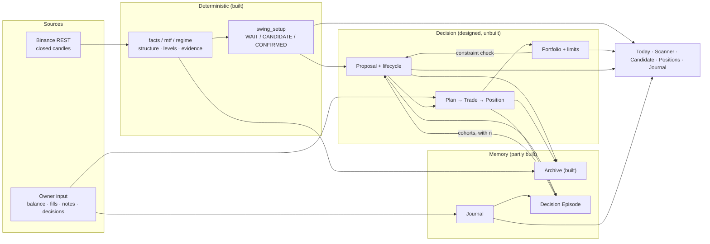
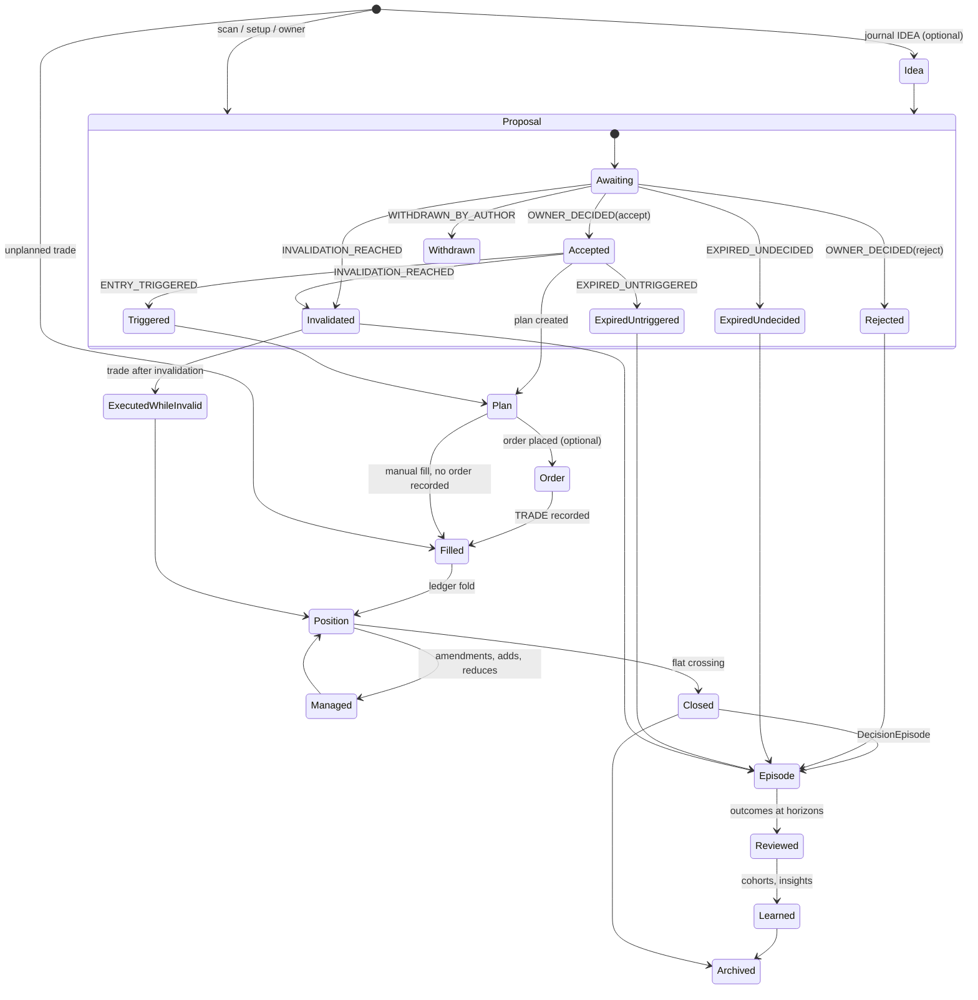

# Trader Workspace — Product Architecture V1

**Milestone:** BE *(this document's own label. The board is not edited and no milestone is sequenced
by this document.)*
**Status:** Design/research only. No production code, no tests, no ADR, no backlog edit, no changelog
entry, no `CURRENT_STATE` edit, no commit. This document is the only artifact.
**Date:** 2026-08-11
**Model:** Claude Opus 5
**Repository state read:** `main`, `HEAD` = `7ced9e2`, two commits ahead of `origin/main`
(`f9ddc54`); working tree clean apart from thirteen untracked research documents under `docs/design/`
and `docs/reviews/` (this document becomes the fourteenth).
**Type:** Product architecture. Designs a workflow and a set of product surfaces. It produces no
contract, binds no decision, and supersedes nothing.

**The one question this document answers:** *if FMITS became the owner's primary trading workstation
tomorrow, what would it actually look like — page by page, minute by minute — and what is the
smallest version of that which can exist within 30–60 days?*

---

## 0. Method, and how to read the claims

**Method.** Full read of `PROJECT_SPECIFICATION_V1.md`, `PROJECT_VISION_ADDENDUM_V1.md`,
`docs/AI_HANDOFF/CURRENT_STATE.md`, `FMITS_PRODUCT_BACKLOG.md`, `FMITS_PRODUCT_CHANGELOG.md`, the 28
ADR titles and the ADRs load-bearing for this design (0007, 0008, 0011, 0019–0021, 0025–0028),
reports 0001–0013 (0004 §12 and 0005 in full), the untracked research chain (`AW` family
independence, `AX` evidence calibration, `AY` edge segmentation, `AZ` failure attribution, `BA`/`BB`
confirmation freshness, `BC` research-harness correction), `FMITS_INFORMATION_EDGE_RESEARCH.md`,
`SWING_TRADING_READINESS_AUDIT_V1.md` (`BD`), `TRADING_DOMAIN_ARCHITECTURE_V1.md` (`AP`),
`IMPLEMENTATION_ROADMAP_V1.md`, the live `src/fmis` tree and CLI, and `prompts/swing-trading-analyzer-v3.md`
with `docs/analysis-notes.md`.

**Four live executions were performed for this document** against real Binance data on 2026-08-11
between 20:57 and 21:00 UTC: `scan` (20 symbols), `setup DOTUSDT`, `swing DOTUSDT`, and
`daily BTCUSDT ETHUSDT DOTUSDT`. Output from those runs is quoted directly below and is the primary
evidence for every claim about what the product looks like today.

**Prior work is reused, not repeated.** Where `BD` (the readiness audit) already measured something,
this document cites it rather than re-deriving it. Where `AP` already designed an object, this
document designs the *surface over it* and does not redesign the object.

**Claim labels.** Every non-trivial claim carries one:

| Label | Meaning |
|---|---|
| **[E]** | Evidence from this repository or from a live run, cited |
| **[I]** | Inference — a conclusion drawn from cited evidence, stated as such |
| **[O]** | Opinion — a design judgement with no repository evidence behind it |

Where evidence does not exist, the word used is **unknown**.

**What this document deliberately does not do.** It does not invent features. It does not propose a
ranking policy, a probability, a threshold or a score that the repository has not measured. It does
not design pages for data FMITS cannot obtain (§3.6 lists them and states what each waits on). It
does not claim any surface below is authorized to be built.

---

## Table of contents

- [Part 1 — The current workflow](#part-1--the-current-workflow)
- [Part 2 — The ideal workflow](#part-2--the-ideal-workflow)
- [Part 3 — The Trader Workspace](#part-3--the-trader-workspace)
- [Part 4 — Information hierarchy](#part-4--information-hierarchy)
- [Part 5 — The daily dashboard](#part-5--the-daily-dashboard)
- [Part 6 — The swing candidate page](#part-6--the-swing-candidate-page)
- [Part 7 — Trade lifecycle](#part-7--trade-lifecycle)
- [Part 8 — Trade journal](#part-8--trade-journal)
- [Part 9 — Portfolio manager](#part-9--portfolio-manager)
- [Part 10 — Notifications](#part-10--notifications)
- [Part 11 — Visualization](#part-11--visualization)
- [Part 12 — Product maturity roadmap](#part-12--product-maturity-roadmap)
- [Part 13 — Gap analysis](#part-13--gap-analysis)
- [Part 14 — Red team](#part-14--red-team)
- [Part 15 — The minimal product](#part-15--the-minimal-product)

---

# Part 1 — The current workflow

## 1.1 What the evidence actually supports

This section is reconstructed from repository artifacts, not from observation. The owner's actual
morning was not watched. Three artifacts constrain the reconstruction tightly enough to be useful:

1. **`prompts/swing-trading-analyzer-v3.md`** — a 199-line prompt that drives Claude Code against a
   live TradingView Desktop chart through the TradingView MCP. It is the only end-to-end trading
   workflow artifact in the repository, and it produces a complete trade plan including position
   size. **[E]**
2. **`docs/analysis-notes.md`** — a v2→v3 post-mortem recording that the prompt "almost always
   produced LONG suggestions and rarely SHORT" and tracing six structural causes. **[E]**
3. **The live FMITS CLI surface** — sixteen invocations listed in `FMITS_PRODUCT_BACKLOG.md` §4, all
   read-only, none of which records anything the owner does. **[E]**

A fourth constraint: `BD` §2.2 states flatly that **"FMITS cannot collect trades. It has no place to
put one."** **[E]**

## 1.2 The two parallel systems

The most important fact about the current workflow is that **there are two of them, they disagree
about what a trader needs, and neither is complete.** **[I]**

| | **Track A — the v3 TradingView prompt** | **Track B — FMITS CLI** |
|---|---|---|
| What runs it | Claude Code + TradingView MCP against a live chart | `fmits <command>` against Binance REST |
| Regime | LLM classifies BULLISH/BEARISH/RANGE from EMA200 + structure, by eye | `fmis.market_regime` classifies structure/volatility/participation deterministically, and **refuses to state a direction** (ADR-0025) |
| Direction | Two mirrored 0–9 checklists; higher score wins if ≥ 3 | Three evidence families; ≥ 2 must agree with **zero** opposing (ADR-0028) |
| Entry price | Stated as a number | **Refused.** "reference … (not an order price)" (AR-3) |
| Stop / target | Stated, with 1:2 minimum enforced | Real, already-detected `PriceLevel` objects, reused by reference, or absent |
| **Position size** | **Computed.** Asks "How much USDC do you currently have?" then applies the 2 % rule | **Refused.** `AR-2`: "No position size, portfolio risk or leverage is computed" |
| Confidence | High / Medium / Low, stated by the model | `NOT_CALIBRATED`, permanently (AR-1) |
| Chart marks | Draws ENTRY / SL / TP1 / TP2 lines and a summary box on the chart | None |
| Record kept | None | None, except `--archive` of the analysis page |
| Bias control | Both directions scored every time; NO TRADE explicit | Directional vocabulary confined by AST-enforced boundary; WAIT is the modal answer |

**The consequence.** Track A is more *usable* and less *trustworthy*; Track B is more *trustworthy*
and less *usable*. The project exists specifically to replace Track A's eyeballed indicator reading
with Track B's computation (`PROJECT_SPECIFICATION_V1.md` §3.1: "AI should not be asked to visually
guess values that code can calculate precisely") — but Track B has never picked up the three things
Track A actually delivers at the moment of decision: **a size, a plan, and a mark on a chart.** **[I]**

That gap is the whole subject of this document.

## 1.3 The morning, step by step

Reconstructed. Steps marked **[E]** are directly evidenced by an artifact; steps marked **[I]** are
inferred from the artifacts and are the most likely reading, not an observation.

| # | Step | Manual decision hidden inside it | Evidence |
|---|---|---|---|
| 1 | Open the computer, open TradingView Desktop | — | `scripts/tradingview-launcher.sh` exists **[E]** |
| 2 | Decide **which symbols to look at today** | **Unrecorded, and the largest silent decision in the workflow.** Nothing captures why BTC and not SUI | No watchlist config file exists; `SCAN_UNIVERSE` is a hardcoded 20-symbol tuple in `scan.py` **[E]** |
| 3 | Launch Claude Code; paste or invoke the v3 prompt | Which prompt version. The live prompt is v3; earlier versions are not in the repository | `prompts/` contains v3 only **[E]** |
| 4 | Answer *"How much USDC do you currently have in your portfolio?"* | **The portfolio balance is retyped from memory or from an exchange screen, every session.** Nothing stores it, nothing checks it, and a typo silently changes every position size that follows | v3 prompt, line 9 **[E]** |
| 5 | Model reads the chart, classifies 1W/1D/4H, scores both directions | Whether the model's visual read of EMA/RSI/MACD/structure is right. This is the step the deterministic engine exists to replace | v3 STEP 1–3 **[E]**; `analysis-notes.md` records this step producing systematic LONG bias in v2 **[E]** |
| 6 | Read the trade plan: entry, SL, TP1, TP2, size, R:R, confidence | Whether "Confidence: High" means anything. It is a model's self-report with no calibration behind it | v3 OUTPUT FORMAT **[E]** |
| 7 | *Optionally* run `fmits scan` / `fmits setup SYMBOL` | **Reconciling two systems that can disagree.** Nothing merges them, and nothing records which one the owner believed | Both surfaces exist independently **[E]**; the reconciliation is inferred **[I]** |
| 8 | Decide: take it, skip it, wait | **Whether this trade is correlated with what is already open.** No component anywhere can answer | `portfolio_section` → `Unavailable`: *"It cannot tell you whether you already hold correlated exposure."* **[E]** |
| 9 | Compute or accept a size | Whether 2 % of the *current* balance is the right risk for *this* setup quality, volatility and correlation | Spec §8.1 says 2 % is "a hard ceiling, not a default target"; the v3 prompt applies it as a flat default **[E]** |
| 10 | Switch to the exchange, place the order manually | Actual fill price, actual fee, actual slippage against the plan | No execution boundary exists, by design (spec §11) **[E]** |
| 11 | Return to the chart, look at the drawn lines | — | v3 "AFTER ANALYSIS — MARK EVERYTHING" **[E]** |
| 12 | **Record the trade** | — | **Nothing in the repository does this.** `BD` §2.2 **[E]** |
| 13 | Later: manage, exit, review | Everything | No open-position surface exists **[E]** |

## 1.4 Every manual decision, collected

Twelve, in the order they occur. Each is a decision the owner makes today with no system support and
no record afterwards. **[I]**, from the table above.

1. Which universe to scan.
2. Which prompt/policy version to trust.
3. What the portfolio balance is.
4. Whether the model's visual chart read is correct.
5. Whether "Confidence: High" is meaningful.
6. Which of two disagreeing systems to believe.
7. Whether the setup is worth taking at all.
8. Whether it is correlated with existing exposure.
9. How much to risk.
10. Where to actually place the entry order (FMITS refuses to say).
11. Whether a wick through the stop level invalidates the thesis or only removes the position
    (`BD` §2.3 condition 3 and R-13 — the stop price and the invalidation level are the same number
    with different trigger semantics) **[E]**.
12. Whether, when and how to record any of it.

## 1.5 Every spreadsheet

**Unknown.** No spreadsheet, CSV, ledger or journal file exists anywhere in the repository, and
`.gitignore` does not reference one. `BD` §2.2 states the record "would in practice be the owner
keeping his own record outside the system." **[E]** Whether that record exists today, and in what
form, is not knowable from the repository. **This document therefore assumes the worst case — no
durable record exists — because designing for the better case and being wrong is unrecoverable.**
**[O]**

## 1.6 Every missing memory

| Missing memory | What it costs today |
|---|---|
| **What was proposed** | The product's core claim — "AI improves my decisions" — is unmeasurable. `AP` Finding 5 **[E]** |
| **What was decided, and why** | Rejected setups vanish. "Did I reject good trades?" is unanswerable **[E]**, `AP` §8.6 |
| **What was filled, at what price, with what fee** | No expectancy, no slippage-vs-plan, no tax basis. Swedish FX rate at transaction time is **unrecoverable after the fact** (`AP` §22.2) **[E]** |
| **What was held while a new setup appeared** | Correlated concentration — `BD` R-03, the single highest-probability path to a large loss, marked **High** probability / **Critical** impact **[E]** |
| **What happened afterwards** | Zero live outcomes. The best measurement in the repository is 44 backtest wick-touch classifications (`BD` §1.6) **[E]** |
| **What the owner was thinking** | No journal. `AP` §16 designed; zero code **[E]** |
| **What the system said last week** | `fmis.archive` can store an analysis page durably, and `fmits archive list/show/verify` work today — but only if `--archive` was passed at the time, and nothing links a record to a trade **[E]** |

## 1.7 Every missing tool

Ordered by how early in the morning the owner hits it. **[I]**

1. A **configurable watchlist** (today: a hardcoded 20-symbol tuple).
2. A **single morning command** that produces one page instead of two systems.
3. A **portfolio balance the system knows** without being retyped.
4. A **position sizer** under a stated risk rule.
5. An **open-risk budget** that says "you have 1.4 % of 6 % left".
6. A **correlation/cluster check** before a third same-direction crypto major.
7. A **geometry sanity bound** — a live run for this document printed `CANDIDATE LONG APTUSDT RR
   49.00`, and the only measurement ever taken associates high RR with *worse* outcomes (RR ≥ 5
   resolved at 7.7 %, n = 26 — `AX` §3.7) **[E]**.
8. A **decision record** — accept / reject / defer, with a reason.
9. A **trade record** — entry, exit, size, fee, timestamps, FX rate.
10. An **open-position view** with live invalidation state.
11. A **journal**, with almost no required fields.
12. An **outcome/statistics surface** — expectancy, by cohort, with `n`.
13. A **calendar** — what expires today, what is due for review.
14. A **health surface** — is the data fresh, did anything fail, is the environment sane. A stale
    `__pycache__` entry made `fmits scan` print prices in scientific notation on this machine and was
    misdiagnosed as a test flake for four days (report 0013 F7) **[E]**.

## 1.8 The one finding Part 1 produces

**The owner's workflow is currently completed by the owner, not by FMITS, at exactly the four points
where money is decided: size, portfolio, cost and memory.** `BD` §9 reaches the identical conclusion
from a different direction and states it as *"the owner is ready; the product is three milestones
behind him."* **[E]** Every part below is organized around closing those four points and nothing
else first.

---

# Part 2 — The ideal workflow

## 2.1 The clock is not arbitrary — it is set by candle closes

FMITS analyses closed candles only, at 1w (context) / 1d (setup) / 4h (execution) roles
(`DEFAULT_TIMEFRAMES`). **[E]** Binance 4h candles close at 00, 04, 08, 12, 16 and 20 UTC; the daily
closes at 00:00 UTC; the weekly opens Monday 00:00 UTC. In `Europe/Stockholm` — the display timezone
`AP` §5.4 names **[E]** — that is:

| UTC close | Stockholm (CEST, summer) | What just became knowable |
|---|---|---|
| 00:00 | 02:00 | **A new daily bar.** The SETUP role advances. Weekly advances on Monday |
| 04:00 | 06:00 | 4h bar |
| 08:00 | 10:00 | 4h bar |
| 12:00 | 14:00 | 4h bar |
| 16:00 | 18:00 | 4h bar |
| 20:00 | 22:00 | 4h bar |

**This produces three natural check-ins and one weekly reset, and none of them is at a time a human
picked.** **[I]**

- **07:00–08:00 local** — the daily bar closed five hours ago and the 06:00 4h bar closed an hour
  ago. This is the only slot in the day where *both* the setup role and the execution role are
  fresh. It is the morning routine.
- **~14:15 local** — one 4h bar since the morning. A management check, not a discovery check.
- **~22:15 local** — the last 4h bar of the local day. An evening review and journal slot.
- **Monday 07:00 local** — the weekly bar closed at 02:00. The context role — the gate that permits
  any direction to exist at all — advances exactly once a week, here.

**The staleness this exposes, measured live for this document.** In the `fmits swing DOTUSDT` run at
21:00 UTC on 2026-08-11:

```
 ROLE · TIMEFRAME  AS OF
 context · 1w      2026-08-03T00:00:00+00:00
 setup · 1d        2026-08-10T00:00:00+00:00
 execution · 4h    2026-08-11T16:00:00+00:00
```

The context role — which gates whether *any* direction may exist — was reading a bar stamped **8 days
and 16 hours** before the execution bar it was combined with. **[E]** `BD` R-11 records the same
hazard measured at 13 days during Milestone AG. **A workspace that does not show this on the same
line as the direction is hiding its most load-bearing weakness.** **[O]**

## 2.2 Morning — 07:00 to 07:20, minute by minute

The target is **twenty minutes, one command, one page, and a written decision on every actionable
item.** **[O]** Longer than twenty minutes and it stops happening daily; shorter and nothing gets
recorded.

| Minute | What the owner does | What the system does | Object created |
|---|---|---|---|
| 0:00 | `fmits` (no arguments) | Renders **Today** (Part 5) from cached-then-refreshed data | — |
| 0:00–0:05 | Reads the top of the page and stops if it says stop | Shows, in order: health, portfolio heat vs budget, open positions needing action, **then** new opportunities. Opportunities are last on purpose | — |
| 0:05 | Acts on **open positions first** | Lists each open position with: distance to stop, whether the structural invalidation has fired, plan adherence, age | — |
| 0:05–0:12 | Opens each new proposal (`fmits proposal <id>`) | Renders the candidate page (Part 6): thesis, opposing case, freshness, geometry-vs-distribution, portfolio impact, cohort evidence | — |
| 0:12–0:16 | **Decides each one.** Accept, reject, or defer — with a reason from a closed list | Appends a `ProposalLifecycleEvent` (`OWNER_DECIDED`) | `ProposalLifecycleEvent` |
| 0:16–0:18 | For an accepted one: confirms size | Computes size from the accepted risk %, the stop distance and the **current recorded balance** — and refuses if a portfolio limit binds, naming the binding limit | `TradePlan`, `PortfolioConstraintCheck` |
| 0:18–0:20 | Places the order manually at the exchange; types back **three numbers**: fill price, quantity, fee | Captures the trade under the full tax capture contract, folds the position, updates the portfolio | `Trade`, `Position` |
| — | Nothing else | Archives the whole chain | Archive records |

**Two rules make this twenty minutes rather than an hour.** **[O]**

1. **Every proposal gets a decision, including "no".** A proposal left undecided becomes
   `EXPIRED_UNDECIDED` (`AP` §8.4) — which is itself a measured behaviour, not a gap. **[E]**
2. **The fill capture is three inputs, not a form.** `AP` §11.3 states this as a design test:
   *"Step 7 must be one confirmation, not a form."* **[E]**

## 2.3 Midday — 14:15, five minutes

Management only. **No new discovery.** **[O]** The reason is in the evidence: the confirmation
window is 10 execution bars (`CONFIRMATION_LOOKBACK_BARS = 10`), i.e. roughly 40 hours **[E]** — a
setup that appears at 14:15 will still be there tomorrow morning, and a decision taken between
morning routines is a decision taken without the day's full page in front of the owner.

| Check | Why |
|---|---|
| Did any open position's **structural invalidation** fire on a closed 4h bar? | This is the one fact that changes what the owner should do *right now* and cannot wait |
| Did any accepted-but-unfilled plan's **entry condition** trigger? | `ENTRY_TRIGGERED` is a deterministic lifecycle event (`AP` §8.4) **[E]** |
| Is any proposal **expiring before tomorrow's routine**? | Otherwise it silently becomes `EXPIRED_UNDECIDED` |

Nothing else is shown. A midday page that also lists new candidates trains the owner to trade at
midday. **[O]**

## 2.4 Evening — 22:15, ten minutes

**Review and write, never enter.** **[O]**

| Minute | Activity |
|---|---|
| 0:00–0:03 | Day's changes: lifecycle events that fired, positions moved, realized outcomes |
| 0:03–0:08 | **Journal.** One `NOTE` per decision taken today, prompted with the day's own facts. `AP` §16.1: *"A journal with twelve kinds and mandatory structured fields is architecturally admirable and will not get written."* **[E]** The system pre-fills what it knows and asks one question |
| 0:08–0:10 | Tomorrow's calendar: expiries, review-due positions, weekly close if Sunday |

**The hindsight rule applies here and matters more than it looks.** An entry recorded after a linked
decision resolved is retained but marked `RECOLLECTION` and excluded from cohort statistics by
default (`AP` §16.5). **[E]** Without it, "I felt uneasy about that one," written after a loss,
enters the dataset as predictive signal.

## 2.5 Weekend

Saturday and Sunday are the only slots in the week where the owner is not deciding anything, and are
therefore the only slots where *learning* can happen without contaminating a live decision. **[O]**

| Day | Activity | Object |
|---|---|---|
| **Saturday** | **Weekly review.** Every position closed this week, every proposal that reached a terminal state, expectancy so far with `n` displayed, and — once episodes exist — the rejected proposals whose hypothetical outcome was `TARGET_FIRST` | `JournalEntry(kind=REVIEW, period=WEEK)` |
| **Sunday** | **Watchlist and policy maintenance.** Add/remove symbols with a recorded reason; review risk limits; review any `PersonalInsight` offered for confirmation. Nothing here changes an open position | Config events |
| **Monday 02:00 UTC** | The weekly bar closes. The context role advances. **Every `sustained_higher`/`sustained_lower` context read the owner has been acting on all week is refreshed at this instant and at no other** **[E]**, `DEFAULT_TIMEFRAMES` + Binance weekly boundary | — |

**The weekend is also where the "silence" risk is managed.** `BD` R-12: a quiet system is
indistinguishable from a quiet market; 12 of 20 symbols in a live run returned WAIT for a *regime*
reason, not a market one **[E]** — reproduced exactly in this document's own run (10
`indeterminate`, 2 `transitioning`). A weekly page that reports **how many symbols the engine could
not read, separately from how many it read and rejected**, is the only mechanism that distinguishes
the two. **[O]**

## 2.6 How information flows



**Three properties of that flow are non-negotiable and all three are already repository rules.**

1. **The market half never reads the trading half** — `AP` §5.6, testable the same way ADR-0007's
   existing import guards are. Otherwise the analysis becomes a function of the position. **[E]**
2. **The `PORT → PROP` edge is why a good setup can be a `WAIT`** — `AP` §15.6. Total portfolio risk
   outranks any single setup's quality. **[E]**
3. **Nothing is displayed that was not either measured by an engine or asserted by the owner**, and
   which of the two is always visible (`ValueOrigin`, `AP` §5.2). **[E]**

---

# Part 3 — The Trader Workspace

## 3.1 The medium decision, made explicitly

**Recommendation: terminal-first, one binary, plain text, 78 columns. A read-only local HTML export
is the second surface, not the first. No web application in the first two years.** **[O]**, on
**[E]** below.

| Reason | Evidence |
|---|---|
| Zero runtime dependencies is an enforced, measured invariant of this repository | `FMITS_PRODUCT_BACKLOG.md` §4: "Runtime dependencies 0"; every milestone record repeats it **[E]** |
| Every renderer already produces 78-column plain text, and its width is asserted by tests | `_WIDTH = 78` in `scan_report.py`; AK's review found four width-contract violations by test **[E]** |
| A web UI adds a server, a build toolchain, a dependency tree and a second place where logic can live — the exact hazard ADR-0007 exists to prevent | ADR-0007 application-layer boundary **[E]** |
| The dashboard epic is already ranked lowest on the board | EP-19 "Reporting & Delivery — Dashboard", **LATER**, priority **Low** **[E]** |
| The archive already stores structured records, so an HTML export is a renderer over existing objects, not a new system | `fmis.archive` + `fmits archive show` **[E]** |

**What this costs, stated honestly.** No chart. The owner will keep TradingView open beside the
terminal, and FMITS will not draw on it in v1 — which is a *regression* against the v3 prompt, which
does draw ENTRY/SL/TP lines (§1.2). **[E]** The mitigation is that the TradingView MCP already
exists and chart-marking is a thin, optional, later adapter over an accepted plan — not a reason to
build a web front end. **[O]**

## 3.2 The workspace is not "pages" — it is views over four object families

Designing screens first is how a product acquires screens nobody opens. **[O]** Every page below is
a projection of one of four families, and a page that projects nothing is deleted:

| Family | Status today | Owned by |
|---|---|---|
| **Market facts** — candles, features, structure, levels, regime, evidence, setup | **Built** | `fmis.data` → `fmis.swing_setup` |
| **Decision records** — proposal, lifecycle, plan, order, trade, position | **Designed, zero code** | `AP` §7–§12 |
| **Capital** — portfolio, limits, snapshot, constraint check | **Designed, zero code** | `AP` §13–§15 |
| **Memory** — archive, journal, episode, cohort, insight | **Archive built; rest designed** | `AP` §16–§21, ADR-0027 |

## 3.3 The page catalogue

**Navigation model.** `fmits` with no arguments opens **Today**. Every other page is
`fmits <page> [id]`. Every page ends with the exact command to go one level deeper — the pattern the
product already uses (`fmits scan` closes with *"To read any symbol in full: fmits setup SYMBOL"*).
**[E]**

| # | Page | Exists today | Why it exists | Family |
|---|---|---|---|---|
| 1 | **Today** | No | The only page opened by habit. Everything else is reached from it | All |
| 2 | **Scanner** | **Yes** (`fmits scan`) | The universe sweep. Answers "is there anything at all" | Market |
| 3 | **Candidate / Setup** | **Yes** (`fmits setup`) | One setup, exhaustively. The page a decision is made on | Market |
| 4 | **Proposals** | No | The decision log. Without it the product's core claim is unmeasurable | Decision |
| 5 | **Positions (open)** | No | The only page whose contents can lose money while unattended | Decision |
| 6 | **Position history (closed)** | No | Realized outcomes; the input to every statistic | Decision |
| 7 | **Portfolio** | No | What is held, what it is worth, how concentrated | Capital |
| 8 | **Risk** | No | Sizing, open-risk budget, binding limits | Capital |
| 9 | **Watchlist** | No (hardcoded) | The single largest unrecorded decision in the current workflow (§1.3 step 2) | Market |
| 10 | **Journal** | No | Why. The only source of the owner's own state at decision time | Memory |
| 11 | **Calendar** | No | What expires, what is due, what closes when | All |
| 12 | **Statistics** | No | Expectancy with `n`. The answer to "does this work" | Memory |
| 13 | **Research lab** | **Yes** (`fmits backtest [--research]`) | Policy measurement, counterfactuals | Market |
| 14 | **Archive** | **Yes** (`fmits archive`) | Durable, integrity-checked history | Memory |
| 15 | **Market map** | No | Regime × role × symbol, one screen. Answers "is it the coin or the market" | Market |
| 16 | **Alerts** | No | The rules that may interrupt. Editing them is itself a product surface | All |
| 17 | **Settings / Policy** | No | Every threshold currently hardcoded, in one visible, versioned place | All |
| 18 | **Health** | No | Data freshness, failures, environment sanity, capture completeness | All |

Sixteen of eighteen are single-purpose. **Two pages carry a deliberate warning label and are
described with their hazard, not just their contents: Today (§3.4.1) and Market map (§3.4.15).**

## 3.4 Every page, in detail

### 3.4.1 Today

**Full design in Part 5.** Purpose: answer, in five seconds, *may I trade today at all* — and only
then, *is there anything worth trading*.

**Why the order is inverted against instinct.** A dashboard that opens with opportunities is a
dashboard that produces trades. `reports/0005` Phase 4 names *"alert fatigue from an unfiltered
brief"* as that milestone's principal risk **[E]**, and `BD` §6.1 names the cheapest attack on this
product as *"let the owner rank by risk/reward… This attack requires no adversary; it happens by
default."* **[E]** Putting health, capital and open exposure above opportunities is the structural
answer. **[O]**

**Must never:** rank, score, or sort opportunities by desirability; show a number the owner did not
supply or an engine did not compute; render a section as empty when it is actually unavailable.

### 3.4.2 Scanner

**Exists.** `fmits scan` already prints scan summary, market overview, actionable setups with
RR/stop/target and verbatim engine reasons, and WAIT results grouped by reason. **[E]** (Full output
quoted in §5.4.)

**Four changes this design asks of it, each traced to evidence:**

| Change | Why | Evidence |
|---|---|---|
| Symbols come from a **configurable watchlist**, not a hardcoded tuple | §1.3 step 2; also `BD` R-07 — 45 confirmed opportunities in 380 days across 10 symbols ≈ one every 8.4 days universe-wide; widening the universe is the stated mitigation | `SCAN_UNIVERSE` hardcoded **[E]**; `BD` R-07 **[E]** |
| **`WAIT` reasons separate "engine could not read this" from "engine read it and declined"** | The two are shown together today. `BD` R-12: a quiet system is indistinguishable from a quiet market — low detectability, high probability | Live run: 12/16 WAIT were regime-readability reasons **[E]** |
| **RR is annotated against its own measured distribution**, not printed bare | The live run printed `RR 49.00`; the corrected baseline distribution is p50 0.98, p75 2.59, p90 10.70, max 25.90 | Live run **[E]**; report 0012 §9 **[E]** |
| The **MARKET OVERVIEW block is labelled as context, never verdict** | `BD` §2.3 condition 2 — the overview lean and the WAIT reason for the same symbol read as contradicting each other | `BD` §2.3 **[E]** |

**Must never:** sort by desirability. A test already exists that deliberately places a weaker
`CANDIDATE` ahead of a stronger `CONFIRMED` to prove `TOP OPPORTUNITIES` is a filter and not a sort
**[E]**. That test is a product guarantee and must survive every future change.

### 3.4.3 Candidate / Setup

**Full design in Part 6.** Exists as `fmits setup SYMBOL`. Today it prints thesis, directional
factors, regime context, confirmation, trigger, invalidation/stop, targets, risk/reward, probability
(`NOT_CALIBRATED`) and nineteen inherited limitations. **[E]**

The gap is not the facts — the facts are unusually complete. **The gap is that four things a trader
needs at the moment of decision are absent from a page that is otherwise exhaustive: how fresh the
context is, how this geometry compares to the geometry that has been measured, what it does to the
portfolio, and what the strongest case against it is.** **[I]**

### 3.4.4 Proposals

**The spine of the whole product, and it does not exist.** **[E]**, `AP` §8; backlog §6 item 2.

| Panel | Contents | Why |
|---|---|---|
| **Open proposals** | id, market, direction, created, `valid_until`, state, decision (or blank) | The morning work queue |
| **Awaiting decision** | Proposals with no `OWNER_DECIDED` and an expiry inside 48h | `EXPIRED_UNDECIDED` is a measured behaviour, and it should be a rare one **[E]** `AP` §8.4 |
| **Lifecycle timeline** (per proposal) | Every event, appended, with origin (`MEASURED` / `ASSERTED`) and timestamp | The state is a fold over events, never a stored field — `AP` §8.4 **[E]** |
| **Terminal proposals** | Resolved, expired, invalidated, executed, executed-while-invalid | `EXECUTED_WHILE_INVALID` is a first-class bias metric **[E]** `AP` §20.5 |

**Why a proposal must exist separately from the setup assessment FMITS already computes.** A
`SetupAssessment` is recomputed from scratch on every run and has no identity across time. A
proposal is created once, has an expiry, accumulates events, and can be scored whether or not it was
taken. **[E]** `AP` §7. Milestone BC measured what happens without that distinction: AV's setup
identity changed every bar, producing **549 "unique setups" from 552 directional observations** —
a 1:1 ratio. **[E]** report 0012 §7.

**Must never:** allow a proposal object to be invented after the fact to make a chain look complete
(`AP` §7). **[E]**

### 3.4.5 Positions (open)

The only page whose contents can lose money while nobody is looking. **[O]**

| Column | Source | Why |
|---|---|---|
| Market · book · direction · size | `Position` fold over `Trade` events | `AP` §12 |
| Entry (weighted average) | Computed from fills, never stored | `AP` §12.4 — and explicitly *not* the tax number **[E]** |
| Current mark · unrealized | Frozen mark with its source and age | `AP` §5.8 — anything reading a mark is captured when read **[E]** |
| **Distance to stop, in R** | Plan stop vs. current | The only number that says how much is still at risk |
| **Invalidation state** | Has a closed candle breached the structural invalidation? | **Distinct from the stop.** `BD` R-13 — same price, different trigger semantics **[E]** |
| Plan adherence | Current stop vs. original planned stop, via `PlanAmendment` events | *"Did I honour my stop?"* requires knowing what it **was** — `AP` Finding 4 **[E]** |
| Age · MAE / MFE | Candle window since entry | Excursion, `AP` §17.4 |

**The stop/invalidation split deserves two columns, not one, and this is the single cheapest
correctness improvement available on any page in this document.** **[O]** The live DOTUSDT setup
states the invalidation is *"a confirmed close beyond the upper level at 0.802 — the same level
reported as the stop"* **[E]**. A wick through 0.802 that closes back inside removes the position
while FMITS still holds the thesis valid.

### 3.4.6 Position history (closed)

One row per closed position: entry, exit, realized R, holding period, plan adherence, the proposal
it came from (or `null`, which is itself a measured datum — the unplanned-trade rate, `AP` §20.5)
**[E]**, and links to journal entries.

**Why separate from open.** Different question, different cadence, and mixing them makes the open
page longer exactly when it must be shortest. **[O]**

### 3.4.7 Portfolio

Detail in Part 9. Panels: holdings by asset · by book · cash and stablecoin weight · concentration ·
correlated clusters · gross/net exposure · total open risk against budget · drawdown from peak.

**Must never:** produce a composite portfolio health score. `AP` §15.2: *"There is no composite
portfolio score anywhere, because a single number would collapse all three strata into one value
whose meaning no one could recover."* **[E]**

### 3.4.8 Risk

Two panels, and they are different things.

1. **Sizer.** Given a stop distance and a risk %, what size. Bounded by the 2 % ceiling, which spec
   §8.1 calls *"a hard ceiling, not a default target"* — so the page must make choosing *less* than
   2 % the easy path, not the exceptional one. **[E]** + **[O]**
2. **Budget.** Total open risk vs. the owner's configured budget, with headroom per limit, each with
   status `WITHIN | AT_LIMIT | EXCEEDED | INDETERMINATE(reason)` — the `PortfolioConstraintCheck`
   contract exactly as `AP` §15.5 defines it. **[E]**

**`INDETERMINATE(reason)` must be visually distinct from `WITHIN`.** No liquidity source, no
correlation history, a stale snapshot — each is reported, never silently treated as fine. **[E]**
`AP` §15.5 property 2.

### 3.4.9 Watchlist

Symbols with: added-on, reason, tier (core / rotational / observation), last scan result, and
consecutive-WAIT streak.

**Why the streak column earns its place.** It is the only cheap, deterministic signal that
distinguishes "this symbol is quiet" from "the engine cannot read this symbol" — and 76.5 % of
observations in AV's original 400-day run fell in a regime the engine classified `INSUFFICIENT`
**[E]**, CURRENT_STATE AV entry.

### 3.4.10 Journal

Detail in Part 8. Three kinds (`IDEA` / `NOTE` / `REVIEW`), open subtypes, closed tags, typed links.
`AP` §16. **[E]**

### 3.4.11 Calendar

**A deliberately narrow v1**, because the data for a real one does not exist: EP-07 (Macro & News)
is **BLOCKED** on D-03, and there is no event calendar, no unlock schedule and no mechanism
reasoning anywhere in the repository. **[E]**

| v1 (buildable) | Deferred |
|---|---|
| Proposal expiries | Economic releases (FOMC/CPI/NFP) |
| Plan review dates | Token unlocks |
| Position review cadence (`POSITION_PERIODIC_REVIEW`, `AP` §17.2) | Earnings, listings, forks |
| Candle-close clock (§2.1) | ETF flow reporting dates |
| Owner-entered events, free text, with a reminder | Anything requiring a news adapter |

**Owner-entered events are the honest v1.** They cost one text field, they are `ASSERTED` (so their
provenance is visible), and they let the owner record "FOMC Wednesday" without the product
pretending it knows. **[O]**

### 3.4.12 Statistics

Every number here must carry `n`, and refuse to render below a sample guard. **[E]** `AP` §20.7 and
the roadmap's `InsufficientSample` guard at C10.

| Panel | Metric | Gate |
|---|---|---|
| Realized | Expectancy in R, win rate, avg win, avg loss, profit factor, max drawdown | Spec §18's own required list **[E]** |
| By cohort | Direction, regime at entry, symbol, weekday, confirmation age, RR bucket | `AP` §20.3 |
| Decision quality | `EXPIRED_UNDECIDED` rate, `EXECUTED_WHILE_INVALID` rate, unplanned-trade rate, plan-adherence rate | `AP` §20.5 — all deterministic **[E]** |
| Counterfactual | Rejected proposals whose hypothetical outcome was `TARGET_FIRST`, and `INVALIDATION_FIRST` — *both* | `AP` §8.6. The second is the one most systems never measure **[E]** |

**The multiplicity hazard must be on the page, not in a document.** `BD` §6.6: with ~25
segmentations and no multiplicity correction — which AY, AZ and BA all state they do not apply — a
new set of striking-looking cells will appear, and *"the defence is a document, not a mechanism."*
**[E]** The mechanism is: display the number of cells examined beside any cell the owner is looking
at. **[O]**

### 3.4.13 Research lab

**Exists.** `fmits backtest` and `fmits backtest --research`, with limitations printed on the report
itself (AV-1…AV-9, BC-1…BC-3). **[E]** Additions this design asks for are in Part 12 Stage 3, not
here.

### 3.4.14 Archive

**Exists.** `fmits archive list / show / verify`. **[E]** The one product change needed: an archived
analysis must be reachable *from* a proposal and a trade, and vice versa. Today the only bridge is
manual — the owner archiving at decision time and copying the `record_id` into his own notes
(`BD` §2.2). **[E]**

### 3.4.15 Market map

Regime and structural trend for every watchlist symbol × three roles, on one screen.

**Why it earns a page.** *"Is this the coin, or is this just BTC"* is named in `BD` §7 as *"the most
common discretionary framing question,"* and FMITS is structurally single-symbol. **[E]** A grid is
the cheapest possible answer, using only facts the engines already produce.

**The hazard, and it is severe.** A grid of coloured cells is read as a ranking whatever the header
says. **[O]** Two structural defences: rows stay in watchlist order (the discipline `fmits daily`
already enforces with a test asserting exactly one `sorted()` call in the package **[E]**), and the
cells carry *state names*, never intensities.

### 3.4.16 Alerts

The rules that may interrupt, as editable, versioned objects. Detail in Part 10.

**Why the rules are a page and not a config file.** An alert that fires wrongly and cannot be
inspected is an alert that gets muted, and a muted alert set is worse than none because it silently
disables the invalidation warning too. **[O]**

### 3.4.17 Settings / Policy

Every value currently hardcoded, in one place, versioned, with its source:

`CONFIRMATION_LOOKBACK_BARS` (10) · `MINIMUM_AGREEING_FAMILIES` (2 of 3) · the 60-bar outcome
evaluation window · the 1w/1d/4h role assignment · the swing pivot window · the 20-symbol watchlist
· the 2 % per-trade ceiling · the open-risk budget · concentration caps · display timezone · books.

**Why this is a product surface and not a config file.** `BD` §6.7 lists exactly these as *"each of
these is load-bearing and has never been varied or validated"* **[E]**. A page that displays a
policy value beside "never validated" is the only mechanism that keeps that fact visible to the
person acting on it. **[O]**

**Must never:** let a policy change silently reinterpret an existing record. Every policy-derived
value carries its `policy_version` (`AP` §5.2). **[E]**

### 3.4.18 Health

| Panel | Why |
|---|---|
| Data freshness per role, per symbol | §2.1 — the context role can be 8+ days stale **[E]** |
| Provider failures in the last N runs | Single venue, single provider, spot only — `BD` R-10 **[E]** |
| Environment sanity | A stale `__pycache__` entry corrupted live price formatting and was misdiagnosed for four days — report 0013 F7 **[E]** |
| Capture completeness | Trades missing a fee, an FX rate, or a link — roadmap slice C9 **[E]** |
| Archive integrity | `fmits archive verify` already exists **[E]** |

## 3.5 Interactions

The workspace needs six verbs and no more. **[O]**

| Verb | Where | Effect | Reversible? |
|---|---|---|---|
| **read** | everywhere | none | n/a |
| **decide** | proposal | appends `OWNER_DECIDED` with a closed-vocabulary reason | By a later event, never by edit |
| **plan** | accepted proposal | creates `TradePlan`; amendments are events | Amend, never edit (`AP` §9.3) **[E]** |
| **record** | plan or standalone | captures a fill — three inputs | By `Correction`, which supersedes and never overwrites (`AP` §5.1) **[E]** |
| **write** | journal | creates an entry with typed links | `supersedes` |
| **configure** | settings, watchlist, limits | appends a config event | By a later config event |

**One interaction rule governs all six: nothing is ever edited or deleted.** Every change is an
append. This is not a preference — it is the mechanism that makes *"what did I believe on 3 August,
and was I right"* answerable at all, and the repository already applies it in
`StructuralSequenceStateHistory` (a prefix-stable fold) and in ADR-0016 §4's refusal to store a
derived count. **[E]**

## 3.6 Pages deliberately not designed, and what each waits on

Listed so nothing is silently forgotten and so the owner does not wait for them. **[E]** for each
gate.

| Not designed | Why | Waits on |
|---|---|---|
| **Macro** | Zero macro code exists; crypto's dominant multi-week driver is represented at 0–2 % | **EP-07 BLOCKED on D-03** (availability-time model, ADR-0003) |
| **News / catalysts** | No adapter, no calendar, no mechanism reasoning | **EP-08 BLOCKED on D-03** |
| **Derivatives** (funding, OI, liquidations) | 0 % represented; ranked #2 on information-edge-per-effort | EP-12, adapters |
| **On-chain** | 0 % represented | EP-11, adapters |
| **AI interpretation / narrative** | The workspace renders it `Unavailable` today, naming the milestone that owns it | `AP` §32 step 7 — needs episodes first |
| **Long-term investing view** | A different discipline; ADR-0009 separates them | EP-06, gated on EP-04 + EP-08 |
| **Non-crypto assets** | Requires a calendar/session layer that does not exist | EP-05 |
| **Order placement** | Deliberate. Execution is manual by design | EP-17, behind the full automation ladder |

**A page for a data source that does not exist is a page that teaches the owner to ignore empty
sections.** The workspace's existing `Unavailable` pattern — which names the owning milestone *and*
the inference the absence forbids — is the correct treatment and is already shipped. **[E]**

---

# Part 4 — Information hierarchy

The constraint: attention is spent in the first five seconds and never recovered. **[O]**

## 4.1 Five seconds — three facts, one line each

**The question:** *may I trade today at all?*

```
 HEALTH    ok · data fresh · 0 failures · last run 07:02
 CAPITAL   open risk 1.8% of 6.0% budget · 3 positions · cash 62%
 ATTENTION 1 position past invalidation · 2 proposals expire today
```

**Why these three and not opportunities.** Each can *stop* the morning. Nothing below them matters
if health is broken (report 0013 F7 — a correctness fault reached the live product surface **[E]**),
if the risk budget is spent (spec §8.2 **[E]**), or if an existing position needs action.

**Failure mode this ordering prevents:** the owner opens FMITS, sees three candidates, and takes one
while already at his risk limit — `BD` R-03, **High** probability, **Critical** impact. **[E]**

## 4.2 Thirty seconds — state of the world and the work queue

Adds: market regime across the watchlist in one line, portfolio heat by cluster, open positions with
distance-to-stop, and **the count** of new proposals — not the proposals themselves.

**The count, deliberately.** Showing the proposals here means deciding them here, without the
candidate page. Thirty seconds is enough to know *whether* there is work, never enough to do it.
**[O]**

## 4.3 Two minutes — decision-ready headers

One block per actionable proposal: direction, state, freshness, RR **with its percentile**, the
binding portfolio constraint if any, and one line of thesis. Enough to reject confidently; **never
enough to accept**.

**The asymmetry is deliberate.** Rejecting on partial information is cheap and correct; accepting on
partial information is how a product with a 53.8 % measured wick-touch rate before costs **[E]**
(report 0012 §7) becomes a losing one. **[O]**

## 4.4 Ten minutes — the full candidate page

Part 6. Everything, including the opposing case, the evidence-independence disclosure, the cohort
evidence with `n`, and the portfolio impact. **Acceptance is only possible from here.** **[O]**

## 4.5 The rule that makes the hierarchy hold

**Each level may only remove information from the level below it — never summarize it into a new
value.** A five-second line that says "3 good setups" has invented a judgement that no engine
produced. A five-second line that says "3 proposals awaiting decision" has not. **[O]**, and it is
the same discipline `fmits daily` already enforces by refusing to rank **[E]**.

---

# Part 5 — The daily dashboard

## 5.1 What it must answer, in order

1. Is the system telling me the truth today? (health, freshness)
2. What is already at risk? (portfolio, open positions)
3. What needs a decision before it expires? (proposals, plans)
4. What is new? (scan results)
5. What did I mean to do? (journal reminders, calendar)

**Opportunities are fourth.** §3.4.1 and §4.1 give the reasoning.

## 5.2 The design

Sections in fixed order. An absent section is **rendered with its reason**, never omitted — the
existing `Unavailable` pattern, which already carries the milestone that owns it and the inference
the absence forbids. **[E]**

```
==============================================================================
 FMITS TODAY                        Mon 2026-08-11 07:02 Europe/Stockholm
==============================================================================
 HEALTH        ok   provider 20/20 · no failures · env verified
 CAPITAL       open risk 1.8% / 6.0% budget · cash 62% · dd -3.1% from peak
 ATTENTION     1 position past invalidation · 2 proposals expire today

------------------------------------------------------------------------------
 DATA FRESHNESS                                    (staleness is not an error)
------------------------------------------------------------------------------
   context  1w   newest closed 2026-08-03 00:00Z    8d 16h old
   setup    1d   newest closed 2026-08-10 00:00Z    1d 21h old
   execution 4h  newest closed 2026-08-11 04:00Z       3h old
   ! The context role gates whether any direction may exist. It advances
     once per week, next at Mon 02:00 local.

------------------------------------------------------------------------------
 OPEN POSITIONS (3)                                        act on these first
------------------------------------------------------------------------------
   DOTUSDT  SHORT  0.42R at risk   stop 0.802   invalidation NOT BREACHED
            entry 0.787 avg · 4d · MAE -0.6R · MFE +1.1R · plan honoured
   ETHUSDT  LONG   0.80R at risk   stop 3,120   ! INVALIDATION BREACHED
            closed beyond 3,120 on 4h at 2026-08-11 04:00Z
   ATOMUSDT SHORT  0.55R at risk   stop 1.474   invalidation NOT BREACHED

------------------------------------------------------------------------------
 AWAITING YOUR DECISION (2)                          both expire before 20:00
------------------------------------------------------------------------------
   P-4f2a  APTUSDT LONG  CANDIDATE  RR 49.00  ! RR above p99 of measured
                                                distribution (p90 = 10.70)
   P-91cd  ARBUSDT SHORT CANDIDATE  RR  6.00    RR ~p85 of measured
           ! portfolio: would be a 3rd short on a correlated crypto major

------------------------------------------------------------------------------
 PORTFOLIO EXPOSURE
------------------------------------------------------------------------------
   direction     net SHORT · 3 of 3 positions short
   ! cluster     crypto-major cluster carries 100% of open risk
   concentration DOT 34% · ETH 41% · ATOM 25% of open risk
   limits        open risk WITHIN (1.8/6.0) · cluster AT_LIMIT
                 correlation window INDETERMINATE (no history yet)

------------------------------------------------------------------------------
 NEW FROM THE SCAN                     20 scanned · 16 WAIT · 3 CAND · 1 CONF
------------------------------------------------------------------------------
   readable and declined       4 symbols
   engine could not read      12 symbols   (10 indeterminate, 2 transitioning)
   ! Silence here is not evidence of a quiet market. It is 12 symbols the
     regime gate could not classify.
   full report:  fmits scan

------------------------------------------------------------------------------
 CALENDAR & JOURNAL
------------------------------------------------------------------------------
   today     2 proposal expiries · weekly bar closed 02:00
   due       DOTUSDT position review (4d open, cadence 7d)
   journal   no entry for yesterday's ETHUSDT entry     fmits journal add
   owner     "FOMC Wed 20:00" (entered 2026-08-09)

------------------------------------------------------------------------------
 NOT AVAILABLE
------------------------------------------------------------------------------
   MACRO         no macro engine exists.  EP-07, blocked on D-03.
                 Do not infer that macro conditions are benign.
   DERIVATIVES   no funding, OI or liquidation data.  EP-12.
                 Identical price action under extreme funding is a
                 different trade, and this page cannot distinguish them.
   PROBABILITY   NOT_CALIBRATED.  No backtested statistical model exists.

==============================================================================
 Nothing here is ranked. Nothing here is a recommendation. Position sizes
 shown are computed from limits you configured, not from setup quality.
==============================================================================
```

## 5.3 Why each block is there

| Block | Justification |
|---|---|
| **Health** | Report 0013 F7 — a correctness fault reached the live product and was misclassified for four days **[E]** |
| **Capital** | Spec §8.2 — portfolio-level risk; and it must appear *before* opportunities **[O]** |
| **Attention** | The only two things that can be irreversibly lost by not looking today |
| **Data freshness** | §2.1's measured 8d16h context staleness **[E]**; `BD` R-11 |
| **Open positions** | The only rows that can lose money unattended **[O]** |
| **Awaiting decision** | `EXPIRED_UNDECIDED` is a measured behaviour (`AP` §8.4) **[E]** |
| **RR percentile annotation** | Live `RR 49.00` **[E]**; measured distribution p90 = 10.70 **[E]**; RR ≥ 5 → 7.7 % resolution, n = 26 **[E]** |
| **Cluster warning** | `BD` R-03 / §6.5 — the highest-probability path from "FMITS worked as designed" to a large loss **[E]** |
| **Readable-vs-unreadable split** | `BD` R-12 — low detectability by construction **[E]** |
| **Calendar & journal** | Adoption is the binding constraint on a journal (`AP` §16.1) **[E]**; a prompt at the right moment is the only cheap mechanism **[O]** |
| **NOT AVAILABLE** | The existing `Unavailable` pattern, verbatim discipline: name the owner and the forbidden inference **[E]** |

## 5.4 What today's product prints instead

For calibration, the actual live `fmits scan` header from 2026-08-11, 20:57 UTC:

```
 20 symbols scanned
 SCAN SUMMARY
   WAIT ................ 16
   CANDIDATE ........... 3
   CONFIRMED ........... 1
   ERROR ............... 0
```

Followed by `MARKET OVERVIEW`, `ACTIONABLE SETUPS` (including `CANDIDATE APTUSDT LONG RR 49.00`),
and `WAIT REASONS`. **[E]**

**The delta is not more information — it is the same information reordered and four annotations
added.** Health, capital, freshness, cluster, RR-percentile, readable-vs-unreadable. None of the
four requires a new data source. **[I]**

---

# Part 6 — The swing candidate page

One setup, everything. Fourteen blocks. Status column: **built** = printed today; **cheap** = uses
only facts the repository already computes; **gated** = needs a designed-but-unbuilt object.

| # | Block | Status | Why it exists |
|---|---|---|---|
| 1 | Identity & state | **built** | symbol, state, direction, sufficiency, as-of |
| 2 | **Freshness triple** | **cheap** | Three ages, not one: context bar age, setup bar age, confirmation age in bars. The context role can be 8+ days old **[E]** |
| 3 | Thesis, verbatim | **built** | Printed unmodified from the engine — the property that makes reasons trustworthy **[E]** |
| 4 | Directional factors | **built** | Three families, each with its lean, value and source module |
| 5 | **Evidence-independence disclosure** | **cheap** | κ = 0.02 / 0.10 / **0.41**; CTX participated in **100.0 %** of 578 directional results, traced to the regime gate and the CTX vote reading the identical `context_view.structure.trend` value **[E]** `AW` §5.2. `BD` R-05 marks this **Certain**, **High** impact, **Low** detectability — *invisible on every page, while the page states the guarantee as designed* |
| 6 | Regime context per role | **built** | structure · volatility · participation, per role |
| 7 | Confirmation & trigger | **built** | Which level, which bar, how many bars ago, against the 10-bar window |
| 8 | **Stop and invalidation as two fields** | **cheap** | Same number, different trigger semantics: a stop executes on a touch, a structural invalidation requires a **close** **[E]** `BD` R-13 |
| 9 | Targets | **built** | Real detected levels, or explicitly absent |
| 10 | **Geometry vs. measured distribution** | **cheap** | RR beside its percentile in the corrected baseline (p50 0.98, p75 2.59, p90 10.70, max 25.90 **[E]**), and the association direction stated: RR ≥ 5 resolved at 7.7 % (n = 26) vs. 74.5 % for RR ∈ [0,1) **[E]** |
| 11 | **Cohort evidence with `n`** | **cheap** | What the policy did historically in this cohort. Guarded: below the sample floor it prints `InsufficientSample(n)`, never a rate |
| 12 | **Portfolio impact** | **gated** | `PortfolioConstraintCheck`: per-limit headroom, binding constraints, `INDETERMINATE(reason)` where a source is missing **[E]** `AP` §15.5 |
| 13 | **The opposing case** | **gated** | `supporting_evidence` and `opposing_evidence` are **both required and both non-empty** on a proposal **[E]** `AP` §8.2 — spec §7's strongest-opposing-case obligation, at proposal time |
| 14 | Similar historical decisions | **gated** | The owner's own prior positions in this market/cohort, with realized R. Zero exist today |
| 15 | Limitations, verbatim | **built** | Nineteen printed on the live DOTUSDT run **[E]** |
| 16 | **Decision affordance** | **gated** | accept / reject / defer, with a closed reason vocabulary — the reason is what makes rejections analysable **[E]** `AP` §8.6 |

## 6.1 The five blocks that change the page's character

Blocks 2, 5, 8, 10 and 12. **[I]**

- **2, 8 and 10 are cheap** — they use only facts the repository already computes or has already
  measured. They require no new engine and no new data source.
- **5 is cheap and uncomfortable** — it prints a measured weakness of the product's own headline
  claim on the page that states the claim. **[O]** It should still be printed, because `BD` names
  its invisibility, not its existence, as the risk.
- **12 is gated** on the portfolio layer, and is the reason `AP` §15.5 property 4 makes the check
  `ABSENT` with a stated reason until then rather than blocking the slice. **[E]**

## 6.2 What the page must never do

- Print a probability. `NOT_CALIBRATED` is the honest state and the product already holds it. **[E]**
- Present RR as a quality ranking key. `BD` §6.1: *"This attack requires no adversary; it happens by
  default."* **[E]**
- Soften an inherited limitation on its way to the page. There is no known instance of this in the
  repository and it should stay that way. **[E]** `BD` §2.1.
- Show a position size derived from setup quality. Size comes from the risk rule and the stop
  distance, never from confidence. **[O]**, consistent with spec §8.1's ceiling framing.

---

# Part 7 — Trade lifecycle

## 7.1 The states

The lifecycle is `AP`'s, unchanged. This document adds no state and removes none; it designs how the
states are *seen*. **[E]** `AP` §7, §8.4, §17.2.



## 7.2 State by state — what the owner sees and what is recorded

| State | Owner's words | Object / event | Surface | Automatic? |
|---|---|---|---|---|
| **Idea** | "worth watching" | `JournalEntry(IDEA)` | Journal | Manual |
| **Proposal — awaiting** | "FMITS suggested three" | `OpportunityProposal` | Today, Proposals | **Automatic** from the setup engine |
| **Accepted** | "I took it" | `OWNER_DECIDED(accept)` | Proposals | Manual, one keystroke + reason |
| **Rejected** | "I passed" | `OWNER_DECIDED(reject)` | Proposals | Manual, one keystroke + reason |
| **Expired undecided** | "I never got to it" | `EXPIRED_UNDECIDED` | Proposals | **Automatic.** The system observes the *absence of a decision*, never whether the owner looked **[E]** |
| **Entry triggered** | "it hit my level" | `ENTRY_TRIGGERED` | Today, alerts | **Automatic**, on a closed candle |
| **Invalidated** | "the idea broke" | `INVALIDATION_REACHED` | Today, alerts | **Automatic**, on a closed candle |
| **Planned** | "stop here, target there" | `TradePlan` | Positions | Semi — pre-filled from the accepted proposal |
| **Amended** | "I moved my stop" | `PlanAmendment` | Positions | Manual, with reason. **Never an edit** **[E]** |
| **Filled** | "I got 59,020" | `Trade` | Positions | Manual — three inputs |
| **Open** | "I'm in" | `Position` (fold) | Positions | **Automatic** |
| **Executed while invalid** | — | `EXECUTED_WHILE_INVALID` | Statistics | **Automatic.** A distinct, expensive behaviour, and a first-class bias metric **[E]** |
| **Closed** | "out at 2R" | flat-crossing | Position history | **Automatic** |
| **Reviewed** | "what did I learn" | `DecisionEpisode` + `EpisodeOutcome` | Statistics, journal | Semi |
| **Learned** | "I widen stops after a bad week" | `PersonalInsight` (provisional) | Journal | AI proposes, **owner confirms** **[E]** |
| **Archived** | — | Archive record | Archive | **Automatic** |

## 7.3 The three properties that make this lifecycle worth building

1. **Every proposal reaches an episode, not only the accepted ones.** *"Did I reject good trades?"*
   is unanswerable in any design that keeps only what was executed. **[E]** `AP` §2, §8.6.
2. **The chain is optional at every link, and the absence is itself a datum.** An unplanned manual
   trade is legal, recorded with null proposal/plan/order, and the unplanned-trade rate becomes a
   measured behaviour. What is forbidden is inventing an object after the fact to make the chain look
   complete. **[E]** `AP` §7.
3. **State is a fold over events, never a stored field.** Corrections supersede, never overwrite.
   **[E]** `AP` §5.1, §8.4.

## 7.4 The one state this design would like and cannot have

**"Stopped out on a wick while the thesis remained valid."** It is the exact mechanism `BD` §6.2
describes as the liquidity-sweep attack, and it is invisible to FMITS today: close-only structure
breaks mean the wick is a "rejection", the system still holds the thesis valid, and it will report
the same setup again. **[E]**

It cannot be a lifecycle event in v1 because it requires the stop and the invalidation to be two
distinct, separately-triggered objects — which is exactly what §3.4.5 and §6 block 8 propose making
them. **Once they are two fields, this state becomes derivable with no new data: `stop touched` ∧
`invalidation not breached`.** **[I]** That is the cheapest new *behavioural* measurement available
anywhere in this document.

---

# Part 8 — Trade journal

## 8.1 The binding constraint is adoption, not schema

`AP` §16.1 states it and this document accepts it without modification: *"A journal with twelve
kinds and mandatory structured fields is architecturally admirable and will not get written."*
**[E]**

**Design consequence:** the journal's product surface is measured by *entries written per week*, and
every schema decision that raises friction must justify itself against that number. **[O]**

## 8.2 What is stored

`AP` §16.2's three kinds, unchanged. **[E]**

| Kind | Required | Optional (nudged, never enforced) |
|---|---|---|
| `IDEA` | title, body | subtype, horizon, tags, links, supersedes |
| `NOTE` | title **or** body | same |
| `REVIEW` | title, body, `period` (`DAY`/`WEEK`/`MONTH`/`QUARTER`/`YEAR`/`AD_HOC`) | same |

**`subtype` is open, `tags` are closed** — because subtype is descriptive and tags are *counted*.
**[E]** `AP` §16.2.

**Links are the architecture.** `about` · `caused_by` · `reviews` · `supersedes` · `learned_from` ·
`cites`, typed and directional, to markets, positions, proposals, plans, episodes, periods and
archive records. A single untyped "related" edge collapses six answerable questions into one
unanswerable one. **[E]** `AP` §16.4.

## 8.3 Manual vs. automatic — the exact split

This is the part `AP` leaves to the product surface, and getting it wrong is how the journal dies.
**[O]**

| Field | Who supplies it | Why |
|---|---|---|
| Timestamp (`recorded_at`, `occurred_at`) | **Automatic** | Never a typing task |
| Market, position, proposal links | **Automatic** when written from a context (e.g. `fmits journal add --for P-4f2a`) | The single largest friction saving available |
| Regime, decision-context state, evidence summary, conflicts at the moment of writing | **Automatic**, frozen | It is the system's own state, and it will not be the same tomorrow **[E]** `AP` §5.8 |
| Portfolio state at the moment of writing | **Automatic**, frozen | Same reason |
| Plan values and amendments | **Automatic** from the plan | Retyping intent is how intent drifts |
| **Title / body** | **Manual** | The only thing a machine cannot supply |
| **Subtype** | Manual, optional, suggested from context | Open list — never blocks the save |
| **Tags** | Manual, or **AI-proposed and owner-confirmed** | `AI_PROPOSED_PENDING` tags are **not counted** in cohorts until confirmed **[E]** `AP` §16.3 |
| `RECOLLECTION` flag | **Automatic** | Set when `recorded_at` falls after the linked decision resolved **[E]** `AP` §16.5 |

**The nudge, and the line it must not cross.** A UI that asks *"what would make this wrong?"* is
good product design; a schema that rejects the entry without an answer is not. **[E]** `AP` §16.2.

## 8.4 What becomes machine-learning data, and what must not

| Usable as training/analysis data | Why |
|---|---|
| Closed tags, with provenance | Counted, and separable by origin **[E]** |
| Typed links | Structure, not prose |
| Kind, subtype, period, horizon | Low-cardinality, stable |
| Frozen system context at write time | Reproducible; the same discipline `DecisionEpisode` uses **[E]** |
| Time-of-day / weekday of writing | A behavioural cohort `AP` §20.5 already names **[E]** |
| Whether an entry exists at all for a decision | The cheapest discipline metric in the system **[O]** |

| **Must not** enter a dataset as signal | Why |
|---|---|
| Recollections | Written after the outcome. Excluded by default **[E]** `AP` §16.5 |
| `AI_PROPOSED_PENDING` tags | Unconfirmed model output would train on itself **[E]** |
| Free-text body, until a semantic-retrieval design exists | `AP` §18.4 explicitly defers this **[E]** |
| Any AI-produced number | **AI never produces a fact** — model output is `INTERPRETED` and is never an input to any computation **[E]** `AP` §5.9 |

## 8.5 The three questions the journal exists to answer

1. *Why did I enter?* — `IDEA`/`NOTE` linked `about` the proposal, written before the fill.
2. *Was I consistent?* — plan adherence + `EXECUTED_WHILE_INVALID` rate + unplanned-trade rate, all
   deterministic and all computed from records, not from prose. **[E]** `AP` §20.5.
3. *What have I noticed about myself?* — `PersonalInsight`, provisional until the owner confirms,
   with the trades that support it and how many. **[E]** `AP` §21.

---

# Part 9 — Portfolio manager

## 9.1 The gap this closes

`BD` scores portfolio logic **0 / 10** and risk management **0 / 10** — *"the largest single gap
between the project's stated principles and its shipped code, and it has been the largest gap since
the vision was written."* **[E]** EP-04 is the only epic on the backlog marked **Critical**. **[E]**

The live scan performed for this document returned **1 CONFIRMED SHORT (DOTUSDT) and 3 CANDIDATEs,
of which 2 were also SHORT (ATOMUSDT, ARBUSDT)** — three simultaneous short setups on three
correlated crypto majors, with no component in the system capable of observing that they are one
bet. **[E]**

## 9.2 The three strata, kept apart

`AP` §15.2, adopted without modification. **[E]**

| Stratum | Owner | Never does |
|---|---|---|
| **1 — Deterministic facts** | `fmis.portfolio` | Have an opinion |
| **2 — Policy limits** | Owner config | Be invented by the system |
| **3 — Interpretation** | AI layer (L8, unbuilt) | Compute anything |

**No composite portfolio score, anywhere.** **[E]** `AP` §15.2.

## 9.3 What the module computes

All stratum 1, all deterministic, all from the position fold.

| # | Fact | Source | Notes |
|---|---|---|---|
| 1 | **Holdings** | Position fold over the ledger | Per market, per book. Books never share capacity **[E]** `AP` §5.5 |
| 2 | **Cash / stablecoin weight** | Ledger | The v3 prompt's "how much USDC" question, answered from a record instead of memory **[E]** |
| 3 | **Total open risk** | Σ (entry − stop) × size, per open position | The number the 6 %-style budget is checked against |
| 4 | **Per-trade risk** | Same, per position | Checked against the 2 % ceiling — *a ceiling, not a target* **[E]** spec §8.1 |
| 5 | **Concentration** | Risk share by asset, venue, book | Spec §8.2 **[E]** |
| 6 | **Directional net exposure** | Long risk − short risk | The live run's "3 of 3 short" case |
| 7 | **Correlated-cluster exposure** | **The existing Relative Value Engine** (`fmis.relative_value`), which already measures relationships between series | *A consumer, no new mathematics* **[E]** `AP` §15.3 |
| 8 | **BTC beta** | RVE against a BTC benchmark | Ranked #3 on information-edge-per-effort: *"the engine already exists… this is wiring, not new engineering"* **[E]** |
| 9 | **Gross / net leverage** | Position sizes vs. equity | Spec §8.3 **[E]** |
| 10 | **Drawdown** | Snapshot series | Spec §18's required metric list **[E]** |
| 11 | **Liquidity tier** | — | **`ABSENT` until a depth or volume source exists**, rendered as absent rather than assumed adequate **[E]** `AP` §15.3 |
| 12 | **Sector / theme** | Versioned mapping applied **at read time**, never written onto a holding | Re-classifying an asset in 2029 must not rewrite 2026's records **[E]** `AP` §15.7 |

## 9.4 Position sizing

**Inputs:** recorded balance · risk % for this trade (default *below* the 2 % ceiling) · stop
distance from the plan · the asset's own quantity precision.
**Output:** a quantity, its resulting risk in base currency, and the resulting open-risk total.

**Four refusals that must be built in from the first version.** **[O]**, each traced to **[E]**:

1. **Never size from setup quality or confidence.** Confidence is `NOT_CALIBRATED` **[E]**; sizing
   off an uncalibrated number is sizing off nothing.
2. **Never size when the stop is `ABSENT`.** Stops are real detected levels or explicitly absent
   (AR-3) **[E]**; no stop means no risk denominator.
3. **Never size past a binding limit without displaying the binding limit.** *"Total portfolio risk
   outranks any single setup's quality, and 2 % is a ceiling that a confident proposal cannot argue
   with."* **[E]** `AP` §15.6.
4. **Never use `float` for money.** Exact decimals, asset-tagged. Three buys closed by three sells
   leave ~`1e-17` residue and under "flat means zero" that position never closes, never becomes an
   episode, and quietly biases every aggregate. **[E]** `AP` §5.3. This is AP-D1, and it must be
   accepted before the first record.

## 9.5 How a good setup becomes WAIT

```
proposal (technically attractive)
  → constraint check against current snapshot + owner's own limits
  → binding constraints, each with its headroom
  → WAIT, with the binding constraint named and its number shown
```

**[E]** `AP` §15.6, adopted verbatim. `WAIT` and `NO TRADE` are first-class successful outcomes
(spec §6) — *"and here they arrive with a named reason and a number, which is the difference between
a discipline and an intention."*

## 9.6 What the portfolio module must never do

- Recommend an action.
- Produce a health score.
- Invent a threshold. Every limit is a field the owner sets. **[E]** `AP` §15.4.
- Treat `INDETERMINATE` as `WITHIN`. **[E]** `AP` §15.5.
- Be readable by any L0–L7 engine — *"or the analysis becomes a function of the position, the oldest
  bias in trading."* **[E]** `AP` §5.6.

---

# Part 10 — Notifications

## 10.1 The governing risk

`reports/0005` Phase 4 names *"alert fatigue from an unfiltered brief"* as that phase's principal
risk **[E]**. A muted alert set is worse than no alert set, because muting also disables the
invalidation warning. **[O]**

## 10.2 The three tests every notification must pass

A notification is sent **only if all three hold**. **[O]**

1. **Deterministic** — it fires on a fact an engine computed from a closed candle or on a clock
   event, never on an interpretation and never on a forming candle. (The repository's closed-candle
   rule, inherited unchanged. **[E]**)
2. **Actionable now** — the owner can do something about it before the next scheduled check-in.
3. **Time-bounded** — waiting until the next check-in would cost something irreversible.

**A new `CANDIDATE` fails test 2 and must not notify.** It is not actionable — it needs a
confirming execution break within a 10-bar window **[E]**, and it will still be there at the next
routine.

## 10.3 What notifies

| Event | Channel | Why it passes all three tests |
|---|---|---|
| **`INVALIDATION_REACHED` on an open position** | Interrupt | Deterministic (closed candle), actionable (exit), irreversible (the thesis is gone and the loss grows) |
| **Stop level touched while invalidation not breached** | Interrupt | The §7.4 state. Deterministic, and the owner needs to know *which* of the two happened |
| **Portfolio limit `EXCEEDED`** | Interrupt | Deterministic, and every subsequent entry compounds it |
| **`ENTRY_TRIGGERED` on an accepted, unfilled plan** | Interrupt | The plan was already decided; this is execution timing |
| **Proposal expiring before the next check-in** | Digest at the next check-in, interrupt only if < 4h | `EXPIRED_UNDECIDED` is a recorded behaviour **[E]** |
| **Provider failure ≥ N symbols** | Digest | Single provider, single venue — `BD` R-10 **[E]** |
| **Morning brief ready** | Scheduled digest at 07:00 local | The routine anchor (§2.1) |
| **Weekly review due** | Scheduled digest, Saturday | §2.5 |

## 10.4 What does not notify, ever

| Not notified | Why |
|---|---|
| A new `CANDIDATE` | Fails test 2 (§10.2) |
| A new `CONFIRMED` | Fails test 3 — the 10-bar confirmation window means tomorrow morning is soon enough **[E]** |
| Scan completion | No information content |
| A price level being approached | Not deterministic on closed candles; and it is the trigger that makes traders watch screens **[O]** |
| A WAIT streak, or a quiet market | Fails test 2. It belongs on the weekly page (§2.5), where it can be read as information rather than as a prompt |
| Anything an AI produced | AI never produces a fact **[E]** `AP` §5.9 |
| Anything during quiet hours (22:30–06:30 local) except an open-position invalidation | **[O]** — a swing trader who is woken by a candidate becomes a day trader |

## 10.5 Transports, in the order they should be built

| Order | Transport | Reason |
|---|---|---|
| **1** | **A file** — the brief written to a stable path, plus exit codes | Zero dependencies (the repository's measured invariant **[E]**), scriptable, testable, and it is what a cron job or a launchd agent needs |
| **2** | **Local desktop notification** | No secret, no network, no external service |
| **3** | **Telegram** | Genuinely valuable when away from the desk, but it adds a network dependency, a bot token to store, and a channel through which position data leaves the machine. It is a deliberate later decision, not a v1 default **[O]** |
| **4** | **Email** | Only worth it for the weekly review, and only as a rendered attachment of an artifact that already exists **[O]** |
| — | **Push (mobile app)** | Requires an app. Not justified by anything in this repository **[O]** |

**One rule across all transports:** the notification carries *what happened and the command to see
it*, never the analysis itself. A notification that contains a trade plan is a notification acted on
without the page. **[O]**

---

# Part 11 — Visualization

## 11.1 The constraint, restated

78-column plain text, ASCII, no runtime dependencies (§3.1). Every form below is chosen to work in
that medium and to survive a later HTML export without redesign. **[O]**

## 11.2 Form by form

| Form | Use it for | Never use it for | Why |
|---|---|---|---|
| **Table** | Comparable rows of one type: watchlist, positions, scan results, limits | Anything where row order could be read as quality | Row order is the hazard; `fmits daily` already asserts exactly one `sorted()` call in the package to prevent it **[E]** |
| **Card / block** | One subject in depth: a candidate, a position, a proposal | Comparison | A card invites reading; a table invites scanning |
| **Timeline** | Lifecycles: proposal events, plan amendments, position fills | Anything without a real ordering | The lifecycle *is* an append-only stream — the timeline is the shape of the data, not a decoration **[E]** |
| **Sparkline / text chart** | One series over time: equity, open risk, drawdown, expectancy-with-n | Price | Price belongs on TradingView; duplicating it badly is worse than not showing it **[O]** |
| **Heatmap / grid** | Regime × role × symbol (the Market map, §3.4.15) | Anything with a magnitude | Colour intensity is read as ranking. Cells must carry *state names* |
| **Calendar** | Time-bounded obligations: expiries, reviews, owner events | Market prediction | A calendar of things that *will happen* is a schedule; a calendar of things that *might* is a forecast |
| **Dot-leader list** | Counts and statuses (`WAIT ....... 16`) | Values with units that need alignment | Already the repository's own idiom **[E]** |
| **Explicit ABSENT block** | Anything unavailable | — | The existing `Unavailable` pattern: name the owning milestone *and* the forbidden inference **[E]** |

## 11.3 Four rules that override every form choice

1. **Never sort by desirability without a validated ranking policy.** Milestone AN's own record:
   a scanner *"must rank on an explicit, deterministic, testable and backtested policy… never as a
   side effect of a workflow, and never on a readiness state."* **[E]**
2. **Every rate carries its `n`, and refuses to render below the sample floor.** **[E]** `AP` §20.7.
3. **Every value carries its origin** — measured, policy-derived, asserted, interpreted, absent —
   and asserted values are visually distinct, because they are the only ones that can simply be
   wrong. **[E]** `AP` §5.2.
4. **Absence is rendered, never omitted.** An omitted section is invisible, and an invisible gap
   reads as a gap that does not exist. **[E]** — AK's own design record states this as the reason the
   four unbuilt workspace sections are rendered.

## 11.4 One visualization this document rejects

**A single "setup quality" gauge, meter or star rating.** It would be the most-requested widget on
this page and it must not exist: probability is `NOT_CALIBRATED` **[E]**, the three evidence families
are measurably not independent (κ = 0.41, CTX at 100 % **[E]**), and the one geometric quality proxy
the product does display is associated with *worse* outcomes **[E]**. A gauge would fabricate a
scalar out of three quantities the repository has explicitly refused to combine. **[O]**

---

# Part 12 — Product maturity roadmap

Five stages. Each states what becomes usable, what it depends on, and where it sits on
`reports/0004` §12's existing value ladder — this document introduces no competing ladder. **[E]**

## Stage 1 — The morning that is remembered

**Value level:** 2 → 3. **Depends on:** ADRs AP-D5, AP-D1, AP-D2; roadmap slices F1–F5, C1, C3, C7.

| Delivers | Owner can now |
|---|---|
| Configurable watchlist; one morning command; **Today** page; proposal + append-only lifecycle; owner decision with reason; manual trade capture under the full tax capture contract; position fold; everything archived; full-dump export | *"FMITS proposed three setups this morning; I took one, and every part of that decision is recorded — including the two I passed on."* **[E]** backlog §6 item 2 |

**Why first.** It is the only item whose cost *rises* with delay: from the first real trade, every
unrecorded decision is permanently lost, and Swedish FX capture is unrecoverable after the fact.
**[E]** `BD` §8 milestone 1.

## Stage 2 — The morning that knows what I hold

**Value level:** 3 → 4. **Depends on:** Stage 1; slices C4, C6; the risk layer.

| Delivers | Owner can now |
|---|---|
| Trade plan + amendments as events; portfolio config, snapshots, holdings; position sizing under the 2 % ceiling; total open risk; concentration; correlated-cluster exposure via the existing RVE; `PortfolioConstraintCheck` | *"A good setup now tells me when my portfolio says wait — with the binding limit named and its number shown."* |

**Risk removed:** R-02 (mis-sizing), R-03 (correlated concentration — the highest-probability path
to a large loss). **[E]**

**Also lands here, because they are cheap and reach the owner's eyes on every page:** the RR-vs-
distribution annotation, the stop/invalidation split, the freshness triple, and the readable-vs-
unreadable WAIT split. None needs a new data source. **[I]**

## Stage 3 — The morning that can be measured

**Value level:** 4 → 5. **Depends on:** Stage 1–2; the existing BC research harness.

| Delivers | Owner can now |
|---|---|
| A cost model (fees, spread, slippage); an explicit fill rule; **expectancy in R** at stated stratifications; profit factor, avg win, avg loss, max drawdown — spec §18's own required list; Decision Episodes with realized outcomes; cohort statistics with `n` and a sample guard; the re-derivation of the AW–BA research chain on BC's corrected harness, reproducibly and in-repo | *"I know the sign of expectancy after costs, and I know how many observations that rests on."* |

**Why here and not earlier.** *"It is the only milestone that can change the sign of every conclusion
the project has reached"* **[E]** `BD` §8 milestone 2 — but it answers a question rather than
preserving an answer, and if it runs first the trades taken in parallel are still unrecorded.

## Stage 4 — The morning that sees more than price

**Value level:** 5. **Depends on:** Stages 1–3; new adapters.

Ordered by `FMITS_INFORMATION_EDGE_RESEARCH.md` Part 7's own ranking, not re-derived **[E]**:
funding rate + open interest (#2) · BTC dominance / BTC-beta (#3, *wiring, not new engineering*) ·
orderbook depth / spread feasibility check (#6) · coarse macro liquidity flag (#7) · liquidation
awareness (#8).

**A hard gate this document adds.** Each new evidence family must land with a measured statement of
its *independence* from the families already present. The product's existing headline claim — "at
least two of three independent families" — is measurably weaker than it reads (κ = 0.41; CTX in
100 % of directional results **[E]**), and adding a fourth family without measuring the same thing
compounds a known defect. **[O]**, on `FMITS_INFORMATION_EDGE_RESEARCH.md` Part 7 item 1's identical
conclusion.

## Stage 5 — The morning that argues back

**Value level:** 5 → 6. **Depends on:** Stages 1–4 and an L8 layer that does not exist.

AI Context Package (the one retrieval contract) · AI Review of episodes · the strongest-opposing-case
generator spec §7 requires · `PersonalInsight`, provisional until the owner confirms · then paper
trading (EP-15) and shadow mode (EP-16) on the automation ladder.

**Two constraints carried unchanged from `AP`:** AI never produces a fact **[E]** §5.9; only a
*confirmed* insight influences a future proposal **[E]** §2.

## 12.2 What becomes usable first, in one sentence

**Stage 1's Today page and its decision record**, because everything after it is either an
improvement to a page that already exists or a computation over records that Stage 1 is the only
thing capable of creating. **[I]**

---

# Part 13 — Gap analysis

Criticality: **Critical** = blocks safe use or loses irreplaceable data · **Important** = the owner
performs the work manually today · **Nice** = broadens coverage.

| # | Capability | Current FMITS | Future FMITS | Criticality | Evidence |
|---|---|---|---|---|---|
| 1 | Trade record | **None** | `Trade` under the capture contract | **Critical** | `BD` P-1 **[E]** |
| 2 | Capture contract / migration guarantee accepted | **Not accepted** | AP-D1 + AP-D2 as ADRs | **Critical** | backlog §6 item 1; *"must precede the first written trade"* **[E]** |
| 3 | Position sizing | **0 lines** | Sizer under the 2 % ceiling | **Critical** | `AR-2` **[E]** |
| 4 | Total open risk & budget | **None** | Constraint check with headroom | **Critical** | spec §8.2 **[E]** |
| 5 | Correlated-cluster awareness | **None** | RVE-backed cluster exposure | **Critical** | `BD` R-03: High/Critical **[E]** |
| 6 | Outcome record | **None** | `Position` close + `EpisodeOutcome` | **Critical** | `BD` R-08 **[E]** |
| 7 | Cost model (fees/spread/slippage) | **None** | Explicit, with a stated fill rule | **Critical** | `BC-1`, `AV-1` **[E]** |
| 8 | Expectancy at any stratification | **Never computed** | Spec §18's full metric list | **Critical** | `BD` §1.4 **[E]** |
| 9 | Decision record (accept/reject/defer + reason) | **None** | Proposal lifecycle stream | **Critical** | `AP` §8.4 **[E]** |
| 10 | Geometry plausibility bound | **None** — live `RR 49.00` | RR vs. measured distribution, annotated | **Critical** | live run + report 0012 §9 **[E]** |
| 11 | Stop vs. invalidation distinction | Prose only, same number | Two fields, two triggers | **Critical** | `BD` R-13 **[E]** |
| 12 | Evidence-independence disclosure | **Invisible on every page** | Printed beside the guarantee | **Critical** | `BD` R-05: Certain/High/**Low detectability** **[E]** |
| 13 | Portfolio holdings | `Unavailable` | Ledger fold | **Critical** | live `swing` run **[E]** |
| 14 | Configurable watchlist | Hardcoded 20-symbol tuple | Config events with reasons | **Important** | `scan.py` **[E]** |
| 15 | Freshness per role, on the decision page | Per-view `as_of` exists on `swing`, absent from `setup` | Freshness triple everywhere | **Important** | live runs **[E]** |
| 16 | Readable-vs-unreadable WAIT split | Mixed together | Two counts | **Important** | `BD` R-12 **[E]** |
| 17 | Journal | **None** | Three kinds, typed links | **Important** | `AP` §16; D-04 **[E]** |
| 18 | Open-position view | **None** | Positions page | **Important** | — |
| 19 | Trade plan + amendments as events | **None** | `TradePlan`, `PlanAmendment` | **Important** | `AP` Finding 4 **[E]** |
| 20 | Statistics / cohorts with `n` | **None** | Statistics page with sample guard | **Important** | `AP` §20 **[E]** |
| 21 | Calendar (owner events + system obligations) | **None** | Narrow v1 | **Important** | §3.4.11 |
| 22 | Notifications | **None** — no delivery layer exists | File → desktop → Telegram | **Important** | grep: no transport in `src/` **[E]** |
| 23 | Health / freshness surface | **None** | Health page | **Important** | report 0013 F7 **[E]** |
| 24 | Settings/policy visibility | Constants in code | Versioned policy page | **Important** | `BD` §6.7 **[E]** |
| 25 | Analysis ↔ trade link | Manual `record_id` copying | Automatic linkage | **Important** | `BD` §2.2 **[E]** |
| 26 | Swedish tax capture | **None** | Capture at transaction time | **Important** | D-10 owner-confirmed **[E]** |
| 27 | Counterfactual scoring of rejected proposals | **None** | `HypotheticalOutcome` | **Important** | `AP` §8.5; needs AP-D6 **[E]** |
| 28 | Market map / BTC-beta | **None** | Regime grid + RVE benchmark | **Important** | edge research #3 **[E]** |
| 29 | Derivatives (funding, OI, liquidations) | **0 %** | New adapter family | **Nice** (for readiness) / high for edge | edge research #2 **[E]** |
| 30 | Macro / news / calendar of releases | **0–2 %** | EP-07 | **Nice** | **BLOCKED on D-03** **[E]** |
| 31 | On-chain | **0 %** | EP-11 | **Nice** | edge research Tier A #10 **[E]** |
| 32 | Orderbook / fill feasibility | **0 %** | EP-12-adjacent | **Nice** | edge research #6 **[E]** |
| 33 | AI interpretation / opposing case | `Unavailable` | L8 | **Nice** *(for readiness; required by spec §7)* | `AP` §32 step 7 **[E]** |
| 34 | Chart marking (ENTRY/SL/TP) | **Lost** vs. the v3 prompt | Optional TradingView MCP adapter | **Nice** | v3 prompt **[E]** |
| 35 | CI / type checking | **None** | EP-20 | **Important** | D-07 open; report 0013 F7 **[E]** |
| 36 | Research chain re-derived on BC's harness | **Not done** | Reproducible, in-repo | **Important** | `BD` R-06 **[E]** |

**Twelve Critical rows.** Ten of the twelve are delivered by Stages 1 and 2. **[I]**

---

# Part 14 — Red team

Premise: assume this design ships exactly as written and then find how it fails.

## 14.1 The dashboard becomes the ranking it refuses to be

**The attack.** Today (Part 5) lists proposals. A list has a top row. Whatever the header says, the
top row is read as the best idea. Add the RR-percentile annotation from §6 block 10 and the owner now
has a *numeric* axis to sort by mentally — the exact hazard `BD` §6.1 calls the cheapest attack,
made *easier* by an annotation intended to defuse it. **[I]**

**Why the design is still probably right.** The alternative — printing `RR 49.00` bare — is what
happens today, and the only measurement ever taken says the big number is the bad one **[E]**. But
the annotation must state the *direction* of the association in words, not just the percentile, or it
becomes a quality score with extra steps.

**Residual risk: real, unmitigated.** The structural defence (fixed watchlist order, no sort) is
already in place and is not sufficient against a human eye.

## 14.2 A green dashboard reads as permission

**The attack.** `HEALTH ok · CAPITAL 1.8% of 6.0% · ATTENTION none` is three lines of reassurance at
the top of the page. Reassurance at the top of a trading screen is an invitation. **[O]**

**Mitigation that does not work:** more warnings. Warning volume is what produces muting (§10.1).

**Mitigation that might:** the health line reports *what is fresh and what is not*, never "ok" alone;
and the capital line shows headroom as a number, never as a colour or a bar. Both are already in the
§5.2 mock. **Residual risk: real.**

## 14.3 The journal does not get written

**The attack.** §8 minimizes required fields, but the evening slot is ten minutes at 22:15 and
competes with everything else in a life. Two weeks in, the entries stop; six months later the
`RECOLLECTION` rule has excluded most of what does exist; the learning loop has no input.

**This is the most likely single failure of the whole design.** **[O]** `AP` §16.1 already names
adoption as the binding constraint, which means the design knows the risk and has no mechanism
against it beyond low friction.

**The only honest mitigation available:** measure it. Entries-per-week is itself a metric, and a
journal that reports its own adoption rate at least fails visibly. **[O]**

## 14.4 Eighteen pages is too many

**The attack.** Part 3 lists eighteen pages. A single-user product with one maintainer that ships one
page a week takes four months to have a workspace, and by then the first pages are stale. **[I]**

**Counter-evidence, and it is strong.** The measured cadence of this repository is eleven capability
milestones between 2026-08-04 and 2026-08-11 — eight calendar days **[E]**, `git log`. That is not a
sustainable long-run rate, but it makes "eighteen pages is unreachable" a weaker objection than it
would be in a conventional project.

**The real mitigation:** Part 15's minimal product names **five** pages, not eighteen. The other
thirteen are a target, and the document should be read as such.

## 14.5 Cognitive overload on the candidate page

**The attack.** Part 6 lists sixteen blocks. The live `fmits setup DOTUSDT` page already prints
nineteen limitations **[E]**. Adding freshness, independence disclosure, RR distribution, portfolio
impact, cohort evidence and the opposing case produces a page nobody reads to the end — and the
blocks at the end are the ones added to prevent errors.

**Mitigation:** the §4 hierarchy is the answer, and it must be enforced by *the product*, not by the
owner's discipline: the two-minute header (§4.3) is a separate render, and the full page is opened
deliberately. **Residual risk: moderate.** A page that is complete and unread is worse than a page
that is partial and read. **[O]**

## 14.6 The limitations block trains the owner to skip

**The attack.** Nineteen limitations print on every setup page, every time, unchanged. Repetition of
invariant text is the fastest known way to teach a reader to skip a region — and the *variable*
warnings this design adds (RR outside distribution, cluster at limit, context 8 days stale) will be
rendered in the same visual register.

**Mitigation:** separate *invariant* limitations (which belong once, in a footer or a `fmits
limitations` page) from *this-run* warnings (which belong inline, at the point of the value they
qualify). This document did not previously make that distinction and it should: **§5.2 and §6 must
use two distinct registers**, and only the second may appear beside a number. **[O]**

## 14.7 The system becomes an obligation

**The attack.** Morning 20 minutes + midday 5 + evening 10 + weekend review ≈ 3 hours a week, on a
system whose measured signal quality is **unknown** (`BD` §1.6: 44 outcomes, 53.8 % target-first,
before costs) **[E]**. If the edge is not there, the workflow is a ritual with excellent
record-keeping.

**The design's own answer, and it is the honest one:** the record-keeping is what determines whether
the edge is there. `BD` §2.4: *"the collection is the milestone-generating asset, and it starts
producing value on day one."* **[E]** But the owner should know he is funding a measurement, not
harvesting an edge, and the Statistics page should say so — by displaying `n` prominently and
refusing to render rates below the sample floor.

## 14.8 Where information will be ignored, ranked by likelihood

| Rank | Ignored | Why |
|---|---|---|
| 1 | The invariant limitations block | §14.6 |
| 2 | The evidence-independence disclosure | It contradicts the headline claim on the same page; readers resolve contradictions in favour of the simpler statement **[O]** |
| 3 | `INDETERMINATE(reason)` constraint results | They look like "no problem found" unless rendered distinctly **[E]** `AP` §15.5 |
| 4 | Data freshness | It is never urgent, right up until the moment it is the reason the trade was wrong |
| 5 | The readable-vs-unreadable WAIT split | It is a statement about the engine, and traders read pages for statements about the market **[O]** |

## 14.9 What this design gets right, and why it is worth stating

Only to make the failure list calibrated, not as praise. Three properties are structural rather than
disciplinary and therefore survive an inattentive owner: **absence is rendered rather than omitted**,
**nothing is ever edited**, and **no rate renders without its `n`**. All three are already
repository practice **[E]**, and none depends on anyone reading carefully.

---

# Part 15 — The minimal product

## 15.1 The question, answered directly

> *What is the smallest version of FMITS that I could realistically use every morning within the next
> 30–60 days, built only from the current architecture?*

**Answer: five pages, one morning command, three ADRs, and roughly eight implementation slices that
the repository has already decomposed.** No web UI. No new data source. No AI layer. No new engine.
**[I]**

## 15.2 Is 30–60 days realistic?

Measured, not assumed. **[E]**, `git log`:

| Period | Milestones completed |
|---|---|
| 2026-08-04 | AK, AL, AN |
| 2026-08-05 | AO (+ correction) |
| 2026-08-06 | AP (design) |
| 2026-08-07 | AR, AS, AT, AU |
| 2026-08-08 | AV |
| 2026-08-11 | BC |

**Eleven milestones in eight calendar days**, each with an independent adversarial review, mutation
probes with SHA-256-verified source restoration, and a full test suite that grew 3,702 → 4,653.
**[E]**

The eight slices below are of comparable grain to those milestones — the roadmap explicitly sized
them that way **[E]** (`IMPLEMENTATION_ROADMAP_V1.md` §0, "Grain"). **A 30–60 day window is
therefore consistent with the repository's own demonstrated cadence, with substantial margin.**
**[I]** It is *not* a schedule commitment, and the two slices with **High** review complexity (F2
money kernel, C1 trade) should be expected to consume disproportionate time.

## 15.3 What ships

### The three ADRs (days, not months — the backlog's own words **[E]**)

| Order | ADR | Why it cannot be skipped |
|---|---|---|
| 1 | **AP-D5** — provenance kernel | Every record type cites `ValueOrigin`/`ABSENT` |
| 2 | **AP-D1** — money and quantity types | A trade recorded with `float` money is a record that will need migrating; and the 1e-17 residue makes a position that never closes **[E]** |
| 3 | **AP-D2** — capture contract + migration guarantee | **Blocking.** ADR-0027's exact-match-no-migration rule was proportionate for regenerable analyses and is unsafe for records that cannot be recomputed. *"Must precede the first written trade."* **[E]** |

### The eight slices (roadmap names, unchanged)

`F1` provenance · `F2` money · `F3` archive generalization · `F4` full-dump export · `F5` accounts ·
`C1` trade + identity + balance effects + resolver + correction · `C3` position fold · `C7` proposal
+ append-only lifecycle. **[E]** `IMPLEMENTATION_ROADMAP_V1.md` §7.

### The five pages

| Page | Contents | Built from |
|---|---|---|
| **1. Today** | The §5.2 layout, minus portfolio (Stage 2) — so: health, freshness triple, open positions, awaiting decision, new-from-scan with the readable/unreadable split, calendar, ABSENT block | `daily` + `scan` renderers + the new records |
| **2. Scanner** | `fmits scan` as it is, plus: configurable watchlist, RR-vs-distribution annotation, readable/unreadable WAIT split | **Exists.** Three additive changes |
| **3. Candidate** | `fmits setup` as it is, plus: freshness triple, stop/invalidation split, RR annotation, evidence-independence disclosure, and a **decision affordance** | **Exists.** Four additive changes + one new verb |
| **4. Proposals** | Open, awaiting decision, lifecycle timeline, terminal | New — `C7` |
| **5. Positions** | Open positions with distance-to-stop and invalidation state; closed positions with realized R | New — `C1` + `C3` |

### The one command

`fmits` (no arguments) → **Today**. Everything else is reachable from it by the command printed at
the bottom of each block — the idiom the product already uses. **[E]**

## 15.4 What is explicitly excluded, and why

| Excluded | Why |
|---|---|
| **Position sizing and the portfolio page** | Needs `C4`/`C6` and the risk layer. It is Stage 2, and it is the *next* thing, not this thing. **The owner continues sizing manually and must know that** |
| **Cost model and expectancy** | Stage 3. It answers a question; it does not preserve an answer **[E]** `BD` §8 |
| **Journal** | Independent of all five pages and can run in parallel at the owner's discretion **[E]** roadmap §5 — but it is not required for a morning routine to be *recorded* |
| **Notifications** | The file transport (§10.5 order 1) is nearly free; anything beyond it is not |
| **Counterfactual scoring of rejected proposals** | Needs AP-D6, which the roadmap explicitly places past this horizon **[E]** |
| **AI interpretation, macro, derivatives, on-chain, news** | No engine, no adapter, and in two cases a blocked decision (D-03) **[E]** |
| **Web UI, charts, chart marking** | §3.1 |
| **Ranking of any kind** | No validated ranking policy exists **[E]** |

## 15.5 What the owner can do on day 60 that he cannot do today

1. Open one command and see whether he may trade at all before seeing what he could trade.
2. See how stale the fact that gates every direction actually is.
3. Record a decision on every proposal — including the ones he passes on — with a reason.
4. Record a fill in three inputs, with the FX rate Swedish tax will later need, captured at the one
   moment it is recoverable.
5. See what he is holding and what is still at risk on it.
6. Distinguish "my stop was touched" from "my thesis was invalidated".
7. Ask, in six months, *"what did I think about this in October, and was I right?"* — and get an
   answer from records rather than from memory.

## 15.6 What he still cannot do on day 60

Compute a position size. See portfolio correlation. Model a fee. Know the sign of expectancy. Get an
opinion from an AI. See funding, macro, on-chain or news. **[E]** — every one of these is named in
§15.4 with the stage that owns it.

**That list is not a failure of the minimal product. It is the reason the minimal product is
minimal:** all five pages exist to create the records that Stages 2 and 3 compute over, and none of
them can be computed before the records exist. **[I]**

---

## Closing statement

The workspace this document designs is not a set of screens over an analysis engine. It is the four
missing halves of a decision — **size, portfolio, cost and memory** — given a surface, in the order
that makes each one measurable. FMITS already answers, rigorously, *what did price do structurally
and do my evidence families agree about it*. Everything above exists to answer the four questions
that come after it: **how much, against what, at what cost, and did it work.**

The single most important design decision in this document is an ordering one: **the dashboard shows
health, capital and existing exposure before it shows opportunity**, because the highest-probability
way this product loses real money is not a bad signal — it is three simultaneous same-direction
setups on three correlated majors, which a live run performed for this document produced, and which
no component in the system can currently notice.

---

**End of product architecture. No production code, no tests, no ADR, no backlog edit, no changelog
entry, no `CURRENT_STATE` edit, no commit. One artifact:**
`docs/design/TRADER_WORKSPACE_PRODUCT_ARCHITECTURE_V1.md`.
