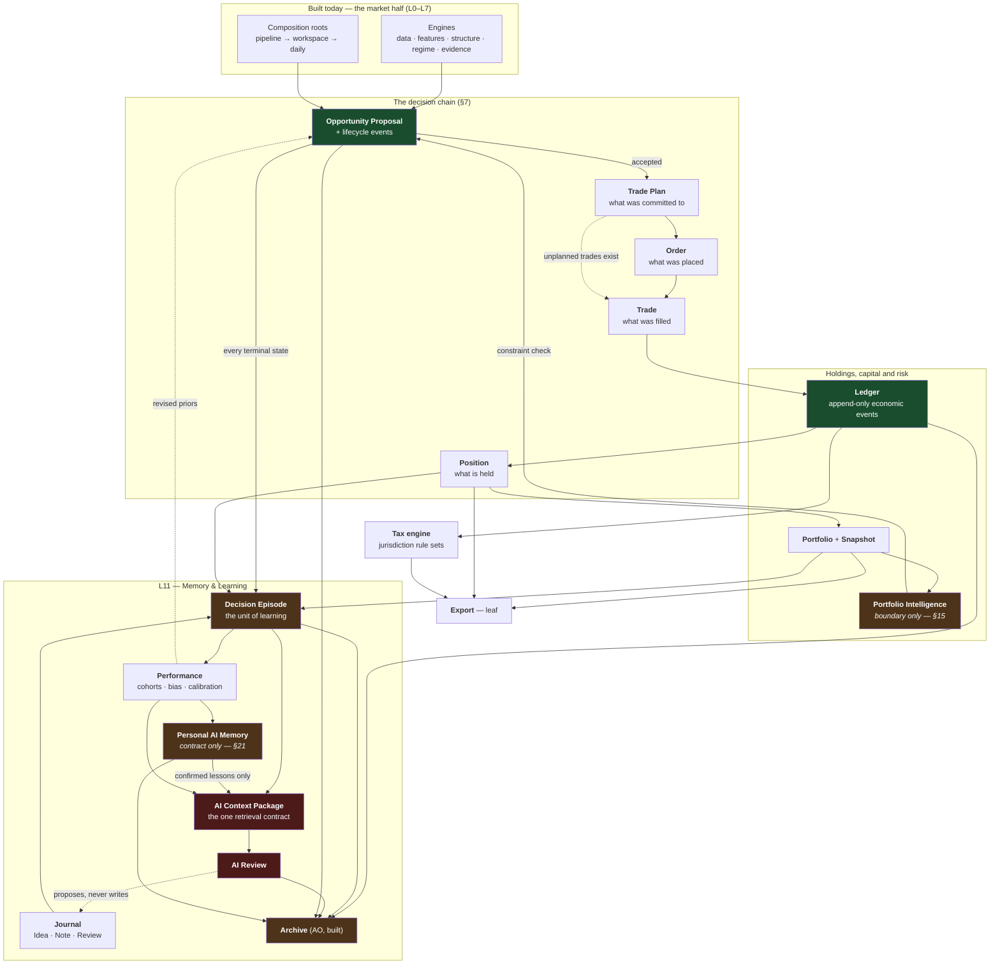
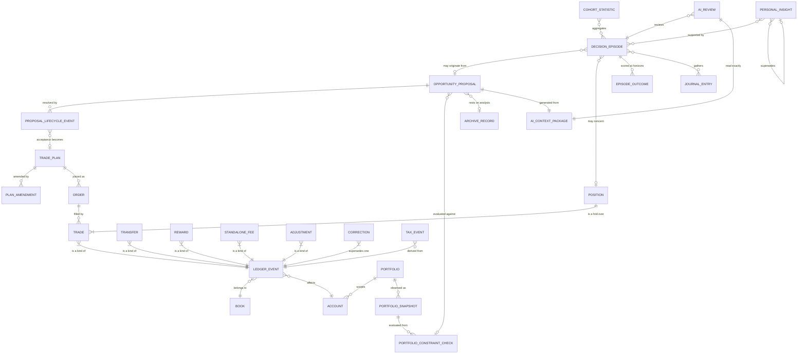
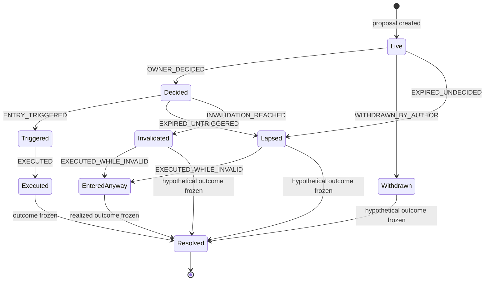
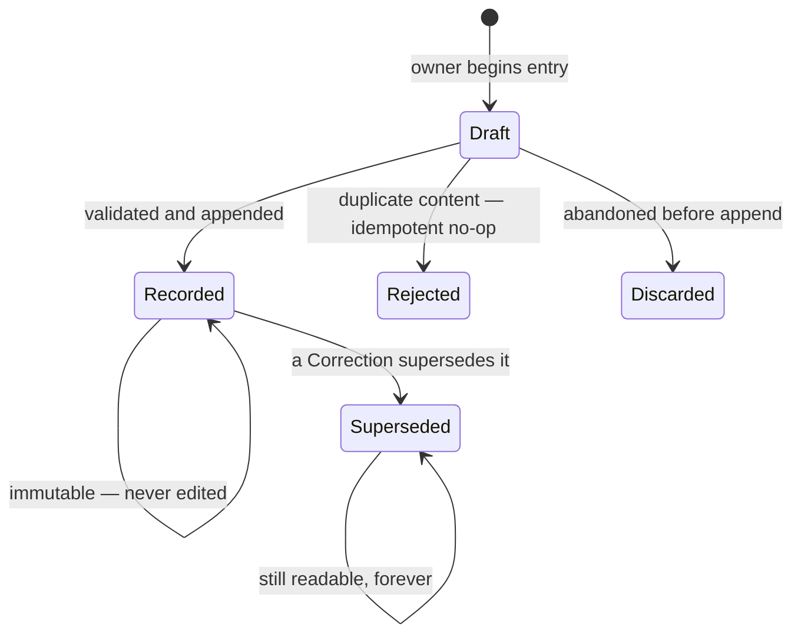

# Trading Domain Architecture v1 — Design

**Milestone:** AP
**Status:** **Milestone AP is complete** (commit `0ea0414`, 2026-08-06). The *architecture* remains
**proposed** — nothing here is authorization to implement, and nothing here is an accepted decision.
§31 names the six ADRs required before any code is written; none has been accepted.
**Revision:** v1.2 (2026-08-06) — v1.1 revised after a hostile architecture review; v1.2 after a
vision-alignment pass covering proposal lifecycle, portfolio intelligence and personal memory. §34
records the disposition of every finding and every deliberate omission.
**Builds on:** [ADR-0027](../adr/ADR-0027-memory-and-decision-archive-persistence-schema.md) and
[`MEMORY_AND_DECISION_ARCHIVE_V1.md`](MEMORY_AND_DECISION_ARCHIVE_V1.md) (Milestone AO — the Archive
is this domain's storage foundation) · [ADR-0007](../adr/ADR-0007-application-layer-boundary.md)
(import direction) · [ADR-0001](../adr/ADR-0001-canonical-utc-timestamps.md) (UTC contract) ·
[ADR-0005](../adr/ADR-0005-ingestion-boundary-strictness.md) (reject, never repair) ·
[ADR-0009](../adr/ADR-0009-trading-analysis-context-boundary.md) (investing and trading are separate
disciplines) · [ADR-0011](../adr/ADR-0011-evidence-taxonomy.md) (evidence families) ·
[ADR-0019](../adr/ADR-0019-level-crossing-foundation-v1.md) (a crossing is a fact, a break is a
reading) · [ADR-0021](../adr/ADR-0021-change-of-character-foundation-v1.md) (intrabar order is
unknowable without sub-bar data) · [ADR-0025](../adr/ADR-0025-market-regime-engine-v1.md) (regime is
an environment, never a direction) · [ADR-0026](../adr/ADR-0026-decision-context-boundary.md) (the
sufficiency gate) · [`reports/0003`](../../reports/0003_2026-08-01_FMITS_ARCHITECTURE_BLUEPRINT_V1.md)
§3 (L0–L11 layering) ·
[`reports/0004`](../../reports/0004_2026-08-01_FMITS_BUSINESS_AND_CAPABILITY_ARCHITECTURE_V1.md)
§4.13–§4.19, §9 · `FMITS_WORKING_PROTOCOL_2026-08-06`

---

## Table of contents

1. [What this document is](#1-what-this-document-is)
2. [Where the trading domain attaches](#2-where-the-trading-domain-attaches)
3. [The owner's workflow, end to end](#3-the-owners-workflow-end-to-end)
4. [Seven findings that shape everything below](#4-seven-findings-that-shape-everything-below)
5. [Foundational decisions](#5-foundational-decisions)
6. [The domain model at a glance](#6-the-domain-model-at-a-glance)
7. [The decision chain — five objects, not one](#7-the-decision-chain--five-objects-not-one)
8. [Opportunity Proposal](#8-opportunity-proposal)
9. [Trade Plan](#9-trade-plan)
10. [Order](#10-order)
11. [Trade](#11-trade)
12. [Position](#12-position)
13. [Portfolio](#13-portfolio)
14. [Portfolio Snapshot](#14-portfolio-snapshot)
15. [Portfolio Intelligence — the boundary](#15-portfolio-intelligence--the-boundary)
16. [Trading Journal](#16-trading-journal)
17. [Decision Episode — the unit of learning](#17-decision-episode--the-unit-of-learning)
18. [AI Context Package — the one retrieval contract](#18-ai-context-package--the-one-retrieval-contract)
19. [AI Review](#19-ai-review)
20. [AI Learning Layer](#20-ai-learning-layer)
21. [Personal AI Memory](#21-personal-ai-memory)
22. [Tax capture contract and the tax engine](#22-tax-capture-contract-and-the-tax-engine)
23. [Excel / CSV Export](#23-excel--csv-export)
24. [Storage architecture](#24-storage-architecture)
25. [The freezing policy](#25-the-freezing-policy)
26. [Lifecycles](#26-lifecycles)
27. [Package layout and import direction](#27-package-layout-and-import-direction)
28. [Five-year stress test](#28-five-year-stress-test)
29. [Risks](#29-risks)
30. [Rejected alternatives](#30-rejected-alternatives)
31. [Open decisions](#31-open-decisions)
32. [Build sequence](#32-build-sequence)
33. [What this design does not claim](#33-what-this-design-does-not-claim)
34. [Revision record](#34-revision-record)

---

## 1. What this document is

The complete domain architecture for everything FMITS must know about **the owner's own decisions and
trading** — as distinct from everything it already knows about **the market**.

**In scope.** The object model, responsibility boundaries, lifecycles, relationships, what is frozen
and what is recomputed, how it persists, how it scales, how AI reads it, and where portfolio
interpretation, tax and export attach without contaminating the trading model.

**Out of scope, deliberately.** No Python, no SQL, no ORM, no API, no UI, no storage engine choice, no
implementation. Where this document names a file layout it describes the *shape of a contract*, not a
database.

**The bar it is written to.** The market half of FMITS can be rebuilt from scratch in a week. The half
described here cannot be rebuilt at all — a fill that was never recorded is gone, and a decision whose
reasoning was never captured is gone with it. §4 Finding 1 is that asymmetry, and most of what follows
is a consequence of it.

**What changed in v1.2.** Three narrow vision-alignment additions and nothing else: a proposal's
**lifecycle became an append-only event stream** (§8.4) because a single terminal decision enum was
conflating three different kinds of fact; **Portfolio Intelligence is now a named boundary with one
concrete input contract** (§15) so a technically attractive proposal can become `WAIT` for portfolio
reasons rather than by opinion; and **Personal AI Memory is now a defined record contract with
provenance and promotion rules** (§21) so a lesson can be re-evaluated, contradicted and superseded
rather than accumulating as an unbounded blob. §34.5 states what was deliberately *not* added.

---

## 2. Where the trading domain attaches

FMITS spans L0–L7 of the blueprint's layering plus the L11 Archive that Milestone AO shipped.
Everything built is about *the instrument*. This is the first subsystem about *the owner*.



Four properties of that picture matter more than the boxes.

**Every proposal reaches an episode, not only the accepted ones.** *"Did I reject good trades?"* and
*"which model produces proposals that go stale?"* are unanswerable in any design that keeps only what
was executed.

**The `PI → PROP` edge is why a good setup can still be a `WAIT`.** Portfolio constraints are
evaluated *deterministically* against the portfolio's own configured limits, and the result is frozen
onto the proposal — so the reason a trade was declined survives as evidence rather than as a memory.

**`MEM → CTX` carries confirmed lessons only.** A provisional AI hypothesis never feeds the next
proposal; that is the difference between a system that learns and one that compounds its own guesses.

**The trading domain reads the market half and is never read by it.** No engine in L0–L7 may import
anything defined here, or the analysis becomes a function of the position — the oldest bias in
trading. ADR-0007's rule, one layer higher, testable the same way.

---

## 3. The owner's workflow, end to end

Plain language, with the object each step creates. This is the workflow the architecture exists for;
if a decision below does not serve it, that decision is wrong.

| # | What the owner does | What the system does | Object |
|---|---|---|---|
| 1 | Runs the morning command | Scans the liquid crypto universe with the analysis it already has | `DailyRun` (built) |
| 2 | Reads three swing proposals | Produces them from regime, structure, levels and evidence — **deterministically first, AI narrative later** | **`OpportunityProposal`** |
| 3 | Opens one | Shows the setup, **both directions considered**, entry conditions, invalidation, stop, targets, R:R, evidence for *and* against, and **how it sits against the portfolio he already holds** | `PortfolioConstraintCheck` (§15.5) |
| 4 | Accepts one, rejects one, leaves one to think about | Records each decision with a reason. **The two he did not take stay alive and keep being tracked** | `ProposalLifecycleEvent` |
| 5 | — | If total open risk, correlation or concentration would be breached, the system says so **before** he commits — a good setup can still be a `WAIT` | `PortfolioConstraintCheck` |
| 6 | Executes manually on the exchange | Pre-fills the confirmation from the accepted proposal — market, direction, book, intended size already known | `TradePlan` |
| 7 | Confirms fill price, quantity and fee — **three inputs** — or lets the exchange sync import it later | Captures the economic event, preserving everything Swedish tax will need, including the SEK rate at that instant | `Trade` in the `Ledger` |
| 8 | — | Folds the ledger. Position opens, portfolio facts update, the whole chain is archived | `Position`, `PortfolioSnapshot` |
| 9 | — | Keeps watching the two he did not take: did the entry condition trigger? did the invalidation happen first? did the window simply expire? | `ProposalLifecycleEvent` |
| 10 | At close, or on a review cadence for a long-term holding | Freezes the context, computes deterministic metrics, then asks a model to explain them | `DecisionEpisode`, `AIReview` |
| 11 | Reads a suggested lesson — *"you widen stops after a losing week"* — with the trades that support it and how many there are | Proposes it as **provisional**, never as fact, always linked to its evidence | `PersonalInsight` (provisional) |
| 12 | Confirms it, rejects it, or leaves it provisional | Only a **confirmed** lesson influences future proposals, and even then as one input among many — never as a rule that cannot be questioned | `PersonalInsight` (confirmed) |

**The test this imposes.** Step 7 must be one confirmation, not a form (§11.3). Step 4 must not
discard anything (§8.4). Step 12 must be the owner's, never the model's (§21.4).

---

## 4. Seven findings that shape everything below

### Finding 1 — the Archive's guarantees were designed for regenerable artifacts; this domain stores irreplaceable ones

ADR-0027 §8 states plainly that there is **no migration path**: a record whose schema version is not
supported is rejected cleanly and is not recoverable. Proportionate for AO, whose artifacts were
believed regenerable.

**Nothing in this domain is regenerable, and — Finding 7 — the archived analyses were not as
regenerable as AO assumed either.** Consequences, all binding:

1. **A migration guarantee is a blocking prerequisite** (§5.7), not a later nicety.
2. **The on-disk shape must be the most boring, most self-describing thing in the repository.**
3. **A full, documented export exists from the first release** (§23).
4. **Backup is a product requirement.** The archive root lives outside the git checkout by design
   (ADR-0027 §5) — exactly what a checkout-based workflow forgets to copy.

### Finding 2 — the analysis page's `Tier` vocabulary cannot express a value the owner typed in

`fmis.workspace.Tier` classifies a value as `FACT`, `DERIVED`, `INTERPRETATION` or `ABSENCE`. An
execution price read off an exchange screen is none of them: not reproducible, not policy-derived, not
opinion — and, unlike all three, **it can simply be wrong and be corrected later**. §5.2 resolves this
with a neutral vocabulary owned below the trading domain, rather than by stretching an L7 type.

### Finding 3 — crypto trading is inherently two-sided, and one-sided trades silently corrupt the balance sheet

Selling 0.4 BTC for USDT is simultaneously a disposal of BTC and an acquisition of USDT, and under the
Swedish rules this system must be ready for, **both sides matter**. The balanced-effect discipline is
kept; stored postings are not (§11.4).

### Finding 4 — execution quality and discipline are unmeasurable unless intent was recorded first

*"Did I honour my stop?"* requires knowing what the stop **was, before the trade moved**. Hence §9's
Trade Plan and amendments as **events** rather than edits.

### Finding 5 — what was proposed, and what became of it, is the highest-value data in the system

The product's thesis is *"AI improves my decisions over time."* Measuring it requires the proposals
that were **rejected, ignored, expired and invalidated** as much as those accepted — otherwise the
corpus is conditioned on acceptance and every statistic about AI quality is circular.

**And the decision is not the end of the story.** A proposal accepted but never filled, a proposal
whose invalidation fired before the owner acted, a proposal the owner entered *after* it had already
become invalid — each is a different and separately measurable behaviour. §8.4 makes the lifecycle an
append-only stream for exactly this reason.

### Finding 6 — at learning scale the bottleneck is vocabulary and friction, not volume

Twenty thousand trades is ~30 MB (§28). What breaks is **free text** and **mandatory structure**. §16
resolves the tension: three journal kinds, almost nothing required, an *open* subtype list, and a
closed **tag** vocabulary that AI may propose and only the owner may confirm.

### Finding 7 — a historical analysis is not regenerable, and three capabilities were being conflated

| Capability | What it means | Status |
|---|---|---|
| **1 · Exact reproduction** | Decode the captured artifact and get back what was archived | **AO provides this**, and only this (ADR-0027 §2) |
| **2 · Reinterpretation** | Apply *current* logic to the *original inputs* — "would today's engine have proposed this?" | **Not provided.** Requires archiving the inputs; §18's context package is what makes it possible for proposals |
| **3 · True replay** | Recompute with the *original* code and policy versions | **Not provided, not planned.** Requires versioned executable engine artifacts |

Nothing here claims 2 or 3 except where explicitly stated. Capability 2 is required for
`OpportunityProposal` and for nothing else in v1 (§8.7).

---

## 5. Foundational decisions

### 5.1 The account is an append-only event log; holdings are a fold over it

**Rule.** Exactly one mutable thing exists: the sequence of recorded events, which only ever grows.
Positions, holdings, balances, P&L and exposure are **projections** — pure functions of a prefix.

**Precedent.** `StructuralSequenceStateHistory` is already a prefix-stable fold over an ordered
series, and ADR-0016 §4 rejected storing a derived count.

**Corrections never edit.** A `Correction` supersedes a prior event by ID with reason and author. The
history of *what the owner believed happened* survives beside what did.

**One enforced read path.** Events are exposed only through a resolver that applies supersession, and
consumers receive a resolved type they cannot construct. Reading files directly is a test-enforced
violation. Without this, one consumer eventually reports a superseded value and nothing detects it.

### 5.2 Provenance is a domain vocabulary, owned below the trading domain and beside the kernel

A dependency-free package defines one enumeration and one small record. It imports nothing, exactly
like `fmis.data`.

| `ValueOrigin` | Meaning | Can it be wrong? | Correctable? |
|---|---|---|---|
| `MEASURED` | Computed by an engine from data, reproducibly | No — only its inputs can be | n/a |
| `POLICY_DERIVED` | Produced from measured values under a **named, versioned policy** | Only if the policy is | Policy version recorded, never rewritten |
| `ASSERTED` | Stated by the owner or a venue | **Yes** | By supersession |
| `INTERPRETED` | Produced by a model, or authored as opinion | Not a truth claim | Superseded by a newer interpretation |
| `ABSENT` | Not available, with a stated reason | — | — |

**Why this owner is correct.** `Tier` answers *"how must the analysis page render this"* and belongs
to the presentation model that asks it. `ValueOrigin` answers *"where did this come from and can it be
wrong"* and is needed by the ledger, the journal, the portfolio, the proposal and the memory layer —
none of which import `fmis.workspace`, and none of which should.

The mapping is **one-way, applied only at a presentation boundary**. `ASSERTED` has **no `Tier`
equivalent**, and that gap is a finding the mapping surfaces rather than a defect it hides.

**No existing code or enum changes.** `fmis.workspace.Tier` is untouched by this milestone.

### 5.3 Money and quantity are exact and asset-tagged; market prices are unchanged

Every monetary amount is an exact decimal paired with its asset; quantities are exact decimals. **No
arithmetic between two amounts in different assets** without an explicit conversion carrying a dated
rate and its provenance.

**This resolves D-02 in substance.** The `float` choice (ADR-0013 §4) was scoped to market data;
review R11 recorded that money needs its own decision. The market half keeps `float`, the owner half
is exact, conversion happens once, explicitly.

**The failure it prevents.** Binary floating point cannot represent `0.1`; three buys closed by three
sells leave ~`1e-17` residue, and under "flat means zero" that position **never closes**, never
becomes an episode, and quietly biases every aggregate. A **per-asset dust threshold** is a named,
versioned policy.

### 5.4 Three timestamps, plus an owner-local presentation context

| Timestamp | Meaning | Why it cannot be dropped |
|---|---|---|
| `occurred_at` | When it happened at the venue, UTC | The domain truth; ordering, tax periods, outcome windows |
| `recorded_at` | When FMITS learned of it, UTC | Distinguishes *what was true at T* from *what was known at T* |
| `reported_at` | When a statement asserted it (optional) | Reconciliation |

**UTC remains canonical for storage — ADR-0001 is untouched.** An `OwnerContext` carries a
`display_timezone` (today `Europe/Stockholm`) used for presentation, reminders, analytical period
boundaries and every time-of-day or weekday cohort in §20.5. It is **deliberately a separate field
from the tax jurisdiction's period timezone** (§22.4): they coincide today and would diverge the
moment the owner relocates while remaining Swedish-taxed.

This is ADR-0003's availability-time discipline applied where it can be implemented today, because
account knowledge times are self-generated. **It does not resolve D-03.**

### 5.5 Book is a property of the event, and books never share capacity

Every economic event names its **book** — `INVESTING`, `SWING`, `DAY`, `PAPER` — when recorded. A
position never spans two. Paper events live in the same ledger under `PAPER`, are excluded from every
real-money aggregate by default, and use identical sizing, fee and risk logic.

ADR-0009 separates the disciplines; `reports/0004` §9.4 adds that *"the books do not share capacity
fungibly."* **The one place books merge is tax** (§22), which reads the ledger directly.

### 5.6 The trading domain reads the market half; never the reverse

No L0–L7 module may import anything defined here. Enforceable by the cold-import tests already run.

### 5.7 The capture contract, and the migration guarantee that must precede it

> **A deliberately small, versioned, additively-extensible capture contract that can ship in the first
> milestone and grow without ever breaking a reader.**

`CAPTURE_SCHEMA_VERSION` starts at 1 and covers only what §22.2 requires plus the decision chain's
identifiers. Its rules:

1. **Fields may be added in a later version; never removed, never re-typed, never re-meaninged.**
2. **Every version bump ships a reader for all prior versions** — forward-only migration, verified by
   a golden-file corpus with one frozen sample per version per record type.
3. ADR-0005's strictness is preserved *within* a version.
4. A full-dump export (§23) exists before the first real record is written.

**Items 1–4 together are the migration guarantee** that must exist before any irreplaceable record is
written. This is AP-D2 (§31), the only genuinely blocking decision in this document — a decision of
days, not months, but it cannot come after the data.

### 5.8 Derived values are never stored as truth — but context that will not be the same tomorrow is frozen

§25 states the full policy. Short form: pure arithmetic over stable inputs may be recomputed freely;
anything reading a *mark*, a *rate*, a *policy version* or a *model* is captured when it was read.

### 5.9 AI never produces a fact

Every number here — average entry, R-multiple, expectancy, MAE, win rate, adherence, calibration, bias
metrics, portfolio constraint headroom, hypothetical outcomes — is computed by code. AI reads them and
explains, contrasts, frames scenarios and constructs the opposing case. Model output is stored as
`INTERPRETED` and is **never** an input to any computation.

---

## 6. The domain model at a glance



### 6.1 Object catalogue

| # | Object | Responsibility, in one sentence | Durability | `ValueOrigin` |
|---|---|---|---|---|
| 1 | **Opportunity Proposal** | What was suggested, by whom, on what evidence, valid until when | **Captured artifact** | `POLICY_DERIVED` or `INTERPRETED` |
| 2 | **Proposal Lifecycle Event** | One thing that happened to a proposal — including the owner's decision | **Source of truth** | mixed, per kind (§8.4) |
| 3 | **Portfolio Constraint Check** | How a candidate sat against the portfolio's own configured limits | **Captured artifact** | `POLICY_DERIVED` |
| 4 | **Trade Plan** | Pre-committed intent, amendable only by recorded amendment | **Captured artifact** | `ASSERTED` |
| 5 | **Order** | What was placed at a venue and what became of it | **Captured artifact** (v1 minimal — §10) | `ASSERTED` |
| 6 | **Trade** | One execution: a quantity of one asset exchanged for another at a price | **Source of truth** | `ASSERTED` |
| 7 | **Ledger event (other kinds)** | Transfer · Reward · Standalone fee · Adjustment · Correction | **Source of truth** | `ASSERTED` |
| 8 | **Position** | The fold of one market's trades in one book between two flats | **Rebuildable projection** | `MEASURED` |
| 9 | **Portfolio** | A named scope, base currency, mandate and limits | **Source of truth** (config events) | `ASSERTED` |
| 10 | **Portfolio Snapshot** | What that scope was worth, frozen with the marks it used | **Captured artifact** | `MEASURED` over frozen inputs |
| 11 | **Journal Entry** | One typed, linked, authored note — Idea, Note or Review | **Source of truth** | `ASSERTED` / `INTERPRETED` |
| 12 | **Decision Episode** | One decision, its context frozen, its outcome scored at horizons | **Captured artifact** | mixed, per field (§25) |
| 13 | **AI Context Package** | Exactly what a model was given, with a digest | **Captured artifact** | `MEASURED` composition |
| 14 | **AI Review** | A model's reading of one episode | **Captured artifact** | `INTERPRETED` |
| 15 | **Cohort Statistic** | Expectancy and friends over a filtered episode set, with `n` | **Disposable aggregate** | `MEASURED` |
| 16 | **Personal Insight** | A durable, evidence-linked, re-evaluatable claim about the owner | **Captured artifact**, versioned | `POLICY_DERIVED` or `INTERPRETED` until confirmed |
| 17 | **Tax Event / Lot** | A jurisdiction's reading of the ledger | **Rebuildable, rule-set-versioned** | `POLICY_DERIVED` |
| 18 | **Export** | A flat, versioned projection for the outside world | **Disposable** | `MEASURED` |

Four durability classes, defined once in §24.3 and used consistently: **source of truth**, **captured
artifact**, **rebuildable projection**, **disposable aggregate**.

### 6.2 A naming hazard, resolved once

| The owner says | This architecture calls it |
|---|---|
| "FMITS suggested BTC long" | **Opportunity Proposal** |
| "I took it" / "I passed" | **Proposal Lifecycle Event**, kind `OWNER_DECIDED` |
| "It never triggered" | **Proposal Lifecycle Event**, kind `EXPIRED_UNTRIGGERED` |
| "Here's my setup, stop at 58,400" | **Trade Plan** |
| "I put in a limit at 59,000" | **Order** |
| "I got filled at 59,020" | **Trade** (one execution) |
| "That BTC trade made 2R" | **Position** |
| "I have a trade idea" | **Journal Entry**, kind `IDEA` |
| "I always widen stops after a bad week" | **Personal Insight** — provisional until confirmed |

**Rule:** no name in this domain uses "trade" to mean a round trip. The round trip is always
`Position`.

---

## 7. The decision chain — five objects, not one

The strongest temptation here is to collapse Proposal, Plan, Order, Trade and Position into one
"trade" record with many nullable fields. Each exists because it can occur **without** the others.

| Object | Exists without the next? | The question only it answers |
|---|---|---|
| **Proposal** | Yes — rejected, ignored, expired, invalidated | *What did the system suggest, and was it any good?* |
| **Plan** | Yes — planned, never filled | *What did I commit to before the market moved?* |
| **Order** | Yes — placed, cancelled, never filled | *What is currently working at the venue?* |
| **Trade** | Yes — unplanned, unordered manual fill | *What actually happened to my money?* |
| **Position** | Yes — many trades, one exposure | *What am I holding, and how did it do?* |

**Collapsing any adjacent pair loses a measurable behaviour:** Proposal+Plan → rejected proposals
vanish and AI value becomes unmeasurable; Plan+Order → *"I planned a stop and never placed it"*
becomes invisible; Order+Trade → partial fills, cancellations and slippage-versus-limit disappear;
Trade+Position → DCA, scaling and corrections all break.

**The chain is optional at every link.** An unplanned manual trade is legal and recorded with null
proposal, plan and order — and *the absence is itself a measured datum* (§20.5's unplanned-trade
rate). What is forbidden is the reverse: an object may never be invented after the fact to make the
chain look complete.

---

## 8. Opportunity Proposal

### 8.1 Responsibility

**A Proposal records what FMITS — deterministically or through a model — suggested, before the owner
decided anything, in a form that can be scored whether or not it was taken.** It is the object that
makes the product's core claim testable.

### 8.2 Contents

| Group | Field | Notes |
|---|---|---|
| **Identity** | `proposal_id`, `created_at`, `valid_until` | Content-derived id; expiry required — a setup has a shelf life |
| | `author` | `DETERMINISTIC_POLICY` · `MODEL` · `OWNER` — the same object regardless, so all three are directly comparable |
| | `policy_id` + `policy_version`, or `model_id` + `template_version` | Whichever authored it |
| **Subject** | `market`, `book` | What and which discipline |
| **Setup** | `setup_tag`, `direction` | **`LONG` and `SHORT` are always both assessed**; `direction` records which side it came down on, and `NO_TRADE` is a valid value |
| | `directional_assessment` | The case for *each* side, kept separately — never collapsed into one score. ADR-0025's refusal of a composite label applies here |
| **Levels** | `entry_conditions` | A condition set, not a price — "close above X on 4H with relative volume > 1.5" |
| | `invalidation` | The structural condition that would make the idea wrong |
| | `stop_loss` | The price expression of the invalidation, which is **not** always the same thing |
| | `take_profit_structure` | Ordered targets, each with an intended fraction |
| | `risk_reward` | Derived, shown with its arithmetic |
| **Confidence** | `stated_confidence` | The author's own confidence, on a stated scale. **Explicitly not a probability** |
| | `calibrated_probability` | `ABSENT` until §20.6's calibration has a sufficient sample; when present it carries `n`, the cohort definition and the calibration model version. **Never** the same field as `stated_confidence` |
| **Evidence** | `supporting_evidence`, `opposing_evidence` | Both required, both non-empty. `SPEC` §7's strongest-opposing-case obligation at proposal time, not review time |
| | `unavailable_evidence` | What could not be evaluated, and why |
| **Portfolio** | `constraint_check_id` | §15.5. `ABSENT` with a stated reason until the risk layer exists |
| **Evaluation** | `counterfactual_assumption_version` | Stamped **at creation**, never chosen at evaluation time — §8.5 |
| **Provenance** | `context_package_id` | §18 — exactly what the author read |
| | `analysis_record_ids` | The archived `Workspace`/`DailyRun` records it rests on |
| | `decision_context_state` | The ADR-0026 sufficiency verdict at proposal time |

### 8.3 Why the lifecycle is not a single decision field

A first draft modelled the outcome as one enum on a `ProposalDecision` record:
`ACCEPTED | REJECTED | IGNORED | EXPIRED`. That conflates three different kinds of fact with three
different authors and three different truth conditions:

| Kind | Author | Example | Can it be wrong? |
|---|---|---|---|
| **Owner decision** | The owner | accepted, rejected | It is an assertion — correctable |
| **Deterministic lifecycle fact** | The market and the clock | expired, entry condition triggered, invalidation reached first | Reproducible from closed candles |
| **System action** | The proposing policy or model | withdrawn before execution | Recorded, not judged |

And several states the owner cares about are not decisions at all: *accepted but never executed*,
*entered after the proposal had already become invalid*, *still unresolved*.

### 8.4 The lifecycle is an append-only event stream

A `ProposalLifecycleEvent` carries `proposal_id`, `occurred_at`, `recorded_at`, `kind`, `origin`
(`ValueOrigin`), an optional `reason_tag`, an optional note, and an optional reference (a trade, a
plan, a market observation). **The proposal's state at any instant is the fold of its events** — the
same mechanism as ledger corrections (§5.1) and plan amendments (§9.3), not a new one.

| Kind | Origin | Meaning |
|---|---|---|
| `OWNER_DECIDED` | `ASSERTED` | Accepted or rejected, with a reason tag from the closed vocabulary |
| `WITHDRAWN_BY_AUTHOR` | `ASSERTED` | The proposing policy or model cancelled it before any execution |
| `ENTRY_TRIGGERED` | `MEASURED` | The stated entry condition was met on a closed candle |
| `INVALIDATION_REACHED` | `MEASURED` | The stated invalidation condition occurred |
| `EXPIRED_UNTRIGGERED` | `MEASURED` | `valid_until` passed with no entry trigger |
| `EXPIRED_UNDECIDED` | `MEASURED` | `valid_until` passed with no `OWNER_DECIDED` recorded. The system observes the **absence of a decision**, never whether the owner looked — claiming the latter would assert something it cannot know. This is the *ignored* case §17.2 names |
| `EXECUTED` | `MEASURED` | A Trade referencing this proposal landed |
| `EXECUTED_WHILE_INVALID` | `MEASURED` | A Trade landed **after** `INVALIDATION_REACHED` or `EXPIRED_*` |
| `UNTRADEABLE_ASSESSED` | `ABSENT` today | Technically valid but not executable at size. **Requires spread and depth data FMITS does not ingest** — recorded as a future *deterministic* classification, never an AI judgement |
| `RESOLVED` | `MEASURED` | Terminal: a hypothetical or realized outcome was computed and frozen |

**Derived states, never stored.** *Accepted but never executed* is `OWNER_DECIDED(accepted)` with no
`EXECUTED` before a terminal event. *Missed winner* and *avoided loser* are classifications computed
from the decision plus the outcome under a **named, versioned classification rule** — deterministic,
not AI, and not a lifecycle event. *Still unresolved* is the absence of `RESOLVED`.

**`EXECUTED_WHILE_INVALID` earns its place.** Entering a setup the system already marked invalid is a
distinct and expensive behaviour that no other object in this architecture can express, and it becomes
a first-class bias metric in §20.5.

### 8.5 Evaluating a proposal that was never executed

Every proposal reaches a `DecisionEpisode` (§17). For one that was not executed, the outcome is a
**`HypotheticalOutcome`** — and the design goes to some lengths to stop it being mistaken for a result.

**It has no money field. At all.** The type carries an R-multiple, a path classification and its
assumptions — and no currency amount, no P&L, no equity impact. Fictional P&L is not discouraged; it
is unrepresentable.

**The observation window.** From `created_at` to the earlier of: the proposal's stated resolution
(entry triggered, then stop or first target reached), `valid_until` plus a stated maximum holding
horizon, or the horizon cap. All boundaries come from the proposal's own captured fields.

**Path classification is a market fact, not a trade result.** *"Would have reached the target"* and
*"would have hit invalidation first"* are questions about which stated **level** price touched first —
precisely what `fmis.level_crossing` already computes (ADR-0019: *a crossing is a fact, a break is a
reading*). The evaluator is a **consumer** of that engine, not new mathematics:

| Path | Meaning |
|---|---|
| `NEVER_TRIGGERED` | The entry condition was never met. **Not a win and not a loss** |
| `INVALIDATION_FIRST` | Invalidation level crossed before the first target |
| `TARGET_FIRST` | First target crossed before invalidation |
| `AMBIGUOUS_BAR` | Both levels crossed within one candle |
| `UNRESOLVED_AT_HORIZON` | Neither reached before the horizon |

**Four rules that keep this honest:**

1. **Closed candles only** — the project's existing rule, inherited unchanged.
2. **`AMBIGUOUS_BAR` is a real answer.** When one candle contains both levels, intrabar order is
   unknowable without sub-bar data this repository does not ingest. ADR-0021 reached the identical
   conclusion for a two-sided break bar and refused to guess; this refuses too, rather than defaulting
   to the flattering side.
3. **The assumption version is stamped at creation, not at evaluation** (§8.2). Choosing the fill
   assumption after seeing the outcome is how a counterfactual becomes an argument.
4. **Evaluation uses only the proposal's original captured fields**, never amended values and never a
   newer policy — and the result is frozen at the horizon (§25), so it cannot drift.

**Look-ahead is prevented structurally**, not by care: every input is either captured at creation or
read forward from closed candles after it, and §20.7's point-in-time rule bars any cohort from using
an episode resolved after its own as-of.

**LONG and SHORT are symmetric by construction.** The evaluator is direction-agnostic — one code path,
sign-flipped — and the invariant is testable: a mirrored series with a mirrored proposal must produce
the mirrored path and the mirrored R. Given that this project exists because of a documented long
bias, that symmetry is a test, not a comment.

### 8.6 The questions this makes answerable

| Question | How |
|---|---|
| Did I reject good proposals? | Rejected proposals whose `HypotheticalOutcome` was `TARGET_FIRST`, grouped by rejection reason |
| Did I avoid bad ones? | Rejected proposals whose outcome was `INVALIDATION_FIRST` — the mirror, and the one most systems never measure |
| Which expired before I confirmed? | `EXPIRED_UNDECIDED` rate, by author and by weekday |
| Which model or strategy generates stale proposals? | `EXPIRED_UNTRIGGERED` ÷ total, cohorted by `author` + version |
| Was the proposal still valid when I entered? | `EXECUTED_WHILE_INVALID` rate |
| Were accepted proposals better than rejected? | Realized R on accepted against hypothetical R on rejected — **always labelled as different measures** |
| Did the AI improve my decisions? | Owner-authored versus system-authored proposals on the same markets and periods |

### 8.7 Reinterpretation, and the one place capability 2 is required

Asking *"would today's engine have proposed this?"* (Finding 7, capability 2) requires the **inputs**
the original proposal read. §18's context package captures exactly that, which is why every proposal
carries a `context_package_id` and why it is not optional. This is the only place in v1 where
capability 2 is required.

---

## 9. Trade Plan

### 9.1 Responsibility

**What the owner committed to, before the market moved, in a form scoreable against what happened.**
An accepted proposal becomes a plan by the owner's confirmation, inheriting its fields — which is what
makes step 6 of §3 a confirmation rather than a form. An unproposed plan is equally valid.

### 9.2 Contents

`plan_id` · `created_at` · `committed_at` · `proposal_id` (optional) · `market` · `book` ·
`direction` · `entry_zone` · **`initial_invalidation`** · `targets` · `intended_size` (in *risk*
terms, from which quantity is derived — never the reverse) · `intended_r_multiple` ·
`strategy_id` + `strategy_version` (pinned at commit, never re-tagged) · `setup_tag` ·
`stated_confidence` · `analysis_record_ids` · `expires_at`.

`initial_invalidation` is the single most important field in this domain: R-multiple, stop integrity
and discipline all key on it, and it must remain the *initial* value forever.

### 9.3 Amendments are events, never edits

A `PlanAmendment` carries `amended_at`, the field, old value, new value, and a **required reason** from
a closed vocabulary — `structure_changed`, `volatility_expanded`, `de_risking`, `emotional`,
`error_correction`, `thesis_invalidated`. The effective plan is the fold; `initial_invalidation` never
changes by construction.

> Widening a stop under pressure is the most reliable predictor of an outsized loss, and it is
> invisible to any model that lets a plan be edited in place.

---

## 10. Order

### 10.1 Responsibility and why it is separate

**What was actually placed at a venue, and what became of it** — as distinct from what was intended
(Plan) and what was filled (Trade). The failure it makes visible is common and expensive: *the plan
says the stop is at 58,400, and no stop order was ever placed.*

### 10.2 Model

`order_id` · `plan_id` (optional) · `market` · `side` · `order_type` (`MARKET` · `LIMIT` · `STOP` ·
`STOP_LIMIT`) · `quantity` · `limit_price` / `stop_price` · `time_in_force` · `venue_order_id` ·
`placed_at` · `state` · `linked_group_id` (OCO and linked exits) · `fills`.

States: `PENDING` · `PARTIALLY_FILLED` · `FILLED` · `CANCELLED` · `REJECTED` · `EXPIRED`.

### 10.3 v1 scope — minimal, with a stated trigger

**In v1:** the model exists and a Trade may reference an `order_id`. Orders are recorded only as
already-terminal facts supplied by the owner or an import. Nothing tracks live order state.

**Deferred:** live pending-order tracking, OCO groups, exchange-resident stop management,
cancel/replace chains, and monitoring of invalidation levels for open positions.

**The trigger:** exchange read-only sync shipping (§32 step 4), at which point order state arrives
from the API essentially for free — or the owner beginning to place resting entries and asking what is
working. Building it before either means maintaining a state machine fed only by manual typing.

---

## 11. Trade

### 11.1 Responsibility

**A Trade records that a specific quantity of one asset was exchanged for another, at a specific
price, on a specific market, at a specific instant, for a specific fee, in a specific book.**

### 11.2 Authoritative fields

These, and only these, are primary.

| Field | Notes |
|---|---|
| `event_id` | Content-derived — §11.5 |
| `occurred_at` · `recorded_at` · `reported_at?` | §5.4 |
| `market` | Base asset, quote asset, venue, mode (spot / perpetual / margin) |
| `side` | `BUY` or `SELL` of the base asset |
| `quantity` | Exact decimal, base asset, always positive |
| `price` | Exact decimal, quote per base — the **fill** price |
| `fee_amount` + `fee_asset` | May be base, quote or a third asset |
| `account` · `book` | Never inferred |
| `source` | `MANUAL` · `STATEMENT_IMPORT` · `EXCHANGE_API` |
| `asserted_by` | Who says this happened |
| `fx_rate_to_tax_currency` + `fx_source` | Required when quote ≠ tax currency — §22.2 |
| `capture_schema_version` | §5.7 |

Optional: `venue_trade_id`, `order_id`, `plan_id`, `proposal_id`, `note`, `is_maker`,
`occurrence_index` (§11.5).

### 11.3 What the owner actually types

For §3's workflow, an accepted proposal supplies `market`, `book`, `direction`, `plan_id`,
`proposal_id`, `strategy_version` and intended size; the account defaults to the last used for that
venue. **The owner supplies three values: filled quantity, filled price, fee** — with the fee asset
defaulting to the venue's convention.

That is the friction budget this design is held to. A model requiring more than three inputs on the
happy path fails §3's test regardless of how correct it is.

### 11.4 Balanced effects are derived, never stored

`balance_effects(event)` is a **pure function** defined once per event kind, returning the signed
`(asset, account, quantity)` movements. For a Trade it returns three: base in, quote out, fee out —
signs reversed for a sell, and the fee folded when denominated in base or quote.

| Property | Consequence |
|---|---|
| A function, not a field | Exactly one representation of the fact; nothing can disagree with anything |
| Defined per event kind | Finding 3's balanced-effect discipline survives in full |
| Never persisted | A correction changes the authoritative fields and the effects follow |
| Exported expanded (§23) | Human-readable double-entry output without a stored second copy |

**Stated once:** if two fields could ever disagree about the same fact, one of them is not a field.

### 11.5 Idempotency without a venue id

`event_id` is derived from the canonical digest of the authoritative fields, in the ADR-0027 §4 style.
Re-submitting the same trade produces **the identical `event_id`**, and ADR-0027 §6's duplicate
handling applies unchanged: identical content is an idempotent success, not a second event.

Two genuinely distinct fills with identical fields at the identical instant are possible but rare. The
system reports the collision rather than guessing, and the owner sets `occurrence_index` — the same
identical-versus-conflicting distinction ADR-0027 §6 already draws, reused rather than reinvented.

### 11.6 What explicitly does not belong inside Trade

| Excluded | Where it belongs | Why the exclusion is structural |
|---|---|---|
| Average entry, open/closed status, P&L | Position | Properties of a *set* |
| Stop loss, target, intended size | Trade Plan | Intent; a stop never hit is not part of what happened |
| Thesis, reasoning, emotion | Journal Entry | Different origin, lifecycle, truth conditions |
| Strategy name | Plan → Position | Chosen before the fill; its *version* must be pinned |
| Taxable gain, cost basis | Tax engine | Jurisdiction-specific, rule-versioned, computed across venues |
| Confidence | Proposal or Plan | Attaching it to the fill invites recording it after the outcome |
| Portfolio weight | Snapshot | A property of the book |
| "Was this good" | AI Review | Interpretation, never beside a fact |
| **Balance postings** | Derived (§11.4) | Two representations of one fact |

### 11.7 The sibling event kinds

| Kind | What it asserts | Effects | Subtlety |
|---|---|---|---|
| **Trade** | An exchange of assets at a price | 3 | Crypto-to-crypto is both a disposal and an acquisition (§22) |
| **Transfer** | The same asset moved between accounts | 2 (+ network fee) | Not a disposal; **changes custody and venue risk** |
| **Reward** | Staking, airdrop, dividend, interest, referral | 1 | Needs an **acquisition value at receipt** — basis *and* possibly income |
| **Standalone fee** | Funding, withdrawal, gas, subscription | 1 | Perpetual funding accrues continuously; cadence is a stated policy |
| **Adjustment** | Split, rebase, rename, delisting, forced liquidation | ≥ 1 | The only event the owner did not cause; visually distinct everywhere |
| **Correction** | A prior event as recorded was wrong | mirror | Never an edit; carries `supersedes`, `reason`, `author` |

Fiat deposits and withdrawals are Transfers with an external counterparty — what makes time-weighted
return computable, because without them a deposit looks like a gain.

---

## 12. Position

### 12.1 Why Position must exist separately from Trade

**Cardinality** — DCA, scaling and partials are many trades, one decision. **Different truth
conditions** — a Trade cannot change; a Position changes on every fill. **Different lifespan** —
duration is one of the most informative learning variables. **The unit of risk is the position** — the
2 % ceiling, total open risk and correlation clustering all operate on positions, and a risk engine
reading fills would double-count every DCA. **The unit of exposure is the position** — §17 moves the
unit of *learning* to the episode; exposure remains positional.

### 12.2 Identity — flat-crossing, with the override deferred

**Policy: `FLAT_CROSSING`.** A position opens with the first trade taking non-zero exposure in a
`(market, book)` pair, accumulates, and closes when net exposure returns to zero within the asset's
dust threshold (§5.3).

**Direction flip is a split.** A fill carrying exposure through zero closes one position and opens
another at the same instant.

**`EXPLICIT_KEY` grouping is deferred**, with a stated trigger: the owner reporting that a genuine new
decision was merged into an existing holding. It is additive and costs nothing to add later.

### 12.3 What a Position computes

`direction` · `net_quantity` · `average_entry` (weighted average cost) · `average_exit` ·
`realized_pnl` (path-dependent, folded as it goes) · `unrealized_pnl` (**requires a mark, therefore a
mark source and time**) · `total_fees` per asset · `gross_pnl` / `net_pnl` (both, always) ·
`opened_at` / `closed_at` · `max_exposure` · `trade_count` / `add_count` / `reduce_count`.

### 12.4 Weighted average cost, and why it is not the tax number

`average_entry` uses **WAC** because it is the only method invariant to lot-selection policy, so a
performance figure never changes because a tax setting changed. FIFO, LIFO and specific identification
belong to the tax engine (§22).

> **Realized P&L for review is not taxable gain, and no surface may present one as the other.**

**Fee allocation has exactly one owner per question.** The *performance* rule (fees attributed to the
closing side, pro-rata by quantity) belongs to `fmis.positions`. The *basis* rule belongs to the
jurisdiction rule set. Neither may reimplement the other.

### 12.5 Reconciliation state — visible, small, honest

| State | Meaning | v1 |
|---|---|---|
| `UNRECONCILED` | Derived from recorded events; never checked against the venue | **The only state v1 produces** |
| `RECONCILED` | Matched a venue statement at a stated instant, with its reference | Arrives with §32 step 4 |
| `DISPUTED` | A statement disagreed; the delta is recorded and unresolved | Arrives with step 4 |

Three states, no transition machine, no automatic repair — the same discipline as the workspace's
`Unavailable` sections: the gap is rendered, not hidden.

---

## 13. Portfolio

### 13.1 Responsibility

**A named scope with a mandate — not a container of state.** Every question of the form "what is it
worth" is answered by a Snapshot.

### 13.2 Composition

`portfolio_id` · `name` · `base_currency` (explicit; SEK for anything feeding tax) · `scope` (the set
of `(account, book)` pairs — a pair belongs to at most one portfolio, or aggregates double-count) ·
`mandate` (target allocation, horizon, permitted classes) · **`limits`** (per-trade risk ceiling,
total open-risk budget, concentration caps, leverage cap, liquidity floor, drawdown thresholds,
minimum cash or stablecoin reserve) · `benchmark` · `opened_at` / `closed_at`.

**`limits` is the owner's own policy, stated once and versioned** — it is what §15 checks against, and
it is why §15 needs to invent no thresholds of its own.

**The 2 % rule lives here.** `SPEC` §8.1: 2 % portfolio risk per trade is a **hard ceiling, not a
default target**, and lower is normal depending on setup quality, volatility, liquidity, leverage,
regime, correlation and event risk. It is a limit in this object, checked in §15.5, and never a
number a strategy can argue with.

### 13.3 Configuration changes are events in the same log

A `PortfolioConfigured` event is appended to the same ledger as every other event, and the effective
definition at any instant is the fold. This replaces a separate `effective_from` versioning mechanism:
one temporal mechanism, one as-of rule, one place corrections work.

### 13.4 What Portfolio must never know

| Must never know | Why |
|---|---|
| Market opinion, direction, regime, signals | A portfolio object carrying a view gets read as a recommendation |
| A stored current value or holdings list | §5.1. A stored balance is a reconciliation bug waiting to be written |
| Strategy internals | Strategies propose; portfolios constrain |
| Tax basis | §22 scopes across portfolios |
| Another portfolio's capacity | §5.5 |
| The journal, or any interpretation of its own health | §15 — interpretation is a separate layer above it |

---

## 14. Portfolio Snapshot

### 14.1 Responsibility

**One valued observation of one portfolio at one instant, frozen with every input it used.** The only
place historical portfolio state exists, and what makes growth, allocation, exposure, drawdown,
balance history and performance-over-time computable at all.

### 14.2 Contents

**Identity** — `portfolio_id`, config-fold as-of, `as_of`, `computed_at`, `snapshot_id`.
**Composition** — per `(asset, account)`: quantity, mark, mark provenance, base-currency value,
`ReconciliationState`.
**Cash** — per currency: balance, base value, FX rate used.
**Positions** — per open position: quantity, average entry, unrealized P&L, distance to invalidation.
**Aggregates** — total value, invested capital, cash and stablecoin weight, unrealized and realized P&L.
**Allocation** — weights by asset, class, venue, book, currency, and by any *classification version*
in force (§15.7).
**Exposure** — gross, net, directional net, leverage, largest position, largest correlated cluster.
**Risk** — total open risk (Σ distance-to-invalidation), headroom against each configured limit.
**Liquidity** — a per-holding tier where a source exists; `ABSENT` where none does.
**Flows** — deposits and withdrawals since the previous snapshot. **Required**, or every return figure
is wrong.
**Provenance** — mark source and staleness per asset, FX source, and what was unavailable and why.

### 14.3 The rule that makes snapshots trustworthy

> **A Snapshot stores the marks and rates it used, and is never recomputed from live data.**

Prices are revised, backfilled and lost; providers disappear. A drawdown series recomputed in 2031
against a 2031 view of 2026 prices is a *different series*, and nothing can say which is right.

A missing mark is a first-class `ABSENT` value with a reason, never a zero — a zero makes the total
look plausible and survives for years.

### 14.4 Cadence

**Scheduled** daily at a fixed UTC instant (the metric backbone) · **event-triggered** immediately
before and after every position open, close and material size change · **on-demand**, not stored.

**Composition is stored less often than metrics** — the narrow metric row daily, the full composition
on change, on position events, and at a lower scheduled cadence. §28 measures why.

---

## 15. Portfolio Intelligence — the boundary

### 15.1 Why this is a boundary and one contract, not a new subsystem

The owner wants the assistant to explain portfolio health in plain language, and wants a technically
attractive proposal to be able to come out as `WAIT` for portfolio reasons.

Re-deriving from the current design: **the facts already exist** (§14.2 Snapshot), **the limits
already exist** (§13.2 `limits`), and **the explanation layer already has a home** (L8, reading
through §18's context package). What is genuinely missing is the **one deterministic step between
them** — evaluating a candidate against the current portfolio under the owner's own configured limits.

So: **no new subsystem, no scoring engine, no package built now — one contract defined now**, because
without it §8's proposal has no portfolio inputs at all and §3 step 5 cannot happen.

### 15.2 Three strata, kept apart

| # | Stratum | Owner | Examples | `ValueOrigin` |
|---|---|---|---|---|
| **1** | **Deterministic portfolio facts** | `fmis.portfolio` (§14) | Concentration by asset, venue and book · directional net exposure · gross and net leverage · total open risk · drawdown · cash and stablecoin weight · correlated-cluster exposure · liquidity tier where a source exists | `MEASURED` |
| **2** | **Policy-defined limits** | `fmis.portfolio` config (§13.2) | The 2 % per-trade ceiling · total open-risk budget · concentration caps · leverage cap · minimum reserve · drawdown thresholds | `ASSERTED` — the owner's own policy |
| **3** | **Interpretation and explanation** | L8, via §18 | *"Three of your five positions are one bet on the same L2 narrative"* · what to watch · the strongest opposing case | `INTERPRETED` |

**The separation is the whole design.** Stratum 1 never has an opinion; stratum 2 is the owner's
policy and not the system's judgement; stratum 3 explains and never computes. **There is no
composite portfolio score anywhere**, because a single number would collapse all three strata into one
value whose meaning no one could recover.

### 15.3 Inputs required now

Everything in §14.2 is already the input list, with two additions this pass makes explicit because a
constraint check cannot be written without them:

- **Correlated-cluster exposure** — computed by the existing Relative Value Engine, which already
  measures relationships between series. No new mathematics; a consumer.
- **Liquidity tier** — `ABSENT` until a depth or volume source exists, and rendered as absent rather
  than assumed adequate.

Everything else — sector, theme, narrative — is enrichment (§15.7), not capture.

### 15.4 What is deliberately not designed here

No health score. No thresholds invented by this document — every threshold is a field in
`Portfolio.limits` that the owner sets. No rebalancing engine. No scenario testing. No factor model.
No automatic action of any kind. Buying Power (`reports/0004` §9) remains a Risk-layer capability that
reads these inputs and is **not** built here, because placing it in Portfolio would give the portfolio
object a recommendation.

### 15.5 The one contract: `PortfolioConstraintCheck`

Evaluated when a proposal is created and when it is accepted, and **frozen onto both** (§25 — it is
decision context).

```
PortfolioConstraintCheck
  check_id · portfolio_id · snapshot_id · evaluated_at
  candidate            market · direction · intended risk · intended size
  results              one entry per configured limit:
                         limit_id · limit_value · current_value · headroom
                         status: WITHIN | AT_LIMIT | EXCEEDED | INDETERMINATE(reason)
  binding_constraints  the limits that are AT_LIMIT or EXCEEDED, in order
  policy_version       the constraint-evaluation rule version
```

**Four properties make it safe:**

1. **It returns per-constraint facts, never a verdict.** `EXCEEDED` on the open-risk budget is a fact;
   *"don't take this trade"* is the owner's conclusion, possibly assisted by stratum 3.
2. **`INDETERMINATE(reason)` is first-class.** No liquidity source, no correlation history, a stale
   snapshot — each is reported, never silently treated as `WITHIN`. This is ADR-0026's
   insufficient-data discipline applied to portfolio risk.
3. **It invents no thresholds.** Every limit comes from §13.2.
4. **It is `ABSENT` until the risk layer exists**, with a stated reason naming the milestone that owns
   it — exactly how the workspace renders unbuilt sections today. **It therefore does not block the
   first vertical slice.**

### 15.6 How a good setup becomes `WAIT`

The chain is entirely deterministic up to the last step:

```
proposal (technically attractive)
  → constraint check against the current snapshot and the owner's own limits
  → binding constraints, each with its headroom
  → WAIT or NO TRADE, with the binding constraint named
```

Each of the owner's stated cases is one constraint result: total open risk `EXCEEDED` · correlated
holdings raising cluster exposure to `AT_LIMIT` · concentration `EXCEEDED` · liquidity
`INDETERMINATE` or below its floor · a scheduled event inside the exposure window · duplicated
exposure to a classification already held.

**`WAIT` and `NO TRADE` are first-class successful outcomes** (`SPEC`, blueprint §2.7), and here they
arrive *with a named reason and a number*, which is the difference between a discipline and an
intention. The project rule is preserved exactly: **total portfolio risk outranks any single setup's
quality**, and 2 % is a ceiling that a confident proposal cannot argue with.

### 15.7 Classification: capture now, enrich later

The owner names BTC, ETH, stablecoins, AI, Layer 2, DeFi, sectors and themes. Designing that taxonomy
now would be premature and would age badly — narratives change faster than schemas.

| Capture now | Enrich later |
|---|---|
| `Asset` identity · account · venue · book | Sector · theme · narrative · protocol category · L1/L2 · risk class |

**The rule that makes enrichment safe:** classifications are a **versioned mapping applied at read
time**, never a field written onto a holding. Re-classifying an asset in 2029 therefore does not
rewrite 2026's records; a snapshot's allocation-by-theme is computed with a stated
`classification_version`, and two allocations computed under different versions are visibly different
things rather than silently contradictory ones.

An asset may belong to several classifications at once. A classification is descriptive, never an
input to a limit unless the owner has configured a limit against it.

---

## 16. Trading Journal

### 16.1 The friction problem, taken seriously

A journal with twelve kinds and mandatory structured fields is architecturally admirable and will not
get written. Adoption is the binding constraint.

### 16.2 Three kinds, open subtypes, closed tags

| Kind | What it is | Required |
|---|---|---|
| **`IDEA`** | Forward-looking: a thesis, a hypothesis, a setup noticed | title, body |
| **`NOTE`** | In-the-moment: an observation, a feeling, a mistake spotted | title *or* body |
| **`REVIEW`** | Backward-looking over a subject or a period | title, body, `period` |

`period` (`DAY` · `WEEK` · `MONTH` · `QUARTER` · `YEAR` · `AD_HOC`) replaces separate weekly and
monthly kinds. Nothing else is required.

**Optional, nudged, never enforced:** `subtype` (an **open** list — observation, thesis, hypothesis,
mistake, emotion, lesson, goal, decision), `horizon`, `tags`, `links`, `supersedes`.

**The distinction that makes this work:** `subtype` is open because it is descriptive; `tags` are
closed because they are *counted* (§20.2). **Nudges are a surface concern, not a schema concern** — a
UI that asks "what would make this wrong?" is good product design; a schema that rejects the entry
without it is not.

### 16.3 Tag provenance

| Origin | Meaning | Counted in cohorts? |
|---|---|---|
| `OWNER` | The owner applied it | Yes |
| `AI_PROPOSED_CONFIRMED` | A model suggested it; the owner accepted | Yes, and separable |
| `IMPORTED` | Derived from an external source | Yes, and separable |
| `AI_PROPOSED_PENDING` | Suggested, not yet reviewed | **No** |

**AI proposes; the owner confirms; nothing is applied silently.** Cohort analysis can always exclude
AI-originated tags to check whether a finding survives without them.

### 16.4 Links are the architecture

`about` · `caused_by` · `reviews` · `supersedes` · `learned_from` · `cites` — typed and directional,
from entries to markets, positions, proposals, plans, episodes, periods and archive records. A single
untyped "related" edge would collapse six answerable questions into one unanswerable one.

### 16.5 The hindsight rule

An entry whose `recorded_at` falls after the linked decision resolved is retained and marked
`RECOLLECTION`; cohort statistics exclude recollections by default. Without it, "I felt uneasy about
that one" written after a loss enters the dataset as predictive signal.

---

## 17. Decision Episode — the unit of learning

### 17.1 Why not the closed position

A closed swing position is the wrong unit for four of the things the owner wants to learn from: a
**rejected proposal** (no position existed), a **long-term holding** (never closes — invisible to a
close-triggered unit), a **`NO_TRADE` decision**, and **risk avoided by a limit**. And R-multiple is
undefined wherever there is no stop.

### 17.2 The abstraction

**One decision, its context frozen at decision time, its outcome measured at defined horizons.**

| Kind | Triggered by | Outcome metric |
|---|---|---|
| `PROPOSAL_ACCEPTED` | Acceptance, closed at position close | Realized R |
| `PROPOSAL_REJECTED` / `IGNORED` / `EXPIRED` | The lifecycle terminal event | **Hypothetical outcome** (§8.5) |
| `OWN_IDEA_EXECUTED` | An unproposed plan filled | Realized R |
| `OWN_IDEA_ABANDONED` | A plan expiring unfilled | Hypothetical outcome |
| `NO_TRADE` | An explicit recorded decision not to act | Counterfactual window |
| `RISK_AVOIDED` | A limit blocking an action (§15.5) | Counterfactual window, plus the binding constraint |
| `POSITION_CLOSED` | A swing position closing | Realized R |
| `POSITION_PERIODIC_REVIEW` | A review cadence on an open long-term holding | **Period return + contribution + thesis status** |
| `EXIT_DECISION` | A partial or full exit treated as its own decision | Realized R on the tranche |

### 17.3 Outcome is a tagged union — R is never forced

```
EpisodeOutcome
  measured_at    the horizon instant
  horizon        +1d | +7d | +30d | +90d | AT_CLOSE | PERIOD_END
  metric         one of:
                   RMultiple(r, initial_invalidation, realized)
                   HypotheticalOutcome(r, path, assumption_version)   ← no money field, ever
                   PeriodReturn(return, benchmark_return, contribution)
                   Window(instrument_return, benchmark_return, max_favourable, max_adverse)
                   NotApplicable(reason)
  frozen_inputs  the marks and candle window used
```

Multiple outcomes per episode, appended at each horizon and **frozen when measured** (§25). An
investing episode reviewed quarterly accumulates outcomes for years; a swing episode gets one at close
and optionally one at +30d to answer "did I exit too early?".

**`NotApplicable(reason)` is a first-class result**, not a null.

### 17.4 What is captured on an episode

| Group | Contents | Frozen when |
|---|---|---|
| Identity | episode id, kind, subject refs | at capture |
| Decision | what was decided, by whom, stated confidence, reason | at decision |
| System context | regime per role, decision-context state, evidence summary, conflicts, **policy versions** | **at decision** |
| **Portfolio context** | the constraint check and its binding constraints | **at decision** |
| Market context | volatility percentile, benchmark level, structural state | **at decision** |
| Intent | plan fields, amendments with reasons | at commit / amendment |
| Execution | fills, timing, slippage vs intent, adds, reduces | at each fill |
| Excursion | MAE, MFE, the candle window used | **at close or horizon** |
| Reflection | linked journal entries, tags with provenance | appended over time |
| Outcomes | the union above | **at each horizon** |
| Provenance | what was unavailable and why | throughout |

### 17.5 Why it is denormalized, and why that is safe

Learning queries are read-heavy and repetitive; recomputing a join per query is slow and a place where
two queries can silently disagree. An episode is a **captured artifact**, written once, never
regenerated — because it holds policy-derived values that change meaning when the policy changes
(§25). What remains disposable is the *aggregate over* episodes.

---

## 18. AI Context Package — the one retrieval contract

### 18.1 The problem it solves

Telegram, a dashboard, a chat assistant and a report generator will each need "everything relevant
about this proposal / position / episode / portfolio". Four consumers assembling that independently
means four versions of the truth and four places a model is handed inconsistent facts.

### 18.2 The contract

```
AIContextPackage
  context_id            content-derived
  built_at
  subject_ref           proposal | position | episode | portfolio | review | period
  scope                 LIVE | CLOSED | PERIODIC
  deterministic_facts   typed values, each with ValueOrigin and provenance
  portfolio_context     the current constraint check, or ABSENT with a reason
  confirmed_insights    CONFIRMED PersonalInsights only — never provisional (§21.4)
  referenced_records    every archive record id cited, exactly
  cohort_summaries      each with n, and InsufficientSample where n is short
  omissions             what was excluded and why (context budget is explicit)
  content_digest
```

**Ownership.** One composition root builds it, and it is the only module permitted to assemble model
input:

> **No model call may be made with input the context package did not produce.**

### 18.3 Why this is also the reproducibility mechanism

The package *is* the input capture that makes Finding 7's capability 2 possible for proposals, and it
is what `OpportunityProposal.context_package_id` and `AIReview.context_package_id` both point at. One
object serves retrieval consistency, AI provenance and reinterpretation.

### 18.4 What it is not

Not embeddings, not a vector store, not a retrieval *implementation*. Semantic search over journal
prose is a real future capability (§31.3) and is not designed here.

---

## 19. AI Review

### 19.1 Responsibility

**A model's structured reading of one Decision Episode, stored immutably, stamped with exactly what it
read.** L8 output filed into L11 storage.

### 19.2 Provenance — model id and prompt version are not sufficient

`model_id` · `model_version` · `template_id` · `template_version` · **`context_package_id` +
`context_digest`** (staleness becomes detectable) · `referenced_record_ids` ·
`deterministic_facts_digest` (so a claim can be checked against what was actually shown) ·
`owner_edits` (kept separately from the model's own words) · `generated_at`.

**Not stored:** proprietary model internals, chain of thought, or raw weights. Reproducing the
*conditions* is the goal; reproducing the *output* is not possible and is not claimed.

### 19.3 Sections

Strengths · weaknesses · mistakes · execution quality · discipline · bias observations · portfolio
observations · suggested improvements — **each referencing the measured values it read** — plus a
**required** `strongest_opposing_case`.

### 19.4 Code scores, AI explains

Every quantitative claim must reference a value the deterministic layer computed (§20.5). A model
asked to *rate* discipline produces a plausible number that drifts between versions; a model handed
*"you honoured your initial stop in 61 % of episodes this quarter, against 84 % last quarter"*
produces a checkable explanation and a comparable series.

### 19.5 Reviews never write back, and there are many per subject

Proposed tags, lessons and hypotheses require owner acceptance, which authors a **new** journal entry
or a **provisional** `PersonalInsight` (§21) — never a fact. Reviews are append-only and multiple: an
episode reviewed at close, again after twenty similar episodes, and again when the strategy is retired
yields three valid readings.

---

## 20. AI Learning Layer

### 20.1 The scaling problem, stated honestly

| History | What "learn from it" can honestly mean |
|---|---|
| **100 episodes** | Almost nothing statistically. Individual review, pattern *noticing*, vocabulary building. **The correct output is `InsufficientSample`** |
| **500** | First cohort comparisons with real caveats |
| **5,000** | Genuine conditional analysis — setup × regime × timeframe. Calibration becomes meaningful |
| **20,000** | Strategy evolution, regime-conditional decay, behavioural drift, detecting that something which worked has stopped working |

### 20.2 The closed tag vocabularies

Versioned, owner-extensible, never silently redefined: **Setup** · **Mistake** · **Emotion** ·
**Exit reason** · **Rejection reason**. A term is never repurposed — retire and add, never redefine.
Terms carry `introduced_at`, so an analysis over a period before a term existed reports the coverage
gap rather than a zero.

### 20.3 Cohorts

**Statistics:** count · win rate · average win / loss in R · **expectancy** · profit factor · max
drawdown of the R-series · duration · MAE/MFE distributions · slippage · fee drag · plan-adherence ·
acceptance rate · **stale-proposal rate** · **counterfactual gap**.

**Dimensions:** setup · strategy version · **proposal author, model id and generation** · regime at
decision · **binding portfolio constraint** · book · market · direction · duration bucket · size
bucket · time of day and weekday (**owner-local**, §5.4) · stated confidence · plan-followed ·
mistake tag · emotion tag · rejection reason · sequence after a loss or win · calendar period.

> **Every cohort statistic carries `n`, and below a stated minimum it returns `InsufficientSample` —
> not a number with a caveat.**

The same discipline the feature engine applies to warm-up, and the single most important guard here.

### 20.4 Comparing AI generations

`author`, `model_id`, `model_version`, `template_version` and `policy_version` are cohort dimensions,
so *"is Claude-Next better than what we used in 2027, on my markets, in my regimes?"* is a query
rather than an opinion.

### 20.5 Behavioural and bias metrics — all deterministic

| Metric | Computation | Detects |
|---|---|---|
| **Directional skew** | Long share of decisions vs the regime distribution | The founding failure (`docs/analysis-notes.md`) |
| **Disposition effect** | Winner duration ÷ loser duration | Cutting winners, holding losers |
| **Stop integrity** | Share honouring `initial_invalidation`; widening-amendment count | The highest-value single behavioural metric |
| **Plan adherence** | Entry inside zone · size within tolerance · targets taken as planned | The measurable component of discipline |
| **Revenge trading** | Time-to-next-decision and size deviation after a loss vs baseline | Emotional escalation |
| **Overconfidence after wins** | Size deviation after a winning streak | The mirror failure |
| **Confidence calibration** | Realized expectancy grouped by `stated_confidence` | Whether stated confidence carries information |
| **Rejection quality** | Hypothetical outcome of rejected proposals, by rejection reason | Whether the owner's filtering adds or destroys value |
| **Post-loss rejection bias** | Rejection rate in the N decisions after a loss vs baseline | **Rejecting strong setups after recent losses** |
| **Stale-proposal rate** | `EXPIRED_UNTRIGGERED` ÷ total, by author and version | Which policy or model proposes setups that never trigger |
| **Undecided rate** | `EXPIRED_UNDECIDED` ÷ total | Proposals that expired with no decision recorded — an indicator of engagement, never proof of it |
| **Invalid-entry rate** | `EXECUTED_WHILE_INVALID` ÷ executed | **Acting on a setup the system had already marked invalid** |
| **Constraint override rate** | Executed despite an `EXCEEDED` constraint | Whether the owner's own limits are respected |
| **Regime discipline** | Decision frequency by regime vs expectancy by regime | Trading most where the strategy fits least |
| **Unplanned rate** | Share of positions with no plan | Process decay |
| **Lesson effectiveness** | Recurrence of a mistake tag before vs after its linked lesson | **Whether learning actually happened** |

Four of these — rejection quality, post-loss rejection bias, stale-proposal rate and invalid-entry
rate — are computable **only** because §8.4 keeps the whole proposal lifecycle rather than the
decision alone.

### 20.6 Calibrated probability

`calibrated_probability` is **`ABSENT` until earned** — produced only from a cohort of resolved
episodes matching the proposal's characteristics, carrying `n`, the cohort definition and the
calibration model version, and rendered distinctly from `stated_confidence`. Confusing the two is the
most likely way this system would produce false authority, which is why they are separate fields with
different types rather than one field with a flag.

### 20.7 Two rules that keep coaching honest

1. **Point-in-time correctness.** A statement about a past decision may use only episodes with
   `resolved_at ≤ as_of` — otherwise the system tells the owner they should have known something that
   only became visible later.
2. **No conclusion below minimum sample**, enforced at the boundary so no surface can route around it.

---

## 21. Personal AI Memory

### 21.1 Three different questions, three different answers

| Layer | Answers | Nature |
|---|---|---|
| **Archive** (§24) | *"What exactly was recorded?"* | Immutable artifacts, byte-faithful |
| **History** (§17, §20) | *"What happened over time?"* | Episodes and the deterministic statistics over them |
| **Personal AI Memory** | *"What is true about **this owner**, how confident are we, and on what evidence?"* | Derived, evidence-linked, re-evaluatable claims |

The first two exist in this design already. The third does not, and without it a lesson learned in
2027 has nowhere to live except prose — unqueryable, never re-checked, and impossible to contradict.

### 21.2 What is rejected before anything is designed

**An unbounded, AI-written memory blob.** A free-text file the model appends to would be
unverifiable, unfalsifiable, impossible to re-evaluate, and — worst — would quietly become an input to
future reasoning with no way to ask *"why do we believe this?"*. It is rejected outright (§30).

**Memory as a source of truth.** Personal Memory is never authoritative for a Trade, Position,
Proposal or Portfolio fact. It is derived, it links to its evidence, and if it disagrees with the
evidence, the evidence wins.

### 21.3 The `PersonalInsight` record

A durable, versioned, evidence-linked claim. **Not** free prose: the claim has a constrained shape so
it can be re-evaluated mechanically.

```
PersonalInsight
  insight_id · created_at
  claim               subject · relation · condition   (e.g. "stop widening" · "increases after" · "a losing week")
  narrative           the human-readable statement — for reading, never for counting
  status              PROVISIONAL | CONFIRMED | CONTRADICTED | SUPERSEDED | RETIRED
  origin              DETERMINISTIC_PATTERN | AI_HYPOTHESIS | OWNER_LESSON
  deterministic_support
                      metric_id · cohort definition · n · effect size · observation window
  supporting_evidence episode ids · journal entry ids · review ids · proposal ids
  contradicting_evidence
                      the same, for what argues against it
  versions            policy_version · taxonomy_version · calculation_version
  confirmed_by · confirmed_at        owner only
  last_evaluated_at · next_evaluation_trigger
  supersedes · superseded_by · contradicted_by
```

**Every field in `deterministic_support` is required for any insight that is offered for
confirmation.** An insight with no measurable support cannot reach `CONFIRMED` — which is what stops
the memory from filling with plausible narrative.

### 21.4 Origins, and the promotion boundary

| Origin | Who may create it | Highest status it may reach unaided |
|---|---|---|
| `DETERMINISTIC_PATTERN` | The performance layer, from a cohort that clears the evidence policy | `PROVISIONAL` |
| `AI_HYPOTHESIS` | A model, reading §18's context package | `PROVISIONAL` |
| `OWNER_LESSON` | The owner, directly or by accepting a proposal | `CONFIRMED` |

> **Only the owner may set `CONFIRMED`. No automatic promotion exists, for any origin, ever.**

Even a deterministic pattern with overwhelming support stays `PROVISIONAL` until the owner agrees,
because a statistical regularity about a person is not the same thing as a lesson that person accepts
about themselves — and the acceptance is itself data (§20.5's lesson-effectiveness metric measures
what happened *after* it).

**The evidence threshold is a named, versioned policy owned by the performance layer, and this
document deliberately invents no number for it.** What is architectural is the *boundary*: below the
threshold an insight may not even be offered for confirmation, and the threshold's version is recorded
on every insight so a later change is visible rather than retroactive.

### 21.5 Re-evaluation, contradiction and supersession

An insight is never edited. Re-evaluation appends a **new version** that `supersedes` the prior one —
the same mechanism as ledger corrections and plan amendments.

`next_evaluation_trigger` fires on: enough new episodes matching the cohort · a strategy version
change · a taxonomy version change · a calculation version change · a contradicting metric crossing
the policy threshold · a new model generation re-reading the same evidence.

**Contradiction is a status, not a deletion.** A `CONTRADICTED` insight stays readable with the
evidence that contradicted it — *"I used to believe this about myself, and here is what changed my
mind"* is one of the most valuable artifacts this system can produce, and deleting it would destroy
exactly that.

**A new model reaching a different conclusion from the same evidence does not overwrite anything.** It
creates a new `PROVISIONAL` insight linked to the one it disputes, and the owner adjudicates. §20.4's
model cohorts then make *"which model reads me better?"* measurable.

### 21.6 The four things that must never be confused

| # | Thing | Example | `ValueOrigin` | Can it change? |
|---|---|---|---|---|
| 1 | **A historical fact** | "On 3 March I widened this stop from 58,400 to 57,100" | `ASSERTED` | Only by correction |
| 2 | **A deterministic pattern** | "Across 42 episodes, stop-widening occurred in 61 % of decisions following a losing week, against 18 % otherwise" | `MEASURED` | Recomputed as history grows |
| 3 | **An AI hypothesis** | "You may widen stops when trying to recover a loss rather than because structure changed" | `INTERPRETED` | Superseded freely |
| 4 | **An owner-confirmed lesson** | "I widen stops after losses. I will not move an initial invalidation." | `ASSERTED` by the owner, supported by 2 | Superseded, contradicted, retired |

Only #4 may influence a future proposal, and even then as one input among many (§18.2's
`confirmed_insights`) — never as a rule that suppresses evidence. §29's R14 records the risk of the
memory ossifying into dogma, and re-evaluation triggers are the mitigation.

### 21.7 What is deliberately not designed here

No vector database. No embeddings. No knowledge graph engine. No memory-summarization pipeline. No
numeric thresholds. No implementation of any kind, and no place in the first vertical slice.

Insights are archive records like everything else (§24.1), their statistics come from the layer that
already computes statistics (§20), and their retrieval goes through the contract that already exists
(§18). **The addition in this pass is one record type and one promotion rule** — nothing more, because
nothing more is needed before implementation begins.

---

## 22. Tax capture contract and the tax engine

**Architecture only. No tax calculation is specified, and nothing here is a legal opinion — the rules
named are requirements the architecture must express, to be confirmed with a qualified adviser before
any figure is reported.**

### 22.1 The isolation rule, and its one honest qualification

> **Tax reads the ledger. No trading-domain module reads tax.**

One-directional in **code**, enforceable by import direction. **But the dependency is not
one-directional in *requirements*.** Tax needs facts that exist only at the moment of capture — the
SEK rate at execution, the acquisition value of an airdrop at receipt, the fee's asset — and any of
them missed is unrecoverable. A rule change in 2029 can be absorbed; a rate never recorded in 2026
cannot.

### 22.2 The capture contract — from the first real transaction

Part of `CAPTURE_SCHEMA_VERSION` 1 (§5.7). Captured whether or not a tax engine exists.

| # | Captured | Why it cannot wait |
|---|---|---|
| 1 | **Both assets** in every exchange, with quantities | Crypto-to-crypto is a disposal *and* an acquisition |
| 2 | `occurred_at` in UTC | Period allocation |
| 3 | Quantity, exact | Basis arithmetic |
| 4 | Execution price and **quote currency** | Proceeds and acquisition value |
| 5 | Fee amount and **fee asset** | Fees may increase acquisition cost; a fee in a third asset is itself a disposal |
| 6 | Venue / exchange identifier | Traceability and reconciliation |
| 7 | Transaction type | Disposal, acquisition, transfer, reward, fee, adjustment |
| 8 | Transfer relationships (source and destination account) | A transfer is not a disposal and must not be read as one |
| 9 | **Acquisition value at receipt** for rewards, airdrops, dividends, staking | Becomes basis, may be income. **Uncomputable retroactively** |
| 10 | **FX/SEK rate, its source and its timestamp** | Conversion at transaction time; re-deriving later changes completed reports |
| 11 | Correction chains | An amended figure must be traceable to what it replaced |
| 12 | `capture_schema_version` | Forward-only migration |

**Items 9 and 10 are why this is urgent.** Everything else could in principle be reconstructed from an
exchange statement; those two cannot.

### 22.3 The engine

```
TaxJurisdiction (SE today; others later)
  ├── rule_set_version + effective period       ← past years keep their rules, forever
  ├── period definition + its LOCAL boundary
  ├── basis method (average / FIFO / LIFO / specific identification)
  ├── disposal classification
  ├── fee treatment (basis or expense)
  ├── loss treatment (offsets, deductibility, carry)
  ├── reporting currency + FX sourcing rule
  └── report shape

TaxEngine: (resolved ledger events in period, jurisdiction rule set) → TaxEvents + TaxLots + Report
```

### 22.4 Five requirements Sweden imposes on the architecture

| Requirement | Consequence |
|---|---|
| Crypto-to-crypto is a disposal | Every non-fiat-quoted trade produces **two** tax events — unrepresentable without §11.4's balanced effects |
| Average-cost basis across all holdings of an asset | Basis is scoped **per asset globally** — why tax reads the ledger, not positions |
| Reporting in SEK at transaction-time rates | §22.2 item 10, captured on the event |
| Losses partially deductible | Not simple netting; the rule set owns the arithmetic, versioned by year |
| Calendar-year period in local time | **The one place a non-UTC calendar legitimately enters FMITS** — a jurisdiction property, deliberately not the same field as §5.4's `display_timezone`. ADR-0001's storage contract is untouched |

### 22.5 What the engine produces, and does not

**Produces:** tax events, lots with running basis, per-period summaries, a report shape suitable for
transcription or export, and a **completeness report** naming every event it could not classify, every
missing FX rate and every gap. A tax report that silently skips what it did not understand is worse
than none.

**Does not produce:** a filing, a legal position, advice, or any value the trading domain reads back.

### 22.6 Multi-jurisdiction at no extra cost

Jurisdiction is a parameter of the engine, not a property of the data. A second country is a rule set,
not a migration.

---

## 23. Excel / CSV Export

### 23.1 The rule

> **FMITS is the source of truth. Excel is a projection. Nothing read back from a spreadsheet ever
> becomes a fact.**

### 23.2 Architecture

Export is a **leaf**: it imports the domain and nothing imports it. Each projection is
`(export_id, schema_version, sources, column contract, stability policy)`, and every file carries a
header stating what produced it, when, from which record IDs, and at which schema version.

| Export | Grain |
|---|---|
| Trade log | One row per ledger event, with balance effects expanded |
| Position log | One row per position, with plan and outcome columns |
| **Proposal log** | One row per proposal with its lifecycle, decision and outcome — the AI-value dataset |
| **Episode log** | One row per Decision Episode — the learning table |
| Portfolio history | One row per portfolio-day |
| Holdings | One row per `(asset, account)`, with reconciliation state |
| Tax working | One row per tax event, per jurisdiction, per year |
| Journal | One row per entry; links as an adjacency table |
| **Insights** | One row per `PersonalInsight` version, with status and evidence counts |
| **Full dump** | Everything, documented — Finding 1's escape hatch, shipping in the first milestone |

**Rule:** an export contains no value that is not derivable from the ledger and its captured
artifacts.

### 23.3 Import is a different thing, and it is legitimate

Pre-FMITS history and exchange CSV statements enter through a per-venue **statement adapter** and a
strict **ingestion boundary** that rejects rather than repairs (ADR-0005) — the pattern L1 already
established. Imported events carry `source = STATEMENT_IMPORT` and their `venue_trade_id`.
Reconciliation is a first-class report, because a ledger that has never been reconciled is a
hypothesis.

---

## 24. Storage architecture

### 24.1 One durable store

> **One durable store — the Archive from Milestone AO, extended — holding two file shapes under one
> integrity discipline. Everything else is in memory.**

| Shape | Contents | Access | Why this shape |
|---|---|---|---|
| **Record files** | Proposals, constraint checks, plans, orders, episodes, reviews, journal entries, insights, snapshots, tax reports, archived analyses | Random access by stable ID | Exactly AO's existing shape |
| **Ledger files** | Economic events and proposal lifecycle events, one append-only file per calendar year | Ordered scan | Numerous, small, always read as a sequence — the ledger *is* its own index |

Both use ADR-0027's machinery unchanged: canonical encoding, content digests, atomic publication,
typed errors, explicit schema versions, no silent repair.

**The year-file split is not premature partitioning.** It follows the `YYYY/MM` layout the archive
already uses, and exists because appending to a year is bounded work.

### 24.2 Projections are in memory

Positions, holdings, portfolio state and cohort statistics are computed by folding the store at
process start. §28 measures the cost: ~30 MB and milliseconds at year 10 under swing volumes. **No
projection database. No projection files. No cache invalidation logic.**

**A constraint check is not one of these.** It is *evaluated* from that in-memory state, but the
moment it attaches to a proposal it is frozen as a captured artifact (§6.1, §25.3) — because the
snapshot and the limits it read both move, so re-evaluating it later answers a different question.

### 24.3 The four durability classes

| Class | Rule | Examples |
|---|---|---|
| **Source of truth** | Append-only, corrected by supersession, never rewritten | Ledger events, proposal lifecycle events, journal entries, portfolio config events |
| **Captured artifact** | Written once at a defined moment, frozen with its inputs, never regenerated | Proposals, constraint checks, plans, episodes, snapshots, reviews, context packages, insights, archived analyses |
| **Rebuildable projection** | Pure fold over sources; identical every time | Positions, holdings, portfolio valuation from a *live* mark |
| **Disposable aggregate** | Arithmetic over frozen artifacts; deletable | Cohort statistics, bias metrics, exports |

**The test that keeps this honest:** a CI test deletes every rebuildable projection and disposable
aggregate, recomputes them, and asserts identical results. Anything that fails is a captured artifact.

### 24.4 Thresholds that would justify more machinery

Nothing below is built now. Each has a **measured** trigger.

| Add | Trigger (measured, not estimated) |
|---|---|
| Persistent position checkpoints | Cold-start fold exceeds **2 seconds** on the owner's machine |
| Persistent projections on disk | More than one process needs the same projection concurrently |
| Manifest partitioning by type and year | `manifest.jsonl` exceeds **5 MB**, or `archive list` exceeds **200 ms** |
| A query database | A cohort query exceeds **1 second** in memory, or three or more consumers need ad-hoc joins |
| Concurrency controls | More than one writer process exists — today there is exactly one |
| Compression | The archive root exceeds **5 GB**, or backup time becomes a complaint |

The manifest trigger is closest: ADR-0027's `append_manifest_entry` rewrites the whole file per write,
which its own docstring records as proportionate for *"hundreds, not millions."* Partitioning along
the existing `type/YYYY/MM` axis is mechanical when the trigger fires.

### 24.5 What migration guarantee must exist before the first trade

§5.7 items 1–4, in full, and nothing less. The one blocking prerequisite.

---

## 25. The freezing policy

### 25.1 The rule

> **A value is frozen at the moment it was read if it depends on anything that will not be identical
> in three years: a mark, a rate, a policy version, an engine implementation, a model, or a candle
> history that may no longer be fetchable.**
>
> **Everything else — pure arithmetic over frozen or immutable inputs — is recomputed freely and never
> stored.**

### 25.2 The classification, in full

| Value | Class | Frozen when | Recomputable? |
|---|---|---|---|
| Trade fields | Source of truth | At capture | Never — correction only |
| FX rate to tax currency | Event-time context | **At capture** | Never |
| Reward acquisition value | Event-time context | **At capture** | Never |
| Mark prices in a snapshot | Snapshot context | **At snapshot** | Never |
| Regime at decision, per role | Decision context | **At decision** | Never — policy changes |
| Decision-context state | Decision context | **At decision** | Never — policy changes |
| Evidence summary and conflicts | Decision context | **At decision** | Never — descriptors change |
| Setup classification | Decision context | **At decision** | Never — vocabulary evolves |
| **Portfolio constraint check** | Decision context | **At proposal and at acceptance** | Never — limits and holdings both change |
| Counterfactual assumption version | Evaluation context | **At proposal creation** | Never — §8.5 rule 3 |
| Every `policy_version` / `model_version` / `classification_version` | Provenance | **At use** | Never |
| Proposal text, evidence, opposing case | Interpretation | **At generation** | Never |
| AI review text and sections | Interpretation | **At generation** | Never |
| AI context package contents | Input capture | **At build** | Never |
| **MAE / MFE** | Excursion | **At position close or horizon** | Never — candle history may become unfetchable |
| Hypothetical outcome and its path | Outcome | **At horizon** | Never |
| Benchmark return over the window | Outcome context | **At horizon** | Never |
| `PersonalInsight` version and its support | Derived belief | **At each evaluation** | Never — a new version supersedes |
| Position quantity, average entry, realized P&L | Projection | — | **Yes** — pure fold |
| Portfolio totals from a *frozen* snapshot | Projection | — | **Yes** |
| Cohort statistics, bias metrics | Aggregate | — | **Yes** — disposable |
| Tax events and lots | Rule-versioned projection | — | **Yes**, *given the same rule set version*; an issued report is itself archived |

### 25.3 The three consequences worth stating plainly

**Decision Episodes are archive records, not cache.** §24.3's CI test prevents this classification
eroding.

**MAE/MFE must be computed at close, not lazily.** Kline history is not permanent and instruments get
delisted; a lazily-computed excursion metric can quietly become uncomputable.

**A constraint check is frozen twice** — at proposal and at acceptance — because the portfolio moves
between them, and *"was it still within limits when I actually committed?"* is a separate question
from *"was it within limits when it was suggested?"*.

---

## 26. Lifecycles

### 26.1 The decision chain, end to end

```mermaid
sequenceDiagram
    participant M as Market (L0–L5)
    participant A as Analysis
    participant P as Proposal
    participant PF as Portfolio
    participant O as Owner
    participant L as Ledger
    participant PO as Position
    participant EP as Episode
    participant AI as AI layer
    participant ME as Memory

    M->>A: candles, structure, regime, evidence
    A->>P: deterministic proposal (both directions assessed)
    PF->>P: constraint check against configured limits
    P->>O: setup · entry · invalidation · stop · targets · evidence for and against · binding constraints
    O->>P: ACCEPT one, REJECT one, leave one undecided
    Note over P: lifecycle keeps running for all three
    O->>L: executes, then confirms quantity, price, fee (3 inputs)
    L->>PO: fold — position opens; portfolio facts update
    M->>P: ENTRY_TRIGGERED / INVALIDATION_REACHED / EXPIRED — measured, not asserted
    L->>PO: fold — position closes
    PO->>EP: episode captured, context frozen (§25)
    P->>EP: unexecuted proposals resolved as hypothetical outcomes
    EP->>AI: review, via one context package
    AI->>O: strengths · execution · discipline · bias · opposing case
    AI->>ME: proposes a PROVISIONAL insight, linked to its evidence
    O->>ME: confirms, rejects, or leaves provisional
    ME->>P: confirmed lessons inform future proposals — never override evidence
```

### 26.2 Proposal lifecycle — a fold, not a state machine



**This diagram is descriptive, not prescriptive.** No state is stored; each node is a fold over the
append-only event stream, so a new event kind adds a node without migrating anything.

### 26.3 Ledger event lifecycle



Reconciliation states live on the *holding* (§12.5), not on the event.

---

## 27. Package layout and import direction

Proposed only. One package, one responsibility.

```
fmis/
  provenance/    ValueOrigin · Assertion                      imports: nothing
  money/         Asset · Money · Quantity · FxRate · dust      imports: nothing
  accounts/      Account · Venue · Custody · Book · Market     imports: money
  ledger/        events · corrections · resolver · balance_effects()
                                                              imports: money, accounts, provenance
  proposal/      OpportunityProposal · lifecycle events        imports: money, accounts, provenance
  plan/          TradePlan · PlanAmendment · adherence         imports: money, accounts
  orders/        Order · states                                imports: money, accounts
  positions/     the fold: ledger → Position                   imports: ledger, plan, orders
  portfolio/     definition events · Snapshot builder          imports: positions, money
  portfolio_risk/ PortfolioConstraintCheck   (L9 — not built)  imports: portfolio, proposal
  journal/       Idea · Note · Review · tags · links           imports: provenance, accounts
  episode/       DecisionEpisode · EpisodeOutcome              imports: positions, plan, proposal, journal, data
  performance/   cohorts · bias · calibration · sample guard   imports: episode
  memory/        PersonalInsight · status lifecycle            imports: performance, episode, provenance
  ai_context/    AIContextPackage — the only assembler         imports: episode, positions, portfolio, performance, memory
  review/        AIReview record types (no model calls)        imports: ai_context
  tax/           jurisdictions · rule sets · lots · reports    imports: ledger, money
  export/        CSV / Excel projections                       imports: everything above
  archive/       (existing) extended with new record types     imports: the models it encodes
```

**Rules, testable the way import direction already is:**

1. No L0–L7 module imports any package above.
2. `fmis.tax` is imported only by `fmis.export` and composition roots.
3. `fmis.export` is imported by nothing. Leaf by construction.
4. `fmis.positions` computes; it never fetches. Marks are passed in.
5. `fmis.review` holds record *types*; anything calling a model lives in the L8 layer that does not
   exist yet.
6. `fmis.provenance` and `fmis.money` import nothing, like `fmis.data`. Two tiny kernels —
   deliberately not frameworks.
7. **No module outside `fmis.ai_context` may assemble model input** (§18.2).
8. **No module may read ledger files directly**; the resolver is the only path (§5.1).
9. **`fmis.memory` is imported only by `fmis.ai_context` and composition roots** — never by
   `proposal`, `positions`, `portfolio` or `tax`. Memory informs; it never determines.
10. **`fmis.portfolio_risk` is not built in the first slice**; until it exists, a proposal's
    constraint check is `ABSENT` with a stated reason.

**Reference data stays minimal.** `Market` and `Account` are identifiers with attributes, not a
registry with lifecycle management. Classification taxonomies (§15.7) are a versioned read-time
mapping, not a stored field.

---

## 28. Five-year stress test

### 28.1 Scenario A — swing and investing (the realistic case)

20,000 trades · 15 portfolios · 50,000 archived analyses and proposals · several AI model generations.

| Object | Count at 10 years | Size each | Total |
|---|---|---|---|
| Ledger events | ~28,000 | ~1 KB | ~28 MB |
| Proposal lifecycle events | ~45,000 | ~0.5 KB | ~23 MB |
| Proposals | ~15,000 | ~6 KB | ~90 MB |
| Constraint checks | ~20,000 | ~2 KB | ~40 MB |
| AI context packages | ~15,000 | ~10 KB | ~150 MB |
| Decision Episodes | ~20,000 | ~5 KB | ~100 MB |
| Journal entries | ~10,000 | ~2 KB | ~20 MB |
| Plans + amendments | ~6,000 | ~1 KB | ~6 MB |
| AI Reviews | ~10,000 | ~6 KB | ~60 MB |
| Personal Insights (all versions) | ~2,000 | ~4 KB | ~8 MB |
| Archived analyses | ~50,000 | ~50 KB | ~2.5 GB |
| Snapshot metric rows | 54,750 | ~400 B | ~22 MB |
| Snapshot compositions | ~10,000 | ~20 KB | ~200 MB |
| **Total** | | | **~3.25 GB** |

**Verdict.** Fold cost is trivial: ~50 MB of events, in memory, in milliseconds. Cohort queries run
over 20,000 episodes ≈ 100 MB — comfortably in memory. **Nothing here justifies a database.**

Two things bite, and both are addressed rather than engineered around:

1. **Archived analyses dominate at ~77 % of total bytes.** The lever is *cadence and retention
   policy*, not storage machinery. §31.3 records it as an open policy question.
2. **The manifest reaches ~150,000 lines.** §24.4's 5 MB / 200 ms trigger fires around year 3–5;
   partitioning is mechanical when it does.

**Note that Personal Insights are the smallest object class in the table.** A memory layer that stays
evidence-linked and versioned costs 8 MB over a decade; the unbounded blob that was rejected (§21.2)
would have cost less and been worth nothing.

### 28.2 Scenario B — day trading (deliberately not built for)

Tens of thousands of executions per year — 30,000/year is 300,000 events over a decade.

| Effect | Consequence |
|---|---|
| Ledger ~300 MB | Loadable, but cold-start fold moves from milliseconds to **seconds** |
| Episodes ~150,000 | In-memory cohorts move to hundreds of milliseconds |
| Snapshots | Intraday cadence needed |
| Manifest | Well past its trigger |
| Risk state | Intraday loss limits, session boundaries and kill-switch state are **new domain concepts**, not scale problems |

**Verdict.** Scenario B triggers §24.4's thresholds for checkpoints, manifest partitioning and
possibly a query database — in that order, each on measurement. **None is built now**, because day
trading sits behind the automation ladder.

**The honest disclosure:** day trading also needs intraday risk concepts this document does not model
(§33).

### 28.3 The failure modes the design avoids

| Avoided | By |
|---|---|
| Position quantities drifting from the trades beneath them | §5.1 — everything is a fold |
| Positions that never close because of floating-point residue | §5.3 — exact decimals, named dust threshold |
| Historical drawdown changing when re-run | §14.3, §25 — frozen marks and frozen context |
| A 2029 rule change invalidating 2026's tax report | §22.3 — rule sets versioned by effective period |
| Regime labels silently changing under old episodes | §25 |
| A 2029 re-classification rewriting 2026's allocation history | §15.7 — read-time versioned mapping |
| Counterfactual assumptions chosen to flatter the answer | §8.5 rule 3 — stamped at creation |
| A lesson ossifying into an unquestionable rule | §21.5 — re-evaluation triggers and supersession |
| Duplicate manual entries doubling a position | §11.5 — content-derived event identity |
| Two consumers disagreeing about current holdings | §5.1 resolver, §18 context package |

### 28.4 What survives and must be managed

**Schema evolution over ten years.** Journal, proposal, insight and review shapes will change many
times. §5.7's forward-only migration guarantee and §23's full dump are the entire mitigation, and they
are why AP-D2 blocks rather than defers.

---

## 29. Risks

| # | Risk | Severity | Mitigation |
|---|---|---|---|
| R1 | **Irreplaceable data with no migration path** | **Critical** | §5.7 migration guarantee, blocking; full dump from the first milestone; backup as a product requirement |
| R2 | **Recording friction kills adoption** | **Critical** | §11.3's three-input happy path via proposal pre-fill; exchange sync at step 4; a **coverage metric** rendered beside every statistic once sync exists |
| R3 | **Learning from noise** | **High** | §20.3's `InsufficientSample` as a return value |
| R4 | **Hindsight contamination** | **High** | §16.5 recollection flagging |
| R5 | **Tax correctness is outside the system's competence** | **High** | §22.5 working papers plus a completeness report, never a filing |
| R6 | **False authority from confidence numbers** | **High** | §20.6 — separate fields with different types; `ABSENT` until earned |
| R7 | **Scope explosion** | **High** | §32's vertical slice; §15 and §21 are boundaries, not implementation work |
| R8 | **The AI writing into its own training corpus** | Medium | §16.3, §19.5, §21.4 — propose only; owner confirms; provenance separable |
| R9 | **A hypothetical outcome taken as a real result** | Medium | §8.5 — the type has no money field; path classification, not P&L; assumptions stamped at creation |
| R10 | **Multi-currency arithmetic errors** | Medium | §5.3 |
| R11 | **Venue reality drift** | Medium | `Adjustment` events; reconciliation as a first-class report |
| R12 | **Paper and live contamination** | Medium | §5.5 |
| R13 | **Day trading arriving before its concepts exist** | Medium | §28.2 and §33 disclose the domain gap explicitly |
| R14 | **Personal memory ossifying into dogma** — a confirmed lesson from 40 episodes suppressing a valid setup for years | Medium | §21.5 re-evaluation triggers, `CONTRADICTED` as a status, and §18.2 passing confirmed insights as *one input*, never as a filter |
| R15 | **Classification churn rewriting history** | Medium | §15.7 — read-time versioned mapping, never a stored field |
| R16 | **Constraint checks giving false comfort** — a `WITHIN` verdict computed from a stale snapshot or absent liquidity data | Medium | §15.5 — `INDETERMINATE(reason)` is first-class and never silently `WITHIN`; the snapshot id is recorded on every check |

---

## 30. Rejected alternatives

| # | Alternative | Why rejected |
|---|---|---|
| 1 | **Collapsing the decision chain into one record** | §7 — each object occurs without the next; every collapse erases a measurable behaviour |
| 2 | **Discarding rejected proposals** | Makes AI value unmeasurable and conditions the corpus on acceptance |
| 3 | **A single mutable proposal state field** | §8.3 — conflates owner assertion, deterministic market fact and system action into one value with one author |
| 4 | **A proposal state machine with stored state** | §26.2 — a fold over events adds a state without migrating anything; stored state needs a migration per new state |
| 5 | **Counterfactual results expressed in currency** | §8.5 — the `HypotheticalOutcome` type has no money field, so fictional P&L is unrepresentable rather than merely discouraged |
| 6 | **Resolving an ambiguous bar to the favourable side** | §8.5 — ADR-0021 refused to guess intrabar order for a two-sided break; guessing here would systematically flatter the counterfactual |
| 7 | **Choosing the counterfactual fill assumption at evaluation time** | §8.5 — that is how a counterfactual becomes an argument. Stamped at creation |
| 8 | **Position as the atom, fills as sub-detail** | DCA, partials and multi-venue entries become nested mutable state |
| 9 | **Mutable Position with running P&L fields** | Nothing to reconcile against when it drifts; ADR-0016 §4 precedent |
| 10 | **Storing balance postings** | §11.4 — two representations of one fact, diverging on the first correction |
| 11 | **One-sided trades** | Quote balances unknowable, buying power uncomputable, Swedish crypto-to-crypto unrepresentable |
| 12 | **Full double-entry bookkeeping** | Correct and disproportionate for one person; discipline kept, ceremony dropped |
| 13 | **Twelve journal kinds with mandatory fields** | §16.1 — the highest-friction design against the highest adoption risk |
| 14 | **Closed swing Position as the only learning unit** | §17.1 — excludes rejections, long-term holdings, no-trade and avoided risk |
| 15 | **A composite portfolio health score** | §15.2 — collapses deterministic facts, owner policy and interpretation into one number whose meaning cannot be recovered |
| 16 | **Portfolio thresholds invented by this architecture** | §15.4 — every threshold is a field in `Portfolio.limits` that the owner sets |
| 17 | **A full market classification taxonomy designed now** | §15.7 — narratives change faster than schemas; capture identity, enrich at read time |
| 18 | **Writing classifications onto holdings** | §15.7 — a 2029 re-classification would rewrite 2026's allocation history |
| 19 | **An unbounded AI-written memory blob** | §21.2 — unverifiable, unfalsifiable, un-re-evaluatable, and silently an input to future reasoning |
| 20 | **Automatic promotion of an insight to confirmed** | §21.4 — a statistical regularity about a person is not a lesson that person has accepted; and the acceptance is itself data |
| 21 | **Deleting a contradicted insight** | §21.5 — *"I used to believe this, and here is what changed my mind"* is among the most valuable artifacts the system can hold |
| 22 | **Personal memory as an input to Trade, Position or Portfolio facts** | §21.2 — memory is derived; if it disagrees with the evidence, the evidence wins |
| 23 | **A vector or graph database for memory** | §21.7 — insights are archive records, statistics come from the performance layer, retrieval goes through §18 |
| 24 | **Three durable stores** | §24.1 — the volume analysis does not support it |
| 25 | **A projection database** | §24.2 — 100 MB of episodes in memory; a database adds invalidation logic and a second source of truth |
| 26 | **Partitioned manifests and snapshot compaction now** | §24.4 — both have measured triggers |
| 27 | **Decision Episode as a disposable projection** | §25 — it holds policy-derived values; regenerating it rewrites history |
| 28 | **Lazily computed MAE/MFE** | §25.3 — kline history is not permanent |
| 29 | **A `taxable_gain` or `cost_basis` field on Trade** | Couples jurisdiction into the immutable core |
| 30 | **Tax computed per portfolio or account** | Wrong under an average-cost jurisdiction |
| 31 | **Deferring tax capture until the tax engine is built** | §22.1 — items 9 and 10 of §22.2 are unrecoverable |
| 32 | **An unversioned "capture it roughly now" format** | §5.7 — creates the second source of truth Finding 1 forbids |
| 33 | **Extending `fmis.workspace.Tier` with a trading-only member** | §5.2 — a neutral vocabulary with a one-way mapping avoids both coupling and duplication |
| 34 | **Portfolio config versioned by `effective_from`** | §13.3 — a second temporal mechanism beside the event log |
| 35 | **AI-applied tags** | §16.3 — self-referential corpus; propose-and-confirm targets the real failure |
| 36 | **AI-scored discipline, execution quality or portfolio health** | §19.4, §15.2 — all arithmetic; a model score drifts between versions |
| 37 | **`float` for money and quantity** | §5.3 |
| 38 | **`EXPLICIT_KEY` position grouping in v1** | §12.2 — no consumer has reported the case |
| 39 | **Live order tracking in v1** | §10.3 — a state machine fed only by manual typing |
| 40 | **Recomputing snapshots from live data** | §14.3 |
| 41 | **Netting positions across books** | `reports/0004` §9.4 |
| 42 | **Exchange sync before manual recording** | §32 — sync cannot capture the proposal-decision chain, off-exchange activity or the reasoning |

---

## 31. Open decisions

### 31.1 New decisions requiring an ADR before implementation

| ID | Decision | Blocks | Recommendation |
|---|---|---|---|
| **AP-D1** | Money, quantity and currency types; where `float` stops; per-asset dust thresholds | Everything | Exact decimals, asset-tagged; `float` unchanged below L7; dust as a named versioned policy. **Resolves D-02 in substance** |
| **AP-D2** | **Capture contract and migration guarantee** — §5.7 items 1–4 | **Blocking; must precede the first written record** | Forward-only readers, golden-file corpus per version, full-dump export, small additive contract |
| **AP-D3** | Ledger event taxonomy and the **derived** balanced-effect contract | Positions, portfolio, tax | §11.4, §11.7 |
| **AP-D4** | The decision-chain boundary — five objects with optional links, and the proposal's **append-only lifecycle stream** rather than a stored state | Proposal, plan, episode, learning | §7, §8.3–§8.4 |
| **AP-D5** | Provenance vocabulary ownership — a neutral `ValueOrigin` beside the kernel, one-way mapped to `Tier` | Every record type | §5.2 |
| **AP-D6** | **Counterfactual evaluation policy** — fill assumption, horizon cap, ambiguous-bar resolution, and the LONG/SHORT symmetry invariant | Step 5, **not** step 1 | §8.5. Step 1 captures `counterfactual_assumption_version` as an opaque additive field, so the policy can be decided later without a migration |

### 31.2 Existing backlog decisions this design informs

| ID | Status after this design |
|---|---|
| **D-02** money types | **Answered in substance** by AP-D1; needs an ADR to bind |
| **D-04** journal scope | **Answered in substance** by §16 |
| **D-09** Excel/CSV export | **Direction set** by §23 |
| **D-10** Tax Center scope | **Owner-confirmed 2026-08-06: Swedish tax readiness is in project scope**, which supersedes `reports/0004` §15.2's "out of scope unless an obligation requires it". **Answered in substance, not yet bound by an ADR.** §22 keeps the engine isolated and downstream; the *capture contract* is in step 1 because §22.2 items 9 and 10 are unrecoverable if missed |
| **D-03** availability-time | **Untouched.** §5.4 is a narrower, self-generated instance |
| **D-12** AI model routing and budget | **Informed** — §18 is where a budget would be enforced; §20.4 makes model comparison measurable |

### 31.3 Policy questions raised, not decided

| Question | Why it is not decided here |
|---|---|
| **Archive retention and cadence for daily analyses** | §28.1 — 77 % of bytes. A product policy question, not an architecture question |
| **The evidence threshold for offering an insight for confirmation** | §21.4 — a policy owned by the performance layer; inventing a number here would freeze it into architecture |
| **Market classification taxonomy** | §15.7 — capture identity now, enrich at read time later |
| **Semantic retrieval over journal prose** | §18.4 — needs its own design; the contract it would plug into now exists |
| **Deletion and privacy** | An append-only store of personal financial data needs a stated answer |
| **Human-speakable record aliases** | Content-derived IDs are excellent for integrity and hostile to conversation |

---

## 32. Build sequence

**Step 1 is the owner's swing assistant**, not a foundation for it.

| Step | Delivers | The owner can now | Prerequisite |
|---|---|---|---|
| **0** | ADRs AP-D1 and AP-D2 (days, not months) | — | — |
| **1** | **The vertical slice.** Deterministic `OpportunityProposal` from existing regime/structure/evidence · append-only lifecycle including the owner's decision, expiry and execution · plan from acceptance · manual fill capture under the full tax capture contract · position fold · everything archived · full-dump export | *"FMITS proposed three setups this morning; I took one, and every part of that decision is recorded — including the two I passed on."* | 0 |
| **2** | Journal — Idea, Note, Review; tags with provenance; typed links | *"Why did I enter, and what was I thinking?"* | 1 |
| **3** | Portfolio config events · snapshots · metric series | *"What am I holding, what is it worth, how has it grown?"* | 1 |
| **4** | Exchange read-only sync · reconciliation state · coverage metric | *"I stopped typing fills, and I can see which holdings are verified."* | 1 |
| **5** | Decision Episodes · outcome horizons including hypotheticals · cohorts with sample guards · bias metrics | *"Which setups work, and did I reject good trades?"* | 1, 2, 3 · AP-D6 |
| **6** | `PortfolioConstraintCheck` (the L9 risk layer) | *"A good setup now tells me when my portfolio says wait."* | 3, 5 |
| **7** | AI Context Package · model-authored proposals · AI Reviews | *"The assistant explains, and I can measure whether it helps."* | 5, plus an L8 layer that does not exist yet |
| **8** | `PersonalInsight` — provisional, confirmable, re-evaluatable | *"It tells me what it has noticed about me, with the trades that support it."* | 5, 7 |
| **9** | Tax engine, Sweden | The stated obligation | 1, 4 |
| **10** | Full export suite | Work outside FMITS | 1–9 |
| **11+** | Live orders · long-term investing cadence · day-trading concepts | Per §10.3, §17.2, §28.2 triggers | — |

**Why step 1 is one milestone and not five.** It is the smallest thing that closes the loop the
product exists for: analysis → proposal → decision → execution → record. Splitting it delivers a
ledger with nothing to record, or a proposal engine with nowhere to send the answer.

**Why §15 and §21 are steps 6 and 8, not step 1.** Both are boundaries in this document precisely so
they do not block the slice: a proposal's constraint check and a context package's confirmed insights
are both `ABSENT` with a stated reason until their milestones land — the same way the workspace
renders unbuilt sections today.

**Why tax capture is in step 1 but the tax engine is in step 9.** §22.1 — the capture obligation
cannot wait; the rules can.

---

## 33. What this design does not claim

- **Not authorization to implement.** Six ADRs precede any code, and AP-D2 blocks.
- **Does not specify storage technology.**
- **Does not state tax law.** §22 states requirements and defers every legal question.
- **Does not design the AI layer.** L8 does not exist. §18, §19 and §21 define what it reads and what
  it may write.
- **Does not implement portfolio intelligence.** §15 is a boundary, three strata and one contract —
  no scoring, no thresholds, no interpretation engine.
- **Does not implement personal memory.** §21 is one record type and one promotion rule.
- **Does not provide reinterpretation or replay** except as Finding 7 states: capability 1 always,
  capability 2 for proposals only, capability 3 never.
- **Does not model intraday risk.** Day trading needs session boundaries, intraday loss limits and
  kill-switch state that are **domain concepts absent from this document** (§28.2).
- **Does not size positions, select instruments, or emit an unconditional direction.** A proposal is a
  candidate, never an instruction; `WAIT` and `NO TRADE` are first-class outcomes.
- **Does not claim a hypothetical outcome is a result.** It is a path classification over stated
  levels under stamped assumptions, with no monetary value anywhere in the type.
- **Does not claim §28's numbers are measurements.** They are estimates from stated assumptions; the
  conclusions hold across any plausible variation.
- **Does not unblock D-03.**
- **Assumes one user and one writer process.**

---

## 34. Revision record

Nothing is silently absorbed. Findings rejected or modified are recorded with their reasons.

### 34.1 Critical items from the hostile review

| ID | Finding | Disposition | Reason |
|---|---|---|---|
| **A1** | Trade Record cannot be both rebuildable and reproducible | **ACCEPTED** | §25 freezing policy; reclassified as a captured artifact; §24.3's four classes with a CI test |
| **A2** | No object for AI proposals and owner accept/reject | **ACCEPTED** | §8, extended in v1.2 to a full lifecycle stream |
| **A3** | Postings stored *and* derived | **ACCEPTED WITH MODIFICATION** | Delete the stored set, keep the discipline — §11.4 |
| **A4** | Capture must precede formalization | **ACCEPTED WITH MODIFICATION** | An unversioned format would create the second source of truth Finding 1 forbids; §5.7 substitutes a small *versioned* contract |
| **A5** | Tax imposes capture requirements from day one | **ACCEPTED** | §22.1 splits the one-way code boundary from the two-way requirements boundary |
| **A6** | Supersession needs one enforced read path | **ACCEPTED** | §5.1 |
| **A7** | `REPORTED` tier has no valid home | **ACCEPTED WITH MODIFICATION** | §5.2 — a neutral vocabulary, no existing enum changed |
| **A8** | Archived analyses not regenerable | **ACCEPTED** | Finding 7 separates the three capabilities |

### 34.2 Strong recommendations from the hostile review

| ID | Disposition | Reason |
|---|---|---|
| **B1** Collapse three stores into one | **ACCEPTED WITH MODIFICATION** | One store, two *file shapes* (§24.1); measured triggers for more (§24.4) |
| **B2** Exchange sync first | **REJECTED, risk addressed differently** | Sync cannot capture the decision chain, off-exchange activity or reasoning. §11.3's three-input path attacks R2 at source; sync promoted to step 4 |
| **B3** Add orders | **ACCEPTED WITH MODIFICATION** | §10 models it; live tracking deferred with a stated trigger |
| **B4** Freeze MAE/MFE and policy context | **ACCEPTED** | §25 |
| **B5** Cut journal to three kinds | **ACCEPTED** | §16 |
| **B6** Decision Episode as learning unit | **ACCEPTED** | §17 |
| **B7** Soften the AI-tag prohibition | **ACCEPTED** | §16.3 |
| **B8** One retrieval contract | **ACCEPTED** | §18 |
| **B9** Mark unreconciled holdings | **ACCEPTED** | §12.5 |
| **B10** Current-state checkpoint | **DEFERRED, measured trigger** | §24.4 — 2-second cold-start fold |
| **B11** Single owner for fee allocation | **ACCEPTED** | §12.4 |
| **B12** Idempotency key | **ACCEPTED WITH MODIFICATION** | §11.5 — content-derived `event_id`, no new machinery |

### 34.3 Nice improvements

**Accepted:** owner-local time (§5.4) · model as a cohort dimension (§20.4) · deferred `EXPLICIT_KEY`
and reconciliation complexity (§12.2, §12.5) · portfolio config as events (§13.3) · merged journal
kinds (§16.2) · minimal reference data (§27) · full AI context provenance (§19.2).

**Recorded as open policy questions** (§31.3): human-speakable aliases · semantic retrieval ·
retention and deletion.

### 34.4 What the hostile review got wrong

- **"Everything fits in RAM, therefore the storage design is unnecessary."** True of the *fold*, false
  of the *archive*: §28.1 measures 3.25 GB, of which archived analyses are ~77 %. In-memory
  projections are right; a durable content-addressed store is still required, and the real lever on
  size is a retention policy.
- **"Manual recording is the highest-risk assumption, therefore invert to exchange sync."** The risk
  ranking is right; the remedy was not. Friction on the happy path is a *design* problem before it is
  a *data source* problem.

### 34.5 Vision-alignment pass (v1.2)

Each of the three areas was re-derived from the design rather than assumed.

| # | Area | Decision | Why |
|---|---|---|---|
| **1** | **Proposal Lifecycle Intelligence** | **ADDED NOW** — one append-only event stream (§8.4), a `HypotheticalOutcome` type with no money field (§8.5), four new bias metrics (§20.5) | The re-derivation found a real defect, not a gap: `ProposalDecision`'s single enum conflated owner assertion, deterministic market fact and system action — three authors, three truth conditions — and could not express *accepted but never executed*, *invalidated before I acted* or *entered while already invalid*. Proposals are in the first vertical slice, so this had to be concrete now. Cost: one event stream on an existing package, no new store, and an evaluator that **consumes `fmis.level_crossing`** rather than adding mathematics |
| **2** | **Portfolio Intelligence** | **BOUNDARY + ONE CONTRACT** — three strata (§15.2), required inputs (§15.3), `PortfolioConstraintCheck` (§15.5) | The facts already existed in §14, the limits already existed in §13.2, and the explanation layer already had a home in L8. Only the deterministic step *between* them was missing, and without it a proposal has no portfolio inputs and §3 step 5 cannot happen. Defined as a contract that is `ABSENT` with a stated reason until step 6, so it does not block the slice. No score, no thresholds, no engine |
| **3** | **Personal AI Memory** | **CONTRACT + PROVENANCE RULES** — `PersonalInsight` (§21.3), origins and the promotion boundary (§21.4), re-evaluation and supersession (§21.5) | Archive and History existed; the third question — *"what is true about this owner, and on what evidence?"* — had nowhere to live except prose. Provenance rules without a record to carry them are unenforceable, so the record contract is defined now. Implementation is step 8. One record type, one promotion rule, zero new infrastructure |

**Deliberately NOT added, to avoid overengineering:**

- **No portfolio health score, no risk grade, no "healthy/unhealthy" thresholds** — §15.2, §15.4.
- **No market classification taxonomy** — identity is captured; sector, theme and narrative are a
  versioned read-time mapping decided later (§15.7).
- **No rebalancing engine, scenario tester, or factor model** — §15.4.
- **No vector database, graph database, embedding pipeline or memory-summarization service** — §21.7.
- **No numeric evidence threshold for insight promotion** — the boundary is architectural, the number
  is a policy (§31.3).
- **No new store, index or service of any kind** — §24 is unchanged by this pass.
- **No proposal state machine with stored state** — the lifecycle is a fold, so a future event kind
  adds a node without a migration (§26.2).
- **No new blocking decision.** AP-D6 is new but is required before **step 5**, not step 0 or 1,
  because step 1 captures the assumption version as an opaque additive field (§31.1).
- **No change to the first vertical slice.** §15 and §21 are `ABSENT`-with-a-reason until steps 6 and
  8, which is why neither delays the owner's swing assistant.
