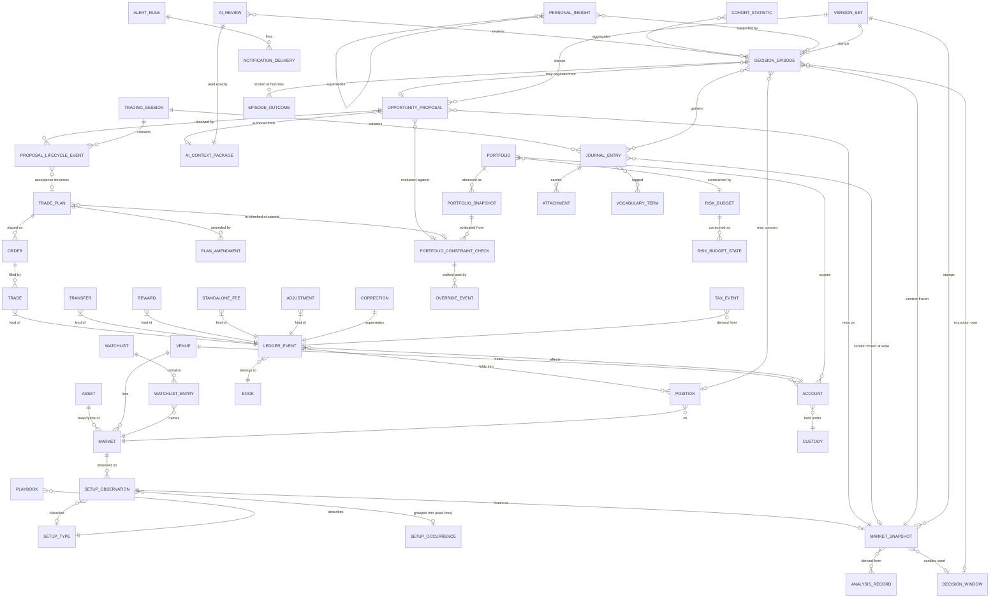
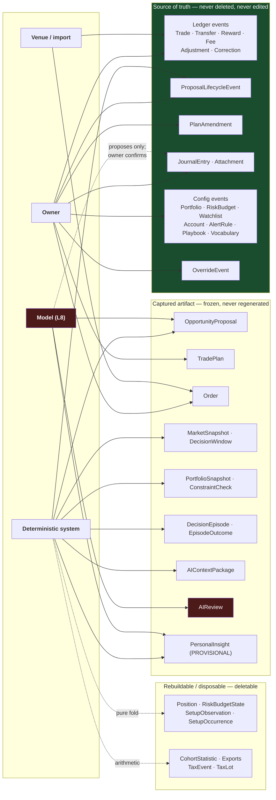
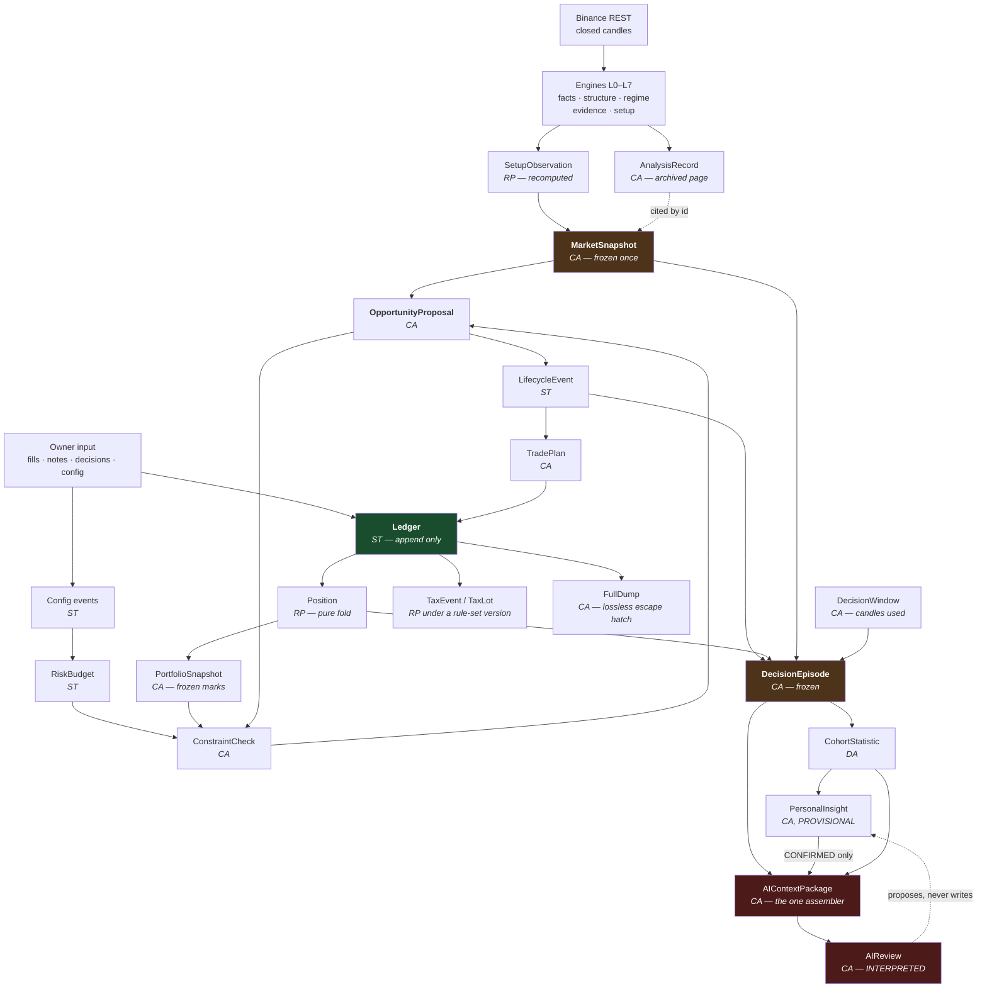
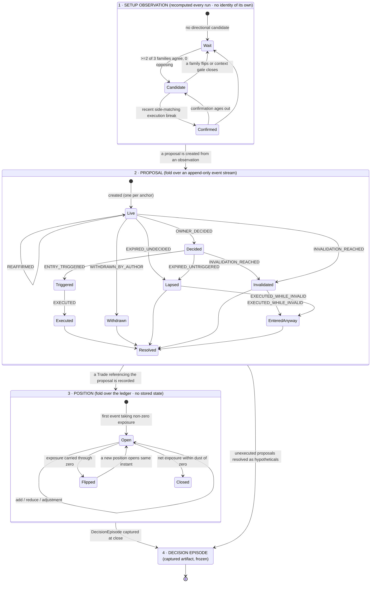
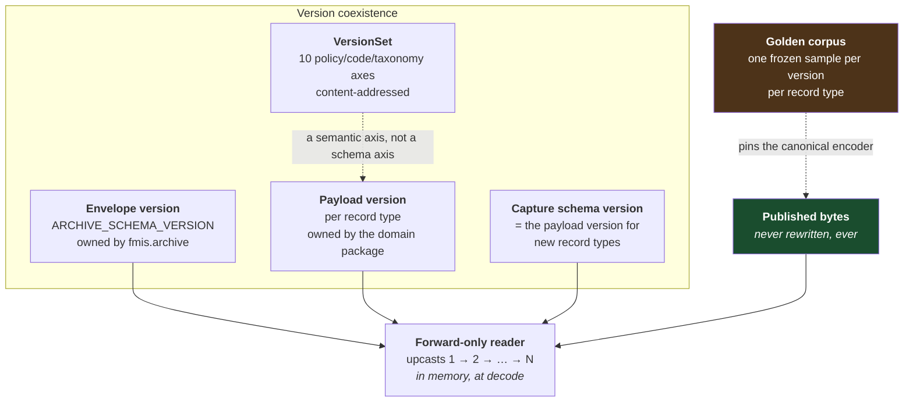

# Trading Domain Data Model V1

**Milestone:** BG *(this document's own label. The board is not edited and no milestone is sequenced by
this document.)*
**Status:** **Design only.** No production code, no tests, no ADR, no backlog edit, no changelog entry,
no `CURRENT_STATE` edit, no commit. This document is the only artifact. Nothing here is authorization
to implement, and nothing here is an accepted decision.
**Date:** 2026-08-12
**Model:** Claude Opus 5
**Repository state read:** `main`, `HEAD` = `7ced9e2`, two commits ahead of `origin/main` (`f9ddc54`);
working tree clean apart from fifteen untracked research documents under `docs/design/` and
`docs/reviews/` (this document becomes the sixteenth). `src/fmis` read directly: 128 modules,
28,972 lines, 22 packages.
**Type:** Domain data model. It specifies the *objects*. It specifies no storage engine, no schema
language, no table, no class, no file format beyond the shape of a contract, and no user interface.

**The one question this document answers:** *what are the business objects FMITS will hold for the
next decade — every field's mutability, provenance, lifecycle, audit obligation and version rule —
such that nothing important can be lost, nothing derived can be mistaken for something asserted, and
no AI-produced value can ever become a fact?*

---

## 0. Method, and the four rules this document holds itself to

**Read in full.** `PROJECT_SPECIFICATION_V1.md` · `PROJECT_VISION_ADDENDUM_V1.md` ·
`docs/AI_HANDOFF/CURRENT_STATE.md` · `FMITS_PRODUCT_BACKLOG.md` · `FMITS_PRODUCT_CHANGELOG.md` · all
28 ADRs (0001, 0003, 0005, 0007–0009, 0011, 0016, 0019–0021, 0023, 0025–0028 in full; the remainder by
decision text) · reports 0001–0013 (0003 §3/§11, 0004 §4, §9, §12, §15, 0005, 0012 §7/§9, 0013 F7 in
full) · the research chain `AW`→`BF` (`EVIDENCE_FAMILY_INDEPENDENCE_RESEARCH_V1.md`,
`EVIDENCE_CALIBRATION_RESEARCH_V1.md`, `EDGE_SEGMENTATION_RESEARCH_V1.md`,
`FAILURE_ATTRIBUTION_RESEARCH_V1.md`, `CONFIRMATION_FRESHNESS_HYPOTHESIS_RESEARCH_V1.md`,
`CONFIRMATION_FRESHNESS_POLICY_DECISION_V1.md`, `RESEARCH_HARNESS_CORRECTION_V1.md`,
`SWING_TRADING_READINESS_AUDIT_V1.md`, `FMITS_INFORMATION_EDGE_RESEARCH.md`) ·
`TRADER_WORKSPACE_PRODUCT_ARCHITECTURE_V1.md` (`BE`) · `SWING_TRADING_MVP_BLUEPRINT_V1.md` (`BF`) ·
`TRADING_DOMAIN_ARCHITECTURE_V1.md` (`AP`) v1.2 · `AP_D1_D2_INVESTIGATION.md` ·
`AP_ADR_DISCOVERY.md` · `IMPLEMENTATION_ROADMAP_V1.md` · `ADR_IMPLEMENTATION_GATE.md` · the live
`src/fmis` tree.

**The four rules.**

1. **`AP` is not redesigned.** Where `AP` v1.2 already decided something, this document *specifies it
   to field level* and does not reopen it. Every place this document goes beyond `AP` is marked
   **NEW** and carries a decision ID (`BG-D1`…`BG-D10`, §18). There are ten, and §17 attacks all ten.
2. **No threshold is invented.** This document names policy parameters; it chooses none. The
   precedent is `fmis.decision_context.ContextPolicy` — the one policy object in the repository
   carrying no numbers, asserted by a test that no numeric literal beyond 0 and 1 exists in the
   evaluator.
3. **Every entity is stated in terms of the four durability classes and the five provenance values
   `AP` already defined** (§24.3, §5.2). A new entity that does not fit one of each is a modelling
   error, not a new class.
4. **A field that cannot be wrong, and a field that can, are never the same field.** This is the
   single rule that generates most of what follows.

**Claim labels**, carried from `BE`/`BF` so a reader can tell measurement from judgement:

| Label | Meaning |
|---|---|
| **[E]** | Evidence: a repository artifact, a live measurement, or an accepted ADR, cited |
| **[I]** | Inference drawn from cited evidence, stated as such |
| **[O]** | Design judgement with no repository evidence behind it |

Where evidence does not exist the word used is **unknown**.

---

## Table of contents

- [1. What this document adds to `AP`](#1-what-this-document-adds-to-ap)
- [2. Vocabulary, resolved once](#2-vocabulary-resolved-once)
- [3. The eight modelling laws](#3-the-eight-modelling-laws)
- [4. The kernel: identity, time, money, version, absence](#4-the-kernel-identity-time-money-version-absence)
- [5. Classification of every entity](#5-classification-of-every-entity)
- [6. The maps](#6-the-maps)
- [7. How to read an entity card](#7-how-to-read-an-entity-card)
- [8. Family A — Reference and identity](#8-family-a--reference-and-identity)
- [9. Family B — Market observation](#9-family-b--market-observation)
- [10. Family C — The decision chain](#10-family-c--the-decision-chain)
- [11. Family D — The economic ledger](#11-family-d--the-economic-ledger)
- [12. Family E — Capital, risk and portfolio](#12-family-e--capital-risk-and-portfolio)
- [13. Family F — Journal and attachments](#13-family-f--journal-and-attachments)
- [14. Family G — Learning and memory](#14-family-g--learning-and-memory)
- [15. Family H — Leaf and surface](#15-family-h--leaf-and-surface)
- [16. The trade lifecycle, in full](#16-the-trade-lifecycle-in-full)
- [17. History, reconstruction and the four questions](#17-history-reconstruction-and-the-four-questions)
- [18. Journaling](#18-journaling)
- [19. Portfolio](#19-portfolio)
- [20. Decision history](#20-decision-history)
- [21. AI interaction rules](#21-ai-interaction-rules)
- [22. Designing for the futures that are already named](#22-designing-for-the-futures-that-are-already-named)
- [23. Red team](#23-red-team)
- [24. Open decisions this document raises](#24-open-decisions-this-document-raises)
- [25. What this document does not claim](#25-what-this-document-does-not-claim)

---

# 1. What this document adds to `AP`

`AP` v1.2 is a **domain architecture**: which objects exist, which responsibilities they hold, which
boundaries they may not cross. It names roughly eighteen objects and specifies most of them at the
level of "these are the field groups and here is why each exists."

This document is the **data model**: for every object in the domain — including the ones `AP` did not
name because the questions that need them were asked later, in `BE`, `BF` and the milestone brief for
this document — the complete field-level contract, stated as thirteen answers per entity.

### 1.1 The delta, stated precisely

| Category | Count | What it means |
|---|---|---|
| **Adopted from `AP` unchanged** | 18 objects | The responsibility, lifecycle and boundary are `AP`'s. This document adds field-level mutability, provenance, audit and versioning contracts only |
| **Specified further** | 9 of those 18 | Where `AP` says "field group" this document says "field, type, mutability, provenance, who may write it" |
| **NEW, with a decision ID** | 10 objects / rules | §18. Each is traced to evidence in the repository or to a question the milestone brief asks that `AP` has no object for |
| **Rejected** | 6 candidate objects | Sub-portfolios (§12.2) · a separate `Wallet` (§8.4) · a disagreement-resolution object and an AI-vs-owner scoreboard (§20) · "Archived" as a lifecycle state (§16.4) · "closed risk" as a concept (§19). Each is recorded where it is rejected, never silently dropped |

### 1.2 The ten new items, and what each is for

| ID | New | Why `AP` has no home for it | Evidence |
|---|---|---|---|
| **BG-D1** | **`SetupOccurrence`** — a *read-time* grouping giving a setup continuity across bars, plus a **one-live-proposal-per-anchor** rule keyed on the invalidation level's own origin | `SetupAssessment` is recomputed every run and has no identity across time; nothing stops the same idea becoming forty proposals | `BC` measured 549 "unique setups" from 552 directional observations — a 1:1 ratio **[E]** report 0012 §7; `BE` §3.4.4 |
| **BG-D2** | **`Watchlist` / `WatchlistEntry`** as config events | The universe is a hardcoded 20-symbol tuple; the choice of what to look at is the largest unrecorded decision in the workflow | `scan.py` `SCAN_UNIVERSE` **[E]**; `BE` §1.3 step 2; backlog **D-06** open |
| **BG-D3** | **`RiskBudget` / `RiskBudgetState`** — a versioned, **period-scoped** limit set | `Portfolio.limits` (`AP` §13.2) has no period concept, and the specification requires a maximum *daily* loss | `SPEC` §11.2 **[E]**; `BF` §6.4, §7.2 |
| **BG-D4** | **`MarketSnapshot`** — one frozen bundle of the market facts a decision rested on | `AP` §25.2 requires regime, sufficiency, evidence and conflicts frozen at decision; three different objects would each freeze their own copy | `AP` §17.4, §25.2, and §18's own one-assembler argument applied one layer down **[I]** |
| **BG-D5** | **`TradingSession`** | Routine adherence is unmeasurable, and intraday risk state has nowhere to live when day trading arrives | `AP` §28.2, §33 name the gap explicitly **[E]**; `BE` §14.3 |
| **BG-D6** | **`OverrideEvent`** | `AP` §20.5 names *constraint override rate* as a metric; no object records an override | `AP` §20.5 **[E]**; `BF` §7.1 |
| **BG-D7** | **`Attachment`** | Screenshots and documents are asked for by the brief; `AP` §16 has no attachment contract | Milestone brief; `BF` §8.4 defers with reasons **[E]** |
| **BG-D8** | **`DecisionWindow`** — the bounded closed-candle excerpt a frozen decision or excursion was computed over | MAE/MFE must be computed at close because kline history is not permanent, but nothing records *which* candles | `AP` §25.3 **[E]**; `AP` Finding 7 capability 2 |
| **BG-D9** | **`AlertRule` / `NotificationDelivery`** | A muted alert set silently disables the invalidation warning; the rules must be inspectable and versioned | `BE` §3.4.16, §10.1 **[E]** |
| **BG-D10** | **`VersionSet`** — one deduplicated, content-addressed bundle replacing eight independent version fields | Eight version axes on every captured artifact is real weight; `AP_ADR_DISCOVERY` AP-D12 already names four independent reinventions of versioning | `AP_ADR_DISCOVERY` AP-D12 **[E]** |

### 1.3 One collision found while reading the source, and it must be recorded

The milestone brief asks for an entity called **Analysis Snapshot**. **`AnalysisSnapshot` is already a
live, exported public name** — `fmis.pipeline.market_analysis:154`, re-exported from
`fmis.pipeline.__init__`, and consumed by `fmis.trading_context`. **[E]** It is an L7 composition
result over one instrument on one timeframe.

The repository maintains **zero export collisions** as a measured invariant (`FMITS_PRODUCT_BACKLOG.md`
§4). **[E]** Reusing the name in the trading domain would break it on the first import.

**Resolution, and it is not cosmetic.** The brief's "analysis snapshot" is in fact two different
things, and separating them is the useful part:

| The brief's phrase means | This document's name | What it is |
|---|---|---|
| *"the analysis page FMITS produced and stored"* | **`AnalysisRecord`** | `AO`'s existing archived `Workspace`/`DailyRun` record. Built today **[E]** |
| *"the market facts a decision was made against"* | **`MarketSnapshot`** (`BG-D4`) | A frozen, decision-scoped bundle. New |
| *(unchanged, market half)* | `AnalysisSnapshot` | The existing L7 type. **Untouched by this document** |

---

# 2. Vocabulary, resolved once

`AP` §6.2 resolved nine naming hazards. Six more appear the moment the model reaches field level, and
all six come from the milestone brief's own question list. Resolving them here prevents six future
packages each inventing an answer. **[O]**

| The owner says | This model calls it | Why the distinction is load-bearing |
|---|---|---|
| **"a setup"** (the *kind* — "trend continuation retest") | **`SetupType`** — a term in a closed, versioned vocabulary | It is counted, so it must never be silently redefined (`AP` §20.2) |
| **"a setup"** (the *instance* — "the DOT short that's been building since Tuesday") | **`SetupOccurrence`** — a read-time grouping over observations | Continuity across bars. Today this does not exist and one idea becomes N results **[E]** |
| **"a setup"** (the *reading* — what `fmits setup DOTUSDT` printed at 21:00) | **`SetupObservation`** (wrapping the built `SetupAssessment`) | A measurement at an instant. Ephemeral by design |
| **"an opportunity"** | **`OpportunityProposal`** | `AP` §8. **There is no separate Opportunity object.** An opportunity that was never proposed left no trace, and an opportunity that was proposed *is* a proposal |
| **"a decision"** | **Never one object.** One of: `ProposalLifecycleEvent(OWNER_DECIDED)` · `OverrideEvent` · a config event · (for learning) `DecisionEpisode` | §20. Three different authors, three different truth conditions — the identical argument `AP` §8.3 made against a single decision enum |
| **"my risk budget"** | **`RiskBudget`** (the policy) vs **`RiskBudgetState`** (what is left) | One is `ASSERTED` and versioned; the other is `MEASURED` and recomputed. Merging them is how a limit silently changes when exposure changes |
| **"a session"** | **`TradingSession`** — a routine occurrence, never a market session | Crypto has no market session. The word means *the owner's twenty minutes*, not the exchange's hours |
| **"a snapshot"** | `MarketSnapshot` (facts) · `PortfolioSnapshot` (capital) · `AnalysisRecord` (the page) · `AnalysisSnapshot` (existing L7 type — market half) | Four different objects were all being called one word |

**Rules that follow, and each is testable:**

1. **No name in this domain uses "trade" to mean a round trip.** The round trip is `Position`
   (`AP` §6.2, inherited unchanged).
2. **No name in this domain uses "snapshot" without a qualifier.**
3. **`SetupType`, `SetupOccurrence` and `SetupObservation` are three different types and no field is
   typed "setup".**

---

# 3. The eight modelling laws

Six are `AP`'s, restated as *data-model* rules so an entity card can cite them. Two are new and are
this document's own contribution to the ruleset. Every entity card in §8–§15 is an application of
these eight and nothing else.

### Law 1 — One fact, one representation

> **If two fields could ever disagree about the same fact, one of them is not a field.**

`AP` §11.4, stated for balance postings, generalized here to every entity. Consequences at field level:
no stored quotient (`average_entry` holds the `(total_cost, total_quantity)` pair, not the division)
**[E]** investigation §1.3.5; no stored state where a fold exists; no stored count; no denormalized
copy of a *mutable* value.

**The one permitted denormalization**, and the rule that bounds it (**NEW**):

> **Denormalize a value only if the value is itself immutable. Reference anything that is a captured
> artifact; copy only what is frozen and cheap.**

This resolves a real tension in `AP`: §17.5 argues a `DecisionEpisode` is deliberately denormalized
for query speed, while §5.1 forbids two representations of one fact. Both hold, because a frozen
artifact cannot drift from a copy of itself. An episode may copy `regime_at_decision` (frozen); it may
**not** copy a position's `net_quantity` (a live fold).

### Law 2 — Everything mutable is an append

The only mutable thing in the system is the sequence of recorded events, which only ever grows
(`AP` §5.1). Corrections supersede; amendments append; insights version. **[E]**

At field level this means every entity has exactly one of three update stories, and the card states
which: **append-a-superseding-event** · **frozen-at-a-named-moment** · **recomputed-from-a-fold**.
There is no fourth, and "edit the field" is not one of them.

### Law 3 — Provenance is a property of every value that can be wrong

`ValueOrigin` ∈ {`MEASURED`, `POLICY_DERIVED`, `ASSERTED`, `INTERPRETED`, `ABSENT`} (`AP` §5.2). **[E]**
At field level: an entity whose fields have mixed origins carries the origin **per field group**, not
per record, and every card states the mapping. A surface that cannot distinguish `ASSERTED` from
`MEASURED` is rendering a lie of omission — `ASSERTED` is the only class that can simply be wrong.

### Law 4 — Absence is a value, with a reason

One shape, everywhere: `Absent[T](reason)` (`AP_ADR_DISCOVERY` AP-D13 — three independent
reinventions of this idea already exist in `AP`'s own text). **[E]** No `None` standing in for "we
could not compute it", no zero standing in for "we had no mark" (`AP` §14.3's explicit warning), no
empty string standing in for "the owner did not say."

### Law 5 — Freeze anything that will not be identical in three years

A mark, a rate, a policy version, an engine implementation, a model, or a candle history that may no
longer be fetchable (`AP` §25.1). **[E]** Everything else is recomputed and never stored.

### Law 6 — The trading domain reads the market half and is never read by it

No L0–L7 module may import anything defined here (`AP` §5.6), *or the analysis becomes a function of
the position — the oldest bias in trading*. **[E]** At field level: no market-half type may gain a
field pointing at a trading-domain object. A `PriceLevel` may be referenced *by* a proposal; a
`PriceLevel` may never learn that a proposal exists.

### Law 7 — AI never writes to a source of truth (**NEW**)

The entity-level expression of `AP` §5.9's *"AI never produces a fact."* **[O]**, on **[E]**.

> **A model may create or propose only entities whose durability class is `captured artifact` and
> whose `ValueOrigin` is `INTERPRETED`, plus `PROVISIONAL`-status proposals for the owner to confirm.
> No model may write, amend, correct or supersede any entity in durability class *source of truth*,
> for any reason, ever.**

Stated as a class rule rather than per entity because per-entity prohibitions are how one gets missed.
§21 gives the full matrix; the rule above is what the matrix must always reduce to.

### Law 8 — Every captured artifact names what it consumed (**NEW**)

> **A captured artifact records the identifiers *and digests* of every source-of-truth record and
> every other captured artifact it read.**

Three things this buys, none of which is available otherwise. **[I]**

1. **Correction awareness without recomputation.** `AP_ADR_DISCOVERY` AP-D9 (**Critical**, unowned)
   asks what a `Correction` owes an already-frozen artifact. With consumed-ids recorded, staleness is
   **derivable** — compare the consumed set against the resolver's supersession map — so a surface can
   render *"this episode was computed from a trade that has since been corrected"* without ever
   silently rewriting the episode. Without consumed-ids it is not derivable at any cost.
2. **Verification depth beyond a per-record digest.** The investigation's N10 (no ordering or
   completeness proof over the ledger) is partially closed for free: an artifact referencing an event
   that no longer resolves is a detected gap. **[E]** investigation §2.3.5.
3. **The tax requirement `AP` already named.** *"A tax report names the `event_id`s and digests it
   consumed — one field now, unanswerable later"* **[E]** investigation §4.2. This law is that field,
   generalized from one artifact to all of them, at the same cost.

---

# 4. The kernel: identity, time, money, version, absence

Five primitives every entity uses. Defining them once is what keeps forty-nine entity cards from
containing forty-nine private conventions. All five belong to packages `AP` §27 already places below
the domain (`fmis.provenance`, `fmis.money`) or to `fmis.archive`, extended.

### 4.1 Identity

Three identity schemes, and an entity uses exactly one.

| Scheme | Shape | Used by | Rule |
|---|---|---|---|
| **Content-derived** | `{type}-{subject}-{UTC stamp}-{digest[:16]}`, ADR-0027 §4 style **[E]** | Every source-of-truth event; every captured artifact | The digest covers the **economic/semantic** fields only. `recorded_at`, `source`, `asserted_by` and `capture_schema_version` are **excluded** — the review's C1 showed their inclusion breaks idempotency three ways and would double-count every manual fill on the day exchange sync ships **[E]** `AP_ADR_DISCOVERY` AP-D7 |
| **Declared** | An owner-supplied slug, validated against a strict pattern | `Portfolio`, `Account`, `Watchlist`, `RiskBudget`, `AlertRule` — configuration the owner names | Human-speakable, because these are typed at a CLI. A collision is rejected, never suffixed |
| **Derived key** | A tuple, never stored | `Position` (`market`, `book`, flat-crossing ordinal), `SetupOccurrence`, every projection | **A derived key may never be referenced from a captured artifact** — §23.1 explains why this rule exists and what it cost to find |

**One additional rule the archive's current identity scheme does not state, and this model needs.**
`AP` §31.3 records *"human-speakable record aliases"* as an open policy question: content-derived IDs
are excellent for integrity and hostile to conversation **[E]**. This model's answer is minimal and
costs one field: a captured artifact may carry an **`alias`** — a short, mutable, non-identifying,
owner-or-system-assigned label (`P-4f2a`, the form `BE` §5.2's mock already uses **[E]**) — which is
**never** part of any digest, **never** a foreign key, and **may be reassigned**. A surface resolves an
alias to an id; nothing else ever accepts one.

### 4.2 Time

Three timestamps (`AP` §5.4) **[E]**, plus one this model makes explicit because every learning cohort
in `AP` §20.3 depends on it:

| Field | Meaning | On which entities |
|---|---|---|
| `occurred_at` | When it happened at the venue or in the market, UTC | Every event |
| `recorded_at` | When FMITS learned of it, UTC | Every event and every captured artifact |
| `reported_at` | When a statement asserted it, UTC, optional | Imported events |
| `owner_local_date` | The `Europe/Stockholm` calendar date of `occurred_at` under `OwnerContext.display_timezone` — **a derived projection, never stored** | Read-time only |

**ADR-0001 is untouched: UTC is canonical for storage.** **[E]** `owner_local_date` is listed here
precisely to state that it is *not* a field: `AP` §20.3 requires time-of-day and weekday cohorts to be
owner-local, and computing them at read time from the stored UTC instant plus the folded
`OwnerContext` is the only version of that which survives the owner relocating. **[I]**

### 4.3 Money and quantity

`AP` §5.3 + the investigation's recommended Option C. **[E]**

> **Every asserted money and quantity value is stored as canonical decimal text and preserved exactly,
> forever. Money sums are computed in `Decimal`. No quotient is ever a stored field.**

At field level, three consequences the entity cards rely on:

- A monetary field is always a pair `(amount_text, asset)`. There is no bare number anywhere in the
  domain. A field named `price` without an asset is a modelling error.
- Any field whose name implies a division — `average_entry`, `risk_reward`, `weight`, `expectancy`,
  `beta`, `win_rate` — is **never stored on a source-of-truth or captured artifact** except where
  the *quotient itself was asserted or frozen*, in which case it is stored as text beside its
  numerator and denominator. (This is the review's C2 correction to the quotient rule, applied.) **[E]**
- `float` remains untouched below L7. `fmis.data`'s OHLCV contract does not change. **[E]** `AP` §5.6.

### 4.4 Versions — one `VersionSet`, not eight fields (**NEW — BG-D10**)

Counted across `AP`: `policy_version`, `model_version`, `template_version`, `classification_version`,
`taxonomy_version`, `calculation_version`, `capture_schema_version`, `rule_set_version`,
`counterfactual_assumption_version`, plus the investigation's recommended `code_version` **[E]**. Ten
version axes. Stamping ten fields on every captured artifact is genuine weight, and
`AP_ADR_DISCOVERY` AP-D12 already found four subsystems independently reinventing versioning. **[E]**

**`VersionSet`** is one content-addressed, immutable, **deduplicated** record holding the full axis
map. An artifact carries `version_set_id`. Over a decade the number of *distinct* sets is in the
hundreds, not the tens of thousands — every artifact produced between two releases shares one. **[I]**

| Property | Consequence |
|---|---|
| Content-addressed | Two artifacts produced under identical versions share one id, byte-comparable in O(1) |
| Immutable, never superseded | A version set is a statement about the past |
| Includes `code_version` | The one string that keeps a future capability-3 (true replay) decision *possible*; unrecoverable if skipped **[E]** investigation N13 |
| An axis may be **added** | Adding an axis is a `VersionSet` schema bump, and prior sets read that axis as `Absent(reason="axis introduced in v N")` — the coverage-gap semantics `AP_ADR_DISCOVERY` AP-D17 asks for, implemented once **[E]** |

### 4.5 Absence and its four faces, unified

| `AP` writes | Where | This model |
|---|---|---|
| `ABSENT` (a `ValueOrigin`) | §5.2 | `Absent[T](reason)` |
| `INDETERMINATE(reason)` | §15.5 constraint results | `Absent[LimitResult](reason)` |
| `NotApplicable(reason)` | §17.3 episode outcomes | `Absent[EpisodeMetric](reason)` |
| `InsufficientSample(n)` | §20.3 cohorts | `Absent[Statistic](reason, n)` — the one variant carrying a second field, because `n` is the whole point |

One shape, four uses. **[E]** `AP_ADR_DISCOVERY` AP-D13 names this as an unowned decision; §4.5 is a
proposed answer, not an accepted one.

---

# 5. Classification of every entity

Forty-nine entity cards. Every one has exactly one durability class, one primary write authority, and one
dominant `ValueOrigin`. **This table is the document's index** — the cards in §8–§15 expand it.

**Durability classes** (`AP` §24.3, unchanged) **[E]**: **ST** source of truth · **CA** captured
artifact · **RP** rebuildable projection · **DA** disposable aggregate.

**Write authority**: **O** owner · **S** system (deterministic) · **V** venue/import · **AI** model ·
**—** never written directly (derived).

| # | Entity | Family | Class | Write | Origin | Status | §  |
|---|---|---|---|---|---|---|---|
| 1 | `Asset` | A | ST | O | `ASSERTED` | `AP` §27 | 8.1 |
| 2 | `Market` | A | ST | O | `ASSERTED` | `AP` §27 | 8.2 |
| 3 | `Venue` | A | ST | O | `ASSERTED` | `AP` §27 | 8.3 |
| 4 | `Account` | A | ST | O | `ASSERTED` | `AP` §27 | 8.4 |
| 5 | `Custody` | A | ST | O | `ASSERTED` | `AP` §27 | 8.5 |
| 6 | `Book` | A | ST | O | `ASSERTED` | `AP` §5.5 | 8.6 |
| 7 | `OwnerContext` | A | ST | O | `ASSERTED` | `AP` §5.4 | 8.7 |
| 8 | `VocabularyTerm` | A | ST | O | `ASSERTED` | `AP` §20.2 | 8.8 |
| 9 | `VersionSet` | A | CA | S | `MEASURED` | **NEW BG-D10** | 8.9 |
| 10 | `Watchlist` / `WatchlistEntry` | B | ST | O | `ASSERTED` | **NEW BG-D2** | 9.1 |
| 11 | `SetupType` | B | ST | O | `ASSERTED` | **NEW BG-D1** | 9.2 |
| 12 | `SetupObservation` | B | RP | — | `POLICY_DERIVED` | **NEW BG-D1** | 9.3 |
| 13 | `SetupOccurrence` | B | RP | — | `POLICY_DERIVED` | **NEW BG-D1** | 9.4 |
| 14 | `MarketSnapshot` | B | CA | S | `MEASURED` | **NEW BG-D4** | 9.5 |
| 15 | `DecisionWindow` | B | CA | S | `MEASURED` | **NEW BG-D8** | 9.6 |
| 16 | `AnalysisRecord` | B | CA | S | `MEASURED` | Built (`AO`) | 9.7 |
| 17 | `OpportunityProposal` | C | CA | S / O / AI | `POLICY_DERIVED` \| `INTERPRETED` | `AP` §8 | 10.1 |
| 18 | `ProposalLifecycleEvent` | C | ST | S / O | mixed per kind | `AP` §8.4 | 10.2 |
| 19 | `TradePlan` | C | CA | O | `ASSERTED` | `AP` §9 | 10.3 |
| 20 | `PlanAmendment` | C | ST | O | `ASSERTED` | `AP` §9.3 | 10.4 |
| 21 | `Order` | C | CA | O / V | `ASSERTED` | `AP` §10 | 10.5 |
| 22 | `OverrideEvent` | C | ST | O | `ASSERTED` | **NEW BG-D6** | 10.6 |
| 23 | `Trade` | D | ST | O / V | `ASSERTED` | `AP` §11 | 11.1 |
| 24 | `Transfer` | D | ST | O / V | `ASSERTED` | `AP` §11.7 | 11.2 |
| 25 | `Reward` | D | ST | O / V | `ASSERTED` | `AP` §11.7 | 11.3 |
| 26 | `StandaloneFee` | D | ST | O / V | `ASSERTED` | `AP` §11.7 | 11.4 |
| 27 | `Adjustment` | D | ST | O / V | `ASSERTED` | `AP` §11.7 | 11.5 |
| 28 | `Correction` | D | ST | O | `ASSERTED` | `AP` §11.7 | 11.6 |
| 29 | `Position` | E | RP | — | `MEASURED` | `AP` §12 | 12.1 |
| 30 | `Portfolio` | E | ST | O | `ASSERTED` | `AP` §13 | 12.2 |
| 31 | `PortfolioSnapshot` | E | CA | S | `MEASURED` | `AP` §14 | 12.3 |
| 32 | `RiskBudget` | E | ST | O | `ASSERTED` | **NEW BG-D3** | 12.4 |
| 33 | `RiskBudgetState` | E | RP | — | `MEASURED` | **NEW BG-D3** | 12.5 |
| 34 | `PortfolioConstraintCheck` | E | CA | S | `POLICY_DERIVED` | `AP` §15.5 | 12.6 |
| 35 | `JournalEntry` | F | ST | O | `ASSERTED` | `AP` §16 | 13.1 |
| 36 | `Attachment` | F | ST | O | `ASSERTED` | **NEW BG-D7** | 13.2 |
| 37 | `Playbook` | F | ST | O | `ASSERTED` | Brief | 13.3 |
| 38 | `TradingSession` | F | ST | S / O | mixed | **NEW BG-D5** | 13.4 |
| 39 | `DecisionEpisode` | G | CA | S | mixed | `AP` §17 | 14.1 |
| 40 | `EpisodeOutcome` | G | CA | S | `MEASURED` | `AP` §17.3 | 14.2 |
| 41 | `AIContextPackage` | G | CA | S | `MEASURED` | `AP` §18 | 14.3 |
| 42 | `AIReview` | G | CA | AI | `INTERPRETED` | `AP` §19 | 14.4 |
| 43 | `CohortStatistic` | G | DA | — | `MEASURED` | `AP` §20.3 | 14.5 |
| 44 | `PersonalInsight` | G | CA | S / AI / O | `POLICY_DERIVED` \| `INTERPRETED` | `AP` §21 | 14.6 |
| 45 | `TaxEvent` / `TaxLot` / `TaxReport` | H | RP / CA | — / S | `POLICY_DERIVED` | `AP` §22 | 15.1 |
| 46 | `FullDump` | H | CA | S | `MEASURED` | `AP` §23, Q9 | 15.2 |
| 47 | `ExportProjection` | H | DA | — | `MEASURED` | `AP` §23 | 15.3 |
| 48 | `AlertRule` | H | ST | O | `ASSERTED` | **NEW BG-D9** | 15.4 |
| 49 | `NotificationDelivery` | H | DA | S | `MEASURED` | **NEW BG-D9** | 15.5 |

*(Forty-nine rows, one card each. Two rows carry more than one type: row 10 is `Watchlist` plus its
entry, and row 45 is the three tax types on one card. The six ledger kinds have six cards but **one
shared contract** — §11.0 — which is why they read as one object with six shapes rather than six
objects.)*

### 5.1 The distribution, and what it says

| Class | Count | Deletable? | Migration obligation |
|---|---|---|---|
| **ST** source of truth | 25 | **Never** | Full — forward-only readers, golden corpus |
| **CA** captured artifact | 16 | **Never** | Full |
| **RP** rebuildable projection | 5 | Yes, freely | None — recomputed |
| **DA** disposable aggregate | 3 | Yes, freely | None |

**Forty-one of forty-nine are irreplaceable.** That ratio is the whole reason `AP-D2` blocks. **[I]**

The **CI test that keeps this classification honest** is `AP` §24.3's, unchanged: delete every RP and
DA, recompute, assert identical. Anything that fails is a captured artifact that was misclassified.
**[E]** This document adds one clause to it — §23.1.

---

# 6. The maps

### 6.1 Entity-relationship diagram



### 6.2 Write authority — who may create what

The diagram that matters most, because it is Law 7 made visible. An arrow means *may create*. There is
**no arrow from AI to any green box.** **[O]**



Three properties of that picture are the whole of Law 7. **[I]**

- **AI reaches exactly three boxes**, all captured artifacts: `AIReview`, a `PROVISIONAL`
  `PersonalInsight`, and an `OpportunityProposal` with `author = MODEL`. Every one is `INTERPRETED`
  and none is an input to a computation.
- **The dotted AI→JournalEntry arrow is a proposal, not a write.** A model may suggest a tag; the tag
  is stored `AI_PROPOSED_PENDING` and is **not counted** in any cohort until the owner confirms it.
  **[E]** `AP` §16.3.
- **The two dotted system arrows are folds, not writes.** Nothing is stored; delete them and they
  recompute identically. That is the CI test in §5.1.

### 6.3 Package ownership

`AP` §27's layout, extended with this document's new entities. Import direction unchanged; every rule
in `AP` §27 continues to hold. **NEW** packages are marked.

```
fmis/
  provenance/     ValueOrigin · Assertion · Absent[T] · VersionedTerm   imports: nothing
  money/          Asset · Money · Quantity · FxRate · dust              imports: nothing
  accounts/       Account · Venue · Custody · Book · Market · OwnerContext
                                                                       imports: money
  versioning/     VersionSet                              **NEW**      imports: provenance
  watchlist/      Watchlist · WatchlistEntry              **NEW**      imports: accounts, provenance
  ledger/         events · corrections · resolver · balance_effects()   imports: money, accounts, provenance
  snapshotting/   MarketSnapshot · DecisionWindow         **NEW**      imports: provenance, versioning
  proposal/       OpportunityProposal · lifecycle events · SetupType
                  SetupObservation · SetupOccurrence                    imports: money, accounts, provenance,
                                                                                 snapshotting, swing_setup (read-only)
  plan/           TradePlan · PlanAmendment · adherence                 imports: money, accounts
  orders/         Order · states                                        imports: money, accounts
  positions/      the fold: ledger → Position                           imports: ledger, plan, orders
  portfolio/      definition events · Snapshot builder                  imports: positions, money
  risk/           RiskBudget · RiskBudgetState · OverrideEvent
                  PortfolioConstraintCheck                **NEW/§15**   imports: portfolio, proposal
  journal/        JournalEntry · Attachment · Playbook · tags · links    imports: provenance, accounts
  session/        TradingSession                          **NEW**      imports: provenance
  episode/        DecisionEpisode · EpisodeOutcome                      imports: positions, plan, proposal,
                                                                                 journal, snapshotting
  performance/    cohorts · bias · calibration · sample guard           imports: episode
  memory/         PersonalInsight · status lifecycle                    imports: performance, episode, provenance
  ai_context/     AIContextPackage — the only assembler                 imports: episode, positions, portfolio,
                                                                                 performance, memory
  review/         AIReview record types (no model calls)                imports: ai_context
  alerts/         AlertRule · NotificationDelivery        **NEW**      imports: provenance
  tax/            jurisdictions · rule sets · lots · reports            imports: ledger, money
  export/         FullDump · ExportProjection                           imports: everything above
  archive/        (existing) extended with new record types             imports: the models it encodes
```

**Two rules added to `AP` §27's ten**, both testable the way import direction already is:

11. **`fmis.snapshotting` imports no engine.** It holds the *shape* of a frozen market bundle; the
    composition root fills it. This mirrors `fmis.decision_context`, which imports nothing from `fmis`
    and takes seven integers, two strings, a flag and a timestamp — precisely so it cannot parse a
    presentation model back into data. **[E]**
12. **`fmis.proposal` may read `fmis.swing_setup` and nothing else from the market half.** One
    read-only edge, at one package, is what keeps Law 6 checkable by a single AST guard rather than by
    reading every import in the domain. **[O]**

### 6.4 Data flow — where a value comes from and where it can go



**The four edges worth naming.** **[I]**

1. **`ENG → OBS` is one-way and there is no return arrow.** Law 6. No engine below L7 has an edge
   into anything on this diagram.
2. **`PCC → PROP` is why a technically attractive setup becomes `WAIT`.** `AP` §15.6, unchanged. **[E]**
3. **`AIREV ⇢ INS` is dotted because a review proposes and never writes.** **[E]** `AP` §19.5.
4. **`INS → AICTX` is filtered to `CONFIRMED`.** A provisional hypothesis never feeds the next
   proposal — *"the difference between a system that learns and one that compounds its own guesses."*
   **[E]** `AP` §2.

---

# 7. How to read an entity card

Every card in §8–§15 answers the same thirteen questions, in the same order, so two entities can be
compared line by line. Where an answer is identical to a law in §3 the card cites the law rather than
restating it.

| # | Question | What a good answer looks like |
|---|---|---|
| 1 | **Purpose** | One sentence. If it needs two, the entity is two entities |
| 2 | **Owner** | The package that defines it, and the single write authority |
| 3 | **Lifecycle** | Created when · reaches terminal state when · what "terminal" means |
| 4 | **Immutable fields** | Fields that may never change after creation, for any reason |
| 5 | **Mutable fields** | Fields that change, and **by which of Law 2's three stories** |
| 6 | **Relationships** | Cardinality and direction; which side holds the reference |
| 7 | **Creation rules** | Preconditions, validation, idempotency, what makes creation *fail* |
| 8 | **Update rules** | Exactly how a change is expressed; what is structurally unrepresentable |
| 9 | **Deletion policy** | The default is **never**. Any exception states its authority |
| 10 | **Audit** | What a reviewer can reconstruct, and from what |
| 11 | **Versioning** | Which axes apply; what a version change does to existing records |
| 12 | **Deterministic provenance** | Which fields are `MEASURED` / `POLICY_DERIVED` / `ASSERTED` / `INTERPRETED`, and what is re-derivable |
| 13 | **AI rules** | May a model create it, propose it, annotate it, read it — and what it may never touch |

**The shorthand `↻`** marks a field that is *recomputed and never stored* — listed on the card so a
reader knows the concept exists and knows it is not a field.

---

# 8. Family A — Reference and identity

Nine entities that name things. They carry no market opinion, no money and no history of their own —
but everything else in the model points at them, so an error here is an error everywhere.

**`AP` §27's constraint, carried unchanged and repeated because it is the constant temptation:**
*"Reference data stays minimal. `Market` and `Account` are identifiers with attributes, not a registry
with lifecycle management."* **[E]** Every card below is written against that line.

## 8.1 `Asset`

| # | |
|---|---|
| **1 Purpose** | Names one thing that can be held, exchanged, or denominated in — `BTC`, `USDT`, `SEK` |
| **2 Owner** | `fmis.money`. Write authority: **owner** (a config event) |
| **3 Lifecycle** | Created when first referenced by any event the owner records. Never terminal — an asset that stops trading is `retired_at`, still readable forever |
| **4 Immutable** | `asset_id` (the canonical symbol, declared) · `kind` (`CRYPTO` · `FIAT` · `STABLECOIN` · `TOKENIZED` · `OTHER`) · `introduced_at` |
| **5 Mutable** | `display_name`, `retired_at`, `aliases` — all by **append-a-superseding-config-event**. **Never** `asset_id` or `kind` |
| **6 Relationships** | 1→N `Market` (as base or quote) · 1→N ledger-event amounts · 0→1 dust policy entry |
| **7 Creation rules** | `asset_id` matches `^[A-Z0-9]{1,20}$`. A second asset with the same id and a different `kind` is a **rejection**, never a merge. Two venues calling different things `BTC` is a real hazard — the resolution is that `Market` names the venue, not that `Asset` splits |
| **8 Update rules** | Config event only. **Renaming is a new asset plus an `Adjustment` event** (`AP` §11.7), never an in-place rename, because a rename after a holding exists silently rewrites history |
| **9 Deletion** | Never. `retired_at` is the only end state |
| **10 Audit** | The config event stream reconstructs the asset table at any past instant. A ledger event referencing an asset introduced *after* it is a detected inconsistency |
| **11 Versioning** | No own version. The **dust policy** attached to an asset is versioned separately (`AP` §5.3, AP-D1 Q8) and a bump is `AP_ADR_DISCOVERY` AP-D8's hazard — see §12.1 rule 8 |
| **12 Provenance** | Entirely `ASSERTED`. Nothing about an asset is measured by FMITS |
| **13 AI rules** | **Read only.** A model may not create, retire or alias an asset. Law 7 |

**Deliberately not modelled:** decimals/tick size/step size per asset. `AP` §27 excludes an instrument
registry and the investigation resolved Q4 as **record, don't validate** — a mistyped quantity is
corrected by `Correction`, not prevented by a table that must be kept current for every venue. **[E]**

## 8.2 `Market`

| # | |
|---|---|
| **1 Purpose** | Names one tradeable pair at one venue in one mode — the thing a `Trade`, `Position` and `SetupObservation` are all *about* |
| **2 Owner** | `fmis.accounts`. Write authority: **owner** |
| **3 Lifecycle** | Created on first reference; `delisted_at` is the only end state |
| **4 Immutable** | `market_id` (`{venue}:{base}{quote}:{mode}`) · `base_asset` · `quote_asset` · `venue_id` · `mode` (`SPOT` · `PERPETUAL` · `MARGIN` · `FUTURES_DATED`) |
| **5 Mutable** | `venue_symbol` (the venue's own string, which venues do change), `delisted_at`, `notes` — config event |
| **6 Relationships** | N→1 `Venue` · N→1 `Asset` twice · 1→N `Position`, `Trade`, `SetupObservation`, `WatchlistEntry` |
| **7 Creation rules** | `base_asset ≠ quote_asset`. `mode` is required and has **no default** — a perpetual and a spot pair on the same symbols are two markets, and merging them makes funding fees unattributable |
| **8 Update rules** | Config event. A venue symbol change never changes `market_id` |
| **9 Deletion** | Never |
| **10 Audit** | Every position and every tax event traces to a `market_id` that resolves at the event's own `occurred_at` |
| **11 Versioning** | None of its own |
| **12 Provenance** | `ASSERTED` |
| **13 AI rules** | **Read only** |

**Why `mode` is in the identity and not an attribute.** A perpetual position accrues funding
(`StandaloneFee`), can be liquidated (`Adjustment`), and has different tax treatment from spot. Three
different event kinds behave differently based on it. A field that changes which events are legal is
identity, not decoration. **[O]**

## 8.3 `Venue`

| # | |
|---|---|
| **1 Purpose** | Names where an event happened and who the counterparty risk is against |
| **2 Owner** | `fmis.accounts`. Write authority: **owner** |
| **3 Lifecycle** | Created on first reference; `ceased_at` optional |
| **4 Immutable** | `venue_id` · `kind` (`CEX` · `DEX` · `BROKER` · `BANK` · `SELF_CUSTODY` · `OTHER`) |
| **5 Mutable** | `display_name`, `jurisdiction`, `ceased_at` — config event |
| **6 Relationships** | 1→N `Market`, `Account` |
| **7 Creation rules** | `venue_id` declared, lowercase slug, unique |
| **8 Update rules** | Config event |
| **9 Deletion** | Never — a venue that no longer exists is exactly the venue whose records matter most |
| **10 Audit** | Venue concentration in a `PortfolioSnapshot` (`AP` §14.2) is computed from this edge; a missing venue makes that number silently wrong |
| **11 Versioning** | None |
| **12 Provenance** | `ASSERTED` |
| **13 AI rules** | **Read only** |

## 8.4 `Account`

| # | |
|---|---|
| **1 Purpose** | Names one place balances actually sit — a sub-account, a wallet, a bank account |
| **2 Owner** | `fmis.accounts`. Write authority: **owner** |
| **3 Lifecycle** | Opened → active → `closed_at`. A closed account keeps every event it ever carried |
| **4 Immutable** | `account_id` (declared slug) · `venue_id` · `custody_id` · `opened_at` |
| **5 Mutable** | `display_name`, `closed_at`, `external_reference` (an exchange sub-account id) — config event |
| **6 Relationships** | N→1 `Venue` · N→1 `Custody` · 1→N ledger events · N→M `Portfolio` **via `(account, book)` pairs** |
| **7 Creation rules** | Unique id. A `SELF_CUSTODY` account requires a `Custody` record naming the key-holding model; **no private key, seed phrase, address-with-balance or API secret is ever a field on any entity in this model** (`SPEC` §20) **[E]** |
| **8 Update rules** | Config event |
| **9 Deletion** | Never |
| **10 Audit** | The `(account, book)` → `Portfolio` mapping at any past instant is a fold over config events, which is what makes a historical `PortfolioSnapshot` verifiable |
| **11 Versioning** | None |
| **12 Provenance** | `ASSERTED` |
| **13 AI rules** | **Read only.** A model may read that an account exists; it may never read or be handed a credential, because none exists to read |

**"Wallet" is not a separate entity.** A wallet is an `Account` whose `Venue.kind` is `SELF_CUSTODY`
and whose `Custody` names the key model. Modelling wallets separately would produce two objects with
the same balance semantics and two places to fold — Law 1. **[O]** The single genuine difference is
the **network fee in a non-transferred asset** (ETH gas moving an ERC-20), which is a property of the
`Transfer` event, not of the account (§11.2, and `AP_ADR_DISCOVERY` AP-D3b).

## 8.5 `Custody`

| # | |
|---|---|
| **1 Purpose** | Records who can move the assets — the risk an `Account` carries that its balance does not show |
| **2 Owner** | `fmis.accounts`. Write authority: **owner** |
| **3 Lifecycle** | Created with its first account; superseded by config event |
| **4 Immutable** | `custody_id` · `model` (`EXCHANGE_CUSTODIAL` · `SELF_HOT` · `SELF_HARDWARE` · `SELF_MULTISIG` · `THIRD_PARTY_CUSTODIAN`) |
| **5 Mutable** | `notes` — config event |
| **6 Relationships** | 1→N `Account` |
| **7 Creation rules** | `model` required |
| **8 Update rules** | Config event. A custody *migration* is a `Transfer` between two accounts, never an edit |
| **9 Deletion** | Never |
| **10 Audit** | Concentration of value by custody model is a `PortfolioSnapshot` fact `SPEC` §8.2 requires (*"exchange/custody exposure"*) **[E]** and nothing else can supply |
| **11 Versioning** | None |
| **12 Provenance** | `ASSERTED` |
| **13 AI rules** | **Read only** |

## 8.6 `Book`

| # | |
|---|---|
| **1 Purpose** | Names which discipline an event belongs to. Books never share capacity |
| **2 Owner** | `fmis.accounts`. Write authority: **owner** (the member list is closed) |
| **3 Lifecycle** | The four members exist from the first release: `INVESTING` · `SWING` · `DAY` · `PAPER`. `AP` §5.5 **[E]** |
| **4 Immutable** | The member set. Adding a fifth is an **enum extension and therefore a capture-schema version bump** (investigation Q5, N5) **[E]** |
| **5 Mutable** | Nothing |
| **6 Relationships** | 1→N every ledger event, position, plan, proposal |
| **7 Creation rules** | Named on every economic event at record time. **Never inferred** (`AP` §11.2) **[E]** |
| **8 Update rules** | An event's book is corrected by `Correction`, never edited. Moving a position between books is **unrepresentable** — it would silently move risk between two capacity pools |
| **9 Deletion** | Never |
| **10 Audit** | *"Paper and live contamination"* (`AP` R12) is detectable because every aggregate states which books it covers, and the default excludes `PAPER` **[E]** |
| **11 Versioning** | Member addition = version bump, per row 4 |
| **12 Provenance** | `ASSERTED` |
| **13 AI rules** | **Read only.** A model may never assign or change a book — that would let interpretation move real risk into a paper pool |

## 8.7 `OwnerContext`

| # | |
|---|---|
| **1 Purpose** | The single place the system knows *who and where* the owner is, for presentation and for every local-calendar boundary |
| **2 Owner** | `fmis.accounts`. Write authority: **owner** |
| **3 Lifecycle** | One live context, folded from config events; every past value stays readable |
| **4 Immutable** | Each config event, once appended |
| **5 Mutable** | `display_timezone` (today `Europe/Stockholm`) · `base_currency` · `tax_jurisdiction` · `routine_times` (the 07:00 / 14:15 / 22:15 anchors `BE` §2.1 derives from candle closes **[E]**) · `sample_floor_defaults` — all by **append** |
| **6 Relationships** | Read by `TradingSession`, every cohort dimension, every rendered page |
| **7 Creation rules** | `display_timezone` is a valid IANA zone. It is **deliberately a different field from the tax jurisdiction's period timezone** — they coincide today and diverge the moment the owner relocates while remaining Swedish-taxed (`AP` §5.4) **[E]** |
| **8 Update rules** | Append. A timezone change **does not** rewrite any stored instant — ADR-0001's UTC storage contract is untouched — it changes what a *read-time* local-date projection returns from that point on, and a cohort spanning the change reports the boundary rather than silently mixing two calendars |
| **9 Deletion** | Never |
| **10 Audit** | The reason a weekday cohort's boundaries are what they are is reconstructable from the config fold at the cohort's own as-of |
| **11 Versioning** | Config-event fold; no separate axis |
| **12 Provenance** | `ASSERTED` |
| **13 AI rules** | **Read only** |

## 8.8 `VocabularyTerm`

| # | |
|---|---|
| **1 Purpose** | One term in one closed, counted vocabulary — the mechanism that stops a word being silently redefined under a statistic |
| **2 Owner** | `fmis.provenance` (the primitive) + the package owning each vocabulary. Write authority: **owner** |
| **3 Lifecycle** | `introduced_at` → active → `retired_at`. **Retire and add; never redefine.** `AP` §20.2 **[E]** |
| **4 Immutable** | `vocabulary_id` · `term_id` · `introduced_at` · **`meaning`** — the description is part of identity, because a changed meaning under a stable id is exactly the corruption this entity exists to prevent |
| **5 Mutable** | `retired_at`, `display_label`, `superseded_by` — append |
| **6 Relationships** | N→M `JournalEntry` (tags) · referenced by rejection reasons, exit reasons, mistake tags, emotion tags, amendment reasons, override reasons, `SetupType` |
| **7 Creation rules** | Unique within its vocabulary. **The seven vocabularies are closed sets of *vocabularies*, and each is owner-extensible:** setup · mistake · emotion · exit reason · rejection reason · amendment reason · override reason |
| **8 Update rules** | Append only. A meaning change is a new term plus `superseded_by` |
| **9 Deletion** | Never — a retired term still explains every historical record that carries it |
| **10 Audit** | A cohort spanning a term's `introduced_at` reports a **coverage gap**, never a zero. `AP` §20.2 **[E]**; the same obligation `AP_ADR_DISCOVERY` AP-D17 asks for at *field* level, which §4.4's `VersionSet` supplies |
| **11 Versioning** | `taxonomy_version` on the vocabulary; a term addition bumps it. An artifact stamped with an older taxonomy version is not silently comparable |
| **12 Provenance** | `ASSERTED` by the owner; `AI_PROPOSED_PENDING` terms are **never** created — a model proposes an *application* of an existing term, never a new term |
| **13 AI rules** | **Read; propose an application (a tag) only.** A model may never introduce, retire or redefine a term. A vocabulary a model can extend is a vocabulary that will drift to fit the model's own output |

## 8.9 `VersionSet` (**NEW — BG-D10**)

| # | |
|---|---|
| **1 Purpose** | One immutable, content-addressed bundle of every version axis in force when an artifact was produced |
| **2 Owner** | `fmis.versioning`. Write authority: **system** |
| **3 Lifecycle** | Created on first use of a distinct combination; never terminal, never superseded |
| **4 Immutable** | Everything. `version_set_id` = digest over the sorted axis map |
| **5 Mutable** | Nothing |
| **6 Relationships** | 1→N every captured artifact (`OpportunityProposal`, `MarketSnapshot`, `PortfolioSnapshot`, `ConstraintCheck`, `DecisionEpisode`, `EpisodeOutcome`, `AIContextPackage`, `AIReview`, `PersonalInsight`, `TaxReport`, `FullDump`) |
| **7 Creation rules** | Every axis present or `Absent(reason)`. Ten axes today: `code_version` · `capture_schema_version` · `archive_schema_version` · `policy_version` · `taxonomy_version` · `calculation_version` · `classification_version` · `counterfactual_assumption_version` · `risk_policy_version` · `model+template_version` |
| **8 Update rules** | **None.** A different combination is a different set with a different id |
| **9 Deletion** | Never |
| **10 Audit** | *"Which build produced this, under which policy?"* becomes one lookup rather than ten fields that can be individually forgotten |
| **11 Versioning** | The **set's own schema** is versioned; adding an eleventh axis makes prior sets read that axis as `Absent(reason="introduced in set-schema vN")` |
| **12 Provenance** | `MEASURED` — every axis is read from the running build, never typed |
| **13 AI rules** | **Read only.** A model may cite a version set; it may never author one |

**Why deduplication is the point and not an optimization.** Ten axes × ~50,000 artifacts over a decade
(`AP` §28.1's own estimate) is ~500,000 stored version strings. The number of *distinct* combinations
is bounded by the number of releases times the number of policy revisions — hundreds. **[I]** Beyond
size, the real gain is comparability: *"were these two decisions made under the same system?"* is an
id comparison rather than a ten-field diff nobody will write.

---

# 9. Family B — Market observation

Seven entities standing exactly on the boundary between the market half (built, L0–L7) and the trading
domain. **All seven read the market half; none is readable by it** (Law 6).

## 9.1 `Watchlist` / `WatchlistEntry` (**NEW — BG-D2**)

`fmits scan` runs over `SCAN_UNIVERSE`, a hardcoded twenty-symbol tuple in `scan.py`. **[E]** `BE`
§1.3 step 2 names the choice of what to look at as *"unrecorded, and the largest silent decision in the
workflow."* **[E]** Backlog **D-06** (watchlist/universe model) is open. **[E]** This entity is the
smallest thing that closes it.

| # | |
|---|---|
| **1 Purpose** | Records which instruments the owner has decided to watch, **and why**, as a durable, versioned decision rather than a constant |
| **2 Owner** | `fmis.watchlist`. Write authority: **owner** |
| **3 Lifecycle** | A watchlist is created once and folded from config events forever. An entry is added, may be `paused`, and is `removed_at` — never deleted |
| **4 Immutable** | `watchlist_id` (declared) · per entry: `market_id`, `added_at`, **`added_reason`** |
| **5 Mutable** | Per entry: `tier` (`CORE` · `ROTATIONAL` · `OBSERVATION`) · `paused_until` · `removed_at` · `removal_reason` · `notes` — all by **append-a-config-event** |
| **6 Relationships** | 1→N `WatchlistEntry` · N→1 `Market` · read by every scan; **never** written by one |
| **7 Creation rules** | `added_reason` is **required** and non-empty. That single requirement is the entity's whole product value: a universe without reasons is a constant with extra steps |
| **8 Update rules** | Config event. The effective watchlist at any instant is the fold |
| **9 Deletion** | Never. A symbol removed in 2027 must still explain a 2026 decision that came from it |
| **10 Audit** | Two questions become answerable that are not today: *"why was SUI not scanned in August?"* and *"did my results change because the market changed or because I changed the universe?"* — the second is a genuine confounder in every longitudinal statistic the product will ever compute **[I]** |
| **11 Versioning** | Fold-based. A `CohortStatistic` covering a period during which the watchlist changed **must** report the change, exactly as a vocabulary coverage gap is reported (§8.8 row 10) |
| **12 Provenance** | `ASSERTED` throughout. `last_result` and `consecutive_wait_streak` are `↻` **read-time projections over observations**, never stored — the streak `BE` §3.4.9 asks for is a fold, not a field |
| **13 AI rules** | **Read; propose an addition with a reason, which the owner confirms.** A model may never add, remove, pause or re-tier an entry. A universe a model can edit is a universe that will drift toward what the model finds interesting |

**Deliberately not modelled:** automatic universe construction (by volume, by liquidity, by
volatility). `BD` R-07 measures ~one confirmed opportunity every 8.4 days universe-wide and names
widening the universe as the mitigation **[E]** — but an *automatically* widened universe is a ranking
policy in disguise, and no validated ranking policy exists. **[E]** `AT`'s own record: a scanner *"must
rank on an explicit, deterministic, testable and backtested policy… never as a side effect of a
workflow."*

## 9.2 `SetupType` (**NEW — BG-D1a**)

| # | |
|---|---|
| **1 Purpose** | Names a recurring *kind* of setup, so occurrences of the same kind can be counted together |
| **2 Owner** | `fmis.proposal`, as a `VocabularyTerm` in the `setup` vocabulary. Write authority: **owner** |
| **3 Lifecycle** | `VocabularyTerm`'s exactly (§8.8) |
| **4 Immutable** | `term_id` · `meaning` · `introduced_at` |
| **5 Mutable** | `retired_at`, `display_label`, `superseded_by` |
| **6 Relationships** | 1→N `SetupObservation` (optional classification) · 1→0..1 `Playbook` |
| **7 Creation rules** | Owner-created. **A `SetupObservation` may carry `Absent[SetupType]`** — the built engine classifies readiness and direction, not setup *kind*, and inventing a classifier here would be a new engine this document has no authority to design |
| **8 Update rules** | §8.8 |
| **9 Deletion** | Never |
| **10 Audit** | *"Which setups work?"* — the first cohort dimension `AP` §20.3 lists **[E]** — is unanswerable without this term existing |
| **11 Versioning** | `taxonomy_version` |
| **12 Provenance** | `ASSERTED` |
| **13 AI rules** | **Read; propose an application to an observation, owner confirms.** Never create a type |

## 9.3 `SetupObservation` (**NEW — BG-D1b**)

| # | |
|---|---|
| **1 Purpose** | One deterministic setup reading for one market at one instant — the built `SetupAssessment`, given a home in the domain model without being copied |
| **2 Owner** | `fmis.proposal`. Write authority: **none — it is recomputed** |
| **3 Lifecycle** | Exists for the duration of a computation. Persisted **only** when frozen into a `MarketSnapshot` or archived as an `AnalysisRecord` |
| **4 Immutable** | n/a — it is a value, not a record |
| **5 Mutable** | Nothing |
| **6 Relationships** | N→1 `Market` · N→1 `VersionSet` (the policy that produced it) · N→0..1 `SetupType` · grouped read-time into `SetupOccurrence` |
| **7 Creation rules** | Produced by the existing chain `multi_timeframe_facts_for_symbol` → `setup_inputs_and_assessment_for_sheet` → `evaluate_setup`, unmodified **[E]**. This entity **adds no market computation** and recomputes nothing — the identical constraint `AT` held itself to (*"zero-line diff on the engine"*) **[E]** |
| **8 Update rules** | None. A later instant is a different observation |
| **9 Deletion** | Freely — it is an RP |
| **10 Audit** | Reproducible from the same closed candles under the same `VersionSet`. The `BC` harness already demonstrates exactly this replay **[E]** |
| **11 Versioning** | Carries `policy_version` + `code_version` via `VersionSet` |
| **12 Provenance** | `POLICY_DERIVED`. Every underlying number is `MEASURED`; the `WAIT`/`CANDIDATE`/`CONFIRMED` state and the direction are policy readings of them |
| **13 AI rules** | **Read only.** A model may never produce, adjust or override an observation — it is the deterministic half of *"deterministic first, AI second"* |

**Fields, stated as the existing type plus exactly three additions.** The observation wraps
`SetupAssessment` (symbol, as_of, state, direction, thesis, directional factors, confirmation,
invalidation, trigger, reference price, stop, targets, risk/reward, probability, regime context,
sufficiency, limitations, policy_id) **[E]** and adds:

| Added field | Why it is not on `SetupAssessment` today |
|---|---|
| `anchor` | §9.4 — the identity this document needs and the engine has no reason to compute |
| `freshness` | The **three** bar-ages (context / setup / execution), which `fmits setup` does not print. Measured live at 8 d 16 h on the context role — the role that gates whether any direction may exist **[E]** `BE` §2.1 |
| `stop_trigger_semantics` | **Two fields where the product has one number.** `BD` R-13: the stop price and the structural invalidation are the same number; one triggers on a *touch*, the other requires a *close* **[E]**. Splitting them is named as the cheapest correctness improvement available anywhere in `BE`, and it makes *"stopped out on a wick while the thesis held"* derivable with no new data **[E]** `BE` §7.4 |

## 9.4 `SetupOccurrence` (**NEW — BG-D1c**)

**The measured problem.** `AV`'s setup identity was derived from a window-relative bar index and
changed every bar, producing **549 "unique setups" from 552 directional observations** — a 1:1 ratio.
**[E]** report 0012 §7. `BE` §3.4.4 states the consequence plainly: *"a `SetupAssessment` is recomputed
from scratch on every run and has no identity across time."* **[E]** Without continuity, one idea that
persists for a week becomes forty proposals, forty rows on the morning page, and forty denominators in
every statistic.

| # | |
|---|---|
| **1 Purpose** | Groups consecutive observations of *the same idea* so a persisting setup is one thing, not N things |
| **2 Owner** | `fmis.proposal`. Write authority: **none — read-time grouping only** |
| **3 Lifecycle** | Begins at the first directional observation on a new anchor; ends when the anchor is no longer observable, or when direction changes, or after the gap tolerance |
| **4 Immutable** | n/a |
| **5 Mutable** | Nothing — recomputed |
| **6 Relationships** | 1→N `SetupObservation`. **Zero captured artifacts reference it** — §23.1 |
| **7 Creation rules** | The **anchor** is `(market_id, book, direction, invalidation_level_origin)`. `invalidation_level_origin` is a **`MEASURED`** fact the repository already produces and already carries provenance for: `LevelOrigin` records the originating swing, its index, and `confirmation_bars`, and `PriceLevel` objects are reused **by reference**, never rebuilt **[E]** ADR-0024, `AR`'s design. Two observations share an occurrence when their anchors are equal |
| **8 Update rules** | None. The grouping is a pure function of the observation series and one named policy parameter |
| **9 Deletion** | Freely |
| **10 Audit** | *"How many distinct setups did this policy actually produce in 380 days?"* — a question report 0012 §7 shows the product currently answers wrongly by a factor of ~12 **[E]** |
| **11 Versioning** | `calculation_version` on the grouping rule. **A bump legitimately re-derives every occurrence**, which is safe *only* because nothing frozen points at one |
| **12 Provenance** | `POLICY_DERIVED` grouping over `MEASURED` anchors |
| **13 AI rules** | **Read only** |

**The one policy parameter, named and deliberately not chosen.** `occurrence_gap_bars` — how many
consecutive non-directional observations may fall between two directional ones before the occurrence
is considered ended rather than interrupted. This document **does not choose a value**, in keeping with
rule 2 (§0) and with `BD` §6.7's finding that the existing hardcoded parameters *"are load-bearing and
have never been varied or validated."* **[E]** The measurement that would choose it exists: `BC`'s
corrected research harness replays 380 usable days and can report the occurrence-count curve against
the parameter directly. **[E]**

**The deduplication rule that actually matters, and it does not use this entity.** Preventing forty
proposals from one idea is a **creation rule on `OpportunityProposal`** (§10.1 rule 7), keyed on the
same `MEASURED` anchor, not on a policy-derived occurrence key. §23.1 records why this document was
changed to work that way.

## 9.5 `MarketSnapshot` (**NEW — BG-D4**)

**Why this exists.** `AP` §25.2 requires five things frozen *at decision*: regime per role, the
decision-context state, the evidence summary and conflicts, the setup classification, and the market
context. **[E]** Three separate objects need exactly that bundle — an `OpportunityProposal` (§8.2's
`decision_context_state` and `analysis_record_ids` are a partial version of it), a `DecisionEpisode`
(§17.4's "System context" and "Market context" groups), and a `JournalEntry` written from a context
(`BF` §8.3: *"Regime, decision-context state, evidence summary, conflicts at write time — automatic,
frozen"*) **[E]**. Three consumers each freezing their own copy is Law 1's violation, three times.

This is `AP` §18's own argument — *"four consumers assembling that independently means four versions of
the truth"* — applied one layer below the AI boundary. **[I]**

| # | |
|---|---|
| **1 Purpose** | One immutable bundle of the market facts a decision rested on, frozen once and referenced by everything that needs it |
| **2 Owner** | `fmis.snapshotting`. Write authority: **system** |
| **3 Lifecycle** | Built at a decision moment (proposal creation, acceptance, journal write, episode capture); frozen immediately; never regenerated |
| **4 Immutable** | Everything |
| **5 Mutable** | Nothing |
| **6 Relationships** | 1→N `OpportunityProposal`, `DecisionEpisode`, `JournalEntry` · N→M `AnalysisRecord` (cited by id) · N→0..1 `DecisionWindow` |
| **7 Creation rules** | Content-derived id. Every field either present or `Absent(reason)`. **A snapshot is never built from live data at read time** — the same rule `AP` §14.3 states for `PortfolioSnapshot`, applied to market facts for the identical reason |
| **8 Update rules** | **None, ever** |
| **9 Deletion** | Never |
| **10 Audit** | *"What did the system actually know when I decided this?"* becomes one id lookup, and the answer cannot have drifted |
| **11 Versioning** | `VersionSet` (policy, code, taxonomy). A regime policy change in 2029 **cannot** silently relabel a 2026 decision — the failure `AP` §28.3 lists and this object is the mechanism for **[E]** |
| **12 Provenance** | `MEASURED` for facts, `POLICY_DERIVED` for the states derived from them, per field group |
| **13 AI rules** | **Read only.** A model may read a snapshot through an `AIContextPackage`; it may never create, extend or annotate one |

**Contents**, all frozen, all `Absent(reason)` where unavailable:

| Group | Fields |
|---|---|
| Identity | `snapshot_id` · `built_at` · `market_id` · `version_set_id` · `subject_kind` |
| Roles | per role (`CONTEXT`/`SETUP`/`EXECUTION`): `interval` · `as_of` · `closed_count` · **`bar_age`** |
| Structure | per role: structural trend · sequence state · nearest level above/below · latest break · latest change of character |
| Regime | per role: structure · volatility · participation, each with its evidence and what was unavailable |
| Sufficiency | `ContextState` + every `RequirementCheck` (ADR-0026's own output, not a summary of it) |
| Evidence | per family: status, alignment, contributing observations — plus **the independence disclosure** |
| Conflicts | the workspace's five conflict kinds, verbatim, unresolved (ADR's rule: reported, never resolved) **[E]** |
| Setup | the `SetupObservation` in full, including `anchor`, `freshness` and `stop_trigger_semantics` |
| Provenance | `analysis_record_ids` · `consumed_digests` (Law 8) · limitations inherited verbatim |

**One field earns a separate paragraph.** The **evidence-independence disclosure** — measured
κ = 0.02 / 0.10 / **0.41** across the three family pairs, with the CONTEXT family participating in
**100.0 %** of 578 directional results, traced to the regime gate and the CTX vote reading the identical
`context_view.structure.trend` value **[E]** `AW` §5.2. `BD` R-05 rates this **Certain** probability,
**High** impact, **Low** detectability — *"invisible on every page, while the page states the guarantee
as designed."* **[E]** Freezing it onto the snapshot is what makes the weakness travel with the
decision instead of living only in an untracked research document. It carries its own `n` and the note
that the sample is superseded by `BC` (`BF` §7.6's requirement). **[E]**

## 9.6 `DecisionWindow` (**NEW — BG-D8**)

**Why this exists.** `AP` §25.3 states that MAE/MFE *must* be computed at close rather than lazily,
*"because kline history is not permanent and instruments get delisted."* **[E]** But nothing records
**which** candles a frozen excursion figure was computed over, so the figure is unverifiable the moment
the history moves — and `AP` Finding 7's capability 2 (*"would today's engine have proposed this?"*) is
unavailable for anything except a proposal with an `AIContextPackage`, which is step 7. **[E]**

| # | |
|---|---|
| **1 Purpose** | Identifies — and optionally contains — the bounded closed-candle series a frozen computation used |
| **2 Owner** | `fmis.snapshotting`. Write authority: **system** |
| **3 Lifecycle** | Created with the artifact that needed it; frozen; never regenerated |
| **4 Immutable** | Everything |
| **5 Mutable** | Nothing |
| **6 Relationships** | 1→N `MarketSnapshot`, `DecisionEpisode`, `EpisodeOutcome` |
| **7 Creation rules** | Two modes, and **which mode is a decision this document does not make** (`BG-D8`): **(a) reference mode** — `market_id`, `interval`, `first_close_time`, `last_close_time`, `bar_count`, `series_digest`; **(b) capture mode** — the same, plus the OHLCV rows themselves. Reference mode makes a later figure *checkable if the data still exists*; capture mode makes it checkable forever |
| **8 Update rules** | None |
| **9 Deletion** | Never in reference mode. In capture mode the **rows** may be pruned under a stated retention policy while the reference fields stay, which is a documented downgrade rather than a loss |
| **10 Audit** | An MAE/MFE, a hypothetical path classification, and a `TARGET_FIRST`/`STOP_FIRST` outcome all become independently recomputable rather than merely asserted |
| **11 Versioning** | `VersionSet`. The digest algorithm is frozen with the canonical encoder (investigation Q8/N3) **[E]** |
| **12 Provenance** | `MEASURED` |
| **13 AI rules** | **Read only** |

**The size arithmetic, stated rather than assumed.** A capture-mode window of 200 closed candles per
role × 3 roles at ~120 bytes per row ≈ **72 KB per decision**. Against `AP` §28.1's estimate of ~15,000
proposals over a decade that is **~1.1 GB** — a third again on top of the ~3.25 GB total, and
proportionally far more than every other new entity in this document combined. **[I]** Against ~2,000
*accepted* decisions and closed positions it is **~144 MB**, which is immaterial. **[I]**

**This document's recommendation, offered as a shape and not a decision:** capture mode on the
decision chain that reached a plan or a position, reference mode everywhere else. It buys capability 2
where the owner will actually ask for it — *"what did this trade look like?"* — at ~4 % of the cost of
capturing everything.

## 9.7 `AnalysisRecord`

| # | |
|---|---|
| **1 Purpose** | The archived analysis page exactly as it was produced — `AO`'s existing capability, named here because the rest of the model points at it |
| **2 Owner** | `fmis.archive`. Write authority: **system**, on `--archive` |
| **3 Lifecycle** | Written once, atomically; never rewritten. Built and shipping today **[E]** |
| **4 Immutable** | Everything. `record_type` · `schema_version` · `record_id` · `analysis_as_of` · `subject` · `payload` · `content_digest` **[E]** ADR-0027 §3 |
| **5 Mutable** | Nothing. `archived_at` is a filing timestamp deliberately excluded from the digest **[E]** |
| **6 Relationships** | Cited by `MarketSnapshot`, `OpportunityProposal`, `JournalEntry`, `DecisionEpisode` — **by id, in one direction only** |
| **7 Creation rules** | ADR-0027 §6 unchanged: identical content is an idempotent success; a digest-prefix collision raises `DuplicateRecordConflictError` **[E]** |
| **8 Update rules** | None |
| **9 Deletion** | Never automatically. **Retention is an open policy question**, and it is the largest single one in the model: archived analyses are ~77 % of all stored bytes at year 10 **[E]** `AP` §28.1, §31.3 |
| **10 Audit** | `fmits archive verify` exists and checks digest, record-id derivation and manifest agreement **[E]** |
| **11 Versioning** | Envelope version + payload version, two namespaces, as ADR-0027 §3 already designs **[E]**. `RecordType` becomes an open registered enum at roadmap slice F3 **[E]** |
| **12 Provenance** | `MEASURED` composition over `MEASURED` and `POLICY_DERIVED` values |
| **13 AI rules** | **Read only** |

**The one product change this model asks of it**, unchanged from `BE` §3.4.14: an archived analysis
must be reachable *from* a proposal and a trade, and vice versa. Today the only bridge is the owner
copying a `record_id` into notes outside the system. **[E]** `BD` §2.2. Law 8 supplies the edge at no
extra cost.

---

# 10. Family C — The decision chain

`AP` §7's five objects, unchanged, plus the lifecycle stream and one new event. **Each exists because
it can occur without the next**, and collapsing any adjacent pair erases a measurable behaviour. **[E]**

## 10.1 `OpportunityProposal`

| # | |
|---|---|
| **1 Purpose** | Records what was suggested, by whom, on what evidence, valid until when — in a form that can be scored **whether or not it was taken** |
| **2 Owner** | `fmis.proposal`. Write authority: **system** (`DETERMINISTIC_POLICY`), **owner** (`OWNER`), or **model** (`MODEL`) — the same object for all three, so all three are directly comparable **[E]** `AP` §8.2 |
| **3 Lifecycle** | Created → live → terminal. **No state is stored**: the state at any instant is the fold of its lifecycle events (§10.2). Terminal is `RESOLVED`, which is itself an event |
| **4 Immutable** | **Everything.** `proposal_id` · `created_at` · `valid_until` · `author` · `policy_id`/`model_id` · `market_id` · `book` · `direction` · `directional_assessment` · `entry_conditions` · `invalidation` · `stop` · `take_profit_structure` · `risk_reward` · `stated_confidence` · `supporting_evidence` · `opposing_evidence` · `unavailable_evidence` · `market_snapshot_id` · `anchor` · `counterfactual_assumption_version` · `version_set_id` · `consumed_digests` |
| **5 Mutable** | **Nothing on the record.** Everything that "changes" is an appended lifecycle event. `calibrated_probability` is `Absent` at creation and **stays `Absent` forever on this record** — a later calibration produces a statistic *about* a cohort, never a retro-fitted field on a past proposal |
| **6 Relationships** | 1→1 `MarketSnapshot` (required) · 1→N `ProposalLifecycleEvent` · 0..1 `PortfolioConstraintCheck` · 0..1 `AIContextPackage` · 0..1 `TradePlan` · 0..N `Trade` (by `proposal_id`) · 1→1 `DecisionEpisode` eventually |
| **7 Creation rules** | See the four below |
| **8 Update rules** | **Structurally none.** There is no code path that mutates a proposal. A withdrawn proposal is `WITHDRAWN_BY_AUTHOR`; a corrected one is a *new* proposal citing `supersedes` |
| **9 Deletion** | Never. *"Discarding rejected proposals makes AI value unmeasurable and conditions the corpus on acceptance"* **[E]** `AP` §30 item 2 |
| **10 Audit** | The seven questions `AP` §8.6 lists become queries. Law 8's `consumed_digests` additionally makes *"was this proposal built on a trade that has since been corrected?"* derivable |
| **11 Versioning** | `VersionSet`. `counterfactual_assumption_version` is stamped **at creation**, never chosen at evaluation — *"choosing the fill assumption after seeing the outcome is how a counterfactual becomes an argument"* **[E]** `AP` §8.5 rule 3 |
| **12 Provenance** | `POLICY_DERIVED` when `author = DETERMINISTIC_POLICY`; `INTERPRETED` when `MODEL`; `ASSERTED` when `OWNER`. `stated_confidence` is **always** the author's own and **is not a probability** |
| **13 AI rules** | **A model may create one** — the only source-of-decision object it may author — and the record is `INTERPRETED`, stamped with `model_id`, `model_version`, `template_version`, `context_package_id` and `context_digest`. A model may **never** author a lifecycle event, may never set `calibrated_probability`, and may never create a proposal from input the context package did not produce **[E]** `AP` §18.2 |

**Creation rule 1 — both directions are always assessed.** `direction` records which side it came down
on; `NO_TRADE` is a valid value; `directional_assessment` keeps the case for each side **separately**
and never collapses them into one score. **[E]** `AP` §8.2. This is `SPEC` §7's strongest-opposing-case
obligation moved to *proposal* time rather than review time.

**Creation rule 2 — `supporting_evidence` and `opposing_evidence` are both required and both
non-empty.** A proposal with no case against it is not a proposal; it is an advertisement. **[E]**

**Creation rule 3 — no fabricated price.** `stop` and every target are real, already-detected
`PriceLevel` objects reused **by reference**, or explicitly `Absent`. Risk/reward is computed in code
and shown with its arithmetic. Probability is `NOT_CALIBRATED` until §20.6's calibration has a
sufficient sample. **[E]** `AR`-1/-3, unchanged.

**Creation rule 4 — one live proposal per anchor (`BG-D1`).** A second proposal may not be created
while a live proposal exists with the same `anchor` = `(market_id, book, direction,
invalidation_level_origin)`. A re-run that would produce a duplicate appends a
`REAFFIRMED` lifecycle event instead — carrying the new observation's freshness and any change in
risk/reward — and returns the existing proposal.

> **This rule, and not `SetupOccurrence`, is what prevents one idea becoming forty proposals.** The
> anchor is `MEASURED` (a `LevelOrigin` the level-crossing engine already produced, carrying its own
> `confirmation_bars` provenance **[E]** ADR-0024) rather than policy-derived, so it cannot be redrawn
> by a later policy change. §23.1 records that this document's first draft keyed the rule on a
> policy-derived occurrence id and why that was wrong.

**What `AP_ADR_DISCOVERY` AP-D10 asked, answered.** *Is a re-run's proposal a duplicate or a new
event?* Under rule 4 it is **neither**: it is a `REAFFIRMED` event on the existing proposal. `created_at`
therefore stays in the identity (a suggestion legitimately has a creation instant) without a crashed
and restarted scan flooding the `DETERMINISTIC_POLICY` cohort with duplicates — the exact corruption
AP-D10 names. **[E]**

## 10.2 `ProposalLifecycleEvent`

| # | |
|---|---|
| **1 Purpose** | Records one thing that happened to a proposal, including the owner's decision, as an append-only stream whose fold *is* the proposal's state |
| **2 Owner** | `fmis.proposal`. Write authority: **owner** (asserted kinds) or **system** (measured kinds). **Never a model** |
| **3 Lifecycle** | Appended; never terminal individually. The stream reaches a terminal *fold state* at `RESOLVED` |
| **4 Immutable** | Everything: `event_id` · `proposal_id` · `occurred_at` · `recorded_at` · `kind` · `origin` · `reason_tag` · `note` · `reference` · `session_id` |
| **5 Mutable** | Nothing. A wrong event is superseded by a `Correction`-shaped event carrying `supersedes` — the identical mechanism as the ledger's (§11.6), not a second one |
| **6 Relationships** | N→1 `OpportunityProposal` · 0..1 `Trade`/`TradePlan`/`MarketSnapshot` reference · 0..1 `TradingSession` |
| **7 Creation rules** | `origin` is fixed per kind and is **not** a free choice: `OWNER_DECIDED` and `WITHDRAWN_BY_AUTHOR` are `ASSERTED`; every `ENTRY_TRIGGERED`/`INVALIDATION_REACHED`/`EXPIRED_*`/`EXECUTED*`/`REAFFIRMED`/`RESOLVED` is `MEASURED`. `OWNER_DECIDED` **requires** a `reason_tag` from the closed rejection/acceptance vocabulary — the field that makes rejections analysable **[E]** `AP` §8.6 |
| **8 Update rules** | Append only |
| **9 Deletion** | Never |
| **10 Audit** | **This stream is the highest-value dataset in the system** (`AP` Finding 5) **[E]** and it inherits the ledger's own integrity gap: `AP_ADR_DISCOVERY` AP-D4b notes it has no ordering or completeness proof beyond per-record digests. §17.4 states what this model requires of that decision |
| **11 Versioning** | A **new kind is an enum extension and therefore a capture-schema version bump**, with an unknown member a clean rejection **[E]** investigation Q5/N5. `UNTRADEABLE_ASSESSED` already exists in the vocabulary with no live instances — a placeholder `AP` §8.4 wrote before either owning ADR stated the rule it is an instance of **[E]** |
| **12 Provenance** | Per kind, per row 7. Mixed by design — that mixing is exactly why `AP` §8.3 rejected a single decision enum |
| **13 AI rules** | **Read only, absolutely.** A model may never record that the owner decided something, and may never record a measured market fact. This is the sharpest single instance of Law 7 |

**The kinds**, `AP` §8.4 unchanged plus one addition:

| Kind | Origin | Meaning |
|---|---|---|
| `OWNER_DECIDED` | `ASSERTED` | Accepted or rejected, with a reason tag |
| `WITHDRAWN_BY_AUTHOR` | `ASSERTED` | The proposing policy or model cancelled it before execution |
| **`REAFFIRMED`** (**NEW**) | `MEASURED` | The same anchor was observed again while this proposal was live (rule 4) |
| `ENTRY_TRIGGERED` | `MEASURED` | The stated entry condition was met on a **closed** candle |
| `INVALIDATION_REACHED` | `MEASURED` | The stated invalidation occurred |
| `EXPIRED_UNTRIGGERED` | `MEASURED` | `valid_until` passed with no entry trigger |
| `EXPIRED_UNDECIDED` | `MEASURED` | `valid_until` passed with no `OWNER_DECIDED`. **Observes the absence of a decision, never whether the owner looked** |
| `EXECUTED` | `MEASURED` | A `Trade` referencing this proposal landed |
| `EXECUTED_WHILE_INVALID` | `MEASURED` | A `Trade` landed after `INVALIDATION_REACHED` or `EXPIRED_*` |
| `UNTRADEABLE_ASSESSED` | `ABSENT` today | Valid but not executable at size — needs spread and depth data FMITS does not ingest |
| `RESOLVED` | `MEASURED` | Terminal: an outcome was computed and frozen |

**`REAFFIRMED` earns its place for a reason beyond deduplication.** How many times a setup was
re-observed before the owner acted — or before it expired — is a behavioural measurement nothing else
in the model can produce, and it is the natural denominator for *"how stale was this idea when I took
it?"* **[O]**

**One correctness hazard this model must not paper over.** `MEASURED` kinds are produced by re-scanning
closed candles at some cadence, and `AP_ADR_DISCOVERY` AP-D4a (**High**) shows a coarse cadence
recreates ADR-0021's intrabar-order problem one layer up: a scan that first runs after both the entry
trigger and the invalidation have occurred may record them in an order that did not happen, corrupting
the `EXECUTED_WHILE_INVALID` classification. **[E]** This model's requirement on that decision:

> **Every `MEASURED` lifecycle event carries the `close_time` of the candle that caused it, and the
> stream is ordered by that `close_time`, not by scan time. Two kinds caused by the *same* candle are
> recorded with an explicit `same_bar` marker and are never ordered against each other** — the identical
> refusal ADR-0021 already makes for a two-sided break bar and `AV`'s `AMBIGUOUS_SAME_BAR` outcome
> already implements **[E]**.

## 10.3 `TradePlan`

| # | |
|---|---|
| **1 Purpose** | What the owner committed to **before the market moved**, in a form scoreable against what happened |
| **2 Owner** | `fmis.plan`. Write authority: **owner** |
| **3 Lifecycle** | Created (often by confirming an accepted proposal) → committed → expires or is filled or is abandoned. Never edited |
| **4 Immutable** | `plan_id` · `created_at` · `committed_at` · `proposal_id` · `market_id` · `book` · `direction` · **`initial_invalidation`** · `strategy_id` + `strategy_version` (pinned at commit) · `setup_type` · `stated_confidence` · `market_snapshot_id` · `version_set_id` |
| **5 Mutable** | `entry_zone` · `targets` · `intended_size` · `expires_at` — **only by appending a `PlanAmendment`**. The effective plan is the fold |
| **6 Relationships** | 0..1 `OpportunityProposal` · 1→N `PlanAmendment` · 1→N `Order` · 1→N `Trade` (by `plan_id`) · 0..1 `PortfolioConstraintCheck` frozen at commit |
| **7 Creation rules** | `intended_size` is expressed in **risk** terms, from which quantity is derived — **never the reverse** **[E]** `AP` §9.2. A plan with `Absent[stop]` **cannot be sized**: no stop means no risk denominator **[E]** `BF` §7.2 H-1 |
| **8 Update rules** | Amendment events only. **`initial_invalidation` never changes, by construction** — there is no code path, not merely a rule |
| **9 Deletion** | Never |
| **10 Audit** | *"Did I honour my stop?"* requires knowing what the stop **was**, before the trade moved — `AP` Finding 4, and the reason this object exists at all **[E]** |
| **11 Versioning** | `strategy_version` pinned at commit and **never re-tagged**; `VersionSet` |
| **12 Provenance** | `ASSERTED` throughout. A plan is intent, and intent can be wrong |
| **13 AI rules** | **Read; may propose plan values inside a proposal.** A model may never create, commit or amend a plan. Committing is the moment money becomes possible |

## 10.4 `PlanAmendment`

| # | |
|---|---|
| **1 Purpose** | Records one change of intent, with its reason, as an event — so widening a stop under pressure is visible rather than invisible |
| **2 Owner** | `fmis.plan`. Write authority: **owner** |
| **3 Lifecycle** | Appended; never terminal |
| **4 Immutable** | Everything: `amendment_id` · `plan_id` · `amended_at` · `field` · `old_value` · `new_value` · **`reason`** · `note` · `session_id` |
| **5 Mutable** | Nothing |
| **6 Relationships** | N→1 `TradePlan` |
| **7 Creation rules** | `reason` is **required**, from the closed vocabulary: `structure_changed` · `volatility_expanded` · `de_risking` · `emotional` · `error_correction` · `thesis_invalidated` **[E]** `AP` §9.3. An amendment naming `initial_invalidation` as its `field` is **rejected at construction** |
| **8 Update rules** | Append |
| **9 Deletion** | Never |
| **10 Audit** | *"Widening a stop under pressure is the most reliable predictor of an outsized loss, and it is invisible to any model that lets a plan be edited in place."* **[E]** `AP` §9.3. Stop integrity is `AP` §20.5's highest-value single behavioural metric and is computed entirely from this stream |
| **11 Versioning** | The reason vocabulary is a `VocabularyTerm` set; adding a reason is a taxonomy bump |
| **12 Provenance** | `ASSERTED` |
| **13 AI rules** | **Read only.** A model may observe that a stop was widened and may say so in a review; it may never record, classify or re-reason an amendment. The `emotional` tag in particular must be the owner's own word, or the metric measures the model |

## 10.5 `Order`

| # | |
|---|---|
| **1 Purpose** | What was actually placed at a venue and what became of it — as distinct from what was intended and what was filled |
| **2 Owner** | `fmis.orders`. Write authority: **owner** or **venue import** |
| **3 Lifecycle** | **v1: recorded only as an already-terminal fact.** Nothing tracks live state **[E]** `AP` §10.3 |
| **4 Immutable** | `order_id` · `market_id` · `side` · `order_type` · `quantity` · `limit_price`/`stop_price` · `time_in_force` · `placed_at` · `venue_order_id` |
| **5 Mutable** | `state` · `fills` — by superseding event when a venue reports a change. In v1 both are recorded once, terminal |
| **6 Relationships** | 0..1 `TradePlan` · 1→N `Trade` · 0..1 `linked_group_id` (OCO, deferred) |
| **7 Creation rules** | An order may exist with no plan and no proposal; the absence is a datum |
| **8 Update rules** | Superseding event, never edit |
| **9 Deletion** | Never |
| **10 Audit** | The failure it makes visible: *the plan says the stop is at 58,400, and no stop order was ever placed* **[E]** `AP` §10.1 |
| **11 Versioning** | `capture_schema_version`; the state enum is closed, and extension is a bump |
| **12 Provenance** | `ASSERTED` (owner) or `ASSERTED` via import (venue) |
| **13 AI rules** | **Read only, and this one is a hard boundary rather than a preference.** No model may create, place, amend or cancel an order under any configuration this model describes. Execution sits behind the whole automation ladder (`SPEC` §11) **[E]** |

## 10.6 `OverrideEvent` (**NEW — BG-D6**)

**Why this exists.** `AP` §20.5 names **constraint override rate** — *"executed despite an `EXCEEDED`
constraint"* — as a deterministic behavioural metric. **[E]** No object records an override. `BF` §7.1
makes the gap sharper by defining what a block can even mean in a system that executes nothing:

> *"A HARD BLOCK means the system refuses to produce the number or the record. It does not, and cannot,
> prevent the owner from trading anyway — and when he does, the override is recorded as a first-class
> datum."* **[E]**

A block the owner can walk past, **which counts how often he walks past it**, is a stronger discipline
than a block pretending to be absolute. The counting needs an object.

| # | |
|---|---|
| **1 Purpose** | Records that the owner proceeded past a refusal, which refusal it was, and why |
| **2 Owner** | `fmis.risk`. Write authority: **owner**, only |
| **3 Lifecycle** | Appended at the moment of override; never terminal |
| **4 Immutable** | Everything: `override_id` · `occurred_at` · `recorded_at` · `blocked_rule_id` · `constraint_check_id` (or `Absent(reason)`) · `subject_ref` (proposal / plan / trade) · **`reason_tag`** · `note` · `session_id` |
| **5 Mutable** | Nothing |
| **6 Relationships** | N→0..1 `PortfolioConstraintCheck` · N→1 subject · N→0..1 `TradingSession` |
| **7 Creation rules** | `reason_tag` required, from a closed vocabulary. **An override never suppresses the block**: the next evaluation refuses again, identically. An override that silenced future checks would be a preference, and this object exists precisely because it is not one |
| **8 Update rules** | Append |
| **9 Deletion** | Never |
| **10 Audit** | Constraint override rate, by rule and by reason — the honest measure of whether the owner's own limits are respected **[E]** `AP` §20.5 |
| **11 Versioning** | Reason vocabulary is a taxonomy axis; `blocked_rule_id` resolves through `RiskBudget`'s own version |
| **12 Provenance** | `ASSERTED` |
| **13 AI rules** | **Read only.** A model may report the rate and may argue about it in a review. It may never record, authorize, justify or suppress an override |

---

# 11. Family D — The economic ledger

One contract, six kinds. `AP` §11 and §5.1 unchanged; this section states the field-level rules and
answers two of `AP_ADR_DISCOVERY`'s open ledger questions in the shape the data model needs.

## 11.0 The shared contract

**Every ledger event**, of every kind, carries exactly this spine:

| Field | Rule |
|---|---|
| `event_id` | Content-derived over the **economic** fields only (§4.1). `recorded_at`, `source`, `asserted_by` and `capture_schema_version` are **excluded** — including them breaks idempotency three ways and would double-count every manual fill the day exchange sync ships **[E]** review C1 / AP-D7 |
| `kind` | One of six. Closed enum; extension is a capture-schema bump |
| `occurred_at` · `recorded_at` · `reported_at?` | §4.2 |
| `account_id` · `book` | Never inferred **[E]** |
| `source` | `MANUAL` · `STATEMENT_IMPORT` · `EXCHANGE_API` |
| `asserted_by` | Who says this happened |
| `capture_schema_version` | §5.7's forward-only contract **[E]** |
| `supersedes?` | Present only on a `Correction` |
| `occurrence_index?` | The tie-break for two genuinely distinct fills with identical fields at an identical instant — the system reports the collision and the owner sets it, never a guess **[E]** `AP` §11.5 |

**And exactly one derived function**, defined once per kind:

> `balance_effects(event) → tuple[(asset, account, signed_quantity), ...]`
>
> **A pure function. Never a stored field.** *"If two fields could ever disagree about the same fact,
> one of them is not a field."* **[E]** `AP` §11.4

**The single-interpreter rule** (`AP_ADR_DISCOVERY` AP-D3c, **High**, currently unowned):

> **`fmis.tax` derives its reading from `balance_effects()`. It never independently reinterprets raw
> event fields.**

Without this the repository acquires two implementations of *what a trade means* — one for performance,
one for tax — which is Law 1's failure recurring at the level of a function rather than a field. **[E]**

**The fee rule, stated once and applied to every kind** (AP-D3b):

> **A fee denominated in an asset that is neither side of the event is itself a disposal**, produces its
> own balance effect, and requires its own FX rate. This holds for a `Trade`'s third-asset fee (BNB
> while trading BTC/USDT) **and** for a `Transfer`'s network fee (ETH gas moving an ERC-20) — the case
> `AP` §11.7 lists as "(+ network fee)" without restating the rule. **[E]**

## 11.1 `Trade`

| # | |
|---|---|
| **1 Purpose** | Records that a specific quantity of one asset was exchanged for another, at a specific price, on a specific market, at a specific instant, for a specific fee, in a specific book |
| **2 Owner** | `fmis.ledger`. Write authority: **owner** (three inputs) or **venue import** |
| **3 Lifecycle** | Draft → recorded → (optionally) superseded. `Recorded` is immutable forever **[E]** `AP` §26.3 |
| **4 Immutable** | The spine (§11.0) plus `market_id` · `side` · `quantity` · `price` · `fee_amount` + `fee_asset` · `fx_rate_to_tax_currency` + `fx_source` + `fx_timestamp` |
| **5 Mutable** | **Nothing.** Optional links (`order_id`, `plan_id`, `proposal_id`, `note`, `is_maker`, `venue_trade_id`) are set at creation; a later link is expressed as a `Correction`, because a link added after an outcome is known is a hindsight edit |
| **6 Relationships** | N→1 `Market`, `Account`, `Book` · 0..1 `Order`/`TradePlan`/`OpportunityProposal` · N→1 `Position` (by fold) · 1→N `TaxEvent` |
| **7 Creation rules** | **Three owner inputs on the happy path: filled quantity, filled price, fee** — everything else pre-filled from the accepted proposal and the last-used account for that venue **[E]** `AP` §11.3. *"A model requiring more than three inputs on the happy path fails the workflow test regardless of how correct it is."* Re-submitting identical content is an **idempotent success**, not a second event |
| **8 Update rules** | `Correction` only |
| **9 Deletion** | **Never.** A trade that did not happen is corrected, not removed — the correction and the original both stay readable, which is the difference between *what happened* and *what the owner believed happened* |
| **10 Audit** | Every downstream number — position, P&L, exposure, tax, expectancy — is a fold over this record and can be recomputed from it. Law 8 makes every frozen consumer name the `event_id`s it read |
| **11 Versioning** | `capture_schema_version` from the first record. `AP` §22.2's twelve capture items are present from day one **whether or not a tax engine exists**, because items 9 and 10 (reward acquisition value, FX rate at transaction time) are **unrecoverable retroactively** **[E]** |
| **12 Provenance** | `ASSERTED`. **This is the only class of value in the whole model that can simply be wrong and be corrected later** — the finding `AP` §4 Finding 2 made when it noticed `fmis.workspace.Tier` cannot express it **[E]** |
| **13 AI rules** | **Read only. Absolutely and without exception.** A model may never create, correct, link or annotate a trade. This is the record of what happened to real money |

**What is explicitly not a field on `Trade`**, each with its owner — `AP` §11.6, adopted whole: average
entry / open-closed status / P&L (→ `Position`) · stop, target, intended size (→ `TradePlan`) · thesis,
reasoning, emotion (→ `JournalEntry`) · strategy name (→ plan/position) · taxable gain, cost basis
(→ tax engine) · confidence (→ proposal or plan) · portfolio weight (→ snapshot) · *"was this good"*
(→ `AIReview`) · balance postings (derived). **[E]**

## 11.2 `Transfer`

| # | |
|---|---|
| **1 Purpose** | Records the same asset moving between accounts — **not a disposal**, but a change of custody and venue risk |
| **2 Owner** | `fmis.ledger`. Write authority: **owner** or **import** |
| **3 Lifecycle** | As §11.1 |
| **4 Immutable** | Spine + `asset` · `quantity` · `from_account_id` · `to_account_id` (either may be an **external counterparty**, which is what makes a fiat deposit representable) · `network_fee_amount` + `network_fee_asset` |
| **5 Mutable** | Nothing |
| **6 Relationships** | N→2 `Account` (or 1 + external) · 1→N `TaxEvent` **only if** the network fee is a third-asset disposal |
| **7 Creation rules** | `from` ≠ `to`. A transfer between two accounts in **different books** is **rejected**, because books never share capacity (`AP` §5.5) **[E]** — moving capital between disciplines is two events (out, in) with an explicit intent, not one silent move |
| **8 Update rules** | `Correction` |
| **9 Deletion** | Never |
| **10 Audit** | Deposits and withdrawals are what make time-weighted return computable — *"without them a deposit looks like a gain"* **[E]** `AP` §11.7. `PortfolioSnapshot`'s required **Flows** field reads this stream |
| **11 Versioning** | As §11.1 |
| **12 Provenance** | `ASSERTED` |
| **13 AI rules** | **Read only** |

## 11.3 `Reward`

| # | |
|---|---|
| **1 Purpose** | Records an asset received without being bought — staking, airdrop, dividend, interest, referral |
| **2 Owner** | `fmis.ledger`. Write authority: **owner** or **import** |
| **3 Lifecycle** | As §11.1 |
| **4 Immutable** | Spine + `asset` · `quantity` · `reward_kind` · **`acquisition_value` + `acquisition_value_source` + `acquisition_value_timestamp`** |
| **5 Mutable** | Nothing |
| **6 Relationships** | N→1 `Account` · 1→N `TaxEvent` (basis, and possibly income) |
| **7 Creation rules** | **`acquisition_value` is required and has no default.** `AP` §22.2 item 9 calls it *"uncomputable retroactively"* **[E]**. `AP_ADR_DISCOVERY` AP-D15 asks whether it is `ASSERTED` by the owner or `MEASURED` from a feed at the receipt instant and states that nothing decides it. **This model's requirement on that decision: whichever it is, the field carries its own `ValueOrigin` and its source, per value** — so a 2026 owner-typed estimate and a 2029 feed-read value are visibly different things rather than one column of mixed trust |
| **8 Update rules** | `Correction` |
| **9 Deletion** | Never |
| **10 Audit** | A reward without an acquisition value has **no path to a correct tax basis, ever** — which is why the field is required at creation rather than filled in later |
| **11 Versioning** | As §11.1 |
| **12 Provenance** | `ASSERTED` for quantity; `ASSERTED` **or** `MEASURED` for `acquisition_value`, stated per record |
| **13 AI rules** | **Read only.** A model may never supply an acquisition value. A model-estimated tax basis is a fabricated fact with legal consequences |

## 11.4 `StandaloneFee`

| # | |
|---|---|
| **1 Purpose** | Records a cost with no exchange behind it — funding, withdrawal, gas, subscription |
| **2 Owner** | `fmis.ledger`. Write authority: **owner** or **import** |
| **3 Lifecycle** | As §11.1 |
| **4 Immutable** | Spine + `asset` · `amount` · `fee_kind` · `market_id?` (perpetual funding is attributable to a market) |
| **5 Mutable** | Nothing |
| **6 Relationships** | N→1 `Account` · N→0..1 `Market` · N→0..1 `Position` (by market/book/time, at read time) |
| **7 Creation rules** | Perpetual funding accrues continuously; **the recording cadence is a named, versioned policy**, not an implementation detail **[E]** `AP` §11.7. Its version lives in `VersionSet` |
| **8 Update rules** | `Correction` |
| **9 Deletion** | Never |
| **10 Audit** | Fee drag is a `CohortStatistic` dimension `AP` §20.3 lists; it is uncomputable if funding is not recorded, and funding is the one cost a swing trader on perpetuals will pay without noticing **[I]** |
| **11 Versioning** | As §11.1 + funding-cadence policy version |
| **12 Provenance** | `ASSERTED` |
| **13 AI rules** | **Read only** |

## 11.5 `Adjustment`

| # | |
|---|---|
| **1 Purpose** | Records the only event class the owner did not cause — split, rebase, rename, delisting, forced liquidation |
| **2 Owner** | `fmis.ledger`. Write authority: **owner** or **import** |
| **3 Lifecycle** | As §11.1 |
| **4 Immutable** | Spine + `adjustment_kind` · `asset` · the signed effects it asserts · `ratio?` · `counterparty_reference?` |
| **5 Mutable** | Nothing |
| **6 Relationships** | N→1 `Account` · affects `Position` continuity |
| **7 Creation rules** | ≥ 1 balance effect. **Visually distinct on every surface** — an owner reading a position history must never mistake a rebase for a decision **[E]** `AP` §11.7 |
| **8 Update rules** | `Correction` |
| **9 Deletion** | Never |
| **10 Audit** | `AP_ADR_DISCOVERY` AP-D3a (**High**, undecided): does a rebase **rescale a position in place** (quantity × k, average entry ÷ k, `opened_at` and identity untouched) or does it **close and reopen** (breaking duration and every duration-keyed learning metric)? **[E]** This model does not decide it — but it states the requirement that whichever is chosen, **the position fold must be a pure function of the event stream including adjustments**, so the CI test in §5.1 catches a divergence rather than a reader noticing years later |
| **11 Versioning** | As §11.1 |
| **12 Provenance** | `ASSERTED` (the venue asserts it; the owner records it) |
| **13 AI rules** | **Read only** |

## 11.6 `Correction`

| # | |
|---|---|
| **1 Purpose** | Records that a prior event, as recorded, was wrong — without editing it |
| **2 Owner** | `fmis.ledger`. Write authority: **owner**, only |
| **3 Lifecycle** | Appended; itself correctable (a correction chain is legal and ordered) |
| **4 Immutable** | Spine + **`supersedes`** (the prior `event_id`) · `reason` · `author` · the replacement field values |
| **5 Mutable** | Nothing |
| **6 Relationships** | 1→1 the superseded event; N→1 in a chain |
| **7 Creation rules** | `supersedes` must resolve. A correction superseding an already-superseded event **extends the chain** rather than branching it; two live corrections of one event is a rejected state, not a merge |
| **8 Update rules** | Append |
| **9 Deletion** | Never |
| **10 Audit** | **One enforced read path.** Events are exposed only through a resolver applying supersession; consumers receive a resolved type they cannot construct; reading ledger files directly is a **test-enforced violation** **[E]** `AP` §5.1, §27 rule 8. *"Without this, one consumer eventually reports a superseded value and nothing detects it."* |
| **11 Versioning** | As §11.1 |
| **12 Provenance** | `ASSERTED` |
| **13 AI rules** | **Read only. Never, under any circumstance, may a model author a correction.** A model that can correct the ledger can rewrite what happened to real money |

**What a correction owes a frozen downstream artifact** — `AP_ADR_DISCOVERY` AP-D9, **Critical**,
currently owned by no ADR. **[E]** This model's answer, and it is why Law 8 exists:

| Option | Verdict |
|---|---|
| Recompute the frozen artifact | **Rejected.** Regenerating a captured artifact rewrites history — `AP` §30 item 27 |
| Do nothing | **Rejected.** The artifact and the ledger silently disagree; the review's S6 found this filing an already-issued tax year |
| **Derive and render staleness** | **Adopted.** The artifact recorded `consumed_event_ids` + digests (Law 8). A read-time comparison against the resolver's supersession map yields `stale_inputs: tuple[event_id, ...]`. The surface renders *"computed from 1 record that has since been corrected"*. The artifact is never touched |

Cost: one field per captured artifact. Benefit: the **Critical** finding becomes a rendering concern
rather than a data-integrity one. **[I]**

---

# 12. Family E — Capital, risk and portfolio

Six entities. `BD` scores portfolio logic **0 / 10** and risk management **0 / 10** — *"the largest
single gap between the project's stated principles and its shipped code, and it has been the largest
gap since the vision was written."* **[E]** EP-04 is the only epic on the backlog marked **Critical**.
**[E]**

## 12.1 `Position`

| # | |
|---|---|
| **1 Purpose** | The fold of one market's events in one book between two flats — the unit of exposure, the unit of risk, and the round trip |
| **2 Owner** | `fmis.positions`. Write authority: **none.** It is a pure fold over the resolved ledger |
| **3 Lifecycle** | Opens on the first event taking non-zero exposure in a `(market, book)` pair · accumulates · closes when net exposure returns to zero within the asset's dust threshold. **A direction flip is a split**: a fill carrying exposure through zero closes one and opens another at the same instant **[E]** `AP` §12.2 |
| **4 Immutable** | Nothing is stored, so nothing is immutable. The *derived key* is `(market_id, book, flat_crossing_ordinal)` |
| **5 Mutable** | Everything is recomputed |
| **6 Relationships** | N→1 `Market`, `Book` · folds N ledger events · 0..1 `TradePlan` (via its trades) · 0..N `DecisionEpisode` |
| **7 Creation rules** | Identity policy is `FLAT_CROSSING`. `EXPLICIT_KEY` grouping is **deferred with a stated trigger**: the owner reporting that a genuine new decision was merged into an existing holding **[E]** `AP` §12.2 |
| **8 Update rules** | Recomputed. There is no update |
| **9 Deletion** | Freely — deleting it and recomputing must produce the identical result. That **is** the CI test **[E]** `AP` §24.3 |
| **10 Audit** | Every figure traces to events. `average_entry` holds the **`(total_cost, total_quantity)` pair**, never the quotient **[E]** investigation §1.3.5 |
| **11 Versioning** | `calculation_version` on the fold; the dust policy is versioned separately |
| **12 Provenance** | `MEASURED` over `ASSERTED` inputs. `unrealized_pnl` is `MEASURED` **over a frozen mark** and therefore carries the mark's source and time, or is `Absent(reason)` |
| **13 AI rules** | **Read only** |

**What it computes** (`AP` §12.3, unchanged): direction · net quantity · average entry (WAC) · average
exit · realized P&L (path-dependent fold) · unrealized P&L (requires a mark) · total fees per asset ·
gross **and** net P&L, always both · opened/closed at · max exposure · trade / add / reduce counts.

**Rule 8 — the identity hazard that has no owner, stated because this model depends on it.**
`AP_ADR_DISCOVERY` AP-D8 (**Critical**): a dust-threshold or fold-policy version bump can redraw where
one position ends and the next begins, invalidating any frozen artifact that references a position
boundary — and §24.3's CI test is **structurally blind** to it, because it recomputes both sides under
the *current* policy. **[E]** This model's requirement:

> **A captured artifact never references a position by its derived key.** A `DecisionEpisode` concerning
> a position stores the **set of `event_id`s** that composed it at capture time (Law 8), from which the
> boundary is reconstructable under *any* later policy. The derived key is a display convenience.

That single rule converts a **Critical** identity hazard into a resolvable one, at the cost of a
tuple of ids. **[I]** It is the same rule §9.4 applies to `SetupOccurrence`, for the same reason.

**`ReconciliationState`**, three values, no transition machine, no automatic repair: `UNRECONCILED`
(**the only state v1 produces**) · `RECONCILED` · `DISPUTED`. **[E]** `AP` §12.5. The gap is rendered,
not hidden — the same discipline as the workspace's `Unavailable` sections.

**WAC, and why it is not the tax number.** `average_entry` uses weighted average cost because it is the
only method invariant to lot-selection policy, so a performance figure never changes because a tax
setting changed. **[E]** `AP` §12.4. Stated once and enforced by naming:

> **Realized P&L for review is not taxable gain, and no surface may present one as the other.**

## 12.2 `Portfolio`

| # | |
|---|---|
| **1 Purpose** | A named scope with a mandate — **not a container of state.** Every "what is it worth" question is answered by a `PortfolioSnapshot` |
| **2 Owner** | `fmis.portfolio`. Write authority: **owner**, via config events in the same ledger as everything else **[E]** `AP` §13.3 |
| **3 Lifecycle** | `opened_at` → folded forever → `closed_at` |
| **4 Immutable** | `portfolio_id` (declared) · `base_currency` · `opened_at` |
| **5 Mutable** | `name` · `scope` (the set of `(account, book)` pairs) · `mandate` · `risk_budget_id` · `benchmark` · `closed_at` — **append a config event**; the effective definition at any instant is the fold |
| **6 Relationships** | 1→N `(Account, Book)` pairs · 1→1 `RiskBudget` (by reference) · 1→N `PortfolioSnapshot` |
| **7 Creation rules** | **A `(account, book)` pair belongs to at most one portfolio**, or aggregates double-count **[E]** `AP` §13.2. `base_currency` is explicit — SEK for anything feeding tax |
| **8 Update rules** | Config events only. `AP` §30 item 34 explicitly rejects a second `effective_from` versioning mechanism beside the event log |
| **9 Deletion** | Never |
| **10 Audit** | The portfolio definition at any past instant is a fold, which is what makes a historical snapshot verifiable rather than merely stored |
| **11 Versioning** | Fold-based |
| **12 Provenance** | `ASSERTED` |
| **13 AI rules** | **Read only.** A model may never define a scope, a mandate or a limit |

**What `Portfolio` must never know** (`AP` §13.4, adopted whole): market opinion, direction, regime or
signals · a stored current value or holdings list · strategy internals · tax basis · another
portfolio's capacity · any interpretation of its own health. **[E]**

**Sub-portfolios: rejected, with the capability supplied another way.** A stored hierarchy would
either duplicate `(account, book)` membership — reintroducing the double-counting rule 7 exists to
prevent — or create a second scoping mechanism beside `scope`. The capability the owner actually wants
(*"show me just my L2 exposure"*, *"just the Coinbase side"*) is a **read-time grouping**:
`PortfolioView(portfolio_id, grouping_key, classification_version)`, computed over a snapshot, stored
nowhere. This is `AP` §15.7's own read-time-classification precedent — *"re-classifying an asset in 2029
must not rewrite 2026's records"* **[E]** — applied to scope instead of to sector. **[O]**

## 12.3 `PortfolioSnapshot`

| # | |
|---|---|
| **1 Purpose** | One valued observation of one portfolio at one instant, **frozen with every input it used** — the only place historical portfolio state exists |
| **2 Owner** | `fmis.portfolio`. Write authority: **system** |
| **3 Lifecycle** | Built on a cadence or an event; frozen; never regenerated |
| **4 Immutable** | Everything |
| **5 Mutable** | Nothing |
| **6 Relationships** | N→1 `Portfolio` · 1→N `PortfolioConstraintCheck` · read by `DecisionEpisode` |
| **7 Creation rules** | **A missing mark is a first-class `Absent(reason)`, never a zero** — *"a zero makes the total look plausible and survives for years"* **[E]** `AP` §14.3 |
| **8 Update rules** | **None.** *"A Snapshot stores the marks and rates it used, and is never recomputed from live data."* A drawdown series recomputed in 2031 against a 2031 view of 2026 prices is a *different series*, and nothing can say which is right **[E]** |
| **9 Deletion** | Never |
| **10 Audit** | Growth, allocation, exposure, drawdown and performance-over-time are computable **only** because these exist and cannot drift |
| **11 Versioning** | `VersionSet`, including `classification_version` — an allocation-by-theme computed under two versions is **visibly two different things**, never silently contradictory **[E]** `AP` §15.7 |
| **12 Provenance** | `MEASURED` over frozen inputs; every mark carries its source and staleness |
| **13 AI rules** | **Read only** |

**Contents**, `AP` §14.2 unchanged: identity · composition per `(asset, account)` with mark and
reconciliation state · cash per currency with the FX rate used · open positions with distance to
invalidation · aggregates · allocation by asset/class/venue/book/currency · exposure (gross, net,
directional net, leverage, largest position, largest correlated cluster) · risk (total open risk,
headroom per configured limit) · liquidity tier where a source exists and `Absent` where none does ·
**flows since the previous snapshot — required, or every return figure is wrong** · provenance. **[E]**

**Cadence, and the reproducibility gap it creates.** `AP` §14.4 stores the narrow metric row daily and
the **full composition less often**. `AP_ADR_DISCOVERY` AP-D16 traces the collision: a
`PortfolioConstraintCheck` frozen onto a decision references a `snapshot_id` that may be a metric-only
row, so *"what did the portfolio actually hold when this decision was made"* — precisely the question
§14.1 says the object exists to answer — becomes unanswerable. **[E]** This model's requirement, which
is a one-line addition to §14.4's trigger list and costs nothing before the fact:

> **A snapshot referenced by a constraint check that is frozen onto a proposal or a plan must be a
> full-composition snapshot.** A decision moment is a composition trigger.

## 12.4 `RiskBudget` (**NEW — BG-D3**)

**Why this is its own entity rather than `Portfolio.limits`.** Three reasons, and the third is the
binding one. **[I]**

1. `SPEC` §11.2 requires *"maximum daily loss must exist"* and *"maximum drawdown controls must
   exist."* **[E]** A daily loss limit has a **period** and a **local calendar boundary**;
   `Portfolio.limits` as `AP` §13.2 describes it is a flat field set with no period concept.
2. A `PortfolioConstraintCheck` must cite the `risk_policy_version` it evaluated against, or a limit
   change silently reinterprets a past check. A version needs an object to sit on.
3. **The 2 % rule is a ceiling, not a target** (`SPEC` §8.1) **[E]**, and expressing that distinction
   — a limit that has a *ceiling* semantic and a separate *default* below it — is not expressible as a
   number in a flat map.

| # | |
|---|---|
| **1 Purpose** | The owner's own, versioned, period-aware set of limits — the thing every constraint check is evaluated against, and the only source of any threshold in the system |
| **2 Owner** | `fmis.risk`. Write authority: **owner**, via config events |
| **3 Lifecycle** | Created → folded → superseded by a later config event. Every past version stays readable and resolvable |
| **4 Immutable** | Each config event once appended · `budget_id` (declared) |
| **5 Mutable** | The limit set — **append only** |
| **6 Relationships** | 1→1 `Portfolio` (referenced by it) · 1→N `RiskBudgetState` · 1→N `PortfolioConstraintCheck` |
| **7 Creation rules** | Each limit entry: `limit_id` · `scope` · `value` + `unit` · `period` · `severity` · `default_below_ceiling?`. **Every value is the owner's; this document invents none** **[E]** `AP` §15.4 |
| **8 Update rules** | Append. A change **never** re-evaluates a frozen check — that check cited the version it ran against |
| **9 Deletion** | Never |
| **10 Audit** | *"Was I within my own limits when I committed?"* is answerable at the version that was in force, not at today's |
| **11 Versioning** | `risk_policy_version`, bumped on every config event, carried in `VersionSet` |
| **12 Provenance** | `ASSERTED` — the owner's policy, never the system's judgement |
| **13 AI rules** | **Read only.** A model may observe that a limit binds often and may argue in a review that it is too tight. It may **never** set, raise, lower, suspend or suggest-and-apply a limit |

**The limit scopes**, each traced to a source rather than invented:

| `scope` | Unit | Period | Source |
|---|---|---|---|
| `PER_TRADE_RISK` | % of equity | none | `SPEC` §8.1 — **2 % is a hard ceiling, not a default target** **[E]** |
| `TOTAL_OPEN_RISK` | % of equity | none | `SPEC` §8.2; `BF` §6.4 |
| `CONCENTRATION` | % of open risk, per key (asset / venue / book / cluster) | none | `SPEC` §8.2 |
| `CLUSTER_EXPOSURE` | % of open risk in one cluster | none | `BD` R-03 — **High** probability, **Critical** impact **[E]** |
| `LEVERAGE` | ratio | none | `SPEC` §8.3 |
| `MAX_CONCURRENT_POSITIONS` | count | none | `BF` §6.4 — *"a swing trader managing eight positions is day trading"* |
| `MIN_RESERVE` | % cash/stablecoin | none | `SPEC` §8.2 |
| `PERIOD_LOSS` | % of equity **or** `Money` | **DAY · WEEK · MONTH** | `SPEC` §11.2 **[E]** |
| `DRAWDOWN` | % from peak | rolling | `SPEC` §11.2, §18 |

**Period boundaries are owner-local**, resolved through `OwnerContext.display_timezone` at read time
(§4.2) — a "daily loss limit" measured on UTC days for a Stockholm-based owner would reset in the
middle of his evening. **[O]** This is deliberately **not** the tax jurisdiction's period timezone,
which is a separate field for the reason `AP` §5.4 states. **[E]**

**The cluster problem, and the honest v1.** Correlated-cluster exposure is the input this limit needs
and the one FMITS cannot yet measure. `AP` §15.3 routes it to the existing Relative Value Engine —
*"a consumer, no new mathematics"* **[E]**. `BF` §6.3 row 7 proposes an interim: **owner-asserted
cluster tags**, `ASSERTED` provenance, visibly distinct from a `MEASURED` correlation. **[E]** This
model supports both and requires the distinction be carried, per cluster, on the check that uses it —
because *"three of your five positions are one bet"* computed from the owner's own guess and computed
from a measured correlation are different claims.

## 12.5 `RiskBudgetState` (**NEW — BG-D3b**)

| # | |
|---|---|
| **1 Purpose** | What is left of each limit right now — the *measured* half, kept structurally separate from the *asserted* policy |
| **2 Owner** | `fmis.risk`. Write authority: **none.** Recomputed |
| **3 Lifecycle** | Computed on demand; never stored |
| **4 Immutable** | n/a |
| **5 Mutable** | Recomputed |
| **6 Relationships** | 1→1 `RiskBudget` (version-pinned) · reads `Position`, `PortfolioSnapshot` |
| **7 Creation rules** | Every entry is `(limit_id, limit_value, current_value, headroom, status)` where status ∈ `WITHIN` · `AT_LIMIT` · `EXCEEDED` · `Absent(reason)` |
| **8 Update rules** | None |
| **9 Deletion** | Freely |
| **10 Audit** | The recomputation is a pure function of the resolved ledger, the marks and the budget version |
| **11 Versioning** | Reports the `risk_policy_version` it read |
| **12 Provenance** | `MEASURED` |
| **13 AI rules** | **Read only** |

**Why separating this from `RiskBudget` is not pedantry.** One object is `ASSERTED` and versioned; the
other is `MEASURED` and continuous. Merging them produces a record whose limit appears to change
whenever exposure changes — and the failure would be invisible, because the merged object would always
look internally consistent. **[O]**

## 12.6 `PortfolioConstraintCheck`

| # | |
|---|---|
| **1 Purpose** | How one candidate sat against the portfolio's own configured limits, at one instant, **frozen** |
| **2 Owner** | `fmis.risk`. Write authority: **system** |
| **3 Lifecycle** | Evaluated when a proposal is created **and again when it is accepted**, and **frozen onto both** — *"was it still within limits when I actually committed?"* is a separate question from *"was it within limits when it was suggested?"* **[E]** `AP` §25.3 |
| **4 Immutable** | Everything: `check_id` · `portfolio_id` · `snapshot_id` · `risk_budget_version` · `evaluated_at` · candidate (market, direction, intended risk, intended size) · per-limit results · `binding_constraints` · `policy_version` · `consumed_digests` |
| **5 Mutable** | Nothing |
| **6 Relationships** | N→1 `PortfolioSnapshot`, `RiskBudget` · 1→N `OverrideEvent` · referenced by `OpportunityProposal`, `TradePlan`, `DecisionEpisode` |
| **7 Creation rules** | Returns **per-constraint facts, never a verdict**. `EXCEEDED` on the open-risk budget is a fact; *"don't take this trade"* is the owner's conclusion **[E]** `AP` §15.5 |
| **8 Update rules** | **None.** Re-evaluating later answers a different question, because both the snapshot and the limits move |
| **9 Deletion** | Never |
| **10 Audit** | The reason a trade was declined survives as **evidence** rather than as a memory — the whole point of the `PI → PROP` edge **[E]** `AP` §2 |
| **11 Versioning** | Cites both `risk_policy_version` and the constraint-evaluation `policy_version` |
| **12 Provenance** | `POLICY_DERIVED` over `MEASURED` facts and `ASSERTED` limits |
| **13 AI rules** | **Read only.** A model may explain a binding constraint. It may never evaluate, compute or override one — *"a model asked to rate discipline produces a plausible number that drifts between versions"* **[E]** `AP` §19.4 |

**`Absent(reason)` is first-class and is never silently `WITHIN`.** No liquidity source, no correlation
history, a stale snapshot — each is reported. **[E]** `AP` §15.5 property 2. `BE` §14.8 ranks
`INDETERMINATE` results **third most likely to be ignored** *"because they look like 'no problem found'
unless rendered distinctly"* **[E]** — which is a surface obligation the data model can only support by
making the state a different type rather than a flag.

**There is no composite portfolio score anywhere in this model.** **[E]** `AP` §15.2, §30 item 15.

---

# 13. Family F — Journal and attachments

Four entities. **The binding constraint is adoption, not schema** — *"a journal with twelve kinds and
mandatory structured fields is architecturally admirable and will not get written."* **[E]** `AP` §16.1.
Every field decision below is held against that.

## 13.1 `JournalEntry`

| # | |
|---|---|
| **1 Purpose** | One typed, linked, authored note — the only source of the owner's own state at decision time |
| **2 Owner** | `fmis.journal`. Write authority: **owner** |
| **3 Lifecycle** | Written → optionally superseded by a later entry. Never edited |
| **4 Immutable** | `entry_id` · `kind` (`IDEA` · `NOTE` · `REVIEW`) · `recorded_at` · `author` · `body` · `title` · `market_snapshot_id` · `portfolio_snapshot_id` · **`recollection`** |
| **5 Mutable** | `tags` (append, with provenance) · `links` (append) · `superseded_by` · `review_status` — all by **append** |
| **6 Relationships** | 0..N typed links to markets, positions, proposals, plans, episodes, periods, archive records · 1→N `Attachment` · N→M `VocabularyTerm` · 0..1 `TradingSession` |
| **7 Creation rules** | **Required: almost nothing.** `IDEA` → title + body · `NOTE` → title **or** body · `REVIEW` → title + body + `period`. Everything else is optional, nudged, never enforced **[E]** `AP` §16.2 |
| **8 Update rules** | Append. A changed opinion is a **new entry** with `supersedes` |
| **9 Deletion** | Never by default. §13.2 states the one place a real deletion policy is unavoidable |
| **10 Audit** | *Whether an entry exists at all for a decision* is itself the cheapest discipline metric in the system **[E]** `BF` §8.6 |
| **11 Versioning** | Tag vocabulary is a taxonomy axis; the entry shape is a payload schema version |
| **12 Provenance** | `ASSERTED` for the owner's words; the frozen context blocks are `MEASURED`/`POLICY_DERIVED` and are **references, not copies** (Law 1's denormalization rule) |
| **13 AI rules** | **A model may propose a tag and may draft a body for the owner to accept, edit or discard.** It may never author an entry under the owner's name, may never apply a tag, and may never set `recollection` or `review_status` |

**Two fields carry more weight than their size.**

**`recollection`** — set **automatically** when `recorded_at` falls after the linked decision resolved.
Cohort statistics exclude recollections by default. **[E]** `AP` §16.5. *"Without it, 'I felt uneasy
about that one', written after a loss, enters the dataset as predictive signal."* It is automatic
precisely because it is the one flag a human will never set against themselves. **[O]**

**Tag provenance** — four origins, and only three are counted: `OWNER` · `AI_PROPOSED_CONFIRMED` ·
`IMPORTED` are counted and separable; **`AI_PROPOSED_PENDING` is not counted at all.** **[E]** `AP`
§16.3. Cohort analysis can always exclude AI-originated tags to check whether a finding survives
without them — which is the only defence against a model training on its own output.

**Links are the architecture** (`AP` §16.4): `about` · `caused_by` · `reviews` · `supersedes` ·
`learned_from` · `cites`, typed and directional. *"A single untyped 'related' edge would collapse six
answerable questions into one unanswerable one."* **[E]**

**The automatic/manual split** (`BF` §8.3, adopted whole) is a *product-surface* contract, but it has
one data-model consequence: **the frozen system and portfolio context are references to a
`MarketSnapshot` and a `PortfolioSnapshot`, not copied fields.** The journal entry does not restate the
regime; it points at the bundle §9.5 already froze. **[I]**

## 13.2 `Attachment` (**NEW — BG-D7**)

| # | |
|---|---|
| **1 Purpose** | An opaque file the owner attached — a screenshot, a PDF, an exported statement |
| **2 Owner** | `fmis.journal`. Write authority: **owner** |
| **3 Lifecycle** | Attached → readable forever, **or** pruned under a stated retention policy that leaves the metadata |
| **4 Immutable** | `attachment_id` (**the digest of the bytes**) · `media_type` · `byte_length` · `captured_at` · `subject_ref` · `caption` |
| **5 Mutable** | `bytes_present` (true → false on prune) — append a prune event |
| **6 Relationships** | N→1 `JournalEntry` or another subject |
| **7 Creation rules** | Content-addressed, so the same screenshot attached twice is one blob. Stored beside the archive root, referenced by digest from the record — **never inlined into a JSON record**, which would make every record load pay for it |
| **8 Update rules** | None. A corrected caption is a new attachment record superseding the old, sharing the same blob |
| **9 Deletion** | **The one entity in the model with a real deletion story**, and it is a downgrade rather than a removal: the bytes may be pruned; the metadata, digest and caption **stay forever**, so a reader always learns that something existed and what it was said to be |
| **10 Audit** | The digest proves the bytes were not swapped. A pruned attachment is visibly pruned, never silently gone |
| **11 Versioning** | `capture_schema_version` on the record; the blob has no schema |
| **12 Provenance** | `ASSERTED`, always, and **opaque** |
| **13 AI rules** | **A model may never read, parse, OCR, describe or classify an attachment, and no attachment ever enters a dataset.** An unparsed blob cannot be misread; a parsed one becomes an unverifiable fact with a confident-sounding label |

**Why this is designed but explicitly not in the first product.** `BF` §8.4's reasoning is adopted
verbatim: a screenshot *"cannot be counted, cohorted, diffed or verified, and it is the one journal
artifact whose storage cost grows without bound"*; the archive already stores the **analysis** the
screenshot would depict, byte-faithfully and integrity-checked, and an archived `record_id` is a
stronger link than an image. **[E]** The contract exists here so that when attachments do arrive they
arrive as opaque, digest-addressed, prunable blobs rather than as a field someone adds in a hurry.

**The one thing this entity forces the model to state.** Attachments are the only class whose growth is
unbounded and whose content is not derivable from anything else. `AP` §31.3 records *"deletion and
privacy"* as an open policy question for an append-only store of personal financial data. **[E]** This
model does not resolve it; it localizes it: **the only entity whose bytes may ever be removed is
`Attachment`**, and every other entity's answer to "can this be deleted" is *no*.

## 13.3 `Playbook`

| # | |
|---|---|
| **1 Purpose** | The owner's own written rules for one setup type — the checklist, the conditions, the known failure modes |
| **2 Owner** | `fmis.journal`. Write authority: **owner** |
| **3 Lifecycle** | Written → versioned by supersession → optionally retired |
| **4 Immutable** | `playbook_id` · `version` · `setup_type_id` · `authored_at` · `body` · `checklist` |
| **5 Mutable** | Nothing on a version. A change is a **new version** with `supersedes` |
| **6 Relationships** | N→1 `SetupType` · cited by `JournalEntry`, `TradePlan` (`playbook_version` pinned at commit) |
| **7 Creation rules** | Free text plus an optional ordered checklist of yes/no items. **No item is executable** |
| **8 Update rules** | New version |
| **9 Deletion** | Never |
| **10 Audit** | *"Did I follow my own playbook?"* becomes answerable **only** if the version in force at commit is pinned on the plan — which is why `playbook_version` sits on `TradePlan` and not on the playbook's readers |
| **11 Versioning** | Its own linear version chain, carried in `VersionSet` when a plan cites it |
| **12 Provenance** | `ASSERTED` |
| **13 AI rules** | **Read; may propose a revision as a draft the owner accepts or discards.** A model may never author, version or retire a playbook |

**The rule that keeps a playbook from becoming a shadow policy.** **[O]**

> **A playbook is never an input to a deterministic computation.** It is read by a human and, at most,
> by a model producing an `INTERPRETED` observation. A rule that is meant to *gate* something must be
> expressed as a `RiskBudget` limit or a policy in code, both of which are versioned, testable and
> refusable — not as prose the system quietly starts obeying.

## 13.4 `TradingSession` (**NEW — BG-D5**)

| # | |
|---|---|
| **1 Purpose** | One occurrence of the owner's routine — the container that makes routine adherence measurable and that intraday risk state will attach to when day trading arrives |
| **2 Owner** | `fmis.session`. Write authority: **system** (opens/closes), **owner** (annotates) |
| **3 Lifecycle** | Opened when a routine command runs → closed on explicit close or by the next session of the same kind → never terminal beyond that |
| **4 Immutable** | `session_id` · `kind` (`MORNING` · `MIDDAY` · `EVENING` · `WEEKLY_REVIEW` · `AD_HOC`) · `opened_at` · `owner_local_date` at open · `health_state_at_open` · `data_freshness_at_open` |
| **5 Mutable** | `closed_at` · `note` — append |
| **6 Relationships** | 1→N `ProposalLifecycleEvent`, `JournalEntry`, `OverrideEvent`, `PlanAmendment`, ledger events — **by the child holding `session_id`**, never by the session holding a list |
| **7 Creation rules** | **A session is never required.** A decision, a fill or a note recorded outside one is fully legal and carries `Absent[session_id]`, and *the absence is itself a datum* — the identical rule `AP` §7 states for the decision chain **[E]** |
| **8 Update rules** | Append |
| **9 Deletion** | Never |
| **10 Audit** | Three questions become answerable that are not today, all deterministic: *did the morning routine run?* · *were decisions taken inside a routine or scattered through the day?* · *was the system healthy and the data fresh when I decided?* **[I]** The third is `BE` §5.3's own justification for putting HEALTH at the top of the page, turned into a record |
| **11 Versioning** | `capture_schema_version`; `kind` extension is a bump |
| **12 Provenance** | `MEASURED` for the timestamps, health and freshness; `ASSERTED` for the note |
| **13 AI rules** | **Read only.** A model may observe that decisions cluster outside the routine. It may never open, close or attribute a session |

**Two things it must never do.** **[O]**

1. **Gate anything.** No session, no decision is *still* a legal decision. A model that required a
   session would produce exactly the friction `AP` R2 names as **Critical**.
2. **Be inferred.** A session is opened by a command actually running, never reconstructed later from
   the timestamps of what happened — that would be asserting the owner sat down, which the system
   cannot know, the same honesty constraint `EXPIRED_UNDECIDED` already holds itself to **[E]**.

**Why it earns a place despite being thin.** `AP` §28.2 and §33 disclose a real gap: day trading needs
*"session boundaries, intraday loss limits and kill-switch state"* that are **domain concepts absent
from `AP`**. **[E]** This entity is the boundary those attach to, defined now, at the cost of six
fields, so that arriving later is an extension rather than a new spine. And `BE` §14.3 names the
journal not getting written as *"the most likely single failure of the whole design"* with *"no
mechanism against it beyond low friction"* — the only honest mitigation offered is **measure it**, and
entries-per-session is that measurement. **[E]**

---

# 14. Family G — Learning and memory

Six entities. This is where the product's central claim — *"AI improves my decisions over time"* —
becomes measurable or does not. **[E]** `AP` Finding 5.

## 14.1 `DecisionEpisode`

| # | |
|---|---|
| **1 Purpose** | One decision, its context frozen at decision time, its outcome measured at defined horizons — the unit of learning |
| **2 Owner** | `fmis.episode`. Write authority: **system** |
| **3 Lifecycle** | Captured at a trigger (§14.1 table below) → outcomes appended at horizons → never regenerated |
| **4 Immutable** | `episode_id` · `kind` · subject refs (**as `event_id` sets, never derived keys** — §12.1 rule 8) · `decision` block · `market_snapshot_id` · `constraint_check_id` · `version_set_id` · `consumed_digests` · `decision_window_id` |
| **5 Mutable** | `outcomes` (**append** one per horizon) · `linked_journal_entries` (append) · `tags` (append, with provenance) |
| **6 Relationships** | 0..1 `OpportunityProposal` · 0..1 `Position` · 0..1 `TradePlan` · 1→1 `MarketSnapshot` · 0..1 `DecisionWindow` · 1→N `EpisodeOutcome` · N→M `JournalEntry` · aggregated by `CohortStatistic` · supports `PersonalInsight` |
| **7 Creation rules** | Nine kinds, `AP` §17.2 unchanged: `PROPOSAL_ACCEPTED` · `PROPOSAL_REJECTED`/`IGNORED`/`EXPIRED` · `OWN_IDEA_EXECUTED` · `OWN_IDEA_ABANDONED` · `NO_TRADE` · `RISK_AVOIDED` · `POSITION_CLOSED` · `POSITION_PERIODIC_REVIEW` · `EXIT_DECISION` **[E]** |
| **8 Update rules** | Append only, and only outcomes, links and tags. **The context blocks are never re-read** |
| **9 Deletion** | Never. `AP` §30 item 27 rejects treating an episode as a disposable projection: *"it holds policy-derived values; regenerating it rewrites history"* **[E]** |
| **10 Audit** | This is where Law 8 pays for itself most: an episode records the events, snapshots and versions it was built from, so a reviewer years later can tell whether it still agrees with a corrected ledger |
| **11 Versioning** | `VersionSet`. **A later policy change never alters a frozen episode** — the direct regression test `AP_ADR_DISCOVERY` AP-D8 asks for **[E]** |
| **12 Provenance** | Mixed per field group, and the card must be read as such: decision (`ASSERTED`) · system/market context (`MEASURED`/`POLICY_DERIVED`, frozen) · execution (`ASSERTED`) · excursion (`MEASURED` at close) · reflection (`ASSERTED`) · outcomes (`MEASURED`) |
| **13 AI rules** | **Read only.** A model reviews an episode through an `AIContextPackage` and writes an `AIReview`; it never writes to the episode. A model may propose a tag, stored `AI_PROPOSED_PENDING` and uncounted until confirmed |

**Why the episode and not the closed position is the unit.** Four things the owner wants to learn from
have no closed position behind them: a **rejected proposal**, a **long-term holding** that never
closes, a **`NO_TRADE`** decision, and **risk avoided by a limit**. And R-multiple is undefined wherever
there is no stop. **[E]** `AP` §17.1.

**`NO_TRADE` needs no new object, and that is worth stating.** `AP` §8.2 already makes `NO_TRADE` a
valid value of `OpportunityProposal.direction`. An explicit decision not to act is therefore an
owner-authored proposal with `direction = NO_TRADE` plus an immediate `OWNER_DECIDED`, and its episode
kind is `NO_TRADE`. **[I]** No new entity, no special case, and it lands in the same lifecycle stream
every other decision does.

**Denormalization, bounded by Law 1.** `AP` §17.5 argues an episode is deliberately denormalized
because learning queries are read-heavy and a per-query join is a place two queries can silently
disagree. **[E]** Law 1's clause resolves the tension: the episode **references** every immutable
captured artifact (`market_snapshot_id`, `constraint_check_id`, `decision_window_id`,
`version_set_id`) and **copies** only frozen scalars it needs for filtering. A frozen artifact cannot
drift from a reference to itself, so the join is free of the hazard denormalization exists to avoid.

## 14.2 `EpisodeOutcome`

| # | |
|---|---|
| **1 Purpose** | One measurement of how a decision turned out, at one stated horizon, frozen with the inputs it used |
| **2 Owner** | `fmis.episode`. Write authority: **system** |
| **3 Lifecycle** | Computed at a horizon → frozen → never revised. Multiple per episode |
| **4 Immutable** | Everything: `outcome_id` · `episode_id` · `measured_at` · `horizon` · `metric` · `frozen_inputs` · `decision_window_id` |
| **5 Mutable** | Nothing |
| **6 Relationships** | N→1 `DecisionEpisode` · 1→0..1 `DecisionWindow` |
| **7 Creation rules** | `metric` is a **tagged union**, never a forced number: `RMultiple(r, initial_invalidation, realized)` · `HypotheticalOutcome(r, path, assumption_version)` — **no money field, ever** · `PeriodReturn(return, benchmark_return, contribution)` · `Window(instrument_return, benchmark_return, MFE, MAE)` · `Absent[EpisodeMetric](reason)` **[E]** `AP` §17.3 |
| **8 Update rules** | None. A later horizon is a new outcome |
| **9 Deletion** | Never |
| **10 Audit** | MAE/MFE and every path classification are recomputable **only** because `decision_window_id` names the candles — the gap §9.6 exists to close |
| **11 Versioning** | `VersionSet` including `counterfactual_assumption_version`, which was stamped at **proposal creation** and is merely carried here **[E]** |
| **12 Provenance** | `MEASURED` over frozen inputs |
| **13 AI rules** | **Read only.** A model may never compute, adjust or characterize an outcome. Every number here is arithmetic **[E]** `AP` §5.9 |

**`HypotheticalOutcome` has no money field at all, and that is a type-level decision rather than a
convention.** Fictional P&L is **unrepresentable**, not discouraged. **[E]** `AP` §8.5, §30 item 5.

**Five path values, and `AMBIGUOUS_BAR` is a real answer.** `NEVER_TRIGGERED` (not a win and not a
loss) · `INVALIDATION_FIRST` · `TARGET_FIRST` · `AMBIGUOUS_BAR` · `UNRESOLVED_AT_HORIZON`. When one
candle contains both levels, intrabar order is unknowable without sub-bar data this repository does not
ingest — ADR-0021 reached the identical conclusion for a two-sided break bar and refused to guess, and
`AV`'s shipped `AMBIGUOUS_SAME_BAR` already implements the refusal. **[E]** Resolving it to the
flattering side is `AP` §30 item 6's rejected alternative.

**What `AP_ADR_DISCOVERY` AP-D6b leaves open, and what this model requires of it.** Whether an
`AMBIGUOUS_BAR` is excluded from a win rate, bucketed separately, or folded into `InsufficientSample`
is undecided **[E]**. The requirement: **whatever is chosen, the count of ambiguous outcomes is
rendered beside any rate computed over the same cohort**, because silently excluding them removes
exactly the cases where the market moved fastest and hardest — a bias in the statistic in a direction
nobody chose.

**LONG/SHORT symmetry is a testable invariant, not a comment.** A mirrored series with a mirrored
proposal must produce the mirrored path and the mirrored R. **[E]** `AP` §8.5. Given that this project
exists because of a documented long bias (`docs/analysis-notes.md`) **[E]**, that test is the point.

## 14.3 `AIContextPackage`

| # | |
|---|---|
| **1 Purpose** | Exactly what a model was given, with a digest — **the one retrieval contract** |
| **2 Owner** | `fmis.ai_context`. Write authority: **system**, and **only this package may assemble model input** |
| **3 Lifecycle** | Built for one subject at one instant → frozen → never regenerated |
| **4 Immutable** | Everything: `context_id` · `built_at` · `subject_ref` · `scope` · `deterministic_facts` (each with `ValueOrigin`) · `portfolio_context` · `confirmed_insights` · `referenced_record_ids` · `cohort_summaries` (each with `n`) · **`omissions`** · `content_digest` · `version_set_id` |
| **5 Mutable** | Nothing |
| **6 Relationships** | 1→N `AIReview` · 0..1 `OpportunityProposal` (`author = MODEL`) · reads episodes, positions, portfolio, performance, memory |
| **7 Creation rules** | **No model call may be made with input the context package did not produce** **[E]** `AP` §18.2. `confirmed_insights` carries **`CONFIRMED` only** — a provisional hypothesis never feeds the next proposal **[E]**. `omissions` is required: the context budget is explicit, so *what was left out and why* is data rather than a silence |
| **8 Update rules** | None |
| **9 Deletion** | Never |
| **10 Audit** | With `context_digest` recorded on the review, staleness becomes **detectable** — a claim can be checked against what was actually shown |
| **11 Versioning** | `VersionSet` including `template_version` |
| **12 Provenance** | `MEASURED` composition. Every fact inside carries its own origin |
| **13 AI rules** | **A model reads it and may never build one.** The assembler and the consumer must not be the same thing, or the model chooses its own evidence |

**This is also the reproducibility mechanism.** It is the input capture that makes `AP` Finding 7's
capability 2 possible for proposals, and it is what `OpportunityProposal.context_package_id` and
`AIReview.context_package_id` both point at. One object serves retrieval consistency, AI provenance and
reinterpretation. **[E]** `AP` §18.3.

**Not designed here, deliberately:** embeddings, a vector store, semantic retrieval over journal prose.
**[E]** `AP` §18.4, §31.3.

## 14.4 `AIReview`

| # | |
|---|---|
| **1 Purpose** | A model's structured reading of one `DecisionEpisode`, stored immutably, stamped with exactly what it read |
| **2 Owner** | `fmis.review` (record types only; the calling layer is L8, unbuilt). Write authority: **model** |
| **3 Lifecycle** | Generated → frozen. **Append-only and multiple per subject**: an episode reviewed at close, again after twenty similar episodes, and again when the strategy is retired yields three valid readings **[E]** |
| **4 Immutable** | Everything: `review_id` · `episode_id` · `model_id` · `model_version` · `template_id` · `template_version` · `context_package_id` + `context_digest` · `deterministic_facts_digest` · `referenced_record_ids` · `generated_at` · the sections · `version_set_id` |
| **5 Mutable** | `owner_edits` — appended and **kept separately from the model's own words**, never merged **[E]** `AP` §19.2 |
| **6 Relationships** | N→1 `DecisionEpisode` · 1→1 `AIContextPackage` · proposes (never writes) `JournalEntry`, `PersonalInsight` |
| **7 Creation rules** | Sections: strengths · weaknesses · mistakes · execution quality · discipline · bias observations · portfolio observations · suggested improvements — **each referencing the measured values it read** — plus a **required `strongest_opposing_case`** **[E]** `AP` §19.3, `SPEC` §7 |
| **8 Update rules** | None on the model's text. A better reading is a **new review** |
| **9 Deletion** | Never |
| **10 Audit** | **Reproducing the *conditions* is the goal; reproducing the *output* is not possible and is not claimed** **[E]** `AP` §19.2. Not stored: proprietary model internals, chain of thought, raw weights |
| **11 Versioning** | `VersionSet`; model and template versions are **cohort dimensions**, so *"is this model better than the one we used in 2027, on my markets, in my regimes?"* is a query rather than an opinion **[E]** `AP` §20.4 |
| **12 Provenance** | `INTERPRETED`, entirely, and **never an input to any computation** |
| **13 AI rules** | This **is** the model's output. Its constraints: every quantitative claim must reference a value the deterministic layer computed; a model asked to *rate* discipline produces a plausible number that drifts between versions, while a model handed *"you honoured your initial stop in 61 % of episodes this quarter, against 84 % last quarter"* produces a checkable explanation **[E]** `AP` §19.4 |

## 14.5 `CohortStatistic`

| # | |
|---|---|
| **1 Purpose** | Expectancy and its relatives over a filtered episode set, **always with `n`** |
| **2 Owner** | `fmis.performance`. Write authority: **none.** Recomputed |
| **3 Lifecycle** | Computed on demand; never stored |
| **4 Immutable** | n/a |
| **5 Mutable** | Recomputed |
| **6 Relationships** | Aggregates `DecisionEpisode`; feeds `PersonalInsight` and `AIContextPackage` |
| **7 Creation rules** | **Every statistic carries `n`, and below a stated minimum it returns `Absent[Statistic](reason, n)` — not a number with a caveat** **[E]** `AP` §20.3. Enforced **at the boundary** so no surface can route around it **[E]** §20.7 |
| **8 Update rules** | None |
| **9 Deletion** | Freely |
| **10 Audit** | **Point-in-time correctness**: a statement about a past decision may use only episodes with `resolved_at ≤ as_of`, *"otherwise the system tells the owner they should have known something that only became visible later"* **[E]** |
| **11 Versioning** | `calculation_version` + the taxonomy and classification versions of every dimension it grouped by. **A cohort spanning a term's `introduced_at` or a watchlist change reports the coverage gap** rather than a zero (§8.8, §9.1) |
| **12 Provenance** | `MEASURED` |
| **13 AI rules** | **Read only.** A model may explain a statistic; it may never compute, adjust, weight or select one. Selecting the cohort is where a model would smuggle a conclusion in as a filter |

**One requirement this model adds, from a finding the product cannot otherwise survive.** `BD` §6.6:
with ~25 segmentations and no multiplicity correction — which `AY`, `AZ` and `BA` all state they do not
apply — a new set of striking-looking cells will appear, and *"the defence is a document, not a
mechanism."* **[E]**

> **A `CohortStatistic` carries `cells_examined` — the count of cells in the segmentation family it was
> drawn from — and no surface may render a cell without it.**

That is one integer, computed where the segmentation is defined, and it converts a documentary defence
into a mechanical one. **[O]**

## 14.6 `PersonalInsight`

| # | |
|---|---|
| **1 Purpose** | A durable, evidence-linked, re-evaluatable claim about **the owner** — not about the market |
| **2 Owner** | `fmis.memory`. Write authority: **system** (deterministic patterns), **model** (hypotheses), **owner** (lessons and **all** confirmations) |
| **3 Lifecycle** | `PROVISIONAL` → `CONFIRMED` (owner only) · `CONTRADICTED` · `SUPERSEDED` · `RETIRED`. Never edited; re-evaluation appends a **new version** |
| **4 Immutable** | Per version: `insight_id` · `version` · `claim` (subject · relation · condition) · `narrative` · `origin` · `deterministic_support` · `supporting_evidence` · `contradicting_evidence` · `version_set_id` · `created_at` |
| **5 Mutable** | `status` · `confirmed_by`/`confirmed_at` · `last_evaluated_at` · `superseded_by`/`contradicted_by` — all by **appending a new version** |
| **6 Relationships** | N→M `DecisionEpisode`, `JournalEntry`, `AIReview`, `OpportunityProposal` · self-referential supersession · read by `AIContextPackage` when `CONFIRMED` |
| **7 Creation rules** | **`deterministic_support` is required for any insight offered for confirmation** — `metric_id`, cohort definition, `n`, effect size, observation window. An insight with no measurable support **cannot reach `CONFIRMED`**, which is what stops memory filling with plausible narrative **[E]** `AP` §21.3 |
| **8 Update rules** | New version supersedes. **Contradiction is a status, not a deletion** — *"I used to believe this about myself, and here is what changed my mind"* is among the most valuable artifacts the system can hold **[E]** `AP` §21.5, §30 item 21 |
| **9 Deletion** | Never |
| **10 Audit** | Every claim resolves to the episodes that support **and** contradict it, with `n`. If memory disagrees with the evidence, **the evidence wins** **[E]** `AP` §21.2 |
| **11 Versioning** | Three axes on one record — `policy_version`, `taxonomy_version`, `calculation_version` — collapsed into `VersionSet` (§4.4), which is one of the four independent reinventions `AP_ADR_DISCOVERY` AP-D12 names **[E]** |
| **12 Provenance** | `POLICY_DERIVED` (deterministic pattern) or `INTERPRETED` (AI hypothesis) until confirmed; `ASSERTED` by the owner once `CONFIRMED` |
| **13 AI rules** | **A model may create a `PROVISIONAL` insight and may dispute an existing one by creating a new provisional insight linked to it. A model may never set `CONFIRMED`, for any origin, ever** **[E]** `AP` §21.4, §30 item 20 |

**Only the owner may confirm, and even a deterministic pattern with overwhelming support stays
`PROVISIONAL` until they agree** — *"a statistical regularity about a person is not the same thing as a
lesson that person accepts about themselves, and the acceptance is itself data"* (§20.5's
lesson-effectiveness metric measures what happened **after** it). **[E]**

**The four things that must never be confused**, `AP` §21.6, carried whole: a historical fact
(`ASSERTED`, correctable) · a deterministic pattern (`MEASURED`, recomputed as history grows) · an AI
hypothesis (`INTERPRETED`, superseded freely) · an owner-confirmed lesson (`ASSERTED` by the owner,
supported by the pattern). **Only the fourth may influence a future proposal, and even then as one
input among many — never as a rule that suppresses evidence.** **[E]**

**One bound this model adds.** `AP_ADR_DISCOVERY` AP-D18 observes that `next_evaluation_trigger` fires
on *"a new model generation re-reading the same evidence"* with nothing bounding how many provisional
insights one model upgrade can produce for the owner to adjudicate — the single place the document's
own adoption-friction discipline is not applied to a design that needs it. **[E]** The data-model
requirement, which does not choose the number:

> **A `PersonalInsight` created by a re-evaluation trigger carries `trigger_batch_id`.** A batch is
> presentable, countable, deferrable and dismissable **as a batch**, so a model generation change
> produces one decision for the owner rather than forty.

---

# 15. Family H — Leaf and surface

Five entities that read the domain and are read by nothing inside it.

## 15.1 `TaxEvent` / `TaxLot` / `TaxReport`

**Architecture only. No tax calculation is specified and nothing here is a legal opinion** — the rules
named are requirements the model must be able to express, to be confirmed with a qualified adviser
before any figure is reported. **[E]** `AP` §22.

| # | |
|---|---|
| **1 Purpose** | One jurisdiction's reading of the ledger — events, lots with running basis, and an issued report |
| **2 Owner** | `fmis.tax`. Write authority: **none** for events and lots (derived); **system** for an issued report |
| **3 Lifecycle** | Events and lots are recomputed per rule-set version. **An issued report is archived and static** |
| **4 Immutable** | On a report: `report_id` · `jurisdiction` · `rule_set_version` · `period` · the figures · **`consumed_event_ids` + digests** · `completeness_report` · `version_set_id` |
| **5 Mutable** | Nothing on an issued report. Events and lots are recomputed |
| **6 Relationships** | N→1 `LedgerEvent` (derived from) · N→1 jurisdiction rule set |
| **7 Creation rules** | Tax **reads the ledger** through `balance_effects()` (§11.0's single-interpreter rule) and never re-derives its own reading. Basis is scoped **per asset globally**, which is why it reads the ledger and not positions **[E]** `AP` §22.4 |
| **8 Update rules** | A rule change produces a **new** rule-set version; **past years keep their rules, forever** **[E]** |
| **9 Deletion** | Events and lots freely (RP). **An issued report, never** |
| **10 Audit** | The report **names the `event_id`s and digests it consumed** — *"one field now, unanswerable later"* **[E]** investigation §4.2 — which is Law 8, and which is what makes the correction-after-filing case (review S6) detectable |
| **11 Versioning** | `rule_set_version` + effective period. A second country is a rule set, not a migration **[E]** |
| **12 Provenance** | `POLICY_DERIVED` |
| **13 AI rules** | **Read only, and a model may never produce a tax figure, a classification or a filing position.** A model-produced number here has legal consequences and no calibration |

**What it produces and does not.** Produces: tax events, lots with running basis, per-period summaries,
a transcribable report shape, and a **completeness report** naming every event it could not classify,
every missing FX rate and every gap. *"A tax report that silently skips what it did not understand is
worse than none."* **[E]** Does not produce: a filing, a legal position, advice, or any value the
trading domain reads back.

**The isolation rule and its honest qualification** (`AP` §22.1): tax reads the ledger; no
trading-domain module reads tax — one-directional in **code**. But the dependency is **not**
one-directional in **requirements**: items 9 and 10 of the capture contract (reward acquisition value,
FX rate at transaction time) exist only at the moment of capture and are unrecoverable. *"A rule change
in 2029 can be absorbed; a rate never recorded in 2026 cannot."* **[E]**

## 15.2 `FullDump`

| # | |
|---|---|
| **1 Purpose** | A lossless, byte-faithful concatenation of every stored record plus the manifest — **the escape hatch**, and the fourth clause of the migration guarantee |
| **2 Owner** | `fmis.export`. Write authority: **system** |
| **3 Lifecycle** | Produced on demand; each dump is a complete, self-contained artifact |
| **4 Immutable** | Everything, including its own digest over the set it covered |
| **5 Mutable** | Nothing |
| **6 Relationships** | Reads every record type registered at the time it runs |
| **7 Creation rules** | **It exists before the first real record is written** **[E]** `AP` §5.7 item 4, §24.5. Running it against zero records must produce a valid, empty, well-formed artifact — the "before the first record" case it exists to satisfy **[E]** roadmap F4 |
| **8 Update rules** | None |
| **9 Deletion** | Freely — a dump is reproducible from the archive. But **an archive with no verified restore is a hypothesis**, so cadence and a verified restore are product requirements **[E]** investigation §4.2 |
| **10 Audit** | Dump-then-restore must round-trip byte-identically **with no dependency on the original archive root** |
| **11 Versioning** | Its own format version, plus every record's own two |
| **12 Provenance** | `MEASURED` |
| **13 AI rules** | **Read only** |

**It is not the export suite, and conflating them was a real contradiction in `AP`.** §4 Finding 1 calls
the full export *"the escape hatch"* while §23/§24.3 classify every export as a **disposable
projection**. **[E]** Investigation Q9/N7 names it: an escape hatch must be lossless; a disposable
projection by definition is not the thing you keep. Two names, two artifacts, two durability classes.

## 15.3 `ExportProjection`

| # | |
|---|---|
| **1 Purpose** | A flat, versioned, human-and-Excel-shaped projection for the outside world |
| **2 Owner** | `fmis.export`. Write authority: **none** — regenerated |
| **3 Lifecycle** | Generated; disposable |
| **4 Immutable** | n/a |
| **5 Mutable** | Regenerated |
| **6 Relationships** | Reads everything; **imported by nothing. A leaf by construction** **[E]** `AP` §27 rule 3 |
| **7 Creation rules** | `(export_id, schema_version, sources, column contract, stability policy)`; every file carries a header stating what produced it, when, from which record ids, at which schema version. **An export contains no value not derivable from the ledger and its captured artifacts** **[E]** |
| **8 Update rules** | Regenerate |
| **9 Deletion** | Freely |
| **10 Audit** | **FMITS is the source of truth. Excel is a projection. Nothing read back from a spreadsheet ever becomes a fact** **[E]** `AP` §23.1 |
| **11 Versioning** | Per projection |
| **12 Provenance** | `MEASURED`. **Every monetary column is text**, because Excel silently coerces exact amounts to doubles **[E]** investigation N12 |
| **13 AI rules** | **Read only** |

**The grain rule `AP_ADR_DISCOVERY` AP-D19 asks for, supplied.** `AP` §23.2's table mixes fold grain
(position log), event grain (trade log) and version grain (insights) with no stated rule. **[E]** This
model's rule:

> **An export's grain is the grain of the entity's own durability class.** Source-of-truth streams
> export at **event grain**. Captured artifacts export at **artifact grain**, one row per version where
> the artifact versions. Rebuildable projections export at **fold grain**, one row per fold.

Under that rule `Insights` gets version grain (it versions), `Trade log` gets event grain, `Position
log` gets fold grain, and — the case `AP` decided ad hoc — **proposal lifecycle events get their own
event-grain export** rather than being flattened into a column on the proposal's fold-grain row.

**Import is a different thing and is legitimate.** Pre-FMITS history and exchange statements enter
through a per-venue adapter and a strict ingestion boundary that **rejects rather than repairs**
(ADR-0005). Imported events carry `source = STATEMENT_IMPORT` and their `venue_trade_id`. **[E]**

## 15.4 `AlertRule` (**NEW — BG-D9a**)

| # | |
|---|---|
| **1 Purpose** | One inspectable, versioned rule that may interrupt the owner |
| **2 Owner** | `fmis.alerts`. Write authority: **owner** |
| **3 Lifecycle** | Created → folded from config events → muted → retired |
| **4 Immutable** | `rule_id` (declared) · `event_kind` · `created_at` |
| **5 Mutable** | `channel` · `enabled` · `muted_until` · `quiet_hours_exempt` · `threshold_refs` — append |
| **6 Relationships** | 1→N `NotificationDelivery` |
| **7 Creation rules** | A rule fires **only on a deterministic fact from a closed candle or a clock event** — never on an interpretation, never on a forming candle **[E]** `BE` §10.2. It must pass all three tests: deterministic · actionable now · time-bounded |
| **8 Update rules** | Config event |
| **9 Deletion** | Never — a retired rule explains why an alert did or did not fire in 2026 |
| **10 Audit** | *"Why did I not get warned?"* is answerable from the fold at that instant. **A muted alert set is worse than none, because muting also disables the invalidation warning** **[E]** `BE` §10.1 — which is why `muted_until` is a recorded, expiring, per-rule field rather than a global switch |
| **11 Versioning** | Fold-based |
| **12 Provenance** | `ASSERTED` |
| **13 AI rules** | **Read only. A model may never create, enable, mute or fire an alert.** *"Anything an AI produced"* is on `BE` §10.4's never-notify list **[E]** |

## 15.5 `NotificationDelivery` (**NEW — BG-D9b**)

| # | |
|---|---|
| **1 Purpose** | Records that something was sent, on which channel, carrying what — so a missed warning is distinguishable from an unsent one |
| **2 Owner** | `fmis.alerts`. Write authority: **system** |
| **3 Lifecycle** | Logged; disposable |
| **4 Immutable** | n/a |
| **5 Mutable** | Regenerated / discarded |
| **6 Relationships** | N→1 `AlertRule` · N→1 the subject that triggered it |
| **7 Creation rules** | **The notification carries what happened and the command to see it, never the analysis itself** — *"a notification that contains a trade plan is a notification acted on without the page"* **[E]** `BE` §10.5 |
| **8 Update rules** | None |
| **9 Deletion** | Freely — it is a `DA`. Retention is a stated window, not forever |
| **10 Audit** | Delivery-failure rate per channel; whether the owner was reachable when an invalidation fired |
| **11 Versioning** | None |
| **12 Provenance** | `MEASURED` |
| **13 AI rules** | **Read only** |

---

# 16. The trade lifecycle, in full

The milestone brief lists thirteen candidate states — *Detected, Candidate, Confirmed, Entered, Open,
Scaled, Reduced, Closed, Cancelled, Expired, Rejected, Invalidated, Archived* — and says explicitly not
to assume the list is correct. Deriving it from FMITS's own philosophy produces a different answer, and
the difference is the useful part.

## 16.1 The finding: there is no single lifecycle, and there must not be

The thirteen names above mix **four different objects' lifecycles into one list**, and each of the four
has a different author, a different truth condition and a different correctability rule. **[I]** That
is the identical error `AP` §8.3 already found and rejected when it refused a single `ProposalDecision`
enum. **[E]**

| Brief's state | Which object it actually belongs to | Author | Can it be wrong? |
|---|---|---|---|
| Detected · Candidate · Confirmed | **`SetupObservation`** (a recomputed reading) | The market, via a deterministic policy | No — only its inputs can |
| Rejected · Expired · Invalidated · Cancelled | **`OpportunityProposal`** (fold over lifecycle events) | Owner *and* market, per kind | Owner kinds only |
| Entered · Scaled · Reduced · Closed | **`Position`** (fold over ledger events) | The owner's money | Only by `Correction` |
| Archived | **Not a state at all** — a storage property | The system | n/a |

**Collapsing them into one enum would produce exactly the object `AP` §7 spends a page arguing
against**, and it would lose four measurable behaviours: a proposal rejected has no position; a
position exists with no proposal; a setup goes `CANDIDATE → WAIT → CANDIDATE` without anything being
decided; and a fill can land *after* the proposal was already invalid — which is `EXECUTED_WHILE_INVALID`,
a first-class bias metric. **[E]** `AP` §20.5.

## 16.2 Three lifecycles, one chain



## 16.3 State by state — what is stored, what is derived, and who caused it

| State | Object | Stored? | Caused by | Automatic? | Origin |
|---|---|---|---|---|---|
| **Wait** | Observation | No — recomputed | Market + policy | Yes | `POLICY_DERIVED` |
| **Candidate** | Observation | No | ≥ 2 of 3 independent families agree with **zero** opposing **[E]** | Yes | `POLICY_DERIVED` |
| **Confirmed** | Observation | No | A **recent** side-matching `StructureBreak` on the execution timeframe **[E]** | Yes | `POLICY_DERIVED` |
| **Live** | Proposal | No — a fold | Proposal created | Yes (policy) / No (owner) | mixed |
| **Reaffirmed** | Proposal | Event stored | Same anchor observed again | Yes | `MEASURED` |
| **Accepted / Rejected** | Proposal | Event stored | The **owner**, with a reason tag | **No** | `ASSERTED` |
| **Expired undecided** | Proposal | Event stored | The clock | Yes | `MEASURED` |
| **Expired untriggered** | Proposal | Event stored | The clock | Yes | `MEASURED` |
| **Invalidated** | Proposal | Event stored | A closed candle | Yes | `MEASURED` |
| **Withdrawn** | Proposal | Event stored | The proposing author | Yes | `ASSERTED` |
| **Planned / Amended** | Plan | Record + events | The owner | No | `ASSERTED` |
| **Ordered** | Order | Record | Owner or venue | No | `ASSERTED` |
| **Filled** | Trade | **Ledger event** | The owner — **three inputs** | No | `ASSERTED` |
| **Open · Scaled · Reduced** | Position | No — a fold | More ledger events | Yes | `MEASURED` |
| **Flipped** | Position | No — a fold | Exposure through zero → split | Yes | `MEASURED` |
| **Adjusted** | Position | No — a fold | An `Adjustment` the owner did not cause | Yes | `MEASURED` |
| **Closed** | Position | No — a fold | Net exposure within dust of zero | Yes | `MEASURED` |
| **Executed while invalid** | Proposal | Event stored | A trade after invalidation | Yes | `MEASURED` |
| **Overridden** | Constraint | `OverrideEvent` | The owner walked past a refusal | No | `ASSERTED` |
| **Resolved** | Proposal | Event stored | An outcome was frozen | Yes | `MEASURED` |
| **Reviewed** | Episode | Record + outcomes | Position close or a horizon | Yes (compute) / No (reflection) | mixed |
| **Learned** | Insight | Record, `PROVISIONAL` | A cohort or a model | Proposed only | `POLICY_DERIVED`/`INTERPRETED` |
| **Archived** | — | **Not a state** | Storage | Yes | — |

## 16.4 The brief's thirteen, adjudicated

| Brief's state | Verdict |
|---|---|
| **Detected** | **Merged into `Wait`/`Candidate`.** "Detected" and "candidate" would be two names for one observation. The engine already produces three states and no fourth is justified |
| **Candidate** | **Kept** — exists in shipped code **[E]** |
| **Confirmed** | **Kept** — exists in shipped code **[E]** |
| **Entered** | **Renamed `Filled`**, and it is a *ledger event*, not a state. "Entered" reads as a position property; the fact is an exchange of assets |
| **Open** | **Kept**, as a fold, never stored |
| **Scaled / Reduced** | **Kept as folds**, not as proposal states. `BF` §5.1 observation 2 is right: modelling a partial exit as a lifecycle state would put one fact in two places — the pattern ADR-0016 §4 already rejected **[E]** |
| **Closed** | **Kept**, as a fold at flat-crossing |
| **Cancelled** | **Split into two**, because they are different facts: `WITHDRAWN_BY_AUTHOR` (the proposer cancelled) and `Order.state = CANCELLED` (the venue order was pulled). One list conflated them |
| **Expired** | **Split into two**, and this is the split that carries the most information: `EXPIRED_UNTRIGGERED` (the setup never triggered — a *policy* quality measure) and `EXPIRED_UNDECIDED` (the owner never decided — an *engagement* measure). Merging them makes both unmeasurable **[E]** `AP` §8.6 |
| **Rejected** | **Kept**, as `OWNER_DECIDED(reject)` **with a required reason tag** — the reason is what makes rejections analysable |
| **Invalidated** | **Kept**, `MEASURED` on a closed candle |
| **Archived** | **Rejected as a state.** It is a storage property, and a lifecycle that ends in "archived" invites treating the archive as a terminal bin rather than as the thing every state is written to as it happens |
| — | **Added: `REAFFIRMED`** (§10.2) · **`EXECUTED_WHILE_INVALID`** (`AP`) · **`Flipped`** · **`Adjusted`** · **`Overridden`** |

## 16.5 The one state this model would like and cannot yet have

**"Stopped out on a wick while the thesis remained valid."** It is `BD` §6.2's liquidity-sweep attack
and it is invisible to FMITS today: close-only structure breaks mean the wick is a "rejection", the
system still holds the thesis valid, and it will report the same setup again. **[E]**

It becomes **derivable with no new data** the moment `stop` and `invalidation` are two separately
triggered fields — `stop touched` ∧ `invalidation not breached` — which is exactly what §9.3's
`stop_trigger_semantics` field is. **[I]** `BE` §7.4 calls it *"the cheapest new behavioural
measurement available anywhere"*; this model makes it a field rather than a hope.

---

# 17. History, reconstruction and the four questions

> *"The market half of FMITS can be rebuilt from scratch in a week. The half described here cannot be
> rebuilt at all — a fill that was never recorded is gone, and a decision whose reasoning was never
> captured is gone with it."* **[E]** `AP` §1

The brief asks four questions. Each is answered with a **yes**, a **no**, or a **yes, at a stated
cost** — never with an implication.

## 17.1 *Can the owner recreate a trade exactly two years later?*

**Yes for everything the system recorded; no for one thing, which is named.**

| What can be recreated | From | Guarantee |
|---|---|---|
| The fill: quantity, price, fee, asset, venue, account, book, FX rate | `Trade` (ST) | **Exact.** Canonical decimal text, preserved to the character |
| What was intended before it: entry zone, stop, targets, size, strategy version | `TradePlan` + amendments (CA + ST) | **Exact**, including every intent change and its reason |
| What was suggested: both directions, evidence for and against, R:R, expiry | `OpportunityProposal` (CA) | **Exact** |
| What happened to the idea: triggered / invalidated / expired / executed-while-invalid | Lifecycle stream (ST) | **Exact**, ordered by causing candle close |
| What the market looked like: regime per role, structure, levels, sufficiency, evidence, conflicts, freshness | `MarketSnapshot` (CA) | **Exact**, and cannot have drifted |
| What the portfolio looked like and which limits bound | `PortfolioSnapshot` + `PortfolioConstraintCheck` (CA) | **Exact**, with the marks it used |
| What the owner was thinking | `JournalEntry` (ST), with recollections flagged | **Exact**, with hindsight visible |
| The outcome: R, MAE/MFE, path | `DecisionEpisode` + `EpisodeOutcome` (CA) | **Exact** |
| Which build and which policies produced all of it | `VersionSet` (CA) | **Exact** |
| **The chart** | — | **No.** See below |

**The one gap, stated rather than implied.** Candle history is not archived. `AO`'s own ADR says so:
*"No candle history is archived — only the already-composed model."* **[E]** ADR-0027 §2. So the owner
can reconstruct every number about a trade and **cannot redraw the chart it was taken on**, unless
`DecisionWindow` (§9.6) is built in capture mode. That is `BG-D8`, its cost is measured (~72 KB per
decision, ~144 MB over a decade if scoped to the decision chain), and it is the only place in this
model where a modest storage cost buys a capability that is otherwise permanently unavailable. **[I]**

## 17.2 *Can every number be re-derived?*

**By durability class, and the answer is different for each — which is the point of having classes.**

| Class | Re-derivable? | Under what condition |
|---|---|---|
| **RP** — `Position`, `RiskBudgetState`, `SetupObservation`, `SetupOccurrence`, `TaxEvent`, `TaxLot` | **Yes, always** | Identical fold over the same resolved events **under the same calculation version**. The CI test asserts it (§5.1) |
| **DA** — `CohortStatistic`, exports, notification log | **Yes, always** | Same inputs, same version |
| **CA** — every frozen artifact | **No, by design** | *"Regenerating it rewrites history"* **[E]** `AP` §30 item 27. It is *verifiable* (digest) but never *regenerated* |
| **ST** — every event | **Never re-derived; only read** | It is the input, not an output |

**The three honest exceptions, each stated on the entity's own card:**

1. **A quotient is never a stored field.** `average_entry`, `risk_reward`, `expectancy`, `beta`,
   `win_rate` — every one is derived at read time from an exact pair, because `avg × qty ≠ cost` under
   any decimal context and an ADR promising exactness everywhere would promise what the language cannot
   deliver. **[E]** investigation N4.
2. **Anything reading a mark is frozen, not re-derived.** A drawdown series recomputed against a later
   view of earlier prices is a *different series*. **[E]** `AP` §14.3.
3. **A policy-version change legitimately re-derives an RP and must never touch a CA.** This is the
   whole content of `AP_ADR_DISCOVERY` AP-D8, and §12.1 rule 8's requirement — captured artifacts
   reference `event_id` sets, never derived keys — is what makes it safe.

## 17.3 *Can AI commentary be reproduced?*

**No, and the model does not claim it. The *conditions* are reproducible; the output is not.**

| Reproducible | Not reproducible |
|---|---|
| The exact input: `AIContextPackage` + `content_digest` | The model's text |
| The model id and version, template id and version | The model's internal state |
| Which records were cited: `referenced_record_ids` | Chain of thought (**not stored**) |
| Which deterministic facts were shown: `deterministic_facts_digest` | Weights |
| The build: `code_version` in `VersionSet` | — |

*"Reproducing the conditions is the goal; reproducing the output is not possible and is not claimed."*
**[E]** `AP` §19.2. What this buys concretely: a claim in a 2027 review can be checked against what was
actually shown, and *"is the 2029 model better than the 2027 one, on my markets, in my regimes?"* is a
cohort query because model and template versions are cohort dimensions. **[E]** `AP` §20.4.

## 17.4 *Can different versions coexist?*

**Yes, by construction, and the mechanism is three-layered.**



**Four rules make it work, all `AP` §5.7 and the investigation's Option A:** **[E]**

1. **No published byte is ever rewritten.** Records stay on disk at the version they were written;
   readers upcast in memory. A rewriting migration is structurally incompatible with content-derived
   identity — it would require reversing ADR-0027 §4, one of the two best decisions `AO` made
   (investigation N2).
2. **Every version bump ships readers for all prior versions**, verified by a golden corpus.
3. **An enum member addition is a version bump**, and an unknown member is a clean rejection
   (investigation Q5/N5). This model's `Book`, `LedgerEvent.kind`, `ProposalLifecycleEvent.kind`,
   `Order.state` and every vocabulary are subject to it.
4. **Forward compatibility is not promised**; downgrading a build after a bump is unsupported, stated.

**And two semantic rules this document adds, because schema coexistence is not enough.** **[I]**

5. **A field introduced in a later version reads as `Absent(reason="introduced in vN")` on older
   records — never as zero, never as a default.** `AP_ADR_DISCOVERY` AP-D17 names the consequence of
   omitting this: *"every bias metric silently degrades across a version boundary"*, with the
   `InsufficientSample` guard blind to it because `n` stays large while coverage of that one field is
   small. **[E]**
6. **Two artifacts under different `VersionSet`s are visibly different things.** A cohort mixing them
   reports the mix; it never averages across it silently. This is the same discipline §8.8 applies to a
   vocabulary term's `introduced_at` and §9.1 applies to a watchlist change.

**What this model requires of the two integrity gaps neither `AP` nor the investigation closed:**

- **Ordering and completeness over the ledger** (investigation N10) and **over the proposal lifecycle
  stream** (AP-D4b): the investigation recommends **digest + fold check, no hash chain**, because a
  chain forbids backfilling a forgotten trade, *"which is normal behaviour for this owner"* **[E]**.
  This model adds one cheap, chain-free strengthening: **Law 8's `consumed_digests` on every captured
  artifact turns a deleted middle event into a detected dangling reference**, without constraining
  backfill at all.

---

# 18. Journaling

`AP` §16's three kinds, open subtypes and closed tags are adopted without modification. **[E]** This
section states only what the data model adds: which of the brief's fifteen journaling concerns is an
entity, which is a field, which is a vocabulary, and which is deliberately not modelled.

## 18.1 The brief's list, mapped

| The brief asks for | This model |
|---|---|
| trade notes · before-trade notes · after-trade notes | **One entity**, `JournalEntry`, distinguished by **typed links and `recorded_at`**, not by three kinds. "Before" and "after" are derivable from the linked decision's own timestamps, and the `recollection` flag already marks the hindsight case automatically |
| screenshots · attachments | `Attachment` (§13.2). Opaque, digest-addressed, never parsed, **not in the first product** |
| market context | **A reference to `MarketSnapshot`**, frozen at write time — never re-typed, never copied |
| mistakes · psychology · lessons | **`VocabularyTerm` sets** (mistake, emotion) plus `PersonalInsight` for lessons. Not three entities |
| playbooks | `Playbook` (§13.3), versioned, **never an input to a computation** |
| tags | `VocabularyTerm` + provenance (`OWNER` / `AI_PROPOSED_CONFIRMED` / `IMPORTED` / `AI_PROPOSED_PENDING`) |
| strategy versions · setup versions · engine version · risk version | **`VersionSet`** (§4.4). Four of its ten axes. Not four fields |
| AI commentary | `AIReview` — a separate entity, `INTERPRETED`, **never merged into the owner's words**; `owner_edits` are kept apart from the model's own text **[E]** |
| manual commentary | `JournalEntry.body` — the only thing a machine cannot supply |
| confidence (if ever allowed) | `stated_confidence` on `OpportunityProposal`/`TradePlan`, **explicitly not a probability**; `calibrated_probability` is a **separate field with a different type**, `Absent` until earned **[E]** `AP` §20.6 |
| uncertainty | Not a field. It is `Absent(reason)`, `InsufficientSample(n)`, `INDETERMINATE`, and the `unavailable_evidence` list — four existing shapes, not a scalar |
| review status | A field on `JournalEntry` and `DecisionEpisode`: `UNREVIEWED` · `REVIEWED` · `NEEDS_FOLLOW_UP` |

**The three the brief names that this model deliberately refuses to make a scalar.** **[O]**

- **Psychology** is a *tag with provenance*, never a score. A 1–5 "emotional state" field would be an
  uncalibrated number the owner types and the system then correlates against outcomes, producing
  findings that measure the typing habit.
- **Confidence** stays two separate fields with different types precisely so they cannot be confused —
  *"the most likely way this system would produce false authority"* **[E]** `AP` §20.6.
- **Uncertainty** has no single representation because it has no single meaning: missing data,
  disagreeing data, insufficient sample and unmeasurable are four different states and the product
  already distinguishes all four (`INSUFFICIENT` vs `INDETERMINATE` is ADR-0025's own distinction).
  **[E]**

## 18.2 What may become learning data, and what must never

`AP` §16 and `BF` §8.6, adopted whole, restated here as a data-model rule because it is enforceable at
the field level rather than at the surface. **[E]**

| Usable as analysis data | Must **never** enter a dataset as signal |
|---|---|
| Closed tags, with provenance and separable by origin | **Recollections** — written after the outcome, excluded by default |
| Typed links | **`AI_PROPOSED_PENDING` tags** — unconfirmed model output would train on itself |
| Kind, subtype, period, horizon | **Free-text body**, until a semantic-retrieval design exists |
| The frozen `MarketSnapshot`/`PortfolioSnapshot` references at write time | **Any AI-produced number** — model output is `INTERPRETED` and is never an input to a computation |
| Time-of-day and weekday of writing (owner-local) | **Attachment contents** — never parsed, never OCR'd |
| **Whether an entry exists at all for a decision** — the cheapest discipline metric in the system | — |

---

# 19. Portfolio

`AP` §13–§15 and `BF` §6 are adopted. This section states only the data-model resolutions for the
concepts the brief lists that do not map one-to-one onto an existing object.

| The brief asks for | This model | Where |
|---|---|---|
| Portfolio | `Portfolio` — a named scope with a mandate, **not a container of state** | §12.2 |
| **Sub-portfolios** | **Rejected as a stored hierarchy.** A read-time `PortfolioView(portfolio_id, grouping_key, classification_version)` supplies the capability without a second scoping mechanism or double-counted membership | §12.2 |
| Accounts | `Account` | §8.4 |
| Exchanges | `Venue` | §8.3 |
| Wallets | **Not a separate entity** — an `Account` whose venue is `SELF_CUSTODY` and whose `Custody` names the key model. **No key, seed or secret is ever a field** | §8.4 |
| Cash | Ledger balance in a fiat or stablecoin `Asset`. **Never a stored balance field** — a stored balance is a reconciliation bug waiting to be written **[E]** `AP` §13.4 | §12.1 |
| Available capital | `↻` derived: cash − reserved | §12.5 |
| Reserved capital | `↻` derived: the sum of intended risk on committed-but-unfilled plans | §12.5 |
| Margin | A property of a `Market` with `mode = PERPETUAL`/`MARGIN`, plus `StandaloneFee(funding)`. Not an entity | §8.2, §11.4 |
| Exposure | `PortfolioSnapshot` fields: gross, net, **directional net** | §12.3 |
| Sector exposure | **A read-time, versioned classification mapping — never a field written onto a holding.** Re-classifying an asset in 2029 must not rewrite 2026's allocation history **[E]** `AP` §15.7 | §12.3 |
| BTC beta | `↻` computed by the **existing Relative Value Engine** against a BTC benchmark. *"The engine already exists… this is wiring, not new engineering"* **[E]** | — |
| Correlation groups | Two provenances, both supported and **visually distinguished**: owner-asserted cluster tags (`ASSERTED`, v1) and RVE-measured correlation (`MEASURED`, v2) | §12.4 |
| Risk groups | A `RiskBudget` limit whose `scope` is `CLUSTER_EXPOSURE` or `CONCENTRATION` with a stated key | §12.4 |
| Open risk | `↻` Σ (entry − stop) × size over open positions, from positions + plan stops | §12.5 |
| Closed risk | **Not a concept this model keeps.** Once a position is closed the risk is realized P&L, and calling it "closed risk" would be one fact under two names | §12.1 |
| Daily / weekly / monthly loss | `RiskBudget` limits with `period = DAY`/`WEEK`/`MONTH`, boundaries **owner-local** | §12.4 |
| Drawdown | `↻` over the `PortfolioSnapshot` series, from frozen marks — **never recomputed against later prices** | §12.3 |

**The one number that must never exist**, restated because it is the most requested widget in every
product like this: **there is no composite portfolio score, health grade, or risk rating anywhere in
this model.** *"A single number would collapse all three strata into one value whose meaning no one
could recover."* **[E]** `AP` §15.2, §30 item 15.

---

# 20. Decision history

The brief asks that the model hold *every recommendation ever generated, every override, every manual
intervention, every disagreement, every rejected trade, every skipped trade, every cancelled trade,
every expired trade.* Each maps to an existing object; none needs a new one beyond `OverrideEvent`.

| The brief's phrase | Object · kind | Origin | Stored where |
|---|---|---|---|
| Every recommendation ever generated | `OpportunityProposal` — **every one, including those never shown to the owner** | `POLICY_DERIVED` / `INTERPRETED` | CA |
| Every rejected trade | `OWNER_DECIDED(reject)` **+ required reason tag** | `ASSERTED` | ST |
| Every skipped trade | `EXPIRED_UNDECIDED` — **the system observes the absence of a decision, never whether the owner looked** | `MEASURED` | ST |
| Every cancelled trade | `WITHDRAWN_BY_AUTHOR` (proposer) **or** `Order.state = CANCELLED` (venue). Two different facts | `ASSERTED` | ST / CA |
| Every expired trade | `EXPIRED_UNTRIGGERED` (setup never triggered) — distinct from *undecided* | `MEASURED` | ST |
| Every override | **`OverrideEvent`** with `blocked_rule_id` and a reason tag | `ASSERTED` | ST |
| Every manual intervention | `PlanAmendment` (intent), `Correction` (fact), unplanned `Trade` (execution) — three different interventions, three objects | `ASSERTED` | ST |
| Every disagreement | Three kinds, and they are **not** the same: `MarketSnapshot.conflicts` (engines disagreeing) · `directional_assessment` (the two directional cases) · an owner decision contradicting a constraint check (`OverrideEvent`) | mixed | CA / ST |
| Every no-trade decision | An owner-authored proposal with `direction = NO_TRADE` + `OWNER_DECIDED` | `ASSERTED` | CA + ST |

**The property that makes all of this worth storing.** Every one of those rows reaches a
`DecisionEpisode` — *"not only the accepted ones"* — because a corpus conditioned on acceptance makes
every statistic about AI quality circular. **[E]** `AP` Finding 5, §8.6.

**And the four measurements that exist only because the lifecycle is kept whole** (`AP` §20.5): **[E]**

| Metric | Computable only because |
|---|---|
| Rejection quality — hypothetical outcome of rejected proposals, by reason | Rejected proposals are kept and scored |
| Post-loss rejection bias — rejection rate in the N decisions after a loss | Rejections carry reasons and timestamps |
| Stale-proposal rate — `EXPIRED_UNTRIGGERED` ÷ total, by author and version | Expiry is split into two kinds |
| Invalid-entry rate — `EXECUTED_WHILE_INVALID` ÷ executed | The lifecycle keeps running after a decision |

**Two of the brief's implicit requests this model answers with a "no", stated plainly.** **[O]**

1. **There is no "disagreement resolution" object.** Conflicts are reported and never resolved — a
   vocabulary scan already asserts the workspace's conflict module contains no verb of resolution
   **[E]**, and the data model keeps that: `MarketSnapshot.conflicts` is a frozen list, not an input to
   a tiebreak.
2. **There is no "AI vs owner scoreboard" entity.** The comparison the owner wants — *"did the AI
   improve my decisions?"* — is a **cohort query** over `author` × `model_id` × `model_version` on the
   same markets and periods, not a stored tally. A stored tally would need a definition of "better"
   frozen into the schema, and that definition is exactly what should stay revisable. **[E]** `AP` §8.6.

---

# 21. AI interaction rules

Law 7 (§3) is the rule. This section is its complete expansion, plus the three enforcement mechanisms
that make it more than a promise.

## 21.1 The matrix

**Read** means "may receive it inside an `AIContextPackage`". **Propose** means "may produce a draft
the owner accepts, edits or discards, stored `PENDING` until then". **Create** means "may author the
record, which is then `INTERPRETED` and never an input to a computation".

| Entity | Read | Propose | Create | Amend / correct / delete |
|---|---|---|---|---|
| `AIReview` | ✓ | — | **✓** | Never (append a new review) |
| `PersonalInsight` (`PROVISIONAL`) | ✓ | ✓ | **✓** | Never; **never `CONFIRMED`** |
| `OpportunityProposal` (`author = MODEL`) | ✓ | ✓ | **✓** | Never |
| `JournalEntry` | ✓ | ✓ (a draft body, a tag) | ✗ | Never |
| `SetupType` application (a tag) | ✓ | ✓ | ✗ | Never |
| Every other entity in this model | ✓ *(through the context package only)* | ✗ | ✗ | **Never** |
| `Attachment` contents | **✗** | ✗ | ✗ | Never |
| Anything not in an `AIContextPackage` | **✗** | — | — | — |

**Three entities a model may create. Forty-six it may not touch.**

## 21.2 What a model may never do, enumerated

Because a prohibition that is not written down is a prohibition that gets rediscovered by an incident.
Every row is an application of Law 7 or of a rule `AP` already accepted. **[E]**

| Never | Why |
|---|---|
| Write any ledger event — trade, transfer, reward, fee, adjustment, correction | It is the record of what happened to real money |
| Record an owner decision, an override, or a plan amendment | Three assertions only a person can make about themselves |
| Set, raise, lower or suspend a risk limit | Limits are the owner's policy, not the system's judgement |
| Compute a position size, an R-multiple, an expectancy, a headroom, a beta, a win rate | **Every number here is arithmetic** **[E]** `AP` §5.9 |
| Set `calibrated_probability` | It is earned from a resolved-episode cohort, or it is `Absent` |
| Score discipline, execution quality, setup quality or portfolio health | *"A model asked to rate discipline produces a plausible number that drifts between versions"* **[E]** |
| Rank, sort or order opportunities by desirability | No validated ranking policy exists **[E]** |
| Introduce, retire or redefine a vocabulary term | A vocabulary a model can extend drifts toward the model's own output |
| Apply a tag without owner confirmation | Self-referential corpus **[E]** `AP` §16.3 |
| Promote any insight to `CONFIRMED` | *"A statistical regularity about a person is not a lesson that person has accepted"* **[E]** |
| Edit, add to, or remove from a watchlist | A universe a model can edit drifts toward what the model finds interesting |
| Create, place, amend or cancel an order | Execution sits behind the whole automation ladder **[E]** `SPEC` §11 |
| Read a credential, key, seed or secret | **None exists as a field anywhere in this model** **[E]** `SPEC` §20 |
| Read, parse, OCR or classify an attachment | An unparsed blob cannot be misread |
| Be called with input the `AIContextPackage` did not produce | Otherwise the model chooses its own evidence **[E]** `AP` §18.2 |
| Fire, mute or create an alert | *"Anything an AI produced"* is on the never-notify list **[E]** |

## 21.3 What must remain deterministic forever

| Forever deterministic | Owning layer |
|---|---|
| Every indicator, structural fact, level, crossing, break, change of character, regime dimension | L2–L6, built |
| Sufficiency (`ContextState`) and every requirement check | `fmis.decision_context`, built |
| Direction and readiness (`WAIT`/`CANDIDATE`/`CONFIRMED`) | `fmis.swing_setup`, built |
| Every balance effect and every position fold | `fmis.ledger`, `fmis.positions` |
| Every risk number, headroom and binding-constraint result | `fmis.risk` |
| Every outcome, R-multiple, MAE/MFE and path classification | `fmis.episode` |
| Every cohort statistic, bias metric and calibration | `fmis.performance` |
| Every tax event, lot and basis | `fmis.tax` |
| Every lifecycle event of `MEASURED` origin | `fmis.proposal` |

**The single sentence this reduces to** (`AP` §5.9, and the reason the whole architecture is shaped
this way): *"Every number here is computed by code. AI reads them and explains, contrasts, frames
scenarios and constructs the opposing case."* **[E]**

## 21.4 The three enforcement mechanisms

A rule the code cannot check is a rule that will be broken by a well-meaning future change. **[O]**

1. **A durability-class guard.** No module in `fmis.review` or any L8 caller may import a constructor
   for a class-`ST` entity. This is testable by AST exactly the way ADR-0028's directional-vocabulary
   boundary is testable today — a repository-wide scan that already exists and already works. **[E]**
2. **The one-assembler rule.** Only `fmis.ai_context` may build model input, asserted by an import
   guard, mirroring `AP` §27 rule 7 and the existing `fmis.archive`-may-only-be-imported-by-the-CLI
   guard. **[E]**
3. **A provenance invariant on every stored value.** Any field whose `ValueOrigin` is `INTERPRETED` is
   forbidden from appearing as an *input* to any function in `fmis.positions`, `fmis.risk`,
   `fmis.episode`, `fmis.performance` or `fmis.tax`. This is the field-level statement of *"model
   output is never an input to any computation"* **[E]**, and it is the one of the three that will
   need real design work to enforce rather than merely to state.

---

# 22. Designing for the futures that are already named

Eleven futures the brief lists. For each: what it needs, what this model already supplies, what it
would **add**, and what it must **never** be allowed to do. The test applied throughout is `AP` §32's:
does the future arrive as an *extension* or as a *new spine*? **[O]**

| Future | Already supplied | Adds | Must never |
|---|---|---|---|
| **Paper trading** | `Book = PAPER` on every event; identical sizing, fee and risk logic; excluded from real-money aggregates by default **[E]** `AP` §5.5 | **Nothing.** Zero new entities | Share capacity with a real book, or be silently included in a headline statistic |
| **Manual trading** | The entire model. This is the case it is built for | — | — |
| **Semi-automatic** | `Order` with a `plan_id`; the plan already holds intent | One `Order.origin = SYSTEM_PREPARED` value and an owner **release** step recorded as an `OWNER_DECIDED`-shaped event | Place an order without a recorded release. A prepared order that can self-release is an automatic order with extra words |
| **Fully automated execution** | Nothing, deliberately | **`ExecutionMandate`** (scope, limits, expiry, kill-switch state) and **`KillSwitchState`** — *named here, designed nowhere*, because they sit beyond EP-17 and behind decisions **D-14**/**D-15** which `reports/0003` §7.5 records as **not crossed and not designed** **[E]** | Exist before the automation ladder is walked: research → rules → backtest → robustness → paper → shadow → small live → scaling **[E]** `SPEC` §11 |
| **Backtesting** | `fmits backtest` and `--research` ship today, with limitations printed on the report **[E]** | Nothing in the domain model | **Write a single event into the ledger.** A backtest result is a `DA`, always. `Book = PAPER` is for decisions the owner actually took; a simulated fill is not one, and admitting them would make every lifetime statistic a mixture of lived and imagined outcomes |
| **Monte Carlo** | The R-series over `DecisionEpisode`s | A `DA` carrying `n`, the resampling method and its version, and the **`cells_examined`** count (§14.5) | Present a simulated distribution beside a realized one without labelling which is which — the identical rule that keeps `HypotheticalOutcome` moneyless |
| **Portfolio optimization** | `PortfolioSnapshot`, `RiskBudget`, position folds | A `DA` computation that **at most produces an `OpportunityProposal`** with `author = DETERMINISTIC_POLICY` | Write to `Portfolio`, `RiskBudget` or any position. An optimizer that can change its own constraints is not optimizing |
| **Telegram** | Every record; `AlertRule`, `NotificationDelivery` | A transport adapter | Carry the analysis itself — *"a notification that contains a trade plan is a notification acted on without the page"* **[E]**. And it is the point at which position data leaves the machine, which is a deliberate decision, not a default **[E]** `BE` §10.5 |
| **Dashboard** | Every record | A read-side renderer | Assemble model input outside `fmis.ai_context`; write any fact; rank without a validated policy |
| **Mobile app** | Every record | A read-side renderer over the same objects | Introduce a second writer — see below |
| **API** | Every record | A read-side surface | **Introduce a second writer process without the concurrency work being done first** |

## 22.1 The one future that changes an assumption, and what it would cost

`AP` §33 states plainly: **"Assumes one user and one writer process."** **[E]** Every future above is
read-side except two — a mobile app that records a fill, and an API that accepts a write. Both break
that assumption, and the model must state what breaking it costs rather than discovering it. **[I]**

| What a second writer requires | Why the current design does not have it |
|---|---|
| A write lease or lock over the ledger and the manifest | `AP` §24.4 lists concurrency controls with the trigger *"more than one writer process exists — today there is exactly one"* **[E]** |
| An ordering guarantee stronger than per-record digests | The gap N10 already names; two writers make it acute rather than theoretical **[E]** |
| Manifest partitioning | ADR-0027's `append_manifest_entry` rewrites the whole file per write — proportionate for *"hundreds, not millions"* by its own docstring **[E]**, and hostile to concurrent appends |
| A conflict story for two idempotent submissions of the same fill | §11.5's `occurrence_index` handles *distinct* fills; it does not arbitrate two processes |

**None of this is built and none should be.** The point of writing it down is that a mobile app is the
kind of thing that gets built as a weekend project against the same archive root, and the failure mode
is silent. **[O]**

## 22.2 What the model deliberately does not prepare for

| Not prepared for | Why |
|---|---|
| Multi-user / commercial | **D-13**, open, and it would change identity, authorization and privacy simultaneously **[E]** |
| Autonomous strategy modification | **D-14**, a boundary `reports/0003` §7.5 records as not crossed **[E]** |
| Autonomous capital allocation | **D-15**, same **[E]** |
| Intraday risk (session loss limits, kill switch) | `TradingSession` is the attachment point; the concepts are `AP` §33's stated gap and are **not designed here** **[E]** |
| Real-time streaming data | The closed-candle rule is inherited unchanged; everything in the model is stamped by a candle close, and a streaming source would need its own availability-time decision (**D-03**, blocked) **[E]** |

---

# 23. Red team

Premise: assume this data model is implemented exactly as written, and find how it fails. Ordered by
how much it would cost to discover late.

## 23.1 The finding that changed the design while writing it

**The attack.** `SetupOccurrence` (§9.4) originally carried a stored `occurrence_key`, and the
one-live-proposal rule was keyed on it. That key is **policy-derived** — it depends on
`occurrence_gap_bars`, a parameter this document explicitly leaves undecided.

**The failure.** `AP_ADR_DISCOVERY` AP-D8 (**Critical**) shows exactly what happens next: a policy
version bump redraws the grouping, and every captured artifact holding an `occurrence_key` now points
at a boundary the live grouping no longer agrees with. **[E]** Worse, `AP` §24.3's CI test —
delete-and-recompute — is **structurally blind** to it, because it recomputes both sides under the
current policy. The defect would surface years later, silently, in the corpus the product's central
claim rests on.

**The fix, applied throughout.** Two rules, both now in the model:

1. **No captured artifact references a derived key** (§4.1). A `DecisionEpisode` stores the
   `event_id` set that composed a position; a proposal stores its `MEASURED` anchor; nothing stores an
   occurrence key.
2. **The deduplication rule uses the `MEASURED` level origin, not the policy-derived occurrence**
   (§10.1 rule 4). `LevelOrigin` is produced by the level-crossing engine and carries its own
   `confirmation_bars` provenance **[E]** ADR-0024 — it cannot be redrawn by a trading-domain policy
   change.

**And one clause added to the CI test**, because the original test could not have caught this:

> **The delete-and-recompute test must run at two different calculation-policy versions and assert
> that every captured artifact's references still resolve.** Recomputing values under one policy proves
> the fold is pure; it does not prove identity is stable.

**Residual risk: reduced, not zero.** The dust threshold still versions, and position boundaries still
depend on it — `AP-D8` remains open and unowned. The mitigation above makes the damage *detectable and
repairable* rather than silent; it does not make the threshold safe to change casually.

## 23.2 Overengineering — the honest audit

Forty-nine entity cards against `AP`'s eighteen catalogue entries. **Most of the difference is
decomposition rather than addition** — `AP`'s single "ledger event (other kinds)" row is five cards
here, and its one-line `fmis.accounts` package is six reference types — but **ten are genuinely new**
(§1.2), and the burden is on this document.

**What I would cut if forced to cut three**, in order:

| Cut | Cost of cutting | Verdict |
|---|---|---|
| **1. `TradingSession`** (§13.4) | Routine adherence becomes unmeasurable, and day trading later needs a spine rather than an extension | **Cuttable.** Six fields, no consumer in the MVP. It is marked designed-not-built for exactly this reason |
| **2. `Attachment`** (§13.2) | Screenshots wait. `BF` §8.4 already argues they should | **Cuttable**, and already excluded from the first product |
| **3. `AlertRule` / `NotificationDelivery`** (§15.4–5) | Notifications become a config file, and a muted alert becomes uninspectable | **Cuttable for now**, though the muting hazard is real |

**What I would defend hardest, and why:**

- **`SetupOccurrence` + the anchor rule** — the only entity in the document whose absence has been
  *measured*: 549 "unique setups" from 552 observations **[E]**. Without it the morning page shows one
  idea forty times.
- **`MarketSnapshot`** — it *removes* duplication rather than adding it. Three objects were each about
  to freeze the same bundle.
- **`VersionSet`** — it *removes* eight fields from every captured artifact.
- **`RiskBudget`** — the specification requires a maximum daily loss and no existing object can express
  a period **[E]**.

**The honest count.** Of forty-nine entity cards, the roadmap's fifteen slices to `C10` touch
**sixteen**:
provenance kernel, money kernel, `Asset`/`Market`/`Venue`/`Account`/`Book`, `Trade`, `Transfer`,
`Correction`, `Position`, `TradePlan`, `PlanAmendment`, `OpportunityProposal`, `ProposalLifecycleEvent`,
`DecisionEpisode`, `EpisodeOutcome`, `FullDump`. **[E]** roadmap §7. The other thirty-three are
designed so that when they arrive they fit, not so that they arrive now.

**The residual risk is real and unmitigated:** a document that specifies forty-nine entities will be
read as a work plan by someone, including possibly its author's successor. §25 states it is not.

## 23.3 Missing entities — what did I not model?

Attacking my own catalogue for omissions rather than excess.

| Missing | Assessment |
|---|---|
| **Instrument precision registry** (tick size, step size) | **Deliberate.** `AP` §27 excludes it; the investigation resolves Q4 as *record, don't validate* **[E]**. Cost: a mistyped quantity is corrected rather than prevented. Accepted |
| **FX rate source registry** | **A real gap.** `Trade.fx_rate_to_tax_currency` carries a source *string*; nothing defines the set of acceptable sources or their precedence. `AP_ADR_DISCOVERY` AP-D14 (**High**) names mark selection as unowned **[E]**, and FX is its sharpest tax-facing instance. **Named, not modelled** |
| **`Benchmark` as an object** | `Portfolio.benchmark` is a bare field, yet `EpisodeOutcome.PeriodReturn` and BTC-beta both need a benchmark with an identity and a series. **A genuine small gap**; the cheapest fix is that `benchmark` is a `Market` reference, which this model can absorb without a new entity |
| **`StrategyDefinition`** | `TradePlan` pins `strategy_id` + `strategy_version` but nothing defines a strategy. Today the strategy *is* the swing-setup policy, versioned in code and stamped in `VersionSet` — so the field resolves. It stops resolving the moment there are two strategies. **Named** |
| **Scheduling / cron state** | **D-05** (scheduling ownership) is open and *"belongs to no architecture layer"* **[E]**. `AlertRule` deliberately holds the *rule*, not the *schedule* |
| **A "market event" / calendar entity** | `BE` §3.4.11's narrow v1 is owner-entered free text with a reminder. It fits as a `JournalEntry` with `kind = NOTE` and a future-dated link — **no new entity**, and no pretence that FMITS knows the macro calendar (EP-07 is **BLOCKED** on D-03) **[E]** |
| **Explicit "thesis" object for long-term investing** | ADR-0009 separates the disciplines and EP-06 is gated **[E]**. `JournalEntry(IDEA)` + `POSITION_PERIODIC_REVIEW` episodes cover the first version. **Deliberate** |

## 23.4 Future migration pain

| Pain | Severity | Assessment |
|---|---|---|
| **The canonical encoder is an unversioned dependency of every stored digest** | **Critical** | Not this document's to fix — investigation N3 **[E]** — but every identity scheme here inherits it. The mitigation the investigation recommends (byte-identical golden tests that fail the moment anyone touches `canonical_dumps`) is the cheapest possible protection and this model depends on it existing |
| **Enum growth** | High | Every closed vocabulary in this model (`Book`, six ledger kinds, eleven lifecycle kinds, five order states, seven tag vocabularies) is a version bump on extension. That is **twenty-something enums** whose growth is a schema event. Real, and correctly handled, but it means version bumps will be **frequent** — and the forward-reader corpus grows with each |
| **`VersionSet` axis addition** | Medium | Handled by §4.4's `Absent(reason)` rule. But an eleventh axis added in 2029 makes every pre-2029 artifact's coverage of it zero, and §17.4 rule 5 is the only thing preventing that from silently averaging into a statistic |
| **Forty-one irreplaceable entity types × forward-only readers** | Medium-High | The migration guarantee's cost scales with the number of record types. Sixteen in the MVP is manageable; forty-one is a real maintenance surface, and **this is the strongest argument in the document for building the other thirty-three late** |

## 23.5 Audit failures

| Attack | Assessment |
|---|---|
| **A correction lands after an episode froze** | **Addressed** by Law 8 + §11.6's staleness derivation. This is the model's answer to AP-D9 (**Critical**, unowned) and it costs one field |
| **A middle ledger event is deleted; every surviving digest still verifies** | **Partially addressed.** Law 8 turns it into a dangling reference wherever a captured artifact consumed it. An event consumed by nothing is still undetectable — and the investigation's own recommendation is deliberately **no hash chain**, because a chain forbids backfilling a forgotten trade **[E]**. **Residual risk: accepted, with the reason stated** |
| **A frozen artifact silently re-reads live data** | The failure `AP` §25.3 calls *"invisible until years later"* **[E]**. Only a test can catch it: freeze, mutate the live source, re-decode, assert byte-identical |
| **Two consumers disagree about current holdings** | Addressed: one enforced read path, a resolved type consumers cannot construct, and direct file access as a test-enforced violation **[E]** |
| **An `Adjustment` fragments position history** | **Open** — AP-D3a, **High**, undecided **[E]**. §11.5 states the requirement (the fold must remain pure over adjustments) without choosing rescale-vs-split |

## 23.6 Data duplication

| Attack | Assessment |
|---|---|
| **`MarketSnapshot` duplicates the `AnalysisRecord`** | **Partially true, and deliberate.** The record is presentation-shaped — `Workspace` flattens every domain object into `Row`/`RowBlock` strings before it is built **[E]** ADR-0027 Context — so a consumer reading it would parse formatted text back into data. The snapshot is the typed subset. The overlap is bytes, not truth, and both are immutable so neither can drift |
| **`DecisionEpisode` denormalizes what it references** | Bounded by Law 1's clause: **reference the immutable, copy only frozen scalars.** A frozen artifact cannot drift from a reference to itself |
| **`SetupObservation` restates `SetupAssessment`** | It **wraps** it and adds three fields; the assessment's own fields are not copied. If implementation copies them, that is Law 1's violation and a test should catch it |
| **`RiskBudget` vs `Portfolio.limits`** | Resolved by reference: `Portfolio` holds `risk_budget_id`, never a copy. If both existed the model would have two sources for one limit — the exact failure this pairing is designed to avoid |

## 23.7 AI contamination

| Attack | Assessment |
|---|---|
| **A model-proposed tag enters a cohort** | Blocked: `AI_PROPOSED_PENDING` is not counted, and confirmed AI-origin tags stay **separable**, so any finding can be re-run without them **[E]** |
| **A model's review is cited by another model's review, compounding** | **Partially open.** `AIContextPackage.confirmed_insights` filters to `CONFIRMED`, but nothing in `AP` or here forbids a context package from including a prior `AIReview`'s text. **This model's requirement: it must not.** A context package may include a prior review's *existence and its referenced facts*, never its prose as evidence |
| **A model authors a proposal that a later cohort treats as system-generated** | Blocked: `author` is a first-class cohort dimension, and `DETERMINISTIC_POLICY` / `MODEL` / `OWNER` are three different values **[E]** |
| **A model's `stated_confidence` is read as a probability** | Blocked at the type level: two separate fields with different types, and `calibrated_probability` is `Absent` until earned **[E]** |

## 23.8 Determinism violations

| Attack | Assessment |
|---|---|
| **A captured artifact reads wall-clock at render time** | Forbidden. Testable: re-render a decoded artifact and assert byte-identical output, which `AO` already demonstrates for archived pages **[E]** |
| **A lifecycle scan records two same-bar events in scan order** | **Addressed** by §10.2's requirement: order by causing `close_time`, and mark same-bar pairs explicitly rather than ordering them. This is ADR-0021's refusal one layer up (AP-D4a, **High**) **[E]** |
| **A `float` leaks into a stored amount** | Blocked by §4.3 and by the crossing rule, which must be one named policy rather than invented per call site **[E]** investigation N6 |
| **A mixed `Decimal`/`float` comparison** | The review's C5 finding: it disables `TOUCH` semantics **[E]**. Not this model's decision to make, but every price comparison in the domain inherits it |

## 23.9 History loss

| Risk | Assessment |
|---|---|
| **Archived analyses are ~77 % of all bytes at year 10** | **The largest open policy question in the whole model** — `AP` §31.3, unresolved **[E]**. This document adds `MarketSnapshot`, which is a small typed subset, and a retention policy that pruned analyses while keeping snapshots would preserve every *decision* while losing the *page* |
| **`DecisionWindow` in capture mode is ~1.1 GB over a decade if applied to everything** | §9.6 measures it and recommends scoping to the decision chain (~144 MB). **Unresolved by design** — `BG-D8` |
| **Attachments grow without bound** | The one entity with a real prune story, and the metadata survives the prune |
| **A backup that was never verified** | *"An archive with no verified restore is a hypothesis."* The archive root lives outside the git checkout by design — *exactly what a checkout-based workflow forgets to copy* **[E]** `AP` Finding 1 item 4 |

## 23.10 Versioning and race conditions

| Risk | Assessment |
|---|---|
| **Version explosion** | Ten axes, mitigated to one `VersionSet` reference. But the *set schema* itself now versions, which is a small second-order cost, stated |
| **A dust-policy bump redraws positions** | AP-D8, **Critical**, **open**. §12.1 rule 8 makes the damage detectable; it does not prevent it |
| **`EXPIRED_UNDECIDED` fires between the owner deciding and the decision being recorded** | Real and unaddressed by any document. The event is `MEASURED` from the clock; the decision is `ASSERTED` at typing time. A decision typed at 20:01 against a 20:00 expiry produces both events. **The model's answer: both are kept, ordered by `occurred_at`, and the surface renders the sequence** — because deleting either would be inventing a tidier history than the one that happened |
| **One writer assumed** | §22.1 states what a second would cost. Unaddressed by design |
| **Manifest rewrite per write** | ADR-0027's own stated proportionality, with `AP` §24.4's measured trigger (5 MB / 200 ms). Forty-one durable record types reach it sooner than two do — **this document accelerates a known trigger and should say so** |

## 23.11 Maintenance complexity

**The honest statement.** This model implies **twenty-four packages** where `AP` §27 named nineteen.
Five are new — `versioning`, `watchlist`, `snapshotting`, `session`, `alerts`, all small — and one is a
rename-and-widening of `AP`'s own `portfolio_risk` into `risk`, which is the one substantial addition.
Every package carries import guards, export-collision checks, mutation probes and a codec registration
— the repository's measured per-milestone discipline. **[E]**

**The mitigation is sequencing, not simplification.** Sixteen entities in the MVP; the rest arrive with
the milestone that needs them. A model that is complete on paper and built in twelfths is the shape
`AP` §32 already chose and this document does not change it.

## 23.12 What this model gets right, stated only to calibrate the list above

Three properties are **structural rather than disciplinary**, so they survive an inattentive
implementer: **nothing is ever edited** (every change is an append) · **absence is a value with a
reason** (so a gap is rendered, never omitted) · **AI cannot write a source of truth** (a class rule,
not a per-entity prohibition). All three are already repository practice **[E]**, and none depends on
anyone reading carefully.

---

# 24. Open decisions this document raises

Ten new, all **unbound**. None is a recommendation between options except where explicitly labelled.
This document decides nothing.

| ID | Decision | Blocks | Severity | Nearest existing owner |
|---|---|---|---|---|
| **BG-D1** | **Setup identity** — `SetupType` / `SetupObservation` / `SetupOccurrence`, the `MEASURED` anchor, the one-live-proposal-per-anchor rule, and the value of `occurrence_gap_bars` | Proposal creation (roadmap C7/C8) | **High** — without it one idea becomes N proposals, measured at 549:552 **[E]** | **AP-D4** (decision chain), widened |
| **BG-D2** | **Watchlist as config events**, with a required reason per entry | Scanning, and every longitudinal statistic that spans a universe change | Medium | Closes backlog **D-06** in substance |
| **BG-D3** | **`RiskBudget` / `RiskBudgetState`** — period-scoped, versioned limits, owner-local period boundaries, ceiling-vs-default semantics | The risk layer (roadmap C6+), `PortfolioConstraintCheck` | **High** — `SPEC` §11.2 requires a maximum daily loss and no object expresses one **[E]** | New, small ADR beside **AP-D1** |
| **BG-D4** | **`MarketSnapshot`** as the single frozen market-context bundle | Proposal, episode, journal — all three otherwise freeze their own copy | **High** | **AP-D2**'s freezing policy / the Episode & Freezing ADR `AP_ADR_DISCOVERY` §6 proposes |
| **BG-D5** | **`TradingSession`** | Nothing. Cuttable (§23.2) | Low-Medium | New, or deferred with intraday risk |
| **BG-D6** | **`OverrideEvent`** | `AP` §20.5's constraint-override-rate metric | Medium | **AP-D4** or the risk ADR |
| **BG-D7** | **`Attachment`** — opaque, digest-addressed, prunable; **and the deletion/privacy policy it localizes** | Journal v2. **Not the MVP** | Medium — the deletion question is `AP` §31.3's, still open **[E]** | New |
| **BG-D8** | **`DecisionWindow`** — reference mode vs capture mode, and the scope capture mode applies to. Measured: ~72 KB per decision; ~1.1 GB if universal, ~144 MB if scoped to the decision chain | Verifiable MAE/MFE; redrawing a historical chart; capability 2 | Medium-High — **and it is unrecoverable if deferred**, the same class as `AP` §22.2 items 9–10 **[E]** | **AP-D2** / the Episode & Freezing ADR |
| **BG-D9** | **`AlertRule` / `NotificationDelivery`** | Notifications. Cuttable | Low | New, or deferred with EP-19 |
| **BG-D10** | **`VersionSet`** — one deduplicated content-addressed bundle replacing ten fields, with axis-addition semantics | Every captured artifact | Medium — it **simplifies**, so deferring it means ten fields get written by hand first | **AP-D5**, widened (already proposed to absorb AP-D12) |

## 24.1 Requirements this document places on decisions it does not own

Six existing open decisions are named in `AP` or `AP_ADR_DISCOVERY` and are **not** reopened here. For
each, this model states only the shape it needs, so whoever writes the ADR knows what the data model
depends on.

| Existing decision | What this model requires of it |
|---|---|
| **AP-D8** — position identity under fold-policy change (**Critical**) | **No captured artifact references a derived key.** Episodes store `event_id` sets; the CI test runs at two policy versions (§23.1) |
| **AP-D9** — correction propagation (**Critical**) | **Derive-and-render staleness**, never recompute and never ignore. Requires Law 8's `consumed_digests` (§11.6) |
| **AP-D3a** — adjustment / rebase continuity (**High**) | Whatever is chosen, **the fold stays a pure function over the event stream including adjustments**, so the CI test catches a divergence (§11.5) |
| **AP-D4a** — lifecycle evaluation cadence (**High**) | **Order by causing candle `close_time`; mark same-bar pairs explicitly and never order them** (§10.2) |
| **AP-D14 / AP-D15** — mark selection and reward acquisition value (**High**) | Whichever source is chosen, the value **carries its own `ValueOrigin` and source per record**, so an owner-typed 2026 estimate and a feed-read 2029 value are visibly different (§11.3) |
| **AP-D16** — snapshot cadence vs episode reproducibility | **A snapshot referenced by a frozen constraint check must be a full-composition snapshot.** A decision moment is a composition trigger (§12.3) |
| **AP-D6b** — ambiguous-bar treatment in cohorts | Whatever is chosen, **the ambiguous count is rendered beside any rate over the same cohort** (§14.2) |
| **AP-D19** — export grain | **Grain follows durability class** (§15.3) |

---

# 25. What this document does not claim

- **Not authorization to implement.** `AP` §33's six ADRs still precede any code, **AP-D2 still
  blocks**, and this document adds ten unbound decisions of its own rather than removing any.
- **Not a work plan.** Forty-nine entity cards is a *model*, not a sequence. The roadmap's fifteen
  slices touch sixteen of them and that is the correct order of arrival (§23.2).
- **Does not redesign `AP`.** Eighteen objects are adopted with their responsibilities, lifecycles and
  boundaries unchanged. Every departure is marked **NEW** with a decision ID.
- **Does not specify storage technology, a schema language, a class, a table or a file format.**
  Where a shape is given it is the shape of a contract.
- **Does not choose a single threshold.** `occurrence_gap_bars`, every `RiskBudget` value, every sample
  floor, the insight evidence threshold, the horizon cap and the funding cadence are all named and all
  left to the layer that owns them.
- **Does not state tax law**, and nothing in §15.1 is a legal opinion.
- **Does not design the AI layer.** L8 does not exist. §14 and §21 define what a model may read and
  what it may write, which is a boundary, not an implementation.
- **Does not claim reproducibility it cannot deliver.** Byte reproduction of captured artifacts:
  **yes**. Reinterpretation under today's engine: **only for proposals with a context package, and only
  for charts if `BG-D8` is built in capture mode**. True replay under historical code: **no, and not
  planned** — `AP` Finding 7's three capabilities, unchanged.
- **Does not measure anything new.** Every number cited is from a repository artifact and is labelled
  **[E]**. The estimates in §9.6 and §23.9 are arithmetic over `AP` §28.1's own stated assumptions and
  are labelled **[I]**.
- **Assumes one user and one writer process**, and §22.1 states what changing that would cost.

---

## Closing statement

The market half of FMITS already answers, rigorously, *what did price do structurally and do my
evidence families agree about it*. This model is the other half's skeleton: forty-nine objects whose
only shared purpose is that **nothing which happened can be lost, nothing derived can be mistaken for
something asserted, and nothing a model produced can ever become a fact.**

Three decisions in it carry more weight than the rest. **Every mutable thing is an append**, which is
what makes *"what did I believe on 3 August, and was I right"* answerable at all. **Every value carries
where it came from**, because `ASSERTED` is the only class that can simply be wrong and a surface that
cannot show which values those are is lying by omission. And **AI may write to three of forty-nine
entity types, none of them a source of truth** — stated as a durability-class rule rather than
forty-six separate prohibitions, because a prohibition list is a list with a hole in it.

The single most consequential correction made while writing this document was found by attacking it:
the first draft let a frozen record point at a policy-derived identity. That is `AP_ADR_DISCOVERY`'s
own **Critical** AP-D8 hazard, reintroduced by a new entity, invisible to the CI test the design leans
on hardest, and discoverable only years later in the exact corpus the product's central claim rests on.
It is now two rules and a widened test — which is the argument for writing the data model down before
writing the code, rather than the argument against having written it at all.

---

**End of data model. No production code, no tests, no ADR, no backlog edit, no changelog entry, no
`CURRENT_STATE` edit, no commit. One artifact:**
`docs/design/TRADING_DOMAIN_DATA_MODEL_V1.md`.


