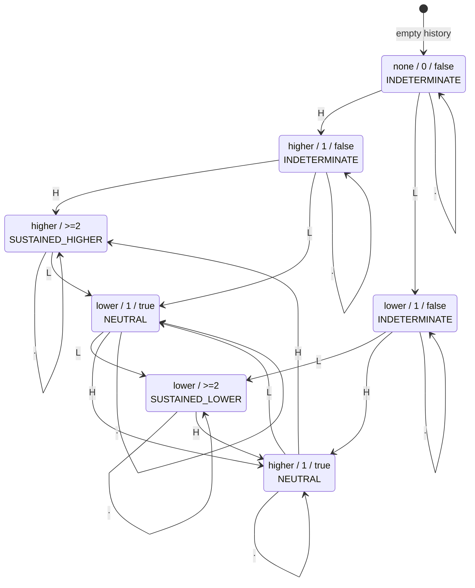

# Trend Foundation v1 — Design

**Status:** Accepted (design)
**Date:** 2026-07-29
**Milestone:** Trend Foundation v1 (Milestone AA)
**Consumes:** `StructuralSequenceStateSnapshot` history — and nothing else
**Depends on:** [ADR-0016](../adr/ADR-0016-structural-sequence-state-history-foundation.md) (Milestone Z1)
**Relates to:** [ADR-0015](../adr/ADR-0015-structural-sequence-state-foundation.md),
[ADR-0014](../adr/ADR-0014-structural-swing-label-foundation.md),
[ADR-0013](../adr/ADR-0013-swing-relationship-foundation.md),
[ADR-0012](../adr/ADR-0012-market-structure-foundation.md),
[ADR-0011](../adr/ADR-0011-evidence-taxonomy.md),
[the architecture review](../reviews/MARKET_STRUCTURE_ARCHITECTURE_REVIEW_V1.md) §13 row C and §15,
[the state-history design](STRUCTURAL_SEQUENCE_STATE_HISTORY_DESIGN_V1.md),
[the state-history review](../reviews/STRUCTURAL_SEQUENCE_STATE_HISTORY_REVIEW_V1.md) §8

---

## 1. Purpose

### 1.1 What this milestone does

It builds the **first deterministic consumer** of the structural sequence state history: a layer that
reads a run of `StructuralSequenceStateSnapshot` objects and reports whether that run contains a
**sustained same-direction structural shift**.

The architecture review named this Milestone C and flagged it as "high risk of embedding interpretation
too early", because *how many swings make a trend* has no objective answer — it is a **policy**, and it
must be shipped as a stated policy rather than as a discovered truth. This design states it, names the
number, exposes it, and records what it excludes.

### 1.2 Why it is the right next milestone

The state-history review §8 recommended it, on three grounds this design confirms:

1. **It needs no new facts.** The state history is sufficient; nothing here requires a candle, a price, a
   level, or a label.
2. **It has no repainting risk**, because it is built on the prefix-stable history rather than on the
   superseded single aggregate (ADR-0015 §8).
3. **It is not break of structure.** BOS needs a "price crossed level L at bar *i*" fact that no layer
   above `detect_swings` can produce (architecture review §15). Trend needs no such fact.

It also respects the ordering the architecture review §15 insisted on: *"Any definition in which trend is
an input to BOS should be rejected on sight."* This layer is a **summary of the state history** and takes
no input from BOS, CHoCH, or any level-crossing concept — none of which exist.

## 2. Non-goals

This layer never does any of the following, and each is enforced by test:

| Forbidden | Why |
|---|---|
| inspect candles | it receives no `CandleSeries`; only its own package's snapshots |
| detect swings | `detect_swings` is not imported |
| compare swings | `compare_swings` / `compare_swing_sequence` are not imported |
| derive labels | `label_swing` / `label_swing_sequence` are not imported |
| derive structural state again | `derive_structural_sequence_state` / `_sequence_state_for` are not called |
| implement BOS | needs a level-crossing fact that does not exist (architecture review §15) |
| implement CHoCH | needs BOS first, and would create the circularity §15 warns about |
| implement support / resistance | a level policy this layer does not state |
| implement protected highs / lows | no swing is marked as protected anywhere |
| implement liquidity concepts | needs a crossing *and* a return, plus a window policy |
| generate trading signals | not a trading layer |
| recommend LONG or SHORT | `SUSTAINED_HIGHER` is not a long |
| predict price | it reads no price at all |
| estimate probabilities | no distribution is defined anywhere in the repository |
| produce confidence scores | a run length is not a confidence |

It additionally does **not** add an `EvidenceDescriptor`, does not touch `EvidenceFamily`, does not
change the evidence catalog, adds no dependency, and changes no existing exception message.

## 3. Terminology

| Term | Meaning here |
|---|---|
| **snapshot** | one `StructuralSequenceStateSnapshot`: the structural state at one candle that changed it |
| **state** | `snapshot.state.state`, a `StructuralSequenceStateType` — one of six members |
| **directional state** | `SHIFTED_HIGHER` or `SHIFTED_LOWER` — the only two states in which *both* structural sides moved the same way in price |
| **non-directional state** | `EXPANDED`, `CONTRACTED`, `UNCHANGED`, `INSUFFICIENT_STRUCTURE` — the other four |
| **shift** | one snapshot whose state is directional |
| **run** | a maximal stretch of same-direction shifts, uninterrupted by an opposing shift |
| **run length** | how many shifts the current run contains |
| **sustained** | run length has reached `MINIMUM_DIRECTIONAL_SHIFTS` |
| **contested** | at some point in the history, a shift opposed the run then current |
| **transparent** | a snapshot that neither advances nor invalidates a run |

"Sustained" is used in the strict sense of *maintained by repetition*: the same directional state occurred
at least twice with no opposing state between. It carries no claim of strength, momentum, durability,
continuation, or likelihood of persisting.

## 4. Domain definition

### 4.1 What "structural trend" is in this repository

> A **structural trend** is a *sustained same-direction structural shift*: at least
> `MINIMUM_DIRECTIONAL_SHIFTS` snapshots whose state is the same directional member, with no opposing
> directional snapshot between them.

Three properties make this the only honest definition available at this layer.

**It uses the only directional evidence that exists.** Of the six `StructuralSequenceStateType` members,
exactly two say both structural sides moved the same way in price: `SHIFTED_HIGHER` and `SHIFTED_LOWER`
(ADR-0015 §2). `EXPANDED` (outward, nothing inward), `CONTRACTED` (inward, nothing outward) and
`UNCHANGED` (nothing moved) are each explicitly **not** directional — that is the whole point of the
outward/inward/static axis the state enum is built on. `INSUFFICIENT_STRUCTURE` says one side does not
exist yet. So a definition of trend that read direction out of `EXPANDED` would be inventing direction
where ADR-0015 §5 says none is present.

**It requires repetition rather than asserting it from one fact.** One `SHIFTED_HIGHER` is a single
already-settled fact about one candle. Calling it a trend renames a fact — precisely the move ADR-0014
and ADR-0015 each refused. Requiring a second occurrence is the smallest step that distinguishes *a fact*
from *a repeated fact*.

**It is a fold over an ordered sequence, so it inherits the history's stability** rather than needing its
own repainting argument (§8).

### 4.2 The threshold is a policy, and it is named

`MINIMUM_DIRECTIONAL_SHIFTS = 2`.

Two is not derived from anything; **no number here can be**. It is chosen as the smallest integer that
expresses repetition, on the reasoning that any larger value is a strictly more arbitrary choice, and
`1` is not a choice about repetition at all — it makes trend a synonym for "the latest directional state",
which §6 rejects as forcing direction.

It is exposed as a **public module constant** so the policy is legible in code and in tests, and it is
deliberately **not a function parameter** (§7.4). Sensitivity was measured over 1,627 non-empty state
sequences (§5.4): `minimum=1` yields a direction in 79% of them, `minimum=2` in 22%, `minimum=3` in 5%.
The threshold materially changes the answer, which is exactly why it is stated rather than buried.

### 4.3 The seventeen questions, answered

| # | Question | Answer |
|---|---|---|
| 1 | What is "structural trend" here? | §4.1 — a sustained same-direction structural shift |
| 2 | What minimum history is required? | `MINIMUM_DIRECTIONAL_SHIFTS` (2) **directional** snapshots in one run. There is no minimum on total snapshot count: 200 non-directional snapshots are still `INDETERMINATE` |
| 3 | How are `INSUFFICIENT_STRUCTURE` snapshots handled? | **transparent** — recorded in the output (one trend snapshot per input snapshot, totality preserved), contributing nothing. Since they form a contiguous prefix (ADR-0016 §5) and are never directional, the trend across them is `INDETERMINATE` |
| 4 | How are `UNCHANGED` states handled? | transparent — neither advances nor invalidates |
| 5 | How are `SHIFTED_HIGHER` states handled? | a **higher shift**: extends a higher run, or invalidates a lower run and starts a higher run of length 1 |
| 6 | How are `SHIFTED_LOWER` states handled? | symmetrically |
| 7 | How are `EXPANDED` states handled? | transparent |
| 8 | How are `CONTRACTED` states handled? | transparent |
| 9 | How are alternating histories handled? | every shift opposes its predecessor, so no run ever reaches 2. Result is `INDETERMINATE` until the first opposition, then `NEUTRAL` forever. Alternation is **ambiguity and is reported as such** |
| 10 | How are mixed histories handled? | non-directional snapshots are skipped; the directional subsequence is folded. A mixed history behaves exactly as its directional subsequence does |
| 11 | When should the result remain **neutral**? | when directional evidence exists **on both sides** (the history is contested) and the current run has not reached the minimum. Evidence exists and conflicts |
| 12 | When should the result remain **indeterminate**? | when there is not yet enough directional evidence to say anything and **nothing has conflicted**: empty input, non-directional-only, insufficient-structure-only, or exactly one shift. Evidence is absent, not contradictory |
| 13 | Is persistence required? | **yes** (§7.2). Once sustained, a trend persists across any number of non-directional snapshots, because none of them is evidence against it |
| 14 | What invalidates an existing trend? | **exactly one opposing directional snapshot** (§7.3), and nothing else. Not time, not duration, not contraction, not expansion |
| 15 | What is the exact prefix-stability guarantee? | §8.1 |
| 16 | What is explicitly outside that guarantee? | §8.3 |
| 17 | What is the minimal public API? | §9 — five names |

## 5. Evaluated alternatives

Four candidate policies were implemented as scratch experiments and measured against the same corpus. The
experiments are not shipped; the corpus construction is reproduced in the test plan (§11).

### 5.1 The candidates

- **A — latest directional state wins** (`minimum = 1`). The most recent `SHIFTED_*` decides; a history
  with no shift is indeterminate.
- **B — majority vote.** Count every `SHIFTED_HIGHER` and every `SHIFTED_LOWER` seen so far; the larger
  count decides, ties neutral.
- **C — strict adjacency.** A run requires `minimum` *adjacent* snapshots that are all directional and
  same-direction; **any** non-directional snapshot resets the run to zero.
- **D — sustained run with transparent non-directional states.** The chosen policy (§7).

### 5.2 The corpus

| Part | Size | What it covers |
|---|---|---|
| named history classes | 13 | empty, monotonic up, monotonic down, alternating, mixed, contains-`UNCHANGED`, contains-`EXPANDED`, contains-`CONTRACTED`, insufficient-prefix, single-shift, established-then-one-opposing, established-then-two-opposing, non-directional-only |
| exhaustive enumeration | 1,555 | every sequence of length 0–4 over all six state members |
| candle-derived | 61 | 60 random 50-bar series (up-, down- and no-drift), half with an engulfing bar every third candle; plus one all-outside-bar series. Each run through `detect_swings` → `compare_swing_sequence` → `label_swing_sequence` → `derive_structural_sequence_state_history` |
| **total** | **1,629** | |

### 5.3 Results

| Candidate | prefix-stable | forces direction on alternating | can express both `NEUTRAL` and `INDETERMINATE` | persists through a neutral snapshot | verdict |
|---|---|---|---|---|---|
| A latest-wins | yes | **yes** | **no** | yes | **rejected** |
| B majority | yes | no | **no** | yes | **rejected** |
| C strict adjacency | yes | no | **no** | **no** | **rejected** |
| D sustained run | yes | no | **yes** | yes | **chosen** |

All four are prefix-stable — that alone does not discriminate, which is why the other three columns
matter.

### 5.4 Threshold sensitivity, measured

Over the 1,627 non-empty sequences, the fraction resolving to a direction:

| `MINIMUM_DIRECTIONAL_SHIFTS` | directional outcomes |
|---|---|
| 1 | 1,286 / 1,627 (79%) |
| 2 | 350 / 1,627 (22%) |
| 3 | 84 / 1,627 (5%) |

## 6. Rejected policies

### 6.1 A — latest directional state wins
**Rejected: forces direction.** On a strictly alternating history `H L H L H L H L` — the canonical
ambiguous input — it reports a direction at every position, flipping each time. It also cannot express
"evidence exists and conflicts": its vocabulary has no `NEUTRAL`, so contested ambiguity is
indistinguishable from a clean single-direction history. That is *hiding ambiguity* twice over, and it
reduces "trend" to a rename of `snapshot.state.state`, adding a directional word to a fact ADR-0015 §5
explicitly says must not carry one.

### 6.2 B — majority vote
**Rejected: double-counts evidence and hides ambiguity.** A shift from 300 snapshots ago is weighted
exactly like the most recent one, so a long-settled run keeps outvoting current opposition: on
`H H L` it still reports `HIGHER`, and on `H H L L` it reports `NEUTRAL` only because the counts tie
arithmetically, not because anything about the structure is balanced. It cannot express `INDETERMINATE`
at all — an empty or wholly non-directional history reads `NEUTRAL`, conflating "no evidence" with
"conflicting evidence". Any fix (a window, a decay, a recency weight) introduces a second arbitrary
parameter with no basis at this layer.

### 6.3 C — strict adjacency
**Rejected: treats a neutral fact as counter-evidence, and so cannot persist.** It resets the run on
`EXPANDED`, `CONTRACTED`, `UNCHANGED` and `INSUFFICIENT_STRUCTURE` alike. Measured: on
`H H E H` it reports `HIGHER → INDETERMINATE`, losing an established trend to a snapshot that says
nothing about direction. This is an interpretation smuggled in as a mechanism — deciding that expansion
*ends* a trend is a market claim of exactly the kind ADR-0015 §5 forbids. It also cannot express
`NEUTRAL`, so it shares A's and B's ambiguity blindness. In real candle-derived histories, where
non-directional states are common, it establishes a trend so rarely that the result is dominated by the
reset rule rather than by structure.

### 6.4 E — derive trend from the structural labels directly
**Rejected: duplicates structural-state logic and re-derives sequencing.** Counting `HIGHER_HIGH` /
`HIGHER_LOW` pairs out of a `StructuralSwing` run would re-implement `_sequence_state_for` and the
outside-bar grouping policy inside the trend layer. That is the duplication ADR-0013 §6, ADR-0014 §6,
ADR-0015 §9 and ADR-0016 §8 each refused, and ADR-0016 exists precisely so this layer does not have to.

### 6.5 F — require a candle or a close confirmation
**Rejected: requires candles.** It would reintroduce a `CandleSeries` dependency above `detect_swings`,
which the architecture review §15 recommends against, and it would make the result repaint on a forming
bar (ADR-0012).

### 6.6 G — define trend via break of structure
**Rejected: requires BOS**, which does not exist and cannot at this layer. It is also the circularity the
architecture review §15 says to reject on sight.

### 6.7 H — a `MIXED` or `AMBIGUOUS` catch-all in addition to `NEUTRAL`
**Rejected: hides ambiguity in a dumping ground.** The four chosen members already partition every case
(§7.5). A fifth would become the place cases quietly accumulate, which is the reasoning ADR-0015 §2 used
against `MIXED`.

### 6.8 I — a decay or timeout rule ("a trend expires after N snapshots")
**Rejected: breaks nothing formally, but invents a second arbitrary parameter** with no basis in any fact
this layer holds, and would make the answer depend on a notion of elapsed structural time the package
does not define. §7.2 keeps persistence unconditional and documents the consequence honestly instead.

### 6.9 J — expose the run length or a strength score
**Rejected: produces a confidence score** in all but name, and invites threshold-shopping downstream. The
run length is an internal accumulator (§7.6).

## 7. Chosen policy

### 7.1 The fold

Process snapshots in input order, carrying three accumulator values: `direction` (the `SHIFTED_*` state
member of the current run, or none), `length` (that run's length), and `contested` (whether any shift has
ever opposed the run then current).

For each snapshot, let `s = snapshot.state.state`:

- **`s` is directional:**
  - no current run → `direction = s`, `length = 1`
  - `s == direction` → `length += 1`
  - `s != direction` → `contested = True`, `direction = s`, `length = 1`
- **`s` is non-directional:** the accumulator is unchanged.

Then classify, in this order:

1. `length >= MINIMUM_DIRECTIONAL_SHIFTS` → `SUSTAINED_HIGHER` / `SUSTAINED_LOWER` per `direction`
2. else `contested` → `NEUTRAL`
3. else → `INDETERMINATE`

### 7.2 Persistence is unconditional
A sustained trend persists through any number of non-directional snapshots. Nothing in `EXPANDED`,
`CONTRACTED`, `UNCHANGED` or `INSUFFICIENT_STRUCTURE` is evidence *against* a direction, so treating any
of them as invalidating would be a market claim.

**The consequence, stated plainly:** a trend established once and followed by 500 contracting snapshots
still reads as sustained. That is a real limitation. It is preferred to the alternative because every
decay rule requires an arbitrary constant this layer has no basis for, and a wrong constant would be
invisible. A consumer that needs recency can read `history[-1].index` and the trend's own snapshots.

### 7.3 Invalidation is exactly one opposing shift
One `SHIFTED_LOWER` invalidates a sustained higher trend immediately: the run restarts at length 1 in the
new direction, and because the history is now contested the result is `NEUTRAL`, not `SUSTAINED_LOWER`.

The alternative — requiring two opposing shifts before releasing the old trend — was rejected because it
would report `SUSTAINED_HIGHER` while the most recent structural fact says both sides moved lower. That is
hiding ambiguity.

### 7.4 `contested` never resets
Once a history has contained an opposition, it is contested forever, so the result can never return to
`INDETERMINATE`. `INDETERMINATE` means *not enough evidence yet*; once conflicting evidence exists that
description is simply false. This also keeps the accumulator monotone, which is what makes the
prefix-stability proof one line (§8.2).

### 7.5 The four members partition every case
| Condition | Member |
|---|---|
| run length ≥ minimum, direction higher | `SUSTAINED_HIGHER` |
| run length ≥ minimum, direction lower | `SUSTAINED_LOWER` |
| run length < minimum, contested | `NEUTRAL` |
| run length < minimum, not contested | `INDETERMINATE` |

Exhaustive and disjoint by construction, so there is no catch-all member (ADR-0015 §2's reasoning).

### 7.6 The accumulator is private
`direction`, `length` and `contested` are internal to the fold and appear on no public type. Exposing
`length` would be a strength score by another name (§6.9); exposing `contested` would expose a fact about
the *whole prefix* on a type that describes one snapshot.

### 7.7 Naming
`SUSTAINED_HIGHER` / `SUSTAINED_LOWER` follow `SHIFTED_HIGHER` / `SHIFTED_LOWER` and name what was
measured: the same shift, repeated. `UPTREND` / `DOWNTREND` / `BULLISH` / `BEARISH` / `LONG` / `SHORT` /
`STRONG` are rejected for ADR-0015 §5's reasons. `ADVANCING_*` was already rejected there. `NEUTRAL`
describes conflicting evidence; `BALANCED` was rejected in ADR-0015 §5 and is rejected again.
`INDETERMINATE` follows `INSUFFICIENT_STRUCTURE` in spirit — the name differs because what is insufficient
here is *directional evidence*, not structure: the structure may be complete at every snapshot.

### 7.8 State diagram

States are written as `direction/length/contested`; `H` and `L` abbreviate `SHIFTED_HIGHER` and
`SHIFTED_LOWER`; `·` is any non-directional state. `length` saturates at the minimum — beyond it, further
same-direction shifts change nothing observable, which is why the machine is finite.



Two properties are visible in the diagram and are tested. `contested` has no outgoing edge back to a
non-contested state, so once `NEUTRAL` or a contested sustained state is reachable, `INDETERMINATE` never
is again (§7.4). And every state has a `·` self-loop, which *is* the persistence rule (§7.2).

### 7.9 Transition tables

**Accumulator transition** — the complete step function. Rows are the current accumulator, columns the
incoming state.

| accumulator | `SHIFTED_HIGHER` | `SHIFTED_LOWER` | `EXPANDED` / `CONTRACTED` / `UNCHANGED` / `INSUFFICIENT_STRUCTURE` |
|---|---|---|---|
| none / 0 / `false` | higher / 1 / `false` | lower / 1 / `false` | unchanged |
| higher / *n* / *c* | higher / *n+1* / *c* | lower / 1 / **`true`** | unchanged |
| lower / *n* / *c* | higher / 1 / **`true`** | lower / *n+1* / *c* | unchanged |

**Result transition** — the observable trend before and after one snapshot, at
`MINIMUM_DIRECTIONAL_SHIFTS = 2`. Where a result depends on the hidden accumulator, both cases are shown.

| before | `SHIFTED_HIGHER` | `SHIFTED_LOWER` | non-directional |
|---|---|---|---|
| `INDETERMINATE` (length 0) | `INDETERMINATE` | `INDETERMINATE` | `INDETERMINATE` |
| `INDETERMINATE` (length 1, higher) | `SUSTAINED_HIGHER` | `NEUTRAL` | `INDETERMINATE` |
| `INDETERMINATE` (length 1, lower) | `NEUTRAL` | `SUSTAINED_LOWER` | `INDETERMINATE` |
| `SUSTAINED_HIGHER` | `SUSTAINED_HIGHER` | `NEUTRAL` | `SUSTAINED_HIGHER` |
| `SUSTAINED_LOWER` | `NEUTRAL` | `SUSTAINED_LOWER` | `SUSTAINED_LOWER` |
| `NEUTRAL` (length 1, higher) | `SUSTAINED_HIGHER` | `NEUTRAL` | `NEUTRAL` |
| `NEUTRAL` (length 1, lower) | `NEUTRAL` | `SUSTAINED_LOWER` | `NEUTRAL` |

All 36 ordered pairs of `StructuralSequenceStateType` remain legal inputs; this layer asserts nothing about
which are significant (ADR-0016 §9), it only folds them.

### 7.10 Invariants

| # | Invariant | Enforced by |
|---|---|---|
| I1 | exactly one output snapshot per input snapshot, in input order | derivation; totality test |
| I2 | output element *j* depends only on input `0..j` | left fold; prefix-stability tests |
| I3 | `contested` is monotone — never returns to `false` | step function; test on `H L H` |
| I4 | a non-directional state never changes the result | step function; persistence tests |
| I5 | a direction is reported only when run length ≥ minimum | classification order |
| I6 | `INDETERMINATE` is reported only when the history has never been contested | classification order; test |
| I7 | the input is never mutated, sorted, or re-ordered | no mutation in code; AST guard on `sorted`; identity tests |
| I8 | `state_snapshot` is carried by identity, never copied | derivation; identity test |
| I9 | ordering is validated in full before any output is built | validation precedes the fold; no-partial-output test |
| I10 | `derive_structural_trend(h) == derive_structural_trend_history(h)[-1].trend` for non-empty `h` | shared step/classify; equivalence contract |
| I11 | every model is frozen, slotted and hashable | dataclass declaration; immutability tests |
| I12 | no candle, price, swing, comparison or label is ever read | AST guards |

## 8. Prefix-stability analysis

### 8.1 The exact guarantee

> For any snapshot history `h` and any `k` in `0..len(h)`:
>
> ```
> derive_structural_trend_history(h[:k]) == derive_structural_trend_history(h)[:k]
> derive_structural_trend(h[:k])         == derive_structural_trend_history(h)[k-1].trend   (k >= 1)
> ```
>
> Composed with ADR-0016 §6, the trend history is therefore prefix-stable under **candle-series
> extension** and under **complete structural-group extension**: appending later candles, or later whole
> same-candle groups, never alters a trend snapshot already produced.

### 8.2 The proof

The derivation is a left fold whose step function reads only the accumulator and the current snapshot's
state, and whose classification is a pure function of the accumulator. So the output at position *j*
depends on `h[0..j]` and on nothing at or after *j+1*. Element *j* of the output for `h` and for any
prefix `h[:k]` with `k > j` is therefore the same value. ∎

Composition: ADR-0016 §6 gives that `h` itself is prefix-stable under the two extension modes, so a longer
candle series or a further complete group yields a history whose first `len(h)` snapshots are exactly `h`;
by the paragraph above the trend history over it agrees on those positions.

### 8.3 What is explicitly outside the guarantee

1. **An arbitrary cut inside a same-candle HIGH/LOW group.** Inherited verbatim from ADR-0016 §7 and not
   weakened or repaired here. Taking the HIGH of an outside bar without its LOW yields a different — and
   correct — state for that candle, which can change the trend at and after that position. **Measured: 133
   divergences across 891 split outside-bar groups (15%).** It cannot arise from candle growth and is not
   detectable, exactly as ADR-0016 §7 records.
2. **Re-parameterised detection.** Changing `left_bars` / `right_bars` produces a different swing run and
   therefore a different history; nothing is claimed across two different detection parameterisations.
3. **A different `MINIMUM_DIRECTIONAL_SHIFTS`.** The guarantee is per-threshold. Two histories derived
   under different thresholds are not comparable, which is one more reason the threshold is a constant
   rather than a parameter (§7.4).
4. **Stability of the *value* under extension.** Prefix stability says an *already-emitted* trend snapshot
   never changes. It emphatically does **not** say the trend keeps its value: a further snapshot may
   invalidate a sustained trend, and that is the policy working (§7.3), not instability.
5. **Anything about a forming candle.** Inherited from ADR-0012; the history never contains one.

### 8.4 Measured evidence

| Mode | Checked | Violations |
|---|---|---|
| candle-series extension (40 series × every bar prefix) | 2,000 prefixes | **0** |
| complete structural-group extension (40 series × every group prefix) | 739 prefixes | **0** |
| exhaustive + named + candle-derived sequence corpus (§5.2) | 1,629 sequences, all prefixes | **0** |
| arbitrary inside-group cut (**excluded** by §8.3) | 891 splits | 133 — expected |

## 9. Deterministic replay contract

- **Pure.** No I/O, no clock, no randomness, no global mutable state, no caching.
- **Input is never mutated or sorted.** The input iterable is materialised once into a tuple; no element
  is touched. Order is **validated, never repaired** (ADR-0013 §5, unchanged).
- **Same input, same output, always.** Two calls on equal input return equal results. As in ADR-0016,
  results are rebuilt per call, so they compare `==` but are not `is`; tests assert `==`.
- **Identity carry-forward.** A trend snapshot holds the *same* `StructuralSequenceStateSnapshot` object
  it was given, by identity, never a copy.
- **Totality.** Exactly one output snapshot per input snapshot, in input order. Empty input yields `()`
  from the history form and `INDETERMINATE` from the scalar form — the two correctly differ in shape, as
  in ADR-0016 §10.

## 10. API proposal

### 10.1 Location — a sibling package

**`fmis.structural_trend`**, a new top-level package importing only `fmis.market_structure`.

Three placements were considered:

| Placement | Verdict |
|---|---|
| inside `fmis.market_structure` | **rejected.** ADR-0016 §12 states trend is not this package's job, and the package's own architecture test forbids the token `trend` anywhere in its code. Adding it would require weakening a guard that exists to hold exactly this line |
| `fmis.features.trend` (Tier-2) | **rejected.** A tuple of `StructuralTrendSnapshot` dataclasses is not a `FeatureValue`, so it cannot be a `FeatureResult.value` without being flattened into dictionaries — the reasoning ADR-0012 used to make `market_structure` a package. That placeholder stays for indicator-derived trend features |
| a new sibling package | **chosen.** It matches the architecture review §15 recommendation, and keeps `market_structure`'s property that only its first stage touches candles and that it contains no interpretation |

### 10.2 The public API — five names

```python
# fmis/structural_trend/__init__.py
MINIMUM_DIRECTIONAL_SHIFTS: int                 # == 2, the stated policy

class StructuralTrendType(str, Enum):
    SUSTAINED_HIGHER = "sustained_higher"
    SUSTAINED_LOWER  = "sustained_lower"
    NEUTRAL          = "neutral"
    INDETERMINATE    = "indeterminate"

@dataclass(frozen=True, slots=True)
class StructuralTrendSnapshot:
    trend: StructuralTrendType
    state_snapshot: StructuralSequenceStateSnapshot
    @property
    def index(self) -> int: ...
    @property
    def timestamp(self) -> datetime: ...

def derive_structural_trend(
    snapshots: Iterable[StructuralSequenceStateSnapshot],
) -> StructuralTrendType: ...

def derive_structural_trend_history(
    snapshots: Iterable[StructuralSequenceStateSnapshot],
) -> tuple[StructuralTrendSnapshot, ...]: ...
```

### 10.3 Why the snapshot type holds the state snapshot whole
`state_snapshot` is embedded by reference, not flattened. It already validates its own fields
(ADR-0016 §3), so re-exposing `state` / `triggers` here would create a second place for them to disagree —
the hazard ADR-0014 §5 removed. `index` and `timestamp` are `@property` projections delegating to it, for
ADR-0016 §4's reasons.

### 10.4 What this type deliberately cannot validate — stated honestly
`StructuralSwing.label` and `StructuralSequenceState.state` are each validated against the object's own
other fields. `StructuralTrendSnapshot.trend` **cannot be**, because a trend is a property of the whole
prefix, not of one snapshot: the same snapshot legitimately carries a different trend depending on what
preceded it. So this type validates **types only**, and the correctness of `trend` is a property of the
derivation, tested there. Claiming a validation that cannot exist would be worse than recording its
absence.

### 10.5 Why both a scalar and a history form
ADR-0016 §10's reasoning applies unchanged: making the cheap "what is it now" query allocate an entire
history is a real cost for the most common call. The risk of two paths is that they disagree, so both call
the **same private step and classify functions** — there is exactly one rule, not two implementations —
and an equivalence contract is tested for every valid input.

### 10.6 Ordering validation — a distinct rule, deliberately not the shared one
The input is a run of snapshots, and the rule is: `index` **strictly** increasing, `timestamp` strictly
increasing with it. Validated, never repaired.

`market_structure.models._validate_key_order` is deliberately **not** reused. It is private to another
package, and its rule is genuinely different: it permits a *non-decreasing* index because one outside bar
yields two swings at one index, with strictness only within a `SwingType`. A snapshot history has already
collapsed those groups, so it has exactly one entry per index and strictness is global — and there is no
`SwingType` to be strict within. Reusing the looser rule would accept a snapshot history with two entries
at one index, which `derive_structural_sequence_state_history` can never produce. This is a different rule
over a different element type, not a second copy of one rule.

## 11. Implementation plan

### 11.1 Production — one new package, three files

| File | Contents |
|---|---|
| `src/fmis/structural_trend/__init__.py` | package docstring stating the policy and the non-goals; re-exports; `__all__` of five names |
| `src/fmis/structural_trend/models.py` | `StructuralTrendType`, `MINIMUM_DIRECTIONAL_SHIFTS`, `StructuralTrendSnapshot`, and the private authorities: `_TREND_BY_DIRECTIONAL_STATE` (a `MappingProxyType` of the two directional states to their sustained members), `_is_directional_state`, `_validate_snapshot_history_order` |
| `src/fmis/structural_trend/trend.py` | `derive_structural_trend`, `derive_structural_trend_history`, and the private `_Run` accumulator with `_advance` / `_classify` |

No existing production file changes. No `pyproject.toml` change is needed — `setuptools.packages.find`
discovers the new package automatically (to be verified, not assumed).

### 11.2 One authoritative rule per concept
- direction of a shift → `models._TREND_BY_DIRECTIONAL_STATE`, written cell by cell, `MappingProxyType`,
  private, following `_STATE_BY_LABEL_PAIR` (ADR-0015 §10)
- the fold step → `trend._advance`, called by both public functions
- the classification → `trend._classify`, called by both public functions
- ordering → `models._validate_snapshot_history_order`

### 11.3 Immutability
Every model frozen and slotted. Both public functions return immutable values. No list, dict or set is
ever returned or exported.

## 12. Testing plan

One new module, `tests/test_structural_trend.py`.

| Group | What it pins |
|---|---|
| model construction | frozen, slotted, hashable, field set exactly two, type rejections, `index`/`timestamp` projections delegate to the state snapshot, no stored index/timestamp field |
| empty history | `()` and `INDETERMINATE`, both forms |
| insufficient history | one shift → `INDETERMINATE`; non-directional-only → `INDETERMINATE`; insufficient-structure-only → `INDETERMINATE` |
| minimum valid history | exactly two same-direction shifts → sustained; one fewer → not |
| upward / downward histories | monotonic runs of each, both scalar and history forms |
| mixed histories | directional subsequence equivalence: a mixed history yields the same trend sequence as its directional subsequence, at the corresponding positions |
| alternating histories | `INDETERMINATE` then `NEUTRAL` forever; never a direction |
| unchanged / expanded / contracted continuation | a sustained trend survives each, individually and in combination, at length 1 and at length 50 |
| persistence | 500 non-directional snapshots after a sustained trend do not change it |
| invalidation | one opposing shift → `NEUTRAL`; two → sustained in the new direction; and the released trend does not return without new evidence |
| deterministic replay | equal results across repeated calls; input not mutated, not sorted, elements identical by identity |
| immutability | `FrozenInstanceError` on assignment; returned tuple; `state_snapshot` carried by identity |
| invalid ordering | decreasing index, decreasing timestamp, repeated index, index/timestamp disagreement — each rejected, with no partial output |
| outside-bar preservation | a history built from engulfing bars yields one trend snapshot per state snapshot, and the trend at the outside bar reflects the atomically-resolved state; both trigger orders give the same trend history |
| prefix stability | all three modes of §8.4, including the **excluded** inside-group cut, which is pinned as a documented divergence exactly as ADR-0016's tests pin theirs |
| arbitrary inside-group limitation | the divergence is asserted to exist, so the limitation cannot be silently "fixed" into a false guarantee |
| generated matrices | exhaustive state sequences of length 0–4 (1,555 cases) against an independent oracle that recomputes the trend by a different method (scan-from-the-right for the last opposition) rather than by the production fold |
| candle-derived property tests | random seeded series through the full four-stage pipeline; totality, prefix stability, equivalence of the two forms |
| export contracts | `__all__` is exactly the five names; no submodule collides; no mutable public object |
| private helper visibility | `_advance`, `_classify`, `_Run`, `_TREND_BY_DIRECTIONAL_STATE`, `_is_directional_state`, `_validate_snapshot_history_order` are not exported and not attributes of the package |
| `EvidenceFamily` unchanged | `MARKET_STRUCTURE` still empty |
| evidence catalog unchanged | still exactly 6 descriptors |
| architecture guards | imports only `fmis.market_structure` and own modules; never `fmis.data`, `fmis.decision_support`, `fmis.evidence`, `fmis.providers`, `fmis.pipeline`, `fmis.ingest`, `fmis.trading_context`, `fmis.relative_value`, `fmis.features`; stdlib only; forbidden-vocabulary AST scan (`bos`, `choch`, `bullish`, `bearish`, `support`, `resistance`, `liquidity`, `sweep`, `strength`, `confidence`, `score`, `buy`, `sell`, `signal`, `long`, `short`, `probability`, `predict`, `forecast`, `uptrend`, `downtrend`, `regime`, `bias`, …); no candle field is ever read; `detect_swings` / `compare_swings` / `label_swing*` / `derive_structural_sequence_state*` / `_sequence_state_for` are never called; `sorted` is never called |
| market_structure untouched | its 19 exports and its full suite unchanged |

### 12.1 Mutation probes
Nine, each applied to production source, confirmed to be a **real** change (not a no-op), the suite run,
and the source restored byte-exactly:

forced upward · forced downward · ignored ambiguity (`NEUTRAL` folded into `INDETERMINATE`) · ignored
persistence (non-directional resets the run) · removed invalidation (opposing shift does not reset) ·
removed ordering validation · broken prefix stability (classification reads the whole run) · broken
outside-bar handling (per-trigger instead of per-snapshot) · duplicated structural-state logic (re-derive
the state locally).

The state-history review §P3-2 recorded that two of its own first probes were no-ops. That is treated as a
method requirement here: every probe is diffed and its live effect confirmed before the suite is run, and
any probe that turns out to be a no-op is rejected and replaced.

## 13. Risks

| # | Risk | Severity | Mitigation |
|---|---|---|---|
| 1 | The threshold `2` is read as objective | high | named constant, §4.2 states it is a policy, sensitivity measured, ADR records it |
| 2 | `SUSTAINED_HIGHER` read as "go long" | high | §7.7 naming, the non-goal table, the forbidden-vocabulary AST test, docstrings that say it explicitly |
| 3 | Unconditional persistence produces a stale trend | medium | §7.2 states the limitation plainly rather than adding an arbitrary decay; ADR records it as a consequence |
| 4 | A future consumer treats `NEUTRAL` and `INDETERMINATE` as interchangeable | medium | four-member partition table, distinct docstrings, tests that pin the difference on the exact inputs that separate them |
| 5 | Someone "fixes" the inside-group limitation into a false guarantee | medium | a test pins the divergence, following ADR-0016's precedent |
| 6 | The two API forms drift apart | medium | one shared private step and classify; equivalence contract tested over the whole corpus |
| 7 | A later layer re-derives sequencing instead of consuming this | low | this layer exists so it need not; recorded in the ADR's extension boundaries |
| 8 | Placement in `market_structure` is attempted later | low | §10.1 records the three-way decision and the guard that enforces it |

## 14. Future extension boundaries

**This layer may later grow** (each needing its own decision record): a bar-indexed projection joined on
`index` or `timestamp`; a multi-timeframe envelope, joining on **timestamp only**, never on index
(architecture review §16); an incremental adapter *above* these functions if walk-forward recomputation
ever becomes hot — and not speculatively (architecture review §12).

**This layer must never grow:** a direction on a non-directional state; a confidence, score, strength or
rank; a duration or decay rule; a `CandleSeries` parameter; BOS, CHoCH, support, resistance, protected
levels, liquidity or sweep; a trading signal, a LONG/SHORT recommendation, a price prediction or a
probability; an `EvidenceDescriptor` — nothing here classifies in ADR-0011 §1's sense.

**And the ordering the architecture review §15 fixed stands:** BOS is defined purely on levels, CHoCH over
the BOS sequence, and **trend is never an input to either**. This layer consumes the state history and
defines nothing for anyone else to depend on directionally.
