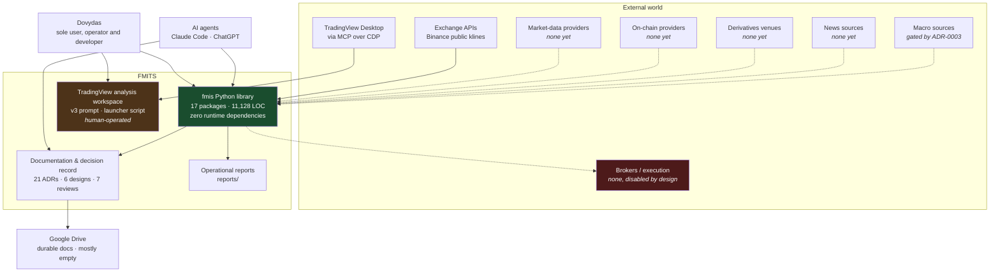
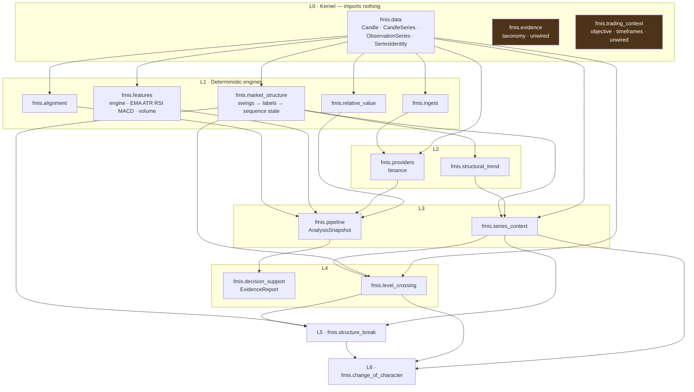
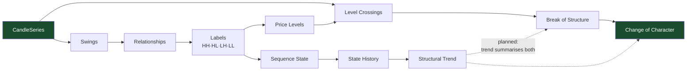
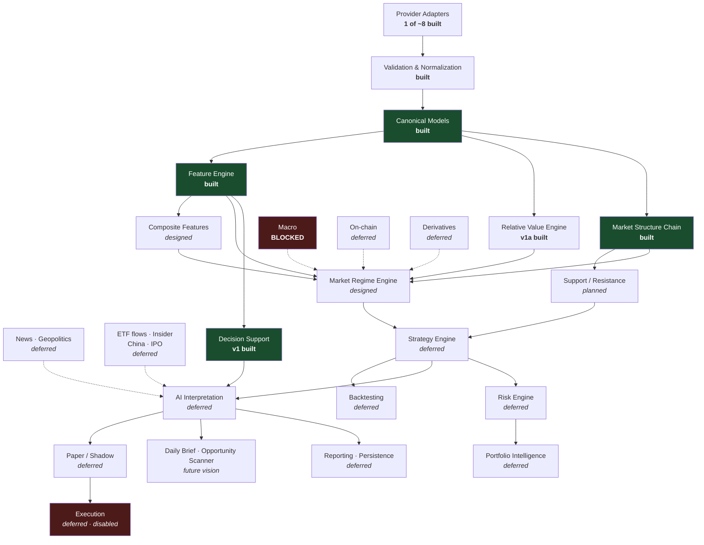

# FMITS Master Map V1

| Field | Value |
|---|---|
| **Report number** | 0002 |
| **Title** | FMITS Master Map V1 |
| **Date** | 2026-07-31 |
| **Report type** | Master Map |
| **Model** | Claude Opus 5 |
| **Repository branch** | `main` |
| **Audited commit** | `d132cea` |
| **Status** | Final |

**What this document is.** The definitive high-level map of the Financial Market Intelligence &
Trading System — what it is, why it exists, every domain in its scope, how those domains connect,
what is built, what is planned, and what is deliberately excluded.

**What this document is not.** Not an implementation design, not an architecture review, not a
roadmap, not authorization to build anything. It describes *what the system is*, not *how to build
the next piece*.

**Reading it cold.** A senior engineer who reads only this document should be able to hold the whole
project in their head. Everything here is traceable to a source; §2.3 states the sourcing rules and
§17 separates my own recommendations from the project's actual vision.

---

## Table of contents

1. [Mission](#1-mission)
2. [Source material and provenance rules](#2-source-material-and-provenance-rules)
3. [Core philosophy](#3-core-philosophy)
4. [Project principles](#4-project-principles)
5. [High-level product vision](#5-high-level-product-vision)
6. [High-level system context](#6-high-level-system-context)
7. [Complete domain map](#7-complete-domain-map)
8. [System map](#8-system-map)
9. [Current state map](#9-current-state-map)
10. [Product map](#10-product-map)
11. [Data map](#11-data-map)
12. [User journey map](#12-user-journey-map)
13. [Visual master map](#13-visual-master-map)
14. [Boundaries](#14-boundaries)
15. [The central tension](#15-the-central-tension)
16. [Open questions](#16-open-questions)
17. [Independent Architect Recommendations](#17-independent-architect-recommendations)

---

## 1. Mission

FMITS is a **personal AI financial intelligence platform** — a modular, deterministic-first system
whose purpose is to improve the *quality, consistency, transparency, and testability* of one
person's financial-market decisions.

Stated in the project's own words:

> The goal is not to build only a trading bot. The goal is to build a personal AI Financial
> Intelligence Platform that becomes my daily operating system for investing, market research, AI
> learning, portfolio management and eventually carefully controlled automation.
> — `PROJECT_VISION_ADDENDUM_V1.md`

> The ultimate objective is not to predict every market move. The objective is to build a disciplined
> decision-support system that improves the quality, consistency, transparency, and testability of
> financial-market decisions.
> — `PROJECT_SPECIFICATION_V1.md` §25

### Why it exists

Three reasons, all explicit in the vision documents:

1. **Decision quality.** Replace ad-hoc, emotional, bias-prone market judgment with structured
   evidence, explicit uncertainty, and a record that can be measured after the fact.
2. **Capital preservation.** `WAIT` and `NO TRADE` are first-class successful outcomes. Risk control
   outranks impressive-looking signals.
3. **Personal transformation.** *"This project exists to transition from physical work toward
   knowledge-based work by mastering AI, software, automation and financial markets."*
   (`PROJECT_VISION_ADDENDUM_V1.md`) — the system is simultaneously the product and the curriculum.

### The problems it solves

| Problem | How FMITS addresses it |
|---|---|
| AI eyeballing values a computer can calculate exactly | Deterministic computation first; AI never produces the facts |
| Indicators read as binary rules (`RSI < 30 = buy`) | Contextual, multi-dimensional interpretation; thresholds are parameters, never verdicts |
| Correlated indicators counted as independent confirmations | Evidence grouped into families; confidence from *diversity*, not count |
| Systematic directional bias | Both directions scored on every analysis; strongest opposing case constructed before any recommendation |
| Analysis that cannot be checked later | Reproducible, immutable, provenance-carrying results; non-repainting by construction |
| Opaque single-agent "do everything" AI | Small, tested, independently reviewable modules with one-way dependencies |
| Vendor lock-in | Every external service is a replaceable adapter |

### The named failure this project was built to avoid

`docs/analysis-notes.md` records the v2 → v3 post-mortem: the v2 swing prompt produced LONG
recommendations almost always, from *six* interacting structural causes — a trend gate that handed
longs two free confirmations, bullish-only tool definitions, a regime gate that locked shorts behind a
rare condition, no NO-TRADE option, and order anchoring. **This is the origin story of the entire
deterministic architecture.** Every principle in §4 traces back to it.

---

## 2. Source material and provenance rules

### 2.1 Sources reviewed

**Repository — 100 % of project documentation and source, at `d132cea`:**

| Source | Extent |
|---|---|
| `PROJECT_SPECIFICATION_V1.md` | 986 lines — read in full (authoritative vision) |
| `PROJECT_VISION_ADDENDUM_V1.md` | 101 lines — read in full (authoritative vision) |
| `README.md`, `docs/README.md`, `docs/SETUP.md` | read in full |
| `docs/ARCHITECTURE_AND_ROADMAP_V1.md` | 860 lines — read in full |
| `docs/ARCHITECTURE_REVIEW_2026-07-24.md` | 434 lines — findings R1–R14 |
| `docs/AI_HANDOFF/CURRENT_STATE.md` | 751 lines — milestone history, maturity |
| `docs/AI_HANDOFF/START_HERE_FOR_AI.md` | 280 lines |
| `docs/REPOSITORY_MAP.md` | 717 lines |
| `docs/RVE_DESIGN_V1.md`, `docs/CURRENT_SYSTEM_AUDIT_V1.md`, `docs/analysis-notes.md` | read |
| `docs/adr/ADR-0001` … `ADR-0021` | 21 ADRs — all titles + contents surveyed |
| `docs/design/*.md` | 6 design documents |
| `docs/reviews/*.md` | 7 independent review records |
| `prompts/swing-trading-analyzer-v3.md` | 199 lines — the live analysis prompt |
| `src/fmis/**` | 74 modules, 11,128 LOC — import graph extracted |
| `tests/**` | 32 modules, 3,221 tests |
| `pyproject.toml`, `.env.example`, `config/mcp.json.example`, `scripts/tradingview-launcher.sh` | read |
| `reports/0001_2026-07-31_REPOSITORY_AUDIT.md` | this project's repository audit |

**Google Drive — searched and enumerated:**

Folder `Financial Market Intelligence & Trading System` contains `00_Projekt_Documentation`,
`01_architecture`, `02_Research`, `03_Strategies`, `04_Backtests`, `05_Data`, `06_Reports`.
Only `00_Projekt_Documentation` has content: copies of `PROJECT_SPECIFICATION_V1.md` and
`PROJECT_VISION_ADDENDUM_V1.md` (identical to the repository versions) plus one unrelated personal
file. **The other six folders are empty.** The Drive structure anticipated by
`PROJECT_SPECIFICATION_V1.md` §21 exists as folders but holds no durable research, strategy,
backtest, data, or report artifacts yet.

### 2.2 Sources named in the mission brief that do not exist

Searched the full repository (all Markdown, all file types) and Google Drive by title and full text:

| Requested source | Result |
|---|---|
| `MASTER_PROJECT_CONTEXT` | **Not found** — no repository file, no Drive file, no full-text match |
| `MASTER_PROJECT_CONTEXT_TRANSFER` | **Not found** — same |
| "Financial OS Vision" | **Not found** — no document by this or a similar name. The *concept* appears as prose in `PROJECT_SPECIFICATION_V1.md` §1 ("personal financial-market operating environment") and in the addendum ("daily operating system"), but no separate document exists |

Nothing in this map is derived from those three. If they exist outside the repository and Drive, this
map should be re-reconciled against them.

### 2.3 Provenance rules used throughout

Every domain and product below carries a **Source** tag. This is the single most important
convention in this document, because the mission brief listed several domains that appear nowhere in
the project's approved vision, and silently absorbing them would have invented vision.

| Tag | Meaning |
|---|---|
| **`SPEC`** | Stated in `PROJECT_SPECIFICATION_V1.md` — authoritative vision |
| **`ADDENDUM`** | Stated in `PROJECT_VISION_ADDENDUM_V1.md` — authoritative vision |
| **`REPO`** | Exists as working, tested code in the repository — authoritative implementation |
| **`ARCH`** | Proposed in `ARCHITECTURE_AND_ROADMAP_V1.md` / an ADR / a design doc — proposal status, explicitly *not* authorization |
| **`BRIEF`** | Named only in the mission brief that requested this map. **No basis in any approved project document.** Recorded so the gap is visible; treated as a candidate, not as vision. Discussed in §17 |

---

## 3. Core philosophy

### 3.1 The pipeline — the single most important sentence in the project

```
Data → Deterministic calculations → Structured features → AI interpretation → Decision support
```

`PROJECT_SPECIFICATION_V1.md` §3.2. Every architectural decision in the repository follows from it.

### 3.2 Deterministic computation first

> Whenever a value can be calculated objectively, code should calculate it. AI should not be asked to
> visually guess values that code can calculate precisely. — `SPEC` §3.1

### 3.3 AI interpretation second, and never first

AI is reserved for combining signals, identifying conflicting evidence, interpreting regime, framing
scenarios, explaining mechanisms, and expressing uncertainty. It **consumes** facts and never
produces them. Because AI output is non-deterministic, it is never stored as a deterministic result
(`ARCH` §4.16).

### 3.4 Observation → Interpretation → Scenario → Decision

The four stages must remain explicitly separated (`SPEC` §6). Collapsing them is how a measurement
silently becomes a recommendation.

### 3.5 No black-box dependency

> The system should not depend on one AI model, one data provider, one broker, one exchange, or one
> MCP server. TradingView MCP is useful, but it should not become the permanent core. — `SPEC` §3.3

### 3.6 Build one reliable layer at a time

> **Small working module → Test → Review → Document → Commit → Next module** — `SPEC` §26

This is not aspirational. The repository has executed it 30+ times, with a
`design/ → feature/ → review/` branch triple per milestone and an ADR per decision.

---

## 4. Project principles

Fourteen architectural principles from `ARCH` §3, extending `SPEC` §3–§4. All are enforced in code
and tests today.

| # | Principle | Enforcement in the repository |
|---|---|---|
| 1 | Deterministic computation vs AI interpretation | No AI code exists in `src/`; `FeatureCategory` is technical-only and test-enforced |
| 2 | Immutability where practical | Frozen dataclasses throughout; `MappingProxyType` for exposed mappings |
| 3 | Closed-candle calculations | Enforced redundantly at engine *and* feature level, idempotently |
| 4 | Explicit warm-up requirements | Every indicator documents its minimum bars; below it, an explicit insufficient-data state |
| 5 | Reproducibility | Pure arithmetic; no wall-clock, no randomness, no ambient state |
| 6 | Testability | Expected values hand-calculated or from independent references — never from the implementation under test |
| 7 | Version-controlled strategies | Thresholds are versioned artifacts, not scattered literals |
| 8 | Provider/adapter isolation | `fmis.providers.binance` constructs canonical models; canonical models import nothing |
| 9 | Data provenance | Every result records module, parameters, observation count, caveats |
| 10 | Uncertainty representation | Insufficient data, staleness, alignment loss represented explicitly, never smoothed away |
| 11 | No hidden signal generation in low-level features | An indicator returns a number, never "bullish" |
| 12 | No premature execution automation | No execution code exists |
| 13 | Avoid double-counting correlated evidence | `fmis.evidence` families exist precisely for this |
| 14 | Alignment separate from mathematics | `fmis.alignment` is its own package (ADR-0002) |

### 4.1 Additional principles from the vision documents

- **Capital preservation comes first** (`ADDENDUM`).
- **AI explains WHY, not only WHAT** (`ADDENDUM`).
- **Every decision is based on probabilities, not certainty** (`ADDENDUM`).
- **No single signal makes a decision** (`ADDENDUM`).
- **2 % portfolio risk per trade is a hard ceiling, not a default target** (`SPEC` §8.1).
- **Leverage does not create an edge** (`SPEC` §8.3).
- **Correlation does not imply causation**; BTC/M2 must not be treated as a stable causal law
  (`ARCH` §7.5).
- **Backtests must be treated skeptically** — never judged on total return alone (`SPEC` §18).
- **Long-term investing and short-term trading are separate domains** (`SPEC` §9, ADR-0009).
- **Major vision changes create new versions rather than overwriting history** (`SPEC` §21).

---

## 5. High-level product vision

The mature system, per `SPEC` §24 and the `ADDENDUM`, provides six product capabilities:

| Capability | What it delivers |
|---|---|
| **Daily Intelligence Brief** | 5–10 minutes: what happened overnight, why, what matters tomorrow, swing ideas, long-term ideas, portfolio risks, China / crypto / ETF-flow / on-chain updates |
| **Opportunity Scanner** | Ranked long-term investments, swing trades, and later short-term trades; continuously scanning IPOs, new ETFs, startups, M&A, insider buying, institutional activity, sector rotation |
| **Asset Research** | Structured research for a selected crypto, stock, sector, commodity, or market |
| **Portfolio Intelligence** | Exposure, concentration, correlations, risks, catalysts, upcoming events |
| **Strategy Laboratory** | Rule design, backtesting, comparison, versioning, paper trading |
| **Controlled Execution** | Only after extensive validation, with strict risk controls — the last stop, not the goal |

### 5.1 The automation ladder

The single non-negotiable sequence governing anything that touches capital (`SPEC` §11,
`ADDENDUM`):

```
Research → Explicit rules → Historical backtesting → Robustness testing
        → Paper trading → Shadow mode → Small controlled live testing → Gradual scaling
```

> No strategy should move directly from an AI idea to live capital. — `SPEC` §11

**Current position on this ladder: step 1 (Research).** Nothing has reached explicit versioned
rules in code.

---

## 6. High-level system context



Solid arrows are live paths. Dotted arrows are planned or deferred.

**Actors.** There is exactly one human: Dovydas, who is simultaneously the sole user, the operator,
and the developer. `SPEC` §19 assigns AI roles explicitly — ChatGPT for architecture, planning,
research, methodology and review; Claude Code (or another coding agent) for repository inspection,
implementation, tests, debugging and refactoring. **Coding-agent output must be reviewed; no
AI-generated code is assumed correct merely because it runs.**

**The two halves do not touch.** The `fmis` library and the TradingView workspace share no code.
`REPOSITORY_MAP.md` states this must remain true; §15 examines what it costs.

---

## 7. Complete domain map

**70 domains across 7 groups.** Each carries Purpose, Responsibilities, Inputs, Outputs,
Dependencies, Future expansion, Current maturity, and Source (per §2.3).

---

### Group A — Data & Platform Foundation

#### D-01 · Canonical Market Data Models — `Implemented` · `SPEC` `ARCH` `REPO`
- **Purpose:** the kernel vocabulary every other layer speaks. One definition of a candle, a series, an observation.
- **Responsibilities:** `Candle`, `CandleSeries`, `ObservationSeries`, `SeriesIdentity`, `CandleField`, canonical UTC contract (ADR-0001), candle→observation reduction, closed-candle semantics.
- **Inputs:** validated primitive values from the ingestion boundary.
- **Outputs:** immutable, validated, strictly-ordered canonical objects.
- **Dependencies:** none — imports nothing internal. This is deliberate and verified.
- **Future expansion:** availability-time dimension (D-06); money/portfolio numeric types need their own ADR (review R11) and are explicitly *not* inherited from the market-data `float` choice.
- **Where:** `src/fmis/data/` — 521 LOC, 96 % covered.

#### D-02 · Ingestion Boundary — `Implemented` · `ARCH` `REPO`
- **Purpose:** the one place where untrusted external records become canonical objects, strictly and without repair.
- **Responsibilities:** strict decoding of record mappings; reject unknown fields, wrong types, missing keys. **No silent repair, ever** (ADR-0005).
- **Inputs:** provider-shaped record mappings.
- **Outputs:** canonical `CandleSeries`, or an explicit error.
- **Dependencies:** `fmis.data`.
- **Future expansion:** decoders for observation series, macro records, order/fill records.
- **Where:** `src/fmis/ingest/` — 333 LOC.

#### D-03 · Provider Adapters — `Implemented (one provider)` · `SPEC` `ARCH` `REPO`
- **Purpose:** isolate every external service behind a replaceable adapter so no provider type reaches the domain.
- **Responsibilities:** transport, pagination, retries, rate limits, provider quirks, unit conversion, provider→canonical mapping (ADR-0006).
- **Inputs:** provider requests and credentials.
- **Outputs:** canonical series.
- **Dependencies:** `fmis.data`, `fmis.ingest`. Canonical models never import providers.
- **Future expansion:** TradingView ingestion (the highest-value missing adapter — see §15), additional exchanges, macro, on-chain, derivatives, news, broker adapters.
- **Where:** `src/fmis/providers/binance.py` — Binance public klines, stdlib `urllib`, injected transport seam for testing.

#### D-04 · Temporal Alignment — `Implemented (one policy)` · `ARCH` `REPO`
- **Purpose:** make series comparable, as an explicit policy rather than a hidden step inside the math.
- **Responsibilities:** strict timestamp intersection; `AlignmentReport` with retained/dropped counts per series. **No silent forward-filling, ever** (ADR-0002).
- **Inputs:** two or more canonical series.
- **Outputs:** aligned series + immutable alignment report.
- **Dependencies:** `fmis.data` only.
- **Future expansion:** forward-fill with named max-staleness policy, as-of joins, resampling, mixed-frequency policy, calendar awareness — all deferred and each needing its own decision.
- **Where:** `src/fmis/alignment/` — 190 LOC.

#### D-05 · Series Identity & Context — `Implemented` · `ARCH` `REPO`
- **Purpose:** let derived facts keep track of which series they came from, so two instruments can never be silently mixed.
- **Responsibilities:** `SeriesIdentity`, `ContextualSeries` envelope, `require_same_identity`, identity-preserving wrappers (ADR-0018).
- **Inputs:** canonical series + derived structural facts.
- **Outputs:** identity-carrying envelopes consumed by every structural layer above.
- **Dependencies:** `fmis.data`, `fmis.market_structure`, `fmis.structural_trend`.
- **Future expansion:** multi-timeframe identity (ARCH D11, deferred); normalization policy for whitespace variants is a breaking change needing its own ADR.
- **Where:** `src/fmis/series_context/` — 515 LOC.

#### D-06 · Availability-Time & Vintage Model — `Blocked (required precursor)` · `ARCH`
- **Purpose:** represent *when a value became knowable*, separately from *what period it describes* — the prerequisite for any honest macro backtest.
- **Responsibilities:** release/knowledge date, revision vintages, point-in-time semantics.
- **Inputs:** macro and fundamental-release data carrying two time dimensions.
- **Outputs:** a canonical model alignment can match on knowledge time.
- **Dependencies:** `fmis.data` (shape change).
- **Future expansion:** this *is* the expansion; shape undecided between a parallel `knowledge_timestamps` tuple and a separate `VintagedSeries`.
- **Status detail:** **ADR-0003 explicitly gates all macro, fundamental-release, revised and vintage data until this model is designed and accepted.** Review finding R3 calls it "the finding most likely to force an expensive refactor". The current no-look-ahead guarantee is documented as *planned, not implemented*.

#### D-07 · Persistence & Historical Decision Archive — `Deferred` · `SPEC` `ARCH` `BRIEF`
- **Purpose:** durable record of inputs, features, decisions and outcomes — the only way to measure whether the system actually helps.
- **Responsibilities:** storage schema, serialization, retrieval, versioned decision history.
- **Inputs:** analysis snapshots, evidence reports, eventual trades and outcomes.
- **Outputs:** queryable history.
- **Dependencies:** all deterministic layers.
- **Future expansion:** this is the backbone of `SPEC` §25's "preserve analysis history" success criterion.
- **Status detail:** deferred because *"nothing yet produces output worth persisting; premature schemas are costly"* (`ARCH` §11). A known wrinkle is recorded: MACD's `MappingProxyType` value is not directly `json.dumps`-serializable. **Note:** `SPEC` §25 makes preserved history a success criterion, so this is deferred infrastructure with unusually high strategic weight — see §17.

#### D-08 · Security & Secrets — `Implemented (baseline)` · `SPEC` `REPO`
- **Purpose:** ensure no secret ever enters version control, and that automation can never withdraw funds.
- **Responsibilities:** `.env` excluded by `.gitignore`, `.env.example` template, minimum-permission API keys, **no withdrawal permissions on trading keys** (`SPEC` §20).
- **Inputs:** operator-supplied credentials.
- **Outputs:** environment-scoped secrets.
- **Dependencies:** none.
- **Future expansion:** real secret-management when live keys exist; kill switches, position/leverage/daily-loss limits (`SPEC` §11.2) when execution is contemplated.
- **Status detail:** the 2026-07-16 audit confirmed no secrets in the repository or its history. Only `TV_DEBUG_PORT` and commented placeholders exist.

#### D-09 · Environment & Infrastructure — `Implemented` · `REPO`
- **Purpose:** a reproducible, dependency-minimal development environment.
- **Responsibilities:** Python 3.12 pinned (`.python-version`), `uv.lock`, `pyproject.toml`, **zero runtime dependencies**, pytest as the only dev dependency.
- **Inputs:** none.
- **Outputs:** a reproducible interpreter and package set.
- **Dependencies:** none.
- **Future expansion:** any new dependency requires justification against the zero-dependency stance.

#### D-10 · CI/CD & Quality Gates — `Unknown (no source)` · `BRIEF`
- **Purpose (candidate):** run the test suite, type checker and linter automatically on every change.
- **Current reality:** **no `.github/`, no workflow, no linter, formatter or type-checker configuration exists.** 3,221 tests running in 3.84 s are executed only when someone remembers.
- **Source note:** CI/CD appears in no approved project document. It was recommended in report `0001` §10.2 and is repeated in §17 here.

#### D-11 · Documentation & Knowledge Base — `Implemented (docs)` / `Planned (research KB)` · `SPEC` `REPO` `BRIEF`
- **Purpose:** make every decision traceable and every milestone reviewable.
- **Responsibilities:** 21 ADRs (one decision per file, with alternatives and consequences), 6 design documents, 7 independent review records, repository map, current-state snapshot, operational reports.
- **Inputs:** milestone work.
- **Outputs:** durable, versioned decision record.
- **Dependencies:** none.
- **Future expansion:** `SPEC` §21 also names `ROADMAP.md` and `DECISION_LOG.md` as recommended core documents — **neither exists** (ADRs partly serve the decision-log role). Google Drive is designated for durable research/reports; its folders are empty.
- **Status detail:** documentation is the strongest single asset of this project. Report `0001` §7 records that two navigational summaries have drifted ~2 months behind the ADRs.

---

### Group B — Deterministic Computation

#### D-12 · Feature Engine — `Implemented` · `SPEC` `ARCH` `REPO`
- **Purpose:** orchestrate single-instrument, single-timeframe deterministic feature computation.
- **Responsibilities:** registry-based discovery, topological dependency resolution, closed-candle enforcement, `FeatureSet` assembly. **Orchestration only — math lives in features.**
- **Inputs:** `CandleSeries`, requested feature names, optional auxiliary sources.
- **Outputs:** `FeatureSet` of immutable `FeatureResult`s stamped `as_of` the last closed candle.
- **Dependencies:** `fmis.data`.
- **Future expansion:** additive `compute_series()` for backtesting (review R5 — features currently return only the latest value, which makes replay O(N²)); typed convenience accessors (`TODO` in `types.py`); multi-timeframe identity (deferred, ARCH D11).
- **Where:** `src/fmis/features/` — 1,213 LOC.

#### D-13 · Tier-1 Technical Indicators — `Implemented (4)` · `SPEC` `ADDENDUM` `REPO`
- **Purpose:** raw deterministic primitives over one series.
- **Responsibilities:** EMA (SMA seed), ATR (Wilder), RSI (Wilder, explicit 100/0/50 zero policy), MACD (structured `{macd_line, signal_line, histogram}`). All closed-candle, pure arithmetic, no third-party TA library, explicit warm-up, provenance in metadata.
- **Inputs:** `FeatureContext`.
- **Outputs:** one `FeatureResult` each.
- **Dependencies:** `fmis.features.types` + two dependency-free kernels (`sources.py`, `ema_math.py`). **No sibling indicator may import another** — the kernels were extracted precisely to prevent that.
- **Future expansion:** documented TODOs — EMA slope/distance helpers, RSI moving average, ADX (+DI±), Bollinger Bands, VWAP. The `ADDENDUM` also names trendlines and divergences.
- **Note:** `SPEC` §4.2–§4.4 devotes three sections to *how* MACD, EMA and RSI must be interpreted contextually. Those requirements are met at the *measurement* level; the interpretation half has no home yet (see §15).

#### D-14 · Volume Foundation — `Implemented (v1a)` · `SPEC` `ADDENDUM` `REPO`
- **Purpose:** deterministic volume measurement, with interpretation deliberately deferred.
- **Responsibilities:** average volume, relative volume, trailing mean (ADR-0010).
- **Inputs:** `CandleSeries` volume field.
- **Outputs:** `FeatureResult`s in the volume category.
- **Dependencies:** `fmis.features.types`.
- **Future expansion:** **Volume Evidence v1b** — the explicitly deferred interpretation half of the milestone.

#### D-15 · Composite Feature Layer (Tier-2) — `Designed (specification only)` · `ARCH`
- **Purpose:** combine deterministic facts *for one instrument* into higher-level states, exposing components separately.
- **Responsibilities:** trend state, momentum state, volatility state, volume/liquidity state, structure state — each showing *why* a state was assigned.
- **Inputs:** `FeatureResult`s via `FeatureContext.computed`.
- **Outputs:** Tier-2 `FeatureResult`s.
- **Dependencies:** Feature Engine (lives inside it — ARCH D9).
- **Future expansion:** this is Milestone M, one of two recommended near-term milestones.
- **Status detail:** six placeholder packages exist with docstrings and TODO lists and **no calculation code**: `trend/`, `momentum/`, `volatility/`, `market_structure/`, `support_resistance/`, `pattern_detection/`. Explicitly rejected anti-pattern: `RSI > 50 = bullish`.

#### D-16 · Market Structure Foundation — `Implemented` · `SPEC` `ADDENDUM` `REPO`
- **Purpose:** deterministic detection and naming of price structure — the largest built subsystem.
- **Responsibilities:** swing detection, swing relationships, structural labels (HH/HL/LH/LL/EQUAL), sequence state, sequence state history (ADR-0012 … ADR-0016).
- **Inputs:** `CandleSeries`.
- **Outputs:** `SwingPoint`, `SwingComparison`, `StructuralSwing`, `StructuralSequenceState`, snapshot history.
- **Dependencies:** `fmis.data`.
- **Future expansion:** support/resistance candidates (D-21) now have their natural vocabulary.
- **Where:** `src/fmis/market_structure/` — 1,511 LOC. Every stage pure, non-repainting, exactly prefix-stable, single-implementation.

#### D-17 · Structural Trend — `Implemented` · `SPEC` `ADDENDUM` `REPO`
- **Purpose:** summarise a structural sequence into a trend, and name the policy that does it.
- **Responsibilities:** `StructuralTrendType`, `MINIMUM_DIRECTIONAL_SHIFTS`, trend + trend history (ADR-0017).
- **Inputs:** sequence state history.
- **Outputs:** trend snapshots.
- **Dependencies:** `fmis.market_structure`.
- **Future expansion:** **the recorded next step is trend as a summary of the BOS and CHoCH histories** — consuming both, defining neither. A test currently pins that `structural_trend` imports neither, so widening will be deliberate rather than drift.
- **Known limits:** `MINIMUM_DIRECTIONAL_SHIFTS` is a policy no test can validate as *correct*, only as correctly implemented. `NEUTRAL` and `INDETERMINATE` must never be collapsed by a consumer.

#### D-18 · Level Crossing — `Implemented` · `ARCH` `REPO`
- **Purpose:** the first layer reading both candles and derived structure — establishing the fact *"price traded beyond level L at bar i"*.
- **Responsibilities:** `PriceLevel`, `LevelOrigin`, `CrossingKind` (TOUCH / WICK_BREACH / CLOSE_BREACH), `CrossingMechanism`, structural level derivation (ADR-0019).
- **Inputs:** `CandleSeries` + structural swing labels.
- **Outputs:** ordered `LevelCrossingEvent`s.
- **Dependencies:** `fmis.data`, `fmis.market_structure`, `fmis.series_context`.
- **Future expansion:** carrying the confirmation delay on `LevelOrigin` — **the recommended next milestone**.
- **Known limits:** no activation policy (a crossing of a later-originating level is reported; filtering is BOS's decision); the first swing of each type yields no level; event volume is O(candles × levels) by design.

#### D-19 · Break of Structure — `Implemented` · `SPEC` `ADDENDUM` `REPO`
- **Purpose:** the first close beyond the reference level for its side, at a bar where that level was already knowable.
- **Responsibilities:** five separately-decided conjuncts; per-side derivation; `derive_structure_breaks` (ADR-0020).
- **Inputs:** structural level set + crossing history. **Reads no candle at all** — the package does not import `fmis.data`.
- **Outputs:** ordered `StructureBreak`s.
- **Dependencies:** `fmis.level_crossing`, `fmis.market_structure`, `fmis.series_context`.
- **Future expansion:** support/resistance and trend reconciliation.
- **Known limits (D1, the single largest correctness hazard in the chain):** `confirmation_bars` must be supplied by hand and matched to the `right_bars` used for detection, **and a mismatch is undetectable** — it silently changes which level is the reference at every bar. Also: a break is never invalidated; breaks are derived per side with no cross-side reading.

#### D-20 · Change of Character — `Implemented` · `SPEC` `ADDENDUM` `REPO`
- **Purpose:** the first break opposing the last determinate one — completing the deterministic structural chain.
- **Responsibilities:** four conjuncts; twelve-row transition table; `derive_changes_of_character` (ADR-0021). Takes **no configuration of any kind**, so it cannot be misconfigured.
- **Inputs:** the break sequence.
- **Outputs:** ordered `ChangeOfCharacter`s, at most one per bar.
- **Dependencies:** `fmis.level_crossing`, `fmis.series_context`, `fmis.structure_break`.
- **Known limits:** a two-sided break bar leaves character indeterminate (resolving it needs sub-bar data the repository does not ingest); a change is never invalidated; no trend interaction in either direction.
- **Note:** this milestone superseded ADR-0020 §7's CHoCH sketch — the disagreement is pinned by a test rather than argued in prose.

#### D-21 · Support & Resistance — `Planned` · `SPEC` `ADDENDUM` `ARCH`
- **Purpose:** identify and score significant horizontal levels.
- **Responsibilities (planned):** level candidates from swing points, strength / touch count, proximity to price, **role-flip detection** (old resistance → support and its bearish mirror — the missing mirror was one of the six named v2 bias causes).
- **Inputs:** structural swings, `PriceLevel`, break and change-of-character histories.
- **Outputs:** scored levels.
- **Dependencies:** D-16, D-18, D-19, D-20.
- **Status detail:** placeholder package with a TODO list. `CURRENT_STATE.md` names it as a near-term candidate now that the vocabulary exists.

#### D-22 · Pattern Detection — `Planned` · `SPEC` `ARCH`
- **Purpose:** detect patterns with **explicit, rule-based definitions** only.
- **Responsibilities (planned):** candlestick patterns with fixed rules; chart patterns with explicit geometry; pattern location context.
- **Scope boundary:** subjective or contextual chart-pattern *interpretation* is explicitly **not** part of this package or the Feature Engine — it belongs to the AI layer. `SPEC` §4.5 adds that individual candle names must not dominate analysis without context.
- **Status detail:** placeholder package, no calculation code.

#### D-23 · Relative Value Engine — `Implemented (v1a)` · `ARCH` `REPO`
- **Purpose:** deterministic measurement of relationships between **two or more** series — the one thing the Feature Engine structurally cannot express.
- **Responsibilities:** `period_return`, `relative_return`, `realized_volatility`, `volatility_ratio`, `pearson_correlation` (of returns, never levels), plus a result model with first-class data quality (ADR-0004).
- **Inputs:** aligned series + relationship definition.
- **Outputs:** structured immutable metrics + data-quality block.
- **Dependencies:** `fmis.data`.
- **Future expansion:** **v1b** — ratio / log ratio / spread / beta, then rolling and annualized variants, each gated per ADR-0004 §5. **v2+** — lead-lag, cross-correlation, residual analysis, cointegration, basket-relative strength, percentile ranking.
- **Hard boundary:** must **never** output LONG/SHORT/BUY/SELL, confidence scores, "bullish"/"bearish", or causal claims. Reports what a relationship measures, never what to do about it.
- **Documented traps:** correlation of *levels* is spurious; z-scores assume mean reversion that may not exist; BTC/M2 is not a stable causal law.

#### D-24 · Market Regime Engine — `Designed (specification only)` · `SPEC` `ARCH`
- **Purpose:** explicit, testable classification of market environment — replacing the implicit, prompt-embedded regime judgment the v3 analyzer performs today.
- **Responsibilities:** trending/ranging, volatility expansion/contraction, risk-on/risk-off, liquidity expansion/contraction, correlation regime, crisis/stress regime — each with **evidence and uncertainty, not a bare label**.
- **Inputs:** feature sets, composite features, relative-value metrics; later macro and derivatives.
- **Outputs:** regime labels + component evidence + graded strength.
- **Dependencies:** D-12, D-15, D-23.
- **Why it must be explicit (`ARCH` §9):** regime is the highest-leverage assumption in the system — nearly every downstream rule conditions on it, so an unexamined regime call silently biases everything. **The v2→v3 post-mortem documents exactly this failure.** A regime call buried in a prompt is not diffable or versioned; a code-level one is.
- **Status detail:** Milestone N. Fully specified, not built.

---

### Group C — Intelligence Engines

Every engine in this group is a **separate module with its own adapters and deterministic metrics**,
attaching at the same architectural layer, feeding the aggregation and AI layers. All are explicitly
**outside** the technical Feature Engine, whose `FeatureCategory` is technical-only and
test-enforced. None is built.

#### D-25 · Macro Intelligence — `Blocked` · `SPEC` `ADDENDUM` `ARCH`
- **Purpose:** ingest and normalize macro series with vintage/revision awareness; explain transmission mechanisms rather than slogans.
- **Responsibilities:** central-bank policy, rates, inflation, employment, liquidity, bond yields, USD conditions, fiscal policy.
- **Inputs:** macro providers (none connected).
- **Outputs:** normalized, vintage-aware observation series.
- **Dependencies:** **D-06 (availability-time model) — a hard blocker.**
- **Status detail:** **explicitly gated by ADR-0003.** Macro data must not be integrated until an availability-time model is designed and accepted. This is the only domain in the entire map with a formal, recorded block.
- **Illustrative chain from `SPEC` §15:** `event → energy supply risk → oil price → inflation expectations → bond yields → equity valuation pressure` — and *"not every event will follow the expected chain; actual market reaction must be checked."*

#### D-26 · Economic Calendar — `Deferred` · `ADDENDUM`
- **Purpose:** track scheduled market-moving events and explain expected vs actual reactions.
- **Responsibilities:** USA (CPI, PPI, NFP, FOMC, Fed, GDP, PMI), China (PBOC, PMI, GDP, trade, stimulus), Europe (ECB, CPI, GDP, PMI), India (RBI, GDP, PMI, inflation).
- **Inputs:** calendar providers.
- **Outputs:** dated event series with expected/actual/surprise.
- **Dependencies:** D-06 for anything used in backtests.

#### D-27 · News & Event Intelligence — `Deferred` · `SPEC` `ADDENDUM` `ARCH`
- **Purpose:** analyze mechanism, not headlines.
- **Responsibilities:** the nine-question protocol from `SPEC` §12 — what happened; what is confirmed; what is interpretation or speculation; through what mechanism could markets be affected; which assets are directly affected; how the market actually reacted; whether the reaction is consistent with the headline; what second-order effects are possible; what to monitor next.
- **Dependencies:** adapters, D-40.
- **Deferral reason:** *"non-deterministic, hard to test, no measurable contribution yet"* (`ARCH` §11).

#### D-28 · Geopolitical Intelligence — `Deferred` · `SPEC`
- **Purpose:** track conflicts, trade restrictions, sanctions, regulatory developments and their transmission chains.
- **Dependencies:** D-27, D-25.

#### D-29 · On-Chain Intelligence — `Deferred` · `SPEC` `ADDENDUM` `ARCH`
- **Purpose:** crypto-native evidence that has no equity analogue.
- **Responsibilities:** exchange in/outflows, stablecoin supply and flows, large-holder behaviour, realized P/L, MVRV-type valuation, active addresses, network and transaction activity, protocol metrics, token unlocks, treasury movements.
- **Documented trap (`SPEC` §13):** large exchange inflows may suggest sell pressure, *but the meaning depends on the asset, the source of funds, market regime, derivatives positioning, and actual subsequent price behaviour.* Never interpret in isolation.

#### D-30 · Derivatives Intelligence — `Deferred` · `SPEC` `ADDENDUM` `ARCH`
- **Purpose:** positioning and leverage evidence.
- **Responsibilities:** funding rates, open interest, liquidations, long/short positioning, basis, options data, volatility, positioning extremes.
- **Documented trap (`SPEC` §14):** analyze *combinations* — rising price + rapidly rising OI + extreme positive funding is a materially different risk profile from rising price + moderate OI + neutral funding.

#### D-31 · ETF Flow Intelligence — `Deferred` · `ADDENDUM` `ARCH`
- **Purpose:** institutional flow evidence, especially crypto ETF flows.
- **Dependencies:** own adapters; feeds the Daily Brief.

#### D-32 · Insider & Politician Trading Intelligence — `Deferred` · `ADDENDUM` `ARCH`
- **Purpose:** disclosed-transaction evidence from insiders, politicians, and institutional filings.
- **Note:** carries an availability-time dimension of its own (filing date ≠ transaction date), so it inherits D-06's concern.

#### D-33 · China Intelligence — `Deferred` · `ADDENDUM` `ARCH`
- **Purpose:** a dedicated regional intelligence engine — the only geography with its own named module.
- **Coverage:** HKEX, mainland China, AI, robotics, EV, semiconductors, fintech, biotechnology, capital flows, government policy.
- **Note:** the vision treats China as a first-class domain, not a sub-case of equities.

#### D-34 · Startup & IPO Intelligence — `Deferred` · `ADDENDUM` `ARCH`
- **Purpose:** track IPO calendars, new listings, new ETFs, startups and M&A.
- **Feeds:** the Opportunity Scanner (D-42).

#### D-35 · Future Industries Research — `Future Vision` · `ADDENDUM`
- **Purpose:** thematic long-horizon research.
- **Coverage:** AI, robotics, drones, VR/AR/XR, quantum computing, space, nuclear, cybersecurity, stablecoins, tokenization, financial infrastructure, mining, energy.
- **Nature:** a research domain rather than a computational engine; its natural home is the knowledge base (D-11) and the investment workspace.

#### D-36 · Fundamental Research — `Deferred` · `SPEC` `ARCH`
- **Purpose:** business/protocol thesis, sector, market opportunity, competitive position, fundamentals, valuation, catalysts, risks.
- **Dependencies:** D-06 for any release-dated fundamentals used in backtests.
- **Consumer:** the Long-Term Investing domain (D-44).

---

### Group D — Evidence, Decision & Reasoning

#### D-37 · Evidence Taxonomy — `Implemented (unwired)` · `SPEC` `ARCH` `REPO`
- **Purpose:** enforce that *a calculated indicator is not automatically evidence* (ADR-0011), and group evidence into families so correlated indicators cannot be double-counted.
- **Responsibilities:** `EvidenceFamily`, `EvidenceDescriptor`, catalog, lookup.
- **Inputs:** none at runtime — it is a taxonomy.
- **Outputs:** descriptors classifying what may count as evidence.
- **Dependencies:** none.
- **Status detail — important:** 358 LOC and 62 tests, and **no production module imports it.** Meanwhile `fmis.decision_support` builds its own evidence vocabulary independently. Two modules own the concept "evidence" and the ADR-specified one is unused. Recorded in report `0001` §5.1 as the single largest architecture/implementation divergence.

#### D-38 · Decision Support — `Implemented (v1)` · `SPEC` `ARCH` `REPO`
- **Purpose:** organise an analysis snapshot into structured evidence — *without forming a view*.
- **Responsibilities:** deterministic classification, `EvidenceReport`, `WATCH` / `WAIT` verdicts (ADR-0008). `WATCH` means the available evidence agrees with itself, never that anything should be done.
- **Inputs:** `AnalysisSnapshot` from the pipeline.
- **Outputs:** structured `EvidenceReport`.
- **Dependencies:** `fmis.pipeline`.
- **Future expansion:** the full `SPEC` §6 analysis shape — regime, HTF context, setup, bullish/bearish/conflicting evidence, confirmation conditions, entry zone, invalidation, stop logic, target logic, R:R, key risks, confidence, missing data. Today only a fraction of that exists.
- **Hard boundary:** *"organising evidence is not forming a view."*

#### D-39 · Trading Analysis Context — `Implemented` · `SPEC` `ARCH` `REPO`
- **Purpose:** record what a trading analysis is scoped to, so shared engines never imply shared decision logic.
- **Responsibilities:** `TradingObjective` (SWING_TRADE, DAY_TRADE), `TradingAnalysisContext` (timeframes, reference points). **Value objects with no behaviour.**
- **Rules (ADR-0009):** the objective is **never inferred**, least of all from a timeframe; no objective-dependent branching; imports nothing from `fmis`; no fields for direction, entry, stop, target, size, leverage, risk, holding period, allocation, confidence or strategy — *"a placeholder invites treating a blank as a decision."*
- **Status detail:** **long-term investing is deliberately absent** — it is not a trading objective and becomes its own module with its own context type.
- **Note:** like D-37, this has no production consumer yet. Its first consumer is the planned "Trading reasoning v1".

#### D-40 · AI Interpretation Layer — `Deferred` · `SPEC` `ADDENDUM` `ARCH`
- **Purpose:** the second half of the project's defining pipeline — and the largest unbuilt piece.
- **Responsibilities:** combine signals, identify conflicting evidence, interpret regime, compare bullish and bearish scenarios, analyze news mechanisms, connect macro to asset behaviour, explain uncertainty, construct the **strongest reasonable opposing case**, generate structured research summaries.
- **Inputs:** feature sets, structural facts, relative-value metrics, regime evidence, risk numbers.
- **Outputs:** narrative interpretation, scenario framing, explicit uncertainty.
- **Dependencies:** everything deterministic below it.
- **Hard boundary:** consumes facts, never computes them; never silently overrides a deterministic fact; **never stored as a deterministic result** because it is non-deterministic by nature.
- **Status detail:** no AI code exists in `src/`. Today this role is performed entirely by a human-operated prompt (§15).

#### D-41 · Bias Control — `Partially implemented (by construction)` · `SPEC` `REPO`
- **Purpose:** actively guard against confirmation, LONG, SHORT, recency, hindsight and overfitting bias, indicator double-counting, and excessive confidence from incomplete data (`SPEC` §7).
- **How it is implemented today:** structurally rather than as a module — symmetric scoring in the v3 prompt, evidence families (D-37), explicit insufficient-data states, non-repainting guarantees, `WAIT`/`NO TRADE` as first-class outcomes, and the requirement that a LONG analysis ask *"what evidence would make this setup fail?"*
- **Future expansion:** as a first-class checkable layer once D-40 exists, plus measurable bias metrics over the decision archive (D-07).

#### D-42 · Opportunity Scanner — `Future Vision` · `SPEC` `ADDENDUM` `ARCH`
- **Purpose:** continuously rank candidate long-term investments, swing trades and later short-term trades.
- **Scans for:** IPOs, new ETFs, startups, M&A, insider buying, institutional activity, sector rotation.
- **Dependencies:** essentially every intelligence engine plus D-38.
- **Status detail:** classified in `ARCH` §11 as a **consumer/reporting surface, not an engine** — buildable only once stable deterministic facts exist to rank. Building it earlier *"would invert the pipeline."*

---

### Group E — Trading, Investing & Capital

#### D-43 · Swing Trading — `In Progress (prompt) / Planned (code)` · `SPEC` `ADDENDUM` `REPO`
- **Purpose:** the **first major trading-analysis priority** (`SPEC` §10).
- **Responsibilities (eventual):** market scanning, multi-timeframe analysis, technical feature calculation, setup detection, candidate ranking, scenario generation, risk calculation, trade-plan generation, backtesting, paper-trade tracking, post-trade review.
- **Timeframe framework:** 1W structural context → 1D primary setup → 4H execution — *"not a permanent universal rule; timeframes should eventually be configurable by strategy."*
- **Status detail:** exists today **only** as `prompts/swing-trading-analyzer-v3.md`, a human-operated prompt with regime-first classification, mandatory symmetric LONG/SHORT scoring, explicit NO TRADE, and counter-trend rules. The instruction is explicit: *"the current Swing Trading Analyzer should be audited and evolved rather than blindly replaced."*

#### D-44 · Long-Term Investing — `Future Vision` · `SPEC` `ADDENDUM`
- **Purpose:** a fundamentally separate discipline from trading — *"long-term investing is not a trading objective"* (ADR-0009).
- **Responsibilities:** thesis, sector, market opportunity, competitive position, fundamentals, valuation, catalysts, risks, time horizon, portfolio role, sizing, technical entry timing.
- **Coverage:** crypto infrastructure, BTC and majors, AI, financial infrastructure, payments, stablecoins, tokenization, China/HK, US, emerging markets, mining, commodities, thematic sectors.
- **Key principle:** *"a technically weak chart does not automatically invalidate a strong long-term thesis, and a strong chart does not automatically create a good long-term investment."*
- **Status detail:** will become its own module with its own context type, reusing the shared deterministic engines and none of the trading interpretation.

#### D-45 · AI Day Trading — `Future Vision` · `SPEC` `ADDENDUM`
- **Purpose:** automated intraday trading — named in the vision as `(future)`.
- **Status detail:** **explicitly not the current priority.** Gated behind the full automation ladder. `TradingObjective.DAY_TRADE` exists as a context value; no day-trading logic exists.

#### D-46 · Strategy Research & Strategy Engine — `Deferred` · `SPEC` `ARCH`
- **Purpose:** explicit, versioned rule sets mapping evidence to candidate setups.
- **Responsibilities:** strategy conditions and trading signals — **the only layer permitted to emit a trading signal**, including `WAIT` and `NO TRADE` as first-class outcomes.
- **Dependencies:** D-24, D-15, D-23, D-38.
- **Hard boundary:** no indicator math, no data alignment, no execution. *"An indicator never produces a strategy condition, and no layer below Strategy ever produces a trading signal."*

#### D-47 · Backtesting & Robustness — `Deferred` · `SPEC` `ARCH`
- **Purpose:** replay strategies over history, skeptically.
- **Required metrics (`SPEC` §18):** number of trades, win rate, average win/loss, expectancy, profit factor, max drawdown, risk-adjusted metrics, exposure, performance by regime. **Never total return alone.**
- **Must guard against:** overfitting, look-ahead bias, survivorship bias, data leakage, unrealistic fills, ignored fees, ignored slippage.
- **Must test across:** different assets, periods, bull/bear/sideways markets, high and low volatility.
- **Known blocker:** review R5 — features return only their latest value, so naive replay is **O(N²)**. The additive `compute_series()` path is the recorded intended fix.

#### D-48 · Paper Trading & Shadow Mode — `Deferred` · `SPEC` `ADDENDUM` `ARCH`
- **Purpose:** the two rungs between backtest and capital.
- **Shadow mode (`SPEC` §11.1):** receives live data, generates trades, records hypothetical entries and exits, **executes nothing** — allowing comparison of expected vs real-time behaviour before risking capital.
- **Dependencies:** D-46, D-47.

#### D-49 · Execution — `Deferred (disabled by design)` · `SPEC` `ARCH`
- **Purpose:** the last rung, and the most heavily constrained domain in the project.
- **Mandatory controls if ever enabled (`SPEC` §11.2):** API keys must not allow withdrawals; position-size limits; leverage limits; maximum daily loss; maximum drawdown controls; kill switches; all orders and decisions logged; **execution must be separable from analysis**.
- **Status detail:** no execution code exists. `ARCH` §4.18 marks it *deferred, disabled by default, not a near-term priority.*

#### D-50 · Risk Management — `Deferred` · `SPEC` `ADDENDUM` `ARCH`
- **Purpose:** capital preservation as a computed discipline, not an intention.
- **Responsibilities:** per-trade sizing (2 % hard ceiling, lower depending on setup quality, volatility, liquidity, leverage, regime, correlation, event risk), invalidation distance, R:R, exposure limits.
- **Hard boundary:** no directional opinion, no entry selection.
- **Note:** review R11 records that the `float` numeric choice was scoped to market data only — **money, portfolio and risk types require their own ADR** before this module is built.

#### D-51 · Portfolio Intelligence — `Deferred` · `SPEC` `ADDENDUM` `ARCH`
- **Purpose:** the insight that individually acceptable positions can still be collectively dangerous.
- **Responsibilities:** total open risk, correlated positions, sector/crypto/geographic concentration, leverage, drawdown, volatility, stablecoin exposure, **exchange/custody exposure**.
- **Dependencies:** D-23 (correlation), D-50.
- **Key principle:** *"five individually acceptable positions can still create excessive portfolio risk if they are highly correlated."*

---

### Group F — Asset-Class & Market Coverage

These are **coverage domains**, not modules: they describe what the engines must eventually handle.
Today the canonical models are asset-agnostic and only crypto data flows through them.

| # | Domain | Coverage / responsibilities | Inputs | Outputs | Depends on | Future expansion | Maturity | Source |
|---|---|---|---|---|---|---|---|---|
| D-52 | **Crypto** | BTC, majors, perps; the only class with live data today | Binance klines; on-chain, derivatives later | Canonical series | D-01, D-03 | On-chain (D-29), derivatives (D-30), unlocks | **Implemented (price only)** | `SPEC` `ADDENDUM` `REPO` |
| D-53 | **Equities** | US, China/HK, emerging markets, thematic sectors | Broker/market-data adapters | Canonical series | D-03 | 5-day calendar handling; fundamentals (D-36) | `Deferred` | `SPEC` `ADDENDUM` |
| D-54 | **ETFs** | Instruments *and* flow data | Provider adapters | Series + flows | D-03, D-31 | New-ETF scanning (D-34) | `Deferred` | `SPEC` `ADDENDUM` |
| D-55 | **Indices & Sectors** | SPX, SOX, sector benchmarks; benchmark-relative work | Provider adapters | Benchmark series | D-23 | Basket definitions with explicit weights | `Deferred` | `SPEC` `ARCH` |
| D-56 | **Forex** | *"currencies where relevant"*; DXY as a macro proxy | Provider adapters | Canonical series | D-03 | 24/5 calendar policy | `Deferred` | `SPEC` |
| D-57 | **Commodities** | Oil, metals, energy; transmission-chain inputs | Provider adapters | Canonical series | D-03, D-25 | Contract-roll semantics | `Deferred` | `SPEC` `ADDENDUM` |
| D-58 | **Mining** | Mining companies as an investment theme | Fundamentals + price | Research + series | D-36, D-44 | — | `Deferred` | `SPEC` `ADDENDUM` |
| D-59 | **Bonds & Rates** | Yields, curve, central-bank policy rates | Macro providers | Observation series | **D-06 (blocked)** | Curve construction | `Blocked` | `SPEC` |
| D-60 | **Options** | *"options data where available"*; implied volatility | Derivatives venues | Vol surfaces | D-30 | Greeks, skew, term structure | `Deferred` | `SPEC` |
| D-61 | **Futures & Perpetuals** | Basis, funding, open interest, liquidations | Derivatives venues | Positioning metrics | D-30 | Contract-roll and expiry semantics | `Deferred` | `SPEC` `ADDENDUM` |

---

### Group G — Product, Delivery & Automation

#### D-62 · Application Entry Points — `Planned` · `SPEC` `ARCH` `REPO`
- **Purpose:** give the library a way to be *run* rather than imported.
- **Status detail:** `SPEC` §17 proposes `apps/cli/` and `apps/dashboard/`. **Neither exists.** The architecture review records limitation #8: *"No entry point. The package is a library."* `fmis.pipeline` (ADR-0007) is the closest thing — an orchestration layer producing an `AnalysisSnapshot` — but nothing invokes it outside tests.

#### D-63 · Dashboard & Financial Terminal — `Deferred` / `Future Vision` · `SPEC` `ARCH` + `BRIEF`
- **Purpose:** visual surface over the whole platform.
- **Dashboard** is `SPEC`-sourced (`apps/dashboard/`) and `ARCH`-deferred: *"presentation before stable facts inverts the pipeline."*
- **"Financial Terminal"** is `BRIEF`-only — the concept of a *"personal financial-market operating environment"* is in `SPEC` §1, but no document specifies a terminal product. Treated as a candidate (§17).

#### D-64 · Daily Brief — `Future Vision` · `SPEC` `ADDENDUM` `ARCH`
- **Purpose:** deliver in 5–10 minutes: what happened, why, what matters tomorrow, swing ideas, long-term ideas, portfolio risks, China update, crypto update, ETF flows, on-chain changes.
- **Dependencies:** nearly every intelligence engine.
- **Status detail:** classified with the Opportunity Scanner as a **consumer/reporting surface, not an engine**.

#### D-65 · Operational Reports — `Implemented` · `SPEC` `REPO`
- **Purpose:** dated, numbered, immutable records of work performed on the repository.
- **Responsibilities:** global sequential numbering, metadata headers, an index, an archive policy that never deletes.
- **Status detail:** `reports/` was established on 2026-07-31 and holds this document and report `0001`. `SPEC` §21 also names backtest reports and data-source documentation as report types; Google Drive's `06_Reports` folder is empty.

#### D-66 · Trading Journal — `Unknown (no source)` · `BRIEF`
- **Purpose (candidate):** record decisions, reasoning, emotional state and outcomes per trade.
- **Source note:** no approved document specifies a journal. The **adjacent** sourced concepts are `SPEC` §25 (*"preserve analysis history"*, *"reduce emotional decision-making"*), `SPEC` §10 (*"post-trade review"*), and `ARCH` §4.19 (Reporting/Audit). See §17 — I consider this a genuine gap.

#### D-67 · Tax Center — `Unknown (no source)` · `BRIEF`
- **Purpose (candidate):** realized P/L, cost basis, jurisdiction-specific reporting.
- **Source note:** **appears in no project document at all** — not in the specification, the addendum, the architecture document, any ADR, or any design or review record. It is also the only `BRIEF` domain with no adjacent sourced concept.

#### D-68 · Notifications & Telegram — `Unknown (no source)` · `BRIEF`
- **Purpose (candidate):** push alerts for events, levels, regime changes, portfolio risks.
- **Source note:** no approved document mentions notifications or Telegram. The nearest sourced concepts are TradingView alerts (available through the MCP tooling, outside `src/`) and the Daily Brief's delivery.

#### D-69 · Exports — `Unknown (no source)` · `BRIEF`
- **Purpose (candidate):** Excel/CSV export of analyses, positions, backtests.
- **Source note:** not in any approved document. Adjacent: `SPEC` §21 designates Google Drive for durable outputs. Note that an export format is a *serialization* decision, and serialization is an open question (`ARCH` §13.8).

#### D-70 · Automation Orchestration — `Future Vision` · `SPEC` `ADDENDUM`
- **Purpose:** scheduled, unattended running of the analysis and intelligence pipeline.
- **Responsibilities:** the "Automation" step of the vision — *carefully controlled*, and strictly downstream of the automation ladder.
- **Status detail:** nothing runs unattended today. `scripts/tradingview-launcher.sh` is operator-invoked.

---

## 8. System map

### 8.1 Layered architecture with permitted dependency direction



Amber nodes are implemented but have **no production consumer**. The graph is a verified DAG: zero
circular dependencies across 17 packages and six layers.

### 8.2 The deterministic structural chain — complete end to end



Every stage is pure, non-repainting, exactly prefix-stable, identity-carrying and
single-implementation. `CURRENT_STATE.md`: *"Nothing in the chain remains to be built before a
consumer can read structure end to end."*

### 8.3 Target architecture — data flow across all domains



---

## 9. Current state map

### 9.1 Classification of all 70 domains

| Maturity | Count | Domains |
|---|---:|---|
| **Implemented** | **21** | D-01 Canonical models · D-02 Ingestion · D-03 Provider adapters *(1 provider)* · D-04 Alignment *(1 policy)* · D-05 Series identity · D-08 Security *(baseline)* · D-09 Environment · D-11 Documentation · D-12 Feature Engine · D-13 Tier-1 indicators *(4)* · D-14 Volume *(v1a)* · D-16 Market structure · D-17 Structural trend · D-18 Level crossing · D-19 Break of structure · D-20 Change of character · D-23 RVE *(v1a)* · D-37 Evidence taxonomy *(unwired)* · D-38 Decision support *(v1)* · D-39 Trading context *(unwired)* · D-65 Operational reports |
| **In Progress** | **1** | D-43 Swing Trading — live as a human-operated prompt, not as code |
| **Designed** | **2** | D-15 Composite Feature Layer · D-24 Market Regime Engine *(both specified, not built)* |
| **Planned** | **4** | D-21 Support & resistance · D-22 Pattern detection · D-62 Application entry points · plus RVE v1b within D-23 |
| **Future Vision** | **7** | D-35 Future industries · D-42 Opportunity scanner · D-44 Long-term investing · D-45 AI day trading · D-64 Daily brief · D-70 Automation orchestration · "Financial Terminal" within D-63 |
| **Deferred** | **26** | D-07 Persistence · D-26 Economic calendar · D-27 News · D-28 Geopolitics · D-29 On-chain · D-30 Derivatives · D-31 ETF flows · D-32 Insider/politician · D-33 China · D-34 Startup/IPO · D-36 Fundamental research · D-40 AI interpretation · D-46 Strategy engine · D-47 Backtesting · D-48 Paper/shadow · D-49 Execution · D-50 Risk · D-51 Portfolio · D-53 Equities · D-54 ETFs · D-55 Indices · D-56 Forex · D-57 Commodities · D-58 Mining · D-60 Options · D-61 Futures · Dashboard within D-63 |
| **Blocked** | **3** | D-06 Availability-time model · D-25 Macro intelligence · D-59 Bonds & rates — all gated by ADR-0003 |
| **Partially implemented** | **2** | D-41 Bias control *(structural, not a module)* · D-52 Crypto *(price only)* |
| **Unknown (no source)** | **5** | D-10 CI/CD · D-66 Journal · D-67 Tax center · D-68 Notifications/Telegram · D-69 Exports |

### 9.2 Maturity summary

```
Implemented        ████████████████████░░░░░░░░░░░░░░░░░░░░  21 / 70   (30 %)
Deferred           ██████████████████████████░░░░░░░░░░░░░░  26 / 70   (37 %)
Future Vision      ███████░░░░░░░░░░░░░░░░░░░░░░░░░░░░░░░░░   7 / 70   (10 %)
Unknown / BRIEF    █████░░░░░░░░░░░░░░░░░░░░░░░░░░░░░░░░░░░   5 / 70   ( 7 %)
Planned            ████░░░░░░░░░░░░░░░░░░░░░░░░░░░░░░░░░░░░   4 / 70   ( 6 %)
Blocked            ███░░░░░░░░░░░░░░░░░░░░░░░░░░░░░░░░░░░░░   3 / 70   ( 4 %)
Designed           ██░░░░░░░░░░░░░░░░░░░░░░░░░░░░░░░░░░░░░░   2 / 70   ( 3 %)
Partial            ██░░░░░░░░░░░░░░░░░░░░░░░░░░░░░░░░░░░░░░   2 / 70   ( 3 %)
In Progress        █░░░░░░░░░░░░░░░░░░░░░░░░░░░░░░░░░░░░░░░   1 / 70   ( 1 %)
```

### 9.3 What the 30 % actually represents

The implemented domains are **not** an even 30 % slice of the vision. They are a **deep vertical
slice of the lowest layer**: data → indicators → structure → evidence. Read against the project's
defining pipeline:

```
Data  →  Deterministic calculations  →  Structured features  →  AI interpretation  →  Decision support
 ██        ████████████████████            ████████████             ░░░░░░░░░░           ███░
built            very strong                   strong                  absent           v1 only
```

Stage 1 and 2 are genuinely excellent. Stage 3 is strong. **Stage 4 does not exist in code at all**,
and stage 5 exists only as an early `EvidenceReport`. This shape — not the percentage — is the
important finding, and §15 examines its consequence.

### 9.4 Milestone history

30 completed milestones (A → AE), each one design → implementation → review, each with an ADR:

```
A  Environment          I-A Observation series     T   Volume foundation v1a
B  Data contract        I-B Alignment              U   Evidence taxonomy v1
C  Feature Engine       I-C Canonical UTC          V   Market structure v1
D  EMA + engine         I-D Doc finalization       W   Swing relationships
E  ATR                  I-E Reduction + boundary   X   Structural swing labels
F  RSI                  J   RVE v1a                Y   Sequence state
G  MACD                 O   Ingestion boundary     Z0  Ordering unification
H  Architecture doc     P   Binance adapter        Z1  Sequence state history
H.5 Documentation       Q   Analysis pipeline v1   AA  Trend foundation
                        R   Decision support v1    AB  Series identity & context
                        S   Trading context v1     AC  Level crossing
                                                   AD  Break of structure
                                                   AE  Change of character
```

**Recommended next (from `CURRENT_STATE.md`):** carry the confirmation delay on `LevelOrigin`
(ADR-0020 D1) — the single largest correctness hazard left in the chain, and the only one a caller
can trip **without any error being raised**.

---

## 10. Product map

**20 user-facing products identified. Exactly two exist today**, and only one of them touches
market data.

| # | Product | What it is | Maturity | Source |
|---|---|---|---|---|
| **P-01** | **TradingView Analysis Workspace** | The v3 swing prompt + `tradingview-launcher.sh` + TradingView MCP over CDP. Regime-first classification, symmetric LONG/SHORT scoring, explicit NO TRADE, chart marking. **The only product that analyzes markets today.** | **Implemented** | `SPEC` `REPO` |
| **P-02** | **Operational Reports** | `reports/` — numbered, indexed, immutable work records | **Implemented** | `SPEC` `REPO` |
| P-03 | CLI | `apps/cli/` — a way to *run* the library | `Planned` | `SPEC` |
| P-04 | Dashboard | `apps/dashboard/` — visual surface | `Deferred` | `SPEC` |
| P-05 | Daily Intelligence Brief | 5–10 minute morning digest | `Future Vision` | `SPEC` `ADDENDUM` |
| P-06 | Opportunity Scanner | Ranked investment / swing / short-term candidates | `Future Vision` | `SPEC` `ADDENDUM` |
| P-07 | Asset Research Workspace | Structured research for one asset, sector or market | `Future Vision` | `SPEC` |
| P-08 | Portfolio Workspace | Exposure, concentration, correlations, risks, catalysts | `Future Vision` | `SPEC` `ADDENDUM` |
| P-09 | Strategy Laboratory | Rule design, comparison, versioning | `Future Vision` | `SPEC` |
| P-10 | Backtesting Workspace | Historical replay with robustness metrics | `Deferred` | `SPEC` |
| P-11 | Paper Trading / Shadow Mode | Hypothetical execution against live data | `Deferred` | `SPEC` `ADDENDUM` |
| P-12 | Controlled Execution | Live orders under strict limits — **the last rung** | `Deferred (disabled)` | `SPEC` |
| P-13 | Trading Workspace (swing) | The swing analyzer as a product surface | `Future Vision` | `SPEC` |
| P-14 | Investment Workspace | Long-term thesis research and tracking | `Future Vision` | `SPEC` |
| P-15 | China Workspace | Dedicated regional surface | `Future Vision` | `ADDENDUM` |
| P-16 | Research Workspace | Future-industries and thematic research | `Future Vision` | `ADDENDUM` |
| P-17 | Financial Terminal | Unified desktop surface over everything | `Unknown` | `BRIEF` |
| P-18 | Trading Journal | Decision, reasoning and outcome record | `Unknown` | `BRIEF` |
| P-19 | Tax Center | Realized P/L, cost basis, reporting | `Unknown` | `BRIEF` |
| P-20 | Notifications / Telegram | Push alerts | `Unknown` | `BRIEF` |

**The defining fact of the product map:** 11,128 lines of tested library code power **zero** user-facing
products. P-01, the only product that analyzes markets, does not use a single line of it.

---

## 11. Data map

| Category | Example sources | Canonical model | Maturity | Notes |
|---|---|---|---|---|
| **Technical / OHLCV** | Binance public klines; TradingView (via MCP, not ingested) | `Candle`, `CandleSeries` | **Implemented** | The only live data path |
| **Derived numeric series** | Price fields reduced from candles | `ObservationSeries` | **Implemented** | Non-OHLC, for macro and derived work |
| **Series identity** | Symbol + timeframe | `SeriesIdentity` | **Implemented** | Prevents silent cross-instrument mixing |
| **Structural facts** | Derived from candles | Swings, labels, states, levels, crossings, breaks, CHoCH | **Implemented** | The largest derived dataset in the system |
| **Feature results** | Derived | `FeatureResult`, `FeatureSet` | **Implemented** | Provenance-carrying, immutable |
| **Relationship metrics** | Two or more aligned series | `RelativeValueResult` | **Implemented (v1a)** | Data quality is first-class |
| **Macro** | Central banks, statistical agencies | *needs vintage model* | **Blocked** | ADR-0003 gate — two time dimensions required |
| **Economic calendar** | Calendar providers | — | `Deferred` | Expected vs actual vs surprise |
| **Fundamental** | Filings, financials | *needs vintage model* | **Blocked** | Release date ≠ period |
| **News** | News APIs, feeds | — | `Deferred` | Non-deterministic; mechanism analysis required |
| **Geopolitical** | Policy, sanctions, conflict reporting | — | `Deferred` | Transmission chains, not slogans |
| **On-chain** | Chain indexers, analytics providers | — | `Deferred` | Crypto-only; never read in isolation |
| **Derivatives** | Exchange derivatives endpoints | — | `Deferred` | Funding, OI, liquidations, basis, options |
| **ETF flows** | Fund flow providers | — | `Deferred` | Institutional flow evidence |
| **Insider / politician** | Regulatory disclosure feeds | *needs availability time* | `Deferred` | Filing lag is material |
| **IPO / startup** | Listing calendars, private-market sources | — | `Deferred` | Feeds the Opportunity Scanner |
| **Portfolio & positions** | Broker/exchange accounts, manual entry | *needs money type ADR* | `Deferred` | Review R11: `float` was scoped to market data only |
| **Orders & executions** | Broker APIs | — | `Deferred` | Must be logged in full if execution is ever enabled |
| **Backtest results** | Generated | — | `Deferred` | Drive `04_Backtests` folder empty |
| **Strategy definitions** | Authored, versioned | Declarative config (TOML/JSON, undecided) | `Deferred` | ARCH D7 unresolved |
| **Research & knowledge** | Authored | Markdown; Drive `02_Research` | **Partial** | Drive folders empty |
| **Decision record** | Authored | 21 ADRs, 6 designs, 7 reviews | **Implemented** | The project's strongest asset |
| **Operational reports** | Generated | `reports/NNNN_*.md` | **Implemented** | Established 2026-07-31 |
| **Journal entries** | Manual | — | `Unknown` | `BRIEF` only; see §17 |
| **Analysis history** | Generated | — | `Deferred` | `SPEC` §25 makes this a success criterion |

**Cross-cutting data rules, all enforced today:** canonical UTC with permanent zero offset, validated
and never converted (ADR-0001) · closed candles only · strictly increasing timestamps · strict
decoding with no repair (ADR-0005) · no silent forward-filling (ADR-0002) · provenance on every
result · explicit insufficient-data states · **no macro or vintage data until an availability-time
model exists** (ADR-0003).

---

## 12. User journey map

How Dovydas should eventually use FMITS. **`[today]`** marks what is actually possible now;
everything else is the target.

### Morning — orientation *(≈10 min)*
Open the **Daily Brief**: overnight moves, why they happened, what matters today, portfolio risks,
China and crypto updates, ETF flows, on-chain changes, and the day's economic calendar. Scheduled
and unattended — the analysis ran before waking.
**`[today]`** Nothing. There is no brief, no scheduler, no persisted history.

### Research — building conviction
Open the **Research Workspace** for a theme or the **China Workspace** for the region. Structured
research: thesis, sector, competitive position, fundamentals, valuation, catalysts, risks, time
horizon, portfolio role. AI explains mechanisms; code supplies the numbers.
**`[today]`** Ad-hoc conversation with an AI, unpersisted. Drive `02_Research` is empty.

### Market analysis — reading the chart
Select an instrument. Deterministic layers compute indicators, volume, structure, levels, breaks and
changes of character. The **Market Regime Engine** classifies the environment *with evidence and
uncertainty attached*. The **AI layer** interprets: what agrees, what conflicts, what is missing, and
the strongest opposing case.
**`[today]`** **This works — but through P-01, not the library.** The v3 prompt drives TradingView via
MCP, classifies regime by prompt rules, scores both directions, and marks the chart. Nothing is
computed by the 11,128 lines of tested code, and nothing is saved.

### Trading — swing decisions
Consult the **Opportunity Scanner**'s ranked candidates. For each: regime, HTF context, setup,
bullish and bearish evidence, conflicting evidence, confirmation conditions, entry zone,
invalidation, stop logic, target logic, R:R, key risks, confidence, and **what data is missing**. The
Risk Engine sizes the position against portfolio exposure — never above the 2 % ceiling, usually
below. `WAIT` and `NO TRADE` are successful outcomes.
**`[today]`** The v3 prompt produces a directional score and a trade plan. No risk engine, no
portfolio awareness, no persistence.

### Investing — long-horizon decisions
Open the **Investment Workspace** — a *separate* discipline with its own context type. A weak chart
does not invalidate a strong thesis. Technical analysis informs entry *timing* only.
**`[today]`** Nothing. `TradingObjective` deliberately excludes investing.

### Portfolio review
**Portfolio Intelligence** shows total open risk, correlation clusters, sector/geographic/crypto
concentration, leverage, drawdown, stablecoin and **exchange/custody exposure** — surfacing the case
where five individually acceptable positions are collectively dangerous.
**`[today]`** Nothing. No position data enters the system.

### Journal — capturing reasoning
Record the decision, the reasoning, the evidence relied on, the state of mind, and later the outcome —
so bias becomes measurable rather than asserted.
**`[today]`** Nothing, and **nothing is specified.** See §17.

### Evening review
Compare the day's expectations against what happened. Did the regime call hold? Did the market react
consistently with the news? Which evidence proved informative? Feed it into the decision archive.
**`[today]`** Nothing.

### Automation — the long horizon
Strategies that survived research → rules → backtest → robustness → paper → shadow run in
**shadow mode**, recording hypothetical trades against live data with zero execution. Only after
sustained agreement does small controlled live capital follow, behind position limits, leverage
limits, daily-loss limits, drawdown controls and kill switches.
**`[today]`** Step 1 of 8. Nothing beyond research exists.

### Future AI assistance
The AI becomes a standing analyst: it knows the portfolio, the theses, the history of decisions and
their outcomes, and it argues *against* positions as readily as for them — because the archive makes
its past reasoning checkable.
**`[today]`** Aspirational.

---

## 13. Visual master map

```mermaid
graph TB
    subgraph USER["👤 DOVYDAS — sole user, operator, developer"]
        direction LR
        UJ["Morning → Research → Analysis → Trade → Invest<br/>→ Portfolio → Journal → Evening → Automate"]
    end

    subgraph PRODUCTS["🖥️ PRODUCT SURFACES — 2 of 20 built"]
        direction LR
        PA["✅ TradingView Workspace<br/>v3 prompt · human-operated"]
        PB["✅ Operational Reports"]
        PC["○ CLI · Dashboard · Terminal"]
        PD["○ Daily Brief · Opportunity Scanner"]
        PE["○ Trading · Investment · China<br/>Research · Portfolio workspaces"]
        PF["○ Backtesting · Paper · Execution"]
        PG["? Journal · Tax · Notifications · Exports"]
    end

    subgraph REASON["🧠 REASONING — 0 of 3 built"]
        direction LR
        RA["○ AI Interpretation Layer"]
        RB["○ Strategy Engine"]
        RC["◐ Bias Control — structural only"]
    end

    subgraph DECIDE["⚖️ DECISION SUPPORT — 2 of 4 built"]
        direction LR
        DA["✅ Decision Support v1"]
        DB["✅ Evidence Taxonomy — unwired"]
        DC["✅ Trading Context — unwired"]
        DD["○ Risk · Portfolio Intelligence"]
    end

    subgraph ENGINES["⚙️ DETERMINISTIC ENGINES — the built core"]
        direction LR
        EA["✅ Feature Engine<br/>EMA ATR RSI MACD · Volume"]
        EB["✅ Market Structure Chain<br/>Swings → Labels → State → Trend<br/>→ Levels → Crossings → BOS → CHoCH"]
        EC["✅ Relative Value v1a"]
        ED["◐ Composite Features · Market Regime<br/>Support/Resistance · Patterns"]
    end

    subgraph INTEL["🌍 INTELLIGENCE ENGINES — 0 of 12 built"]
        direction LR
        IA["⛔ Macro · Bonds — BLOCKED by ADR-0003"]
        IB["○ News · Geopolitics · Calendar"]
        IC["○ On-chain · Derivatives · ETF flows"]
        ID["○ China · IPO · Insider · Fundamentals<br/>Future Industries"]
    end

    subgraph DATA["🗄️ DATA PLATFORM — the foundation"]
        direction LR
        DAA["✅ Canonical Models · Identity"]
        DAB["✅ Ingestion · Alignment"]
        DAC["✅ Binance adapter — 1 of ~8"]
        DAD["⛔ Availability-Time model — required precursor"]
        DAE["○ Persistence · Decision Archive"]
    end

    subgraph PLAT["🔧 PLATFORM"]
        direction LR
        PLA["✅ Security · Environment · Docs<br/>21 ADRs · 3,221 tests · 96% coverage"]
        PLB["? CI/CD — none exists"]
    end

    USER --> PRODUCTS
    PRODUCTS --> REASON
    REASON --> DECIDE
    DECIDE --> ENGINES
    ENGINES --> DATA
    INTEL --> DECIDE
    DATA --> INTEL
    PLAT --> DATA

    style ENGINES fill:#1a4d2e,color:#fff
    style DATA fill:#1a4d2e,color:#fff
    style REASON fill:#4d1a1a,color:#fff
    style INTEL fill:#4d3319,color:#fff
```



**Legend:** ✅ built · ◐ partial or designed · ○ planned, deferred or future vision ·
⛔ blocked · ? no source in any approved document

**What the picture says.** FMITS is a system built **bottom-up with unusual rigour**. The
foundation and the deterministic engines are real, tested and excellent. Above them sit two thin
decision-support modules, and then — nothing. The reasoning layer that the project's own defining
pipeline places at stage 4 is entirely absent from code, while the only working analysis product
sits *outside* the architecture altogether, connected to the user but not to the system.

---

## 14. Boundaries

### 14.1 Already implemented — 21 domains, 2 products

17 Python packages · 11,128 LOC · 3,221 tests · 96 % measured coverage · zero circular dependencies ·
zero runtime dependencies. Canonical data models, ingestion, one provider adapter, alignment, series
identity, the Feature Engine with four indicators and volume, the complete deterministic structural
chain through Change of Character, Relative Value v1a, Decision Support v1, the evidence taxonomy,
trading context, and the documentation and reporting system.

### 14.2 Currently under development

**Nothing is mid-flight.** The working tree is clean and `main` is in sync with `origin/main`.
The recommended next milestone is carrying the confirmation delay on `LevelOrigin` (ADR-0020 D1).

### 14.3 Planned — near-term

RVE v1b · Composite Feature foundation (Milestone M) · Market Regime foundation (Milestone N) ·
Support & resistance · Trend as a summary of BOS and CHoCH · Volume Evidence v1b · Trading
reasoning v1 (first consumer of `TradingAnalysisContext`) · `LevelOrigin` confirmation delay.

### 14.4 Long-term vision

Every intelligence engine · AI interpretation · strategy · backtesting · risk · portfolio · paper
trading · shadow mode · controlled execution · Daily Brief · Opportunity Scanner · the workspaces ·
persistence · dashboards.

### 14.5 Blocked

**Macro, fundamental-release, revised and vintage data** — formally gated by **ADR-0003** until an
availability-time model is designed and accepted. This is the only formal block in the project, and
it exists because the alternative is a backtest that silently consumes information from the future.

### 14.6 Explicitly NOT part of FMITS

The following are stated exclusions, not omissions:

| Excluded | Authority |
|---|---|
| **BUY/SELL signal generation as the product** | `SPEC` §6, `docs/README.md` — the purpose is decision *support* |
| **Automated live trading as a near-term goal** | `SPEC` §11, `ARCH` §4.18 |
| **A single opaque AI agent doing everything** | `SPEC` §1 |
| **AI producing values code can calculate** | `SPEC` §3.1 |
| **Trade signals from any layer below Strategy** | `ARCH` §6.1 |
| **Direction labels from the Relative Value Engine** | `ARCH` §7.1 — no LONG/SHORT/bullish/bearish/confidence |
| **Causal claims from any deterministic layer** | `ARCH` §7.5 — causality is a labelled hypothesis, never an output |
| **Long-term investing as a trading objective** | ADR-0009 — a separate module with its own context type |
| **Subjective chart-pattern interpretation inside the Feature Engine** | `features/pattern_detection` — belongs to the AI layer |
| **Non-technical evidence inside the Feature Engine** | `FeatureCategory` is technical-only and test-enforced |
| **Withdrawal permissions on any automated key** | `SPEC` §20 — absolute |
| **Silent data repair, forward-filling or interpolation** | ADR-0002, ADR-0005 |
| **Machine learning before deterministic baselines are beaten** | `ARCH` §11 |
| **Cointegration, causal inference, graph analysis** | `ARCH` §11 — premature and easy to misuse |
| **TradingView MCP as a permanent core** | `SPEC` §3.3 |

---

## 15. The central tension

This section states the one structural fact a new engineer most needs to understand, and which no
single existing document states in one place.

**FMITS today is two disconnected systems.**

| | The library | The workspace |
|---|---|---|
| **What** | `fmis` — 17 packages, 11,128 LOC | v3 prompt + TradingView MCP + launcher |
| **Quality** | 3,221 tests, 96 % coverage, 21 ADRs, zero cycles | One 199-line Markdown prompt |
| **What it computes** | EMA, ATR, RSI, MACD, volume, swings, labels, sequence state, trend, levels, crossings, BOS, CHoCH, relative value | Everything, by AI eyeballing the chart |
| **Analyses markets today?** | **No** — nothing invokes it outside tests | **Yes** — this is the working product |
| **Coupling between them** | **Zero, deliberately and by policy** | |

`REPOSITORY_MAP.md` states the zero coupling *"must remain true"*, and `ARCH` §2.7 is candid that
this is *"presently an architectural strength… It is also a gap: no automated path exists from
TradingView data into the Feature Engine."*

**Why this matters more than any individual finding.** The project's founding failure — documented
in `analysis-notes.md` — was that market judgment lived inside a prompt, where it could not be
diffed, versioned or tested, and where six structural biases hid for an entire strategy version. The
deterministic library exists to move that judgment into code. **But the judgment has not moved.** It
is still in a prompt. The library computes, with great rigour, facts that nothing consumes; the
prompt decides, with no rigour at all, using facts it estimates visually.

`ARCH` §9 says this directly about regime: *"a regime call buried in a prompt is not diffable or
versioned"* — and the v3 prompt's STEP 1 is exactly that call.

This is not a criticism of the sequencing. Building the foundation first was correct, and the
foundation is genuinely excellent. But the **gap between the two halves is the project's principal
risk**, and it is widening: every new structural milestone adds capability to a library that has no
consumer, while the product that Dovydas actually uses every day gains nothing.

Closing it does not require the AI layer, the intelligence engines, or any product. It requires
exactly two things that are already planned: a **TradingView ingestion adapter** (D-03) and a
**consumer that reads the structural chain**. Everything else in the map depends on that bridge
existing.

---

## 16. Open questions

### 16.1 Recorded in the project's own documents

From `ARCH` §13 — genuine unresolved items:

1. Configuration format for relationship definitions — TOML vs JSON (D7, leaning TOML).
2. Return convention — simple vs log returns as default for correlation and volatility.
3. Annualization convention — whether to annualize, and crypto 365 vs equity 252.
4. Mixed-frequency default — downsample-to-coarsest vs as-of join on release date.
5. Minimum-observation policy for statistical metrics beyond mathematical warm-up.
6. Whether a property-based testing dependency is justified against the zero-dependency stance.
7. Serialization strategy when persistence arrives (`MappingProxyType` is not directly JSON-serializable).
8. The shape of the availability-time model — parallel `knowledge_timestamps` vs a separate `VintagedSeries`.
9. Money / portfolio / risk numeric types — require their own ADR (review R11); the market-data `float` choice is explicitly not inherited.
10. Whether trend reads changes of character, the break sequence, or both — and what it reports when they disagree.

### 16.2 Raised by this map

11. **Do the three missing context documents exist?** `MASTER_PROJECT_CONTEXT`,
    `MASTER_PROJECT_CONTEXT_TRANSFER` and "Financial OS Vision" were requested as source material and
    are in neither the repository nor Google Drive. If they exist elsewhere, this map needs
    reconciling against them.
12. **Are the five `BRIEF`-only domains actually in scope?** Journal, Tax Center,
    Notifications/Telegram, Exports and CI/CD appear in no approved document. They should either
    enter the vision through a `PROJECT_SPECIFICATION_V2.md` or an ADR, or be dropped.
13. **What is the first consumer of the structural chain?** Ten milestones of structural work have
    produced no reader. Deciding this determines whether the chain was built for regime
    classification, support/resistance, strategy conditions, or AI interpretation.
14. **Should the two "evidence" concepts be reconciled or separated by name?** `fmis.evidence` and
    `decision_support.EvidenceReport` are unrelated modules sharing a word.
15. **Is the zero-coupling policy between library and TradingView workspace permanent or
    transitional?** The documents call it both a strength and a gap without resolving which it is.
16. **Does the Drive folder structure still reflect intent?** Six of seven folders have been empty
    since 2026-07-15 while `docs/` absorbed all durable documentation.

---

## 17. Independent Architect Recommendations

> **This section is not part of the FMITS vision.** Everything above is sourced from approved
> documents or the repository. Everything below is my own analysis and proposal, offered for
> consideration. None of it is authorized, and none of it should be merged into the official vision
> without an explicit decision recorded as an ADR or a `PROJECT_SPECIFICATION_V2.md`.

### 17.1 The highest-value structural recommendation: build the bridge, not the next layer

The structural chain is complete and has no consumer. My recommendation is that the **next
capability milestone after the `LevelOrigin` fix should be a bridge, not another layer** — the
narrowest possible path from real data through the library to something Dovydas reads.

Concretely: a TradingView (or continued Binance) ingestion path feeding the structural chain, whose
output is compared against what the v3 prompt says about the same chart. That comparison is the
single most informative experiment available to this project right now. It would either validate ten
milestones of structural work against reality, or reveal a divergence — and both outcomes are worth
more than an eleventh layer.

**Rationale:** the project's stated success criteria (`SPEC` §25) are *use real structured data,
preserve analysis history, measure performance, improve over time through documented evidence*. None
of them can begin to be met while the library has no consumer.

### 17.2 Missing domains I believe genuinely belong in the vision

| Proposed domain | Why | Sourcing gap it closes |
|---|---|---|
| **Decision & Outcome Archive** | `SPEC` §25 makes preserved analysis history a *success criterion*, yet no domain owns it and persistence is deferred as having "nothing worth persisting". That reasoning is now out of date: the pipeline produces `AnalysisSnapshot` and `EvidenceReport` today. Without this, *nothing about whether the system helps is measurable* | Elevates D-07 from deferred infrastructure to a first-class domain |
| **Trading Journal** | The `BRIEF` named it; the vision implies it three times (*"post-trade review"*, *"preserve analysis history"*, *"reduce emotional decision-making"*) but never specifies it. It is also the only place bias can be **measured** rather than merely guarded against | Gives D-66 a source |
| **Reproducible Analysis Run** | A named, versioned, re-runnable unit — inputs, parameters, code version, outputs. The project's determinism guarantees are per-function; nothing composes them into a re-runnable whole | Prerequisite for backtesting and for the archive |
| **Data Quality & Freshness Monitoring** | Staleness, gaps and alignment loss are computed per result but never aggregated. A silently stale macro feed would be invisible | Complements D-04 |

### 17.3 Domains I would question rather than build

- **Tax Center (D-67)** — appears in no document, has no adjacent sourced concept, and is a
  compliance product rather than an intelligence one. Its data requirements (every fill, fee, and
  transfer, across venues, with jurisdiction rules) are heavier than anything else on the map, and
  it delivers nothing to decision quality. I would explicitly declare it out of scope unless
  Dovydas states otherwise.
- **Notifications / Telegram (D-68)** — a delivery mechanism, not a domain. It belongs as a
  transport option under the Daily Brief, not as a peer of the intelligence engines.
- **Exports (D-69)** — likewise a serialization concern, and blocked behind the same unresolved
  serialization question as persistence.
- **Financial Terminal (P-17)** — I would treat this as a *later rendering* of the Dashboard rather
  than a separate product, to avoid committing to a desktop UI before a single CLI exists.

### 17.4 Better organization

1. **Introduce an explicit "Structural Reading" layer.** Ten packages produce structural facts and
   none reads them. A named layer — sitting above `change_of_character` and below strategy — would
   give support/resistance, regime, and trend-reconciliation a defined home, and would stop each new
   milestone extending the chain sideways for want of a place to go.
2. **Rename one of the two "evidence" concepts.** `fmis.evidence` (a taxonomy) and
   `decision_support.EvidenceReport` (a report) share a word and nothing else. `fmis.evidence` →
   `fmis.evidence_taxonomy`, or fold it into `decision_support`, whichever the reconciliation
   decision favours.
3. **Group the intelligence engines under one namespace** (`fmis.intelligence.macro`,
   `.onchain`, `.derivatives`, …) before the first is built. Twelve sibling top-level packages would
   flatten a structure that has meaningful internal hierarchy.
4. **Give the asset-class coverage domains a home in configuration, not code.** Calendars, session
   rules, day counts and roll semantics are per-class data; they should be declarative from the
   start rather than discovered per engine.

### 17.5 Potential simplifications

- **Retire or wire the two unwired implemented modules.** `fmis.evidence` and `fmis.trading_context`
  are 559 LOC and 102 tests with zero production consumers. Each is defensible individually;
  together they establish a pattern — *building specified modules ahead of their consumers* — that
  the structural chain has now repeated ten times.
- **Collapse the six Tier-2 placeholder packages into one.** Six directories containing only
  docstrings and TODO lists impose real navigation cost and have not moved since Milestone C. One
  `features/composite/` package with a documented roadmap would carry the same information.
- **Reconsider the milestone granularity.** Thirty milestones have produced a foundation of
  exceptional quality and no product. The design → implement → review triple is genuinely valuable;
  I would keep it, but apply it to *thinner vertical slices* rather than to successive horizontal
  layers.

### 17.6 Future expansion worth planning for now

- **Multi-timeframe composition** is deferred (ARCH D11), but `SPEC` §5 makes 1W/1D/4H the *defining*
  structure of swing analysis, and the v3 prompt already works this way. It will be needed sooner
  than "deferred" suggests.
- **The `compute_series()` protocol extension** (review R5) should be added *before* the first
  backtest is attempted, not during it — it touches the most-depended-on contract in the codebase.
- **Money and portfolio numeric types** need their ADR before Risk or Portfolio work begins;
  discovering the `float`-vs-`Decimal` question mid-implementation would be expensive.
- **CI** should exist before the codebase grows further. 3,221 tests in 3.84 seconds with zero
  dependencies is close to an ideal CI workload, and none of it runs automatically.

### 17.7 What I would explicitly not change

The dependency discipline, the ADR practice, the review records, the zero-dependency stance, the
immutability and determinism guarantees, the closed-candle rule, the refusal to let low-level layers
emit direction, and the branch-per-phase workflow are all working, and working unusually well. The
recommendations above are about *where the effort points*, not about how the work is done.

---

## Appendix A — Domain index

| Group | Range | Domains |
|---|---|---:|
| A · Data & Platform Foundation | D-01 … D-11 | 11 |
| B · Deterministic Computation | D-12 … D-24 | 13 |
| C · Intelligence Engines | D-25 … D-36 | 12 |
| D · Evidence, Decision & Reasoning | D-37 … D-42 | 6 |
| E · Trading, Investing & Capital | D-43 … D-51 | 9 |
| F · Asset-Class & Market Coverage | D-52 … D-61 | 10 |
| G · Product, Delivery & Automation | D-62 … D-70 | 9 |
| **Total** | | **70** |

## Appendix B — Authority precedence

When documents disagree, resolve in this order:

1. **The repository** — working, tested code is the ground truth for what exists.
2. **ADRs** (`docs/adr/`) — authoritative for decisions; never renumbered or deleted.
3. **`PROJECT_SPECIFICATION_V1.md`** and **`PROJECT_VISION_ADDENDUM_V1.md`** — authoritative for vision.
4. **Design and review records** — authoritative for the milestones they cover.
5. **`docs/AI_HANDOFF/CURRENT_STATE.md`** — authoritative for current state; updated every milestone.
6. **`docs/ARCHITECTURE_AND_ROADMAP_V1.md`** — proposal status; its §2 tree and dependency graph are
   ~2 months behind the code (report `0001` §7.2). Its §4–§9 boundaries and specifications remain sound.
7. **This document** — a map, subordinate to all of the above.

*Report 0002 · FMITS Master Map V1 · 2026-07-31 · `d132cea`*
