# FMITS Architecture Blueprint V1

| Field | Value |
|---|---|
| **Report number** | 0003 |
| **Title** | FMITS Architecture Blueprint V1 |
| **Date** | 2026-08-01 |
| **Report type** | Architecture Blueprint |
| **Model** | Claude Opus 5 |
| **Repository branch** | `main` |
| **Audited commit** | `d132cea` |
| **Status** | Final |

**Predecessors.** [Report 0001 — Repository Audit](0001_2026-07-31_REPOSITORY_AUDIT.md) established what
the code *is*. [Report 0002 — FMITS Master Map](0002_2026-07-31_FMITS_MASTER_MAP.md) established what
the system *is*. This document establishes **how it works as one coherent architecture**.

**The question this document answers:** *How does the complete FMITS system work as one architecture?*

**What it is not.** Not a roadmap, not an audit, not a map, not a redesign. It does not simplify,
redirect, or invent. It takes the existing philosophy as given, and makes the structure that
philosophy implies explicit, layered, and asset-agnostic.

**Its standing.** The architectural reference for every future milestone. Where it disagrees with a
document, Appendix B of Report 0002 governs precedence — the repository first, ADRs second, the
vision documents third.

---

## Status classification

Used uniformly throughout. Statuses are never mixed within one entry.

| Status | Meaning |
|---|---|
| **Implemented** | Working, tested code exists in the repository today |
| **In Progress** | Partially delivered; further scope is defined and active |
| **Planned** | Has a defined architectural home *and* a specification, ADR, or design record. Buildable without new decisions |
| **Future** | In the approved vision; no specification yet. Requires design before it can be built |
| **Blocked** | Cannot proceed until a named precursor exists. The precursor is always stated |
| **Unknown** | Named somewhere, but with no source in any approved document and no decision recorded |
| **Candidate** | My own architectural recommendation. **Not project vision.** Confined to §10.5 and §11.6 |

---

## Table of contents

1. [Executive summary](#1-executive-summary)
2. [Architectural philosophy](#2-architectural-philosophy)
3. [Complete layered architecture](#3-complete-layered-architecture)
4. [Complete data flow](#4-complete-data-flow)
5. [Domain architecture](#5-domain-architecture)
6. [Product architecture](#6-product-architecture)
7. [AI architecture](#7-ai-architecture)
8. [Repository architecture](#8-repository-architecture)
9. [Dependency maps](#9-dependency-maps)
10. [Architectural bottlenecks](#10-architectural-bottlenecks)
11. [Architecture evolution](#11-architecture-evolution)
12. [Complete blueprint](#12-complete-blueprint)
13. [Consistency with Reports 0001 and 0002](#13-consistency-with-reports-0001-and-0002)
14. [Validation](#14-validation)

---

## 1. Executive summary

### 1.1 What FMITS is, architecturally

FMITS is **an operating system for financial-market decisions**, not a trading bot.

The distinction is architectural, not rhetorical. A trading bot is a pipeline whose output is an
order. An operating system is a **layered platform** that owns resources, enforces boundaries between
processes, exposes stable interfaces, and lets many applications run over one kernel without knowing
about each other. FMITS is built the second way:

| Operating-system concept | FMITS equivalent |
|---|---|
| Kernel | `fmis.data` — canonical models; imports nothing; every layer speaks its vocabulary |
| Device drivers | Provider adapters — one per external service, replaceable, never leaking into the kernel |
| System calls / stable ABI | The `Feature` protocol, `ContextualSeries` envelope, `AnalysisSnapshot`, `EvidenceReport` |
| Process isolation | One-way import rules, enforced by tests that walk the source tree |
| Scheduler / composition root | `fmis.pipeline` — the only module permitted to import every engine |
| Userland applications | Trading, investing, research, portfolio and scanner workspaces — all over one kernel |
| Filesystem / durable state | Persistence, decision archive, knowledge base |
| Privilege boundary | Execution — isolated, disabled by default, never coupled to analysis |

This framing is not imposed on the project. It is what the project already built: 17 packages, six
dependency layers, zero cycles, one-way imports enforced by cold-import tests, and an application
layer whose AST is asserted to contain exactly one arithmetic operator so that no calculation can
leak into orchestration.

### 1.2 One platform, every asset class

FMITS is **not** a crypto system with equity ambitions. The deterministic core is already
asset-agnostic, and this is verifiable rather than aspirational — §5.1 presents the evidence and
§5.2 states the rule that keeps it true.

The design principle, in the repository's own words:

> A relative volume of 3.0 is computed identically for a 24/7 crypto perpetual, an HKEX share with a
> lunch break and a closing auction, a Shanghai listing with price limits, a thinly traded mining
> company, and a mega-cap AI stock. What that 3.0 *means* differs completely across them…
> **The core measures; market-aware reasoning interprets.**
> — `src/fmis/features/volume/__init__.py`

One architecture serves crypto, equities, ETFs, forex, commodities, bonds, mining, indices, futures
and options because **asset-class knowledge is admitted at exactly three points** and forbidden
everywhere else (§5.2).

### 1.3 One pipeline, not many products

There is one analysis pipeline. Every instrument in every asset class traverses the same 22 stages
(§4). A "product" is not a separate pipeline — it is a **view over a different segment of the same
pipeline**, with different depth and cadence. Swing trading and long-term investing differ in which
stages they weight and how often they run, not in which architecture they use (§6.2).

### 1.4 The architectural finding of this blueprint

Report 0002 §15 identified a tension between the library and the human-operated TradingView prompt.
This blueprint, working from the import graph rather than the product surface, finds a **second and
more consequential split — inside the library itself.**

The `fmis` package is currently **two disconnected islands** that share only the kernel:

```
Island A — MEASUREMENT          4,862 LOC   43.7 %   8 packages
  data → ingest → providers → pipeline → decision_support
  plus features, alignment, relative_value
  ✅ has a live data path   ✅ has a composition root   ✅ produces output

Island B — STRUCTURE            5,695 LOC   51.2 %   6 packages
  data → market_structure → structural_trend → series_context
       → level_crossing → structure_break → change_of_character
  ❌ no provider path      ❌ no composition root     ❌ no consumer

Unwired                           559 LOC    5.0 %   2 packages
  evidence, trading_context
```

**Verified by extracting every executable import in `src/fmis`: there is not one edge between the two
islands.** `fmis.pipeline` imports `alignment`, `data`, `features`, `providers` and `relative_value` —
and none of the six structural packages. The structural packages' own docstrings confirm it:
`structure_break/__init__.py` and `change_of_character/__init__.py` each state *"nothing imports this
package."*

So **51.2 % of the codebase — the most sophisticated, most reviewed, most heavily tested half — cannot
be reached from real market data.** Ten consecutive milestones deepened a chain that no application
layer can call.

This is not a defect in any module. Every package is correct, and the separation was deliberate at
every step. It is a **missing bridge**: one composition-root extension. §10.4 specifies it, and §11
places it as the pivot of the architecture's next maturity stage.

### 1.5 Architectural health

| Property | State |
|---|---|
| Circular dependencies | **Zero** across 17 packages, six layers |
| Import direction | One-way, test-enforced by cold-import tests |
| Runtime dependencies | **Zero** |
| Test coverage | 3,221 tests, 96 % measured line coverage, 3.84 s |
| Determinism | Pure arithmetic; no wall-clock, no randomness, no ambient state |
| Immutability | Frozen dataclasses; `MappingProxyType` on every exposed mapping |
| Asset-class leakage into core | **Zero** — verified; all matches outside adapters are docstrings *asserting* agnosticism |
| Decision record | 21 ADRs, 6 designs, 7 independent reviews |
| Missing bridges | **Two** — Island A ↔ Island B; library ↔ TradingView |

---

## 2. Architectural philosophy

Eleven governing principles. Each is stated as an architectural *rule* — what it permits and forbids
structurally — followed by how the architecture enforces it. None of these are new; all are drawn
from `PROJECT_SPECIFICATION_V1.md`, `PROJECT_VISION_ADDENDUM_V1.md`, `ARCHITECTURE_AND_ROADMAP_V1.md`
§3, and the ADRs.

### 2.1 Deterministic calculations first

**Rule.** If a value can be computed objectively, code computes it. No layer may ask a model to
estimate a number that arithmetic can produce.

**Enforcement.** Layers L0–L6 contain no AI code and no network calls at computation time. Every
result is reproducible from its inputs: same inputs, same parameters, same output, forever. Closed
candles only, enforced redundantly at engine *and* feature level. Warm-up requirements derived and
documented per calculation; below them an explicit insufficient-data state, never a guess.

**Architectural consequence.** Determinism is what makes the lower two-thirds of the stack
*testable*, and testability is what makes the upper third *trustworthy*. An AI interpretation is only
as auditable as the facts beneath it.

### 2.2 AI interpretation second

**Rule.** AI consumes structured facts. It never produces them, never overrides them silently, and
its output is never stored as a deterministic result.

**Enforcement.** L8 sits above every deterministic layer and below no calculation. Because AI output
is non-deterministic by nature, it may not be represented as a `FeatureResult` or any other
reproducible artifact (`ARCH` §4.16).

**Architectural consequence.** The boundary between L7 and L8 is the **most important interface in
the system**. Everything below it can be replayed and verified; nothing above it can. §7 defines it
precisely.

### 2.3 Evidence over opinions

**Rule.** A calculated number is not automatically evidence. Evidence is classified, grouped into
families, and weighted by *diversity* — never counted.

**Enforcement.** ADR-0011 establishes the evidence taxonomy. Correlated indicators — EMA trend, MACD
trend, a moving-average crossover — belong to one family and may not be summed as independent
confirmations. `fmis.decision_support` reports `WATCH` when evidence agrees with itself, which is a
statement about *coherence*, never about action.

**Architectural consequence.** This principle is the direct structural answer to the v2 bias
post-mortem, where a trend gate double-counted in LONG's favour. Evidence families exist so that
failure cannot recur silently.

### 2.4 Modular architecture

**Rule.** One module, one responsibility, one reason to change. No module may be required to know
about a sibling.

**Enforcement.** 17 packages, each with a docstring naming what it must *not* import, and tests that
assert those exclusions from both sides. Shared logic is extracted into dependency-free kernels
(`sources.py`, `ema_math.py`) rather than imported sideways — a precedent set when RSI's private
import of EMA was removed.

### 2.5 Explicit interfaces

**Rule.** Every boundary is a named, typed, immutable contract. Nothing crosses a layer as a bare
dict or an implicit convention.

**Enforcement.** `Candle`, `CandleSeries`, `ObservationSeries`, `SeriesIdentity`, `FeatureResult`,
`FeatureSet`, `ContextualSeries`, `AlignmentReport`, `RelativeValueResult`, `AnalysisSnapshot`,
`EvidenceReport` — every one frozen, validated at construction, and carrying provenance.

**Architectural consequence.** These contracts are the system's extension seams. §11.7 enumerates
them, because knowing where the architecture *can* grow is as important as knowing what it contains.

### 2.6 Risk-first design

**Rule.** Risk is computed, not intended. Position sizing, exposure and invalidation are deterministic
outputs of a dedicated layer — never a judgement embedded in a strategy or a prompt.

**Enforcement.** L9 places Risk beside Strategy, not inside it, so a strategy cannot size its own
position. `SPEC` §8: 2 % per trade is a hard ceiling, not a default target; portfolio-level risk is
measured across correlated positions because *"five individually acceptable positions can still create
excessive portfolio risk."*

**Architectural consequence.** Portfolio risk requires correlation, which requires the Relative Value
Engine, which requires alignment. The risk layer's dependency chain runs all the way to L2 — which is
why alignment was built before any relative-value mathematics.

### 2.7 Capital preservation

**Rule.** `WAIT` and `NO TRADE` are first-class successful outcomes, representable at every layer that
can produce a conclusion. Execution is isolated, disabled by default, and reachable only through the
full validation ladder.

**Enforcement.** `EvidenceReport` already emits `WAIT`. `SPEC` §11.2 mandates that if execution is
ever enabled it carries position limits, leverage limits, daily-loss limits, drawdown controls, kill
switches, full order logging, **no withdrawal permissions**, and separability from analysis.

### 2.8 Separation of concerns

**Rule.** Four separations are structural, not stylistic:

| Separation | Boundary | Authority |
|---|---|---|
| Calculation vs orchestration | Engines vs `fmis.pipeline` | ADR-0007 — the pipeline's AST is asserted to hold exactly one arithmetic operator |
| Alignment vs mathematics | `fmis.alignment` vs `fmis.relative_value` | ADR-0002 |
| Measurement vs interpretation | L3–L6 vs L7–L8 | ADR-0010, ADR-0011 |
| Fact vs reading | `level_crossing` vs `structure_break` | ADR-0019 — *"a crossing is a fact, a break is a reading"* |

**Architectural consequence.** The fourth is the subtlest and the most reusable. A crossing is
observable; a break requires deciding which level is protected and when protection ends. Separating
them means a consumer that disagrees with the break policy can still use the crossings unchanged.
**This is the pattern every future interpretive layer should copy.**

### 2.9 Testability

**Rule.** Expected values are hand-calculated or derived from independent references — **never** by
calling the implementation under test. No network, no wall-clock, no randomness in any test.

**Enforcement.** 3,221 tests in 3.84 s; exact-fraction arithmetic for verification; warm-up
boundaries tested on both sides; provider adapters tested through an injected transport seam;
mutation probes recorded per milestone (59 for CHoCH, 42 for BOS, 38 for level-crossing).

### 2.10 Explainability

**Rule.** Every result records what produced it, with which parameters, over how many observations,
and with what data-quality caveats. Uncertainty is represented, never smoothed away.

**Enforcement.** Provenance in every `FeatureResult`; `AlignmentReport` on every alignment;
data-quality as a first-class block in `RelativeValueResult`; `DataWindow` reporting fetched, closed
and excluded-forming counts. `ARCH` §9 requires regime output to carry *evidence and uncertainty, not
a bare label*.

**Architectural consequence.** Explainability is why the AI layer can be trusted at all: it is
handed facts that already know their own provenance and limits.

### 2.11 No vendor lock-in

**Rule.** No AI model, data provider, broker, exchange, or MCP server may become structural. All are
replaceable adapters.

**Enforcement.** Canonical models import nothing; adapters import canonical models. The dependency
arrow at the adapter boundary runs *opposite* to the data-flow arrow, deliberately. `SPEC` §3.3 names
TradingView MCP specifically: useful, but never the permanent core.

**Architectural consequence.** This is why `fmis.providers.binance` — the one crypto-specific module
in the repository — costs the architecture nothing. It sits at the outermost edge, and replacing or
supplementing it touches no other layer.

---

## 3. Complete layered architecture

Twelve layers plus one cross-cutting platform. Dependencies point **downward only**; a layer may
depend on any layer beneath it and never on one above.

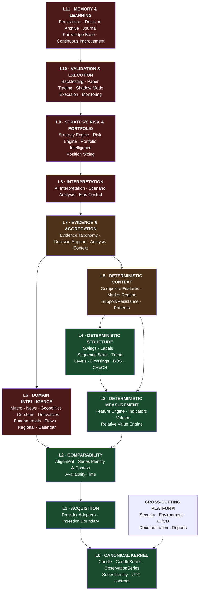

Green = substantially implemented · amber = partial · red = not built.

---

### L0 · Canonical Kernel — **Implemented**

**Purpose.** Define the vocabulary every other layer speaks, once. This is the only layer whose types
appear in every other layer's signatures, so it is the only layer that must never change carelessly.

**Inputs.** Validated primitive values from L1.
**Outputs.** `Candle`, `CandleSeries`, `ObservationSeries`, `SeriesIdentity`, `CandleField`, the
canonical UTC contract, and the candle→observation reduction.
**Dependencies.** **None.** Imports nothing internal — verified.

**Why it exists.** Without one canonical vocabulary, every pair of layers negotiates its own format,
and provider quirks propagate everywhere. The kernel is what makes 16 other packages composable.

**Design rules.** Frozen and validated at construction · strictly increasing timestamps · timezone-aware
with permanent zero offset, validated and never converted (ADR-0001) · closed/forming distinction
explicit · no provider types, no indicator math, no alignment policy.

**Future evolution.** Three known extensions, each requiring its own decision:
1. **Availability-time dimension** — knowledge date separate from observation date (**Blocked**, ADR-0003).
2. **Money, position and portfolio numeric types** — the `float` choice was scoped to market data only; L9 types need their own ADR (review R11).
3. **Multi-timeframe identity** — deferred until a real consumer exists (`ARCH` D11).

---

### L1 · Acquisition — **Implemented** (1 adapter of ~8 domains)

**Purpose.** Convert the outside world into canonical objects, and contain every external
irregularity at the outermost edge.

**Inputs.** Provider requests, credentials, transports.
**Outputs.** Canonical series, or an explicit error.
**Dependencies.** L0 only. **The dependency arrow runs opposite to the data-flow arrow here**, and
that inversion is the whole point: adapters know the kernel; the kernel knows nothing.

**Two sub-layers, deliberately separated:**

| Sub-layer | Module | Responsibility |
|---|---|---|
| **Provider adapter** | `fmis.providers.*` | Transport, pagination, retries, rate limits, provider quirks, unit conversion, provider→canonical mapping (ADR-0006) |
| **Ingestion boundary** | `fmis.ingest` | Strict decoding of record mappings. Rejects unknown fields, wrong types, missing keys. **No silent repair, ever** (ADR-0005) |

**Why the split matters.** Ingestion is testable without a network; adapters are testable through an
injected transport. The Binance adapter reaches 94 % coverage despite being network-bound because of
this seam — the 14 uncovered lines are HTTP error branches, the only genuinely untestable boundary in
the repository.

**Future evolution.** One adapter per external domain, all identical in shape: TradingView ingestion
(**Planned** — the highest-value missing adapter), additional exchanges and brokers, macro sources
(**Blocked**), on-chain indexers, derivatives venues, news feeds, filing feeds, fund-flow providers.
**Adding an adapter must never require changing any layer above L1.** That property is the test of
whether this layer is correctly built, and it currently holds.

---

### L2 · Comparability — **Implemented** (one policy)

**Purpose.** Make two series comparable — and make the *policy* by which they were made comparable an
explicit, reported artifact rather than a hidden step inside the mathematics.

**Inputs.** Two or more canonical series.
**Outputs.** Aligned series, an `AlignmentReport`, and identity-carrying `ContextualSeries` envelopes.
**Dependencies.** L0. `fmis.series_context` additionally reads L4 structural types.

**Three concerns, three homes:**

| Concern | Module | Status | Rule |
|---|---|---|---|
| Temporal alignment | `fmis.alignment` | **Implemented** | Strict intersection only. **No silent forward-filling, ever** (ADR-0002) |
| Series identity | `fmis.series_context` | **Implemented** | Derived facts carry which series they came from; two instruments can never silently mix (ADR-0018) |
| Availability time | — | **Blocked** | Knowledge date vs observation date; revisions and vintages (ADR-0003) |

**Why this layer exists at all.** `ARCH` principle 14: *alignment is separate from mathematics*.
How series are made comparable is a policy decision with real consequences — mixed calendars, market
holidays, mixed frequencies, and above all look-ahead bias. Putting it inside each calculation would
make every calculation carry a policy, and make none of them auditable.

**Why L2 is the highest-risk layer in the system.** This is where look-ahead bias enters if it enters
at all. `ARCH` §14 ordered alignment before all relative-value mathematics precisely because *"the
mathematics of a ratio is trivial to verify once alignment is correct; verifying it on top of
unspecified alignment would bake in exactly the bias this project is built to avoid."*

**Future evolution.** Forward-fill under a named max-staleness policy · as-of joins on release date ·
resampling · mixed-frequency defaults · trading-calendar awareness (§5.4) · **the availability-time
model, which is a precursor to all macro and fundamental work**.

---

### L3 · Deterministic Measurement — **Implemented**

**Purpose.** Compute objective numbers from canonical series. Nothing here has an opinion.

**Inputs.** Canonical series (single-instrument) or aligned series (multi-instrument).
**Outputs.** `FeatureSet` of immutable `FeatureResult`s; `RelativeValueResult` with a first-class
data-quality block.
**Dependencies.** L0, L2.

**Two engines, split by an identity constraint rather than by preference:**

| Engine | Scope | Why separate |
|---|---|---|
| **Feature Engine** — `fmis.features` | **One** instrument, one timeframe | `FeatureContext.primary` is a single series; `FeatureSet` identity is `(symbol, timeframe, as_of)` |
| **Relative Value Engine** — `fmis.relative_value` | **Two or more** series | A relationship has **no single symbol**, so it cannot fit `FeatureSet`'s identity contract without degrading it (ARCH D1) |

**Feature Engine internals.** Registry-based discovery — the engine never imports a concrete feature.
Topological dependency resolution, so a feature may consume another feature's result. Closed-candle
enforcement at engine level, repeated idempotently at feature level. Implemented features: EMA, ATR,
RSI, MACD (structured 3-key value), average volume, relative volume.

**Hard boundaries.** An indicator returns a number or a small structured fact — **never** "bullish",
a score, or a trade. The RVE reports what a relationship measures, **never** what to do about it: no
LONG/SHORT/BUY/SELL, no confidence scores, no direction labels, no causal claims.

**Future evolution.** Tier-1 indicator expansion (EMA slope and distance, RSI moving average, ADX,
Bollinger Bands, VWAP — all documented TODOs; the vision adds trendlines and divergences) · RVE v1b
(ratio, log ratio, spread, beta, rolling and annualized variants) · RVE v2+ (lead-lag,
cross-correlation, residual analysis, cointegration, basket-relative strength) · **the additive
`compute_series()` protocol extension**, which must land before serious backtesting because features
currently return only their latest value, making naive replay O(N²) (review R5).

---

### L4 · Deterministic Structure — **Implemented**

**Purpose.** Derive the *shape* of price action deterministically — the layer that replaces visual
chart reading with reproducible facts.

**Inputs.** `CandleSeries`; each stage consumes the previous stage's output.
**Outputs.** Swings, comparisons, labels, sequence state and its history, structural trend, price
levels, crossing events, structure breaks, changes of character.
**Dependencies.** L0, L2.

**The chain, complete end to end:**

```
CandleSeries → Swings → Relationships → Labels → Sequence State → State History → Structural Trend
                                          ↓
                                    Price Levels → Level Crossings → Break of Structure
                                                                            ↓
                                                                  Change of Character
```

Every stage is pure, non-repainting, exactly prefix-stable, identity-carrying, and has exactly one
implementation. `CURRENT_STATE.md`: *"Nothing in the chain remains to be built before a consumer can
read structure end to end."*

**Why this layer is architecturally distinctive.** It demonstrates the *fact vs reading* separation
(§2.8) at four consecutive boundaries. A crossing is observable; a break additionally requires
deciding which level is protected and when protection ends; a change of character requires reading
the break sequence. Each decision lives in exactly one layer, so a consumer that disagrees with one
policy can still use everything beneath it.

**Why it is also the location of the blueprint's headline finding.** This entire layer — 5,695 LOC,
51.2 % of the codebase — has **no path from a provider and no consumer**. See §1.4 and §10.4.

**Known limitations, all documented:** the confirmation delay is carried on no derived fact, and a
mismatch between `confirmation_bars` and the `right_bars` used for detection is **undetectable** —
the single largest correctness hazard in the chain · the first swing of each type yields no level ·
a two-sided break bar leaves character indeterminate · breaks and changes are never invalidated;
"failed break" is a later reading over the sequence.

**Future evolution.** `LevelOrigin` carrying the confirmation delay (**Planned**, ADR-0020 D1) ·
**trend as a summary of the BOS and CHoCH histories**, consuming both and defining neither — a test
currently pins that `structural_trend` imports neither, so widening will be deliberate rather than
drift.

---

### L5 · Deterministic Context — **Planned**

**Purpose.** Turn measurements and structure into *states* — still deterministic, still without
direction, but answering "what kind of environment is this?" rather than "what is this number?"

**Inputs.** `FeatureResult`s via `FeatureContext.computed`; structural facts from L4; relative-value
metrics from L3; later, domain intelligence from L6.
**Outputs.** Composite `FeatureResult`s, regime classifications carrying evidence and uncertainty,
scored support/resistance levels, rule-defined patterns.
**Dependencies.** L3, L4; later L6.

| Component | Home | Status |
|---|---|---|
| **Composite Feature Layer** | Inside the Feature Engine, Tier-2 packages (ARCH D9) | **Planned** — six placeholder packages exist with docstrings and TODO lists, no calculation code |
| **Market Regime Engine** | New module | **Planned** — specified in `ARCH` §9 |
| **Support & Resistance** | Tier-2 package | **Planned** — L4 now supplies the vocabulary |
| **Pattern Detection** | Tier-2 package | **Planned** — rule-based patterns only |

**Why the Market Regime Engine is the highest-leverage unbuilt module in the system.** `ARCH` §9:
regime is the assumption nearly every downstream rule conditions on, so an unexamined regime call
silently biases everything — *and the v2→v3 post-mortem documents exactly that failure*. Today the
regime call still lives in the v3 prompt's STEP 1, where it is not diffable, not versioned, and not
measurable after the fact. Moving it into L5 is the single change that most directly addresses the
project's founding failure.

**Design rules for this layer.** Expose components separately so a consumer can see *why* a state was
assigned · never emit a direction label · thresholds must be parameters, versioned, never literals ·
the explicitly rejected anti-pattern is `RSI > 50 = bullish`.

**Future evolution.** Regime v1 conditions on technical evidence only; regime v2 conditions on L6
intelligence (liquidity, risk-on/risk-off, correlation regime, crisis/stress). That widening is a
dependency change from L5→L3/L4 to L5→L6, and should be a deliberate, reviewed step.

---

### L6 · Domain Intelligence — **Future** (one component **Blocked**)

**Purpose.** Bring in every category of evidence that is *not* derivable from price. This is the
layer that makes FMITS a market-intelligence platform rather than a technical-analysis library.

**Inputs.** Domain-specific external data via L1 adapters, aligned by L2.
**Outputs.** Deterministic domain metrics — not narratives. Narrative is L8's job.
**Dependencies.** L1, L2. **Explicitly outside the technical Feature Engine**, whose
`FeatureCategory` is technical-only and test-enforced.

| Engine | Status | Note |
|---|---|---|
| Macro Intelligence | **Blocked** | Gated by ADR-0003 until an availability-time model exists |
| Economic Calendar | **Future** | Expected vs actual vs surprise, four regions |
| News & Event Intelligence | **Future** | The nine-question mechanism protocol, `SPEC` §12 |
| Geopolitical Intelligence | **Future** | Transmission chains, not slogans |
| On-Chain Intelligence | **Future** | Crypto-only by nature; never read in isolation |
| Derivatives Intelligence | **Future** | Funding, OI, liquidations, basis, options |
| ETF Flow Intelligence | **Future** | Institutional flow evidence |
| Insider & Politician Trading | **Future** | Filing lag is material — inherits the availability-time concern |
| Fundamental Research | **Blocked** | Release-dated; same gate as macro |
| Regional Intelligence (China) | **Future** | The only geography with a first-class module in the vision |
| Startup & IPO Intelligence | **Future** | Feeds the Opportunity Scanner |
| Future Industries Research | **Future** | A research domain rather than a computational engine |

**Why every one of these is a separate engine.** Each has its own adapters, its own data-quality
semantics, its own vintage behaviour, and its own failure modes. Merging them would produce exactly
the opaque all-in-one module `SPEC` §1 forbids. They attach at the same architectural level and feed
the same aggregation layer.

**The structural rule that makes this layer possible.** `FeatureCategory` is technical-only and
test-enforced. L6 evidence must therefore reach L7 through the **evidence taxonomy**, not through the
Feature Engine. This is why `fmis.evidence` exists — and why leaving it unwired (§10.2) matters more
than its line count suggests.

**Future evolution.** These arrive in dependency order, not appetite order: adapters → availability
time → macro → the rest. Anything release-dated or revised is blocked behind the same precursor.

---

### L7 · Evidence & Aggregation — **In Progress**

**Purpose.** Assemble facts from every layer beneath into one structured, classified, non-directional
evidence set. **Organising evidence is not forming a view.**

**Inputs.** Feature sets, structural facts, relative-value metrics, regime states, domain
intelligence; plus the analysis context declaring what the analysis is scoped to.
**Outputs.** `EvidenceReport` — classified evidence, coherence verdict, explicit missing data.
**Dependencies.** L3–L6.

| Component | Module | Status |
|---|---|---|
| Evidence taxonomy | `fmis.evidence` | **Implemented** — but with no production consumer (§10.2) |
| Decision support | `fmis.decision_support` | **Implemented (v1)** — consumes an `AnalysisSnapshot` |
| Analysis context | `fmis.trading_context` | **Implemented** — but with no production consumer |

**Why this layer is separate from L8.** It is the last layer that is fully deterministic. An
`EvidenceReport` computed twice from the same snapshot is identical; an interpretation is not. Placing
aggregation below the AI boundary means the evidence an interpretation rests on can always be replayed
and checked, even when the interpretation cannot.

**Design rules.** `WATCH` means the available evidence agrees with itself — never that anything should
be done · evidence grouped into families so correlated indicators are not double-counted ·
missing data reported as a first-class field, not omitted · the analysis objective is **never
inferred**, least of all from a timeframe.

**Architectural observation.** `fmis.decision_support` currently imports `fmis.pipeline` — that is,
L7 depends on the application composition root rather than on the engines directly. This works today
and was a reasonable v1 choice, but it means decision support is coupled to one snapshot shape. §10.3
records the consequence.

**Future evolution.** The full `SPEC` §6 analysis shape: regime, higher-timeframe context, current
setup, bullish evidence, bearish evidence, conflicting evidence, confirmation conditions, entry zone,
invalidation, stop logic, target logic, risk/reward, key risks, confidence level, missing data. Today
a fraction of that exists.

---

### L8 · Interpretation — **Future**

**Purpose.** The second half of the project's defining pipeline. Reason over structured evidence:
combine, contrast, frame scenarios, and state uncertainty.

**Inputs.** `EvidenceReport` and everything it references.
**Outputs.** Narrative interpretation, scenario framing, explicit uncertainty, the strongest
reasonable opposing case.
**Dependencies.** L7 and below — read-only.

**Hard boundaries — the most important in the system.**

| Permitted | Forbidden |
|---|---|
| Combining signals across families | Computing any value code can compute |
| Identifying conflicting evidence | Silently overriding a deterministic fact |
| Interpreting regime *within* stated evidence | Being stored as a deterministic result |
| Comparing bullish and bearish scenarios | Claiming causality as fact rather than hypothesis |
| Explaining transmission mechanisms | Producing a trading signal — that is L9's exclusive right |
| Constructing the opposing case | Being a required dependency of any deterministic layer |

**Bias control lives here structurally.** `SPEC` §7 requires that before recommending a directional
trade the analysis constructs the strongest reasonable opposing case, and that a LONG analysis asks
*"what evidence would make this setup fail?"* Today that discipline is enforced by prompt convention;
in the target architecture it is an L8 obligation checkable against the L11 archive.

**Future evolution.** §7 develops this layer at the level of boundaries only, as instructed —
orchestration is deliberately not designed here.

---

### L9 · Strategy, Risk & Portfolio — **Future**

**Purpose.** Convert interpreted evidence into candidate actions, size them, and evaluate them against
everything already held.

**Inputs.** Evidence, interpretation, regime, relative-value correlations, portfolio state.
**Outputs.** Versioned strategy conditions; candidate setups including `WAIT` and `NO TRADE`;
position sizes; exposure and concentration assessments.
**Dependencies.** L7, L8; L3 for correlation.

| Component | Responsibility | Status |
|---|---|---|
| **Strategy Engine** | Explicit, versioned rule sets mapping evidence to candidate setups. **The only layer permitted to emit a trading signal** | **Future** |
| **Risk Engine** | Deterministic position sizing, invalidation distance, R:R, exposure limits. No directional opinion, no entry selection | **Future** |
| **Portfolio Intelligence** | Total open risk, correlation clustering, sector/geographic/crypto concentration, leverage, drawdown, stablecoin and **exchange/custody exposure** | **Future** |

**Why Strategy and Risk are siblings, not nested.** If a strategy sized its own positions, risk limits
would be negotiable by whichever strategy was most confident. Separating them makes the 2 % ceiling
structural.

**A prerequisite that must not be discovered late.** Review R11: the `float` numeric choice was scoped
to market data only. **Money, position and portfolio types require their own ADR before this layer is
built.** Discovering the `float`-vs-`Decimal` question mid-implementation would be expensive.

**Future evolution.** Multi-strategy portfolios · strategy versioning and comparison · correlation-aware
sizing · regime-conditional risk budgets.

---

### L10 · Validation & Execution — **Future** (execution disabled by design)

**Purpose.** Prove a strategy before it touches capital, then execute it under strict, isolated
control.

**Inputs.** Versioned strategies, historical data, live data.
**Outputs.** Robustness metrics, hypothetical fills, real orders, monitoring state.
**Dependencies.** L9 and below.

**The automation ladder is this layer's architecture.** It is not a schedule; it is a sequence of
gates, each with its own module:

```
Backtesting → Robustness testing → Paper trading → Shadow mode
            → Small controlled live → Gradual scaling
```

| Rung | Property | Status |
|---|---|---|
| **Backtesting** | Fees, slippage, explicit look-ahead guards; never judged on total return alone; tested across assets, periods, and bull/bear/sideways/high-vol/low-vol regimes | **Future** |
| **Robustness** | Guards against overfitting, look-ahead, survivorship, leakage, unrealistic fills | **Future** |
| **Paper trading** | Simulated fills on historical or live data | **Future** |
| **Shadow mode** | Receives live data, generates trades, records hypothetical entries and exits, **executes nothing** | **Future** |
| **Execution** | Isolated, disabled by default, separable from analysis | **Future** |
| **Monitoring** | Position, risk, drawdown and system-health observation | **Future** |

**Mandatory controls if execution is ever enabled** (`SPEC` §11.2, absolute): API keys must not allow
withdrawals · position-size limits · leverage limits · maximum daily loss · maximum drawdown controls ·
kill switches · all orders and decisions logged · execution separable from analysis.

**Known architectural blocker.** Backtesting is currently O(N²) because features return only their
latest value (review R5). The additive `compute_series()` path is the recorded intended fix and
**should land before the first backtest, not during it** — it touches the most-depended-on contract in
the codebase.

---

### L11 · Memory & Learning — **Future** (documentation portion **Implemented**)

**Purpose.** Make the system improve. Without this layer FMITS can be *correct* but never
*demonstrably useful*.

**Inputs.** Every analysis, decision, interpretation, trade and outcome.
**Outputs.** A queryable history; measured performance; accumulated knowledge; revised priors.
**Dependencies.** All layers.

| Component | Status | Note |
|---|---|---|
| Persistence | **Future** | Deferred as *"nothing yet produces output worth persisting"* — reasoning now dated: L7 produces `AnalysisSnapshot` and `EvidenceReport` today |
| Decision & outcome archive | **Future** | `SPEC` §25 makes preserved analysis history a **success criterion** |
| Trading journal | **Unknown** | No approved document specifies it; adjacent concepts appear three times |
| Knowledge base | **In Progress** | 21 ADRs, 6 designs, 7 reviews, `reports/` — **Implemented** as documentation; a structured, queryable KB is **Future** |
| Continuous improvement | **Future** | Measuring which evidence proved informative; revising weights on documented evidence |
| Monitoring feedback | **Future** | Expected vs realized behaviour |

**Why this layer closes the loop.** `SPEC` §25 defines success as a system that uses real structured
data, **preserves analysis history**, tests strategies, measures performance, exposes uncertainty, and
**improves over time through documented evidence**. Four of those six are L11 obligations. The
architecture is a straight line from L0 to L10 and a *loop* only because L11 exists.

**Architectural note.** L11 is the only layer that legitimately depends on all others, and the only
one whose output re-enters at the top. Its dependency on everything is why it cannot be built early —
and why deferring it indefinitely quietly caps the whole system's value.

---

### Cross-cutting · Platform — **Implemented**, one component **Unknown**

**Purpose.** Concerns that belong to no single layer and constrain all of them.

| Concern | Status | Note |
|---|---|---|
| Security & secrets | **Implemented** | `.env` git-ignored; no secrets in history; minimum-permission keys; no withdrawal permissions |
| Environment | **Implemented** | Python 3.12 pinned, `uv.lock`, **zero runtime dependencies** |
| Documentation & decision record | **Implemented** | The project's strongest asset |
| Operational reports | **Implemented** | `reports/`, numbered, indexed, never deleted |
| CI/CD & quality gates | **Unknown** | **No workflow, linter, formatter or type checker exists.** Named in no approved document; recommended in report 0001 §10.2 |

---

## 4. Complete data flow

### 4.1 The canonical 22-stage pipeline

Every instrument, in every asset class, traverses the same stages. Not every stage is required for
every analysis — depth and cadence vary by product (§6.2) — but the *order* and the *homes* are fixed.

| # | Stage | Layer | Module today | Status |
|---:|---|:---:|---|---|
| 1 | **Raw Market Data** | L1 | `fmis.providers.binance` | **Implemented** (1 adapter) |
| 2 | **Normalization** | L1→L0 | `fmis.ingest` + `Candle`/`CandleSeries` validation | **Implemented** |
| 3 | **Deterministic Calculations** | L3 | `fmis.features` engine, registry, topological ordering | **Implemented** |
| 4 | **Indicators** | L3 | EMA · ATR · RSI · MACD · volume statistics | **Implemented** |
| 5 | **Market Structure** | L4 | swings → labels → sequence state → trend → levels → crossings → BOS → CHoCH | **Implemented** |
| 6 | **Context Building** | L2 + L5 | `fmis.alignment`, `fmis.series_context` **Implemented**; composite features, regime, S/R, patterns | **Planned** |
| 7 | **Macro Analysis** | L6 | — | **Blocked** (ADR-0003) |
| 8 | **News Analysis** | L6 | — | **Future** |
| 9 | **On-chain Analysis** | L6 | — | **Future** |
| 10 | **Derivatives Analysis** | L6 | — | **Future** |
| 11 | **Fundamental Analysis** | L6 | — | **Blocked** (release-dated) |
| 12 | **Relative Value** | L3 | `fmis.relative_value` v1a — 5 metrics | **Implemented** |
| 13 | **Portfolio Context** | L9 | — | **Future** |
| 14 | **Risk Context** | L9 | — | **Future** |
| 15 | **AI Interpretation** | L8 | — | **Future** |
| 16 | **Scenario Analysis** | L8 | — | **Future** |
| 17 | **Decision Engine** | L7 + L9 | `fmis.decision_support` v1 (evidence only); strategy engine | **In Progress** / **Future** |
| 18 | **Execution** | L10 | — | **Future** (disabled by design) |
| 19 | **Monitoring** | L10 | — | **Future** |
| 20 | **Learning** | L11 | — | **Future** |
| 21 | **Knowledge Base** | L11 | `docs/`, 21 ADRs, `reports/` | **In Progress** |
| 22 | **Continuous Improvement** | L11 | — | **Future** |

**Coverage:** 7 of 22 stages implemented, 1 in progress, 1 planned, 11 future, 2 blocked.
Concentrated entirely in stages 1–6 and 12 — the deterministic foundation.

### 4.2 Narrative order vs dependency order

The 22-stage sequence is a **reading order** — how an analyst thinks about an instrument. It is not
identical to the **dependency order** — what must be computed before what. Two divergences matter, and
naming them prevents building the pipeline literally and wrongly:

1. **Relative Value (12) executes early, not late.** It is an L3 deterministic measurement requiring
   only aligned series. It appears at position 12 in the narrative because a human considers relative
   value after absolute readings, but nothing about stages 7–11 gates it. In the real dependency
   graph, stage 12 runs beside stages 3–5.

2. **Context Building (6) is entered twice.** Its L2 half — alignment and identity — precedes all
   measurement. Its L5 half — composite features and regime — *consumes* measurement, structure, and
   eventually stages 7–11. Regime v1 therefore conditions on technical evidence only; regime v2
   conditions on domain intelligence. That widening is a deliberate future dependency change, not a
   drift.

**The pipeline is also not purely linear.** It has one **fan-in** at stage 17, where every evidence
stream converges into one classified set, and one **feedback loop** from stages 20–22 back to the top,
which is what makes the system able to improve rather than merely repeat.

### 4.3 Pipeline diagram

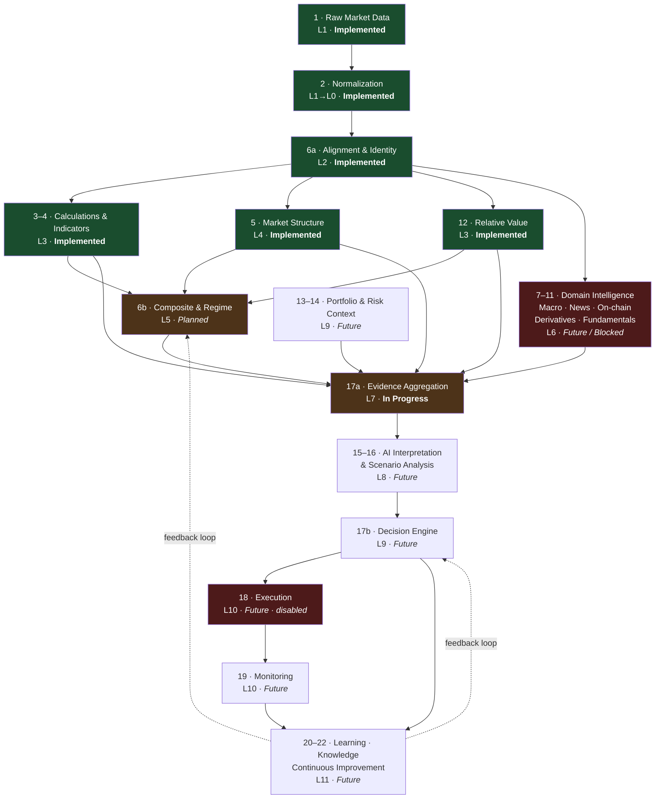

### 4.4 The journey of one instrument, end to end

Told once, concretely, for any instrument in any asset class:

1. An **adapter** fetches raw records and hands them to the **ingestion boundary**, which decodes them
   strictly — no repair, no coercion.
2. The result is a **canonical series**: validated, frozen, strictly ordered, UTC-anchored, carrying a
   `SeriesIdentity`. From here nothing knows which provider it came from.
3. The forming candle is **dropped unconditionally**, and the exclusion is reported rather than
   implied.
4. **Alignment** makes this series comparable with any other under a stated policy, and reports what
   the policy cost.
5. The **Feature Engine** computes indicators in topological order; the **structural chain** derives
   swings, labels, states, levels, crossings, breaks and character changes; the **RVE** measures
   relationships against benchmarks. All three are deterministic, provenance-carrying, and non-repainting.
6. **Composite features and regime** turn those numbers into states, exposing components so a reader
   can see why.
7. **Domain intelligence** contributes macro, news, on-chain, derivatives and fundamental evidence,
   each aligned by the same L2 policy.
8. **Portfolio and risk context** contribute what is already held and what may be risked.
9. **Evidence aggregation** classifies everything into families, weights by diversity, and states what
   is missing. *This is the last fully deterministic artifact.*
10. **AI interpretation** reasons over that evidence: what agrees, what conflicts, what the strongest
    opposing case is, what remains uncertain.
11. The **decision engine** applies versioned rules, producing a candidate setup — or `WAIT`, or
    `NO TRADE`, both first-class.
12. **Validation** gates anything that would touch capital, through the full ladder.
13. **Monitoring and learning** record what actually happened, and feed it into the **knowledge base**,
    which changes how step 6 and step 11 behave next time.

Steps 1–5 and 9 work today. Steps 6–8 and 10–13 do not.

---

## 5. Domain architecture

### 5.1 Asset-agnosticism is already achieved — the evidence

This blueprint's asset-agnosticism requirement is not a change of direction. It is an existing,
verifiable property of the codebase.

**Method.** Searched all 74 source modules for asset-class vocabulary (`crypto`, `bitcoin`, `btc`,
`eth`, `coin`, `token`, `binance`, `usdt`, `blockchain`), excluding the adapter package.

**Result: 5 matches, none of them logic.**

| Location | Nature |
|---|---|
| `features/volume/__init__.py` | A docstring **asserting** agnosticism — *"computed identically for a 24/7 crypto perpetual, an HKEX share…"* |
| `features/volume/statistics.py` | Same, restated |
| `trading_context/context.py` | A docstring noting that the only interval vocabulary that exists is Binance's, and that this is an adapter concern |
| `pipeline/market_analysis.py` (×2) | The application layer importing the one available adapter — permitted; it is the composition root |

**There is no crypto-specific type, no crypto-specific branch, and no crypto-specific constant
anywhere in L0–L5.** `Candle` has an OHLCV shape that fits every exchange-traded instrument. `symbol`
and `interval` are opaque labels the kernel never interprets. The structural chain reads highs, lows
and closes and would behave identically on a bond future.

### 5.2 The Three Admission Points

Asset-class knowledge must enter the system at exactly three places, and nowhere else. This is the
rule that keeps §5.1 true as the system grows.

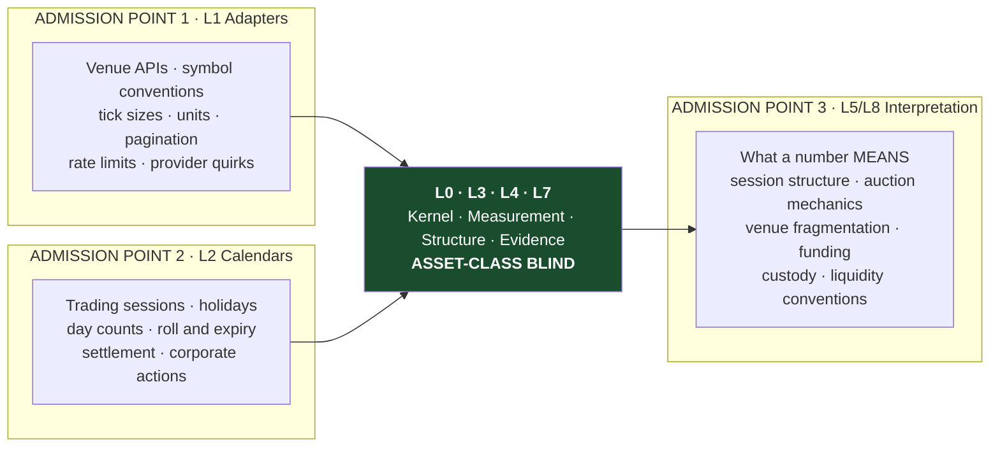

| Point | Layer | Admits | Status |
|---|---|---|---|
| **1 · Adapters** | L1 | Venue mechanics, symbol conventions, units, market microstructure quirks | **Implemented** (crypto); one adapter per venue thereafter |
| **2 · Calendars & sessions** | L2 | Trading hours, holidays, day counts, roll/expiry, settlement, corporate actions | **Future** — the one genuinely missing asset-agnosticism component |
| **3 · Interpretation** | L5 / L8 | What a measurement *means* in a given market | **Planned** (L5) / **Future** (L8) |

**Everything between points 1 and 3 must remain asset-class blind.** A reviewer's test for any future
module: *could this code tell which asset class it is processing?* If yes, and it is not at an
admission point, the design is wrong.

**Admission Point 2 is the honest gap.** Alignment today implements strict intersection, which handles
mixed calendars by *dropping non-overlapping observations and counting the loss* — correct, safe, and
sufficient for crypto-vs-crypto. Equities, futures and bonds will need real calendar awareness: a
5-day week, holidays, half-days, contract rolls, and day-count conventions for annualization. This is
already a recorded open question (`ARCH` §13.3, §13.5) and is the prerequisite for genuine multi-asset
support.

### 5.3 The Universal Instrument Contract

One architecture serves ten asset classes because everything the classes share sits in the core, and
everything that differs is admitted at a point.

**What every instrument shares — handled by L0–L4, already built:**

| Property | Canonical treatment |
|---|---|
| A price series over time | `CandleSeries` — OHLCV, validated, strictly ordered |
| An identity | `SeriesIdentity` — symbol + interval, opaque to the kernel |
| Closed vs forming bars | Explicit, enforced at two levels |
| Trend, momentum, volatility | Feature Engine indicators — pure arithmetic |
| Swing structure | The L4 chain — highs, lows, breaks, character |
| Relationships to other instruments | Relative Value Engine |

**What differs — and where each difference is admitted:**

| Difference | Example | Admission point |
|---|---|---|
| Trading calendar | Crypto 24/7 · equities 5-day · FX 24/5 | **2** — calendars |
| Session structure | HKEX lunch break · auctions · price limits | **2** and **3** |
| Volume semantics | Consolidated tape vs single venue vs perpetual | **3** — interpretation |
| Contract mechanics | Futures roll · options expiry · bond maturity | **2** — calendars |
| Corporate actions | Splits, dividends, delistings | **2** — normalization policy |
| Carry | Funding rates · dividend yield · coupon · storage cost | **1** and **3** |
| Custody & venue risk | Exchange solvency · broker segregation | **3** and L9 portfolio |
| Day count | Crypto 365 · equity 252 | **2** — an open question today |
| Native evidence | On-chain for crypto · filings for equities | L6, one engine per category |

**How each asset class instantiates the contract:**

| Class | Adapter | Calendar | Native L6 evidence | Status |
|---|---|---|---|---|
| Crypto | Exchange REST | 24/7 | On-chain, derivatives | **Implemented** (price only) |
| Equities | Broker / market data | Exchange calendar | Fundamentals, insider, flows | **Future** |
| ETFs | Market data + flow provider | Exchange calendar | Fund flows, holdings | **Future** |
| Indices | Index provider | Exchange calendar | Constituent breadth | **Future** |
| Forex | FX venue | 24/5 | Rate differentials, macro | **Future** |
| Commodities | Futures venue | Exchange + roll | Inventories, seasonality | **Future** |
| Bonds & rates | Macro / market data | Exchange + settlement | Curve, policy | **Blocked** |
| Mining | Equity adapter | Exchange calendar | Fundamentals + commodity linkage | **Future** |
| Futures | Derivatives venue | Roll + expiry | Basis, OI, funding | **Future** |
| Options | Derivatives venue | Expiry chain | IV surface, skew, Greeks | **Future** |

**Mining is a deliberate illustration of the model working.** A mining company is an equity that
depends on a commodity. It needs no special architecture: the equity adapter (point 1), the exchange
calendar (point 2), the fundamentals engine (L6), and a *relationship* to the commodity — which is
exactly what the Relative Value Engine already measures. No new layer, no new module type.

### 5.4 How domains cooperate — one ecosystem

Every domain from Report 0002 appears here as a participant in one pipeline, never as a separate
application.

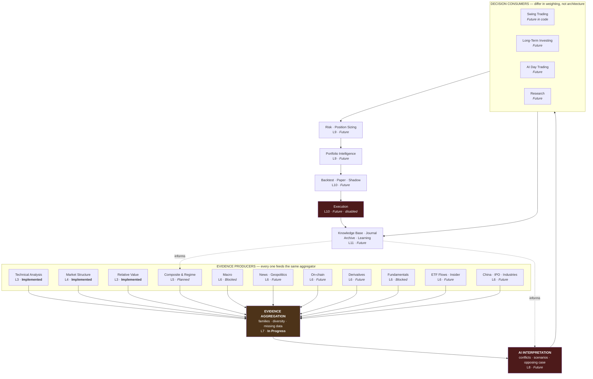

**The architectural claim this diagram makes.** Swing trading, long-term investing, AI day trading and
research are **not four systems**. They are four consumers of one evidence stream, differing in three
parameters only:

| Consumer | Timeframe emphasis | Evidence weighting | Cadence |
|---|---|---|---|
| **Swing trading** | 1W context · 1D setup · 4H execution | Structure, momentum, regime dominant | Daily |
| **Long-term investing** | Monthly / weekly | Fundamentals, macro, thematic dominant; technicals inform *entry timing only* | Weekly / monthly |
| **AI day trading** | Intraday | Microstructure, derivatives positioning dominant | Continuous |
| **Research** | Any | Breadth over depth; no position implied | Ad-hoc |

The vision is explicit that this shared-engine, separate-interpretation model is intentional:

> **Shared calculations do not imply shared decision logic.** An EMA is an EMA whoever is looking at
> it… What a 50-period EMA *means* is not shared: it is the swing trader's trend reference, the day
> trader's slow background, and the investor's near-irrelevance.
> — `src/fmis/trading_context/__init__.py`

And the boundary is enforced: ADR-0009 keeps long-term investing **out** of `TradingObjective`
entirely, because it rests on thesis, valuation and portfolio construction rather than on setups. It
becomes a separate L9 consumer with its own context type, reusing every engine and none of the trading
interpretation.

---

## 6. Product architecture

### 6.1 Products are views, not systems

A product in FMITS is defined by three choices over one architecture:

1. **Which pipeline stages** it reads (depth).
2. **How it weights the evidence** it receives (emphasis).
3. **How often it runs** (cadence).

Nothing else. No product owns a data path, an engine, or a calculation. This is what prevents the
platform from fragmenting into per-market applications.

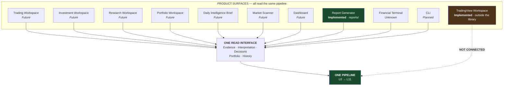

### 6.2 Product specifications

| Product | Stages read | Emphasis | Cadence | Status |
|---|---|---|---|---|
| **TradingView Workspace** | none — analyzes visually | Regime, structure | On demand | **Implemented**, outside the architecture |
| **Report Generator** | — | Work records | Per milestone | **Implemented** |
| **CLI** | 1–6, 12, 17a | Whatever is asked | On demand | **Planned** |
| **Trading Workspace** | 1–6, 12, 15–17 | Structure, momentum, regime | Daily | **Future** |
| **Investment Workspace** | 1–4, 7, 11–12, 15–17 | Fundamentals, macro, thematic | Weekly | **Future** |
| **Research Workspace** | 7–11, 21 | Breadth; no position implied | Ad-hoc | **Future** |
| **Portfolio Workspace** | 12–14, 19 | Correlation, concentration, exposure | Daily | **Future** |
| **Daily Intelligence Brief** | 5–17, all instruments | Change since yesterday | Scheduled, pre-market | **Future** |
| **Market Scanner** | 1–6, 12, 17a, ranked | Setup quality across a universe | Scheduled | **Future** |
| **Dashboard** | 17–19 | Current state | Continuous | **Future** |
| **Financial Terminal** | all | Unified | Continuous | **Unknown** — no source |

### 6.3 Two product rules

**Rule 1 — presentation never precedes facts.** `ARCH` §11: building a dashboard before stable
deterministic facts exist *"would invert the pipeline."* The Daily Brief and the Scanner are
classified in the vision as **consumer surfaces, not engines**, for the same reason.

**Rule 2 — every product reads one interface.** Products consume evidence, interpretation, decisions,
portfolio state and history. They never call an engine directly, never hold a provider credential, and
never contain a calculation. A product that needs a number nobody computes is a signal that an engine
is missing, not that the product should compute it — the same rule ADR-0007 applies to the pipeline.

### 6.4 The product architecture's current defect

**Eleven products, two built, and the one that analyzes markets is not connected to the architecture.**

The TradingView Workspace performs stages 1–17 by visual estimation inside a 199-line prompt, while
the library performs stages 1–6 and 12 with 3,221 tests and reaches no user. §10.5 addresses this;
Report 0002 §15 established it.

---

## 7. AI architecture

**Scope note.** As instructed, this section defines **boundaries only**. No orchestration, no prompt
architecture, no agent topology, no model selection. Those are design decisions for a later milestone
and would be premature here.

### 7.1 The four boundaries

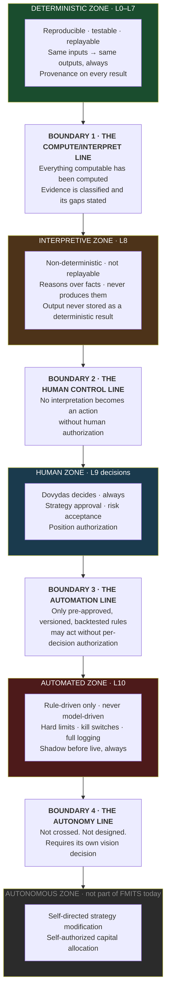

### 7.2 Boundary 1 — where deterministic computation ends

**Located between L7 and L8.**

Computation ends when every value that *can* be computed *has* been, and the result is a classified
evidence set that states its own gaps. AI begins there and not one step earlier.

| Deterministic side (L0–L7) | Interpretive side (L8) |
|---|---|
| EMA value, slope, distance | What that configuration implies given the regime |
| MACD histogram and its rate of change | Whether weakening bearish momentum is meaningful *here* |
| Swing labels, breaks, character changes | Whether the structure is convincing or fragile |
| Correlation coefficient and its window | Whether the relationship is likely to persist |
| Regime label with component evidence | How much to trust it, and what would falsify it |
| Evidence families and coverage gaps | Which conflicts matter and which are noise |

**The test.** If a model is being asked for a number, the boundary has been violated. `SPEC` §3.1:
*"AI should not be asked to visually guess values that code can calculate precisely."*

**Why the boundary sits above L7 rather than above L3.** Aggregation is deterministic: grouping
evidence into families, weighting by diversity, and listing what is missing are all reproducible
operations. Putting them below the line means an interpretation always rests on a replayable
foundation — you can always re-derive exactly what the model was shown.

### 7.3 Boundary 2 — where humans remain in control

**Located between L8 and L9 decisions.**

**Every position decision is Dovydas's.** AI interpretation is advice, and advice that is required to
include the strongest opposing case (`SPEC` §7). The human retains: strategy approval, risk
acceptance, position authorization, and the right to overrule any interpretation.

This boundary is permanent. Nothing in the automation ladder moves it — automation crosses Boundary 3,
not Boundary 2, because what gets automated is a **rule the human already approved**, not a judgement
the model makes fresh.

### 7.4 Boundary 3 — where automation begins

**Located at L10.**

Automation is permitted only for rules that are explicit, versioned, backtested, robustness-tested,
paper-traded and shadow-run — in that order, with no skipping. `SPEC` §11: *"No strategy should move
directly from an AI idea to live capital."*

**The critical distinction:** what runs automatically is a **rule**, never a model. An AI may help
*design* a strategy; it may not *be* the strategy. A rule is diffable, versionable, backtestable and
falsifiable; a model's judgement at 3 a.m. is none of those.

Mandatory at this boundary: position limits, leverage limits, daily loss limits, drawdown controls,
kill switches, full logging, no withdrawal permissions, and execution separable from analysis.

### 7.5 Boundary 4 — where future autonomous systems may exist

**Not crossed. Not designed. Not currently part of FMITS.**

An autonomous system would modify its own strategies or allocate capital without per-strategy human
approval. Nothing in the vision authorizes this, and this blueprint does not design it.

What can be said architecturally: **the prerequisites are all L11.** Autonomy without a decision
archive, measured outcomes, and demonstrated calibration would be exactly the *"AI chatbot that gives
market opinions"* `SPEC` §25 defines the project as succeeding by *not* being. If this boundary is ever
approached, it requires its own vision decision and its own ADR — not an architectural drift.

### 7.6 What AI does *not* do, at any layer

| Forbidden | Why |
|---|---|
| Produce values code can compute | `SPEC` §3.1 — the founding principle |
| Be stored as a deterministic result | Non-deterministic output cannot carry a reproducibility guarantee |
| Be a dependency of any deterministic layer | Would make L0–L7 unreplayable |
| Emit a trading signal directly | Signals are L9's exclusive right, from versioned rules |
| Claim causality as fact | Causal hypotheses must be labelled as such (`ARCH` §7.5) |
| Silently override a deterministic fact | Would destroy the audit trail the whole stack exists to provide |
| Execute anything | Boundaries 2 and 3 stand between interpretation and action |

---

## 8. Repository architecture

### 8.1 Current structure mapped to layers

```
dovydas-trading-system/
├── src/fmis/                          11,128 LOC · 17 packages · zero cycles
│   ├── data/                    L0    ✅ Canonical kernel — imports nothing
│   ├── ingest/                  L1    ✅ Strict decoding boundary
│   ├── providers/               L1    ✅ Binance adapter (1 of ~8 domains)
│   ├── alignment/               L2    ✅ Strict-intersection policy
│   ├── series_context/          L2    ✅ Identity + ContextualSeries envelope
│   ├── features/                L3    ✅ Engine · EMA ATR RSI MACD · volume
│   │   ├── indicators/          L3    ✅ Tier-1 primitives + shared kernels
│   │   ├── volume/              L3    ✅ Volume foundation v1a
│   │   ├── trend/               L5    ⬜ placeholder — docstring + TODO only
│   │   ├── momentum/            L5    ⬜ placeholder
│   │   ├── volatility/          L5    ⬜ placeholder
│   │   ├── market_structure/    L5    ⬜ placeholder
│   │   ├── support_resistance/  L5    ⬜ placeholder
│   │   └── pattern_detection/   L5    ⬜ placeholder
│   ├── relative_value/          L3    ✅ RVE v1a — 5 metrics
│   ├── market_structure/        L4    ✅ Swings → labels → sequence state
│   ├── structural_trend/        L4    ✅ Trend policy
│   ├── level_crossing/          L4    ✅ Levels + crossing events
│   ├── structure_break/         L4    ✅ BOS
│   ├── change_of_character/     L4    ✅ CHoCH
│   ├── evidence/                L7    ✅ Taxonomy — ⚠️ no production consumer
│   ├── trading_context/         L7    ✅ Analysis context — ⚠️ no production consumer
│   ├── pipeline/                APP   ✅ Composition root — Island A only
│   └── decision_support/        L7    ✅ EvidenceReport v1
├── tests/                             3,221 tests · 96 % coverage
├── docs/                        L11   ✅ 21 ADRs · 6 designs · 7 reviews
├── reports/                     L11   ✅ Operational reports
├── prompts/                     PROD  ✅ v3 swing analyzer — ⚠️ not connected
├── scripts/ · config/           PROD  ✅ TradingView launcher, templates
└── CLAUDE.md · pyproject.toml   PLAT  ✅
```

### 8.2 Missing packages, by layer

Every gap below has a defined architectural home. **No future module lacks a location.**

| Layer | Missing package | Proposed location | Status |
|---|---|---|---|
| L1 | TradingView adapter | `fmis/providers/tradingview.py` | **Planned** |
| L1 | Additional venue adapters | `fmis/providers/*` | **Future** |
| L2 | Availability-time model | `fmis/data/` (shape change) | **Blocked** |
| L2 | Calendars & sessions | `fmis/calendars/` | **Future** |
| L5 | Composite features | existing Tier-2 placeholders | **Planned** |
| L5 | Market regime | `fmis/regime/` | **Planned** |
| L6 | Intelligence engines | `fmis/intelligence/{macro,news,onchain,derivatives,…}/` | **Future** / **Blocked** |
| L9 | Strategy engine | `fmis/strategy/` | **Future** |
| L9 | Risk engine | `fmis/risk/` | **Future** |
| L9 | Portfolio | `fmis/portfolio/` | **Future** |
| L10 | Backtesting | `fmis/backtest/` | **Future** |
| L10 | Paper / shadow | `fmis/paper/` | **Future** |
| L10 | Execution | `fmis/execution/` | **Future**, disabled |
| L11 | Persistence & archive | `fmis/persistence/` | **Future** |
| APP | CLI | `apps/cli/` | **Planned** |
| APP | Dashboard | `apps/dashboard/` | **Future** |
| PLAT | CI workflow | `.github/workflows/` | **Unknown** |

**One organizational note.** L6 is shown as `fmis/intelligence/*` rather than as twelve sibling
top-level packages. Twelve flat siblings would obscure a structure that has real internal hierarchy —
they share adapters, alignment concerns and evidence-emission patterns. This grouping is a
**Candidate** recommendation (§10.5), not an approved decision.

### 8.3 The composition root pattern

`fmis.pipeline` is the architecture's most instructive module, and the template every future
orchestrator should follow. ADR-0007 gives it three properties, all test-enforced:

1. **It may import every engine; no engine may import it.** A test walks all of `src/fmis` outside the
   package and asserts no file mentions `fmis.pipeline`.
2. **It may contain no calculation.** A test parses the module's AST and asserts it contains exactly
   **one** arithmetic operator — a subtraction deriving an excluded-candle count — and imports no
   `math`, `statistics`, `decimal` or `fractions`. A second test asserts its relative-value outputs
   equal the RVE called directly on the same inputs, so reuse is *proven*, not assumed.
3. **It drops the forming candle unconditionally**, and reports the exclusion rather than implying it.

> If a calculation ever seems to belong in the pipeline, that is the signal it belongs in an engine.
> — ADR-0007

**This pattern generalizes.** Every future application layer — the CLI, the Daily Brief, the Scanner,
each workspace — is a composition root with these same three properties. That is what keeps products
from accumulating logic.

---

## 9. Dependency maps

### 9.1 Layer dependency map

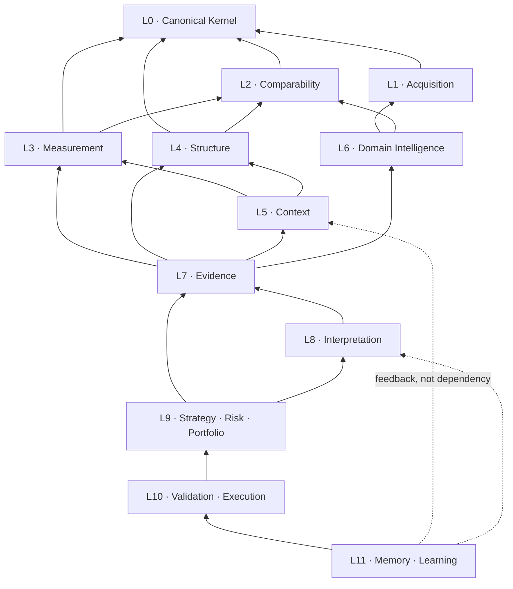

**The single rule:** an arrow may only point downward. `fmis.data` imports nothing; every layer
imports only what is beneath it; the feedback from L11 is a *data* path, never an import.

### 9.2 Module dependency map — actual imports today

Extracted from every executable import statement in `src/fmis`. **Docstring mentions excluded.**

```mermaid
graph TD
    subgraph ISLAND_A["ISLAND A · MEASUREMENT — 4,862 LOC · 43.7 % · has data + consumer"]
        AI1["ingest"]
        AP["providers<br/>binance"]
        AF["features"]
        AA["alignment"]
        AR["relative_value"]
        APIPE["<b>pipeline</b><br/>composition root"]
        ADS["decision_support"]
    end

    subgraph ISLAND_B["ISLAND B · STRUCTURE — 5,695 LOC · 51.2 % · no data, no consumer"]
        BMS["market_structure"]
        BST["structural_trend"]
        BSC["series_context"]
        BLC["level_crossing"]
        BSB["structure_break"]
        BCH["change_of_character"]
    end

    subgraph ORPHAN["UNWIRED — 559 LOC · 5.0 %"]
        OE["evidence"]
        OT["trading_context"]
    end

    KERNEL["<b>fmis.data</b><br/>L0 kernel — the ONLY shared node"]

    AI1 --> KERNEL
    AP --> KERNEL
    AP --> AI1
    AF --> KERNEL
    AA --> KERNEL
    AR --> KERNEL
    APIPE --> KERNEL
    APIPE --> AA
    APIPE --> AF
    APIPE --> AP
    APIPE --> AR
    ADS --> APIPE

    BMS --> KERNEL
    BST --> BMS
    BSC --> KERNEL
    BSC --> BMS
    BSC --> BST
    BLC --> KERNEL
    BLC --> BMS
    BLC --> BSC
    BSB --> BLC
    BSB --> BMS
    BSB --> BSC
    BCH --> BSB
    BCH --> BLC
    BCH --> BSC

    style KERNEL fill:#1a4d2e,color:#fff
    style APIPE fill:#1a3a4d,color:#fff
    style ISLAND_B fill:#3a2a1a
    style ORPHAN fill:#4d1a1a
```

**Verified:** zero edges between Island A and Island B. Zero cycles anywhere. `evidence` and
`trading_context` have zero inbound edges.

### 9.3 Pipeline dependency map — asset-agnostic instrument journey

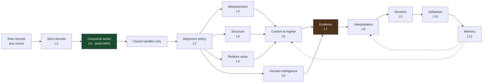

### 9.4 Data flow map — what crosses each boundary

| From → To | Artifact | Immutable | Carries provenance |
|---|---|:---:|:---:|
| Venue → L1 | Raw records | no | — |
| L1 → L0 | `CandleSeries` · `ObservationSeries` | ✅ | ✅ |
| L0 → L2 | Canonical series + `SeriesIdentity` | ✅ | ✅ |
| L2 → L3/L4 | Aligned series + `AlignmentReport` · `ContextualSeries` | ✅ | ✅ |
| L3 → L5/L7 | `FeatureSet` · `RelativeValueResult` | ✅ | ✅ |
| L4 → L5/L7 | Swings · levels · crossings · breaks · character changes | ✅ | ✅ |
| L5 → L7 | Composite states · regime + evidence + uncertainty | ✅ | ✅ |
| L6 → L7 | Domain metrics + data quality | ✅ | ✅ |
| L7 → L8 | `EvidenceReport` — **the last deterministic artifact** | ✅ | ✅ |
| L8 → L9 | Interpretation · scenarios · uncertainty | ❌ | ✅ (inputs) |
| L9 → L10 | Versioned strategy conditions · sized candidates | ✅ | ✅ |
| L10 → L11 | Fills · outcomes · monitoring state | ✅ | ✅ |
| L11 → L5/L8 | Revised priors · knowledge — **data, never an import** | ✅ | ✅ |

### 9.5 Future expansion map

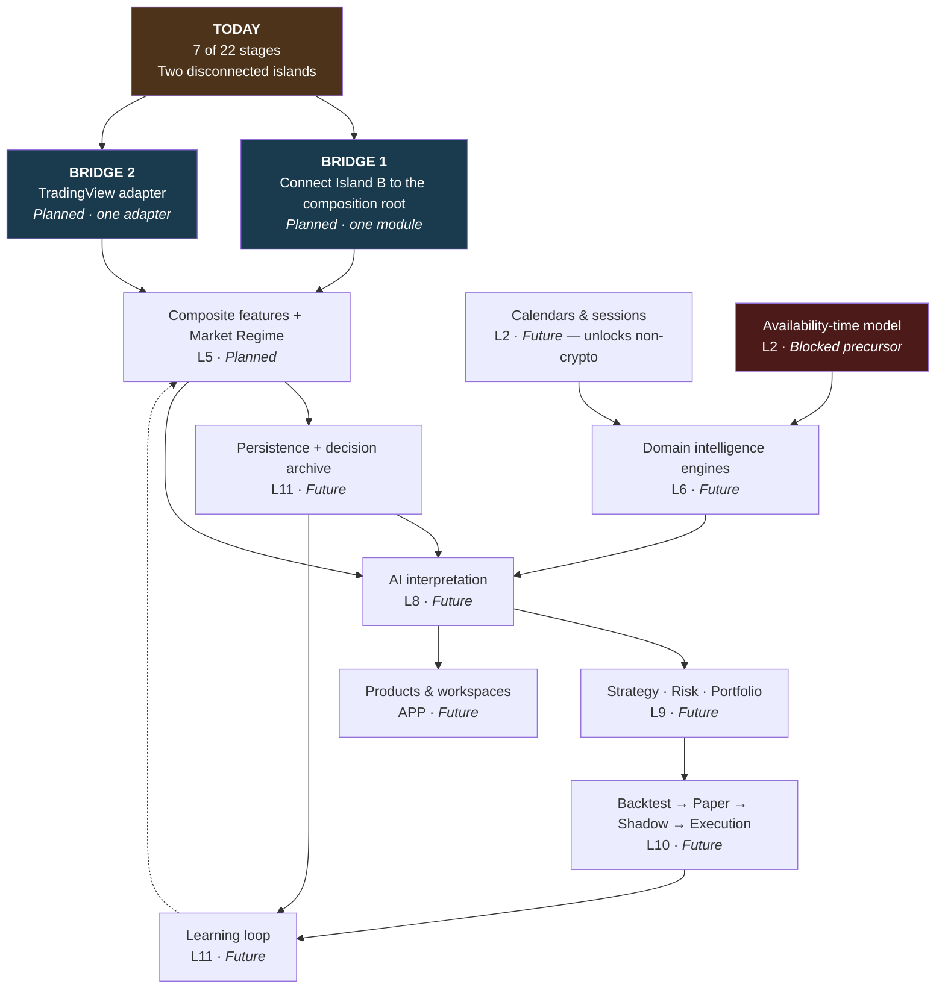

---

## 10. Architectural bottlenecks

Ordered by architectural consequence, not by effort.

### 10.1 The two-island split — **the primary bottleneck**

**What.** 51.2 % of the codebase sits in a dependency island with no provider path and no consumer.
`fmis.pipeline` — the only module allowed to compose engines — imports five packages and none of the
six structural ones.

**Why it is architectural rather than incidental.** The composition root defines what the system *can*
do. Anything it cannot reach is, from the platform's perspective, not part of the platform. Ten
milestones of structural work are architecturally invisible.

**Consequence if unaddressed.** Every additional structural milestone widens the gap: more capability
that no application can invoke, more contracts hardening without a consumer to validate them against
real data, and — most costly — **no feedback**. The structural chain has never been run against a live
series end to end through an application layer, so nothing has stress-tested its ergonomics.

**Fix.** One module: a structural analysis composition root, obeying ADR-0007's three properties, that
takes a canonical series from a provider and returns the structural facts. Small, additive, and it
changes no existing package. §11.2 places it.

### 10.2 The evidence layer is bypassed

**What.** `fmis.evidence` implements ADR-0011's taxonomy — families, descriptors, catalog — and no
production module imports it. `fmis.decision_support` independently built its own vocabulary in
`classification.py`.

**Why it matters more than 358 LOC suggests.** The evidence taxonomy is **the designated entry path
for all L6 domain intelligence**. `FeatureCategory` is technical-only and test-enforced, so macro,
news, on-chain and derivatives evidence cannot arrive through the Feature Engine — the taxonomy is how
they were meant to reach L7. Leaving it unwired means the first intelligence engine will find no
established path and will either widen `FeatureCategory` (breaking a test-enforced boundary) or invent
a third vocabulary.

It is also the mechanism that prevents double-counting correlated evidence — the direct structural
answer to the v2 bias failure.

**Fix.** Reconcile before the first L6 engine: wire `decision_support` onto the descriptor catalog, or
supersede ADR-0011 explicitly. Report 0001 §10.1 records the same finding from the code side.

### 10.3 Decision support depends on the composition root

**What.** `fmis.decision_support` (L7) imports `fmis.pipeline` (application layer) and consumes
`AnalysisSnapshot`.

**Why it is a latent constraint.** L7 is coupled to one snapshot shape produced by one orchestrator.
A second composition root — the structural one from §10.1, or the Daily Brief, or the Scanner — cannot
feed decision support without either producing that same snapshot type or changing L7.

**Not urgent, but not free.** It works today and was a reasonable v1 decision. It becomes a real
constraint the moment a second orchestrator exists, which §10.1's fix creates. Worth deciding
deliberately then: either L7 accepts a narrower protocol than the full snapshot, or `AnalysisSnapshot`
becomes the canonical inter-layer artifact and moves out of the application layer.

### 10.4 Missing bridges

| Bridge | Between | Consequence of absence | Status |
|---|---|---|---|
| **Structural composition root** | Island B ↔ application layer | 51.2 % of code unreachable | **Planned** |
| **TradingView adapter** | Library ↔ the working product | The daily workflow uses none of the tested code | **Planned** |
| **Evidence taxonomy wiring** | `fmis.evidence` ↔ L7 | No established path for L6 intelligence | **Planned** |
| **Calendar layer** | L2 ↔ non-crypto assets | Multi-asset support cannot begin | **Future** |
| **Availability-time model** | L2 ↔ macro and fundamentals | Two full L6 engines blocked | **Blocked** |
| **Persistence** | L11 ↔ everything | Nothing measurable over time | **Future** |

### 10.5 Highest-value architectural improvements

Ranked by architectural leverage. Items 1–3 are **Planned** — they have homes and specifications.
Items 4–6 are **Candidate** — my recommendations, not project vision.

| # | Improvement | Why highest-value | Status |
|---:|---|---|---|
| **1** | **Structural composition root** | Makes 51.2 % of the codebase reachable. One additive module; changes no existing package | **Planned** |
| **2** | **TradingView adapter** | Connects the architecture to the only working product; lets library output be compared against the prompt's — the most informative experiment available | **Planned** |
| **3** | **`LevelOrigin` confirmation delay** | The single largest correctness hazard in the chain, and the only one a caller can trip **with no error raised**. Every layer above inherits it | **Planned** |
| 4 | Wire or supersede the evidence taxonomy | Unblocks the L6 entry path before the first intelligence engine hardens a third vocabulary | **Candidate** |
| 5 | CI + type checking | 3,221 tests, 96 % coverage and full type annotations, none of it verified automatically | **Candidate** |
| 6 | Persistence + decision archive | Four of six `SPEC` §25 success criteria are L11 obligations; none is measurable today | **Candidate** |

### 10.6 Technical debt

| Debt | Impact | Recorded |
|---|---|---|
| `_require_envelope` duplicated ×4, with docstrings asserting the messages match and no test enforcing it | Low now; grows with each new contextual pipeline | Report 0001 §5.3 |
| Six empty Tier-2 placeholder packages | Navigation cost; unmoved since Milestone C | Report 0001 §5.2 |
| `features/market_structure` TODO lists shipped BOS/CHoCH as unbuilt | Misleads readers | Report 0001 §7.3 |
| `ARCHITECTURE_AND_ROADMAP_V1.md` marked authoritative but ~2 months stale in §2 | Misleads newcomers; §4–§9 remain sound | Report 0001 §7.2 |
| Stale `SOURCES.txt`, no tags, 34 merged branches | Cosmetic | Report 0001 §5.5, §8 |

### 10.7 Scaling risks

| Risk | Trigger | Mitigation |
|---|---|---|
| **O(N²) backtesting** | First serious backtest | Land the additive `compute_series()` **before**, not during (review R5) |
| **O(candles × levels) crossing volume** | Wide level sets over long series | Known and by design; a level-selection policy will be needed |
| **Numeric type mismatch** | First risk or portfolio module | Money/portfolio types need their own ADR before L9 (review R11) |
| **Twelve flat L6 siblings** | First intelligence engine | Group under one namespace before the first, not after the fifth |
| **Look-ahead bias** | First macro or fundamental data | **Already mitigated by a formal block** — ADR-0003 |
| **Serialization** | First persistence | `MappingProxyType` is not directly JSON-serializable; open question `ARCH` §13.8 |
| **Multi-timeframe identity** | First 1W/1D/4H composition | Deferred, but `SPEC` §5 makes it the *defining* structure of swing analysis — it will arrive sooner than "deferred" implies |

### 10.8 Architectural risks

1. **Building downward forever.** Thirty milestones have produced an exceptional foundation and no
   product. The risk is not quality — it is that each new layer increases the distance to a consumer.
   Bridges 1 and 2 are the structural answer.
2. **Contracts hardening without consumers.** Island B's contracts have never met a real caller. Every
   milestone that passes makes them more expensive to adjust when one arrives.
3. **The `FeatureCategory` boundary meeting L6.** Technical-only is test-enforced, correctly. The first
   intelligence engine will press on it, and the taxonomy that was meant to absorb that pressure is
   unwired (§10.2).
4. **Documentation drift outpacing decisions.** The ADRs are current; two navigational summaries are
   not. Newcomers read the summaries first.
5. **Asset-agnosticism eroding at Admission Point 2.** The core is clean today. The first equity
   adapter will need calendars, and calendars are the easiest place for asset-class logic to leak
   upward if the layer is not created deliberately.

---

## 11. Architecture evolution

**Not a schedule.** Six maturity stages, each defined by an *architectural property* the system either
has or does not have. A stage is complete when its property holds, regardless of how long it took.


### 11.1 M1 · Foundation — **achieved**

**Property:** *every deterministic fact the system needs about a single price series can be computed
reproducibly, and proven correct.*

Canonical models, strict ingestion, one adapter, alignment, identity, the Feature Engine with four
indicators and volume, the complete structural chain, relative value v1a, evidence v1. Zero cycles,
zero runtime dependencies, 96 % coverage, 21 ADRs.

**This stage is complete and should not be extended further before M2.** Additional structural depth
compounds the problem M2 exists to solve.

### 11.2 M2 · Connected — **the current frontier**

**Property:** *every line of the codebase is reachable from real market data through a composition
root, and the working product uses the library.*

**Architectural changes required:**
1. A **structural composition root** — Island B's `fmis.pipeline` equivalent, obeying ADR-0007's three
   properties. Additive; changes no existing package.
2. A **TradingView adapter** at L1, so the daily workflow's data enters the architecture.
3. The **`LevelOrigin` confirmation delay**, so the structural chain cannot be silently misconfigured
   by its first real caller.
4. Resolution of §10.3 — whether L7 accepts a narrower protocol than a full `AnalysisSnapshot`, now
   that a second orchestrator exists.

**Why this stage before any other.** It converts 51.2 % of existing work from potential into capability
without building a single new engine, and it produces the first genuine feedback the structural
contracts have ever received.

### 11.3 M3 · Contextual

**Property:** *the system produces states, not just numbers — and the regime call lives in versioned
code rather than in a prompt.*

Composite Feature Layer in the Tier-2 packages · Market Regime Engine with evidence and uncertainty ·
support/resistance · rule-based patterns · evidence taxonomy reconciled and wired.

**Why this is the stage that addresses the founding failure.** The v2→v3 post-mortem's root cause was
regime judgment living where it could not be diffed, versioned or tested. M3 is where it moves.

### 11.4 M4 · Multi-asset

**Property:** *a second asset class is supported with no change to any layer above L2.*

Calendars and sessions at L2 (Admission Point 2) · a second adapter family · day-count and
annualization conventions decided · corporate-action normalization policy.

**The completion test is precise:** adding equities must require exactly one adapter and one calendar,
and touch nothing in L3–L11. If it requires more, the asset-agnosticism claim was false and this
blueprint's §5 must be revisited.

### 11.5 M5 · Interpreted

**Property:** *the system reasons over evidence, and every reasoning step rests on a replayable
foundation.*

Domain intelligence engines in dependency order — availability-time model first, then macro, then the
rest · AI interpretation at L8 · scenario analysis · strategy, risk and portfolio at L9 · first
product surfaces.

**Prerequisites that must not be discovered late:** the money/portfolio numeric ADR before L9; the
`compute_series()` extension before backtesting; the L6 entry path before the first intelligence engine.

### 11.6 M6 · Learning

**Property:** *the system measurably improves, because what it concluded and what happened are both
recorded and compared.*

Persistence · decision and outcome archive · journal · monitoring · measured performance · the
feedback loop from L11 into L5 and L8 · validation ladder through shadow mode · controlled execution
only if and when everything above has demonstrated calibration.

**This is where `SPEC` §25's success criteria are actually met.** Four of the six — real structured
data, preserved history, measured performance, improvement through documented evidence — are L11
obligations. Until M6 the system can be *correct* but never demonstrably *useful*.

### 11.7 Extension seams

The named places the architecture is designed to grow. A new capability should attach to one of these
rather than introduce a new pattern.

| Seam | Extends by | Constraint |
|---|---|---|
| `Feature` protocol | Adding an indicator or composite | Closed candles, explicit warm-up, provenance, no direction label |
| Provider adapter contract | Adding a venue or data domain | Must not require changes above L1 |
| Alignment policy | Adding a comparability rule | Must be named, explicit, and reported |
| `ContextualSeries` envelope | Adding an identity-carrying layer | Identity preserved end to end |
| Evidence family | Admitting a new evidence category | Diversity-weighted, never counted |
| `FeatureCategory` | Currently technical-only, test-enforced | **L6 must enter via the taxonomy, not by widening this** |
| Composition root | Adding an application or product | ADR-0007's three properties |
| Report numbering | Adding a durable record | Global sequential, never reused |

---

## 12. Complete blueprint

```mermaid
graph TB
    subgraph PRODUCTS["🖥️ PRODUCT LAYER — composition roots · no logic · 2 of 11 built"]
        direction LR
        PR1["✅ TradingView Workspace<br/><b>not connected</b>"]
        PR2["✅ Report Generator"]
        PR3["◐ CLI"]
        PR4["○ Trading · Investment · Research<br/>Portfolio Workspaces"]
        PR5["○ Daily Brief · Scanner · Dashboard"]
        PR6["? Financial Terminal"]
    end

    subgraph L11B["🧠 L11 · MEMORY &amp; LEARNING — closes the loop"]
        direction LR
        MA["○ Persistence · Decision Archive"]
        MB["◐ Knowledge Base — docs · ADRs · reports"]
        MC["? Journal"]
        MD["○ Monitoring · Continuous Improvement"]
    end

    subgraph L10B["🔐 L10 · VALIDATION &amp; EXECUTION — the ladder"]
        direction LR
        VA["○ Backtesting · Robustness"]
        VB["○ Paper Trading · Shadow Mode"]
        VC["○ Execution — isolated · disabled by design"]
    end

    subgraph L9B["⚖️ L9 · STRATEGY · RISK · PORTFOLIO"]
        direction LR
        SA["○ Strategy Engine — only source of signals"]
        SB["○ Risk Engine · Position Sizing"]
        SC2["○ Portfolio Intelligence"]
    end

    subgraph L8B["🤖 L8 · INTERPRETATION — AI begins here"]
        direction LR
        IA["○ AI Interpretation"]
        IB["○ Scenario Analysis"]
        IC["◐ Bias Control — structural today"]
    end

    subgraph L7B["📊 L7 · EVIDENCE — last deterministic artifact"]
        direction LR
        EA["✅ Decision Support v1"]
        EB["✅ Evidence Taxonomy — unwired"]
        EC["✅ Analysis Context — unwired"]
    end

    subgraph L6B["🌍 L6 · DOMAIN INTELLIGENCE — 0 of 12"]
        direction LR
        DA["⛔ Macro · Fundamentals — BLOCKED"]
        DB["○ News · Geopolitics · Calendar"]
        DC["○ On-chain · Derivatives · ETF Flows"]
        DD["○ China · IPO · Insider · Industries"]
    end

    subgraph L5B["🎯 L5 · DETERMINISTIC CONTEXT"]
        direction LR
        CA["◐ Composite Features"]
        CB["◐ Market Regime — highest leverage unbuilt"]
        CC["◐ Support/Resistance · Patterns"]
    end

    subgraph L4B["📐 L4 · DETERMINISTIC STRUCTURE — 51.2% · UNREACHABLE"]
        direction LR
        STA["✅ Swings → Relationships → Labels"]
        STB["✅ Sequence State → History → Trend"]
        STC["✅ Levels → Crossings → BOS → CHoCH"]
    end

    subgraph L3B["📈 L3 · DETERMINISTIC MEASUREMENT"]
        direction LR
        MEA["✅ Feature Engine · EMA ATR RSI MACD"]
        MEB["✅ Volume Foundation"]
        MEC["✅ Relative Value v1a"]
    end

    subgraph L2B["⏱️ L2 · COMPARABILITY — highest-risk layer"]
        direction LR
        CMA["✅ Alignment — strict intersection"]
        CMB["✅ Series Identity &amp; Context"]
        CMC["⛔ Availability-Time — BLOCKED precursor"]
        CMD["○ Calendars &amp; Sessions — unlocks multi-asset"]
    end

    subgraph L1B["🔌 L1 · ACQUISITION — asset knowledge admitted here"]
        direction LR
        ACA["✅ Ingestion — strict · no repair"]
        ACB["✅ Binance adapter — 1 of ~8"]
        ACC["◐ TradingView adapter"]
    end

    L0B["🧱 <b>L0 · CANONICAL KERNEL</b> — imports nothing · asset-class blind<br/>Candle · CandleSeries · ObservationSeries · SeriesIdentity · UTC contract"]

    PLATB["🔧 <b>CROSS-CUTTING</b> — Security ✅ · Environment ✅ · Documentation ✅ · CI/CD ?"]

    PRODUCTS --> L11B --> L10B --> L9B --> L8B --> L7B
    L7B --> L6B
    L7B --> L5B
    L5B --> L4B
    L5B --> L3B
    L6B --> L2B
    L4B --> L2B
    L3B --> L2B
    L2B --> L1B --> L0B
    PLATB -.-> L0B
    L11B -.->|"feedback"| L5B
    L11B -.->|"feedback"| L8B

    style L0B fill:#1a4d2e,color:#fff
    style L1B fill:#1a4d2e,color:#fff
    style L2B fill:#1a4d2e,color:#fff
    style L3B fill:#1a4d2e,color:#fff
    style L4B fill:#3a2a1a,color:#fff
    style L5B fill:#4d3319,color:#fff
    style L6B fill:#4d1a1a,color:#fff
    style L7B fill:#4d3319,color:#fff
    style L8B fill:#4d1a1a,color:#fff
    style L9B fill:#4d1a1a,color:#fff
    style L10B fill:#4d1a1a,color:#fff
    style L11B fill:#4d1a1a,color:#fff
```

**Legend:** ✅ Implemented · ◐ In Progress or Planned · ○ Future · ⛔ Blocked · ? Unknown

### What the blueprint shows in one reading

- **The stack is real from L0 to L4** and thin but present at L7. Everything above L7 is unbuilt.
- **L4 is brown, not green,** despite being fully implemented — because it is unreachable from any
  composition root. That is the single most important visual fact on this page.
- **The two blocked items are both at L2**, and both block L6 engines. Comparability is the gate.
- **The AI boundary sits between L7 and L8**, exactly where the last replayable artifact is produced.
- **The loop closes only through L11**, which is why deferring it indefinitely caps the system's value.
- **Asset-class knowledge enters only at L1, L2 and L5/L8.** The green core is asset-blind, verified.
- **The one working product is attached to nothing.**

---

## 13. Consistency with Reports 0001 and 0002

Report 0002 must not be modified. Where this blueprint organizes or classifies differently, the
difference and its reason are recorded here.

### 13.1 Different organizing axis — by design

| | Report 0002 | Report 0003 |
|---|---|---|
| **Question** | *What is FMITS?* | *How does FMITS work as one architecture?* |
| **Axis** | Domain — what things **are** | Layer — where things **sit** and what they may **depend on** |
| **Unit** | 70 domains in 7 groups | 12 layers + cross-cutting platform |
| **Method** | Documentary — reading the vision and the docs | Structural — extracting the import graph |

**Neither supersedes the other.** A domain map answers "does the system cover X?"; a layered blueprint
answers "where does X live and what may it call?" Both are needed, and they describe the same system.

### 13.2 Status taxonomy mapping

Report 0002 used nine statuses; this blueprint uses the seven required here. The mapping is
deterministic:

| Report 0002 | Report 0003 | Reason |
|---|---|---|
| Implemented | **Implemented** | Identical |
| In Progress | **In Progress** | Identical |
| Blocked | **Blocked** | Identical |
| Designed *(spec only)* | **Planned** | 0003 defines *Planned* as "has a home and a specification". Composite Features and Market Regime meet it |
| Planned | **Planned** | Identical |
| Deferred | **Planned** *or* **Future** | 0003 has no *Deferred*. Deferral is a scheduling fact, not an architectural one. Items with a home *and* a contract → Planned; items with only a vision mention → Future |
| Future Vision | **Future** | Renamed only |
| Partially implemented | **Implemented** *(qualified)* or **In Progress** | Judged per case; the qualification is always stated |
| Unknown *(no source)* | **Unknown** *or* **Candidate** | Unknown where no recommendation is made; Candidate where 0002 §17 recommended it |

Two specific reclassifications worth naming:

- **Knowledge Base** — 0002 split it across *Implemented (docs)* and *Planned (research KB)*. Here it
  is **In Progress**, because in a layered view it is one L11 component at partial maturity.
- **Bias Control** — 0002 marked it *Partially implemented (by construction)*. Here it is a property
  of L8 with structural enforcement today, so it appears as **In Progress** within L8.

### 13.3 Asset classes regrouped — the most significant difference

Report 0002 Group F treated the ten asset classes (D-52 … D-61) as **domains**. This blueprint does
not, because **in a layered architecture an asset class is not a module.** It is a combination of an
adapter (L1), a calendar (L2), interpretation rules (L5/L8), and possibly a native evidence engine
(L6). Treating it as a domain would imply a per-class code path, which is exactly the fragmentation
this document is required to prevent.

They therefore appear in §5.3 as instantiations of the Universal Instrument Contract. **Nothing is
dropped** — all ten are covered, with their differences and admission points named.

### 13.4 New findings not present in Report 0002

| Finding | Why it appears only here |
|---|---|
| **The two-island split** (§1.4, §9.2, §10.1) | Requires the executable import graph. 0002 worked from documents and product surfaces; it found the library↔prompt gap but not this library↔library gap |
| **Asset-agnosticism verified** (§5.1) | Required a source-wide vocabulary search; 0002 did not make this claim |
| **The Three Admission Points** (§5.2) | An architectural rule derived here; not stated in 0002 or in any project document |
| **L7 depends on the composition root** (§10.3) | An import-direction observation |
| **The evidence taxonomy is the L6 entry path** (§10.2) | 0002 and 0001 noted the module was unwired; the *consequence for L6* is identified here |

### 13.5 Consistency with Report 0001

Fully consistent; this blueprint extends 0001's findings architecturally rather than restating them.

| Report 0001 finding | Treatment here |
|---|---|
| §5.1 — `fmis.evidence` is dead code | §10.2, extended: it is also L6's designated entry path |
| §10.2 — no CI | Cross-cutting platform, **Unknown**; §10.5 item 5, **Candidate** |
| §5.3 — `_require_envelope` ×4 | §10.6, technical debt |
| §7.2 — architecture doc stale | §10.6; Appendix B of 0002 governs precedence |
| §4 — zero circular dependencies | §1.5 and §9.2, re-verified at `d132cea` |
| §9 — 96 % coverage, 3,221 tests | §1.5, unchanged |

### 13.6 Consistency with the vision documents

No new scope is introduced. Every subsystem traces to `PROJECT_SPECIFICATION_V1.md`,
`PROJECT_VISION_ADDENDUM_V1.md`, an ADR, a design record, or the repository. Items with no such source
are marked **Unknown**, and my own proposals are marked **Candidate** and confined to §10.5 items 4–6,
§8.2's namespace note, and §11.6.

Specifically preserved without alteration: the `Data → Deterministic → Features → AI → Decision
support` pipeline · deterministic-first, AI-second · `WAIT`/`NO TRADE` as successful outcomes · the
2 % ceiling · the automation ladder · long-term investing as a separate discipline · no vendor
lock-in · one reliable layer at a time · every stated exclusion in Report 0002 §14.6.

---

## 14. Validation

Performed before finalizing.

| # | Check | Method | Result |
|---:|---|---|---|
| 1 | Consistency with Report 0001 | Re-read; cross-referenced §13.5 | ✅ No contradictions |
| 2 | Consistency with Report 0002 | Re-read; all 70 domain IDs extracted and reconciled; §13 documents every difference | ✅ Consistent; 0002 unmodified |
| 3 | Consistency with `PROJECT_SPECIFICATION_V1.md` | Re-read in full; §2 principles and §4 pipeline traced to sections | ✅ No contradictions |
| 4 | Consistency with `PROJECT_VISION_ADDENDUM_V1.md` | Re-read in full; all 15 Core Modules located in the layer model | ✅ All placed |
| 5 | Consistency with the repository | Import graph re-extracted at `d132cea`; LOC per island computed; asset-vocabulary search run | ✅ Verified |
| 6 | Diagrams render | 11 Mermaid blocks; all labels quoted; fences balanced; no unquoted parentheses or arrows in node text | ✅ Valid |
| 7 | No duplicated sections | Heading list reviewed; each of the 12 required sections appears exactly once | ✅ None |
| 8 | No contradictions | Status of every subsystem cross-checked between §3, §4.1, §8, §12 | ✅ Consistent |
| 9 | No invented scope | Every entry carries a traceable source; unsourced items marked **Unknown**; own proposals marked **Candidate** and isolated | ✅ Clean |
| 10 | Every module has an architectural location | All 17 existing packages placed in §8.1; all 17 missing packages given proposed homes in §8.2 | ✅ Complete |
| 11 | Architecture is asset-agnostic | Source-wide vocabulary search: 5 matches outside adapters, all docstrings, all *asserting* agnosticism | ✅ Verified |
| 12 | Every required direction covered | All 24 items from the mission's critical-requirement list located in §3–§6 | ✅ Complete |
| 13 | Status classification never mixed | Each entry carries exactly one of the seven statuses | ✅ Clean |
| 14 | Report conventions followed | Metadata header, numbering, index row, next-number bump, archive rules | ✅ Followed |

### 14.1 Verification commands used

```
# Import graph — executable imports only, docstrings excluded
python3: regex over src/fmis/**/*.py for ^\s*(from|import)\s+fmis[\w.]*
  → 13 package edges, 0 cycles, 0 edges between Island A and Island B

# Island sizes
Island A (data, ingest, providers, features, alignment,
          relative_value, pipeline, decision_support)   4,862 LOC   43.7 %
Island B (market_structure, structural_trend, series_context,
          level_crossing, structure_break, change_of_character)  5,695 LOC   51.2 %
Unwired  (evidence, trading_context)                      559 LOC    5.0 %
Total                                                  11,128 LOC

# Asset-class vocabulary outside adapters
grep -riE '\b(crypto|bitcoin|btc|eth|coin|token|binance|usdt|blockchain)\b' src/fmis
  excluding providers/  → 5 matches, all docstrings, none logic
```

### 14.2 Limitations of this blueprint

1. **It describes structure, not behaviour.** Layer placement says what *may* call what, not what a
   correct implementation of an unbuilt layer looks like.
2. **L8–L11 are boundary definitions only.** No orchestration, storage schema, or execution design is
   proposed — deliberately, and per instruction for §7.
3. **The Three Admission Points rule (§5.2) is derived, not sourced.** It is consistent with every
   project document and with the code, but no approved document states it. Treat it as this
   blueprint's architectural contribution, subject to acceptance.
4. **Layer assignment for unbuilt modules is a proposal.** L6's `fmis/intelligence/*` grouping in
   particular is marked **Candidate**.
5. **`MASTER_PROJECT_CONTEXT`, `MASTER_PROJECT_CONTEXT_TRANSFER` and "Financial OS Vision" remain
   unavailable** (Report 0002 §2.2). If they exist, this blueprint needs reconciling against them.

---

*Report 0003 · FMITS Architecture Blueprint V1 · 2026-08-01 · `d132cea`*
*Predecessors: [0001 Repository Audit](0001_2026-07-31_REPOSITORY_AUDIT.md) · [0002 FMITS Master Map](0002_2026-07-31_FMITS_MASTER_MAP.md)*
