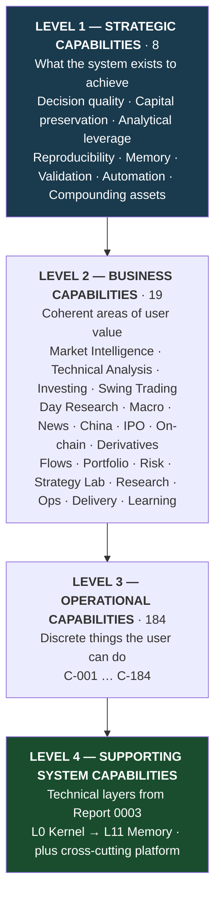
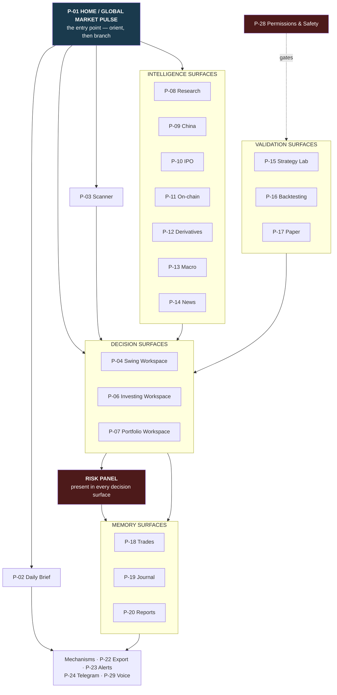
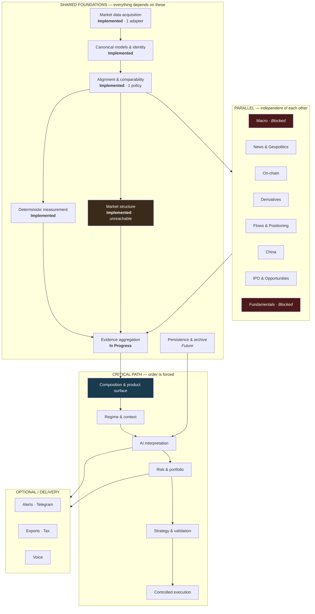
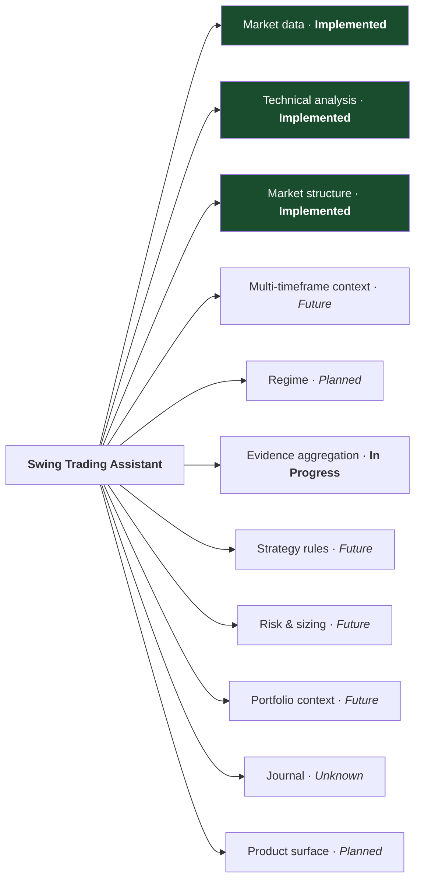
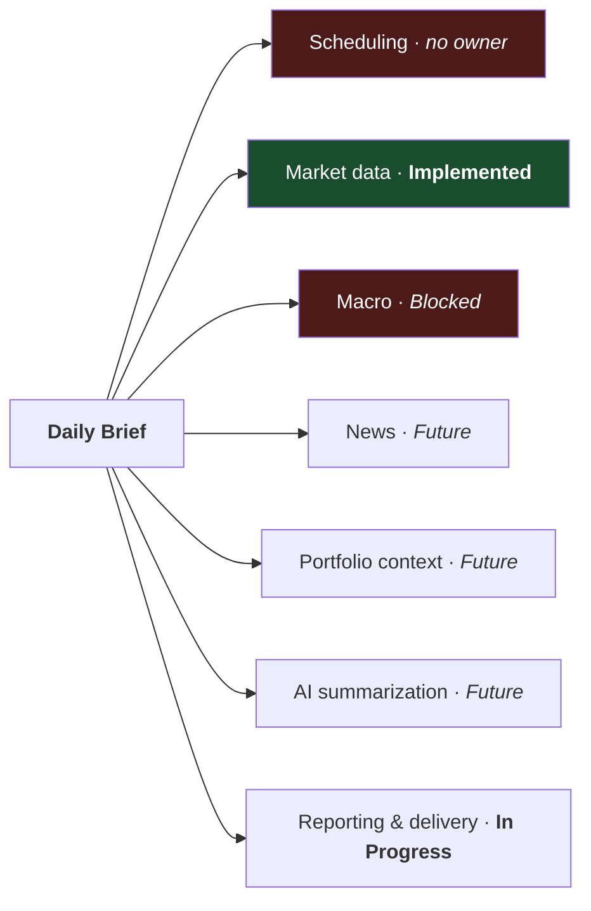
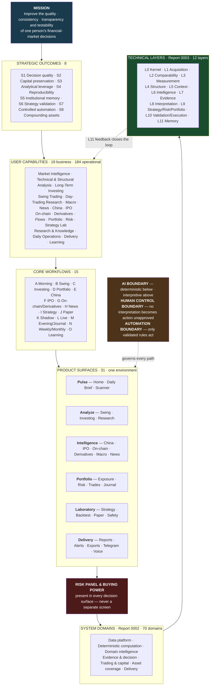

# FMITS Business & Capability Architecture V1

| Field | Value |
|---|---|
| **Report number** | 0004 |
| **Title** | FMITS Business & Capability Architecture V1 |
| **Date** | 2026-08-01 |
| **Report type** | Business & Capability Architecture |
| **Model** | Claude Opus 5 |
| **Repository branch** | `main` |
| **Audited commit** | `d132cea` |
| **Status** | Final |

**Predecessors.** [0001 Repository Audit](0001_2026-07-31_REPOSITORY_AUDIT.md) — what the code is.
[0002 FMITS Master Map](0002_2026-07-31_FMITS_MASTER_MAP.md) — what the system is.
[0003 Architecture Blueprint V1](0003_2026-08-01_FMITS_ARCHITECTURE_BLUEPRINT_V1.md) — how it works
technically.

**This report answers a different question.** Not *how does it work*, but **why it exists, what it must
let Dovydas do, and how it becomes useful in real daily work before the platform is complete.**

It begins from financial-market activities and decisions, not from packages. Report 0003 remains the
technical authority; this document is the capability authority. Neither replaces the other (§18.2).

---

## Source discipline

Every substantive statement carries one of five tags. Nothing is silently promoted from
recommendation to project vision.

| Tag | Meaning |
|---|---|
| **`[INTENT]`** | **Approved project intent** — stated in `PROJECT_SPECIFICATION_V1.md`, `PROJECT_VISION_ADDENDUM_V1.md`, or an accepted ADR |
| **`[BUILT]`** | **Verified current repository capability** — working, tested code at `d132cea` |
| **`[IMPLIED]`** | **Architectural implication** — follows necessarily from approved intent plus the architecture in Report 0003. Not separately approved |
| **`[REC]`** | **Independent architect recommendation** — mine, not project vision. Confined to §16 and always flagged inline |
| **`[OPEN]`** | **Open question** — named somewhere (often in the mission brief for this report) but with no source in any approved document and no decision recorded. Requires a decision to enter scope |

**Maturity** uses the seven statuses established in Report 0003 §Status classification:
**Implemented · In Progress · Planned · Future · Blocked · Unknown · Candidate.** Never mixed.

### A note on this report's own brief

The mission brief that requested this document names many capabilities that appear in no approved
project document — *Global Market Pulse*, *Buying Power*, voice interface, AI budget tracking, system
health, multi-portfolio support, factor exposure, walk-forward testing, strategy retirement, index
inclusions, TVL, bridges, and others. Per the brief's own instruction — *"Do not automatically remove
unsourced ideas. Mark them as open decisions."* — these are carried as **`[OPEN]`** and consolidated
in §15.

An important distinction is applied throughout: some brief items are **new names for approved intent**
(Global Market Pulse ≈ `SPEC` §12 + §24; Buying Power ≈ `SPEC` §8.2), while others are **genuinely new
scope** (Tax Center, voice interface, commercial product). The first are tagged `[INTENT]` with a note
on the naming; only the second are `[OPEN]`.

### Unavailable sources — gap recorded

Reports 0002 (§2.2) and 0003 (§14.2) both record that `MASTER_PROJECT_CONTEXT`,
`MASTER_PROJECT_CONTEXT_TRANSFER` and "Financial OS Vision" could not be found in the repository or
in Google Drive. **That gap persists and is restated here**, because a business-capability document is
exactly where their absence would most likely matter: if those documents contain capability
commitments, this map is incomplete against them. Nothing in this report derives from them.

---

## Table of contents

1. [Executive summary](#1-executive-summary)
2. [Mission architecture](#2-mission-architecture)
3. [User model](#3-user-model)
4. [Complete capability map](#4-complete-capability-map)
5. [Capability hierarchy](#5-capability-hierarchy)
6. [End-to-end user workflows](#6-end-to-end-user-workflows)
7. [Product and workspace architecture](#7-product-and-workspace-architecture)
8. [Global Market Pulse](#8-global-market-pulse)
9. [Buying power and capital allocation](#9-buying-power-and-capital-allocation)
10. [Business rules and non-negotiable policies](#10-business-rules-and-non-negotiable-policies)
11. [Business capability dependency map](#11-business-capability-dependency-map)
12. [Value delivery architecture](#12-value-delivery-architecture)
13. [Current-state capability gap](#13-current-state-capability-gap)
14. [Business architecture risks](#14-business-architecture-risks)
15. [Scope boundaries](#15-scope-boundaries)
16. [Independent architect vision](#16-independent-architect-vision)
17. [Final business and capability model](#17-final-business-and-capability-model)
18. [Consistency review](#18-consistency-review)

---

## 1. Executive summary

### 1.1 What FMITS is, as a product

**FMITS is a personal Financial Market Intelligence Operating System.** `[INTENT]`

It is a single environment in which market data is collected, computed, structured, interpreted,
decided upon, recorded, and reviewed — across every asset class, for both investing and trading, with
one shared foundation.

It is explicitly **not** any of the things it superficially resembles:

| Not this | Because |
|---|---|
| A trading bot | Its output is a *better-reasoned decision*, not an order. Execution is the last rung of an eight-step ladder, isolated and disabled by default `[INTENT]` |
| A technical-analysis library | TA is one evidence family among nine. Macro, news, on-chain, derivatives, flows and fundamentals are peers, not add-ons `[INTENT]` |
| A dashboard | Presentation without stable deterministic facts inverts the pipeline `[INTENT]` |
| A portfolio tracker | It measures *risk and exposure*, not just holdings and P&L `[INTENT]` |
| An AI chatbot | AI interprets facts it is handed; it never produces them. `SPEC` §25 defines success as being *more* than "an AI chatbot that gives market opinions" `[INTENT]` |
| A news summarizer | It analyzes *mechanism* — how an event could transmit to which assets, and whether the market actually reacted that way `[INTENT]` |

### 1.2 What makes it different from several unconnected tools

The brief asks this directly, and it has a precise answer that is architectural rather than
promotional. Using a charting site, a screener, a portfolio tracker, a news feed and a chatbot
separately gives you all the same *information*. It cannot give you five things — and each of the five
is a consequence of the parts sharing one foundation:

1. **One canonical fact set.** The EMA the chart shows, the EMA the screener ranks on, and the EMA the
   chatbot reasons about are three different numbers computed three different ways. In FMITS there is
   one computation, one provenance record, one warm-up policy. `[BUILT]`
2. **Non-duplicated evidence.** Separate tools cannot know that their signals are correlated. FMITS
   groups evidence into families precisely so that EMA trend, MACD trend and a moving-average
   crossover cannot be counted as three confirmations of one underlying momentum. `[INTENT]`
   `[BUILT — taxonomy exists, unwired]`
3. **Portfolio-aware analysis.** A screener does not know what you already hold. An analysis that
   cannot see that a "great setup" is your fourth correlated long is not decision support. `[INTENT]`
4. **A decision record that closes the loop.** Five tools produce five histories and no way to compare
   what you concluded with what happened. `SPEC` §25 makes preserved analysis history a *success
   criterion*, not a feature. `[INTENT]`
5. **Reproducibility.** A chatbot's answer today is not its answer tomorrow. Every deterministic layer
   in FMITS returns identical output for identical input, permanently — which is what makes an
   interpretation built on top of it auditable at all. `[BUILT]`

The one-line version: **disconnected tools give you information; a system gives you a decision you can
check afterwards.**

### 1.3 Who it serves

**Initially and for the foreseeable future: exactly one person.** Dovydas is simultaneously the sole
user, the operator, the product owner and the developer. `[BUILT]` — verified in Report 0002 §6.

There is no second user, no team, no customer. §3 models possible future user categories without
designing for them, because designing multi-user capability now would be building infrastructure for a
demand that does not exist.

### 1.4 Why it exists

Three reasons, all from approved vision. `[INTENT]`

1. **Decision quality.** Replace ad-hoc, emotional, bias-prone judgment with structured evidence,
   explicit uncertainty, and a record that can be measured after the fact.
2. **Capital preservation.** `WAIT` and `NO TRADE` are successful outcomes. Risk control outranks
   impressive output.
3. **Personal transition.** *"This project exists to transition from physical work toward
   knowledge-based work by mastering AI, software, automation and financial markets."*
   — `PROJECT_VISION_ADDENDUM_V1.md`

### 1.5 The transformation this supports

The third reason deserves stating plainly, because it changes what "success" means.

FMITS is **both the product and the curriculum.** Building it is how Dovydas learns software
architecture, AI systems, automation and quantitative market thinking; using it is how that learning
becomes applied skill. The 21 ADRs, the design→implement→review discipline, and the independent review
records are not overhead — they are the artifacts of that learning, and they are reusable
intellectual assets independent of any market outcome.

**What this report does not claim.** Nothing here promises income, profit, or trading performance. The
vision does not claim it either. `SPEC` §25 measures success by whether the system *uses real
structured data, preserves history, tests strategies, measures performance, exposes uncertainty,
reduces emotional decision-making, helps the user learn, and improves over time through documented
evidence* — eight criteria, none of which is a return figure. This report adopts that definition
unchanged.

### 1.6 Technical completion is not usefulness

A finding that must lead rather than follow, because it is the central business risk of this project.

Report 0003 established that the repository holds 11,128 lines of tested code, 3,221 tests, 96 %
coverage, zero circular dependencies and 21 architecture decision records — and that **it delivers
zero user-facing capability.** 51.2 % of that code sits in a dependency island unreachable from any
application layer. The only thing Dovydas can actually *use* today is a 199-line Markdown prompt that
uses none of it.

Thirty milestones of excellent engineering have produced a foundation and no usefulness. That is not a
criticism of the sequencing — building the foundation first was correct — but it means the business
architecture must now optimize for a different quantity than the technical architecture has been.
**§12 defines a value ladder, and §13 identifies the smallest vertical slice that would make the
system useful in daily work.** That slice requires no new engine, no AI, no database, and no user
interface.

### 1.7 What FMITS must become to be considered successful

Adopting `SPEC` §25 as the definition, with the capability translation of each criterion:

| `SPEC` §25 criterion | Capability translation | Status today |
|---|---|---|
| Use real structured data | A live data path reaching every analytical layer | **In Progress** — one adapter, reaching one of two islands |
| Calculate objective features | Deterministic computation of every derivable fact | **Implemented** |
| Preserve analysis history | A decision and outcome archive | **Future** — nothing persists |
| Test strategies | A strategy laboratory with honest backtesting | **Future** |
| Measure performance | Outcome tracking against recorded expectations | **Future** |
| Expose uncertainty | Explicit insufficient-data, staleness and confidence representation | **Implemented** at the fact level; **Future** at the conclusion level |
| Reduce emotional decision-making | Structured workflows with mandatory opposing-case construction | **In Progress** — enforced by prompt convention, not by system |
| Help the user learn | Explanation, comparison of decisions with outcomes | **Future** |
| Improve over time through documented evidence | The learning loop closing | **Future** |

**Two of nine met. One in progress.** That is the honest headline of this report, and it is not in
tension with the excellent technical health recorded in 0001 and 0003 — it is what those two documents
look like when read as *business* rather than *engineering* facts.

---

## 2. Mission architecture

### 2.1 The hierarchy

```
                            MISSION
        Improve the quality, consistency, transparency and
        testability of one person's financial-market decisions
                               │
                    8 STRATEGIC OUTCOMES
        Decision quality · Capital preservation · Analytical leverage
        Reproducibility · Institutional memory · Strategy validation
        Controlled automation · Compounding assets
                               │
                     USER OUTCOMES
        What Dovydas can do differently as a result
                               │
                19 BUSINESS CAPABILITIES  (§4)
        Market intelligence · Technical analysis · Investing · Swing trading
        Day-trading research · Macro · News · China · IPO · On-chain
        Derivatives · Flows · Portfolio · Risk · Strategy lab · Research
        Daily operations · Reporting · Learning
                               │
                    31 PRODUCT SURFACES  (§7)
        Views over one system — never separate applications
                               │
                     15 WORKFLOWS  (§6)
        Trigger → analysis → context → interpretation → decision
        → risk check → action → record → review → knowledge
                               │
              SUPPORTING TECHNICAL DOMAINS  (Report 0003)
        L0 Kernel · L1 Acquisition · L2 Comparability · L3 Measurement
        L4 Structure · L5 Context · L6 Intelligence · L7 Evidence
        L8 Interpretation · L9 Strategy/Risk/Portfolio
        L10 Validation/Execution · L11 Memory/Learning
```

### 2.2 The eight strategic outcomes

| # | Strategic outcome | What it means concretely | Source |
|---|---|---|---|
| **S1** | **Decision quality** | Every conclusion rests on classified, diversity-weighted evidence with its gaps stated, and on the strongest available opposing case | `[INTENT]` `SPEC` §6, §7 |
| **S2** | **Capital preservation** | Risk is computed before any position is contemplated; `WAIT` and `NO TRADE` are successful; the 2 % ceiling is structural | `[INTENT]` `SPEC` §8 |
| **S3** | **Analytical leverage** | Reduce the time and effort a thorough analysis costs, so thoroughness stops competing with convenience | `[INTENT]` `SPEC` §24 — "5–10 minutes" |
| **S4** | **Reproducibility** | Any analysis can be re-derived exactly; any conclusion can be traced to the facts it rested on | `[INTENT]` + `[BUILT]` |
| **S5** | **Institutional memory** | Research, theses, decisions, reasoning and outcomes are preserved and searchable | `[INTENT]` `SPEC` §21, §25 |
| **S6** | **Strategy validation** | No rule reaches capital without surviving backtest, robustness, paper and shadow stages | `[INTENT]` `SPEC` §11, §18 |
| **S7** | **Controlled automation** | Automation is earned rung by rung, never assumed, always reversible | `[INTENT]` `SPEC` §11, `ADDENDUM` |
| **S8** | **Compounding assets** | Software, documented decisions, tested strategies and personal skill accumulate and outlive any single market view | `[INTENT]` `ADDENDUM` Personal Mission |

### 2.3 Strategic outcome → user outcome

| Strategic outcome | What Dovydas can do differently |
|---|---|
| S1 Decision quality | See what the evidence actually supports, including what argues against him, before deciding |
| S2 Capital preservation | Know his total open risk and correlation exposure *before* adding a position, not after |
| S3 Analytical leverage | Complete a thorough multi-timeframe, multi-domain analysis in minutes instead of hours |
| S4 Reproducibility | Re-run last month's analysis and get last month's numbers |
| S5 Institutional memory | Ask "what did I think about this in March, and was I right?" and get an answer |
| S6 Strategy validation | Distinguish a strategy that works from one that fit the last two years |
| S7 Controlled automation | Delegate execution of rules he has personally validated, with hard limits and a kill switch |
| S8 Compounding assets | Own a system, a body of research and a skill set that keep their value regardless of any trade |

### 2.4 Mission-to-capability diagram

```mermaid
graph TD
    M["<b>MISSION</b><br/>Improve quality · consistency · transparency<br/>and testability of financial-market decisions"]

    S1["S1 · Decision Quality"]
    S2["S2 · Capital Preservation"]
    S3["S3 · Analytical Leverage"]
    S4["S4 · Reproducibility"]
    S5["S5 · Institutional Memory"]
    S6["S6 · Strategy Validation"]
    S7["S7 · Controlled Automation"]
    S8["S8 · Compounding Assets"]

    C_INTEL["Market Intelligence<br/>Macro · News · China · IPO<br/>On-chain · Derivatives · Flows"]
    C_ANALYSIS["Technical &amp; Structural Analysis"]
    C_INVEST["Long-Term Investing"]
    C_SWING["Swing Trading"]
    C_DAY["Day-Trading Research"]
    C_PORT["Portfolio Intelligence"]
    C_RISK["Risk Management"]
    C_LAB["Strategy Laboratory"]
    C_KNOW["Research &amp; Knowledge"]
    C_OPS["Daily Operations"]
    C_DELIV["Reporting &amp; Delivery"]
    C_LEARN["Learning"]

    M --> S1 & S2 & S3 & S4 & S5 & S6 & S7 & S8

    S1 --> C_INTEL
    S1 --> C_ANALYSIS
    S1 --> C_INVEST
    S1 --> C_SWING
    S2 --> C_RISK
    S2 --> C_PORT
    S3 --> C_OPS
    S3 --> C_DELIV
    S4 --> C_ANALYSIS
    S4 --> C_LAB
    S5 --> C_KNOW
    S6 --> C_LAB
    S7 --> C_DAY
    S8 --> C_KNOW
    S8 --> C_LEARN

    style M fill:#1a3a4d,color:#fff
    style S2 fill:#4d1a1a,color:#fff
```



---

## 3. User model

### 3.1 The current user — one person, nine roles

**Dovydas is the sole user.** `[BUILT]` He occupies nine roles simultaneously, and the tension between
them is a real architectural force: the developer role wants to build the next layer; the user role
wants something usable today.

| Role | What he needs from FMITS | Priority |
|---|---|---|
| **Investor** | Thesis research, valuation context, catalysts, risks, position role, long-horizon monitoring | High |
| **Swing trader** | Multi-timeframe setups, regime context, entry/invalidation/target logic, sizing | **Highest — first trading priority** `[INTENT]` `SPEC` §10 |
| **Portfolio owner** | Total exposure, correlation, concentration, open risk, custody and counterparty risk | High |
| **Market researcher** | Structured research on assets, sectors, regions, themes; searchable history | Medium |
| **Future day-trading researcher** | Intraday rules, backtesting, robustness — **research only, not live** `[INTENT]` | Deferred by explicit policy |
| **Learner** | Explanation of what a measurement means and why an architecture is shaped that way | Continuous |
| **Product owner** | Scope decisions, priority, what counts as done | Continuous |
| **System operator** | Running it, keeping data flowing, noticing when something breaks | Continuous |
| **Developer** | A codebase that stays comprehensible and testable as it grows | Continuous |

**The architectural consequence of one user.** Several things that would be mandatory in a product are
correctly absent: authentication, authorization, multi-tenancy, per-user configuration, audit trails
for compliance, rate limiting between users, and onboarding. **None of these should be built.**
`[IMPLIED]` Building them would be infrastructure for demand that does not exist — risk R3 in §14.

### 3.2 Possible future user categories

Recorded so the architecture does not accidentally foreclose them. **No commercial product is being
designed, and no work should be done for these today.** `[OPEN]`

| Category | Would need that today's design lacks | Foreclosed by current design? |
|---|---|---|
| Advanced individual investor | Onboarding, configuration, hosted data | No — the layered architecture supports it |
| Active trader | Lower-latency data, intraday adapters | No |
| Research-oriented user | Export, citation, reproducible research artifacts | No |
| Small internal team | Multi-user identity, shared portfolios, permissions, concurrency | **Partially** — single-user assumptions in portfolio and journal design would need revisiting |
| Commercial customer | Everything above plus support, SLA, billing, compliance, data licensing | Not designed for; not foreclosed |

**The one thing worth noting now.** Data licensing is the constraint most likely to bite later: most
market-data agreements permit personal use and forbid redistribution. A capability built on
personal-use data cannot become a product without renegotiating every provider contract. `[IMPLIED]`
This is not a reason to change anything today — only a reason to know it.

---

## 4. Complete capability map

**184 operational capabilities across 19 business capabilities.**

**Definition of v1** `[IMPLIED]` — the brief asks whether each capability belongs "before or after v1"
without defining v1. This report defines it, because otherwise the classification is meaningless:

> **v1 is the first version of FMITS that is genuinely useful in Dovydas's daily work without the
> TradingView prompt doing the analysis** — equivalently, **Value Level 3** in §12: a daily
> market-intelligence workflow over real data, with deterministic facts, structure, context and
> evidence, read through a real product surface.
>
> v1 explicitly does **not** include: AI interpretation, strategy automation, backtesting, execution,
> most L6 intelligence engines, or portfolio integration.

**Class** — `Core` (v1 fails without it) · `Supporting` (makes core capabilities better) ·
`Optional` (valuable, removable).

---

### 4.1 · Market Intelligence — `[INTENT]` `SPEC` §12, `ADDENDUM`

**Data required:** price series per asset class · index and benchmark series · session/calendar
metadata · FX rates · macro series (blocked).
**Supporting domains (0003):** L1 adapters · L2 alignment + calendars · L3 measurement · L5 regime ·
L6 intelligence.
**Product surface:** Home / Global Market Pulse · Daily Brief.

| ID | Operational capability | User problem solved | User-visible outcome | Maturity | Class | v1 |
|---|---|---|---|---|---|---|
| C-001 | Global market pulse | "What is the state of the world's markets right now?" | One screen: sessions, indices, vol, rates, FX, commodities, crypto, risk state | **Future** | Core | Before |
| C-002 | Crypto coverage | Follow BTC, majors, perps | Canonical series + full analysis | **Implemented** (price only) | Core | Before |
| C-003 | Equity coverage | Follow US, HK, China, EM equities | Same analysis, different calendar | **Future** | Core | After |
| C-004 | ETF coverage | Follow ETFs as instruments and as flow signals | Series + flow context | **Future** | Supporting | After |
| C-005 | Index & sector coverage | Benchmark and rotation context | Relative strength vs benchmark | **Future** | Supporting | After |
| C-006 | Forex coverage | Currency conditions; DXY as macro proxy | Series + macro linkage | **Future** | Supporting | After |
| C-007 | Commodity coverage | Oil, metals, energy as transmission inputs | Series + macro chain | **Future** | Supporting | After |
| C-008 | Bonds & rates coverage | Yields, curve, policy rates | Curve state + regime input | **Blocked** (ADR-0003) | Supporting | After |
| C-009 | Futures coverage | Basis, roll, expiry-aware series | Continuous series with roll policy | **Future** | Optional | After |
| C-010 | Options coverage | IV, skew, term structure | Vol surface context | **Future** | Optional | After |
| C-011 | Mining & resource equities | Equities whose driver is a commodity | Equity analysis + commodity relationship | **Future** | Optional | After |
| C-012 | Sector & thematic intelligence | Which themes are working | Ranked sector/theme strength | **Future** | Supporting | After |
| C-013 | Cross-asset relationships | "Is this move idiosyncratic or systemic?" | Correlation, relative strength, spread | **Implemented** (v1a metrics) | Core | Before |

---

### 4.2 · Technical & Structural Analysis — `[INTENT]` `SPEC` §4, §5 · `[BUILT]`

**Data required:** OHLCV candle series, closed bars only.
**Supporting domains:** L3 measurement · L4 structure · L5 context.
**Product surface:** Swing Trading Workspace · every analysis surface.

| ID | Operational capability | User problem solved | User-visible outcome | Maturity | Class | v1 |
|---|---|---|---|---|---|---|
| C-014 | Deterministic indicators | Stop estimating values a computer can compute exactly | EMA/ATR/RSI/MACD with warm-up and provenance | **Implemented** | Core | Before |
| C-015 | Contextual indicator reading | "MACD below zero" is not "bearish" | Direction, slope, acceleration, position in history | **Planned** (L5) | Core | Before |
| C-016 | Market structure | Where are the swings, and has structure broken? | HH/HL/LH/LL, levels, BOS, CHoCH | **Implemented** | Core | Before |
| C-017 | Structural trend | Is the sequence trending or churning? | Trend state with the policy that produced it | **Implemented** | Core | Before |
| C-018 | Support & resistance | Which levels matter and how strong are they? | Scored levels, touch counts, role flips | **Planned** | Core | Before |
| C-019 | Volatility state | Is this move large *for this instrument*? | ATR-normalized volatility, regime | **Planned** | Supporting | Before |
| C-020 | Volume measurement | Is participation unusual? | Average and relative volume | **Implemented** | Supporting | Before |
| C-021 | Liquidity conditions | Can I actually transact this size? | Spread, depth, turnover context | **Future** | Supporting | After |
| C-022 | Multi-timeframe analysis | 1W context, 1D setup, 4H execution without mixing them | Per-timeframe state with roles labelled | **Future** | **Core** | Before |
| C-023 | Regime analysis | What environment am I operating in? | Regime + evidence + uncertainty | **Planned** | **Core** | Before |
| C-024 | Setup detection | Is a definable setup present? | Named setup or explicit "none" | **Future** | Core | After |

**Note on C-022.** Multi-timeframe composition is marked *deferred* in the architecture document, yet
`SPEC` §5 makes 1W/1D/4H the *defining* structure of swing analysis and the v3 prompt already works
this way. It is a **Core, before-v1** capability whose technical prerequisite is deferred — the single
sharpest capability/architecture mismatch in this report. `[IMPLIED]`

---

### 4.3 · Long-Term Investing — `[INTENT]` `SPEC` §9, ADR-0009

**Data required:** fundamentals (blocked), valuation, filings, thesis notes, price series.
**Supporting domains:** L6 fundamentals · L3 measurement · L9 portfolio · L11 knowledge.
**Product surface:** Long-Term Investing Workspace · Research Workspace.

| ID | Operational capability | User problem solved | User-visible outcome | Maturity | Class | v1 |
|---|---|---|---|---|---|---|
| C-025 | Investment thesis capture | "Why do I own this?" written down before buying | Structured, versioned thesis | **Future** | Core | After |
| C-026 | Fundamental analysis | Business or protocol quality | Structured fundamentals | **Blocked** | Core | After |
| C-027 | Valuation context | Is the price reasonable for the thesis? | Valuation measures with caveats | **Future** | Supporting | After |
| C-028 | Catalyst tracking | What could make the thesis play out? | Dated catalyst list | **Future** | Supporting | After |
| C-029 | Risk identification | What would break the thesis? | Explicit risk list with invalidation conditions | **Future** | Core | After |
| C-030 | Position role | What job does this holding do in the portfolio? | Declared role and target weight | **Future** | Core | After |
| C-031 | Long-term watchlists | Things worth owning at a better price | Watchlist with trigger conditions | **Future** | Supporting | After |
| C-032 | Thesis monitoring | "Is my reason for owning this still true?" | Alerts when a thesis premise changes | **Future** | **Core** | After |
| C-033 | Technical entry timing | Good asset, bad moment | Entry timing *only* — never thesis validation | **Future** | Supporting | After |

**The governing rule** `[INTENT]`: *"a technically weak chart does not automatically invalidate a
strong long-term thesis, and a strong chart does not automatically create a good long-term
investment."* ADR-0009 keeps investing out of `TradingObjective` entirely — it is a separate
discipline with its own context type.

---

### 4.4 · Swing Trading — `[INTENT]` `SPEC` §10 — the first trading priority

**Data required:** multi-timeframe OHLCV, structure, regime, volatility, portfolio state.
**Supporting domains:** L3 · L4 · L5 · L7 evidence · L8 interpretation · L9 risk.
**Product surface:** Swing Trading Workspace · Opportunity Scanner.

| ID | Operational capability | User problem solved | User-visible outcome | Maturity | Class | v1 |
|---|---|---|---|---|---|---|
| C-034 | Universe scanning | "What is worth looking at today?" | Filtered candidate list | **Future** | Core | After |
| C-035 | Candidate ranking | Which candidates deserve attention first | Ranked list with reasons | **Future** | Core | After |
| C-036 | Multi-timeframe setup analysis | Reading three timeframes without conflating them | Per-timeframe roles and conclusion | **In Progress** (prompt) | **Core** | Before |
| C-037 | Both-direction scoring | Kill order-anchoring and LONG bias | Symmetric LONG and SHORT scores, always both | **In Progress** (prompt) | **Core** | Before |
| C-038 | LONG / SHORT / WAIT / NO TRADE | Not being forced to have an opinion | One of four outcomes, all legitimate | **In Progress** (prompt) | **Core** | Before |
| C-039 | Confirmation conditions | "What would make me act?" stated in advance | Explicit pre-committed triggers | **In Progress** (prompt) | Core | Before |
| C-040 | Invalidation | "What would prove me wrong?" stated in advance | Explicit invalidation level and condition | **In Progress** (prompt) | **Core** | Before |
| C-041 | Stop logic | Stops placed by structure, not by feeling | Structure-derived stop with rationale | **In Progress** (prompt) | Core | Before |
| C-042 | Target logic | Where the trade is going and why | Structure-derived targets + R:R | **In Progress** (prompt) | Core | Before |
| C-043 | Position sizing | Size from risk, not from conviction | Size derived from stop distance and risk budget | **Future** | **Core** | After |
| C-044 | Trade plan generation | One artifact holding the whole plan | Complete, recordable trade plan | **In Progress** (prompt) | Core | Before |
| C-045 | Post-trade review | Learn from what happened | Comparison of plan vs outcome | **Future** | **Core** | After |

**Observation.** Eight of these twelve exist **only inside a Markdown prompt** — not in code, not
persisted, not measurable. That is the capability-level statement of Report 0002's central tension.

---

### 4.5 · Day-Trading Research & Future Automation — `[INTENT]` `SPEC` §11

**Data required:** intraday series, execution-aware historical data, fees and slippage models.
**Supporting domains:** L9 strategy · L10 validation and execution · L11 monitoring.
**Product surface:** Day Trading Workspace · Strategy Laboratory · Paper Trading.

| ID | Operational capability | User problem solved | User-visible outcome | Maturity | Class | v1 |
|---|---|---|---|---|---|---|
| C-046 | Intraday research | Understand intraday behaviour before automating it | Research notes and measured properties | **Future** | Supporting | After |
| C-047 | Deterministic strategy rules | Turn an idea into something testable | Versioned, explicit rule specification | **Future** | Core | After |
| C-048 | Backtesting | Does this rule have any history of working? | Full metric set, never return alone | **Future** | Core | After |
| C-049 | Robustness testing | Did it work, or did it fit? | Cross-asset, cross-period, cross-regime results | **Future** | **Core** | After |
| C-050 | Paper trading | Behaviour on data it has not seen | Simulated fills and tracked outcomes | **Future** | Core | After |
| C-051 | Shadow mode | Live data, real timing, zero capital | Hypothetical trades vs expectation | **Future** | **Core** | After |
| C-052 | Controlled live testing | Smallest possible real exposure | Live results under hard limits | **Future** | Core | After |
| C-053 | Bounded autonomous operation | Delegate a validated rule, not a judgement | Rule-driven execution within limits | **Future** | Optional | After |
| C-054 | Execution safety | Cannot lose more than intended | Position/leverage/daily-loss/drawdown limits | **Future** | **Core** | After |
| C-055 | Monitoring | Know immediately when behaviour diverges | Live divergence and health alerts | **Future** | Core | After |
| C-056 | Kill switches | Stop everything, instantly, always | One irreversible stop control | **Future** | **Core** | After |

**Mandatory ordering** `[INTENT]`: C-047 → C-048 → C-049 → C-050 → C-051 → C-052 → C-053. No rung may
be skipped. *"No strategy should move directly from an AI idea to live capital."*

---

### 4.6 · Macro & Geopolitics — `[INTENT]` `SPEC` §15, `ADDENDUM`

**Data required:** macro series with **release dates and vintages**, policy statements, event calendars.
**Supporting domains:** **L2 availability-time (blocked)** · L6 macro · L8 interpretation.
**Product surface:** Macro & Economic Calendar · Daily Brief.

| ID | Operational capability | User problem solved | User-visible outcome | Maturity | Class | v1 |
|---|---|---|---|---|---|---|
| C-057 | Central-bank policy tracking | What are the people who set the price of money doing? | Policy state and expected path | **Blocked** | Core | After |
| C-058 | Rates & curve | Cost of capital and its shape | Curve state and change | **Blocked** | Core | After |
| C-059 | Inflation tracking | The variable policy responds to | Series with release dates | **Blocked** | Supporting | After |
| C-060 | Employment & growth (NFP, GDP, PMI) | Cycle position | Series with surprise vs expectation | **Blocked** | Supporting | After |
| C-061 | Liquidity conditions | The variable risk assets respond to most | Liquidity proxies and direction | **Blocked** | Core | After |
| C-062 | Currency & fiscal conditions | Cross-border and fiscal transmission | DXY, fiscal stance | **Future** | Supporting | After |
| C-063 | Geopolitical tracking | Conflicts, sanctions, trade restrictions, regulation | Event list with affected exposures | **Future** | Supporting | After |
| C-064 | Transmission-mechanism analysis | Not "war is bearish" but *through what channel* | Explicit chain, then a check of whether it happened | **Future** | **Core** | After |

**Why most of this group is Blocked, not merely future** `[INTENT]` ADR-0003: macro data has two time
dimensions — the period it describes and the moment it was published. Without an availability-time
model, any backtest aligning price to macro consumes information from the future. Macro is formally
gated until that model is designed and accepted.

---

### 4.7 · News & Event Intelligence — `[INTENT]` `SPEC` §12

**Data required:** news feeds, event calendars, price reaction data.
**Supporting domains:** L6 news · L8 interpretation · L11 archive.
**Product surface:** News Intelligence · Daily Brief.

| ID | Operational capability | User problem solved | User-visible outcome | Maturity | Class | v1 |
|---|---|---|---|---|---|---|
| C-065 | Fact verification | Separate what happened from what is claimed | Confirmed vs interpretation vs speculation | **Future** | Core | After |
| C-066 | Relevance filtering | Ignore most headlines honestly | Only portfolio- or thesis-relevant items | **Future** | **Core** | After |
| C-067 | Affected-asset mapping | Who is actually exposed to this? | Named assets and sectors with the channel | **Future** | Core | After |
| C-068 | Actual reaction check | Did the market agree with the headline? | Measured reaction vs expected direction | **Future** | **Core** | After |
| C-069 | Second-order effects | What follows from the first effect? | Explicit downstream chain | **Future** | Supporting | After |
| C-070 | Catalyst tracking | Link news to theses already held | Catalyst-to-thesis linkage | **Future** | Supporting | After |
| C-071 | Follow-up monitoring | What to watch next | Monitoring list with conditions | **Future** | Supporting | After |

**The nine-question protocol** in `SPEC` §12 is the specification for this entire group, and C-068 is
its most distinctive element: the system is required to check whether the market actually reacted as
the mechanism predicted, rather than assuming it did.

---

### 4.8 · China Intelligence — `[INTENT]` `ADDENDUM` China Focus

**Data required:** HKEX and mainland series, PBOC actions, policy documents, capital-flow data.
**Supporting domains:** L1 regional adapters · L2 calendars · L6 regional intelligence.
**Product surface:** China Intelligence Workspace.

| ID | Operational capability | User problem solved | User-visible outcome | Maturity | Class | v1 |
|---|---|---|---|---|---|---|
| C-072 | Hong Kong & mainland coverage | Access a market with different mechanics | Series with correct calendars and limits | **Future** | Core | After |
| C-073 | A-share / H-share / ADR linkage | Same company, three prices, three regimes | Cross-listing spread and access constraints | **Future** | Supporting | After |
| C-074 | PBOC & policy tracking | Policy is the dominant driver here | Policy actions and stated intent | **Future** | Core | After |
| C-075 | Stimulus & regulation tracking | Regulatory shifts reprice whole sectors | Dated policy events by sector | **Future** | Core | After |
| C-076 | Capital-flow tracking | Northbound/southbound flows | Flow direction and magnitude | **Future** | Supporting | After |
| C-077 | Sector intelligence — AI, semis, robotics, EV | Where the industrial policy is pointed | Sector-level thesis support | **Future** | Supporting | After |
| C-078 | Sector intelligence — fintech, biotech | Second policy cluster | Same | **Future** | Optional | After |
| C-079 | Industrial-policy analysis | Policy *is* the fundamental driver in this market | Policy-to-sector mapping | **Future** | Supporting | After |

**Why China is a first-class capability rather than a sub-case of equities** `[INTENT]`: it is the only
geography with its own named module in the vision, because policy, capital controls, cross-listing and
regulatory risk make it structurally different from a US equity — not merely a different calendar.

---

### 4.9 · IPO & Special Opportunities — `[INTENT]` `ADDENDUM` Opportunity Scanner

**Data required:** listing calendars, prospectuses, corporate-action feeds, index-change announcements.
**Supporting domains:** L6 IPO/corporate-actions · L8 interpretation.
**Product surface:** IPO & Opportunities Workspace · Opportunity Scanner.

| ID | Operational capability | User problem solved | User-visible outcome | Maturity | Class | v1 |
|---|---|---|---|---|---|---|
| C-080 | IPO calendar — US, China/HK, EM | Know what is listing before it lists | Dated pipeline with terms | **Future** | Core | After |
| C-081 | New ETF tracking | New instruments create new access | New-listing feed | **Future** | Supporting | After |
| C-082 | M&A and spin-offs | Corporate events reprice both sides | Event list with affected names | **Future** | Supporting | After |
| C-083 | Secondary offerings & dilution | Supply changes matter | Offering and dilution events | **Future** | Supporting | After |
| C-084 | Lockup expiries | Scheduled supply | Dated lockup calendar | **Future** | Optional | After |
| C-085 | Index inclusions & rebalancing | Mechanical, dated flow | Dated index-change calendar | `[OPEN]` **Unknown** | Optional | After |
| C-086 | Startup & pre-IPO research | Early exposure to themes | Research notes where lawful data exists | **Future** | Optional | After |
| C-087 | Opportunity ranking | Which of these deserves work? | Ranked, reasoned shortlist | **Future** | Core | After |

**Constraint on C-086** `[IMPLIED]`: private-market data is frequently subject to distribution
restrictions. This capability is bounded by *"where lawful data exists"* — a constraint the brief
itself states and this report preserves.

---

### 4.10 · Crypto On-Chain — `[INTENT]` `SPEC` §13

**Data required:** chain indexers, entity labels, protocol metrics.
**Supporting domains:** L1 on-chain adapters · L6 on-chain intelligence.
**Product surface:** Crypto / On-Chain Workspace.

| ID | Operational capability | User problem solved | User-visible outcome | Maturity | Class | v1 |
|---|---|---|---|---|---|---|
| C-088 | Exchange flows | Coins moving to or from venues | Net flow with caveats | **Future** | Core | After |
| C-089 | Stablecoin supply & flows | Dry powder entering or leaving | Supply and flow change | **Future** | Core | After |
| C-090 | Whale & cohort behaviour | What large or long-term holders do | Cohort balance change | **Future** | Supporting | After |
| C-091 | Realized metrics (MVRV-type) | Valuation anchored to cost basis | Realized valuation measures | **Future** | Supporting | After |
| C-092 | Network & address activity | Is the chain being used? | Activity series | **Future** | Supporting | After |
| C-093 | Protocol metrics & TVL | Protocol-level health | Protocol series | `[OPEN]` **Unknown** (TVL) | Supporting | After |
| C-094 | Token unlocks | Scheduled supply increases | Dated unlock calendar | **Future** | Supporting | After |
| C-095 | Treasury & foundation wallets | Insider-equivalent movements | Tracked wallet activity | **Future** | Optional | After |
| C-096 | DEX/CEX and bridge flows | Where liquidity actually sits | Cross-venue flow | `[OPEN]` **Unknown** (bridges) | Optional | After |
| C-097 | Lending & liquidation risk | Systemic leverage in DeFi | Liquidation-level exposure | `[OPEN]` **Unknown** | Optional | After |
| C-098 | Data provenance | On-chain data is heavily *interpreted* by vendors | Explicit source and methodology per metric | **Future** | **Core** | After |

**C-098 is the most important capability in this group** `[IMPLIED]`. On-chain metrics are vendor
constructions — "exchange balance" depends entirely on a private address-labelling set. Without
provenance, the system would present a vendor's opinion as a fact, which violates the project's
deepest principle. `SPEC` §13's own caution applies: large exchange inflows *may* suggest sell
pressure, but the meaning depends on the asset, the source of funds, the regime and derivatives
positioning.

---

### 4.11 · Crypto Derivatives — `[INTENT]` `SPEC` §14

**Data required:** venue derivatives endpoints, options chains, order-book snapshots.
**Supporting domains:** L1 derivatives adapters · L6 derivatives intelligence.
**Product surface:** Derivatives Workspace.

| ID | Operational capability | User problem solved | User-visible outcome | Maturity | Class | v1 |
|---|---|---|---|---|---|---|
| C-099 | Funding rates | Cost and crowding of directional exposure | Funding level and trend | **Future** | Core | After |
| C-100 | Open interest | How much leverage is committed | OI level and change | **Future** | Core | After |
| C-101 | Liquidations | Where forced flow occurred | Liquidation events and clusters | **Future** | Supporting | After |
| C-102 | Basis | Spot vs futures pricing | Basis level and term | **Future** | Supporting | After |
| C-103 | Options, IV and skew | The market's priced distribution | IV surface and skew | **Future** | Optional | After |
| C-104 | Positioning extremes | Is one side crowded? | Positioning percentile with caveats | **Future** | Supporting | After |
| C-105 | Spot/perpetual divergence | Who is driving the move | Divergence measure | **Future** | Optional | After |
| C-106 | Order-book & liquidity conditions | Can this size transact? | Depth and spread snapshot | **Future** | Optional | After |

**Design requirement** `[INTENT]` `SPEC` §14: analyze **combinations**, not single metrics. Rising
price + rapidly rising OI + extreme positive funding is a materially different risk profile from
rising price + moderate OI + neutral funding.

---

### 4.12 · Flows & Positioning — `[INTENT]` `ADDENDUM` Core Modules

**Data required:** fund-flow providers, regulatory filings, disclosure feeds, index announcements.
**Supporting domains:** L1 filing adapters · **L2 availability-time** · L6 flow intelligence.
**Product surface:** Flows view within Market Intelligence · Opportunity Scanner.

| ID | Operational capability | User problem solved | User-visible outcome | Maturity | Class | v1 |
|---|---|---|---|---|---|---|
| C-107 | ETF flows | Institutional allocation direction | Net flows by fund and asset | **Future** | Core | After |
| C-108 | Institutional holdings | Who owns what, and what changed | Position changes from filings | **Future** | Supporting | After |
| C-109 | Insider transactions | The people with the most information | Filing-dated transactions | **Future** | Supporting | After |
| C-110 | Politician disclosures | Disclosed transactions with lag | Filing-dated transactions | **Future** | Optional | After |
| C-111 | Fund positioning | Aggregate exposure | Positioning surveys/measures | **Future** | Optional | After |
| C-112 | Buybacks & dilution | Corporate supply changes | Net share-count change | **Future** | Supporting | After |
| C-113 | Sector rotation | Where capital is moving | Relative strength rotation view | **Future** | Supporting | After |
| C-114 | Index rebalancing | Mechanical flow, known in advance | Dated rebalance events | `[OPEN]` **Unknown** | Optional | After |

**Availability-time applies here too** `[IMPLIED]`: a filing describes a transaction that occurred
weeks earlier. Using the transaction date rather than the filing date in any backtest is look-ahead
bias. This group inherits ADR-0003's concern even though it is not formally blocked by it.

---

### 4.13 · Portfolio Intelligence — `[INTENT]` `SPEC` §8.2, §24

**Data required:** positions, cost basis, account structure, correlations, FX rates, custody metadata.
**Supporting domains:** L3 relative value · L9 portfolio · **money/portfolio numeric ADR (missing)**.
**Product surface:** Portfolio Workspace.

| ID | Operational capability | User problem solved | User-visible outcome | Maturity | Class | v1 |
|---|---|---|---|---|---|---|
| C-115 | Multiple portfolios & accounts | Positions live in several places | Consolidated and per-account views | `[OPEN]` **Unknown** | Supporting | After |
| C-116 | Investing / trading separation | Two disciplines must not blur | Separate books with separate rules | **Future** | **Core** | After |
| C-117 | Allocation view | What am I actually exposed to? | Weights by asset, sector, geography, class | **Future** | Core | After |
| C-118 | Cost basis & P&L | Where do I stand? | Realized and unrealized P&L | **Future** | Core | After |
| C-119 | Concentration | Am I over-committed anywhere? | Concentration by every dimension | **Future** | **Core** | After |
| C-120 | Correlation clustering | Five positions, one bet | Correlation clusters, not a matrix to read | **Future** | **Core** | After |
| C-121 | Factor exposure | Hidden common drivers | Factor loadings | `[OPEN]` **Unknown** | Optional | After |
| C-122 | Currency exposure | Unintended FX bets | Exposure by currency | **Future** | Supporting | After |
| C-123 | Liquidity assessment | Could I exit at size? | Liquidity tiering of holdings | **Future** | Supporting | After |
| C-124 | Counterparty, custody & stablecoin risk | The risk that has nothing to do with price | Exposure per venue, custodian and stablecoin | **Future** | **Core** | After |
| C-125 | Total open risk | If every stop hit, what would I lose? | One number, always visible | **Future** | **Core** | After |
| C-126 | Scenario testing | What happens if X? | Portfolio value under defined shocks | **Future** | Supporting | After |
| C-127 | Rebalancing | Drift back to intent | Proposed adjustments vs targets | **Future** | Optional | After |

**The capability that justifies the group** `[INTENT]` `SPEC` §8.2: *"five individually acceptable
positions can still create excessive portfolio risk if they are highly correlated."* C-120 and C-125
are the reason portfolio intelligence is not a tracker.

---

### 4.14 · Risk Management — `[INTENT]` `SPEC` §8

**Data required:** position data, volatility, correlations, event calendar, account equity.
**Supporting domains:** L9 risk · L3 relative value · **money/portfolio numeric ADR (missing)**.
**Product surface:** Risk panel inside every decision surface — never a standalone screen.

| ID | Operational capability | User problem solved | User-visible outcome | Maturity | Class | v1 |
|---|---|---|---|---|---|---|
| C-128 | Per-trade risk | How much can this one cost? | Risk in currency and % of equity | **Future** | **Core** | After |
| C-129 | 2 % hard ceiling | A limit that cannot be argued with | Structural rejection above the ceiling | **Future** | **Core** | After |
| C-130 | Sub-ceiling sizing | Ceiling ≠ default | Size reduced for quality, volatility, liquidity, regime, correlation, event risk | **Future** | **Core** | After |
| C-131 | Total open risk limit | Aggregate, not per-trade | Portfolio-level risk budget with headroom | **Future** | **Core** | After |
| C-132 | Volatility adjustment | Same % risk, different instruments | ATR-scaled sizing | **Future** | Core | After |
| C-133 | Event-risk awareness | Do not be maximally exposed into a known event | Flagged event exposure | **Future** | Supporting | After |
| C-134 | Correlation-aware sizing | Correlated positions are one position | Size reduced for cluster exposure | **Future** | **Core** | After |
| C-135 | Concentration limits | Caps per name, sector, geography, class | Enforced limits with headroom shown | **Future** | Core | After |
| C-136 | Leverage limits | Leverage magnifies errors, not edge | Hard leverage cap | **Future** | Core | After |
| C-137 | Drawdown controls | Stop digging | Drawdown thresholds and required responses | **Future** | **Core** | After |
| C-138 | Daily & weekly loss limits | Bound the bad day | Hard loss limits that halt activity | **Future** | **Core** | After |
| C-139 | Kill switches | One control that stops everything | Immediate, irreversible halt | **Future** | **Core** | After |
| C-140 | Recovery policies | How to resume after a limit trips | Defined, pre-committed re-entry conditions | `[OPEN]` **Unknown** | Supporting | After |

---

### 4.15 · Strategy Laboratory — `[INTENT]` `SPEC` §18, §24

**Data required:** historical series across assets/periods/regimes, fee and slippage models.
**Supporting domains:** L9 strategy · L10 backtesting · L11 archive.
**Product surface:** Strategy Laboratory · Backtesting.

| ID | Operational capability | User problem solved | User-visible outcome | Maturity | Class | v1 |
|---|---|---|---|---|---|---|
| C-141 | Explicit rule specification | An idea that cannot be written down cannot be tested | Formal, readable rule definition | **Future** | Core | After |
| C-142 | Strategy registry & versioning | Which version produced which result? | Versioned strategy catalogue | **Future** | Core | After |
| C-143 | Dataset management | Reproducible inputs | Named, frozen datasets | **Future** | Core | After |
| C-144 | Backtesting | Historical behaviour | Full metric set, never return alone | **Future** | Core | After |
| C-145 | Out-of-sample testing | Did it fit or did it work? | Held-out results | **Future** | **Core** | After |
| C-146 | Walk-forward testing | Continuous re-fitting realism | Rolling out-of-sample results | `[OPEN]` **Unknown** | Supporting | After |
| C-147 | Robustness testing | Does it survive different worlds? | Cross-asset, cross-period, cross-regime | **Future** | **Core** | After |
| C-148 | Sensitivity analysis | Is it a knife-edge? | Parameter-surface stability | **Future** | Core | After |
| C-149 | Realistic fees & slippage | Backtests lie without them | Cost-adjusted results | **Future** | **Core** | After |
| C-150 | Regime-segmented results | Where does it fail? | Performance by market regime | **Future** | Core | After |
| C-151 | Paper-trading integration | Forward test before capital | Live-data paper results | **Future** | Core | After |
| C-152 | Strategy retirement | Knowing when to stop | Retirement criteria and record | `[OPEN]` **Unknown** | Supporting | After |

**Required guards** `[INTENT]` `SPEC` §18: overfitting, look-ahead bias, survivorship bias, data
leakage, unrealistic fills, ignored fees, ignored slippage. **A backtest is not evidence until it has
survived all seven.**

---

### 4.16 · Research & Knowledge — `[INTENT]` `SPEC` §21, §25

**Data required:** everything above, plus authored notes and decisions.
**Supporting domains:** L11 memory and learning.
**Product surface:** Research Workspace · Journal · Reports.

| ID | Operational capability | User problem solved | User-visible outcome | Maturity | Class | v1 |
|---|---|---|---|---|---|---|
| C-153 | Asset research | Structured work on one instrument | Reusable research artifact | **Future** | Core | After |
| C-154 | Company & protocol research | Deeper fundamental work | Structured profile | **Future** | Supporting | After |
| C-155 | Sector & thematic research | Where structural change is happening | Theme notes with evidence | **Future** | Supporting | After |
| C-156 | Macro thesis capture | A stated world-view that can be wrong | Versioned macro thesis | **Future** | Supporting | After |
| C-157 | Investment thesis archive | Every thesis, every version | Searchable thesis history | **Future** | Core | After |
| C-158 | China & future-industry research | The two named research domains | Domain research library | **Future** | Optional | After |
| C-159 | **Decision archive** | What did I decide, why, and was I right? | Searchable decision + outcome record | **Future** | **Core** | After |
| C-160 | Lessons learned | Turn outcomes into revised priors | Documented lessons linked to decisions | **Future** | **Core** | After |
| C-161 | Searchable knowledge base | Find it again in six months | Full-text searchable corpus | **In Progress** (docs/ADRs/reports) | Core | After |

**C-159 is the highest-value unbuilt capability in this entire map** `[IMPLIED]`. Four of the nine
`SPEC` §25 success criteria depend on it, and no other capability can substitute. Without it the
system can be correct but never demonstrably useful.

---

### 4.17 · Daily Operations — `[INTENT]` `SPEC` §24, `ADDENDUM` Daily Brief

**Data required:** all live streams, portfolio state, calendar.
**Supporting domains:** scheduling (missing) · L6 · L7 · L8 · L11.
**Product surface:** Home / Global Market Pulse · Daily Brief · Alerts.

| ID | Operational capability | User problem solved | User-visible outcome | Maturity | Class | v1 |
|---|---|---|---|---|---|---|
| C-162 | Morning Brief | Start informed in 5–10 minutes | One digest: what happened, why, what matters | **Future** | **Core** | After |
| C-163 | Global Market Pulse | Immediate cross-asset orientation | One live state screen (§8) | **Future** | **Core** | Before |
| C-164 | Opportunity scanner | What deserves attention today | Ranked candidates with reasons | **Future** | Core | After |
| C-165 | Portfolio alerts | Something changed in what I own | Targeted, low-noise alerts | **Future** | Core | After |
| C-166 | Economic calendar | Know what is scheduled | Dated events with expected impact | **Future** | Supporting | After |
| C-167 | News alerts | Only what is relevant | Filtered, thesis-linked alerts | **Future** | Supporting | After |
| C-168 | Evening review | Close the day deliberately | Expectation vs outcome comparison | **Future** | **Core** | After |
| C-169 | Weekly review | Zoom out | Weekly performance and decision review | `[OPEN]` **Unknown** | Supporting | After |
| C-170 | Monthly review | Strategic reassessment | Monthly thesis and allocation review | `[OPEN]` **Unknown** | Supporting | After |

**Note.** C-169 and C-170 are `[OPEN]` as *named cadences*, though the underlying activity — periodic
review — is `[INTENT]` via `SPEC` §25's "improve over time through documented evidence".

**Missing owner** `[IMPLIED]`: every capability here requires **scheduling**, which appears in no
approved document, no ADR, and no layer of Report 0003's architecture. Unattended execution is a real
architectural requirement with no home. See §13.5.

---

### 4.18 · Reporting & Delivery — mixed sources

**Data required:** outputs of every other capability.
**Supporting domains:** L11 reporting · product layer.
**Product surface:** Dashboard · Reports · Notifications · Exports.

| ID | Operational capability | User problem solved | User-visible outcome | Maturity | Class | v1 | Source |
|---|---|---|---|---|---|---|---|
| C-171 | Dashboard | See system state at a glance | Live overview | **Future** | Core | After | `[INTENT]` |
| C-172 | Terminal / workspaces | Work in the right context | Task-focused surfaces | **Future** | Core | After | `[INTENT]` |
| C-173 | Structured reports | Durable, shareable analysis | Formatted report artifacts | **In Progress** (`reports/`) | Core | After | `[INTENT]` |
| C-174 | Historical archive | Retrieve past outputs | Browsable archive | **Future** | Core | After | `[INTENT]` |
| C-175 | Telegram delivery | Get told without opening anything | Push messages | `[OPEN]` **Unknown** | Optional | After | `[OPEN]` |
| C-176 | Notifications & alerting | Time-sensitive awareness | Alerts by channel and severity | `[OPEN]` **Unknown** | Supporting | After | `[OPEN]` |
| C-177 | Excel / CSV export | Work outside the system | Exported datasets | `[OPEN]` **Unknown** | Optional | After | `[OPEN]` |
| C-178 | Tax-oriented records | Meet an obligation | Realized P/L and cost-basis records | `[OPEN]` **Unknown** | Optional | After | `[OPEN]` |
| C-179 | Voice interface | Hands-free interaction | Spoken query and response | `[OPEN]` **Unknown** | Optional | After | `[OPEN]` |

**Delivery is a mechanism, not a capability** `[REC]` — see §15 and §16.3. Telegram, notifications,
exports and voice are transports for capabilities that must exist first.

---

### 4.19 · Learning — `[INTENT]` `SPEC` §25, `ADDENDUM` Personal Mission

**Data required:** the system's own outputs and history, plus its documentation.
**Supporting domains:** L11 · documentation.
**Product surface:** embedded in every surface — not a separate one.

| ID | Operational capability | User problem solved | User-visible outcome | Maturity | Class | v1 |
|---|---|---|---|---|---|---|
| C-180 | Explain indicators & architecture | Understand what is being shown | On-demand explanation with provenance | **Future** | Supporting | After |
| C-181 | Explain market mechanisms | Understand *why* markets moved | Transmission-chain explanation | **Future** | Supporting | After |
| C-182 | Compare decisions with outcomes | Learn from actual results | Decision-vs-outcome analysis | **Future** | **Core** | After |
| C-183 | Teach programming, AI, quantitative thinking | The transition goal itself | Documented reasoning and reusable patterns | **In Progress** (ADRs, designs, reviews) | Core | Before |
| C-184 | Make system use a learning process | Every session teaches something | Explanations attached to outputs | **Future** | Supporting | After |

**C-183 is already delivering** `[BUILT]`. The 21 ADRs, 6 design documents and 7 independent review
records are the most successful learning capability in the project today, and the only one operating
at full strength.

---

### 4.20 Capability totals

| Business capability | Ops capabilities | Implemented | In Progress | Planned | Future | Blocked | Unknown |
|---|---:|---:|---:|---:|---:|---:|---:|
| 1 Market Intelligence | 13 | 2 | 0 | 0 | 10 | 1 | 0 |
| 2 Technical & Structural | 11 | 4 | 0 | 3 | 4 | 0 | 0 |
| 3 Long-Term Investing | 9 | 0 | 0 | 0 | 8 | 1 | 0 |
| 4 Swing Trading | 12 | 0 | 8 | 0 | 4 | 0 | 0 |
| 5 Day-Trading & Automation | 11 | 0 | 0 | 0 | 11 | 0 | 0 |
| 6 Macro & Geopolitics | 8 | 0 | 0 | 0 | 2 | 6 | 0 |
| 7 News & Events | 7 | 0 | 0 | 0 | 7 | 0 | 0 |
| 8 China Intelligence | 8 | 0 | 0 | 0 | 8 | 0 | 0 |
| 9 IPO & Opportunities | 8 | 0 | 0 | 0 | 7 | 0 | 1 |
| 10 Crypto On-Chain | 11 | 0 | 0 | 0 | 8 | 0 | 3 |
| 11 Crypto Derivatives | 8 | 0 | 0 | 0 | 8 | 0 | 0 |
| 12 Flows & Positioning | 8 | 0 | 0 | 0 | 7 | 0 | 1 |
| 13 Portfolio Intelligence | 13 | 0 | 0 | 0 | 10 | 0 | 3 |
| 14 Risk Management | 13 | 0 | 0 | 0 | 12 | 0 | 1 |
| 15 Strategy Laboratory | 12 | 0 | 0 | 0 | 9 | 0 | 3 |
| 16 Research & Knowledge | 9 | 0 | 1 | 0 | 8 | 0 | 0 |
| 17 Daily Operations | 9 | 0 | 0 | 0 | 7 | 0 | 2 |
| 18 Reporting & Delivery | 9 | 0 | 1 | 0 | 3 | 0 | 5 |
| 19 Learning | 5 | 0 | 1 | 0 | 4 | 0 | 0 |
| **TOTAL** | **184** | **6** | **11** | **3** | **137** | **8** | **19** |

*(Verified: 184 capability rows, 184 distinct IDs `C-001`–`C-184`, no duplicates and no gaps. Each
capability is defined exactly once and referenced from other sections by ID.)*

**Headline: 6 implemented, 11 in progress, 3 planned — out of 184 operational capabilities.
Roughly 3 % implemented, and of the 11 "in progress", 8 exist only inside a Markdown prompt.**

---

## 5. Capability hierarchy

The brief warns against confusing capabilities with software modules. This section makes the four
levels explicit and applies the distinction consistently.



### 5.1 The distinction, worked through

The brief's own example, completed and extended to three more cases:

| | Capability *(Level 3)* | Supporting domains | Product surface | Technical modules *(Level 4)* |
|---|---|---|---|---|
| **1** | Analyze swing-trading opportunities | Technical analysis, market structure, macro, news, risk, portfolio | Swing Trading Workspace | Feature Engine, structural chain, evidence aggregation, AI interpretation |
| **2** | Know total open risk before adding a position | Risk, portfolio, relative value | Risk panel — inside every decision surface | `fmis.relative_value` (correlation), risk engine, portfolio engine, money types ADR |
| **3** | Ask "what did I think in March, and was I right?" | Research, knowledge, journal | Journal · Research Workspace | Persistence, decision archive, search index |
| **4** | See the market's state on waking | Market intelligence, macro, portfolio | Home / Global Market Pulse | Adapters, alignment, feature engine, regime, scheduling |

**Three properties follow from this table, and they govern the rest of the report:**

1. **A capability is never one module.** Every row draws on three to six technical modules across
   several layers.
2. **A module serves many capabilities.** `fmis.relative_value` appears in cross-asset intelligence,
   portfolio correlation, risk sizing and regime classification. Building it once serves four business
   capabilities — which is the entire economic argument for a shared platform over separate tools.
3. **A product surface is a view, not a system.** Rows 1 and 2 share almost all their modules and
   differ only in what they present. This is why §7 insists on one navigable environment rather than
   twenty applications.

### 5.2 Where value is actually created

| Level | Where effort has gone | Where user value appears |
|---|---|---|
| Level 4 — technical | **~all of it** — 30 milestones, 11,128 LOC | None directly |
| Level 3 — operational | Almost none | **All of it** |

This is the structural statement of §1.6. Value is created only when a Level-4 module is composed into
a Level-3 capability and surfaced. Thirty milestones have built Level 4 exclusively.

---

## 6. End-to-end user workflows

Fifteen target workflows. Each follows the canonical shape:

```
Trigger → Inputs → Deterministic analysis → Intelligence context → AI interpretation
       → Human decision → Risk check → Action or no action → Recording → Review → Knowledge update
```

**Step maturity markers:** `[now]` works today · `[near]` needs only existing code composed
(v1 range) · `[mid]` needs one or two new engines · `[far]` needs the upper layers.

---

### A. Morning operating workflow — `[INTENT]` `SPEC` §24

| Step | Content | When |
|---|---|---|
| Trigger | Waking; scheduled pre-market run | `[mid]` scheduling has no owner |
| Inputs | Overnight price action, calendar, portfolio, news | `[mid]` |
| Deterministic | Global Market Pulse computed: sessions, indices, vol, rates, FX, commodities, crypto | `[near]` for the price half |
| Intelligence | Macro releases, overnight events, flows | `[far]` macro blocked |
| AI | "What changed, why, what matters today" | `[far]` |
| Decision | What deserves attention | Human, `[far]` |
| Risk check | Portfolio exposure into today's events | `[far]` |
| Action | Prioritized attention list | `[far]` |
| Recording | Brief archived | `[far]` |
| Review | Compared against what actually happened | `[far]` |
| Knowledge | Which morning signals proved informative | `[far]` |

**Minimum useful version** `[REC]`: the deterministic price half only — a computed cross-asset state
screen with no AI, no macro, no scheduling. That is `[near]` and is §8's minimum viable Pulse.

---

### B. Swing-trading opportunity workflow — `[INTENT]` `SPEC` §10 — highest priority

| Step | Content | When |
|---|---|---|
| Trigger | Scan result, alert, or manual interest | `[now]` manual |
| Inputs | 1W / 1D / 4H candles | `[now]` via TradingView; `[near]` via adapter |
| Deterministic | Indicators, structure, levels, BOS/CHoCH, volume, volatility — **per timeframe** | `[near]` — **all code exists; nothing composes it** |
| Intelligence | Regime, relative strength vs benchmark, event risk | `[mid]` |
| AI | Conflicts, scenarios, **strongest opposing case** | `[far]` |
| Decision | LONG / SHORT / WAIT / NO TRADE | `[now]` via prompt |
| Risk check | Size from stop distance, correlation, total open risk | `[far]` |
| Action | Trade plan or explicit no-action | `[now]` plan only |
| Recording | Plan, reasoning, evidence, timestamp | `[far]` |
| Review | Plan vs outcome | `[far]` |
| Knowledge | Which evidence proved predictive | `[far]` |

**This is the workflow to optimize for.** It is the stated first trading priority, it is the one
Dovydas performs today, and its deterministic step is entirely built and entirely unreachable.

---

### C. Long-term investment research workflow — `[INTENT]` `SPEC` §9

Trigger: idea, screen, or thematic research `[far]` → Inputs: fundamentals `[far, blocked]`,
valuation, filings, price → Deterministic: valuation measures, long-horizon structure `[near]` for
structure → Intelligence: sector, macro, China policy, competitive position `[far]` → AI: thesis
strength, key risks, what would falsify it `[far]` → Decision: invest / watch / pass `[far]` →
Risk check: position role, sizing, portfolio fit `[far]` → Action: position or watchlist entry
`[far]` → Recording: **versioned thesis** `[far]` → Review: **thesis monitoring — is the reason still
true?** `[far]` → Knowledge: thesis outcome archive `[far]`.

**Distinguishing rule** `[INTENT]`: technicals enter at *entry timing only*. A weak chart never
invalidates a thesis here.

---

### D. Portfolio review workflow — `[INTENT]` `SPEC` §8.2

Trigger: weekly cadence or a position change `[far]` → Inputs: positions, cost basis, prices, FX
`[far]` → Deterministic: allocation, P&L, concentration, correlation clusters, total open risk,
currency and custody exposure `[far]` → Intelligence: upcoming events affecting holdings `[far]` →
AI: "where is the hidden concentration?" `[far]` → Decision: rebalance / reduce / hold `[far]` →
Risk check: post-change exposure `[far]` → Action: adjustments or none `[far]` → Recording: snapshot
`[far]` → Review: exposure vs intent `[far]` → Knowledge: which exposures repeatedly caused trouble
`[far]`.

**Entirely `[far]`** — no position data enters the system today. This is the largest single capability
void in the map.

---

### E. China-market research workflow — `[INTENT]` `ADDENDUM`

Trigger: policy event, sector move, IPO `[far]` → Inputs: HKEX/mainland series, PBOC statements,
policy documents, flows `[far]` → Deterministic: structure and relative strength on correct calendars
`[far — needs Admission Point 2]` → Intelligence: policy interpretation, capital-flow direction,
cross-listing spreads `[far]` → AI: policy-to-sector transmission `[far]` → Decision: exposure choice
`[far]` → Risk check: geographic concentration, access and custody constraints `[far]` → Action:
position or research note `[far]` → Recording: China research library `[far]` → Review `[far]` →
Knowledge `[far]`.

**Blocking prerequisite** `[IMPLIED]`: the calendar and session layer (Report 0003 Admission Point 2).
China cannot be analyzed correctly on a crypto calendar.

---

### F. IPO opportunity workflow — `[INTENT]` `ADDENDUM`

Trigger: IPO calendar entry `[far]` → Inputs: prospectus, comparables, sector context, lockups
`[far]` → Deterministic: comparable valuation, sector relative strength `[far]` → Intelligence:
sponsor quality, policy context, demand indicators `[far]` → AI: thesis and risk framing `[far]` →
Decision: participate / watch post-listing / pass `[far]` → Risk check: illiquidity, lockup supply,
concentration `[far]` → Action `[far]` → Recording `[far]` → Review: post-listing performance vs
expectation `[far]` → Knowledge: IPO pattern library `[far]`.

---

### G. Crypto on-chain & derivatives workflow — `[INTENT]` `SPEC` §13, §14

Trigger: price move, funding extreme, large flow `[far]` → Inputs: chain metrics, funding, OI,
liquidations, basis `[far]` → Deterministic: flow, cohort, funding and OI measures **with provenance**
`[far]` → Intelligence: **combination reading**, never single metrics `[far]` → AI: what the
combination implies about positioning and fragility `[far]` → Decision `[far]` → Risk check:
liquidation-cascade exposure, venue risk `[far]` → Action `[far]` → Recording `[far]` → Review: did
positioning resolve as expected `[far]` → Knowledge `[far]`.

---

### H. News-event reaction workflow — `[INTENT]` `SPEC` §12

Trigger: significant headline `[far]` → Inputs: source, confirmations, affected instruments, price
reaction `[far]` → Deterministic: measured reaction — magnitude, breadth, volume `[near]` for the
measurement half → Intelligence: confirmed vs speculative, mechanism, affected assets `[far]` → AI:
second-order effects, **and whether the market's reaction matches the mechanism** `[far]` → Decision:
act / monitor / ignore `[far]` → Risk check: exposure to affected names `[far]` → Action `[far]` →
Recording: event, expectation, actual reaction `[far]` → Review: was the mechanism right `[far]` →
Knowledge: **a library of how markets actually responded to event types** `[far]`.

**The knowledge step is the point of this workflow.** Anyone can read news; almost nobody keeps a
measured record of whether their causal explanation was right.

---

### I. Strategy research & backtest workflow — `[INTENT]` `SPEC` §18

Trigger: hypothesis `[far]` → Inputs: rule specification, frozen dataset `[far]` → Deterministic:
backtest with fees and slippage `[far]` → Intelligence: regime segmentation `[far]` → AI: where and
why it fails `[far]` → Decision: iterate / shelve / promote to paper `[far]` → Risk check: is the
edge larger than costs and noise `[far]` → Action: promotion or retirement `[far]` → Recording:
versioned result `[far]` → Review: out-of-sample and walk-forward `[far]` → Knowledge: strategy
library with retirement records `[far]`.

**Technical prerequisite** `[IMPLIED]`: the additive `compute_series()` extension must land before
this workflow, not during it (Report 0003 §10.7).

---

### J. Paper-trading workflow — `[INTENT]` `SPEC` §11

Trigger: strategy promoted from backtest `[far]` → Inputs: live or recent data, strategy version
`[far]` → Deterministic: simulated fills with realistic costs `[far]` → Intelligence: regime during
the paper period `[far]` → AI: divergence explanation `[far]` → Decision: continue / adjust / reject
`[far]` → Risk check: would real sizing have been survivable `[far]` → Action: promote to shadow or
stop `[far]` → Recording: every simulated trade `[far]` → Review: paper vs backtest expectation
`[far]` → Knowledge `[far]`.

---

### K. Shadow-mode workflow — `[INTENT]` `SPEC` §11.1

Trigger: strategy promoted from paper `[far]` → Inputs: **live data, real timing** `[far]` →
Deterministic: hypothetical entries and exits recorded, **nothing executed** `[far]` → Intelligence:
live conditions `[far]` → AI: divergence from expectation `[far]` → Decision: promote to controlled
live / hold / reject `[far]` → Risk check: full risk stack applied hypothetically `[far]` → Action:
**explicitly none** — that is the definition `[far]` → Recording `[far]` → Review: shadow vs paper vs
backtest `[far]` → Knowledge `[far]`.

---

### L. Controlled-live-trading workflow — `[INTENT]` `SPEC` §11.2

Trigger: strategy promoted from shadow **with explicit human approval** `[far]` → Inputs: live data,
approved strategy version, hard limits `[far]` → Deterministic: signal generation `[far]` →
Intelligence: regime `[far]` → AI: **none in the execution path** — advisory only `[far]` → Decision:
**pre-approved rule executes; human retains kill switch** `[far]` → Risk check: every limit enforced
pre-trade `[far]` → Action: order, or blocked with reason `[far]` → Recording: **every order and
decision logged** `[far]` → Review: live vs shadow `[far]` → Knowledge `[far]`.

**Non-negotiable at this rung** `[INTENT]`: no withdrawal permissions · position, leverage, daily-loss
and drawdown limits · kill switches · full logging · execution separable from analysis.

---

### M. Evening review & journal workflow — `[INTENT]` implied by `SPEC` §25; **journal itself** `[OPEN]`

Trigger: end of day `[far]` → Inputs: today's decisions, positions, market outcome `[far]` →
Deterministic: what moved, what triggered, what invalidated `[near]` for the measurement half → AI:
what today's evidence suggests revisiting `[far]` → Decision: adjustments for tomorrow `[far]` →
Recording: **journal entry — decision, reasoning, state of mind, outcome** `[far]` → Review: were
today's expectations met `[far]` → Knowledge: revised priors `[far]`.

**Source note.** The evening cadence and the journal artifact are `[OPEN]`. The *activity* — comparing
decisions with outcomes to reduce emotional decision-making — is `[INTENT]` via `SPEC` §25.

---

### N. Weekly & monthly review workflow — `[OPEN]` as cadence; `[INTENT]` as activity

Weekly: portfolio review, open-risk audit, thesis check, decision-quality review `[far]`.
Monthly: allocation vs intent, strategy performance, thesis revalidation, lessons-learned
consolidation, **capability review of the system itself** `[far]`.

---

### O. Learning workflow — `[INTENT]` `ADDENDUM` Personal Mission

Trigger: any output that is not fully understood `[now]` → Inputs: the output plus its provenance
`[near]` → Deterministic: what was computed and how `[now]` for code, via ADRs → AI: explanation at
the right depth `[far]` → Decision: accept, dig deeper, or challenge `[now]` → Recording: the lesson
`[far]` → Knowledge: growing personal model of markets and systems `[now]` via ADRs and reviews.

**The only workflow substantially operating today** `[BUILT]` — through the documentation practice
rather than through the software.

### 6.1 Workflow readiness summary

| Workflow | Trigger | Deterministic | Intelligence | AI | Risk | Recording | Overall |
|---|:---:|:---:|:---:|:---:|:---:|:---:|---|
| A Morning | `[mid]` | `[near]` | `[far]` | `[far]` | `[far]` | `[far]` | **~10 %** |
| B Swing | `[now]` | `[near]` | `[mid]` | `[far]` | `[far]` | `[far]` | **~25 %** |
| C Investing | `[far]` | `[near]` | `[far]` | `[far]` | `[far]` | `[far]` | **~5 %** |
| D Portfolio | `[far]` | `[far]` | `[far]` | `[far]` | `[far]` | `[far]` | **0 %** |
| E China | `[far]` | `[far]` | `[far]` | `[far]` | `[far]` | `[far]` | **0 %** |
| F IPO | `[far]` | `[far]` | `[far]` | `[far]` | `[far]` | `[far]` | **0 %** |
| G On-chain/Derivs | `[far]` | `[far]` | `[far]` | `[far]` | `[far]` | `[far]` | **0 %** |
| H News | `[far]` | `[near]` | `[far]` | `[far]` | `[far]` | `[far]` | **~5 %** |
| I Strategy | `[far]` | `[far]` | `[far]` | `[far]` | `[far]` | `[far]` | **0 %** |
| J Paper | `[far]` | `[far]` | `[far]` | `[far]` | `[far]` | `[far]` | **0 %** |
| K Shadow | `[far]` | `[far]` | `[far]` | `[far]` | `[far]` | `[far]` | **0 %** |
| L Live | `[far]` | `[far]` | `[far]` | `[far]` | `[far]` | `[far]` | **0 %** |
| M Evening | `[far]` | `[near]` | `[far]` | `[far]` | — | `[far]` | **~5 %** |
| N Weekly/Monthly | `[far]` | `[far]` | `[far]` | `[far]` | `[far]` | `[far]` | **0 %** |
| O Learning | `[now]` | `[now]` | — | `[far]` | — | `[far]` | **~50 %** |

**One workflow (B) is partially operational. One (O) works through documentation rather than software.
Thirteen are absent.** Every `[near]` marker in the table refers to the *same* missing composition —
which is why §13.8's vertical slice unlocks parts of five workflows at once.

---

## 7. Product and workspace architecture

### 7.1 The organizing principle

**Twenty workspaces would be twenty applications. FMITS must be one environment with twenty views.**
`[INTENT]` — `SPEC` §1 forbids the system becoming a set of disconnected pieces, and Report 0003 §6
establishes that a product is a *composition root* with no logic of its own.

Three rules make this concrete `[IMPLIED]`:

1. **One shared read interface.** Every surface reads evidence, interpretation, decisions, portfolio
   state and history. No surface calls an engine directly or holds a provider credential.
2. **One navigation model.** The user moves *instrument-first* or *task-first*, and any surface can
   hand off to any other carrying the current instrument and context. A chart in the Swing Workspace
   and the same instrument in the Portfolio Workspace are the same object, not two lookups.
3. **One risk panel.** Risk is not a screen. It appears inside every surface where a decision is
   possible, showing the same numbers everywhere.

### 7.2 Product surface catalogue — 31 surfaces

**Type:** `View` = a lens over shared state · `Composite` = orchestrates several capabilities ·
`Mechanism` = a delivery channel, not a capability.

| # | Surface | Primary user goal | Shown | Actions | Maturity | Type | Minimum useful version | Long-term form |
|---|---|---|---|---|---|---|---|---|
| P-01 | **Home / Global Market Pulse** | Orient in 30 seconds | Sessions, indices, vol, rates, FX, commodities, crypto, risk state | Drill into any tile | **Future** | Composite | Static computed cross-asset table (§8.5) | Live risk-state cockpit |
| P-02 | **Daily Brief** | Start the day informed | What happened, why, what matters | Read, archive, drill | **Future** | Composite | Generated summary of computed changes | 5–10 min full digest |
| P-03 | **Opportunity Scanner** | Find what deserves work | Ranked candidates + reasons | Open candidate, dismiss | **Future** | Composite | Rank a small watchlist on computed facts | Full-universe multi-domain scan |
| P-04 | **Swing Trading Workspace** | Analyze and plan a swing trade | MTF structure, indicators, regime, evidence, plan | Analyze, plan, size, record | **In Progress** (prompt) | Composite | **Deterministic fact sheet (§13.8)** | Full workflow B |
| P-05 | **Day Trading Workspace** | Research intraday behaviour | Intraday structure, microstructure | Research only | **Future** | Composite | — | Research surface; execution stays in P-17 |
| P-06 | **Long-Term Investing Workspace** | Build and monitor theses | Thesis, fundamentals, valuation, catalysts, risks | Author, revise, monitor | **Future** | Composite | Thesis capture + monitoring | Full workflow C |
| P-07 | **Portfolio Workspace** | Understand exposure | Allocation, P&L, concentration, correlation, open risk | Review, plan rebalance | **Future** | Composite | Manual positions + computed correlation | Full workflow D |
| P-08 | **Research Workspace** | Structured research | Notes, evidence, sources, linked theses | Author, link, search | **Future** | View | Markdown research linked to instruments | Searchable research corpus |
| P-09 | **China Intelligence Workspace** | Regional depth | Policy, flows, sectors, cross-listings | Research, monitor | **Future** | View | China instruments on correct calendars | Full workflow E |
| P-10 | **IPO & Opportunities Workspace** | Catch dated events | IPO/M&A/lockup/index calendar | Track, research | **Future** | View | Dated calendar list | Full workflow F |
| P-11 | **Crypto / On-Chain Workspace** | Crypto-native evidence | Flows, cohorts, supply, unlocks | Analyze, monitor | **Future** | View | Two or three well-provenanced metrics | Full on-chain suite |
| P-12 | **Derivatives Workspace** | Positioning and leverage | Funding, OI, liquidations, basis, IV | Analyze, monitor | **Future** | View | Funding + OI for majors | Full derivatives suite |
| P-13 | **Macro & Economic Calendar** | Scheduled risk | Events, expectations, actuals, surprises | Review, set attention | **Blocked** | View | Read-only calendar (no backtest use) | Full macro intelligence |
| P-14 | **News Intelligence** | Relevant events only | Filtered items, mechanism, reaction | Read, link to thesis | **Future** | View | Portfolio-filtered feed | Full workflow H |
| P-15 | **Strategy Laboratory** | Design and validate rules | Rule specs, versions, results | Author, version, run | **Future** | Composite | Rule spec + registry | Full workflow I |
| P-16 | **Backtesting** | Historical evidence | Metrics, equity curve, regime segments | Configure, run, compare | **Future** | View | Single-strategy backtest with costs | Walk-forward, robustness |
| P-17 | **Paper Trading** | Forward validation | Simulated trades and results | Start, stop, monitor | **Future** | Composite | Paper log for one strategy | Paper + shadow |
| P-18 | **Trades & History** | What did I actually do | Every trade with its plan | Filter, inspect | **Future** | View | Trade log linked to plans | Full performance analytics |
| P-19 | **Journal** | Capture reasoning and state | Decision, reasoning, emotion, outcome | Author, review | `[OPEN]` **Unknown** | View | Structured entry per decision | Bias-measurement instrument |
| P-20 | **Reports** | Durable analysis records | Numbered, dated reports | Generate, read, archive | **Implemented** | View | **Exists — `reports/`** | Automated + authored reports |
| P-21 | **Tax-oriented records** | Meet an obligation | Realized P/L, cost basis | Export | `[OPEN]` **Unknown** | View | — | Undecided (§15) |
| P-22 | **Excel / CSV exports** | Work outside the system | Any dataset | Export | `[OPEN]` **Unknown** | Mechanism | Export one analysis | Broad export |
| P-23 | **Alerts & Notifications** | Time-sensitive awareness | Triggered conditions | Configure, acknowledge | `[OPEN]` **Unknown** | Mechanism | Alerts on computed levels | Multi-channel, severity-tiered |
| P-24 | **Telegram delivery** | Be told without opening anything | Brief, alerts | Receive | `[OPEN]` **Unknown** | Mechanism | Brief pushed to Telegram | One transport among several |
| P-25 | **Settings** | Control system behaviour | Parameters, universes, thresholds | Configure | **Future** | View | Config file | Versioned, diffable settings |
| P-26 | **System Health** | Know when it is broken | Data freshness, failures, gaps | Inspect, retry | `[OPEN]` **Unknown** | View | Staleness display | Full observability |
| P-27 | **AI budget & usage** | Control cost | Token spend, cost per workflow | Set limits | `[OPEN]` **Unknown** | View | Usage log | Budget enforcement |
| P-28 | **Permissions & safety controls** | Guarantee nothing acts unapproved | Automation state, limits, kill switch | Approve, revoke, halt | `[OPEN]` **Unknown** | Composite | **Kill switch before any automation** | Full safety console |
| P-29 | **Voice interaction** | Hands-free | Spoken query and answer | Ask | `[OPEN]` **Unknown** | Mechanism | — | Undecided (§15) |
| P-30 | **TradingView Workspace** | Chart-based analysis today | Chart + prompt-driven analysis | Analyze, mark | **Implemented** | Composite | **Exists — the only working analysis product** | Absorbed or kept as a charting front-end |
| P-31 | **CLI** | Run the system without a UI | Any capability, text output | Invoke | **Planned** | Composite | **First real product surface** | Power-user interface |

### 7.3 Standalone versus view

| Genuinely standalone *(own orchestration)* | Views over shared state | Mechanisms *(not capabilities)* |
|---|---|---|
| P-01 Home/Pulse · P-02 Daily Brief · P-03 Scanner · P-04 Swing · P-06 Investing · P-07 Portfolio · P-15 Strategy Lab · P-17 Paper · P-28 Safety · P-30 TradingView · P-31 CLI | P-05 · P-08 · P-09 · P-10 · P-11 · P-12 · P-13 · P-14 · P-16 · P-18 · P-19 · P-20 · P-21 · P-25 · P-26 · P-27 | P-22 Exports · P-23 Alerts · P-24 Telegram · P-29 Voice |

**Reading:** 11 composites, 16 views, 4 mechanisms. Only the composites need their own orchestration
logic — and each is a composition root under Report 0003 §8.3's rules. **Sixteen of the thirty-one
"products" are lenses**, which is precisely why this must not become twenty applications.

### 7.4 How they form one environment



**The navigation contract** `[IMPLIED]`: from any surface, with an instrument selected, every other
surface is one step away and inherits that instrument. That single property is what makes thirty-one
surfaces one environment rather than thirty-one tools.

---

## 8. Global Market Pulse

`[INTENT]` in substance — `SPEC` §12 requires a daily market-intelligence view covering crypto,
indices, equities, commodities, rates, currencies, macro events and geopolitics; `SPEC` §24 requires
overnight moves and portfolio-relevant events. **`[OPEN]` in name and in the specific widget list** —
"Global Market Pulse", VIX/DXY selection, and session open/closed status appear in no approved
document.

### 8.1 Purpose

**Answer "what is the state of the world's markets right now?" in under thirty seconds, without
forming any opinion.**

It is deliberately the *least* interpretive surface in the system: a state display, not a
recommendation. Its value is orientation — knowing whether today is ordinary or unusual before any
analysis begins.

### 8.2 Inputs

| Input | Source | Status |
|---|---|---|
| Session status per venue | Calendar layer | **Future** — Admission Point 2 |
| Global indices | Equity adapters | **Future** |
| Volatility (VIX or equivalent) | Index adapter | **Future** |
| Dollar index | FX adapter | **Future** |
| Sovereign yields | Macro/market data | **Blocked** |
| Gold, oil | Commodity adapters | **Future** |
| Bitcoin and majors | **Existing adapter** | **Implemented** |
| Sector rotation | Sector series + RVE | **Future** |
| Liquidity conditions | Macro proxies | **Blocked** |
| Overnight events | News/calendar | **Future** |
| Portfolio-relevant changes | Portfolio state | **Future** |

### 8.3 Output

A single screen: per-instrument last value, change over a stated window, and position relative to a
stated reference — plus a **risk-on / risk-off / mixed** state carrying the evidence that produced it,
never a bare label.

### 8.4 Deterministic vs interpretive

| Deterministic — L3/L4/L5 | Interpretive — L8 |
|---|---|
| Values, changes, ranges, percentiles | "Unusual for this time of year" |
| Cross-asset correlation state | "Correlations are breaking down because…" |
| Relative strength ranking | "Rotation into defensives suggests…" |
| Risk-on/off classification **with components** | Whether to trust it today |
| Session open/closed | — |
| Data freshness and staleness | — |

**Rule** `[IMPLIED]`: the Pulse ships deterministic-only first. The risk-state label must expose its
components, per `ARCH` §9's requirement that regime output carry evidence and uncertainty.

### 8.5 Minimum useful version — `[REC]`

**A computed cross-asset table over instruments already reachable through the existing adapter, with
no AI, no macro, no scheduling and no UI.**

Concretely: last value, change over 1D/1W, ATR-relative move size, position in the 90-day range, and
pairwise correlation state — for a hand-configured instrument list, printed as text.

- Requires: the existing Binance adapter, the Feature Engine, the RVE, and one composition root.
- Requires no new engine, no new data source, no persistence, no interface.
- Delivers immediately: the orientation step of workflow A, and a genuine reason to open the system
  each morning.

### 8.6 Full target version

All eleven inputs across every asset class, correct per-venue session status, sector rotation,
liquidity conditions, overnight event summary, portfolio-linked highlighting, live refresh, and an
interpretive layer that says what is *unusual* — with the evidence for saying so.

### 8.7 Cadence

| Version | Update | Rationale |
|---|---|---|
| Minimum | On demand | No scheduler exists |
| Intermediate | Scheduled pre-market + on demand | Needs a scheduling owner (§13.5) |
| Full | Live during sessions, event-driven otherwise | Needs streaming adapters |

---

## 9. Buying power and capital allocation

`[INTENT]` in substance — every component below appears in `SPEC` §8.1–§8.2. **`[OPEN]` in name and
framing** — "Buying Power" and "recommended deployment capacity" appear in no approved document.

### 9.1 Why it is not cash

A cash balance answers "what could I theoretically spend?" That is almost never the question that
matters. The question that matters is **"how much *risk* can I responsibly add right now, given
everything I already hold?"** — and the answer is frequently far lower than the cash figure, and
occasionally zero with a full cash balance.

### 9.2 The twelve components

| # | Component | Definition | Source |
|---|---|---|---|
| 1 | Available capital | Unencumbered cash across accounts | `[OPEN]` framing |
| 2 | Committed capital | Capital in open positions | `[INTENT]` §8.2 |
| 3 | Reserved risk | Risk allocated to pending or conditional orders | `[IMPLIED]` |
| 4 | **Total open risk** | Sum of distance-to-stop across all positions | `[INTENT]` §8.2 |
| 5 | Concentration | Exposure by name, sector, geography, asset class | `[INTENT]` §8.2 |
| 6 | Correlation | Effective exposure after clustering correlated positions | `[INTENT]` §8.2 |
| 7 | Liquidity | Whether positions can be exited at size | `[INTENT]` §8.2 |
| 8 | Leverage | Gross and net leverage against limits | `[INTENT]` §8.2–§8.3 |
| 9 | Event exposure | Capital exposed to scheduled events | `[INTENT]` §8.1 |
| 10 | Portfolio objectives | Target allocation and mandate per book | `[INTENT]` §9 |
| 11 | Recommended deployment capacity | What *could* responsibly be added | `[OPEN]` |
| 12 | Hard risk constraints | Limits that cannot be exceeded | `[INTENT]` §8.1 |

### 9.3 How it is derived

```
Available capital
  − capital committed to open positions
  − risk reserved for pending orders
  ⇒ nominal capacity

nominal capacity
  ∧ total open risk headroom below the portfolio risk budget
  ∧ correlation cluster headroom          ← the binding constraint most often
  ∧ concentration headroom
  ∧ leverage headroom
  ∧ liquidity feasibility at size
  ∧ event-exposure limits
  ⇒ RESPONSIBLE DEPLOYMENT CAPACITY

then, per candidate position:
  size = risk budget for this trade ÷ distance to invalidation
  capped by the 2 % per-trade ceiling — a ceiling, never a target
```

**The characteristic result** `[INTENT]`: nominal capacity is large and responsible capacity is small,
because correlation binds first. Making that visible *before* a position is added is the entire point
of the capability.

### 9.4 How it differs by book

| Book | Meaning | Risk basis | Typical constraint | Time horizon |
|---|---|---|---|---|
| **Long-term investing** | Capacity to add to a thesis at a target weight | Thesis invalidation, not a stop | Target allocation and concentration | Months to years |
| **Swing trading** | Capacity to open a new swing position | Distance to structural invalidation | **Correlation and total open risk** | Days to weeks |
| **Day trading** | Intraday capacity | Intraday stop, daily loss limit | Daily loss limit, kill switch state | Hours |
| **Cash reserve** | Deliberately undeployed | Not risk-bearing by design | A floor, not a residual | Indefinite |
| **Paper environment** | Simulated capacity | Mirrors live rules exactly | Must be **indistinguishable** from live | Matches the strategy |

**Two rules follow** `[INTENT]` + `[IMPLIED]`:

1. **The books do not share capacity fungibly.** Investing capital is not swing capacity. ADR-0009
   separates the disciplines; capital allocation must respect that separation or the separation is
   cosmetic.
2. **The paper environment must use identical logic.** If paper trading uses looser capacity rules
   than live, paper results are not evidence about live behaviour — which defeats the rung's purpose.

### 9.5 Status and prerequisite

**Maturity: Future.** No position data enters the system; no risk engine exists.

**Hard prerequisite** `[IMPLIED]`: Report 0001's review finding R11 records that the `float` numeric
choice was scoped to market data only, and that **money, position and portfolio types require their
own ADR**. Buying Power is a money-typed capability. It cannot be built before that decision, and
discovering the `float`-vs-`Decimal` question mid-implementation would be expensive.

### 9.6 A boundary that must be stated

Component 11 — "recommended deployment capacity" — is the only component that edges toward a
recommendation. It must obey the same boundaries as every other output `[INTENT]`:

- It states **capacity**, never **desirability**. "You could responsibly risk X" is not "you should."
- Zero capacity is a valid and common answer.
- It never selects an instrument or a direction — those are Strategy's exclusive right.
- The human decides. Boundary 2 of Report 0003 §7.3 is unaffected.

---

## 10. Business rules and non-negotiable policies

Seventeen rules, each with its enforcement state. **Enforcement state is a fact about the code, not an
aspiration.**

| # | Rule | Source | Enforcement |
|---|---|---|---|
| **R1** | Deterministic facts before AI interpretation | `[INTENT]` `SPEC` §3.1 | **Technically enforced** — no AI code exists in `src/`; `FeatureCategory` technical-only and test-enforced |
| **R2** | Observation → Interpretation → Scenario → Decision stay separate | `[INTENT]` `SPEC` §6 | **Partially enforced** — separated in layers L3–L9; the prompt currently collapses all four |
| **R3** | `WAIT` and `NO TRADE` are valid outcomes | `[INTENT]` `SPEC` §6 | **Technically enforced** — `EvidenceReport` emits `WAIT`; the v3 prompt requires NO TRADE |
| **R4** | The strongest opposing case must be constructed | `[INTENT]` `SPEC` §7 | **Documented, not enforced** — prompt convention only; no system check |
| **R5** | Long-term investing is separate from short-term trading | `[INTENT]` ADR-0009 | **Technically enforced** — investing excluded from `TradingObjective`; test asserts no cross-referencing |
| **R6** | 2 % per-trade risk is a ceiling, not a target | `[INTENT]` `SPEC` §8.1 | **Future requirement** — no risk engine exists |
| **R7** | Total portfolio risk matters, not just per-trade | `[INTENT]` `SPEC` §8.2 | **Future requirement** |
| **R8** | Correlated evidence must not be double-counted | `[INTENT]` `SPEC` §4.6, ADR-0011 | **Documented, not enforced** — taxonomy exists but is unwired (Report 0001 §5.1) |
| **R9** | No strategy moves directly from an AI idea to live capital | `[INTENT]` `SPEC` §11 | **Technically enforced by absence** — no execution path exists |
| **R10** | The automation ladder is mandatory and unskippable | `[INTENT]` `SPEC` §11 | **Future requirement** |
| **R11** | No withdrawal permissions on any automated key | `[INTENT]` `SPEC` §20 | **Enforced by absence** — no keys, no execution |
| **R12** | Human approval at defined boundaries | `[INTENT]` `SPEC` §11.2 | **Future requirement** — boundaries defined in Report 0003 §7 |
| **R13** | Execution is isolated from analysis | `[INTENT]` `SPEC` §11.2 | **Architecturally enforced** — execution is a separate layer, absent |
| **R14** | History and outcomes must be preserved | `[INTENT]` `SPEC` §21, §25 | **Not enforced, not built** — the largest unmet rule |
| **R15** | External providers are replaceable adapters | `[INTENT]` `SPEC` §3.3 | **Technically enforced** — canonical models import nothing; verified in Report 0001 §3 |
| **R16** | No single AI model is structural | `[INTENT]` `SPEC` §3.3 | **Enforced by absence** — no model dependency exists |
| **R17** | Every capability must help make a better financial decision | `[INTENT]` `SPEC` §25 | **Documented, not enforced** — the test this report applies in §15 and §16 |

### 10.1 Enforcement summary

| State | Count | Rules |
|---|---:|---|
| **Technically enforced** | 5 | R1, R3, R5, R13, R15 |
| **Enforced by absence** *(true now, unenforced once the capability exists)* | 3 | R9, R11, R16 |
| **Documented, not enforced** | 4 | R2 *(partial)*, R4, R8, R17 |
| **Future requirement** | 5 | R6, R7, R10, R12, R14 |

**The important pattern** `[IMPLIED]`: R9, R11 and R16 are true today *only because the capability
they constrain does not exist*. They convert from "enforced" to "unenforced" the moment execution or
model dependency is introduced. **They must be re-enforced deliberately at that point, not assumed to
have held.**

**The most consequential gap is R8.** Not double-counting correlated evidence is the direct structural
answer to the v2 LONG-bias failure, the taxonomy that implements it is built and tested, and nothing
imports it. Every analysis performed today double-counts, because the prompt has no evidence-family
concept at all.

---

## 11. Business capability dependency map

### 11.1 Foundation, parallel, critical path



**The single most important structural fact on this diagram:** every parallel intelligence capability
(P1–P8) converges on evidence aggregation, and **the critical path passes through K1 — composition and
a product surface — which does not exist.** Adding intelligence engines before K1 adds evidence that
nothing can display.

### 11.2 Worked dependency chains

**Swing Trading Assistant** — the brief's example, completed:



Three of eleven dependencies are built. **A useful partial version needs only D1–D3 plus D11** — which
is the vertical slice of §13.8.

**Daily Brief:**



**Autonomous Day Trading** — the longest chain in the system, and deliberately so:


**Ten sequential dependencies, none skippable, terminating in a human decision.** `[INTENT]` This chain
is the automation ladder expressed as capability dependencies, and its length is a feature — it is what
"controlled" means.

### 11.3 Classification

| Class | Capabilities | Property |
|---|---|---|
| **Shared foundation** | Data, canonical models, alignment, measurement, structure, evidence, persistence | Everything depends on them; build once |
| **Critical path** | Composition → regime → AI → risk/portfolio → strategy → execution | Strictly ordered; skipping inverts the pipeline |
| **Parallel** | Macro, news, on-chain, derivatives, flows, China, IPO, fundamentals | Independent of each other; all converge on evidence |
| **Optional** | Alerts, Telegram, exports, tax, voice | Removable without breaking any workflow |
| **Long-term** | Autonomous operation, multi-user, commercial | Require everything else first |

---

## 12. Value delivery architecture

Nine levels. Each defines what the user can actually do, what must not be claimed at that level, and
the condition for promotion. **No calendar estimates.** `[IMPLIED]` — the ladder itself is derived from
`SPEC` §11 and §22's ordering.

---

### Level 0 — Tested library only ← **CURRENT STATE**

| | |
|---|---|
| **User-visible value** | **None.** Nothing in the library is reachable by the user |
| **Minimum capabilities** | — |
| **Limitations** | 51.2 % of code unreachable; no product surface; no data path to the structural chain |
| **Risks** | Indefinite foundation-building; contracts hardening without a consumer |
| **Must not claim** | That the system "does" technical analysis. It computes; nobody reads it |
| **Promotion condition** | A composition root plus a surface that prints computed facts from real data |

### Level 1 — Visible deterministic analysis

| | |
|---|---|
| **User-visible value** | Computed indicators, structure, levels and relative value for a chosen instrument, from real data, read by a human |
| **Minimum capabilities** | C-014, C-016, C-017, C-020, C-013 + one composition root + CLI |
| **Limitations** | No regime, no MTF composition, no AI, no memory, no portfolio |
| **Risks** | Numbers without context being over-trusted |
| **Must not claim** | That it produces analysis. It produces *facts*; the human analyzes |
| **Promotion condition** | Facts used in real decisions for a sustained period, and found reliable |

### Level 2 — Usable swing-analysis assistant

| | |
|---|---|
| **User-visible value** | Multi-timeframe deterministic analysis with regime and evidence classification; the prompt stops estimating and starts reading |
| **Minimum capabilities** | Level 1 + C-022 MTF, C-023 regime, C-018 S/R, C-019 volatility, evidence aggregation wired |
| **Limitations** | No sizing, no portfolio, no history, no scanning |
| **Risks** | Regime being trusted before it is validated on history |
| **Must not claim** | That it recommends trades |
| **Promotion condition** | Regime and structure agree with informed human judgment often enough to be worth consulting |

### Level 3 — Daily market-intelligence workflow ← **v1 DEFINED HERE**

| | |
|---|---|
| **User-visible value** | A reason to open the system every morning: Global Market Pulse, watchlist analysis, cross-asset context. Workflows A and B substantially operational |
| **Minimum capabilities** | Level 2 + C-001/C-163 Pulse, C-164 scanning over a watchlist, C-173 report output |
| **Limitations** | No macro, no news, no portfolio, no persistence |
| **Risks** | Daily use of a system with no memory creates *no* compounding value |
| **Must not claim** | Completeness. It covers price-derived evidence only |
| **Promotion condition** | Used daily and preferred over the ad-hoc alternative |

### Level 4 — Portfolio-aware decision support

| | |
|---|---|
| **User-visible value** | Analysis that knows what is already held: correlation, concentration, total open risk, sizing |
| **Minimum capabilities** | Level 3 + C-115–C-125 portfolio, C-128–C-139 risk, **money/portfolio ADR**, persistence |
| **Limitations** | Still no strategy validation, no automation |
| **Risks** | Position data entering without a numeric-type decision; wrong risk numbers are worse than none |
| **Must not claim** | That risk is *managed*. It is *measured*; management is a human act |
| **Promotion condition** | Risk numbers verified against manual calculation, and trusted |

### Level 5 — Validated strategy laboratory

| | |
|---|---|
| **User-visible value** | Rules can be specified, tested honestly, and compared |
| **Minimum capabilities** | Level 4 + C-141–C-150, `compute_series()` extension |
| **Limitations** | Backtests are not forward evidence |
| **Risks** | **Overfitting presented as validation** — the central risk of this level |
| **Must not claim** | That a backtested strategy works. It *has not failed on history* |
| **Promotion condition** | A strategy survives out-of-sample and robustness testing with costs applied |

### Level 6 — Paper and shadow trading

| | |
|---|---|
| **User-visible value** | Forward evidence on unseen data with real timing and zero capital |
| **Minimum capabilities** | Level 5 + C-050, C-051, monitoring |
| **Limitations** | No real fills, no real slippage, no real emotion |
| **Risks** | Paper success being read as live capability |
| **Must not claim** | That the strategy is profitable. Paper is not live |
| **Promotion condition** | Shadow tracks paper and backtest expectations over a meaningful sample **and** a deliberate human decision to risk capital |

### Level 7 — Controlled live execution

| | |
|---|---|
| **User-visible value** | Validated rules execute with the smallest meaningful capital |
| **Minimum capabilities** | Level 6 + C-052, C-054, C-055, C-056, full logging, no-withdrawal keys |
| **Limitations** | Small size; narrow scope; constant supervision |
| **Risks** | Every risk in this document simultaneously, with real money |
| **Must not claim** | That the system trades for the user. It executes rules the user approved |
| **Promotion condition** | Live matches shadow across regimes, with all limits proven to trip correctly under test |

### Level 8 — Carefully bounded autonomous day trading

| | |
|---|---|
| **User-visible value** | A validated, bounded strategy operates within hard limits without per-trade approval |
| **Minimum capabilities** | Level 7 + C-053, incident recovery, demonstrated calibration over time |
| **Limitations** | Bounded scope; bounded size; human retains kill switch permanently |
| **Risks** | Automation bias; silent degradation; regime change invalidating the strategy |
| **Must not claim** | Autonomy. **Boundary 4 of Report 0003 §7.5 is not crossed** — the system never modifies its own strategies or allocates capital without approval |
| **Promotion condition** | **None defined.** Beyond this is a vision decision, not an engineering one |

### 12.1 The ladder


**The gap from L0 to L1 is the smallest on the ladder and the most valuable.** It requires no new
engine — only composition. Every subsequent gap requires building something genuinely new.

---

## 13. Current-state capability gap

Facts drawn from Reports 0001–0003 without repeating their audits.

### 13.1 What can Dovydas actually do today?

**Two things.** `[BUILT]`

1. **Run the v3 swing prompt against a TradingView chart** — regime classification, symmetric
   LONG/SHORT scoring, explicit NO TRADE, chart marking. Everything estimated visually by the model.
2. **Read the documentation and reports** — 21 ADRs, 6 designs, 7 reviews, 3 reports.

**That is the complete list.** The library contributes nothing to either.

### 13.2 Capabilities that exist only as code

Reachable by no user, invoked by nothing outside tests:

| Capability | Where | Consumer |
|---|---|---|
| Deterministic indicators | `fmis.features` | Pipeline (tests only) |
| Volume measurement | `fmis.features.volume` | Pipeline (tests only) |
| Relative value metrics | `fmis.relative_value` | Pipeline (tests only) |
| Evidence report | `fmis.decision_support` | **None** |
| **Entire structural chain** | 6 packages, **5,695 LOC, 51.2 %** | **None — no composition root reaches it** |
| Evidence taxonomy | `fmis.evidence` | **None** |
| Analysis context | `fmis.trading_context` | **None** |

### 13.3 Capabilities that exist only in the TradingView prompt

Performed daily, in a 199-line Markdown file, by visual estimation — **unversioned, untested,
unrecorded, unmeasurable**:

Regime classification · multi-timeframe synthesis · indicator reading · structure identification ·
support/resistance · setup detection · symmetric direction scoring · confirmation conditions ·
invalidation · stop logic · target logic · trade-plan generation · chart marking.

**Thirteen capabilities.** `ARCH` §9 says of the first: *"a regime call buried in a prompt is not
diffable or versioned."*

### 13.4 Capabilities that are documented only

Every L6 intelligence engine (12) · AI interpretation · strategy · backtesting · paper · shadow ·
execution · risk · portfolio · persistence · learning. **145 of 184 operational capabilities** — every Future and Blocked row in §4.20.

### 13.5 Important capabilities with no owner

Named nowhere in the architecture, belonging to no layer, assigned to no module:

| Capability | Why it matters | Status |
|---|---|---|
| **Scheduling / unattended execution** | Every Daily Operations capability requires it; the Daily Brief is undeliverable without it | **No owner** — not in any layer of Report 0003 |
| **Calendars & sessions** | Admission Point 2; blocks all non-crypto assets | Identified in Report 0003, no module assigned |
| **Journal** | The only instrument that can *measure* bias | `[OPEN]` |
| **System health / observability** | A silently stale feed is invisible today | `[OPEN]` |
| **AI cost control** | Becomes real the moment L8 exists | `[OPEN]` |
| **Watchlist / universe management** | Prerequisite for scanning and the Pulse | **No owner** — trivially small, genuinely absent |
| **CI** | 3,221 tests run only when remembered | `[OPEN]` |

**Scheduling and watchlist management are the two most surprising gaps** `[IMPLIED]`: both are small,
both are prerequisites for v1, and neither appears in any document.

### 13.6 Technical work with no user-facing consumer

| Work | Size | Consumer |
|---|---:|---|
| Structural chain (Island B) | 5,695 LOC · 51.2 % | None |
| Evidence taxonomy | 358 LOC · 62 tests | None |
| Trading context | 201 LOC · 40 tests | None |
| Decision support | 821 LOC | Tests only |
| **Total with no user-facing consumer** | **≈ 7,075 LOC · 64 %** | |

### 13.7 Completely missing workflows

**Thirteen of fifteen.** Only B (swing, partial, via prompt) and O (learning, via documentation)
operate at all. Absent entirely: morning, investing, portfolio, China, IPO, on-chain/derivatives,
news, strategy, paper, shadow, live, evening/journal, weekly/monthly.

### 13.8 The smallest vertical slice that creates daily usefulness

`[REC]` — **the central practical recommendation of this report.**

> **A deterministic fact sheet: one command that takes a symbol and a set of timeframes, fetches
> candles through the existing adapter, runs both the Feature Engine and the structural chain, and
> prints the computed facts — which Dovydas reads beside the chart before running the v3 prompt.**

**Concretely, the output is:** per timeframe — EMA/RSI/MACD/ATR values with warm-up status, relative
volume, the swing sequence with labels, current structural levels, the most recent break of structure
and change of character, and the structural trend state. Plus, across timeframes, relative
performance against a benchmark. Text output. No UI.

**Why this is the smallest possible slice:**

| Requirement | Needed? |
|---|---|
| New engine | **No** — every calculation exists and is tested |
| New data source | **No** — the Binance adapter works |
| AI | **No** |
| Persistence | **No** |
| User interface | **No** — text output |
| New composition root | **Yes — one, and it is already Planned** (Report 0003 §11.2) |
| Watchlist management | **Minimal** — a symbol argument |

**Why it is the highest-value slice:**

1. **It makes 51.2 % of the codebase reachable** — the single structural fix identified in Report
   0003 §10.1, delivered as a user-visible capability rather than as refactoring.
2. **It directly implements the project's founding principle.** `SPEC` §3.1: *"AI should not be asked
   to visually guess values that code can calculate precisely."* Today the prompt guesses all of them.
   After this slice it is handed them.
3. **It improves the workflow Dovydas already performs daily** — no behaviour change required, no new
   habit, no new interface. He runs one command before the prompt.
4. **It moves the ladder from Level 0 to Level 1**, the only rung achievable without building anything
   new.
5. **It produces the first real feedback the structural contracts have ever received.** Ten milestones
   of contracts have never met a live caller.

**What it must not claim:** it produces *facts*, not analysis. The human — assisted by the prompt —
still analyzes. That distinction is exactly Level 1's "must not claim" line, and honouring it is what
makes the slice safe to ship.

---

## 14. Business architecture risks

Eighteen risks. **Likelihood** and **Impact**: High / Medium / Low. **Phase** = the value level at
which the risk becomes live.

| # | Risk | Why it matters | L | I | Mitigation | Phase |
|---|---|---|:---:|:---:|---|---|
| **R-01** | **Excessive scope** | 184 capabilities, 31 surfaces, 19 domains, one developer. Scope is the defining risk of this project | **H** | **H** | v1 defined narrowly (§4); everything else explicitly after-v1; §16.5 names what to delay | **Now** |
| **R-02** | **Infrastructure without user value** | Already materialized: 64 % of the codebase has no consumer | **H** | **H** | §13.8 vertical slice; require every milestone to name its user-visible outcome | **Now** |
| **R-03** | **Too many products too early** | 31 surfaces would fragment a one-person system | M | **H** | 16 of 31 are views, not applications (§7.3); build one composite (CLI) first | L1–L3 |
| **R-04** | **Interfaces before stable facts** | Presentation before facts inverts the pipeline | M | M | `ARCH` §11 rule already stated; text output before any UI | L1–L3 |
| **R-05** | **Automation before validation** | The failure mode that loses capital | L | **H** | Ladder is mandatory and unskippable (R10); currently enforced by absence | L5–L8 |
| **R-06** | **Data-cost escalation** | Twelve intelligence domains × paid feeds compounds fast | M | M | Adapters are replaceable; add one domain at a time and measure its contribution | L3+ |
| **R-07** | **Dependency on paid providers** | A licence change can remove a capability | M | M | Adapter isolation already enforced (R15); never let a provider's model become canonical | L3+ |
| **R-08** | **Knowledge fragmentation** | Research in Drive, decisions in ADRs, analysis nowhere | **H** | M | One decision archive (C-159); Drive folders are empty and should not be a second home | **Now** |
| **R-09** | **Documentation drift** | Already materialized: two navigational docs ~2 months stale (Report 0001 §7.2) | **H** | M | ADRs are current; treat summaries as generated, not authored | **Now** |
| **R-10** | **Analysis without history** | Daily use with no memory produces no compounding value | **H** | **H** | Persistence before Level 3 use becomes habitual; C-159 | L3 |
| **R-11** | **Income-pressure bias** | The transition goal could create pressure to skip ladder rungs | M | **H** | Ladder rungs are pre-committed; `SPEC` §25 defines success without a return figure | L5–L7 |
| **R-12** | **Feature accumulation without integration** | Already materialized: evidence taxonomy and trading context built, unwired | **H** | M | No new module without a named consumer in the same milestone | **Now** |
| **R-13** | **Insufficient human review** | Sole developer reviewing own AI-assisted work | M | **H** | Independent review record per milestone already practised — the strongest existing control | **Now** |
| **R-14** | **Mixing investing and trading** | Different disciplines, different risk logic, different capacity | L | **H** | ADR-0009 enforced in code; §9.4 keeps books separate | L4 |
| **R-15** | **False confidence from AI** | Fluent interpretation of thin evidence | M | **H** | Evidence gaps first-class; opposing case mandatory (R4); AI never produces facts | L2+ |
| **R-16** | **Tax-reporting complexity** | Multi-venue, multi-asset, multi-jurisdiction cost basis is a large problem with no decision value | L | M | Currently `[OPEN]`; §15 recommends explicit exclusion unless required | L4+ |
| **R-17** | **Multi-asset calendar complexity** | Sessions, holidays, half-days, rolls, day counts, corporate actions | **H** | M | Admission Point 2 as a deliberate layer; one asset class at a time | L3–L4 |
| **R-18** | **Maintaining many intelligence domains** | Twelve engines, each with adapters, quality rules and drift | **H** | **H** | Build only domains that change decisions; measure contribution before adding the next | L3+ |

### 14.1 Risks already materialized

Five are not forecasts — they have already happened, and Reports 0001–0003 document them:

| Risk | Evidence |
|---|---|
| R-02 Infrastructure without user value | 64 % of code with no consumer |
| R-08 Knowledge fragmentation | Six of seven Drive folders empty since 2026-07-15 |
| R-09 Documentation drift | `ARCHITECTURE_AND_ROADMAP_V1.md` ~2 months behind; marked authoritative |
| R-12 Feature accumulation without integration | `fmis.evidence` and `fmis.trading_context` — 559 LOC, 102 tests, zero consumers |
| R-01 Excessive scope | This report itself: 184 capabilities against 6 implemented |

**The pattern is consistent and it is one pattern:** building capacity faster than it is connected.
Every mitigation in the table reduces to the same discipline — *no new capacity without a consumer in
the same milestone.*

---

## 15. Scope boundaries

### 15.1 Classification of all scope

| Class | Contents |
|---|---|
| **CORE V1** | Data acquisition · canonical models · alignment · deterministic indicators · market structure · multi-timeframe composition · regime · support/resistance · volatility · cross-asset relationships · evidence aggregation · Global Market Pulse (minimum) · one product surface (CLI) · watchlist management · report output |
| **IMPORTANT POST-V1** | Portfolio intelligence · risk management · persistence & decision archive · AI interpretation · scanning · Daily Brief · scheduling · strategy laboratory · backtesting · calendars & multi-asset support · macro (once unblocked) |
| **OPTIONAL** | China workspace · IPO workspace · on-chain · derivatives · flows · fundamentals · future-industries research · options · futures · factor exposure · scenario testing |
| **DELIVERY MECHANISM** | Telegram · notifications · Excel/CSV exports · voice · dashboard rendering — *transports for capabilities that must exist first* |
| **RESEARCH DOMAIN** | Day-trading research · future industries · China policy · startup/pre-IPO — *research, not engineering* |
| **FUTURE EXPANSION** | Paper trading · shadow mode · controlled live execution · bounded autonomy · multi-user · commercial product |
| **OUT OF SCOPE UNLESS APPROVED** | Autonomous strategy modification · fully autonomous capital allocation · commercial multi-tenancy · private-market data beyond lawful sources |

### 15.2 The nine specific evaluations requested

| Item | Class | Assessment | Decision needed |
|---|---|---|---|
| **Tax Center** | `[OPEN]` → **Out of scope unless required** | The only brief item with no adjacent approved concept. High complexity (multi-venue, multi-asset, multi-jurisdiction cost basis), and it improves **no financial decision** — failing rule R17. It is a compliance obligation, best served by an export to dedicated software | **Yes** — confirm exclusion, or state the obligation that requires it |
| **Telegram** | **Delivery mechanism** | Not a capability. Sensible transport for the Daily Brief and alerts once those exist. Building it earlier means a channel with nothing to send | Deferred, not decided |
| **Excel ecosystem** | **Delivery mechanism** | Legitimate for ad-hoc work. Blocked behind the same unresolved serialization question as persistence (`ARCH` §13.8) | Deferred |
| **Voice interface** | **Optional / Future expansion** | Genuine value for the morning workflow specifically — hands-free orientation. Low value elsewhere. Should not precede having something worth hearing | Deferred |
| **Commercial product** | **Out of scope unless approved** | Would require multi-tenancy, support, compliance, and **renegotiating every data licence** (§3.2). Not foreclosed by the architecture | **Yes, eventually** — not now |
| **Multi-user support** | **Out of scope unless approved** | Single-user assumptions in portfolio and journal design would need revisiting. No demand exists | **Yes, if a second user appears** |
| **Private-market data** | **Research domain, bounded** | Permitted only *"where lawful data exists"* — the brief's own constraint, preserved | Case by case |
| **Autonomous AI strategy modification** | **Out of scope unless approved** | Beyond Boundary 4 (Report 0003 §7.5). Requires its own vision decision and ADR | **Yes** — a vision decision, not an engineering one |
| **Fully autonomous capital allocation** | **Out of scope unless approved** | Same. `SPEC` §11.2 requires human approval at defined boundaries | **Yes** — same |

### 15.3 All open scope items

Nineteen items appear in the mission brief with no source in any approved project document. **None is
removed; all are recorded as open decisions.** `[OPEN]`

| Item | Nearest approved concept | Recommendation |
|---|---|---|
| Global Market Pulse *(name)* | `SPEC` §12 daily market view · §24 Daily Brief | **Adopt** — a new name for approved intent |
| Buying Power *(name and framing)* | `SPEC` §8.2 portfolio risk | **Adopt** — same |
| Journal | `SPEC` §10 post-trade review · §25 preserved history | **Adopt** — a genuine gap (§16.2) |
| System health / observability | — | **Adopt** — needed the moment data flows unattended |
| Watchlist / universe management | `SPEC` §10 scanning | **Adopt** — a v1 prerequisite |
| Scheduling | `SPEC` §24 Daily Brief implies it | **Adopt** — no owner today |
| CI/CD | — | Adopt *(recommended in Report 0001)* |
| Weekly / monthly review cadences | `SPEC` §25 | Adopt |
| Recovery policies | `SPEC` §11.2 kill switches | Adopt with execution |
| Walk-forward testing | `SPEC` §18 robustness | Adopt with backtesting |
| Strategy retirement | `SPEC` §18 | Adopt with the strategy registry |
| Multiple portfolios & accounts | `SPEC` §8.2 | Adopt with portfolio |
| Factor exposure | `SPEC` §8.2 correlation | Optional |
| Index inclusions / rebalancing | `ADDENDUM` opportunity scanner | Optional |
| TVL · bridges · lending/liquidation risk | `SPEC` §13 protocol metrics | Optional, with on-chain |
| AI budget & usage tracking | — | Adopt when L8 exists |
| Notifications | — | Delivery mechanism |
| Tax Center | — | **Out of scope unless required** |
| Voice interface | — | Optional, later |

---

## 16. Independent architect vision

> ### ⚠ INDEPENDENT RECOMMENDATION — NOT APPROVED PROJECT INTENT
>
> Everything in §16 is my own analysis and proposal. None of it is approved, sourced from a project
> document, or authorized. It must not be merged into the validated architecture without an explicit
> decision recorded as an ADR or a `PROJECT_SPECIFICATION_V2.md`. Sections 1–15 and 17–18 remain
> sourced and tagged; this section is deliberately separate.

### 16.1 What I would build first

**INDEPENDENT RECOMMENDATION — NOT APPROVED PROJECT INTENT**

The deterministic fact sheet of §13.8, and nothing else, until it has been used daily for a
meaningful period.

Not because it is impressive — it is a text dump — but because it is the only change that
simultaneously makes 51.2 % of existing code reachable, implements the project's founding principle
literally, improves the workflow that already exists, and requires building nothing new. Every other
candidate improvement requires a new engine and delivers less.

**The discipline I would attach to it:** ship it, then change nothing for a period of sustained daily
use, and record what was actually consulted and what was ignored. That record is worth more than the
next three milestones of guessing.

### 16.2 Missing capabilities I believe genuinely belong

**INDEPENDENT RECOMMENDATION — NOT APPROVED PROJECT INTENT**

| Capability | Why | Class |
|---|---|---|
| **Decision & outcome archive** | Four of nine `SPEC` §25 success criteria depend on it and nothing else can substitute. Persistence is deferred as *"nothing worth persisting"* — reasoning now out of date, since `AnalysisSnapshot` and `EvidenceReport` exist | Core, post-v1 |
| **Journal** | The only instrument that can *measure* bias rather than guard against it. `SPEC` §7 lists eight biases to avoid; without recorded decisions, none is measurable | Core, post-v1 |
| **Reproducible analysis run** | A named, versioned, re-runnable unit — inputs, parameters, code version, outputs. Determinism today is per-function; nothing composes it into a re-runnable whole. Prerequisite for both backtesting and the archive | Core |
| **Watchlist / universe management** | Trivially small, genuinely absent, and a prerequisite for scanning, the Pulse and the Daily Brief | Core, v1 |
| **Scheduling** | Every Daily Operations capability needs it; it belongs to no layer today | Supporting, post-v1 |
| **Data-quality monitoring** | Staleness and gaps are computed per result but never aggregated. A silently stale feed is invisible | Supporting |
| **Capability contribution measurement** | Track which evidence families actually changed decisions. It is the only defensible way to decide which of twelve intelligence domains to build next, and it directly mitigates R-18 | Supporting |

The last one is the recommendation I would most want adopted. Twelve intelligence engines is a
decade of work for one person; a measured basis for choosing among them is worth more than any single
engine.

### 16.3 Proposed simplifications

**INDEPENDENT RECOMMENDATION — NOT APPROVED PROJECT INTENT**

1. **Collapse the four delivery mechanisms into one concept.** Telegram, notifications, exports and
   voice are transports. One "delivery" abstraction with pluggable channels replaces four product
   surfaces and removes four decisions.
2. **Merge the intelligence workspaces into one Intelligence Workspace with a domain filter.** China,
   IPO, on-chain, derivatives, macro and news share a shape: dated evidence about instruments. Six
   surfaces is six navigation models for one interaction.
3. **Fold the Day Trading Workspace into the Strategy Laboratory.** Day trading is research until it
   is a validated strategy, at which point it is a strategy. It does not need its own surface before
   Level 6.
4. **Do not build a Dashboard separate from the Home/Pulse.** They are the same screen at different
   moments.
5. **Treat Tax as an export, not a centre.** One well-formed transaction export to dedicated software
   replaces an entire subsystem and improves no decision.

Net effect: **31 surfaces → roughly 18**, with no capability lost.

### 16.4 Better product grouping

**INDEPENDENT RECOMMENDATION — NOT APPROVED PROJECT INTENT**

Five surfaces, not twenty:

| Surface | Absorbs |
|---|---|
| **Pulse** | Home, Global Market Pulse, Daily Brief, Dashboard |
| **Analyze** | Swing, Investing, Research, Scanner — one instrument-centric surface, mode-switched by objective |
| **Intelligence** | China, IPO, on-chain, derivatives, macro, news — domain-filtered |
| **Portfolio** | Portfolio, Risk panel, Trades, Journal |
| **Laboratory** | Strategy Lab, Backtesting, Paper, Shadow, Safety controls |

The argument: with one user, navigation cost is pure overhead. Five surfaces can be held in the head
at once; twenty cannot. Each still decomposes internally into the views of §7.

### 16.5 What I would delay, merge, or remove

**INDEPENDENT RECOMMENDATION — NOT APPROVED PROJECT INTENT**

| Action | Items | Reasoning |
|---|---|---|
| **Delay** | All twelve L6 intelligence engines until at least Level 3 | Each adds evidence that no surface can display today. Ordering should follow measured contribution (§16.2) |
| **Delay** | Options, futures, factor exposure, scenario testing | Sophisticated capabilities on a base that has no portfolio data |
| **Merge** | The six intelligence workspaces; Dashboard into Pulse; Day Trading into Laboratory | §16.3 |
| **Remove unless required** | Tax Center | Improves no decision; fails rule R17 |
| **Reconsider** | Voice, multi-portfolio, factor exposure | Real value, but far past the point where they matter |

### 16.6 What could genuinely differentiate FMITS

**INDEPENDENT RECOMMENDATION — NOT APPROVED PROJECT INTENT**

Not the intelligence domains — those are available in a dozen products. Four things that are hard to
buy and follow directly from decisions already made:

1. **A decision record that can prove you wrong.** Almost no personal tool records what you concluded,
   why, and what happened, in a form that can be queried afterwards. It is the single most valuable
   asset this system could accumulate, and its value compounds.
2. **Evidence-family weighting.** Correlated indicators counted once. This is unusual even in
   institutional tools, and it is already specified and built here — merely unwired.
3. **Mandatory opposing-case construction.** A system that will not present a directional conclusion
   without the strongest argument against it. Rare, and directly traceable to the v2 bias failure.
4. **Reproducibility as a guarantee.** Re-run last March's analysis and get last March's numbers. Most
   tools cannot; this one architecturally can.

The pattern: FMITS's differentiators are all about **honesty under uncertainty**, not about more data.
That is worth protecting when scope pressure arrives.

### 16.7 High-value early workflows

**INDEPENDENT RECOMMENDATION — NOT APPROVED PROJECT INTENT**

In the order I would pursue them:

1. **Deterministic fact sheet** (§13.8) — Level 0 → 1
2. **Morning orientation** — the minimum Pulse (§8.5), reusing the same composition root
3. **Analysis recording** — persist every fact sheet run, unlocking the archive before the archive is
   designed. Cheap, and it begins compounding immediately
4. **Multi-timeframe composition** — the largest analytical gain available from existing code
5. **Regime with evidence** — moves the founding failure out of the prompt

Notably, the first three require **no new engine at all**.

---

## 17. Final business and capability model



### 17.1 Reading the model

**One system, six surfaces, one risk panel, one shared foundation.** The diagram makes four claims:

1. **Every product surface reads the same foundation.** None owns a data path, an engine, or a
   calculation. This is what makes it an operating system rather than a suite.
2. **Risk and buying power are not a screen.** They appear inside every surface where a decision is
   possible, showing identical numbers everywhere — because a risk figure that differs by screen is
   worse than none.
3. **Three boundaries govern every path** — deterministic/interpretive, human control, and automation.
   No surface can route around them.
4. **The loop closes through L11.** Without memory, the diagram is a straight line and the system can
   be correct but never demonstrably useful.

### 17.2 Where the model stands today

| Band | Built |
|---|---|
| Mission → strategic outcomes | Defined, unmeasured |
| Capabilities | **6 of 184 implemented** |
| Workflows | **1 of 15 partially operational**, via a prompt |
| Product surfaces | **2 of 31**, one of which analyzes nothing |
| Risk panel | **None** |
| System domains | 21 of 70 |
| Technical layers | **L0–L4 substantially built; L5–L11 absent** |

**The model is real from the bottom up to L4 and imagined above it.** That is a normal and healthy
place for a project of this age to be — provided the next work connects what exists rather than
extending it downward again.

---

## 18. Consistency review

### 18.1 Verification performed

| # | Check | Result |
|---:|---|---|
| 1 | Report 0001 — audit facts | ✅ Consistent. Reused: 11,128 LOC, 3,221 tests, 96 % coverage, zero cycles, `fmis.evidence` unwired, no CI, doc drift |
| 2 | Report 0002 — domain map | ✅ Consistent. All 70 domains map into the 19 business capabilities; §18.4 records the regrouping |
| 3 | Report 0003 — technical architecture | ✅ Consistent. Reused: 12 layers, two islands (4,862 / 5,695 LOC · 43.7 % / 51.2 %), Three Admission Points, four AI boundaries, 7-of-22 pipeline coverage, composition-root pattern |
| 4 | `PROJECT_SPECIFICATION_V1.md` | ✅ Consistent. All 26 sections traced; §25's nine success criteria adopted verbatim as the definition of success |
| 5 | `PROJECT_VISION_ADDENDUM_V1.md` | ✅ Consistent. All 15 Core Modules mapped to business capabilities; the Personal Mission carried into §1.5 |
| 6 | Repository at `d132cea` | ✅ Verified. Working tree clean; no code, test, spec or prior report modified |
| 7 | Diagrams render | ✅ 9 Mermaid blocks; all labels quoted; fences balanced; subgraph/end balanced |
| 8 | No duplicated sections | ✅ 18 required sections, each exactly once |
| 9 | No unsourced scope silently introduced | ✅ 19 `[OPEN]` items enumerated in §15.3; all `[REC]` confined to §16 and inline-flagged |
| 10 | Recommendations not promoted to vision | ✅ §16 fenced with a standing disclaimer and per-item labels |

### 18.2 How 0003 and 0004 complement each other

They answer **orthogonal questions about the same system** and neither can substitute for the other.

| | Report 0003 | Report 0004 |
|---|---|---|
| **Question** | How does it work? | Why does it exist and what must it let the user do? |
| **Starting point** | The import graph | Dovydas's financial-market activities |
| **Unit** | Layer, module, contract | Capability, workflow, product surface |
| **Organizing axis** | Dependency direction | User value |
| **Answers** | Where does X live and what may it call? | What can the user do, and what is it worth? |
| **Says about the structural chain** | 5,695 LOC in a dependency island with no composition root | 51 % of the codebase supporting zero user capabilities |
| **Verdict on next work** | M2 "Connected" — a composition root | The deterministic fact sheet — the same work, justified by user value |

**They converge on the same next step from opposite directions.** Report 0003 reaches it as a
dependency-graph repair; Report 0004 reaches it as the smallest useful vertical slice. That agreement
is the strongest evidence either document offers that the conclusion is right.

### 18.3 Terminology alignment

| Concept | 0003 | 0004 |
|---|---|---|
| Layers L0–L11 | Primary structure | Referenced as Level-4 supporting capabilities |
| Two islands | Import-graph finding | Restated as capability coverage (§13.6) |
| Composition root | ADR-0007 pattern | The v1 bottleneck (§13.8) |
| Three Admission Points | Asset-agnosticism rule | Assumed; §4.1 and §6.E depend on it |
| Value ladder | Not present | New in 0004 (§12); consistent with 0003's M1–M6 maturity stages |
| v1 | Not defined | Defined as Value Level 3 (§4) `[IMPLIED]` |

**Value ladder vs maturity stages.** 0003's M1–M6 measure *architectural* maturity (does the system
have property P?); 0004's L0–L8 measure *user* value (can the user do X?). They correspond loosely —
0003's M2 "Connected" ≈ 0004's Level 1–2 — but are deliberately different scales, because a system can
gain architectural maturity without gaining user value, which is exactly what has happened.

### 18.4 Differences from Report 0002, and why

| Difference | Reason |
|---|---|
| 70 domains → 19 business capabilities | A domain is *what the system contains*; a capability is *what the user can do*. Several domains combine into one capability (data platform + measurement + structure = "technical analysis"); a few domains split across capabilities |
| Asset classes as coverage, not domains | Continues 0003 §13.3: an asset class is an adapter + calendar + interpretation, not a module. §4.1 treats them as coverage capabilities |
| 0002's `BRIEF` tag → `[OPEN]` | Same concept, renamed to fit this report's five-category source discipline |
| 0002 has no value ladder or workflows | Those are capability constructs; a domain map has no place for them |

**Report 0002 is not modified and remains the domain authority.**

### 18.5 Unresolved contradictions

**One, and it is material.**

**Multi-timeframe composition.** `SPEC` §5 makes 1W/1D/4H the *defining* structure of swing analysis;
the v3 prompt already works this way; this report classifies it **Core, before-v1** (C-022). The
architecture document defers it (`ARCH` D11), and Report 0003 §10.7 flags that it "will arrive sooner
than 'deferred' implies."

**The contradiction:** a capability that v1 cannot omit depends on a technical decision that is
deferred. This is not resolvable inside a report — it needs a decision. Recorded here as the sharpest
capability/architecture mismatch found.

### 18.6 Unsourced vision items

Nineteen, enumerated in §15.3. The five with the largest consequences:

1. **Journal** — the only instrument that can measure bias, which `SPEC` §7 requires guarding against
2. **Scheduling** — every Daily Operations capability depends on it; it belongs to no layer
3. **Watchlist management** — trivially small, and a v1 prerequisite
4. **System health** — needed the moment data flows unattended
5. **Tax Center** — the only item with no adjacent approved concept; recommended out of scope

**Restated gap:** `MASTER_PROJECT_CONTEXT`, `MASTER_PROJECT_CONTEXT_TRANSFER` and "Financial OS
Vision" remain unavailable. If they contain capability commitments, this map is incomplete against
them.

### 18.7 Recommendations requiring user approval

| # | Decision | Where |
|---|---|---|
| 1 | Accept the definition of **v1 = Value Level 3** | §4, §12 |
| 2 | Adopt **Global Market Pulse** and **Buying Power** as names for approved intent | §8, §9 |
| 3 | Rule on the nineteen `[OPEN]` scope items | §15.3 |
| 4 | Confirm **Tax Center** out of scope, or state the obligation requiring it | §15.2 |
| 5 | Resolve the **multi-timeframe** contradiction | §18.5 |
| 6 | Accept or reject the **§16 independent vision** — particularly the 31→18→5 surface consolidation | §16.3, §16.4 |
| 7 | Decide whether the **deterministic fact sheet** is the next milestone | §13.8 |
| 8 | Commission the **money/portfolio numeric ADR** before any Level-4 work | §9.5 |

**None of these has been decided by this report.** All are recorded for the product owner.

---

*Report 0004 · FMITS Business & Capability Architecture V1 · 2026-08-01 · `d132cea`*
*Series: [0001 Repository Audit](0001_2026-07-31_REPOSITORY_AUDIT.md) · [0002 Master Map](0002_2026-07-31_FMITS_MASTER_MAP.md) · [0003 Architecture Blueprint](0003_2026-08-01_FMITS_ARCHITECTURE_BLUEPRINT_V1.md) · **0004 Business & Capability Architecture***
