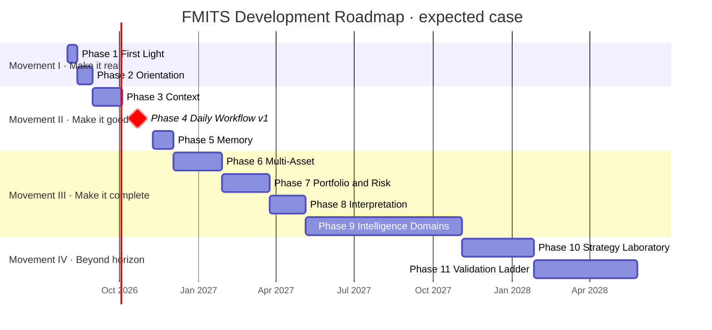
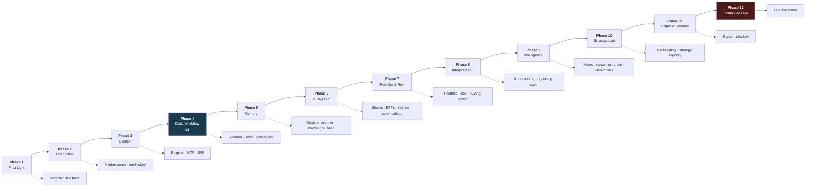

# FMITS Development Roadmap 2026–2027

| Field | Value |
|---|---|
| **Report number** | 0005 |
| **Title** | FMITS Development Roadmap 2026–2027 |
| **Date** | 2026-08-01 |
| **Report type** | Development Roadmap |
| **Model** | Claude Opus 5 |
| **Repository branch** | `main` |
| **Audited commit** | `d132cea` |
| **Status** | Final |

**Predecessors — treated as authoritative project history.**
[0001 Repository Audit](0001_2026-07-31_REPOSITORY_AUDIT.md) · what the code is ·
[0002 Master Map](0002_2026-07-31_FMITS_MASTER_MAP.md) · what the system is ·
[0003 Architecture Blueprint](0003_2026-08-01_FMITS_ARCHITECTURE_BLUEPRINT_V1.md) · how it works ·
[0004 Business & Capability Architecture](0004_2026-08-01_FMITS_BUSINESS_AND_CAPABILITY_ARCHITECTURE_V1.md) · why it exists and what it must do.

**This report transforms those four into an execution plan.** It does not redesign anything.

---

## What is sourced and what is recommended

The roadmap makes claims of two kinds, and they must not be confused.

| | Basis |
|---|---|
| **Phase *content*** | **Sourced.** Every capability comes from `PROJECT_SPECIFICATION_V1.md`, `PROJECT_VISION_ADDENDUM_V1.md`, an ADR, or Reports 0002–0004. No new scope is introduced |
| **Phase *ordering*** | **Recommendation.** Derived from the dependency graph in Report 0003 and the capability dependencies in Report 0004, optimized against the five criteria below |
| **Time estimates** | **Recommendation, low confidence.** Calibrated against this repository's own measured history (§4.1). Estimates degrade sharply beyond Phase 4 |
| **Immediate next milestone (§11)** | **Recommendation, high confidence.** Three independent lines of reasoning converge on it (§11.2) |

### Optimization criteria

Ordering is optimized, in this priority, against the five criteria the mission specifies:

1. **Earliest useful functionality** — the project has 30 completed milestones and zero user value
2. **Lowest architectural risk** — contracts hardening without a caller is the live risk
3. **Maximum business value** — value per unit of effort
4. **Maximum learning** — each phase should teach something new
5. **Preserving deterministic architecture** — no phase may weaken the guarantees already held

Where criteria conflict, criterion 1 wins until v1, and criterion 2 wins afterwards. §3.15 records where a conflict was resolved and why.

---

## Table of contents

1. [Executive summary](#1-executive-summary)
2. [Current position](#2-current-position)
3. [Development phases](#3-development-phases)
4. [Timeline](#4-timeline)
5. [Capability unlock map](#5-capability-unlock-map)
6. [Business value curve](#6-business-value-curve)
7. [Technical debt strategy](#7-technical-debt-strategy)
8. [Learning roadmap](#8-learning-roadmap)
9. [Critical path](#9-critical-path)
10. [Long-term vision](#10-long-term-vision)
11. [Recommended immediate next milestone](#11-recommended-immediate-next-milestone)
12. [Validation](#12-validation)

---

## 1. Executive summary

### The journey in one page

FMITS has spent 30 milestones and four weeks building a foundation of unusual quality — 11,128 lines,
3,221 tests, 96 % coverage, zero circular dependencies, zero runtime dependencies, 21 architecture
decision records. **It has produced no user value at all.** More than half that code sits in a
dependency island that no application layer can reach, and the only thing the owner can actually use
each day is a 199-line Markdown prompt that uses none of it.

The roadmap therefore has an unusual shape. It does not begin by building something new. **It begins
by connecting what exists** — one composition root that turns the unreachable half of the codebase
into a text report read beside the chart. That is Phase 1, it needs no new engine, no AI, no database
and no interface, and it moves the project from *zero* user value to *daily* user value in a single
step.

From there the roadmap runs through four broad movements:

**Movement I — Make it real (Phases 1–2).** Connect the structural chain to real data; add a
cross-asset orientation screen; start recording every run. The system becomes something worth opening
in the morning. *Roughly Aug–Sep 2026.*

**Movement II — Make it good (Phases 3–5).** Multi-timeframe composition, market regime in versioned
code rather than in a prompt, support/resistance, evidence wiring, then scanning, a daily brief, and
persistent memory. This is where **v1** lands: a genuine daily market-intelligence workflow.
*Roughly Oct 2026 – Feb 2027.*

**Movement III — Make it complete (Phases 6–9).** Multi-asset support through the calendar layer,
portfolio and risk with proper money types, AI interpretation, and then the intelligence domains —
macro, news, on-chain, derivatives, flows, China, IPO — added one at a time and only when each earns
its place. *Roughly Mar–Dec 2027.*

**Movement IV — Make it trustworthy (Phases 10–12).** The strategy laboratory, then the automation
ladder: backtest → robustness → paper → shadow → controlled live. These phases are gated by
**calendar time, not developer time** — a three-month shadow run takes three months regardless of how
fast the code is written. *2028 and beyond.*

### The three things that matter most

1. **Connect before you extend.** Every phase after Phase 1 assumes a working composition root. The
   single most expensive mistake available today is another structural milestone that deepens an
   unreachable chain.
2. **Memory is not optional infrastructure.** Four of the project's own nine success criteria depend
   on preserved analysis history. A system used daily with no memory produces no compounding value —
   which is why Phase 5 sits before the intelligence domains, not after them.
3. **The ladder cannot be compressed.** Backtest, paper and shadow each require real elapsed time and
   real out-of-sample data. Any pressure to skip a rung is the failure mode that costs capital.

### What this roadmap will not claim

No income, no profit, no trading performance. `SPEC` §25 defines success by nine criteria, none of
which is a return figure, and this roadmap adopts that definition unchanged. Every phase states what
must **not** be claimed on completion.

---

## 2. Current position

### 2.1 Where FMITS is today

**Value Level 0** on the ladder defined in Report 0004 §12: *tested library only*.
**Maturity stage M1** on the scale in Report 0003 §11: *foundation achieved*.

The repository is at `d132cea`, working tree clean, `main` level with `origin/main`, 83 commits.

### 2.2 What already exists — and is production quality

Six of the seven groups below meet a standard most production systems do not: hand-verified expected
values, mutation-tested, independently reviewed, with an ADR per decision.

| Subsystem | Size | Quality evidence |
|---|---:|---|
| **Canonical kernel** — `fmis.data` | 521 LOC | Frozen, validated, UTC-contracted (ADR-0001); imports nothing internal |
| **Acquisition** — `fmis.ingest`, `fmis.providers` | 832 LOC | Strict decode, no repair (ADR-0005); adapter contract (ADR-0006); 94 % covered despite being network-bound |
| **Comparability** — `fmis.alignment`, `fmis.series_context` | 705 LOC | No silent forward-fill (ADR-0002); identity preserved end to end (ADR-0018) |
| **Measurement** — `fmis.features`, `fmis.relative_value` | 1,763 LOC | EMA/ATR/RSI/MACD/volume + 5 RVE metrics; explicit warm-up; provenance on every result |
| **Structure** — six packages | 5,695 LOC | Pure, non-repainting, exactly prefix-stable, single-implementation; 59/42/38 mutation probes with zero survivors |
| **Evidence & decision** — `decision_support`, `evidence`, `trading_context` | 1,380 LOC | ADR-0008/0011/0009; `WAIT` as a first-class outcome |
| **Documentation** | 21 ADRs, 6 designs, 7 reviews, 5 reports | The strongest asset in the project |

**Verdict on production quality:** the *engineering* is production quality. The *system* is not,
because production quality includes being usable, and nothing here is reachable by a user.

### 2.3 What is missing

Grouped by how much it blocks:

| Missing | Blocks | Severity |
|---|---|---|
| **Any composition root reaching the structural chain** | 51.2 % of the codebase; 13 of 15 workflows | **Critical** |
| **Any product surface** | All user value | **Critical** |
| **Watchlist / universe management** | Scanning, Pulse, Brief | High — and trivially small |
| **Persistence** | Four of nine success criteria | High |
| **Multi-timeframe composition** | The defining structure of swing analysis | High |
| **Market regime in code** | The founding failure remains in a prompt | High |
| **Calendars & sessions** | Every non-crypto asset class | High |
| **Money / portfolio numeric ADR** | All of Phase 7 | High — a *decision*, not code |
| **Availability-time model** | Macro, fundamentals, bonds — formally blocked by ADR-0003 | Medium |
| **Scheduling** | Every unattended capability | Medium — no owner in any layer |
| **`compute_series()` extension** | Backtesting at usable speed | Medium — must precede Phase 10 |
| **CI / type checking** | Nothing; but everything is unverified between runs | Medium |
| **AI interpretation, strategy, risk, portfolio, execution, learning** | The upper half of the architecture | Expected at this stage |

### 2.4 The two known correctness hazards

Both from Report 0003 §10 and `CURRENT_STATE.md`, and both matter to Phase 1:

1. **`LevelOrigin` does not carry the confirmation delay (ADR-0020 D1).** `confirmation_bars` must be
   passed to `derive_structure_breaks` and hand-matched to the `right_bars` used for detection, and
   **a mismatch raises no error** — it silently changes which level is the reference at every bar, and
   therefore which breaks and which changes of character exist. It is currently untrippable because
   there are no callers. **Phase 1 creates the first caller.**
2. **Features return only their latest value**, making replay O(N²). Harmless today; blocks Phase 10.

### 2.5 Position summary

```
Foundation      ████████████████████████████████████████  M1 achieved
Connection      ░░░░░░░░░░░░░░░░░░░░░░░░░░░░░░░░░░░░░░░░  M2 not started
User value      ░░░░░░░░░░░░░░░░░░░░░░░░░░░░░░░░░░░░░░░░  Level 0 of 8
Capabilities    █░░░░░░░░░░░░░░░░░░░░░░░░░░░░░░░░░░░░░░░  6 of 184
Workflows       █░░░░░░░░░░░░░░░░░░░░░░░░░░░░░░░░░░░░░░░  1 of 15, via a prompt
Success criteria ████████░░░░░░░░░░░░░░░░░░░░░░░░░░░░░░░  2 of 9
```

---

## 3. Development phases

Thirteen phases. **Complexity** is relative effort on a 1–5 scale. **Duration** is developer weeks at
the assumed working rate (§4.1). Every phase states what must not be claimed on completion.

---

### Phase 0 — Foundation · ✅ **COMPLETE**

| | |
|---|---|
| **Goal** | A deterministic core that computes every derivable fact about a price series, reproducibly and provably |
| **Capabilities added** | C-014 indicators · C-016 market structure · C-017 structural trend · C-020 volume · C-013 cross-asset relationships · plus ingestion, alignment, identity, evidence v1 |
| **Architectural impact** | L0–L4 built; L7 partially |
| **Completion criteria** | ✅ All met — 30 milestones, 3,221 tests, zero cycles |
| **User-visible benefit** | **None.** By design at this stage |

---

### Phase 1 — First Light 🔦

**The bridge. Everything downstream assumes it.**

| | |
|---|---|
| **Goal** | Make every line of the codebase reachable from real market data, and put its output in front of the user |
| **Capabilities added** | A **structural composition root**; the **deterministic fact sheet** (Report 0004 §13.8); `LevelOrigin` confirmation delay (ADR-0020 D1) |
| **Architectural impact** | **Island A ↔ Island B bridged.** Maturity M1 → M2. Value Level 0 → 1. First composition root outside `fmis.pipeline` |
| **Dependencies** | None. Every engine it composes exists and is tested |
| **Complexity** | **2 / 5** — one new package, one model field, no new mathematics |
| **Duration** | **1–2 weeks** |
| **Main risks** | Scope creep into a UI or a regime engine · discovering the structural chain's ergonomics are awkward under a real caller (**this is a benefit, not a risk — it is the first feedback those contracts have ever had**) |
| **Completion criteria** | One command takes a symbol + timeframes, fetches candles, runs both the Feature Engine and the full structural chain, and prints computed facts · `confirmation_bars` mismatch is structurally impossible · the whole suite stays green · an ADR records the composition-root contract |
| **User-visible benefit** | **The prompt stops guessing.** Today the v3 analyzer estimates EMA, RSI, MACD, swing structure and levels visually. After Phase 1 it is handed them, computed exactly. This directly implements `SPEC` §3.1 |
| **Must not claim** | That it produces *analysis*. It produces **facts**; the human still analyzes |

---

### Phase 2 — Orientation 🧭

| | |
|---|---|
| **Goal** | A reason to open the system every morning, and a record of every time you did |
| **Capabilities added** | C-163 Global Market Pulse (minimum version, Report 0004 §8.5) · watchlist / universe management · run recording (every fact sheet persisted as a dated artifact) |
| **Architectural impact** | Second composition root reusing the first · the seed of L11 memory, before the archive is designed |
| **Dependencies** | Phase 1 |
| **Complexity** | **2 / 5** |
| **Duration** | **2–3 weeks** |
| **Main risks** | Persisting before a schema is thought through — mitigated by persisting *artifacts*, not a model: write the fact sheet to a dated file, decide the schema later |
| **Completion criteria** | A configured instrument list produces a cross-asset state table on demand · every run is written to a durable, dated artifact · no wall-clock enters any calculation |
| **User-visible benefit** | Thirty-second morning orientation across the instruments you follow, plus a growing history of what the system said and when |
| **Must not claim** | Completeness. Coverage is limited to instruments the existing adapter reaches |

---

### Phase 3 — Context 🎯

**Where the founding failure gets fixed.**

| | |
|---|---|
| **Goal** | Turn facts into *states*, and move the regime judgment out of the prompt into versioned code |
| **Capabilities added** | C-022 multi-timeframe composition · C-023 market regime with evidence and uncertainty · C-018 support & resistance · C-019 volatility state · C-015 contextual indicator reading · evidence taxonomy **wired** |
| **Architectural impact** | L5 built. Report 0003's M3 "Contextual". Resolves the multi-timeframe contradiction recorded in Report 0004 §18.5 |
| **Dependencies** | Phases 1–2 |
| **Complexity** | **4 / 5** — regime is the highest-leverage and least-specified module in the system |
| **Duration** | **4–6 weeks** |
| **Main risks** | **Regime being trusted before validation** — mitigated by requiring evidence components on every output and by replaying it over history before relying on it · thresholds becoming literals instead of versioned parameters · scope creep into direction labels |
| **Completion criteria** | Regime output carries components and uncertainty, never a bare label · MTF composition preserves each timeframe's role rather than blending · `fmis.evidence` has a production consumer · a test asserts no direction vocabulary in L5 |
| **User-visible benefit** | The system reads structure across 1W/1D/4H the way the prompt claims to — but reproducibly, diffably, and checkable against history |
| **Must not claim** | That it recommends trades |

---

### Phase 4 — Daily Workflow · **← v1 LANDS HERE** 📅

| | |
|---|---|
| **Goal** | A genuine daily market-intelligence workflow that is preferred over the ad-hoc alternative |
| **Capabilities added** | C-164 opportunity scanning over a watchlist · C-162 Daily Brief (deterministic content) · C-173 report output · scheduling · CLI as a real product surface |
| **Architectural impact** | Value Level 3. First scheduled unattended execution — **scheduling gains an owner** |
| **Dependencies** | Phases 1–3 |
| **Complexity** | **3 / 5** |
| **Duration** | **4–6 weeks** |
| **Main risks** | Building a UI here instead of later — text output is sufficient and much cheaper · alert fatigue from an unfiltered brief · unattended runs failing silently, which is why minimal health reporting belongs here |
| **Completion criteria** | A scheduled run produces a brief without interaction · scanning ranks a watchlist on computed facts with stated reasons · every run is archived · failures are visible |
| **User-visible benefit** | **v1.** Workflows A (morning) and B (swing) substantially operational. The system tells you what changed and what deserves attention, before you ask |
| **Must not claim** | Completeness — it covers price-derived evidence only. No macro, no news, no portfolio |

---

### Phase 5 — Memory 🧠

| | |
|---|---|
| **Goal** | Make the system able to improve, by recording what it concluded and what happened |
| **Capabilities added** | C-159 decision & outcome archive · persistence with a considered schema · C-161 searchable knowledge base · journal (`[OPEN]` — pending the scope decision in Report 0004 §15.3) · reproducible analysis run |
| **Architectural impact** | L11 begins. **The loop closes.** Four of nine success criteria become measurable |
| **Dependencies** | Phase 4 (there must be something worth persisting and a habit of producing it) |
| **Complexity** | **3 / 5** |
| **Duration** | **3–4 weeks** |
| **Main risks** | Premature schema lock-in — mitigated by Phase 2's artifact-first approach giving several months of real examples · the serialization question (`ARCH` §13.8) surfacing here and needing a decision |
| **Completion criteria** | Every analysis is retrievable by date and instrument · a decision can be linked to its outcome · a stored analysis can be re-derived exactly |
| **User-visible benefit** | *"What did I think about this in October, and was I right?"* becomes answerable |
| **Must not claim** | That it has learned anything yet. It has recorded; learning is Phase 8 and beyond |

---

### Phase 6 — Multi-Asset 🌍

| | |
|---|---|
| **Goal** | A second asset class supported with **no change to any layer above L2** |
| **Capabilities added** | Calendars & sessions (Admission Point 2 from Report 0003 §5.2) · a second adapter family · C-003 equities · C-005 indices · day-count and annualization conventions · corporate-action normalization policy |
| **Architectural impact** | L2 completed. Report 0003's M4. **This phase is the test of the asset-agnosticism claim** |
| **Dependencies** | Phases 1–4 |
| **Complexity** | **4 / 5** — calendars are more intricate than they look: half-days, holidays, rolls, settlement |
| **Duration** | **6–10 weeks** |
| **Main risks** | **Asset-class logic leaking upward** out of the calendar layer — the erosion risk in Report 0003 §10.8 · underestimating corporate actions · data licensing |
| **Completion criteria** | **The precise test:** adding equities requires exactly one adapter and one calendar and touches nothing in L3–L11. If it requires more, the asset-agnosticism claim was false and must be revisited |
| **User-visible benefit** | Stocks, ETFs, indices — and by extension mining equities, precious metals and commodities — analyzed by the same engines as crypto |
| **Must not claim** | Coverage of futures roll or options chains; those are separate later work |

---

### Phase 7 — Portfolio & Risk ⚖️

| | |
|---|---|
| **Goal** | Analysis that knows what is already held, and risk that is computed rather than intended |
| **Capabilities added** | **Money / portfolio numeric ADR first** · C-115–C-127 portfolio · C-128–C-139 risk · Buying Power (Report 0004 §9) · C-120 correlation clustering · C-125 total open risk |
| **Architectural impact** | L9 partial. Value Level 4. The risk panel becomes present in every decision surface |
| **Dependencies** | Phases 1–5. **Hard prerequisite: the numeric-type ADR** (review R11) |
| **Complexity** | **4 / 5** |
| **Duration** | **6–10 weeks** |
| **Main risks** | **Wrong risk numbers are worse than no risk numbers** — every figure must be verified against manual calculation before being trusted · `float` reaching money · investing and trading books blurring, which ADR-0009 exists to prevent |
| **Completion criteria** | Total open risk visible before any position is contemplated · correlation clusters shown rather than a matrix to read · the 2 % ceiling structurally enforced · books separated |
| **User-visible benefit** | The question *"is this a good setup?"* becomes *"is this a good setup **given what I already hold**?"* |
| **Must not claim** | That risk is *managed*. It is *measured*; management is a human act |

---

### Phase 8 — Interpretation 🤖

| | |
|---|---|
| **Goal** | Cross the AI boundary properly — reasoning over evidence that is already classified and gap-stated |
| **Capabilities added** | C-040-family AI interpretation · scenario analysis · **mandatory opposing-case construction** · C-182 decision-vs-outcome comparison · C-180/181 explanation |
| **Architectural impact** | L8 built. Report 0003's Boundary 1 crossed deliberately for the first time |
| **Dependencies** | Phases 3, 5, 7. **Evidence must be classified and history must exist before AI is worth adding** |
| **Complexity** | **4 / 5** |
| **Duration** | **4–8 weeks** |
| **Main risks** | **False confidence from fluent interpretation of thin evidence** — mitigated by evidence gaps being first-class and the opposing case being mandatory · AI output being stored as if deterministic · cost escalation, which is why usage tracking belongs here |
| **Completion criteria** | No interpretation is presented without its evidence and its gaps · the opposing case is produced every time, not on request · AI output is never persisted as a deterministic result · a test asserts no deterministic layer imports the AI layer |
| **User-visible benefit** | The system argues with you — and shows its work |
| **Must not claim** | That its interpretation is correct. It is one reading of stated evidence |

---

### Phase 9 — Intelligence Domains 🌐

**Twelve engines. Add them one at a time, and only when each earns its place.**

| | |
|---|---|
| **Goal** | Broaden the evidence base beyond price |
| **Capabilities added** | Per engine, in dependency order: **availability-time model first** (unblocks macro and fundamentals) → macro → news & geopolitics → on-chain → derivatives → flows → China → IPO |
| **Architectural impact** | L6 built incrementally. Each engine is independent and converges on evidence aggregation |
| **Dependencies** | Phases 3–5 (evidence must be able to receive it) · availability-time model for anything release-dated |
| **Complexity** | **3 / 5 per engine · 5 / 5 in aggregate** |
| **Duration** | **3–6 weeks per engine · 26+ weeks for a meaningful subset** |
| **Main risks** | **The largest scope risk in the project** — twelve engines is years of solo work · data-cost escalation · maintaining twelve adapters and their quality rules · adding engines whose evidence never changes a decision |
| **Completion criteria** | *Per engine:* it reaches evidence aggregation through the taxonomy, not by widening `FeatureCategory` · its data provenance is explicit · **its contribution to actual decisions is measured before the next engine is started** |
| **User-visible benefit** | Macro context, news mechanism analysis, on-chain flows, derivatives positioning, China policy — each incrementally |
| **Must not claim** | That more data means better decisions. That is the hypothesis this phase tests, one engine at a time |

---

### Phase 10 — Strategy Laboratory 🔬

| | |
|---|---|
| **Goal** | Distinguish a strategy that works from one that fitted the last two years |
| **Capabilities added** | **`compute_series()` extension first** · C-141–C-150 rule specification, registry, versioning, datasets, backtesting, out-of-sample, walk-forward, robustness, sensitivity, realistic fees and slippage, regime segmentation |
| **Architectural impact** | L9 strategy + L10 backtesting. Value Level 5 |
| **Dependencies** | Phases 3–7. **Hard prerequisite: `compute_series()`** — replay is O(N²) without it |
| **Complexity** | **5 / 5** |
| **Duration** | **8–14 weeks** |
| **Main risks** | **Overfitting presented as validation** — the central risk of this phase · the seven guards of `SPEC` §18 being partially applied · backtests without costs being taken seriously |
| **Completion criteria** | All seven `SPEC` §18 guards enforced: overfitting, look-ahead, survivorship, leakage, unrealistic fills, fees, slippage · results segmented by regime · a strategy that fails out-of-sample is *recorded as failed*, not quietly retuned |
| **User-visible benefit** | Ideas become testable; intuitions become falsifiable |
| **Must not claim** | That a backtested strategy works. It **has not failed on history** |

---

### Phase 11 — Validation Ladder 📋

**Gated by calendar time, not developer time.**

| | |
|---|---|
| **Goal** | Forward evidence on unseen data, with zero capital at risk |
| **Capabilities added** | C-050 paper trading · C-051 shadow mode · C-055 monitoring · incident recovery |
| **Architectural impact** | L10. Value Level 6 |
| **Dependencies** | Phase 10 |
| **Complexity** | **4 / 5** to build · **the constraint is elapsed time, not effort** |
| **Duration** | **6–10 weeks to build · then months of running.** A meaningful shadow sample cannot be compressed |
| **Main risks** | **Paper success read as live capability** · impatience compressing the observation window · paper using looser rules than live would, which destroys the rung's evidentiary value |
| **Completion criteria** | Shadow uses live data with real timing and executes nothing · paper and live use **identical** sizing and risk logic · divergence from expectation is alerted, not discovered later |
| **User-visible benefit** | Evidence about future behaviour rather than past fit |
| **Must not claim** | Profitability. Paper is not live, and shadow is not capital |

---

### Phase 12 — Controlled Execution 🔐

| | |
|---|---|
| **Goal** | Validated rules execute with the smallest meaningful capital, under hard limits |
| **Capabilities added** | C-052 controlled live · C-054 execution safety · C-056 kill switches · full order logging · permissions and safety console |
| **Architectural impact** | L10 complete. Value Level 7. Report 0003's Boundary 3 crossed |
| **Dependencies** | Phase 11, plus **an explicit human decision to risk capital** |
| **Complexity** | **5 / 5** |
| **Duration** | **4–8 weeks to build · then indefinite supervised operation** |
| **Main risks** | Every risk in this document simultaneously, with real money |
| **Completion criteria** | Keys have **no withdrawal permission** · position, leverage, daily-loss and drawdown limits all **proven to trip under test** · kill switch tested · every order and decision logged · execution separable from analysis |
| **User-visible benefit** | Rules you personally validated execute without you watching |
| **Must not claim** | That the system trades for you. It executes rules you approved |

---

### Phase 13 — Bounded Autonomy · beyond this roadmap

Value Level 8. A validated, bounded strategy operating within hard limits without per-trade approval,
with the human retaining the kill switch permanently. **Report 0003's Boundary 4 is not crossed** —
the system never modifies its own strategies or allocates capital without approval. That would require
its own vision decision and its own ADR, and this roadmap does not plan it.

### 3.15 Where criteria conflicted

| Conflict | Resolution | Reasoning |
|---|---|---|
| Phase 1 vs the repository's own recommended next milestone (`LevelOrigin` alone) | **Folded into Phase 1** | The hazard is untrippable with no callers; Phase 1 creates the first caller. Fixing it as a standalone milestone delays all user value to fix a bug nobody can currently hit — see §11.4 |
| Phase 5 (memory) vs Phase 9 (intelligence) | **Memory first** | A system used daily with no memory produces no compounding value. Intelligence added before memory cannot be evaluated |
| Phase 6 (multi-asset) vs Phase 7 (portfolio) | **Multi-asset first** | Portfolio work assumes multiple asset classes; building it crypto-only would need redoing |
| Phase 8 (AI) vs Phase 9 (intelligence) | **AI first** | AI over classified evidence is useful with price-only evidence; more evidence with no reasoning layer is just more numbers |

---

## 4. Timeline

### 4.1 Estimation basis and confidence

**Assumed working rate:** 1–2 hours per weekday, more at weekends — approximately **10–15 hours per
week**, single developer, AI-assisted.

**Calibration against this repository's own history:** 30 milestones in 27 days (2026-07-04 →
2026-07-31), 83 commits — roughly one milestone per day. That rate is real and remarkable, but it must
be **discounted heavily** for what comes next, because the completed work shares properties the
upcoming work does not:

| Completed work | Upcoming work |
|---|---|
| Pure deterministic arithmetic | External data, scheduling, AI, money |
| Expected values hand-calculable | Expected values often not knowable in advance |
| Single package, no I/O | Composition across packages, network, persistence |
| No external dependency | Providers, licences, rate limits, outages |
| Failure is a failing test | Failure can be silent, or expensive |

**Confidence:** high through Phase 2 · moderate through Phase 4 · **low beyond Phase 5** · Phases
11–12 are **not estimable** in developer time at all, because their gate is elapsed observation, not
effort.

### 4.2 Phase estimates

| Phase | Best | **Expected** | Worst | Cumulative (expected) |
|---|---:|---:|---:|---|
| 1 · First Light | 1 wk | **1.5 wk** | 3 wk | mid-Aug 2026 |
| 2 · Orientation | 1.5 wk | **2.5 wk** | 5 wk | early Sep 2026 |
| 3 · Context | 3 wk | **5 wk** | 10 wk | mid-Oct 2026 |
| 4 · Daily Workflow **(v1)** | 3 wk | **5 wk** | 10 wk | **late Nov 2026** |
| 5 · Memory | 2 wk | **3.5 wk** | 7 wk | late Dec 2026 |
| 6 · Multi-Asset | 5 wk | **8 wk** | 16 wk | late Feb 2027 |
| 7 · Portfolio & Risk | 5 wk | **8 wk** | 16 wk | late Apr 2027 |
| 8 · Interpretation | 3 wk | **6 wk** | 12 wk | mid-Jun 2027 |
| 9 · Intelligence Domains | 16 wk | **26 wk** | 52+ wk | **late Dec 2027** |
| 10 · Strategy Laboratory | 8 wk | **12 wk** | 24 wk | Mar 2028 |
| 11 · Validation Ladder | 6 wk build | **8 wk build + 3–6 months running** | — | late 2028 |
| 12 · Controlled Execution | 4 wk build | **6 wk build + indefinite supervision** | — | 2029 |

**Roadmap horizon 2026–2027 covers Phases 1–9.** Phases 10–12 fall beyond it and are included for
completeness of the path, not as commitments.

### 4.3 Timeline diagram



### 4.4 What could compress or extend this

| Compresses | Extends |
|---|---|
| Ruthless v1 scoping — text output only, no UI | Building a user interface before Phase 6 |
| Reusing the composition-root pattern for every surface | Each surface inventing its own orchestration |
| One intelligence engine at a time with measured contribution | Attempting several L6 engines in parallel |
| Deciding the money-types ADR early, before Phase 7 | Discovering `float`-vs-`Decimal` mid-implementation |
| CI catching regressions automatically | Manual verification at every step |
| Data licensing resolved before Phase 6 | Provider outages, licence changes, rate limits |

---

## 5. Capability unlock map

**Status** uses Report 0003's taxonomy. **Target phase** is when the capability first becomes *usable*,
not when it becomes complete.

| Capability | Current status | Target phase | Key dependencies |
|---|---|---|---|
| **Swing Trading Analyzer** | In Progress — prompt only | **Phase 1** (facts) → **Phase 3** (context) → **Phase 4** (full) | Composition root · MTF · regime |
| **Market Intelligence** | Future | **Phase 2** (minimum Pulse) → **Phase 6** (multi-asset) | Adapters · watchlist · calendars |
| **Portfolio Dashboard** | Future | **Phase 7** | Money ADR · position data · correlation |
| **Telegram Reports** | Unknown — `[OPEN]` | **Phase 4+** as a transport | Daily Brief must exist first |
| **News Analysis** | Future | **Phase 9** | News adapter · evidence taxonomy wired |
| **Macro Analysis** | **Blocked** (ADR-0003) | **Phase 9** | **Availability-time model** · macro adapters |
| **On-chain Intelligence** | Future | **Phase 9** | Chain adapters · provenance model |
| **Derivatives Intelligence** | Future | **Phase 9** | Venue adapters |
| **Investment Research** | Future | **Phase 5** (capture) → **Phase 9** (fundamentals) | Persistence · fundamentals (blocked) |
| **Long-term Portfolio** | Future | **Phase 7** | Portfolio engine · book separation (ADR-0009) |
| **Backtesting** | Future | **Phase 10** | **`compute_series()`** · strategy rules · fee models |
| **Paper Trading** | Future | **Phase 11** | Backtesting · robustness |
| **Strategy Builder** | Future | **Phase 10** | Rule specification language · registry |
| **Signal Engine** | Future | **Phase 10** | Strategy engine — **the only layer permitted to emit signals** |
| **Risk Engine** | Future | **Phase 7** | **Money ADR** · portfolio state · correlation |
| **Broker Integration** | Future | **Phase 12** | Adapter · no-withdrawal keys · safety limits |
| **Execution Engine** | Future | **Phase 12** | Full ladder · kill switches · logging |
| **AI Research Assistant** | Future | **Phase 8** | Classified evidence · history |
| **Knowledge Base** | In Progress — docs/ADRs | **Phase 5** (searchable) | Persistence · search |
| **Automation** | Future | **Phase 4** (scheduling) → **Phase 12** (execution) | Scheduling · then the whole ladder |
| **Day Trading Framework** | Future | **Phase 10** (research) | Intraday data · strategy lab |
| **Controlled Live Trading** | Future | **Phase 12** | Shadow evidence · **explicit human decision** |
| **Fully Automated AI Day Trading** | Future — **beyond this roadmap** | **Phase 13** | Everything · **plus a vision decision not yet made** |

### 5.1 Unlock diagram



---

## 6. Business value curve

### 6.1 When each kind of usefulness arrives

| Question | Answer | Why |
|---|---|---|
| **First useful at all?** | **Phase 1** | The prompt stops guessing values; computed facts replace visual estimates |
| **First saves time?** | **Phase 2** | Thirty-second cross-asset orientation replaces manual chart-by-chart checking |
| **Generates reports?** | **Phase 4** | Scheduled daily brief, archived |
| **Supports investing?** | **Phase 5** partially (thesis capture, history) · **Phase 9** properly (fundamentals) | Investing rests on fundamentals, which are release-dated and blocked until the availability-time model |
| **Supports swing trading?** | **Phase 3** meaningfully · **Phase 4** fully · **Phase 7** with sizing | Regime and MTF are what swing analysis actually needs; sizing needs portfolio state |
| **Supports active trading?** | **Phase 7** | Active trading without position-aware risk is guessing |
| **Supports paper trading?** | **Phase 11** | Requires a validated strategy, which requires the strategy lab |
| **Supports semi-automation?** | **Phase 4** (scheduled analysis) · **Phase 12** (rule execution with approval) | Scheduling automates *analysis*; execution automates *action* — different rungs entirely |
| **Supports automation?** | **Phase 12** at the earliest | The full ladder, plus an explicit decision to risk capital |

### 6.2 The value curve

```
VALUE
  ▲
  │                                                        ╭──── Phase 12
  │                                                   ╭────╯     live execution
  │                                              ╭────╯ Phase 11
  │                                         ╭────╯      forward evidence
  │                                    ╭────╯ Phase 10
  │                              ╭─────╯      falsifiable strategies
  │                        ╭─────╯ Phases 8–9
  │                   ╭────╯       reasoning + breadth
  │              ╭────╯ Phase 7 · portfolio-aware
  │         ╭────╯ Phase 6 · every asset class
  │     ╭───╯ Phase 5 · memory — the loop closes
  │   ╭─╯ ◄── Phase 4 · v1 · DAILY WORKFLOW
  │  ╭╯ Phase 3 · context
  │ ╭╯ Phase 2 · orientation
  │╭╯ ◄── Phase 1 · FIRST VALUE · steepest step on the curve
  ●──────────────────────────────────────────────────────────► EFFORT
 Phase 0
 30 milestones
 ZERO value
```

**The shape is the message.** Phase 0 consumed 30 milestones and delivered nothing. Phase 1 costs
roughly 1.5 weeks and delivers the steepest single increase on the whole curve, because it converts
existing work rather than creating new work. **Effort and value have been almost perfectly decoupled
so far, and Phase 1 is where they reconnect.**

### 6.3 Value per week of effort

| Phase | Effort (wk) | Value added | Ratio |
|---|---:|---|:---:|
| 1 · First Light | 1.5 | Zero → daily use | **Highest in the roadmap** |
| 2 · Orientation | 2.5 | Morning routine + history | Very high |
| 5 · Memory | 3.5 | Compounding begins | Very high |
| 3 · Context | 5 | Analysis quality step-change | High |
| 4 · Daily Workflow | 5 | v1 | High |
| 7 · Portfolio & Risk | 8 | Decisions become position-aware | High |
| 8 · Interpretation | 6 | Reasoning | Moderate–high |
| 6 · Multi-Asset | 8 | Breadth | Moderate |
| 9 · Intelligence | 26+ | Breadth of evidence | **Lowest per week — measure before extending** |
| 10–12 | 26+ | Automation | Deferred value, high risk |

---

## 7. Technical debt strategy

### 7.1 Shortcuts that must NEVER be taken

Each of these would destroy a property the whole system rests on. They are ranked by how expensive
the reversal would be.

| # | Never | Because |
|---|---|---|
| **1** | **Never let AI produce a value code can compute** | The founding principle. Once an AI-estimated number enters a deterministic result, nothing downstream is reproducible or auditable |
| **2** | **Never silently repair or forward-fill data** | ADR-0002/0005. A silently repaired input makes every downstream number a fiction with no marker |
| **3** | **Never let a provider type reach the canonical layer** | ADR-0006. Vendor lock-in becomes structural and unpicking it touches every layer |
| **4** | **Never emit a direction label below the Strategy layer** | An indicator that says "bullish" hides a strategy nobody reviewed |
| **5** | **Never skip a rung of the automation ladder** | `SPEC` §11. This is the shortcut that loses capital |
| **6** | **Never grant withdrawal permission to any automated key** | `SPEC` §20. Absolute, no exceptions, no convenience case |
| **7** | **Never use observation date where knowledge date is required** | ADR-0003. Look-ahead bias invalidates every backtest built on it, silently and retroactively |
| **8** | **Never compute on a forming candle** | ADR-0007. Re-running yields different numbers; determinism collapses |
| **9** | **Never derive an expected test value by calling the implementation** | The test then asserts only that the code does what it does |
| **10** | **Never count correlated evidence as independent** | `SPEC` §4.6. The exact mechanism of the v2 LONG-bias failure |
| **11** | **Never use `float` for money** | Rounding errors in position sizing compound into real losses |
| **12** | **Never let a strategy size its own position** | Risk limits become negotiable by whichever strategy is most confident |

### 7.2 The architecture decisions that matter most

Ordered by cost of getting them wrong:

| Decision | Phase | Cost if wrong |
|---|---|---|
| **Money / portfolio numeric types** | Before 7 | Touches every risk, portfolio, backtest and execution figure. Retrofitting `Decimal` after Phase 10 would mean re-verifying every number in the system |
| **Availability-time model** | Before 9 | Changes the shape of a canonical model that alignment, RVE and every backtest already depend on. Report 0003 §10.7 calls it *"the finding most likely to force an expensive refactor"* |
| **Persistence schema** | Phase 5 | Every stored analysis is written in it. Mitigated by Phase 2's artifact-first approach giving real examples before the schema is fixed |
| **`compute_series()` protocol extension** | Before 10 | Touches the most-depended-on contract in the codebase. Doing it *during* a backtesting milestone means reopening the protocol under pressure |
| **Composition-root contract** | Phase 1 | Every product surface copies it. Getting it right once is why ADR-0007 exists |
| **Calendar layer boundary** | Phase 6 | If asset-class logic leaks above L2, the asset-agnosticism claim fails and every layer needs auditing |
| **Evidence taxonomy wiring** | Phase 3 | If L6 engines arrive before this, the first one widens `FeatureCategory` or invents a third vocabulary |

### 7.3 Future mistakes that become expensive

| Mistake | When it bites | Prevention |
|---|---|---|
| Another structural milestone before Phase 1 | Immediately — widens the unreachable island | This roadmap |
| Building a UI before Phase 6 | Phase 6 — the UI must be rebuilt for multi-asset | Text output until then |
| Persisting without a considered schema | Phase 5+ — migrating stored history is painful | Artifacts first, schema later |
| Adding L6 engines before evidence is wired | Phase 9 — a third evidence vocabulary appears | Wire the taxonomy in Phase 3 |
| Deferring CI further | Continuously — regressions found late | Add it in Phase 1 or 2 |
| Letting documentation drift further | Continuously — already materialized in Report 0001 §7.2 | Treat summaries as generated |
| Building modules without a consumer | Continuously — already materialized twice | **No new module without a named consumer in the same milestone** |

### 7.4 Debt that is acceptable

Not all debt is bad. These are deliberate and should be left alone until their trigger:

| Debt | Leave until |
|---|---|
| Features returning only the latest value | Phase 10 |
| `_require_envelope` duplicated ×4 | The fifth copy, or a message divergence |
| Six empty Tier-2 placeholder packages | Phase 3 fills some of them |
| No multi-timeframe identity in `FeatureSet` | Phase 3 forces the question |
| Single alignment policy | Phase 6 or 9 needs a second |

---

## 8. Learning roadmap

The vision is explicit that the system is **both the product and the curriculum**:
*"transition from physical work toward knowledge-based work by mastering AI, software, automation and
financial markets."* This section maps what each phase teaches.

### 8.1 By phase

| Phase | Software & architecture | Markets & quantitative | Tooling & practice |
|---|---|---|---|
| **1 · First Light** | Composition roots · dependency inversion · why orchestration holds no logic | How indicator values and structure actually differ from visual estimates | Git branch discipline · ADR writing · CI setup |
| **2 · Orientation** | Configuration vs code · artifact-based persistence | Cross-asset reading · what "normal" looks like per instrument | Scheduling basics · file formats |
| **3 · Context** | State machines · composite design · parameterization vs literals | **Market regime — the highest-leverage concept in trading** · multi-timeframe reasoning · support/resistance mechanics | Property-based thinking · replaying over history |
| **4 · Daily Workflow** | CLI design · unattended execution · failure visibility | Scanning and ranking · what deserves attention | Cron/scheduling · observability basics |
| **5 · Memory** | Schema design · serialization · immutability at rest · search | **Decision journaling** · measuring your own bias | Data modelling · migration thinking |
| **6 · Multi-Asset** | Boundary enforcement · configuration-driven behaviour | **Market microstructure** — sessions, auctions, holidays, rolls, corporate actions, day counts | Data licensing · provider evaluation |
| **7 · Portfolio & Risk** | Numeric types · `Decimal` vs `float` · invariants that must not break | **Position sizing · correlation · portfolio risk · the difference between per-trade and aggregate risk** | Verification against manual calculation |
| **8 · Interpretation** | LLM integration patterns · prompt engineering as an engineering discipline · cost control | Scenario reasoning · uncertainty expression · constructing the opposing case | Prompt versioning · evaluation of non-deterministic output |
| **9 · Intelligence** | Adapter proliferation · data-quality modelling · provenance | **Macro transmission · on-chain semantics · derivatives positioning · vintage data** | Multi-source reconciliation |
| **10 · Strategy Lab** | Performance engineering · streaming vs batch | **Statistics — overfitting, out-of-sample, walk-forward, sensitivity, multiple-testing bias, survivorship** | Experiment design · reproducible research |
| **11 · Validation** | Real-time systems · monitoring · divergence detection | Forward testing · the gap between backtest and reality | Patience as an engineering discipline |
| **12 · Execution** | Order lifecycle · idempotency · failure recovery · safety interlocks | Execution cost · slippage · market impact | Incident response · operational discipline |

### 8.2 The subjects the mission names

| Subject | Where it is learned deepest |
|---|---|
| **Python** | Phases 1–5 — composition, configuration, persistence, CLI |
| **Architecture** | Phase 1 (composition roots) and Phase 6 (boundary enforcement under pressure) |
| **Testing** | Continuous; deepest in Phase 10, where the thing being tested is a *claim about the future* |
| **Financial markets** | Phase 3 (regime), Phase 6 (microstructure), Phase 7 (risk), Phase 9 (macro and cross-domain) |
| **Git** | Already strong; Phase 1 adds tags and CI |
| **AI** | Phase 8 — and critically, learning *where AI must not be used*, which Phases 1–7 teach by example |
| **Automation** | Phase 4 (scheduling) then Phases 11–12 (the ladder) |
| **Prompt engineering** | Phase 8 — as a versioned, evaluated engineering artifact, not as improvisation |
| **Backtesting** | Phase 10 — including its limits, which matter more than its mechanics |
| **Statistics** | Phase 10 — overfitting, out-of-sample, multiple testing; the discipline that prevents self-deception |
| **Execution systems** | Phase 12 — safety, idempotency, recovery |

### 8.3 The most valuable lesson available

**Phase 1.** Not because it is technically hard — it is the easiest phase in the roadmap — but because
it teaches, concretely and unforgettably, the difference between *building capacity* and *delivering
capability*. Thirty milestones produced neither user value nor feedback. One small composition root
produces both. That lesson transfers to every future project.

---

## 9. Critical path

### 9.1 Cannot be skipped


| Milestone | Why it cannot be skipped |
|---|---|
| **Phase 1 · composition root** | Nothing downstream can exist without it. Absolutely first |
| **Phase 3 · regime & MTF** | Every downstream rule conditions on regime; swing analysis is defined by multi-timeframe structure |
| **Phase 4 · v1 workflow** | Without a usable product, nothing validates that the foundation was worth building |
| **Phase 5 · memory** | Four of nine success criteria depend on it; without it, later phases cannot be evaluated |
| **Phase 7 · risk & portfolio** | No responsible path to capital exists without computed risk |
| **Phase 10 · strategy lab** | The ladder's first rung |
| **Phase 11 · paper & shadow** | `SPEC` §11 makes these mandatory, not optional |
| **Phase 12 · controlled live** | The only sanctioned route to execution |

### 9.2 Can be postponed

| Item | Postponable until | Cost of postponing |
|---|---|---|
| **Phase 6 · multi-asset** | After Phase 7, if crypto-only is acceptable meanwhile | Portfolio work may need revisiting for a second class |
| **Phase 8 · AI interpretation** | Any time after Phase 5 | Analysis stays factual rather than reasoned — genuinely acceptable for a long period |
| **Phase 9 · intelligence domains** | Indefinitely, engine by engine | Narrower evidence base. **Each engine is individually postponable** |
| Telegram, exports, notifications, voice | Indefinitely | None — transports for capabilities that must exist first |
| Tax Center | Indefinitely — recommended out of scope | None |
| Dashboard / UI | Until after Phase 6 | Text is sufficient and cheaper |
| Options, futures, factor exposure | Indefinitely | None at current scale |
| China, IPO workspaces | Indefinitely | Narrower coverage |

### 9.3 Parallelizable

With one developer, parallelism is limited — but these are genuinely independent and can fill gaps
when the critical path is blocked:

- CI and type checking — any time, ideally Phase 1–2
- Documentation reconciliation (Report 0001 §7) — any time
- The money-types ADR — any time before Phase 7, and **should be decided early**
- The availability-time model design — any time before Phase 9
- Individual L6 engines — independent of each other once evidence is wired

---

## 10. Long-term vision

**FMITS in 3–5 years.**

*This section is a projection, not a commitment. It assumes the roadmap is followed and the automation
ladder is respected.*

### 10.1 A day in 2030

**06:30.** The overnight run has completed. The Daily Brief is waiting: what moved, why, which of the
held theses had a premise change, what is scheduled today, and where portfolio risk sits relative to
its budget. Five minutes of reading, not an hour of clicking.

**07:00.** Three instruments are flagged by the scanner. For each, the deterministic layers have
already computed structure, regime, levels and relative strength across three timeframes; the
intelligence layers have attached macro context, positioning and any relevant news mechanism; the
interpretation layer has framed both the bullish and bearish readings and stated what is missing. The
risk layer shows that two of the three would breach correlation limits given current holdings — so
there is really one candidate, not three.

**07:20.** A decision is made and recorded: the setup, the evidence relied on, the invalidation, the
size, and the reasoning — including why the other two were declined. This is the artifact that will be
compared against the outcome.

**During the day.** Nothing demands attention. Shadow-mode strategies run without executing.
Alerts fire only on pre-committed conditions. Monitoring reports data freshness and any divergence
from expectation.

**Evening.** A ten-minute review: did today's regime call hold, did the news mechanism transmit as
described, which evidence families proved informative. All of it recorded, all of it queryable later.

**Weekend.** Research: a thesis revisited, a strategy's out-of-sample results examined, a new
intelligence engine evaluated against whether it actually changed any decision in the last quarter.

### 10.2 How research will flow

Research becomes **an accumulating asset rather than a repeated activity.** A thesis is a versioned
document linked to the evidence that supported it, the decisions it drove, and the outcomes that
followed. Revisiting a company or a protocol starts from last time's reasoning rather than from
scratch, and the record shows which of the previous arguments turned out to matter.

The decisive difference from today is not more information — it is that **the reasoning is retained**.

### 10.3 How AI agents will cooperate

Not one agent. Several, each bounded by the layer it serves, and none permitted to produce facts:

| Agent role | Reads | Produces | Never |
|---|---|---|---|
| **Interpreter** | Classified evidence | Conflicts, scenarios, opposing case | Numbers |
| **Researcher** | Documents, filings, news | Structured research drafts | Conclusions presented as verified |
| **Explainer** | Any output plus its provenance | Explanation at the requested depth | Simplifications that hide uncertainty |
| **Reviewer** | Proposed decisions | The strongest counter-argument | Approval |
| **Engineer** | The repository | Code, tests, ADRs — reviewed by a human | Unreviewed commits |

The pattern that makes this safe is already established: **every agent consumes deterministic facts
that carry their own provenance and limits.** An agent cannot quietly invent a number because the
number arrives with a record of how it was computed.

### 10.4 How investing will differ from trading

They will share every engine and almost no interpretation — the separation ADR-0009 makes structural.

| | Investing | Trading |
|---|---|---|
| **Question** | Is this worth owning for years? | Is this worth risking capital on for weeks? |
| **Dominant evidence** | Fundamentals, macro, thematic, policy | Structure, regime, momentum, positioning |
| **Technicals used for** | Entry timing only | The setup itself |
| **Invalidation** | The thesis premise fails | A structural level breaks |
| **Capacity basis** | Target allocation and concentration | Distance to stop, correlation, open risk |
| **Cadence** | Weekly to quarterly | Daily |
| **Shared** | Every deterministic engine, the evidence taxonomy, the archive |

### 10.5 How deterministic engines and AI reasoning will interact

The boundary defined in Report 0003 §7 will still hold, and its value will have compounded:

```
Deterministic  →  everything computable, with provenance and stated gaps
                  reproducible forever · replayable · testable
                            │
                  ═════ AI BOUNDARY ═════
                            │
Interpretive   →  reasoning over those facts · conflicts · scenarios
                  the strongest opposing case · explicit uncertainty
                            │
                  ═════ HUMAN CONTROL ═════
                            │
Decision       →  Dovydas decides · always
                            │
                  ═════ AUTOMATION ═════
                            │
Execution      →  only pre-approved, validated, versioned rules act
                  hard limits · kill switch · full logging
```

The insight worth carrying five years forward: **the deterministic layer is what makes the AI layer
trustworthy.** An interpretation of facts that can be re-derived exactly is checkable. An
interpretation of numbers a model estimated is not checkable by anyone, including the model.

### 10.6 What will not have changed

- `WAIT` and `NO TRADE` remain successful outcomes.
- Capital preservation still outranks impressive output.
- No AI produces a value code can compute.
- Execution remains separable, limited, logged, and killable.
- The human decides.

---

## 11. Recommended immediate next milestone

> # 🔦 Milestone AF — First Light
>
> **The deterministic fact sheet: one composition root that takes a symbol and timeframes, fetches
> real candles, runs both the Feature Engine and the complete structural chain, and prints the
> computed facts — read beside the chart, before the v3 prompt.**
>
> **Its first task is ADR-0020 D1** — carrying the confirmation delay on `LevelOrigin` — because this
> milestone creates the first caller that could trip it.

### 11.1 What it delivers

Per requested timeframe: EMA / RSI / MACD / ATR with warm-up status, relative volume, the labelled
swing sequence, current structural levels, the most recent break of structure and change of character,
and the structural trend state. Across timeframes: relative performance against a benchmark.

**Text output. No UI. No AI. No database.**

### 11.2 Why it comes before everything else

Three independent lines of reasoning converge on it — which is the strongest argument available that
it is right.

| Line | Source | Conclusion |
|---|---|---|
| **Dependency graph** | Report 0003 §10.1, §11.2 | 51.2 % of the codebase is unreachable; a composition root is the M2 requirement |
| **User value** | Report 0004 §13.8 | The smallest vertical slice creating daily usefulness; requires no new engine |
| **Founding principle** | `SPEC` §3.1 | *"AI should not be asked to visually guess values that code can calculate precisely"* — today the prompt guesses all of them |

Against the five optimization criteria:

| Criterion | How it scores |
|---|---|
| **Earliest useful functionality** | **Best available.** Value Level 0 → 1 in ~1.5 weeks |
| **Lowest architectural risk** | **Highest risk reduction available.** Ends the "contracts hardening without a caller" risk that ten milestones have accumulated |
| **Maximum business value** | **Steepest step on the value curve** — it converts existing work rather than creating new work |
| **Maximum learning** | Teaches composition roots and, more importantly, the difference between capacity and capability |
| **Preserving deterministic architecture** | **Strengthens it.** Purely additive; obeys ADR-0007; no existing package changes except the `LevelOrigin` field |

### 11.3 Why nothing else should come first

| Alternative | Why not now |
|---|---|
| Another structural layer | Deepens an unreachable chain. **The most expensive mistake available today** |
| Market regime (Phase 3) | Higher value long-term, but needs a caller to be usable — and would be built with no feedback |
| Intelligence engines | Evidence that nothing can display |
| Portfolio / risk | Blocked on the money-types ADR, and on there being any analysis to attach risk to |
| A dashboard | Presentation before facts are reachable — inverts the pipeline |
| CI, docs, tags | Genuinely worth doing, all small, and all parallelizable — but none unblocks anything |

### 11.4 Why `LevelOrigin` is folded in rather than run first

`CURRENT_STATE.md` recommends ADR-0020 D1 as the next milestone, and it is right that it is the
largest correctness hazard in the chain: `confirmation_bars` must be hand-matched to `right_bars`, and
**a mismatch raises no error.**

But the hazard is **currently untrippable, because there are no callers.** Running it as a standalone
milestone would delay every unit of user value to fix a bug nobody can presently hit. Running it
*inside* this milestone fixes it at exactly the moment it becomes reachable — and the first caller is
the natural place to prove the fix works.

The ordering is therefore: **fix `LevelOrigin`, then build the composition root on top of it.** One
milestone, two tasks, correct sequence. If the fix proves larger than expected, splitting it out is a
reasonable in-flight decision — but it should not delay the start.

### 11.5 Definition of done

- [ ] `LevelOrigin` carries the confirmation delay; `structural_levels` populates it; a
      `confirmation_bars` mismatch is structurally impossible or loudly rejected
- [ ] One command produces the fact sheet for a symbol and timeframe set, from real candles
- [ ] The composition root obeys ADR-0007: imports engines freely, contains no calculation, is
      imported by nothing
- [ ] Closed candles only; the exclusion is reported, not implied
- [ ] The full suite passes, including every existing test unchanged
- [ ] An ADR records the composition-root contract and the `LevelOrigin` change
- [ ] The design → implement → review branch discipline is followed as for every prior milestone

### 11.6 What must not creep in

No UI · no AI · no regime engine · no persistence schema · no scanning · no new indicator · no second
adapter. **Every one of those is a later phase, and each would turn a 1.5-week milestone into a
2-month one.**

### 11.7 What to do immediately after

Not Phase 2. **Use it.** Run the fact sheet daily beside the chart for a sustained period and record
what was consulted and what was ignored. That record is worth more than the next three milestones of
guessing, and it is the first real feedback the architecture has ever received.

---

## 12. Validation

| # | Check | Result |
|---:|---|---|
| 1 | Consistency with Report 0001 | ✅ Reuses audit facts: 11,128 LOC, 3,221 tests, 96 % coverage, zero cycles, unwired evidence module, no CI |
| 2 | Consistency with Report 0002 | ✅ Domain coverage preserved; no domain omitted from the phase plan |
| 3 | Consistency with Report 0003 | ✅ Layers L0–L11, two islands, 51.2 %, Three Admission Points, four AI boundaries, M1–M6 stages all reused unchanged |
| 4 | Consistency with Report 0004 | ✅ Value ladder L0–L8, v1 = Level 3, 184 capabilities, the deterministic fact sheet — all carried forward; phases map onto the ladder |
| 5 | Consistency with `PROJECT_SPECIFICATION_V1.md` | ✅ Automation ladder, decision framework, risk rules, backtesting guards, success criteria all preserved |
| 6 | Consistency with `PROJECT_VISION_ADDENDUM_V1.md` | ✅ All 15 Core Modules appear in the phase plan; the Personal Mission drives §8 |
| 7 | Consistency with `CURRENT_STATE.md` | ✅ Its recommended next milestone (ADR-0020 D1) is honoured and explicitly reconciled in §11.4 |
| 8 | Asset-agnosticism preserved | ✅ Phase 6 tests it explicitly; every asset class named in the mission has a phase |
| 9 | No architecture redesign | ✅ No new layer, module, boundary or contract is proposed; all structure comes from Report 0003 |
| 10 | No invented scope | ✅ Every capability traces to a prior report or vision document; `[OPEN]` items remain flagged |
| 11 | Diagrams render | ✅ 3 Mermaid blocks (1 gantt, 2 graph) plus 2 ASCII figures; labels quoted; fences balanced |
| 12 | Sections 1–11 present, no duplicates | ✅ Verified |
| 13 | Internal links valid | ✅ All TOC anchors resolve; all relative links to sibling reports resolve |

### 12.1 Known limitations

1. **Time estimates beyond Phase 5 are low confidence** and beyond Phase 9 are indicative only.
2. **Phases 11–12 are not estimable in developer time** — their gate is elapsed observation.
3. **The ordering is a recommendation**, not an approved plan. Phases 6, 8 and 9 in particular are
   reorderable without breaking the critical path.
4. **Open scope decisions from Report 0004 §15.3 remain open** — journal, tax, notifications, voice,
   and sixteen others. Where they appear here they are marked `[OPEN]`.
5. **`MASTER_PROJECT_CONTEXT`, `MASTER_PROJECT_CONTEXT_TRANSFER` and "Financial OS Vision" remain
   unavailable** (Reports 0002 §2.2, 0003 §14.2, 0004). If they contain commitments, this roadmap is
   incomplete against them.

---

*Report 0005 · FMITS Development Roadmap 2026–2027 · 2026-08-01 · `d132cea`*
*Series: [0001](0001_2026-07-31_REPOSITORY_AUDIT.md) · [0002](0002_2026-07-31_FMITS_MASTER_MAP.md) · [0003](0003_2026-08-01_FMITS_ARCHITECTURE_BLUEPRINT_V1.md) · [0004](0004_2026-08-01_FMITS_BUSINESS_AND_CAPABILITY_ARCHITECTURE_V1.md) · **0005 Development Roadmap***
